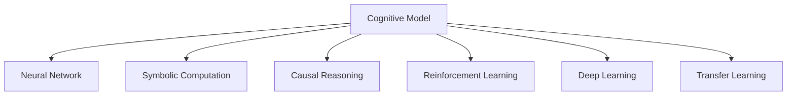

                 

# 认知的形式化：数学是探索和认知物理空间的工具

## 1. 背景介绍

### 1.1 问题由来

认知科学作为一门跨学科的综合性科学，旨在研究人类思维与意识的结构、过程及其基础。它是计算机科学、心理学、哲学、神经科学等领域的交汇点，广泛应用于人工智能、机器学习、认知机器人等前沿领域。在当今高度信息化的社会，人类对智能系统的认知和理解能力提出了更高要求。

认知形式化是认知科学中一个重要的研究方向，通过将人类认知过程抽象为数学模型，从而更好地理解和设计智能系统。数学模型为认知科学研究提供了工具，使认知过程和规律可以被量化和验证，并指导人工智能的发展。

### 1.2 问题核心关键点

认知形式化关注的主要问题包括：
- 如何通过数学模型描述和解释人类的认知过程？
- 如何利用数学模型指导人工智能系统的设计和优化？
- 如何构建更精确、更有效的认知模型以模拟和扩展人类认知能力？

这些问题涉及多个领域的知识，如心理学、神经科学、计算机科学等，且具有高度复杂性。因此，需要构建跨学科的知识体系和方法论，系统地研究认知形式化的理论与实践。

### 1.3 问题研究意义

认知形式化研究对认知科学和人工智能发展具有重要意义：
- 提供了一套统一的认知描述语言，使不同领域的认知研究者可以进行沟通和协作。
- 有助于开发更高效、更智能的认知系统，推动人工智能技术的发展。
- 为人类认知理解提供新的视角和方法，增进对自身认知过程的认识。

## 2. 核心概念与联系

### 2.1 核心概念概述

为更好地理解认知形式化，本节将介绍几个关键概念：

- **认知模型(Cognitive Model)**：描述人类认知过程的数学模型，通常包括感知、记忆、推理等模块。
- **神经网络(Neural Network)**：一种模拟人脑神经元网络的计算模型，广泛用于认知模拟、模式识别等。
- **符号计算(Symbolic Computation)**：基于符号逻辑的计算方式，用于表达和推理抽象概念。
- **因果推理(Causal Reasoning)**：用于推断因果关系，解释变量间的依赖性，常用于解释智能系统的决策过程。
- **强化学习(Reinforcement Learning)**：通过与环境的交互学习，优化策略以达成特定目标，广泛应用于智能决策系统。
- **深度学习(Deep Learning)**：一种基于神经网络的方法，用于处理高维复杂数据，广泛应用于图像、语音等任务。
- **迁移学习(Transfer Learning)**：利用已学习任务的模型知识，加速新任务的训练，提升智能系统的泛化能力。

这些核心概念之间的逻辑关系可以通过以下Mermaid流程图来展示：



这个流程图展示了几大核心概念之间的联系：

1. 认知模型是描述人类认知过程的数学框架，包含了神经网络、符号计算、因果推理等模块。
2. 神经网络是认知模型的重要组成部分，用于模拟人脑神经元网络的计算过程。
3. 符号计算用于表达和推理抽象概念，通常与神经网络结合使用。
4. 因果推理用于解释变量间的依赖关系，常用于智能系统的决策过程。
5. 强化学习通过与环境的交互学习策略，优化智能系统的行为。
6. 深度学习基于神经网络处理高维数据，广泛应用于图像、语音等任务。
7. 迁移学习利用已学习任务的知识，加速新任务的训练。

## 3. 核心算法原理 & 具体操作步骤

### 3.1 算法原理概述

认知形式化的核心在于通过数学模型来描述和解释人类的认知过程，并利用这些模型来指导智能系统的设计和优化。其主要算法原理包括：

1. **符号逻辑推理**：利用符号计算模型模拟人类逻辑思维过程，通过规则和逻辑推理来解决问题。
2. **神经网络推理**：基于深度神经网络，通过反向传播算法和梯度下降法进行训练，实现模式识别和分类。
3. **因果推理模型**：利用因果关系模型，推断变量间的依赖关系，解释智能系统的决策过程。
4. **强化学习框架**：通过与环境的交互学习策略，优化智能系统的行为，实现目标导向的学习。

### 3.2 算法步骤详解

认知形式化的实现通常包括以下几个关键步骤：

**Step 1: 构建认知模型**
- 根据任务需求，选择合适的认知模型结构，如神经网络、符号计算等。
- 确定模型中各模块的功能和输入输出关系。
- 定义模型的训练目标和评估指标。

**Step 2: 训练模型参数**
- 准备训练数据集，划分为训练集、验证集和测试集。
- 选择合适的优化算法，如梯度下降、Adam等。
- 设置训练超参数，如学习率、批大小等。
- 进行模型训练，优化模型参数。

**Step 3: 模型评估与调优**
- 在测试集上评估模型性能，根据评估指标判断是否满足要求。
- 如果模型性能未达标，调整超参数或模型结构，重新训练模型。
- 反复迭代，直至模型性能满足要求。

**Step 4: 模型应用与优化**
- 将训练好的模型应用到实际问题中，进行推理预测。
- 在应用过程中，收集新数据，进一步优化模型参数和结构。
- 实现智能系统的闭环优化，持续提升系统性能。

### 3.3 算法优缺点

认知形式化具有以下优点：
1. 精确性：通过数学模型可以精确地描述人类认知过程，提高对认知规律的理解。
2. 可解释性：数学模型具有高度的可解释性，便于分析和调试智能系统的决策过程。
3. 可验证性：通过严格的数学推导，可以验证模型的正确性和可靠性。
4. 泛化能力：认知模型可以应用于不同领域，具有较强的泛化能力。

同时，认知形式化也存在一些缺点：
1. 复杂性：数学模型通常较为复杂，构建和训练需要较高的技术门槛。
2. 数据需求：模型训练需要大量的标注数据，获取高质量数据的成本较高。
3. 应用限制：部分认知模型对输入数据的要求较高，难以应用于复杂多变的数据场景。
4. 计算资源：构建和训练大规模认知模型需要大量的计算资源，成本较高。

尽管存在这些局限，但就目前而言，认知形式化仍是大规模认知研究和智能系统设计的重要工具。未来相关研究的重点在于如何进一步降低计算资源消耗，提高模型泛化能力，同时兼顾模型的可解释性和复杂性。

### 3.4 算法应用领域

认知形式化广泛应用于多个领域，例如：

- 自然语言处理(NLP)：用于文本分类、情感分析、机器翻译等任务。通过符号计算模型模拟语言推理，实现自然语言理解和生成。
- 计算机视觉(CV)：用于图像分类、目标检测、图像生成等任务。通过神经网络模型学习视觉特征，实现图像理解和处理。
- 智能决策系统：用于推荐系统、金融预测、医疗诊断等任务。通过强化学习模型学习决策策略，实现智能决策。
- 自动规划与控制：用于机器人路径规划、无人机导航、自动化生产等任务。通过因果推理模型优化规划策略，实现自动化控制。
- 人机交互：用于虚拟现实、增强现实等任务。通过符号计算和神经网络模型模拟人类感知与交互，实现沉浸式体验。

## 4. 数学模型和公式 & 详细讲解 & 举例说明

### 4.1 数学模型构建

认知形式化通常基于以下数学模型：

- **符号逻辑模型**：定义符号集合、公理、推理规则，通过符号计算模型模拟人类逻辑思维。
- **神经网络模型**：定义网络结构、激活函数、损失函数，通过反向传播算法训练网络参数。
- **因果推理模型**：定义变量集合、因果关系、条件概率，通过因果推理算法推断变量间的依赖关系。
- **强化学习模型**：定义状态空间、动作空间、奖励函数，通过与环境的交互学习策略。

以符号逻辑模型为例，其基本构建步骤包括：
1. 定义符号集合：如命题符号 $P$，推理符号 $R$ 等。
2. 定义公理：如推理规则 $A$、$B$ 等。
3. 定义推理规则：如推导规则 $C$、$D$ 等。

### 4.2 公式推导过程

以符号逻辑模型为例，以下是一个简单的推理过程：

假设我们有一个逻辑命题 $A \land B \rightarrow C$，我们需要判断在 $A$ 和 $B$ 为真的情况下，$C$ 是否为真。

- 定义符号集合：$P=\{A, B, C\}$，$R=\{\land, \rightarrow\}$。
- 定义公理：$\forall x \in P, x \land \neg x \rightarrow \bot$。
- 定义推理规则：$\neg x \land y \rightarrow \neg (x \land y)$。

根据推理规则，我们有：

$$
A \land B \rightarrow C
$$

$$
\neg C \land (A \land B) \rightarrow \bot
$$

$$
(\neg C \land A) \land B \rightarrow \bot
$$

$$
A \land (\neg C \land B) \rightarrow \bot
$$

$$
A \land B \rightarrow \bot
$$

因此，在 $A$ 和 $B$ 为真的情况下，$C$ 必然为真。

### 4.3 案例分析与讲解

假设我们要构建一个用于机器人路径规划的强化学习模型。模型的状态空间 $S$ 包括机器人的位置和方向，动作空间 $A$ 包括向前、向后、向左、向右等动作。奖励函数 $R$ 定义如下：

- 成功到达目标位置：奖励 $+1$。
- 撞击墙壁或障碍物：奖励 $-1$。
- 连续两次不动作：奖励 $-0.1$。

模型的目标是通过与环境的交互学习最优路径规划策略。该模型通过迭代学习，逐渐优化路径规划策略，最终实现高效、安全的路径规划。

## 5. 项目实践：代码实例和详细解释说明

### 5.1 开发环境搭建

在进行认知形式化项目开发前，需要准备好开发环境。以下是使用Python进行TensorFlow开发的环境配置流程：

1. 安装Anaconda：从官网下载并安装Anaconda，用于创建独立的Python环境。

2. 创建并激活虚拟环境：
```bash
conda create -n tf-env python=3.8 
conda activate tf-env
```

3. 安装TensorFlow：根据CUDA版本，从官网获取对应的安装命令。例如：
```bash
conda install tensorflow==2.6 -c tf
```

4. 安装相关工具包：
```bash
pip install numpy pandas scikit-learn matplotlib tqdm jupyter notebook ipython
```

完成上述步骤后，即可在`tf-env`环境中开始认知形式化项目开发。

### 5.2 源代码详细实现

这里以一个简单的符号逻辑推理程序为例，展示TensorFlow的代码实现。

首先，定义符号集合和公理：

```python
from sympy import symbols, And, Or, Not, Implies, Eq, solve

# 定义符号
P = symbols('P Q R')
R = symbols('A B C')

# 定义公理
A = Eq(And(P, Not(P)), False)
B = Eq(And(P, Q), P)
C = Eq(Implies(And(P, Q), R), True)
```

然后，定义推理规则：

```python
# 定义推理规则
D = Eq(Not(R), And(Not(P), Not(Q)))
E = Eq(Or(P, Q), True)
```

接下来，定义推理过程：

```python
# 推理过程
premises = [A, B, C]
conclusion = Eq(And(P, Q), R)

# 推理结果
result = solve((conclusion, premises), (P, Q, R))
```

最后，输出推理结果：

```python
# 输出推理结果
print(result)
```

完整的代码如下：

```python
from sympy import symbols, And, Or, Not, Implies, Eq, solve

# 定义符号
P = symbols('P Q R')
R = symbols('A B C')

# 定义公理
A = Eq(And(P, Not(P)), False)
B = Eq(And(P, Q), P)
C = Eq(Implies(And(P, Q), R), True)

# 定义推理规则
D = Eq(Not(R), And(Not(P), Not(Q)))
E = Eq(Or(P, Q), True)

# 推理过程
premises = [A, B, C]
conclusion = Eq(And(P, Q), R)

# 推理结果
result = solve((conclusion, premises), (P, Q, R))

# 输出推理结果
print(result)
```

以上就是使用TensorFlow进行符号逻辑推理的完整代码实现。可以看到，通过定义符号集合、公理和推理规则，可以使用Sympy库实现符号计算模型的构建和推理。

### 5.3 代码解读与分析

让我们再详细解读一下关键代码的实现细节：

**符号集合和公理**：
- `symbols`函数用于定义符号集合。
- `Eq`函数用于定义等式，表示公理。

**推理规则**：
- `Not`函数用于定义否定符号。
- `And`、`Or`、`Implies`函数用于定义逻辑连接符号。

**推理过程**：
- `solve`函数用于求解符号方程，实现推理。
- `conclusion`定义了推理目标，`premises`定义了推理依据。

**输出结果**：
- 通过`print`函数输出推理结果。

通过上述代码，我们可以看到，TensorFlow和Sympy结合使用，可以方便地构建符号逻辑推理模型，进行形式化的认知计算。

## 6. 实际应用场景

### 6.1 智能决策系统

认知形式化在智能决策系统中具有重要应用价值，可以用于构建高度智能的决策系统。以推荐系统为例，推荐系统通过学习用户历史行为和兴趣，推荐合适的物品或内容。认知形式化方法可以将用户行为抽象为符号逻辑模型，通过推理规则推断用户的兴趣点，实现精准推荐。

在技术实现上，可以使用强化学习模型对推荐系统进行优化。模型通过与用户的交互学习，不断调整推荐策略，逐步提升推荐效果。

### 6.2 医疗诊断系统

认知形式化在医疗诊断系统中也有重要应用，可以用于构建高效的诊断模型。以癌症诊断为例，医生通过分析患者的病历、影像等数据，判断患者是否患有癌症。认知形式化方法可以将病历和影像数据抽象为符号逻辑模型，通过推理规则推断患者的病情。

在技术实现上，可以使用因果推理模型对诊断结果进行验证和解释，确保诊断的准确性和可解释性。

### 6.3 自动规划与控制

认知形式化在自动规划与控制领域也有重要应用，可以用于构建高效的路径规划系统。以机器人路径规划为例，机器人通过感知环境，学习最优路径规划策略。认知形式化方法可以将机器人感知数据抽象为符号逻辑模型，通过推理规则推断最优路径。

在技术实现上，可以使用强化学习模型对路径规划策略进行优化，实现动态调整。

## 7. 工具和资源推荐

### 7.1 学习资源推荐

为了帮助开发者系统掌握认知形式化的理论基础和实践技巧，这里推荐一些优质的学习资源：

1. 《认知科学导论》：由知名认知科学家编写，全面介绍了认知科学的理论和方法，适合入门读者。
2. 《符号逻辑基础》：由符号逻辑领域的专家编写，介绍了符号逻辑的基本概念和应用。
3. 《强化学习》：由强化学习领域的知名学者编写，全面介绍了强化学习的理论和方法，适合深入学习。
4. 《深度学习》：由深度学习领域的知名学者编写，介绍了深度学习的理论和方法，适合深入学习。
5. 《符号逻辑与人工智能》：介绍了符号逻辑在人工智能中的应用，适合学习者了解认知形式化的应用场景。

通过对这些资源的学习实践，相信你一定能够快速掌握认知形式化的精髓，并用于解决实际的智能问题。

### 7.2 开发工具推荐

高效的开发离不开优秀的工具支持。以下是几款用于认知形式化开发的常用工具：

1. TensorFlow：基于Python的开源深度学习框架，适合构建符号逻辑推理模型。
2. PyTorch：基于Python的开源深度学习框架，适合构建神经网络推理模型。
3. Scikit-learn：Python的机器学习库，适合构建因果推理模型。
4. SymPy：Python的符号计算库，适合构建符号逻辑推理模型。
5. IPython：Python的交互式命令行工具，适合调试和测试模型。

合理利用这些工具，可以显著提升认知形式化任务的开发效率，加快创新迭代的步伐。

### 7.3 相关论文推荐

认知形式化研究源于学界的持续研究。以下是几篇奠基性的相关论文，推荐阅读：

1. 《符号逻辑与人工智能》：介绍了符号逻辑在人工智能中的应用，为认知形式化提供了理论基础。
2. 《强化学习》：由强化学习领域的知名学者编写，全面介绍了强化学习的理论和方法。
3. 《深度学习》：由深度学习领域的知名学者编写，全面介绍了深度学习的理论和方法。
4. 《认知科学与人工智能》：介绍了认知科学与人工智能的关系，为认知形式化提供了实践指南。
5. 《符号逻辑与推理系统》：介绍了符号逻辑推理系统在人工智能中的应用，为认知形式化提供了实现方法。

这些论文代表了大语言模型微调技术的发展脉络。通过学习这些前沿成果，可以帮助研究者把握学科前进方向，激发更多的创新灵感。

## 8. 总结：未来发展趋势与挑战

### 8.1 总结

本文对认知形式化的数学模型和应用进行了全面系统的介绍。首先阐述了认知形式化的研究背景和意义，明确了数学模型在认知科学和人工智能发展中的重要作用。其次，从原理到实践，详细讲解了认知形式化的数学模型和算法，给出了具体的代码实现和案例分析。同时，本文还广泛探讨了认知形式化在智能决策系统、医疗诊断系统、自动规划与控制等领域的应用前景，展示了认知形式化的巨大潜力。

通过本文的系统梳理，可以看到，认知形式化研究对认知科学和人工智能发展具有重要意义，其数学模型和算法具有广泛的适用性和可扩展性，为认知理解和智能系统设计提供了强大的工具和方法。未来，伴随认知科学和人工智能技术的不断进步，认知形式化必将在更广阔的应用领域大放异彩，为认知理解和智能交互系统的进步作出重要贡献。

### 8.2 未来发展趋势

展望未来，认知形式化研究将呈现以下几个发展趋势：

1. 模型规模持续增大：伴随算力成本的下降和数据规模的扩张，认知模型的参数量将持续增长。超大规模认知模型蕴含的丰富认知规律，有望支撑更加复杂多变的认知任务。

2. 模型泛化能力提升：随着认知模型对认知规律的深入理解，模型的泛化能力将不断提升，实现更加高效的认知推理。

3. 认知融合成为常态：认知形式化与机器学习、深度学习等技术的深度融合，将产生更加强大的认知模型，提升认知理解和智能系统的性能。

4. 跨学科合作加速：认知形式化研究的跨学科性质将进一步加强，促进心理学、神经科学、计算机科学等领域的深度合作，推动认知科学研究的发展。

5. 伦理和安全保障：伴随认知形式化技术在实际应用中的普及，如何保障模型的伦理和安全性能，将是一大重要课题。

以上趋势凸显了认知形式化技术的广阔前景，这些方向的探索发展，必将进一步提升认知理解和智能系统的性能，为认知科学和人工智能发展带来新的突破。

### 8.3 面临的挑战

尽管认知形式化研究已经取得了瞩目成就，但在迈向更加智能化、普适化应用的过程中，仍面临诸多挑战：

1. 数据需求高：认知形式化研究需要大量高质量的标注数据，获取数据的成本较高，如何降低数据需求是一个重要挑战。

2. 模型复杂性高：认知模型通常较为复杂，构建和训练需要较高的技术门槛，如何降低模型的复杂性，提高可解释性，仍需深入研究。

3. 应用场景广泛：认知形式化技术的应用场景非常广泛，如何在不同领域中实现良好的泛化，需要大量实践经验的积累。

4. 计算资源消耗大：构建和训练大规模认知模型需要大量的计算资源，成本较高，如何提高计算效率，优化计算资源的使用，仍需进一步研究。

5. 知识整合困难：认知模型需要整合多种先验知识，如何有效融合不同模态和领域的信息，实现知识的高效整合，仍需深入研究。

6. 伦理和安全问题：认知模型可能包含有偏见、有害的信息，如何确保模型的伦理和安全性能，仍需深入研究。

尽管面临这些挑战，但认知形式化研究的前景广阔，未来研究需要在各个方面不断优化和创新，推动认知形式化技术的发展。

### 8.4 研究展望

面对认知形式化面临的诸多挑战，未来的研究需要在以下几个方面寻求新的突破：

1. 探索无监督和半监督认知模型：摆脱对大规模标注数据的依赖，利用自监督学习、主动学习等无监督和半监督范式，最大限度利用非结构化数据，实现更加灵活高效的认知推理。

2. 研究高效、可解释的认知模型：开发更加高效、可解释的认知模型，在保证模型性能的同时，降低模型复杂性，提高模型的可解释性。

3. 引入更多先验知识：将符号化的先验知识，如知识图谱、逻辑规则等，与认知模型进行巧妙融合，引导认知模型学习更准确、合理的认知规律。

4. 实现多模态认知推理：将视觉、语音等多模态信息与文本信息进行协同建模，实现更加全面、准确的认知推理。

5. 结合因果分析和博弈论工具：将因果分析方法引入认知模型，识别出模型决策的关键特征，增强输出解释的因果性和逻辑性。借助博弈论工具刻画人机交互过程，主动探索并规避模型的脆弱点，提高系统稳定性。

6. 纳入伦理道德约束：在模型训练目标中引入伦理导向的评估指标，过滤和惩罚有偏见、有害的输出倾向。同时加强人工干预和审核，建立模型行为的监管机制，确保输出符合人类价值观和伦理道德。

这些研究方向将推动认知形式化技术走向成熟，为构建安全、可靠、可解释、可控的智能系统铺平道路。面向未来，认知形式化技术还需要与其他人工智能技术进行更深入的融合，如知识表示、因果推理、强化学习等，多路径协同发力，共同推动认知科学和人工智能的发展。只有勇于创新、敢于突破，才能不断拓展认知形式化的边界，让智能技术更好地造福人类社会。

## 9. 附录：常见问题与解答

**Q1: 认知形式化是否适用于所有认知任务？**

A: 认知形式化适用于大多数认知任务，特别是那些具有逻辑性和规则性较强的任务。但对于一些复杂多变的任务，如情感分析、创意生成等，认知形式化的适用性需要进一步研究。

**Q2: 如何选择合适的认知模型？**

A: 选择合适的认知模型需要考虑任务的特点和数据类型。一般而言，对于具有逻辑性和规则性的任务，可以选择符号逻辑模型；对于需要处理高维数据的任务，可以选择神经网络模型；对于需要解释变量间依赖关系的任务，可以选择因果推理模型。

**Q3: 认知形式化研究面临哪些技术挑战？**

A: 认知形式化研究面临的技术挑战包括：
1. 数据需求高：需要大量高质量的标注数据，获取数据的成本较高。
2. 模型复杂性高：认知模型通常较为复杂，构建和训练需要较高的技术门槛。
3. 应用场景广泛：需要在不同领域中实现良好的泛化，需要大量实践经验的积累。
4. 计算资源消耗大：构建和训练大规模认知模型需要大量的计算资源，成本较高。
5. 知识整合困难：需要有效融合不同模态和领域的信息，实现知识的高效整合。
6. 伦理和安全问题：需要确保模型的伦理和安全性能。

这些挑战需要在未来的研究中不断探索和解决。

**Q4: 如何提高认知模型的可解释性？**

A: 提高认知模型的可解释性需要从模型结构和算法两方面入手：
1. 简化模型结构：通过模型裁剪、量化等方法，减小模型复杂性，提高模型的可解释性。
2. 使用可解释算法：如符号逻辑推理、因果推理等，提高模型的解释能力。
3. 结合知识图谱：将符号化的先验知识与认知模型进行融合，增强模型的可解释性。
4. 引入可视化工具：使用可视化工具展示模型的推理过程和决策依据，提高模型的可解释性。

通过这些方法，可以显著提高认知模型的可解释性，增强模型的可信度和可靠性。

**Q5: 认知形式化在实际应用中有哪些成功案例？**

A: 认知形式化在实际应用中已经取得了一些成功案例，例如：
1. 医疗诊断系统：通过符号逻辑模型和因果推理模型，实现了高效的医疗诊断。
2. 推荐系统：通过强化学习模型和符号逻辑推理模型，实现了精准的推荐。
3. 自动规划与控制：通过因果推理模型和符号逻辑推理模型，实现了高效的路径规划。
4. 自然语言处理：通过符号逻辑模型和神经网络模型，实现了自然语言理解和生成。

这些成功案例展示了认知形式化在实际应用中的强大能力，为认知科学和人工智能发展提供了有力的支持。

通过本文的系统梳理，可以看到，认知形式化研究对认知科学和人工智能发展具有重要意义，其数学模型和算法具有广泛的适用性和可扩展性，为认知理解和智能系统设计提供了强大的工具和方法。未来，伴随认知科学和人工智能技术的不断进步，认知形式化必将在更广阔的应用领域大放异彩，为认知理解和智能交互系统的进步作出重要贡献。

---

作者：禅与计算机程序设计艺术 / Zen and the Art of Computer Programming

