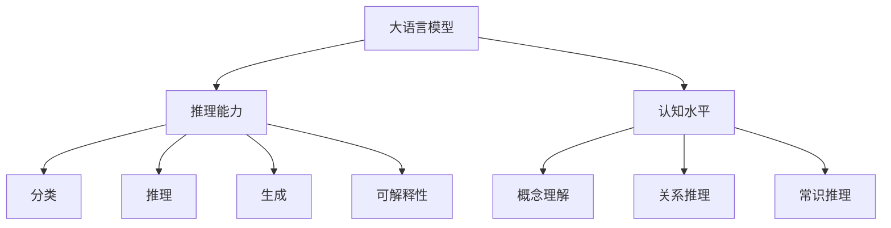

                 

# 语言与推理：大模型的认知瓶颈

> 关键词：大语言模型,认知瓶颈,推理机制,认知水平,神经网络

## 1. 背景介绍

### 1.1 问题由来

随着深度学习技术的飞速发展，大语言模型（Large Language Models, LLMs）在自然语言处理（Natural Language Processing, NLP）领域取得了巨大成功。这些模型通过在海量文本数据上进行自监督预训练，能够学习到丰富的语言知识和常识。然而，尽管这些模型在许多任务上取得了突破性的进展，但它们在推理和认知理解上依然存在一些瓶颈，限制了其应用潜力。

### 1.2 问题核心关键点

大语言模型的瓶颈主要集中在推理能力和认知水平上，表现为：
- **推理能力不足**：模型在处理某些任务时，特别是需要复杂逻辑推理的任务上，表现不佳。
- **认知水平有限**：模型往往难以理解文本背后的深层含义和复杂概念。
- **推理机制不透明**：模型的推理过程难以解释和调试，缺乏可解释性。

这些瓶颈直接影响了模型在现实世界的应用效果和可信度。因此，理解并突破大模型的认知瓶颈，成为当前NLP领域的重要研究方向。

## 2. 核心概念与联系

### 2.1 核心概念概述

为更好地理解大模型的认知瓶颈，本节将介绍几个关键概念：

- **大语言模型（LLMs）**：指通过大规模无标签文本数据进行预训练，具备强大语言理解和生成能力的深度学习模型。例如GPT-3、BERT等。
- **推理能力**：指模型处理和解决逻辑推理任务的能力，如推理、分类、生成等。
- **认知水平**：指模型理解、记忆和运用复杂知识的能力，包括概念理解、关系推理、常识推理等。
- **神经网络**：大模型采用的主要模型架构，由神经元和连接组成，通过多层非线性变换学习数据特征。
- **可解释性**：指模型的推理和决策过程可以被理解、解释和验证。

这些概念之间的逻辑关系可以通过以下Mermaid流程图来展示：



这个流程图展示了各个概念之间的联系：

1. 大语言模型通过预训练获得基础知识。
2. 推理能力是通过任务适配层和损失函数实现的。
3. 认知水平由模型理解复杂概念和关系的能力体现。
4. 可解释性是通过模型的透明度和解释技术实现的。

## 3. 核心算法原理 & 具体操作步骤

### 3.1 算法原理概述

大语言模型的认知瓶颈问题可以通过对模型推理机制和认知水平的分析来解决。推理能力不足通常表现为模型无法正确处理逻辑和语义复杂性，而认知水平有限则反映在模型无法充分理解任务的背景知识和上下文信息。

大语言模型通常是基于神经网络架构，通过多层非线性变换来学习输入数据的特征表示。其推理过程可以理解为通过网络结构对输入数据的逐步处理和转化。

### 3.2 算法步骤详解

1. **数据预处理**：收集和标注适用于特定任务的训练数据，通常包含各种不同的输入输出格式。
2. **模型初始化**：加载预训练的大语言模型作为初始参数。
3. **任务适配层设计**：根据任务类型，在模型顶层添加合适的输出层和损失函数，例如分类任务使用Softmax，生成任务使用负对数似然损失。
4. **微调训练**：使用标注数据对模型进行微调，通过梯度下降等优化算法更新模型参数，最小化损失函数。
5. **性能评估**：在验证集和测试集上评估模型性能，根据性能指标调整训练策略。
6. **推理和解释**：利用微调后的模型进行推理，并通过可解释性技术（如attention机制、probabilistic softmax等）解释模型的推理过程。

### 3.3 算法优缺点

基于神经网络的大语言模型具有以下优点：
- **强大的学习能力**：可以通过海量的无标签数据进行预训练，学习到丰富的语言知识。
- **泛化能力强**：在训练集上学习到的知识可以迁移到测试集上，表现良好。
- **高可扩展性**：可以通过微调和迁移学习适应不同的任务需求。

同时，也存在以下缺点：
- **推理能力有限**：模型难以理解复杂逻辑关系，处理推理任务时容易出现错误。
- **认知水平受限**：模型难以理解和应用复杂概念和知识，无法处理复杂任务。
- **可解释性差**：模型的推理过程和决策难以解释，缺乏透明性和可理解性。

### 3.4 算法应用领域

大语言模型的认知瓶颈问题在NLP领域的多个任务上均有体现，如：

- **问答系统**：模型需要理解和推理用户问题，但常常因缺乏上下文理解而回答错误。
- **情感分析**：模型难以理解文本背后的深层情感，容易出现误判。
- **机器翻译**：模型难以正确处理长句子中的复杂逻辑，导致翻译错误。
- **文本摘要**：模型难以理解文本的重点和结构，生成的摘要往往不够准确。

这些应用场景都要求大语言模型具备较强的推理能力和认知水平，才能更好地完成任务。

## 4. 数学模型和公式 & 详细讲解

### 4.1 数学模型构建

大语言模型的认知瓶颈问题可以通过以下数学模型来描述：

假设模型输入为文本 $x$，输出为推理结果 $y$。模型的推理过程可以表示为一个多层神经网络，每一层都通过非线性变换对输入进行转换。设模型共有 $N$ 层，每一层的参数分别为 $\theta_i$，则模型的输出可以表示为：

$$ y = f^{(N)}(f^{(N-1)}(\ldots f^{(1)}(x;\theta_1)\ldots);\theta_N) $$

其中 $f^{(i)}(\cdot)$ 表示第 $i$ 层的前向传播过程。

### 4.2 公式推导过程

推理能力的瓶颈主要在于模型难以处理复杂逻辑和语义关系。以文本分类任务为例，模型的输出为文本所属的类别 $y$，假设使用softmax作为损失函数，则损失函数可以表示为：

$$ \mathcal{L} = -\sum_{i=1}^C y_i \log \hat{y_i} $$

其中 $C$ 为类别数，$y_i$ 为真实类别标签，$\hat{y_i}$ 为模型预测的概率。

推理能力的提升可以通过改进模型结构和使用先进的训练技术来实现。例如，通过增加深度和宽度来增强模型的表达能力，或使用注意力机制（Attention）来增强模型对输入中重要信息的关注。

### 4.3 案例分析与讲解

以情感分析为例，模型需要理解文本中的情感倾向。假设模型使用BERT作为预训练模型，在微调时可以使用如下方法：

1. **数据预处理**：将文本转化为BERT的输入格式，并对情感标签进行标注。
2. **模型初始化**：加载预训练的BERT模型作为初始参数。
3. **任务适配层设计**：在BERT的顶层添加一个全连接层，使用softmax作为输出层，分类情感类别。
4. **微调训练**：使用标注数据对模型进行微调，通过梯度下降等优化算法更新模型参数，最小化损失函数。
5. **性能评估**：在验证集和测试集上评估模型性能，根据性能指标调整训练策略。
6. **推理和解释**：利用微调后的模型进行情感分类，并通过注意力机制解释模型对文本中情感词的关注程度。

## 5. 项目实践：代码实例和详细解释说明

### 5.1 开发环境搭建

在进行微调实践前，我们需要准备好开发环境。以下是使用Python进行PyTorch开发的环境配置流程：

1. 安装Anaconda：从官网下载并安装Anaconda，用于创建独立的Python环境。

2. 创建并激活虚拟环境：
```bash
conda create -n pytorch-env python=3.8 
conda activate pytorch-env
```

3. 安装PyTorch：根据CUDA版本，从官网获取对应的安装命令。例如：
```bash
conda install pytorch torchvision torchaudio cudatoolkit=11.1 -c pytorch -c conda-forge
```

4. 安装Transformers库：
```bash
pip install transformers
```

5. 安装各类工具包：
```bash
pip install numpy pandas scikit-learn matplotlib tqdm jupyter notebook ipython
```

完成上述步骤后，即可在`pytorch-env`环境中开始微调实践。

### 5.2 源代码详细实现

这里我们以情感分析任务为例，给出使用Transformers库对BERT模型进行微调的PyTorch代码实现。

首先，定义情感分析任务的数据处理函数：

```python
from transformers import BertTokenizer
from torch.utils.data import Dataset
import torch

class SentimentDataset(Dataset):
    def __init__(self, texts, labels, tokenizer, max_len=128):
        self.texts = texts
        self.labels = labels
        self.tokenizer = tokenizer
        self.max_len = max_len
        
    def __len__(self):
        return len(self.texts)
    
    def __getitem__(self, item):
        text = self.texts[item]
        label = self.labels[item]
        
        encoding = self.tokenizer(text, return_tensors='pt', max_length=self.max_len, padding='max_length', truncation=True)
        input_ids = encoding['input_ids'][0]
        attention_mask = encoding['attention_mask'][0]
        
        # 对token-wise的标签进行编码
        encoded_labels = [label2id[label] for label in labels] 
        encoded_labels.extend([label2id['neutral']] * (self.max_len - len(encoded_labels)))
        labels = torch.tensor(encoded_labels, dtype=torch.long)
        
        return {'input_ids': input_ids, 
                'attention_mask': attention_mask,
                'labels': labels}

# 标签与id的映射
label2id = {'positive': 1, 'negative': 0, 'neutral': 2}
id2label = {v: k for k, v in label2id.items()}

# 创建dataset
tokenizer = BertTokenizer.from_pretrained('bert-base-cased')

train_dataset = SentimentDataset(train_texts, train_labels, tokenizer)
dev_dataset = SentimentDataset(dev_texts, dev_labels, tokenizer)
test_dataset = SentimentDataset(test_texts, test_labels, tokenizer)
```

然后，定义模型和优化器：

```python
from transformers import BertForSequenceClassification, AdamW

model = BertForSequenceClassification.from_pretrained('bert-base-cased', num_labels=len(label2id))

optimizer = AdamW(model.parameters(), lr=2e-5)
```

接着，定义训练和评估函数：

```python
from torch.utils.data import DataLoader
from tqdm import tqdm
from sklearn.metrics import classification_report

device = torch.device('cuda') if torch.cuda.is_available() else torch.device('cpu')
model.to(device)

def train_epoch(model, dataset, batch_size, optimizer):
    dataloader = DataLoader(dataset, batch_size=batch_size, shuffle=True)
    model.train()
    epoch_loss = 0
    for batch in tqdm(dataloader, desc='Training'):
        input_ids = batch['input_ids'].to(device)
        attention_mask = batch['attention_mask'].to(device)
        labels = batch['labels'].to(device)
        model.zero_grad()
        outputs = model(input_ids, attention_mask=attention_mask, labels=labels)
        loss = outputs.loss
        epoch_loss += loss.item()
        loss.backward()
        optimizer.step()
    return epoch_loss / len(dataloader)

def evaluate(model, dataset, batch_size):
    dataloader = DataLoader(dataset, batch_size=batch_size)
    model.eval()
    preds, labels = [], []
    with torch.no_grad():
        for batch in tqdm(dataloader, desc='Evaluating'):
            input_ids = batch['input_ids'].to(device)
            attention_mask = batch['attention_mask'].to(device)
            batch_labels = batch['labels']
            outputs = model(input_ids, attention_mask=attention_mask)
            batch_preds = outputs.logits.argmax(dim=1).to('cpu').tolist()
            batch_labels = batch_labels.to('cpu').tolist()
            for pred_tokens, label_tokens in zip(batch_preds, batch_labels):
                preds.append(pred_tokens[:len(label_tokens)])
                labels.append(label_tokens)
                
    print(classification_report(labels, preds))
```

最后，启动训练流程并在测试集上评估：

```python
epochs = 5
batch_size = 16

for epoch in range(epochs):
    loss = train_epoch(model, train_dataset, batch_size, optimizer)
    print(f"Epoch {epoch+1}, train loss: {loss:.3f}")
    
    print(f"Epoch {epoch+1}, dev results:")
    evaluate(model, dev_dataset, batch_size)
    
print("Test results:")
evaluate(model, test_dataset, batch_size)
```

以上就是使用PyTorch对BERT进行情感分析任务微调的完整代码实现。可以看到，得益于Transformers库的强大封装，我们可以用相对简洁的代码完成BERT模型的加载和微调。

### 5.3 代码解读与分析

让我们再详细解读一下关键代码的实现细节：

**SentimentDataset类**：
- `__init__`方法：初始化文本、标签、分词器等关键组件。
- `__len__`方法：返回数据集的样本数量。
- `__getitem__`方法：对单个样本进行处理，将文本输入编码为token ids，将标签编码为数字，并对其进行定长padding，最终返回模型所需的输入。

**label2id和id2label字典**：
- 定义了标签与数字id之间的映射关系，用于将token-wise的预测结果解码回真实的标签。

**训练和评估函数**：
- 使用PyTorch的DataLoader对数据集进行批次化加载，供模型训练和推理使用。
- 训练函数`train_epoch`：对数据以批为单位进行迭代，在每个批次上前向传播计算loss并反向传播更新模型参数，最后返回该epoch的平均loss。
- 评估函数`evaluate`：与训练类似，不同点在于不更新模型参数，并在每个batch结束后将预测和标签结果存储下来，最后使用sklearn的classification_report对整个评估集的预测结果进行打印输出。

**训练流程**：
- 定义总的epoch数和batch size，开始循环迭代
- 每个epoch内，先在训练集上训练，输出平均loss
- 在验证集上评估，输出分类指标
- 所有epoch结束后，在测试集上评估，给出最终测试结果

可以看到，PyTorch配合Transformers库使得BERT微调的代码实现变得简洁高效。开发者可以将更多精力放在数据处理、模型改进等高层逻辑上，而不必过多关注底层的实现细节。

当然，工业级的系统实现还需考虑更多因素，如模型的保存和部署、超参数的自动搜索、更灵活的任务适配层等。但核心的微调范式基本与此类似。

## 6. 实际应用场景

### 6.1 智能客服系统

基于大语言模型微调的对话技术，可以广泛应用于智能客服系统的构建。传统客服往往需要配备大量人力，高峰期响应缓慢，且一致性和专业性难以保证。而使用微调后的对话模型，可以7x24小时不间断服务，快速响应客户咨询，用自然流畅的语言解答各类常见问题。

在技术实现上，可以收集企业内部的历史客服对话记录，将问题和最佳答复构建成监督数据，在此基础上对预训练对话模型进行微调。微调后的对话模型能够自动理解用户意图，匹配最合适的答案模板进行回复。对于客户提出的新问题，还可以接入检索系统实时搜索相关内容，动态组织生成回答。如此构建的智能客服系统，能大幅提升客户咨询体验和问题解决效率。

### 6.2 金融舆情监测

金融机构需要实时监测市场舆论动向，以便及时应对负面信息传播，规避金融风险。传统的人工监测方式成本高、效率低，难以应对网络时代海量信息爆发的挑战。基于大语言模型微调的文本分类和情感分析技术，为金融舆情监测提供了新的解决方案。

具体而言，可以收集金融领域相关的新闻、报道、评论等文本数据，并对其进行主题标注和情感标注。在此基础上对预训练语言模型进行微调，使其能够自动判断文本属于何种主题，情感倾向是正面、中性还是负面。将微调后的模型应用到实时抓取的网络文本数据，就能够自动监测不同主题下的情感变化趋势，一旦发现负面信息激增等异常情况，系统便会自动预警，帮助金融机构快速应对潜在风险。

### 6.3 个性化推荐系统

当前的推荐系统往往只依赖用户的历史行为数据进行物品推荐，无法深入理解用户的真实兴趣偏好。基于大语言模型微调技术，个性化推荐系统可以更好地挖掘用户行为背后的语义信息，从而提供更精准、多样的推荐内容。

在实践中，可以收集用户浏览、点击、评论、分享等行为数据，提取和用户交互的物品标题、描述、标签等文本内容。将文本内容作为模型输入，用户的后续行为（如是否点击、购买等）作为监督信号，在此基础上微调预训练语言模型。微调后的模型能够从文本内容中准确把握用户的兴趣点。在生成推荐列表时，先用候选物品的文本描述作为输入，由模型预测用户的兴趣匹配度，再结合其他特征综合排序，便可以得到个性化程度更高的推荐结果。

### 6.4 未来应用展望

随着大语言模型和微调方法的不断发展，基于微调范式将在更多领域得到应用，为传统行业带来变革性影响。

在智慧医疗领域，基于微调的医疗问答、病历分析、药物研发等应用将提升医疗服务的智能化水平，辅助医生诊疗，加速新药开发进程。

在智能教育领域，微调技术可应用于作业批改、学情分析、知识推荐等方面，因材施教，促进教育公平，提高教学质量。

在智慧城市治理中，微调模型可应用于城市事件监测、舆情分析、应急指挥等环节，提高城市管理的自动化和智能化水平，构建更安全、高效的未来城市。

此外，在企业生产、社会治理、文娱传媒等众多领域，基于大模型微调的人工智能应用也将不断涌现，为经济社会发展注入新的动力。相信随着预训练语言模型和微调方法的持续演进，微调方法将成为人工智能落地应用的重要范式，推动人工智能技术在垂直行业的规模化落地。总之，微调需要开发者根据具体任务，不断迭代和优化模型、数据和算法，方能得到理想的效果。

## 7. 工具和资源推荐

### 7.1 学习资源推荐

为了帮助开发者系统掌握大语言模型微调的理论基础和实践技巧，这里推荐一些优质的学习资源：

1. 《Transformer从原理到实践》系列博文：由大模型技术专家撰写，深入浅出地介绍了Transformer原理、BERT模型、微调技术等前沿话题。

2. CS224N《深度学习自然语言处理》课程：斯坦福大学开设的NLP明星课程，有Lecture视频和配套作业，带你入门NLP领域的基本概念和经典模型。

3. 《Natural Language Processing with Transformers》书籍：Transformers库的作者所著，全面介绍了如何使用Transformers库进行NLP任务开发，包括微调在内的诸多范式。

4. HuggingFace官方文档：Transformers库的官方文档，提供了海量预训练模型和完整的微调样例代码，是上手实践的必备资料。

5. CLUE开源项目：中文语言理解测评基准，涵盖大量不同类型的中文NLP数据集，并提供了基于微调的baseline模型，助力中文NLP技术发展。

通过对这些资源的学习实践，相信你一定能够快速掌握大语言模型微调的精髓，并用于解决实际的NLP问题。
###  7.2 开发工具推荐

高效的开发离不开优秀的工具支持。以下是几款用于大语言模型微调开发的常用工具：

1. PyTorch：基于Python的开源深度学习框架，灵活动态的计算图，适合快速迭代研究。大部分预训练语言模型都有PyTorch版本的实现。

2. TensorFlow：由Google主导开发的开源深度学习框架，生产部署方便，适合大规模工程应用。同样有丰富的预训练语言模型资源。

3. Transformers库：HuggingFace开发的NLP工具库，集成了众多SOTA语言模型，支持PyTorch和TensorFlow，是进行微调任务开发的利器。

4. Weights & Biases：模型训练的实验跟踪工具，可以记录和可视化模型训练过程中的各项指标，方便对比和调优。与主流深度学习框架无缝集成。

5. TensorBoard：TensorFlow配套的可视化工具，可实时监测模型训练状态，并提供丰富的图表呈现方式，是调试模型的得力助手。

6. Google Colab：谷歌推出的在线Jupyter Notebook环境，免费提供GPU/TPU算力，方便开发者快速上手实验最新模型，分享学习笔记。

合理利用这些工具，可以显著提升大语言模型微调任务的开发效率，加快创新迭代的步伐。

### 7.3 相关论文推荐

大语言模型和微调技术的发展源于学界的持续研究。以下是几篇奠基性的相关论文，推荐阅读：

1. Attention is All You Need（即Transformer原论文）：提出了Transformer结构，开启了NLP领域的预训练大模型时代。

2. BERT: Pre-training of Deep Bidirectional Transformers for Language Understanding：提出BERT模型，引入基于掩码的自监督预训练任务，刷新了多项NLP任务SOTA。

3. Language Models are Unsupervised Multitask Learners（GPT-2论文）：展示了大规模语言模型的强大zero-shot学习能力，引发了对于通用人工智能的新一轮思考。

4. Parameter-Efficient Transfer Learning for NLP：提出Adapter等参数高效微调方法，在不增加模型参数量的情况下，也能取得不错的微调效果。

5. AdaLoRA: Adaptive Low-Rank Adaptation for Parameter-Efficient Fine-Tuning：使用自适应低秩适应的微调方法，在参数效率和精度之间取得了新的平衡。

这些论文代表了大语言模型微调技术的发展脉络。通过学习这些前沿成果，可以帮助研究者把握学科前进方向，激发更多的创新灵感。

## 8. 总结：未来发展趋势与挑战

### 8.1 总结

本文对大语言模型微调中存在的认知瓶颈问题进行了全面系统的介绍。首先阐述了大语言模型在推理和认知上的不足，明确了推理能力和认知水平对模型性能的重要影响。其次，从原理到实践，详细讲解了推理和认知的数学模型和算法步骤，给出了微调任务开发的完整代码实例。同时，本文还广泛探讨了微调方法在多个行业领域的应用前景，展示了微调范式的巨大潜力。此外，本文精选了微调技术的各类学习资源，力求为读者提供全方位的技术指引。

通过本文的系统梳理，可以看到，大语言模型微调中推理和认知瓶颈问题的解决需要全面优化模型结构、训练策略和应用场景。未来，随着技术的发展和研究的深入，这些问题将逐渐被克服，大语言模型微调技术必将迎来更加广泛的应用和更深的落地价值。

### 8.2 未来发展趋势

展望未来，大语言模型微调技术将呈现以下几个发展趋势：

1. **模型结构优化**：通过改进模型结构（如增加注意力机制、引入残差连接等），增强模型的表达能力和推理能力。
2. **训练技术创新**：引入自适应学习率、对抗训练、梯度裁剪等技术，提升模型的稳定性和泛化能力。
3. **知识图谱整合**：将符号化的先验知识与神经网络模型进行融合，引导模型学习更准确的语言表征。
4. **多模态融合**：将视觉、语音等多模态信息与文本信息结合，实现更全面、准确的信息整合能力。
5. **认知层次提升**：通过引入符号推理、因果推断等技术，增强模型对复杂概念的理解和应用能力。
6. **可解释性增强**：通过引入可解释性技术（如attention机制、规则推理等），提高模型的透明性和可理解性。

以上趋势凸显了大语言模型微调技术的广阔前景。这些方向的探索发展，必将进一步提升模型的推理和认知能力，为构建安全、可靠、可解释、可控的智能系统铺平道路。

### 8.3 面临的挑战

尽管大语言模型微调技术已经取得了显著进展，但在迈向更加智能化、普适化应用的过程中，仍面临诸多挑战：

1. **推理能力不足**：模型在处理复杂逻辑和语义关系时，表现不佳，需要进一步优化推理机制。
2. **认知水平有限**：模型难以理解和应用复杂概念和知识，需要引入更多先验知识。
3. **可解释性差**：模型的推理过程难以解释，缺乏透明性和可理解性。
4. **数据质量瓶颈**：微调效果依赖于高质量标注数据，但标注成本高昂，需要寻找更多无监督或半监督学习方法。
5. **计算资源限制**：模型参数量庞大，计算资源消耗大，需要优化模型结构和计算图。

正视这些挑战，积极应对并寻求突破，将是大语言模型微调技术走向成熟的必由之路。相信随着学界和产业界的共同努力，这些问题终将逐一被克服，大语言模型微调技术必将在构建智能系统、服务现实世界中发挥更大的作用。

### 8.4 研究展望

未来研究需要在以下几个方向寻求新的突破：

1. **多模态学习**：将视觉、语音等多模态信息与文本信息结合，实现更全面、准确的信息整合能力。
2. **可解释性增强**：通过引入可解释性技术（如attention机制、规则推理等），提高模型的透明性和可理解性。
3. **知识图谱整合**：将符号化的先验知识与神经网络模型进行融合，引导模型学习更准确的语言表征。
4. **认知层次提升**：通过引入符号推理、因果推断等技术，增强模型对复杂概念的理解和应用能力。
5. **自适应学习**：引入自适应学习率、对抗训练、梯度裁剪等技术，提升模型的稳定性和泛化能力。
6. **知识图谱整合**：将符号化的先验知识与神经网络模型进行融合，引导模型学习更准确的语言表征。

这些研究方向的探索，必将引领大语言模型微调技术迈向更高的台阶，为构建安全、可靠、可解释、可控的智能系统铺平道路。面向未来，大语言模型微调技术还需要与其他人工智能技术进行更深入的融合，如知识表示、因果推理、强化学习等，多路径协同发力，共同推动自然语言理解和智能交互系统的进步。只有勇于创新、敢于突破，才能不断拓展语言模型的边界，让智能技术更好地造福人类社会。

## 9. 附录：常见问题与解答

**Q1：大语言模型微调中如何提升推理能力？**

A: 提升推理能力可以通过以下方法实现：
1. **增加深度和宽度**：通过增加模型层数和神经元数量，增强模型的表达能力。
2. **引入注意力机制**：通过attention机制，模型能够关注输入中的重要信息，提升推理效果。
3. **使用预训练语言模型**：如GPT、BERT等，这些模型在预训练过程中已经学习到了丰富的语言知识，可以通过微调进一步提升推理能力。

**Q2：大语言模型在微调过程中如何增强认知水平？**

A: 增强认知水平可以通过以下方法实现：
1. **引入更多先验知识**：将符号化的先验知识与神经网络模型进行融合，引导模型学习更准确的语言表征。
2. **多模态融合**：将视觉、语音等多模态信息与文本信息结合，实现更全面、准确的信息整合能力。
3. **知识图谱整合**：将符号化的先验知识与神经网络模型进行融合，引导模型学习更准确的语言表征。

**Q3：大语言模型微调中如何增强可解释性？**

A: 增强可解释性可以通过以下方法实现：
1. **引入可解释性技术**：如attention机制、规则推理等，提高模型的透明性和可理解性。
2. **模型可视化**：通过可视化工具展示模型的内部工作机制，帮助理解模型的决策过程。
3. **特征解释**：通过解释模型中的关键特征，提高模型的可理解性。

**Q4：大语言模型微调中如何降低计算资源消耗？**

A: 降低计算资源消耗可以通过以下方法实现：
1. **模型裁剪**：去除不必要的层和参数，减小模型尺寸，加快推理速度。
2. **量化加速**：将浮点模型转为定点模型，压缩存储空间，提高计算效率。
3. **混合精度训练**：使用混合精度训练，减少计算资源消耗。

这些技术优化方法可以在保证模型性能的同时，显著降低计算资源消耗，提升模型的实用性和可扩展性。

---

作者：禅与计算机程序设计艺术 / Zen and the Art of Computer Programming

