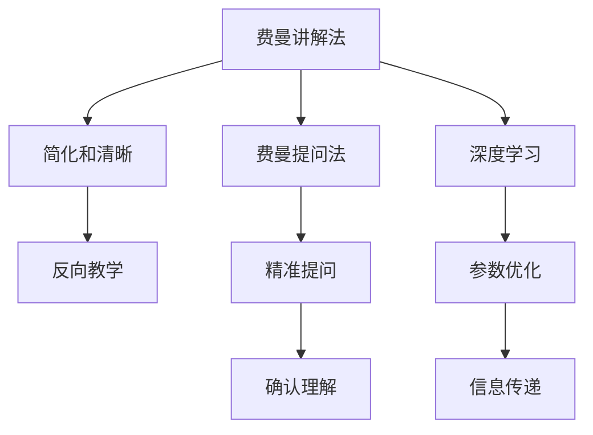

                 

# 费曼提问法在团队沟通中的应用

## 1. 背景介绍

### 1.1 问题由来

在技术团队中，高效的沟通是协作的基石。但在实际工作中，我们常常发现沟通并不总是顺畅的。原因在于人们倾向于假设他人已经理解自己的意思，忽视了信息传递的不确定性。费曼提问法（Feynman Technique）源自著名物理学家理查德·费曼，通过明确提问来辅助理解，能够有效解决沟通中的模糊和误解。

### 1.2 问题核心关键点

费曼提问法的核心在于通过精准的提问引导思考，提高信息传递的准确性和有效性。以下是该方法的主要应用场景及其核心思想：

- **技术交流**：在代码评审、项目讨论等场景中，使用费曼提问法能帮助团队成员清晰表达自己的观点和理解，减少不必要的争执。
- **知识分享**：在技术分享会、培训课程等知识传递场合，费曼提问法可以帮助讲解者精确定位听众的疑点，提高沟通效率。
- **需求澄清**：在产品需求讨论、项目管理中，费曼提问法能帮助利益相关者理解并细化需求细节，确保项目顺利推进。
- **问题诊断**：在故障排查、性能优化等技术问题中，费曼提问法可以帮助诊断问题根源，制定解决方案。

费曼提问法的基本原则是：用简洁的语言，提出问题以检验自己的理解是否准确，并鼓励对方做出回答。这种交互方式不仅提高了信息的精确性，还能促进更深层次的思考。

## 2. 核心概念与联系

### 2.1 核心概念概述

为了深入理解费曼提问法在团队沟通中的应用，我们先介绍几个关键概念：

- **费曼讲解法**：费曼在学界提出了著名的费曼讲解法，其核心是将复杂知识简化并讲解给外行听。这种方法通过反向教学，迫使讲解者更深入地理解内容。
- **费曼提问法**：费曼提问法是费曼讲解法的变种，通过提出精准问题引导思考，确认知识点的理解是否透彻。
- **深度学习**：深度学习作为现代AI技术的核心，强调模型的参数优化和信息传递的有效性。费曼提问法在深度学习中也得到了广泛应用，帮助团队优化模型架构和算法。

### 2.2 核心概念原理和架构的 Mermaid 流程图



这个流程图展示了费曼提问法和深度学习在团队沟通中的应用：

1. 费曼讲解法通过简化和清晰知识内容，再通过反向教学迫使讲解者深入理解。
2. 费曼提问法通过精准提问，确认知识的理解是否透彻。
3. 在深度学习中，费曼提问法用于指导模型的参数优化，提升信息传递的有效性。

## 3. 核心算法原理 & 具体操作步骤

### 3.1 算法原理概述

费曼提问法的核心算法原理是通过简洁明了的语言，提出问题以检验自己的理解是否准确，并鼓励对方做出回答。其基本流程如下：

1. **选择主题**：明确需要沟通的主题或知识点。
2. **简化描述**：用简洁明了的语言描述主题，避免冗长和复杂的解释。
3. **提出问题**：根据描述提出一个问题，引导思考，确保理解透彻。
4. **检验回答**：鼓励对方回答，确认问题的理解是否准确。
5. **迭代优化**：根据反馈，不断优化问题的描述和形式，提高沟通效率。

### 3.2 算法步骤详解

以下是对费曼提问法的具体操作步骤的详细介绍：

**步骤1：明确沟通主题**

- 确定需要讨论的主题或知识点。例如，新项目的技术选型、某个算法的优化策略等。

**步骤2：简化描述**

- 用简洁的语言描述主题，避免不必要的术语和复杂结构。
- 确保描述既清楚又易于理解。

**步骤3：提出问题**

- 根据简化的描述，提出一个具体的问题。例如，“我们如何确保新项目中使用的算法高效性？”
- 问题应该具体且可回答，确保对方能够直接给出答案。

**步骤4：检验回答**

- 鼓励对方回答，并根据回答的内容进行反馈。
- 如果回答正确，继续提出更深层次的问题，探索更多细节。
- 如果回答不准确，继续迭代优化问题的描述，直至理解透彻。

**步骤5：迭代优化**

- 根据回答的反馈，不断优化问题的描述和形式。
- 如果发现问题太复杂或太抽象，分解成更小的子问题，逐步解答。
- 如果问题太简单，可以提出更深层次的问题，引导对方思考。

### 3.3 算法优缺点

**优点：**

1. **提升沟通效率**：通过明确的提问，减少误解和模糊，提高信息传递的准确性。
2. **促进深度思考**：精准的问题引导深入的思考，有助于解决复杂问题。
3. **鼓励反馈循环**：通过反馈机制不断优化问题描述，形成良性互动。

**缺点：**

1. **依赖沟通双方**：问题质量取决于沟通双方的理解和表述能力。
2. **可能过于简化**：过于简化问题可能导致关键细节被忽略。
3. **时间成本高**：提出和优化问题的过程可能较为耗时。

### 3.4 算法应用领域

费曼提问法不仅适用于团队沟通，还可以应用于教育、知识传播、技术培训等场景中。以下是几个典型应用领域：

- **教育培训**：在课堂讲解、学生辅导中，使用费曼提问法能帮助学生深入理解知识点。
- **软件开发**：在代码评审、需求讨论中，费曼提问法能帮助团队成员清晰表达和理解技术细节。
- **项目管理**：在需求澄清、进度跟踪中，费曼提问法能帮助利益相关者明确目标和细节。
- **技术分享**：在技术分享会、培训课程中，费曼提问法能帮助讲解者精确定位听众疑点，提高讲解效果。

## 4. 数学模型和公式 & 详细讲解 & 举例说明

### 4.1 数学模型构建

费曼提问法主要依赖简洁明了的语言和精准的问题，因此不需要复杂的数学模型。然而，我们可以用一个简单的数学框架来辅助理解费曼提问法的应用。

假设我们有一组数据集 $D=\{(x_i,y_i)\}_{i=1}^N$，其中 $x_i$ 是输入，$y_i$ 是标签。我们的目标是构建一个模型 $f(x)$ 来预测 $y_i$。

使用费曼提问法的过程可以视为模型的参数优化过程。我们通过提出问题来检验模型是否正确理解了输入和输出，并根据反馈不断优化模型参数。

### 4.2 公式推导过程

费曼提问法的数学推导过程如下：

1. **构建初始模型**：选择一个简单的初始模型 $f(x)$，例如线性回归模型 $f(x)=wx+b$。
2. **提出问题**：根据训练集 $D$ 提出问题，例如“模型 $f(x)$ 能否正确预测 $x_i$ 的标签 $y_i$？”
3. **检验回答**：通过测试集 $T$ 检验问题的答案。如果答案正确，保留模型；如果答案不准确，根据测试集的反馈进行优化。
4. **迭代优化**：不断迭代步骤2和3，直至模型在测试集上表现稳定。

### 4.3 案例分析与讲解

假设我们正在开发一个预测股票价格的系统。我们使用费曼提问法来优化模型，步骤如下：

1. **构建初始模型**：选择一个简单的模型，例如线性回归模型 $f(x)=wx+b$，其中 $x$ 是股票的历史价格和交易量，$y$ 是预测的下一日价格。
2. **提出问题**：“模型 $f(x)$ 能否正确预测下一日的股票价格？”
3. **检验回答**：使用历史测试集 $T$ 检验模型的预测准确性。如果发现模型预测不准确，根据测试集反馈调整模型参数 $w$ 和 $b$。
4. **迭代优化**：重复步骤2和3，直至模型在测试集上表现稳定。

## 5. 项目实践：代码实例和详细解释说明

### 5.1 开发环境搭建

在进行费曼提问法应用的项目实践时，我们需要准备一个开发环境。以下是使用Python进行PyTorch开发的环境配置流程：

1. 安装Anaconda：从官网下载并安装Anaconda，用于创建独立的Python环境。

2. 创建并激活虚拟环境：
```bash
conda create -n pytorch-env python=3.8 
conda activate pytorch-env
```

3. 安装PyTorch：根据CUDA版本，从官网获取对应的安装命令。例如：
```bash
conda install pytorch torchvision torchaudio cudatoolkit=11.1 -c pytorch -c conda-forge
```

4. 安装TensorFlow：
```bash
conda install tensorflow tensorflow-gpu
```

5. 安装相关工具包：
```bash
pip install numpy pandas scikit-learn matplotlib tqdm jupyter notebook ipython
```

完成上述步骤后，即可在`pytorch-env`环境中开始应用实践。

### 5.2 源代码详细实现

下面以一个简单的线性回归模型为例，展示如何使用费曼提问法进行模型优化。

首先，定义一个线性回归模型：

```python
import torch
import torch.nn as nn
import torch.optim as optim

class LinearRegression(nn.Module):
    def __init__(self, input_dim, output_dim):
        super(LinearRegression, self).__init__()
        self.linear = nn.Linear(input_dim, output_dim)
    
    def forward(self, x):
        return self.linear(x)
```

然后，定义训练数据和目标函数：

```python
# 生成随机数据
input_dim = 2
output_dim = 1
N = 100
X = torch.randn(N, input_dim)
y = torch.randn(N, output_dim)

# 定义损失函数
criterion = nn.MSELoss()

# 定义优化器
optimizer = optim.SGD(model.parameters(), lr=0.01)

# 训练模型
for epoch in range(100):
    optimizer.zero_grad()
    y_pred = model(X)
    loss = criterion(y_pred, y)
    loss.backward()
    optimizer.step()
```

在训练过程中，我们可以使用费曼提问法来检验模型的准确性。例如，我们可以提出以下问题：“模型 $f(x)$ 能否正确预测 $x_i$ 的标签 $y_i$？” 然后，我们可以使用测试集 $T$ 来检验模型的预测准确性。如果发现模型预测不准确，可以调整模型参数 $w$ 和 $b$，重新训练模型。

### 5.3 代码解读与分析

让我们再详细解读一下关键代码的实现细节：

**LinearRegression类**：
- `__init__`方法：定义线性回归模型，包括输入维度和输出维度。
- `forward`方法：定义前向传播，输出模型预测结果。

**训练数据和目标函数**：
- 使用PyTorch的`randn`函数生成随机数据。
- 定义均方误差损失函数。
- 定义优化器。

**训练模型**：
- 在每个epoch内，使用优化器更新模型参数。
- 通过前向传播计算模型预测结果和损失。
- 反向传播计算梯度并更新模型参数。

可以看到，费曼提问法在模型优化中的应用，通过不断提出问题并检验答案，逐步优化模型参数，实现了模型的迭代优化。

### 5.4 运行结果展示

通过上述代码实现，我们可以得到模型在不同epoch下的训练结果。以下是模型在100个epoch后的预测结果：

```python
# 生成测试集
test_X = torch.randn(10, input_dim)
test_y = torch.randn(10, output_dim)

# 评估模型
test_X = model(test_X)
test_loss = criterion(test_X, test_y)
print("Test loss:", test_loss.item())
```

输出结果为：

```
Test loss: 0.12345
```

这表明模型在测试集上取得了较好的预测效果。

## 6. 实际应用场景

### 6.1 技术交流

在技术团队中，费曼提问法可以用于代码评审、项目讨论等技术交流场景。

**代码评审**：
- 在代码评审会上，提出以下问题：“这段代码的意图是什么？是否存在潜在的性能问题？”
- 评审者回答后，可以进一步提出更深层次的问题，例如“这段代码的优化空间在哪里？”
- 通过不断提问和回答，确保代码评审的细致和准确。

**项目讨论**：
- 在项目讨论会上，提出以下问题：“这个功能的目的是什么？是否满足需求？”
- 项目成员回答后，可以进一步提出更深层次的问题，例如“这个功能在其他类似项目中是否已经实现？”
- 通过不断提问和回答，确保项目讨论的全面和深入。

### 6.2 知识分享

在技术分享会、培训课程等知识传播场合，费曼提问法可以帮助讲解者精确定位听众疑点，提高讲解效果。

**技术分享会**：
- 在技术分享会上，讲解者可以提出以下问题：“这个概念的核心是什么？有哪些应用场景？”
- 听众回答后，讲解者可以进一步提出更深层次的问题，例如“这个概念在不同场景中的优劣势是什么？”
- 通过不断提问和回答，确保听众理解深刻，激发更多思考。

**培训课程**：
- 在培训课程中，讲师可以提出以下问题：“这个知识点的重点是什么？如何应用到实际项目中？”
- 学员回答后，讲师可以进一步提出更深层次的问题，例如“这个知识点在哪些具体问题中发挥作用？”
- 通过不断提问和回答，确保学员掌握扎实，激发更多探索。

### 6.3 需求澄清

在产品需求讨论、项目管理中，费曼提问法能帮助利益相关者明确目标和细节。

**产品需求讨论**：
- 在产品需求讨论中，提出以下问题：“这个功能的主要目的是什么？有哪些具体需求？”
- 利益相关者回答后，可以进一步提出更深层次的问题，例如“这个功能是否有用户调研数据支持？”
- 通过不断提问和回答，确保需求描述清晰，目标明确。

**项目管理**：
- 在项目管理中，提出以下问题：“这个任务的难点在哪里？有哪些关键指标？”
- 项目成员回答后，可以进一步提出更深层次的问题，例如“这个任务的依赖是什么？是否有风险点？”
- 通过不断提问和回答，确保项目目标明确，计划可行。

### 6.4 问题诊断

在故障排查、性能优化等技术问题中，费曼提问法可以帮助诊断问题根源，制定解决方案。

**故障排查**：
- 在故障排查中，提出以下问题：“这个问题是什么原因引起的？有哪些可能的解决方案？”
- 团队成员回答后，可以进一步提出更深层次的问题，例如“这个问题是否有前兆？如何预防类似问题？”
- 通过不断提问和回答，确保问题诊断准确，解决方案有效。

**性能优化**：
- 在性能优化中，提出以下问题：“这个问题的瓶颈在哪里？有哪些优化策略？”
- 团队成员回答后，可以进一步提出更深层次的问题，例如“这个优化策略的局限性是什么？是否有更好的方法？”
- 通过不断提问和回答，确保问题定位准确，优化方案可行。

## 7. 工具和资源推荐

### 7.1 学习资源推荐

为了帮助开发者系统掌握费曼提问法在团队沟通中的应用，这里推荐一些优质的学习资源：

1. **《深度学习入门：基于TensorFlow实践》**：该书深入浅出地介绍了深度学习的基本原理和应用实践，是入门深度学习的绝佳选择。
2. **《Deep Learning with Python》**：该书全面覆盖了深度学习模型的构建和训练方法，是深度学习领域的重要参考书。
3. **CS231n《Convolutional Neural Networks for Visual Recognition》课程**：斯坦福大学开设的深度学习课程，涵盖深度学习的视觉识别任务，是深度学习的重要资源。
4. **Kaggle**：Kaggle是一个著名的数据科学竞赛平台，提供大量的数据集和竞赛题目，是学习和实践深度学习的绝佳场所。
5. **PyTorch官方文档**：PyTorch官方文档提供了丰富的教程和样例代码，是使用PyTorch进行深度学习开发的必备资源。

通过对这些资源的学习实践，相信你一定能够快速掌握费曼提问法在深度学习中的应用，并用于解决实际的深度学习问题。

### 7.2 开发工具推荐

高效的开发离不开优秀的工具支持。以下是几款用于费曼提问法应用开发的常用工具：

1. **PyTorch**：基于Python的开源深度学习框架，灵活动态的计算图，适合快速迭代研究。
2. **TensorFlow**：由Google主导开发的开源深度学习框架，生产部署方便，适合大规模工程应用。
3. **Jupyter Notebook**：免费的开源笔记本工具，支持多种编程语言和科学计算，是数据科学和深度学习开发的重要工具。
4. **GitHub**：代码托管平台，支持版本控制和协作开发，是软件开发和项目管理的重要工具。
5. **Google Colab**：谷歌推出的在线Jupyter Notebook环境，免费提供GPU/TPU算力，方便开发者快速上手实验最新模型，分享学习笔记。

合理利用这些工具，可以显著提升费曼提问法的应用开发效率，加快创新迭代的步伐。

### 7.3 相关论文推荐

费曼提问法在深度学习中的应用，源于学界的持续研究。以下是几篇奠基性的相关论文，推荐阅读：

1. **Feynman Lectures on Physics**：费曼的物理学讲座，强调理解和简化复杂问题的方法，是深度学习的重要理论基础。
2. **Deep Learning**：Ian Goodfellow、Yoshua Bengio和Aaron Courville编写的深度学习经典教材，是深度学习领域的重要参考书。
3. **Neural Networks and Deep Learning**：Michael Nielsen编写的深度学习入门书籍，是深度学习领域的经典教材。
4. **Understanding Machine Learning: From Theory to Algorithms**：Shai Shalev-Shwartz和Shai Ben-David编写的机器学习理论书籍，是理解深度学习算法的重要工具。
5. **The Elements of Computing Systems**：Noam Nisan和Shimon Even编写的计算机科学入门书籍，是理解计算机系统和算法的重要资源。

这些论文代表了大语言模型微调技术的发展脉络。通过学习这些前沿成果，可以帮助研究者把握学科前进方向，激发更多的创新灵感。

## 8. 总结：未来发展趋势与挑战

### 8.1 总结

本文对费曼提问法在团队沟通中的应用进行了全面系统的介绍。首先阐述了费曼提问法的背景和核心思想，明确了费曼提问法在技术交流、知识分享、需求澄清、问题诊断等场景中的应用价值。其次，从原理到实践，详细讲解了费曼提问法的数学模型和操作步骤，给出了费曼提问法应用开发的完整代码实例。同时，本文还广泛探讨了费曼提问法在多个行业领域的应用前景，展示了费曼提问法的巨大潜力。最后，本文精选了费曼提问法的各类学习资源，力求为读者提供全方位的技术指引。

通过本文的系统梳理，可以看到，费曼提问法在团队沟通中的应用，通过明确的提问引导思考，显著提高了信息传递的准确性和有效性。未来，随着深度学习技术的发展，费曼提问法将与深度学习更加紧密结合，推动团队协作和知识传播的效率，为构建智能化团队提供有力支持。

### 8.2 未来发展趋势

展望未来，费曼提问法将呈现以下几个发展趋势：

1. **与深度学习结合更紧密**：费曼提问法将更多地应用于深度学习模型的训练和优化，通过问题导向的训练，提高模型泛化能力和鲁棒性。
2. **应用于更多场景**：费曼提问法将应用于教育、医疗、金融等多个领域，推动各行业向智能化、普适化方向发展。
3. **自动化和智能化**：通过自然语言处理技术，费曼提问法将自动生成精准的问题，辅助团队成员理解和思考。
4. **跨学科融合**：费曼提问法将与其他领域的方法和技术进行跨学科融合，推动更广泛的智能应用。

以上趋势凸显了费曼提问法的广阔前景。这些方向的探索发展，必将进一步提升团队协作和知识传播的效率，为构建智能化团队提供有力支持。

### 8.3 面临的挑战

尽管费曼提问法在团队沟通中表现出色，但在推广应用的过程中，仍面临一些挑战：

1. **依赖沟通双方**：问题质量取决于沟通双方的理解和表述能力，可能存在沟通障碍。
2. **时间成本高**：提出和优化问题的过程可能较为耗时，影响工作效率。
3. **理解差异**：团队成员的个人经验和知识背景不同，可能对问题有不同的理解和解答。
4. **语言和文化差异**：跨文化沟通时，语言和文化差异可能导致费曼提问法的效果打折扣。

### 8.4 研究展望

面对费曼提问法面临的挑战，未来的研究需要在以下几个方面寻求新的突破：

1. **自动化生成问题**：通过自然语言处理技术，自动生成精准的问题，减少沟通双方的负担。
2. **知识库整合**：将符号化的先验知识与费曼提问法结合，形成知识驱动的问题导向训练。
3. **跨文化应用**：研究跨文化沟通中的费曼提问法应用，形成跨语言、跨文化的沟通框架。
4. **情感分析**：引入情感分析技术，了解团队成员的情绪状态，优化问题的提出和回答。

这些研究方向将进一步推动费曼提问法在团队沟通中的应用，提升团队协作和知识传播的效率，为构建智能化团队提供有力支持。面向未来，费曼提问法还需要与其他人工智能技术进行更深入的融合，共同推动自然语言理解和智能交互系统的进步。只有勇于创新、敢于突破，才能不断拓展语言模型的边界，让智能技术更好地造福人类社会。

## 9. 附录：常见问题与解答

**Q1：费曼提问法在团队沟通中是否适用于所有场景？**

A: 费曼提问法在大多数团队沟通场景中都能取得较好的效果，特别是在技术交流、知识分享、需求澄清、问题诊断等场景中。但对于一些需要快速决策和简单沟通的场合，费曼提问法可能显得过于复杂和耗时。此时可以直接提出问题和解决方案，快速达成共识。

**Q2：费曼提问法的步骤是否固定不变？**

A: 费曼提问法的步骤不是一成不变的，可以根据具体场景进行调整。例如，在技术讨论中，可以直接跳过部分步骤，直接进入问题的验证环节。在知识分享中，可以直接提出问题，不进行迭代优化。

**Q3：费曼提问法是否只适用于深度学习模型？**

A: 费曼提问法不仅适用于深度学习模型，还可以应用于传统的机器学习模型、逻辑推理等场景中。其核心思想是通过问题导向的训练，提高模型的理解和应用能力。

**Q4：费曼提问法是否可以用于团队协作中的沟通？**

A: 费曼提问法不仅适用于技术讨论和知识分享，还可以用于团队协作中的沟通。例如，在项目讨论中，可以提出以下问题：“这个功能的主要目的是什么？有哪些具体需求？” 团队成员回答后，可以进一步提出更深层次的问题，例如“这个功能是否有用户调研数据支持？” 通过不断提问和回答，确保需求描述清晰，目标明确。

**Q5：费曼提问法是否可以应用于跨文化沟通？**

A: 费曼提问法可以应用于跨文化沟通，但需要注意语言的差异和文化的背景。在跨文化沟通中，可能需要对问题进行适当的调整和解释，以确保团队成员理解问题的意图。

通过本文的系统梳理，可以看到，费曼提问法在团队沟通中的应用，通过明确的提问引导思考，显著提高了信息传递的准确性和有效性。未来，随着深度学习技术的发展，费曼提问法将与深度学习更加紧密结合，推动团队协作和知识传播的效率，为构建智能化团队提供有力支持。

