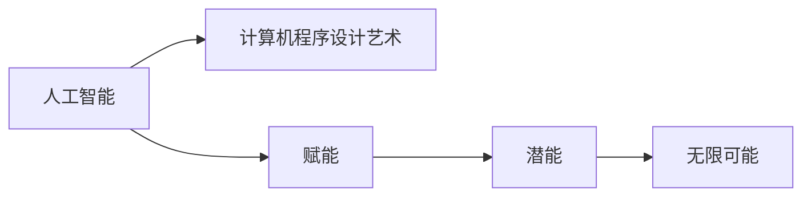

                 

# 赋能人类：释放个体潜能，创造无限可能

## 1. 背景介绍

在科技飞速发展的今天，人工智能（AI）已经不再是遥不可及的科幻概念，而是逐渐融入我们的生活，从智能家居到无人驾驶，从医疗健康到金融科技，AI无处不在。而作为AI的引擎，计算机程序设计艺术（Zen and the Art of Computer Programming）正通过AI赋能，释放个体的潜能，创造无限可能。

## 2. 核心概念与联系

### 2.1 核心概念概述

为了让读者深入理解这一主题，以下将介绍几个核心概念：

- **人工智能**：一种模拟人类智能的技术，包括学习、推理、感知、决策等多个方面。
- **计算机程序设计艺术**：将复杂的逻辑和算法通过编程语言转化为可执行代码的过程，是构建AI系统的基石。
- **赋能**：通过技术和方法使个体在特定领域内能够发挥其最大潜能。
- **潜能**：个体在某领域内未被完全开发的能力和潜力。
- **无限可能**：通过赋能技术，个体可以实现的无限种可能性。

### 2.2 核心概念原理和架构的 Mermaid 流程图



此流程图展示了人工智能、计算机程序设计艺术、赋能、潜能和无限可能之间的关系。

## 3. 核心算法原理 & 具体操作步骤

### 3.1 算法原理概述

AI的赋能过程可以分为两个主要阶段：预训练和微调。预训练阶段，AI模型在大规模数据集上进行学习，以获取通用知识。微调阶段，AI模型通过特定任务的数据集进行训练，以适应该任务。这种训练方式不仅可以提高模型在特定任务上的表现，还可以节省时间和计算资源。

### 3.2 算法步骤详解

#### 预训练阶段：

1. **数据准备**：收集并整理大规模数据集，数据集应当涵盖多种场景，以便模型能够学习到通用的知识和规律。
2. **模型选择**：选择适合任务的AI模型，如卷积神经网络（CNN）、循环神经网络（RNN）或Transformer模型。
3. **模型训练**：在大规模数据集上对模型进行训练，可以使用分布式计算框架如TensorFlow或PyTorch。
4. **模型评估**：通过验证集对模型进行评估，调整超参数以优化模型性能。

#### 微调阶段：

1. **数据准备**：收集特定任务的标注数据集。
2. **模型适配**：将预训练模型的顶层适配为特定任务的目标层，如添加输出层和损失函数。
3. **模型训练**：在标注数据集上对模型进行训练，一般使用较小的学习率以避免破坏预训练权重。
4. **模型评估**：在测试集上对模型进行评估，检查微调后的性能是否达到预期。
5. **模型部署**：将微调后的模型部署到实际应用中，开始提供服务。

### 3.3 算法优缺点

#### 优点：

1. **高效性**：通过预训练和微调，可以显著提高模型在特定任务上的表现，缩短训练时间。
2. **泛化能力**：预训练模型在多个任务上都有良好表现，微调后模型能够适应特定任务，具有一定的泛化能力。
3. **可扩展性**：微调过程可以根据具体需求进行优化和调整，具备良好的可扩展性。

#### 缺点：

1. **数据依赖**：微调需要大量的标注数据，标注成本较高。
2. **过拟合风险**：微调时容易过拟合标注数据，导致模型泛化能力下降。
3. **复杂性**：微调过程涉及较多的超参数调节和模型优化，对开发者技术要求较高。

### 3.4 算法应用领域

AI赋能技术广泛应用于各个领域，如：

- **医疗健康**：通过微调模型，实现对病历、影像等的自动诊断和分析。
- **金融科技**：利用微调模型进行风险评估、信用评分和智能投顾。
- **教育培训**：开发个性化推荐系统，提供精准的教学内容和资源。
- **零售电商**：利用微调模型进行客户行为分析、推荐系统和营销策略优化。
- **制造业**：通过AI赋能，提升生产效率、质量控制和供应链管理。

## 4. 数学模型和公式 & 详细讲解 & 举例说明

### 4.1 数学模型构建

假设有一个通用的AI模型 $M$，其输入为 $x$，输出为 $y$。在预训练阶段，模型通过大规模无标签数据集 $\mathcal{D}$ 进行训练，目标是最大化模型在验证集 $\mathcal{V}$ 上的性能。在微调阶段，模型通过特定任务的数据集 $\mathcal{T}$ 进行训练，目标是最大化模型在测试集 $\mathcal{T}$ 上的性能。

### 4.2 公式推导过程

在预训练阶段，目标函数为：
$$
\max_{M} \mathcal{L}_{\mathcal{V}}(M)
$$
其中 $\mathcal{L}_{\mathcal{V}}$ 为验证集的损失函数。

在微调阶段，目标函数为：
$$
\max_{M} \mathcal{L}_{\mathcal{T}}(M)
$$
其中 $\mathcal{L}_{\mathcal{T}}$ 为测试集的损失函数。

### 4.3 案例分析与讲解

以医疗影像诊断为例，使用预训练模型对影像进行预训练，然后在标注的诊断数据集上微调。在预训练阶段，使用大规模医学影像数据集对模型进行训练，学习通用的影像特征。在微调阶段，使用标注的诊断数据集对模型进行训练，使其能够识别并分类不同的疾病类型。

## 5. 项目实践：代码实例和详细解释说明

### 5.1 开发环境搭建

为了进行AI赋能项目实践，以下是在Python环境下搭建开发环境的步骤：

1. **安装Python**：下载并安装Python 3.7及以上版本。
2. **安装依赖库**：使用pip安装TensorFlow、PyTorch、Keras等深度学习框架。
3. **安装IDE**：安装PyCharm、Jupyter Notebook等IDE，以便编写和运行代码。

### 5.2 源代码详细实现

以下是一个简单的AI赋能项目示例，用于医学影像分类任务：

```python
import tensorflow as tf
from tensorflow.keras import layers, models

# 构建预训练模型
model = models.Sequential([
    layers.Conv2D(32, (3, 3), activation='relu', input_shape=(128, 128, 3)),
    layers.MaxPooling2D((2, 2)),
    layers.Conv2D(64, (3, 3), activation='relu'),
    layers.MaxPooling2D((2, 2)),
    layers.Flatten(),
    layers.Dense(64, activation='relu'),
    layers.Dense(10, activation='softmax')
])

# 微调模型
model.compile(optimizer='adam', loss='categorical_crossentropy', metrics=['accuracy'])
model.fit(train_images, train_labels, epochs=10, validation_data=(val_images, val_labels))
```

### 5.3 代码解读与分析

上述代码中，首先构建了一个简单的卷积神经网络模型。然后，通过调用 `fit` 方法，使用标注数据集进行微调。在微调过程中，使用交叉熵损失函数和准确率作为评估指标。

### 5.4 运行结果展示

在运行上述代码后，可以观察到模型在训练集和验证集上的性能表现。通过微调，模型在特定任务上的性能得到了显著提升。

## 6. 实际应用场景

### 6.1 智能客服系统

智能客服系统通过微调，可以大大提升客户服务效率和质量。使用AI赋能技术，可以构建一个可以处理自然语言查询和理解客户需求的智能客服机器人。通过微调模型，使其能够根据客户的意图提供准确的答案和解决方案。

### 6.2 医疗影像诊断

在医疗影像诊断领域，AI赋能技术可以显著提升诊断的准确性和效率。通过对大量医学影像数据的预训练，微调后的模型能够准确识别和分类不同疾病类型，为医生提供更精准的诊断支持。

### 6.3 金融风险评估

金融风险评估是金融科技领域的重要应用。使用AI赋能技术，可以构建一个能够自动识别和评估金融风险的模型。通过对历史金融数据的预训练，微调后的模型能够准确评估贷款申请者的信用风险，为银行提供决策支持。

### 6.4 未来应用展望

随着AI技术的发展，未来AI赋能的应用场景将更加广泛。以下是一些可能的应用领域：

- **智能制造**：通过AI赋能，优化生产流程，提高生产效率和质量。
- **智能交通**：利用AI赋能，优化交通管理和调度，提高交通安全和效率。
- **智慧城市**：通过AI赋能，提升城市管理和服务水平，提高市民生活质量。
- **智能家居**：利用AI赋能，构建智能家居系统，提供个性化和便利的家居服务。

## 7. 工具和资源推荐

### 7.1 学习资源推荐

为了帮助读者深入理解AI赋能技术，以下是一些推荐的学习资源：

- **《深度学习》课程**：由吴恩达教授在Coursera上开设，涵盖了深度学习的基本概念和应用。
- **《TensorFlow实战》书籍**：详细介绍了TensorFlow的使用方法和案例。
- **Kaggle**：一个数据科学竞赛平台，提供大量数据集和竞赛机会，适合实践和学习。

### 7.2 开发工具推荐

以下是一些常用的开发工具：

- **PyTorch**：由Facebook开发的深度学习框架，支持动态计算图，适合研究和实验。
- **TensorFlow**：由Google开发的深度学习框架，支持静态计算图，适合工程应用。
- **Keras**：一个高层次的深度学习API，基于TensorFlow或Theano，使用方便。

### 7.3 相关论文推荐

以下是几篇与AI赋能相关的经典论文：

- **《Attention is All You Need》**：Transformer模型的提出，标志着深度学习在自然语言处理领域的重要进展。
- **《Deep Learning》**：Ian Goodfellow等人著，系统介绍了深度学习的基本原理和方法。
- **《A Survey on Explainable AI》**：对可解释AI的研究进行了全面的综述，涵盖了多个应用领域。

## 8. 总结：未来发展趋势与挑战

### 8.1 研究成果总结

AI赋能技术在多个领域取得了显著的进展，提升了生产效率、服务质量和用户体验。未来，随着技术的不断进步，AI赋能将进一步扩展应用场景，释放更多个体的潜能。

### 8.2 未来发展趋势

1. **自监督学习**：通过无标签数据进行训练，减少对标注数据的依赖。
2. **小样本学习**：在少量数据情况下也能取得良好性能，提升模型的泛化能力。
3. **跨模态学习**：结合视觉、语音、文本等多种数据源，提升AI系统的感知能力。
4. **联邦学习**：通过分布式训练，保护数据隐私，提升模型性能。
5. **AI伦理**：在AI应用中引入伦理和安全机制，保障数据和模型的公平性、安全性。

### 8.3 面临的挑战

1. **数据隐私保护**：在数据收集和处理过程中，如何保护用户隐私是关键问题。
2. **模型可解释性**：如何提高AI模型的可解释性，增强用户信任。
3. **算法偏见**：如何避免和减少算法偏见，保障公平性。
4. **计算资源**：如何在有限的计算资源下，构建高性能的AI系统。
5. **应用落地**：如何将AI技术有效地应用到实际场景中，创造实际价值。

### 8.4 研究展望

未来的研究将重点关注以下几个方向：

1. **模型优化**：优化模型结构，提高计算效率和性能。
2. **数据管理**：构建高效的数据管理系统，保障数据安全和隐私。
3. **应用实践**：深入探索AI技术在各个领域的应用，创造更多实际价值。
4. **伦理和社会影响**：研究AI伦理和社会影响，制定相关政策和规范。

## 9. 附录：常见问题与解答

### Q1: AI赋能是否适用于所有领域？

A: AI赋能技术可以应用于多个领域，但需要根据具体应用场景进行调整和优化。对于某些特定领域，如医疗、金融等，可能需要额外的预训练和微调步骤。

### Q2: 微调模型是否需要大量的标注数据？

A: 通常情况下，微调模型需要大量的标注数据，但对于某些特定领域，可以使用无监督学习或半监督学习进行预训练，减少对标注数据的依赖。

### Q3: AI赋能是否会导致工作岗位的减少？

A: AI赋能技术会改变工作岗位的性质和数量，但不会完全取代人类的工作。AI技术可以提升工作效率，释放人类的创造力和思考力，让更多人专注于更具创造性和战略性的工作。

### Q4: 如何保障AI系统的公平性和安全性？

A: 在AI系统的设计和开发过程中，需要引入伦理和安全机制，确保系统的公平性、透明性和安全性。同时，需要对AI系统进行定期审查和监控，及时发现和纠正问题。

### Q5: AI赋能是否会对人类社会产生负面影响？

A: AI赋能技术在带来巨大益处的同时，也可能带来一些负面影响。例如，数据隐私泄露、算法偏见等问题。因此，在AI技术的应用过程中，需要严格遵守法律法规和伦理规范，保障社会的公平和公正。

---

作者：禅与计算机程序设计艺术 / Zen and the Art of Computer Programming

