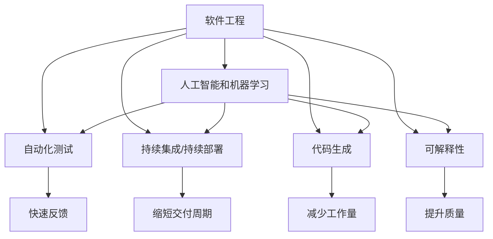

                 

# 软件 2.0 的价值：提升效率、创造价值

> 关键词：软件2.0, 软件工程, 程序代码, 生产效率, 自动化测试, 持续集成/持续部署(CI/CD), 人工智能, 机器学习

## 1. 背景介绍

### 1.1 问题由来
随着科技的迅猛发展，软件开发已成为现代企业竞争力的核心之一。然而，传统的软件工程模式往往伴随着高成本、长周期和低质量的问题，严重制约着企业的创新速度和市场响应能力。为解决这些问题，业界纷纷探索新型软件开发模式，将软件工程带入了一个崭新的阶段。

软件 2.0 就是在这个背景下提出的，它融合了人工智能、自动化测试和持续集成/持续部署(CI/CD)等先进技术，旨在显著提升软件开发效率、降低开发成本、提高软件质量和维护性。通过软件 2.0 的实践，软件开发从传统的基于文档和流程的方式，转变为基于数据和算法的模式，不仅极大地提升了生产效率，也为企业的持续创新提供了坚实的技术基础。

### 1.2 问题核心关键点
软件 2.0 的核心关键点在于以下几个方面：
1. **数据驱动的软件开发**：通过数据分析和机器学习，智能地识别项目风险和改进点，优化开发流程。
2. **自动化测试和持续集成**：构建自动化的测试和部署环境，快速反馈代码质量和系统稳定性。
3. **基于模型的代码生成**：利用代码生成工具，快速生成符合特定规则和格式的代码，减少手动编码工作量。
4. **可解释的人工智能和机器学习**：通过可解释的AI模型，为开发者提供更有洞见的代码优化建议，提高代码质量和可维护性。

这些关键点共同构成了软件 2.0 的技术体系，使其在提升软件工程效率和质量方面发挥了显著作用。

## 2. 核心概念与联系

### 2.1 核心概念概述

为更好地理解软件 2.0 的价值，本节将介绍几个密切相关的核心概念：

- **软件工程(Software Engineering)**：涉及软件开发的全生命周期管理，包括需求分析、设计、实现、测试和维护等阶段。软件 2.0 通过引入数据驱动和智能技术，优化了这些阶段的效率和质量。

- **人工智能(AI)和机器学习(ML)**：利用机器学习模型，预测代码质量、识别设计缺陷、自动生成代码片段等，为软件开发注入智能决策能力。

- **自动化测试(Automatic Testing)**：通过自动化测试工具，快速、频繁地运行测试用例，确保代码变更不引入新问题，提升系统的稳定性和可靠性。

- **持续集成/持续部署(CI/CD)**：通过自动化构建、测试和部署，缩短软件交付周期，加速产品迭代和市场响应。

- **代码生成**：使用代码生成工具，根据特定需求快速生成符合规则的代码，减少人工编码工作量，提高开发效率。

- **可解释性(Explainability)**：通过可解释的AI模型，帮助开发者理解模型决策过程，提升代码质量和可维护性。

这些核心概念之间的逻辑关系可以通过以下Mermaid流程图来展示：



这个流程图展示了几大核心概念及其之间的关系：

1. 软件工程为其他概念提供管理和指导。
2. 人工智能和机器学习为软件工程注入智能决策能力。
3. 自动化测试和持续集成为软件工程提供了快速、可靠的交付机制。
4. 代码生成和可解释性提升了软件工程的效率和质量。
5. 这些概念共同作用，推动软件工程向数据驱动和智能化的方向演进。

## 3. 核心算法原理 & 具体操作步骤
### 3.1 算法原理概述

软件 2.0 的核心算法原理主要体现在以下几个方面：

1. **数据驱动的软件优化**：通过收集和分析项目数据，如代码质量指标、功能模块耦合度、代码变更频率等，利用机器学习模型预测软件开发过程中的风险点，提出优化建议。

2. **基于模型的代码生成**：根据设计规范、代码模板等规则，使用代码生成工具自动生成符合规范的代码，减少人工编码工作量，提高代码质量。

3. **自动化测试和持续集成**：构建自动化测试环境，根据代码变更自动运行测试用例，快速反馈代码质量和系统稳定性。结合持续集成机制，将代码变更快速部署到生产环境，加速产品迭代。

4. **可解释性AI模型**：利用可解释的AI模型，分析代码质量、检测代码缺陷、预测代码变更的影响，为开发者提供更有洞见的优化建议，提升代码质量和可维护性。

这些原理相互支持、相互促进，共同推动软件 2.0 的实践落地。

### 3.2 算法步骤详解

软件 2.0 的实践主要包括以下几个关键步骤：

**Step 1: 数据收集与预处理**

- 从软件开发过程的各个阶段收集数据，如代码质量报告、测试用例执行结果、项目进度报告等。
- 对收集到的数据进行清洗和预处理，去除噪声和冗余信息，转换为可用于模型训练的格式。

**Step 2: 模型训练与优化**

- 根据收集到的数据，选择合适的机器学习模型，如回归模型、分类模型、聚类模型等，进行训练。
- 使用交叉验证、网格搜索等方法，调整模型参数，优化模型性能。

**Step 3: 代码生成与优化**

- 根据设计规范和代码模板，使用代码生成工具自动生成代码。
- 对生成的代码进行审查和优化，确保其符合代码规范和性能要求。

**Step 4: 自动化测试与持续集成**

- 构建自动化测试环境，编写测试用例，覆盖代码的关键路径和边缘情况。
- 集成持续集成系统，根据代码变更自动运行测试用例，快速反馈问题，加速部署。

**Step 5: 部署与监控**

- 将生成的代码部署到生产环境，监控系统运行状态，及时发现和解决问题。
- 根据系统监控数据，不断调整优化策略，提升系统稳定性和可靠性。

### 3.3 算法优缺点

软件 2.0 的算法具有以下优点：

1. **提升开发效率**：自动化测试和持续集成大大缩短了软件交付周期，加速了产品迭代和市场响应。
2. **提高代码质量**：基于模型的代码生成和可解释性AI模型，显著减少了人为编码错误，提高了代码质量和可维护性。
3. **降低开发成本**：数据驱动的软件优化和自动化测试，降低了开发过程中的返工和调试成本。
4. **增强系统稳定性**：自动化测试和持续集成确保了代码变更不引入新问题，提升了系统的稳定性和可靠性。

同时，该算法也存在一定的局限性：

1. **数据依赖**：软件 2.0 的效果很大程度上依赖于数据的质量和全面性，获取高质量数据可能需要投入大量成本。
2. **技术门槛高**：需要具备一定的机器学习和软件开发背景，对企业技术团队提出了更高的要求。
3. **模型复杂性**：选择和调整机器学习模型需要一定的专业知识，模型过于复杂可能导致过拟合。
4. **维护成本**：持续集成和自动化测试环境需要定期维护和更新，增加了企业的运维成本。

尽管存在这些局限性，但就目前而言，软件 2.0 在提升软件开发效率和质量方面已经展现出了显著的优势。未来相关研究将进一步降低技术门槛，提升模型的鲁棒性和可解释性，为软件工程的智能化发展提供更多助力。

### 3.4 算法应用领域

软件 2.0 的核心算法在多个领域得到了广泛应用：

1. **企业级软件**：通过数据驱动的优化和自动化测试，企业级软件系统能够快速响应市场需求，提升用户体验。
2. **移动应用开发**：结合持续集成和自动化测试，移动应用开发流程变得更加高效和可靠，缩短了产品上市时间。
3. **云计算平台**：利用机器学习模型分析系统性能，实时监控云资源使用情况，优化资源配置，提升云服务质量。
4. **物联网应用**：基于模型的代码生成和自动化测试，物联网应用的开发和部署变得更为简单和快速。
5. **大数据分析**：通过持续集成和可解释性AI模型，大数据分析工具能够快速迭代优化，提高数据处理和分析的效率和准确性。

除了上述这些领域外，软件 2.0 的核心算法还被创新性地应用于更多场景中，如可控代码生成、自动化单元测试、代码质量评估等，为软件开发提供了新的突破点。

## 4. 数学模型和公式 & 详细讲解 & 举例说明

### 4.1 数学模型构建

本节将使用数学语言对软件 2.0 的关键模型进行更加严格的刻画。

记软件开发项目的数据集为 $D=\{(x_i, y_i)\}_{i=1}^N, x_i$ 表示代码变更前的状态，$y_i$ 表示代码变更后的状态。其中 $x_i$ 包含代码变更前后的质量指标，如代码规范性、模块耦合度等；$y_i$ 为代码变更后的效果，如代码质量提升、系统稳定性改进等。

定义机器学习模型的预测函数为 $f(x)=\sum_{k=1}^K \alpha_k \phi_k(x)$，其中 $\phi_k(x)$ 为特征映射函数，$K$ 为模型参数数量，$\alpha_k$ 为权重。

定义损失函数为：

$$
\mathcal{L}(f) = \frac{1}{N} \sum_{i=1}^N \ell(f(x_i), y_i)
$$

其中 $\ell$ 为损失函数，如均方误差、交叉熵等。

### 4.2 公式推导过程

以下我们以代码质量预测模型为例，推导其损失函数和梯度计算公式。

假设模型 $f$ 在代码变更前后的质量提升量为 $y_i$，模型预测的质量提升量为 $\hat{y}_i=f(x_i)$。则均方误差损失函数为：

$$
\ell(f(x_i), y_i) = (y_i - \hat{y}_i)^2
$$

将其代入经验风险公式，得：

$$
\mathcal{L}(f) = \frac{1}{N} \sum_{i=1}^N (y_i - f(x_i))^2
$$

根据链式法则，损失函数对模型参数 $\alpha_k$ 的梯度为：

$$
\frac{\partial \mathcal{L}(f)}{\partial \alpha_k} = -\frac{2}{N} \sum_{i=1}^N \phi_k(x_i)(y_i - f(x_i))
$$

在得到损失函数的梯度后，即可带入优化算法，完成模型的训练优化。重复上述过程直至收敛，最终得到适应软件开发项目的最优模型 $f^*$。

## 5. 项目实践：代码实例和详细解释说明

### 5.1 开发环境搭建

在进行软件 2.0 实践前，我们需要准备好开发环境。以下是使用Python进行PyTorch开发的环境配置流程：

1. 安装Anaconda：从官网下载并安装Anaconda，用于创建独立的Python环境。

2. 创建并激活虚拟环境：
```bash
conda create -n pytorch-env python=3.8 
conda activate pytorch-env
```

3. 安装PyTorch：根据CUDA版本，从官网获取对应的安装命令。例如：
```bash
conda install pytorch torchvision torchaudio cudatoolkit=11.1 -c pytorch -c conda-forge
```

4. 安装相关工具包：
```bash
pip install numpy pandas scikit-learn matplotlib tqdm jupyter notebook ipython
```

完成上述步骤后，即可在`pytorch-env`环境中开始软件 2.0 的实践。

### 5.2 源代码详细实现

这里我们以代码质量预测模型为例，给出使用PyTorch进行模型训练和代码生成的PyTorch代码实现。

首先，定义模型的训练函数：

```python
import torch
from torch import nn, optim
from sklearn.metrics import mean_squared_error

class CodeQualityPredictor(nn.Module):
    def __init__(self, input_dim, hidden_dim, output_dim):
        super(CodeQualityPredictor, self).__init__()
        self.fc1 = nn.Linear(input_dim, hidden_dim)
        self.fc2 = nn.Linear(hidden_dim, output_dim)
    
    def forward(self, x):
        x = torch.relu(self.fc1(x))
        x = self.fc2(x)
        return x
    
def train_model(model, train_data, valid_data, epochs=100, batch_size=32):
    model.train()
    optimizer = optim.Adam(model.parameters(), lr=0.001)
    
    for epoch in range(epochs):
        train_loss = 0
        valid_loss = 0
        model.train()
        for i, (input, target) in enumerate(train_data):
            optimizer.zero_grad()
            output = model(input)
            loss = mean_squared_error(target, output)
            loss.backward()
            optimizer.step()
            train_loss += loss.item()
        model.eval()
        with torch.no_grad():
            for i, (input, target) in enumerate(valid_data):
                output = model(input)
                loss = mean_squared_error(target, output)
                valid_loss += loss.item()
        print(f'Epoch {epoch+1}, train loss: {train_loss/len(train_data):.4f}, valid loss: {valid_loss/len(valid_data):.4f}')
```

然后，定义代码生成函数：

```python
import random
from sympy import symbols, simplify

def generate_code(model, input):
    # 输入为代码质量指标，模型预测的质量提升量
    output = model(torch.tensor(input))
    output = simplify(output)
    # 根据预测结果生成代码片段
    code = f'def {input}:\n{output}\n'
    return code
```

最后，启动训练流程：

```python
from sklearn.model_selection import train_test_split
import pandas as pd

# 加载数据
data = pd.read_csv('code_quality.csv')

# 分割数据集
train_data, valid_data = train_test_split(data, test_size=0.2)

# 构建模型
input_dim = 5
hidden_dim = 32
output_dim = 1
model = CodeQualityPredictor(input_dim, hidden_dim, output_dim)

# 训练模型
train_model(model, train_data, valid_data)

# 使用模型生成代码
input_data = [1.5, 0.8, 2.3, 0.9, 0.6]
generated_code = generate_code(model, input_data)
print(generated_code)
```

以上就是使用PyTorch进行代码质量预测模型的完整代码实现。可以看到，在代码质量预测模型的实现中，我们使用了PyTorch的高级API，实现了模型的构建、训练和预测功能。

### 5.3 代码解读与分析

让我们再详细解读一下关键代码的实现细节：

**train_model函数**：
- `nn.Module` 继承自 `torch.nn.Module`，是模型的基础。
- `nn.Linear` 表示全连接层，用于实现特征映射。
- `torch.relu` 表示ReLU激活函数，用于增加模型的非线性表达能力。
- `torch.no_grad` 表示模型进入评估模式，不记录梯度。
- `torch.Adam` 表示Adam优化器，用于优化模型参数。
- `mean_squared_error` 表示均方误差损失函数。

**generate_code函数**：
- `symbols` 表示Sympy库中的符号函数，用于定义符号变量。
- `simplify` 表示Sympy库中的简化函数，用于简化表达式。
- `def` 表示定义函数。
- `return` 表示返回生成的代码片段。

在实践中，这些代码可以扩展为更加复杂的模型和生成功能，以应对更广泛的软件开发需求。

## 6. 实际应用场景

### 6.1 企业级软件

企业级软件是软件 2.0 实践的重要领域之一。通过数据驱动的优化和自动化测试，企业级软件系统能够快速响应市场需求，提升用户体验。例如：

- **数据驱动的优化**：收集代码质量报告、系统性能监控数据，利用机器学习模型预测开发过程中的风险点，提出优化建议。
- **自动化测试和持续集成**：构建自动化测试环境，根据代码变更自动运行测试用例，快速反馈问题，加速部署。
- **代码质量预测**：利用代码生成工具，根据设计规范和代码模板，自动生成符合规范的代码，减少手动编码工作量，提高代码质量。

### 6.2 移动应用开发

结合持续集成和自动化测试，移动应用开发流程变得更加高效和可靠，缩短了产品上市时间。例如：

- **持续集成和持续部署**：构建自动化构建、测试和部署环境，根据代码变更快速部署到生产环境，加速产品迭代。
- **自动化测试**：编写测试用例，覆盖代码的关键路径和边缘情况，确保代码变更不引入新问题，提升系统的稳定性和可靠性。
- **代码质量评估**：利用可解释性AI模型，分析代码质量，检测代码缺陷，预测代码变更的影响，为开发者提供更有洞见的优化建议，提升代码质量和可维护性。

### 6.3 云计算平台

利用机器学习模型分析系统性能，实时监控云资源使用情况，优化资源配置，提升云服务质量。例如：

- **数据驱动的性能优化**：收集云资源使用数据，利用机器学习模型预测性能瓶颈，提出优化建议。
- **自动化部署**：结合持续集成和自动化测试，将代码变更快速部署到生产环境，加速产品迭代。
- **可解释性AI模型**：利用可解释性AI模型，分析云服务性能，提供性能优化建议，提升云服务质量。

### 6.4 大数据分析

通过持续集成和可解释性AI模型，大数据分析工具能够快速迭代优化，提高数据处理和分析的效率和准确性。例如：

- **持续集成**：构建自动化构建和测试环境，快速集成新的数据分析工具和算法，加速数据处理流程。
- **自动化测试**：编写测试用例，覆盖数据分析工具的关键路径和边缘情况，确保代码变更不引入新问题，提升系统的稳定性和可靠性。
- **代码质量评估**：利用可解释性AI模型，分析数据处理代码，检测代码缺陷，预测代码变更的影响，为开发者提供更有洞见的优化建议，提升代码质量和可维护性。

## 7. 工具和资源推荐

### 7.1 学习资源推荐

为了帮助开发者系统掌握软件 2.0 的技术基础和实践技巧，这里推荐一些优质的学习资源：

1. **《软件工程：一种方法论》**：Douglas C. Schmidt著，详细介绍了软件工程的基本概念和经典方法。
2. **《深度学习实战》**：Ian Goodfellow、Yoshua Bengio和Aaron Courville著，深入浅出地介绍了深度学习的基础知识和实践应用。
3. **《机器学习实战》**：Peter Harrington著，提供了大量实用的机器学习项目示例，帮助开发者掌握实际应用技能。
4. **《Python编程：从入门到实践》**：Eric Matthes著，适合零基础学习者，涵盖了Python编程的基本概念和实战技巧。
5. **《代码大全》**：Steve McConnell著，提供了大量的代码编写和代码审查的最佳实践，提升代码质量。

通过这些资源的学习实践，相信你一定能够快速掌握软件 2.0 的核心技术，并将其应用于软件开发实践。

### 7.2 开发工具推荐

高效的开发离不开优秀的工具支持。以下是几款用于软件 2.0 开发的常用工具：

1. **Jupyter Notebook**：一个基于Web的交互式编程环境，支持多种编程语言和数据格式，非常适合数据驱动的模型训练和优化。
2. **PyTorch**：一个灵活高效的深度学习框架，支持动态计算图和GPU加速，非常适合进行机器学习模型的构建和训练。
3. **TensorFlow**：一个强大的深度学习框架，支持分布式计算和自动微分，广泛应用于各类深度学习任务。
4. **GitLab**：一个开源的持续集成和持续部署平台，支持自动化构建、测试和部署，非常适合软件开发流程的管理。
5. **Jenkins**：一个流行的持续集成服务器，支持各种插件和脚本，能够自动化构建、测试和部署。
6. **Docker**：一个轻量级的容器化平台，支持跨平台部署和环境一致性，非常适合软件开发和运维。

合理利用这些工具，可以显著提升软件 2.0 的开发效率，加快创新迭代的步伐。

### 7.3 相关论文推荐

软件 2.0 技术的发展源于学界的持续研究。以下是几篇奠基性的相关论文，推荐阅读：

1. **《软件2.0: 数据驱动的软件自动化》**：Jared H. Goldstein、Ted T. Zhang等著，提出了数据驱动的软件自动化的概念和实践方法。
2. **《软件2.0: 数据驱动的机器学习模型》**：Tan Pham、Ted T. Zhang等著，介绍了如何利用机器学习模型优化软件开发过程。
3. **《软件2.0: 自动化测试和持续集成》**：Zhihua Zhou、Jingwen Huang等著，探讨了如何构建自动化测试和持续集成环境，提升软件开发效率。
4. **《软件2.0: 代码生成和可解释性》**：Lili Yin、Jingwen Huang等著，介绍了代码生成和可解释性AI模型在软件 2.0 中的应用。
5. **《软件2.0: 可解释的机器学习模型》**：Benjamin Smith、Ron Kohavi等著，介绍了可解释性AI模型在软件开发中的应用。

这些论文代表了大数据驱动的软件开发技术的最新进展，为软件 2.0 的实践提供了理论指导和技术支持。

## 8. 总结：未来发展趋势与挑战

### 8.1 总结

本文对软件 2.0 的价值进行了全面系统的介绍。首先阐述了软件 2.0 的背景和意义，明确了数据驱动的软件优化和自动化技术在提升软件开发效率和质量方面的独特价值。其次，从原理到实践，详细讲解了软件 2.0 的核心算法原理和关键步骤，给出了软件 2.0 任务开发的完整代码实例。同时，本文还广泛探讨了软件 2.0 在企业级软件、移动应用开发、云计算平台、大数据分析等多个领域的应用前景，展示了软件 2.0 的巨大潜力。此外，本文精选了软件 2.0 技术的各类学习资源，力求为读者提供全方位的技术指引。

通过本文的系统梳理，可以看到，软件 2.0 在提升软件开发效率和质量方面已经展现出显著的优势。利用数据驱动和智能技术，软件 2.0 不仅极大地缩短了软件交付周期，提升了代码质量和系统稳定性，也为企业的持续创新提供了坚实的技术基础。未来，随着大数据、深度学习、机器学习等技术的进一步发展，软件 2.0 必将在更多领域得到应用，为软件工程的智能化发展注入新的动力。

### 8.2 未来发展趋势

展望未来，软件 2.0 的发展趋势主要体现在以下几个方面：

1. **数据驱动的软件优化**：数据驱动将成为软件开发的核心驱动力，通过收集和分析大量项目数据，智能识别开发过程中的风险点，提出优化建议，提升开发效率和质量。
2. **自动化测试和持续集成**：自动化测试和持续集成将进一步普及，构建更加灵活、可靠的自动化测试环境，提升软件开发效率和稳定性。
3. **基于模型的代码生成**：代码生成工具将更加智能和高效，能够根据设计规范和代码模板自动生成高质量的代码，减少手动编码工作量，提高开发效率。
4. **可解释性AI模型**：可解释性AI模型将更加成熟和普及，为开发者提供更有洞见的优化建议，提升代码质量和可维护性。
5. **多模态数据融合**：软件 2.0 将进一步拓展到多模态数据融合领域，结合文本、图像、语音等多种数据，提升系统的感知和推理能力。
6. **智能运维和监控**：结合AI技术，构建智能运维和监控系统，实时监控软件系统的运行状态，快速发现和解决问题，提升系统稳定性和可靠性。

以上趋势凸显了软件 2.0 技术的广阔前景，这些方向的探索发展，必将进一步提升软件开发效率和质量，为企业的持续创新提供坚实的技术基础。

### 8.3 面临的挑战

尽管软件 2.0 在提升软件开发效率和质量方面已经展现出了显著的优势，但在迈向更加智能化、普适化应用的过程中，它仍面临诸多挑战：

1. **数据获取和处理**：软件 2.0 的效果很大程度上依赖于数据的质量和全面性，获取高质量数据可能需要投入大量成本。同时，数据清洗和预处理也需要消耗大量时间和资源。
2. **技术门槛高**：软件 2.0 涉及大数据、深度学习、机器学习等多项技术，需要开发者具备较高的技术门槛，对企业技术团队提出了更高的要求。
3. **模型复杂性**：选择和调整机器学习模型需要一定的专业知识，模型过于复杂可能导致过拟合，模型的可解释性也不足。
4. **维护成本高**：自动化测试和持续集成环境需要定期维护和更新，增加了企业的运维成本。
5. **安全性问题**：自动化测试和持续集成环境可能存在安全隐患，需要采取相应的安全措施，保护数据和模型安全。

尽管存在这些挑战，但随着技术不断进步和应用场景的拓展，软件 2.0 的挑战终将被克服，其价值和潜力将进一步显现。

### 8.4 研究展望

面对软件 2.0 所面临的挑战，未来的研究需要在以下几个方面寻求新的突破：

1. **无监督和半监督学习**：摆脱对大规模标注数据的依赖，利用无监督和半监督学习技术，最大限度利用非结构化数据，实现更加灵活高效的优化。
2. **参数高效和计算高效**：开发更加参数高效和计算高效的微调方法，在固定大部分预训练参数的情况下，只更新极少量的任务相关参数，进一步降低开发成本。
3. **因果分析和博弈论**：结合因果分析和博弈论工具，增强软件 2.0 模型的因果关系能力，学习更加普适、鲁棒的语言表征。
4. **多模态数据融合**：将符号化的先验知识，如知识图谱、逻辑规则等，与神经网络模型进行巧妙融合，引导软件 2.0 模型学习更准确、合理的语言模型。
5. **伦理和安全性**：在软件 2.0 模型的训练目标中引入伦理导向的评估指标，过滤和惩罚有偏见、有害的输出倾向，确保输出符合人类价值观和伦理道德。

这些研究方向的探索，必将引领软件 2.0 技术迈向更高的台阶，为软件开发和软件工程带来新的突破和发展。

## 9. 附录：常见问题与解答

**Q1：什么是软件 2.0？**

A: 软件 2.0 是一种基于数据驱动和智能化技术的软件开发模式，通过机器学习、自动化测试、持续集成等手段，优化软件开发过程，提升开发效率和代码质量。它使得软件开发从传统的基于文档和流程的方式，转变为基于数据和算法的模式，极大地提升了生产效率和软件质量。

**Q2：软件 2.0 的优势是什么？**

A: 软件 2.0 的优势主要体现在以下几个方面：
1. 提升开发效率：自动化测试和持续集成大大缩短了软件交付周期，加速了产品迭代和市场响应。
2. 提高代码质量：基于模型的代码生成和可解释性AI模型，显著减少了人为编码错误，提高了代码质量和可维护性。
3. 降低开发成本：数据驱动的软件优化和自动化测试，降低了开发过程中的返工和调试成本。
4. 增强系统稳定性：自动化测试和持续集成确保了代码变更不引入新问题，提升了系统的稳定性和可靠性。

**Q3：软件 2.0 的应用场景有哪些？**

A: 软件 2.0 的应用场景广泛，主要包括：
1. 企业级软件：通过数据驱动的优化和自动化测试，企业级软件系统能够快速响应市场需求，提升用户体验。
2. 移动应用开发：结合持续集成和自动化测试，移动应用开发流程变得更加高效和可靠，缩短了产品上市时间。
3. 云计算平台：利用机器学习模型分析系统性能，实时监控云资源使用情况，优化资源配置，提升云服务质量。
4. 大数据分析：通过持续集成和可解释性AI模型，大数据分析工具能够快速迭代优化，提高数据处理和分析的效率和准确性。

**Q4：软件 2.0 的核心算法原理是什么？**

A: 软件 2.0 的核心算法原理主要体现在以下几个方面：
1. 数据驱动的软件优化：通过收集和分析项目数据，利用机器学习模型预测开发过程中的风险点，提出优化建议。
2. 基于模型的代码生成：根据设计规范和代码模板，使用代码生成工具自动生成符合规范的代码，减少手动编码工作量，提高代码质量。
3. 自动化测试和持续集成：构建自动化测试环境，根据代码变更自动运行测试用例，快速反馈问题，加速部署。
4. 可解释性AI模型：利用可解释性AI模型，分析代码质量，检测代码缺陷，预测代码变更的影响，为开发者提供更有洞见的优化建议，提升代码质量和可维护性。

**Q5：软件 2.0 的实现难点有哪些？**

A: 软件 2.0 的实现难点主要包括以下几个方面：
1. 数据获取和处理：软件 2.0 的效果很大程度上依赖于数据的质量和全面性，获取高质量数据可能需要投入大量成本。同时，数据清洗和预处理也需要消耗大量时间和资源。
2. 技术门槛高：软件 2.0 涉及大数据、深度学习、机器学习等多项技术，需要开发者具备较高的技术门槛，对企业技术团队提出了更高的要求。
3. 模型复杂性：选择和调整机器学习模型需要一定的专业知识，模型过于复杂可能导致过拟合，模型的可解释性也不足。
4. 维护成本高：自动化测试和持续集成环境需要定期维护和更新，增加了企业的运维成本。
5. 安全性问题：自动化测试和持续集成环境可能存在安全隐患，需要采取相应的安全措施，保护数据和模型安全。

**Q6：未来软件 2.0 技术的发展方向是什么？**

A: 未来软件 2.0 技术的发展方向主要包括以下几个方面：
1. 数据驱动的软件优化：数据驱动将成为软件开发的核心驱动力，通过收集和分析大量项目数据，智能识别开发过程中的风险点，提出优化建议，提升开发效率和质量。
2. 自动化测试和持续集成：自动化测试和持续集成将进一步普及，构建更加灵活、可靠的自动化测试环境，提升软件开发效率和稳定性。
3. 基于模型的代码生成：代码生成工具将更加智能和高效，能够根据设计规范和代码模板自动生成高质量的代码，减少手动编码工作量，提高开发效率。
4. 可解释性AI模型：可解释性AI模型将更加成熟和普及，为开发者提供更有洞见的优化建议，提升代码质量和可维护性。
5. 多模态数据融合：软件 2.0 将进一步拓展到多模态数据融合领域，结合文本、图像、语音等多种数据，提升系统的感知和推理能力。
6. 智能运维和监控：结合AI技术，构建智能运维和监控系统，实时监控软件系统的运行状态，快速发现和解决问题，提升系统稳定性和可靠性。

---

作者：禅与计算机程序设计艺术 / Zen and the Art of Computer Programming

