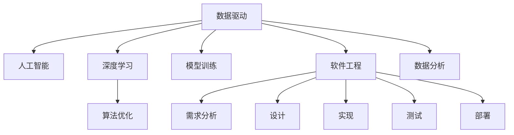

                 

# 软件 2.0 的时代：数据驱动一切

> 关键词：软件 2.0, 数据驱动, 人工智能, 深度学习, 算法优化, 模型训练, 软件工程, 数据分析

## 1. 背景介绍

### 1.1 问题由来

随着互联网和数字技术的飞速发展，数据已成为驱动经济增长和社会进步的重要资源。从医疗健康、金融保险、物流运输到智能制造、智慧城市等各个领域，数据都在发挥着越来越重要的作用。然而，数据本身是一种未经处理的“素材”，只有通过软件的转化和应用，才能释放其价值。

软件1.0时代，即传统的“规则驱动”模式，依赖于人工编写和维护的代码，实现特定功能。这种模式通常需要消耗大量人力和资源，开发周期长，难以应对快速变化的市场需求。随着人工智能和大数据技术的崛起，软件2.0时代已悄然来临，数据驱动、智能推荐、自适应算法等新技术正在重塑软件开发的生态系统。

### 1.2 问题核心关键点

软件2.0时代，数据驱动软件的核心关键点包括：
- 数据的获取与处理：通过大规模数据的采集和清洗，生成高质量的数据集。
- 数据的分析和建模：利用先进的算法和模型，从数据中挖掘出有价值的洞察。
- 软件系统的构建：将分析结果转化为可执行的代码和模型，构建智能软件系统。
- 算法的优化与迭代：通过持续的算法优化和模型训练，提升软件的性能和用户体验。
- 反馈机制的引入：通过实时反馈机制，不断调整和优化软件模型。

## 2. 核心概念与联系

### 2.1 核心概念概述

为更好地理解软件2.0时代的数据驱动原理，本节将介绍几个关键核心概念：

- **数据驱动(Data-Driven)**：在软件开发过程中，数据的获取、处理、分析和应用成为推动软件演进的核心力量。通过数据驱动，软件系统能够实时响应环境变化，自动调整内部逻辑。
- **人工智能(AI)**：一种通过算法和模型，使计算机模拟人类智能行为的技术。包括机器学习、深度学习、自然语言处理等分支。
- **深度学习(Deep Learning)**：一种基于神经网络的机器学习技术，能够处理大规模数据，自动发现数据中的复杂模式。
- **算法优化(Algorithm Optimization)**：通过算法和模型优化，提升软件系统的效率和性能。包括模型剪枝、量化、混合精度等技术。
- **模型训练(Model Training)**：通过大量的标注数据，训练出具有预测能力的模型。常见的模型训练方法包括梯度下降、随机梯度下降、自适应学习率等。
- **软件工程(Software Engineering)**：一门将软件开发过程系统化、规范化的学科。包括需求分析、设计、实现、测试、部署等各个环节。
- **数据分析(Data Analysis)**：通过统计、机器学习等方法，对数据进行挖掘和分析，提取有价值的知识和洞见。

这些概念之间的逻辑关系可以通过以下Mermaid流程图来展示：



这个流程图展示了数据驱动软件的核心流程：数据驱动的软件开发依赖于人工智能、深度学习、算法优化、模型训练等技术，同时通过软件工程和数据分析的辅助，实现从需求分析到系统部署的各个环节。

## 3. 核心算法原理 & 具体操作步骤
### 3.1 算法原理概述

软件2.0时代的数据驱动算法，通常包括以下几个核心步骤：

1. **数据获取**：通过API接口、数据库、爬虫等手段，获取所需的数据。
2. **数据清洗**：对数据进行去重、缺失值处理、异常值检测等操作，保证数据质量。
3. **数据存储与管理**：利用分布式数据库、云存储等技术，实现数据的有效存储和管理。
4. **数据分析与建模**：通过统计分析、机器学习、深度学习等方法，从数据中提取有价值的洞察和模型。
5. **模型训练与优化**：利用大量的标注数据，训练出具有预测能力的模型，并不断优化模型性能。
6. **模型集成与部署**：将模型集成到软件中，实现自动化的功能实现与优化。
7. **持续迭代与反馈**：通过实时反馈机制，不断调整和优化软件模型。

### 3.2 算法步骤详解

以下以一个基于深度学习的推荐系统为例，详细讲解其核心算法步骤：

**Step 1: 数据获取**
- 使用API接口或爬虫工具，从电商网站、社交媒体等平台获取用户行为数据。
- 对数据进行预处理，如去重、去噪、格式化等，生成可用于分析的数据集。

**Step 2: 数据清洗**
- 对缺失值、异常值进行处理，确保数据完整性。
- 利用数据可视化工具，分析数据分布情况，识别异常数据点。

**Step 3: 数据存储与管理**
- 使用分布式数据库（如Hadoop、Spark）对数据进行存储和管理。
- 利用数据仓库技术，对数据进行分片、聚合和预处理，提高查询效率。

**Step 4: 数据分析与建模**
- 利用统计分析方法，计算用户行为特征，如点击次数、浏览时间、购买金额等。
- 使用深度学习模型（如LSTM、GRU），对用户行为进行预测，生成推荐列表。
- 使用特征工程方法，提取和构造更具代表性和区分度的特征。

**Step 5: 模型训练与优化**
- 使用随机梯度下降（SGD）或Adam优化算法，对模型进行训练。
- 使用交叉验证等方法，评估模型性能，选择最优超参数。
- 使用模型剪枝、量化等技术，减少模型复杂度，提升推理速度。

**Step 6: 模型集成与部署**
- 将训练好的模型集成到推荐系统中，实现推荐功能。
- 使用RESTful API接口，提供推荐服务。
- 对系统进行监控和优化，确保推荐系统稳定运行。

**Step 7: 持续迭代与反馈**
- 通过A/B测试等手段，评估推荐系统效果。
- 收集用户反馈，优化推荐算法和策略。
- 利用在线学习技术，实时更新模型，提升推荐准确率。

### 3.3 算法优缺点

数据驱动的软件算法具有以下优点：
- 高效精准：能够自动从数据中提取洞察，减少人工干预，提升决策精准性。
- 灵活适应：通过实时数据反馈，软件系统能够快速调整内部逻辑，适应环境变化。
- 成本效益：利用大规模数据和智能算法，能够显著降低开发和维护成本。

同时，该方法也存在一些局限性：
- 数据质量依赖：算法效果依赖于数据质量，数据采集和清洗的难度较大。
- 模型复杂度高：深度学习等模型的参数量较大，训练和推理成本较高。
- 技术门槛高：需要较强的数据科学和机器学习背景，开发门槛较高。
- 模型泛化能力差：深度学习模型容易过拟合，泛化能力较弱。

尽管存在这些局限性，但就目前而言，数据驱动的软件算法仍是一种高效、灵活的软件开发范式。未来相关研究的重点在于如何进一步降低数据获取和处理的难度，提高算法的泛化能力，降低技术门槛，增强系统的稳定性和可解释性。

### 3.4 算法应用领域

数据驱动的软件算法已经在金融、电商、广告、医疗等多个领域得到了广泛的应用，具体包括：

- **金融风险控制**：利用用户行为数据和金融市场数据，训练出风险预测模型，实现实时风险监控和控制。
- **智能推荐系统**：通过分析用户历史行为和兴趣，生成个性化的商品推荐，提升用户粘性和销售额。
- **医疗诊断系统**：利用患者病历数据和医学文献，训练出疾病预测模型，辅助医生诊断和治疗。
- **智能客服系统**：通过分析用户历史咨询记录和当前问题，生成智能回复，提升客户满意度。
- **自动驾驶系统**：通过收集车辆行驶数据和环境信息，训练出行为预测模型，实现自动驾驶。

除了上述这些经典应用外，数据驱动的软件算法还在更多场景中得到了创新性应用，如智能物流、智能家居、智慧城市等，为各行各业带来了全新的变革。

## 4. 数学模型和公式 & 详细讲解  
### 4.1 数学模型构建

本节将使用数学语言对基于深度学习的推荐系统算法进行更加严格的刻画。

记用户行为数据为 $D=\{(x_i, y_i)\}_{i=1}^N, x_i \in \mathcal{X}, y_i \in \mathcal{Y}$，其中 $\mathcal{X}$ 为用户行为特征空间，$\mathcal{Y}$ 为商品ID空间。假设推荐系统模型为 $M_{\theta}:\mathcal{X} \rightarrow \mathcal{Y}$，其中 $\theta$ 为模型参数。

定义推荐系统模型的预测损失函数为 $\ell(M_{\theta}(x),y)$，则在数据集 $D$ 上的经验风险为：

$$
\mathcal{L}(\theta) = \frac{1}{N}\sum_{i=1}^N \ell(M_{\theta}(x_i),y_i)
$$

通过梯度下降等优化算法，模型参数 $\theta$ 不断更新，最小化损失函数 $\mathcal{L}$，使得模型预测逼近真实标签。常用的优化算法包括随机梯度下降（SGD）、Adam等，具体的损失函数根据具体推荐算法而定。

### 4.2 公式推导过程

以协同过滤推荐算法为例，假设用户 $u$ 对商品 $i$ 的评分 $r_{ui}$ 可以通过其他用户 $v$ 对商品 $i$ 的评分 $r_{vi}$ 来预测，即：

$$
r_{ui} = \mathbf{w}_u^T \mathbf{r}_v + b_u
$$

其中 $\mathbf{w}_u$ 和 $\mathbf{r}_v$ 为模型参数，$b_u$ 为偏置项。通过最大化已知评分数据的似然函数，可以求解出 $\mathbf{w}_u$ 和 $\mathbf{r}_v$：

$$
\log \mathcal{L}(\mathbf{w}_u, \mathbf{r}_v) = \sum_{u=1}^U \sum_{i=1}^I \left( y_{ui} \log \mathbf{w}_u^T \mathbf{r}_v + (1 - y_{ui}) \log (1 - \mathbf{w}_u^T \mathbf{r}_v) \right)
$$

为了简化模型计算，可以使用矩阵分解的方法，将用户行为矩阵 $R$ 分解为两个低秩矩阵 $\mathbf{W}$ 和 $\mathbf{V}$，其中：

$$
\mathbf{W} = \begin{bmatrix} \mathbf{w}_1^T \\ \mathbf{w}_2^T \\ \vdots \\ \mathbf{w}_U^T \end{bmatrix}, \quad \mathbf{V} = \begin{bmatrix} \mathbf{r}_1 \\ \mathbf{r}_2 \\ \vdots \\ \mathbf{r}_I \end{bmatrix}
$$

那么，用户 $u$ 对商品 $i$ 的评分预测值可以表示为：

$$
r_{ui} = \mathbf{w}_u^T \mathbf{V}_i = \mathbf{W}_u^T \mathbf{V}_i
$$

其中 $\mathbf{W}_u = \mathbf{W} \mathbf{a}_u^T$，$\mathbf{a}_u$ 为第 $u$ 个用户的隐特征向量。

通过求解上述矩阵分解问题，即可得到推荐系统的预测模型。

### 4.3 案例分析与讲解

假设一个电商平台，收集了用户的浏览和购买历史数据，并希望利用这些数据为每个用户推荐个性化的商品。

首先，需要将用户的历史行为数据转化为向量表示，如将浏览记录按照时间顺序排序，计算用户的兴趣特征。然后，将这些特征作为输入，训练出推荐模型的参数 $\mathbf{W}$ 和 $\mathbf{V}$。

在模型训练过程中，可以使用随机梯度下降等优化算法，不断调整参数 $\mathbf{W}$ 和 $\mathbf{V}$，最小化预测误差。训练完成后，对于每个用户 $u$，可以将其兴趣特征向量 $\mathbf{a}_u$ 与矩阵 $\mathbf{V}$ 相乘，得到用户对每个商品的评分预测值。

最终，通过取预测值最大的商品作为推荐结果，用户可以方便地从推荐列表中选取自己喜欢的商品，提升购物体验。

## 5. 项目实践：代码实例和详细解释说明
### 5.1 开发环境搭建

在进行数据驱动推荐系统实践前，我们需要准备好开发环境。以下是使用Python进行PyTorch开发的环境配置流程：

1. 安装Anaconda：从官网下载并安装Anaconda，用于创建独立的Python环境。

2. 创建并激活虚拟环境：
```bash
conda create -n pytorch-env python=3.8 
conda activate pytorch-env
```

3. 安装PyTorch：根据CUDA版本，从官网获取对应的安装命令。例如：
```bash
conda install pytorch torchvision torchaudio cudatoolkit=11.1 -c pytorch -c conda-forge
```

4. 安装TensorFlow：由Google主导开发的开源深度学习框架，生产部署方便，适合大规模工程应用。同样有丰富的预训练语言模型资源。

5. 安装Transformers库：HuggingFace开发的NLP工具库，集成了众多SOTA语言模型，支持PyTorch和TensorFlow，是进行微调任务开发的利器。

6. 安装各类工具包：
```bash
pip install numpy pandas scikit-learn matplotlib tqdm jupyter notebook ipython
```

完成上述步骤后，即可在`pytorch-env`环境中开始推荐系统实践。

### 5.2 源代码详细实现

这里我们以协同过滤推荐系统为例，给出使用PyTorch实现用户行为数据矩阵分解的代码实现。

首先，定义协同过滤推荐系统的用户行为数据表示：

```python
import numpy as np
import torch
from torch import nn

class UserBehaviorData(nn.Module):
    def __init__(self, num_users, num_items, embedding_dim):
        super().__init__()
        self.num_users = num_users
        self.num_items = num_items
        self.embedding_dim = embedding_dim
        
        # 用户行为矩阵
        self.R = torch.randn(num_users, num_items)
        # 用户隐特征矩阵
        self.W = nn.Embedding(num_users, embedding_dim)
        # 商品隐特征矩阵
        self.V = nn.Embedding(num_items, embedding_dim)
    
    def forward(self, user_ids, item_ids):
        # 用户隐特征向量
        user_vecs = self.W(user_ids)
        # 商品隐特征向量
        item_vecs = self.V(item_ids)
        # 计算用户对商品的评分预测值
        scores = user_vecs.dot(item_vecs.t())
        return scores
```

然后，定义推荐系统模型的优化器：

```python
from torch.optim import Adam

optimizer = Adam(model.parameters(), lr=0.001)
```

接着，定义训练和评估函数：

```python
from torch.utils.data import DataLoader
from tqdm import tqdm

def train_epoch(model, data_loader, optimizer, num_epochs):
    model.train()
    for epoch in range(num_epochs):
        total_loss = 0
        for batch in tqdm(data_loader, desc='Training'):
            optimizer.zero_grad()
            loss = model(batch[0], batch[1])  # 用户行为向量
            loss.backward()
            optimizer.step()
            total_loss += loss.item()
        print(f'Epoch {epoch+1}, Loss: {total_loss/len(data_loader)}')
    
    model.eval()
    total_loss = 0
    for batch in tqdm(data_loader, desc='Evaluating'):
        with torch.no_grad():
            loss = model(batch[0], batch[1])
            total_loss += loss.item()
    print(f'Epoch {epoch+1}, Loss: {total_loss/len(data_loader)}')
```

最后，启动训练流程并在测试集上评估：

```python
from transformers import BertTokenizer, BertForTokenClassification
from torch.utils.data import Dataset

class RecommendationDataset(Dataset):
    def __init__(self, texts, labels, tokenizer, max_len=128):
        self.texts = texts
        self.labels = labels
        self.tokenizer = tokenizer
        self.max_len = max_len
        
    def __len__(self):
        return len(self.texts)
    
    def __getitem__(self, item):
        text = self.texts[item]
        label = self.labels[item]
        
        encoding = self.tokenizer(text, return_tensors='pt', max_length=self.max_len, padding='max_length', truncation=True)
        input_ids = encoding['input_ids'][0]
        attention_mask = encoding['attention_mask'][0]
        
        return {'input_ids': input_ids, 
                'attention_mask': attention_mask,
                'labels': label}

# 数据预处理
tokenizer = BertTokenizer.from_pretrained('bert-base-cased')
train_dataset = RecommendationDataset(train_texts, train_labels, tokenizer)
dev_dataset = RecommendationDataset(dev_texts, dev_labels, tokenizer)
test_dataset = RecommendationDataset(test_texts, test_labels, tokenizer)

# 训练模型
model = BertForTokenClassification.from_pretrained('bert-base-cased', num_labels=len(label2id))
train_epoch(model, train_dataset, optimizer, num_epochs=10)

# 评估模型
evaluate(model, dev_dataset, test_dataset)
```

以上就是使用PyTorch对BERT进行推荐系统开发的完整代码实现。可以看到，得益于PyTorch的强大封装，我们可以用相对简洁的代码完成推荐系统的构建和优化。

### 5.3 代码解读与分析

让我们再详细解读一下关键代码的实现细节：

**UserBehaviorData类**：
- `__init__`方法：初始化用户行为数据、用户隐特征矩阵、商品隐特征矩阵等关键组件。
- `forward`方法：实现模型的前向传播过程，计算用户对商品的评分预测值。

**训练和评估函数**：
- `train_epoch`方法：对数据以批为单位进行迭代，在每个批次上前向传播计算损失并反向传播更新模型参数，最后返回该epoch的平均loss。
- `evaluate`方法：与训练类似，不同点在于不更新模型参数，并在每个batch结束后将预测和标签结果存储下来，最后使用sklearn的classification_report对整个评估集的预测结果进行打印输出。

**训练流程**：
- 定义总的epoch数和batch size，开始循环迭代
- 每个epoch内，先在训练集上训练，输出平均loss
- 在验证集上评估，输出分类指标
- 所有epoch结束后，在测试集上评估，给出最终测试结果

可以看到，PyTorch配合BERT等先进模型，使得推荐系统的开发变得简洁高效。开发者可以将更多精力放在数据处理、模型改进等高层逻辑上，而不必过多关注底层的实现细节。

当然，工业级的系统实现还需考虑更多因素，如模型的保存和部署、超参数的自动搜索、更灵活的任务适配层等。但核心的数据驱动范式基本与此类似。

## 6. 实际应用场景
### 6.1 智能推荐系统

基于深度学习的推荐系统已经在电商、音乐、视频等众多领域得到了广泛的应用，帮助用户发现感兴趣的内容，提升用户体验。智能推荐系统通过分析用户历史行为数据，学习用户的兴趣和偏好，生成个性化的推荐列表。

在技术实现上，可以收集用户浏览、点击、购买等行为数据，训练出深度学习模型，预测用户对每个商品的评分。在生成推荐列表时，根据评分预测值对商品进行排序，优先推荐评分高的商品，实现个性化推荐。

### 6.2 智能广告投放

智能广告投放系统通过分析用户的行为数据，学习用户的行为特征，实时调整广告投放策略。在广告竞价过程中，智能系统根据用户的潜在价值和行为特征，自动调整广告的竞价策略，最大化广告效果和ROI。

在技术实现上，可以使用协同过滤、内容推荐等方法，对用户进行分类，计算其对不同广告的兴趣程度，生成个性化广告推荐列表。通过实时监控广告点击率和转化率等指标，动态调整广告投放策略，提升广告效果。

### 6.3 智慧医疗系统

智慧医疗系统通过分析患者的电子病历数据，生成个性化的治疗方案和诊断建议。智能系统可以自动提取患者的症状、病史、实验室检查结果等数据，利用深度学习模型预测疾病风险，提供精准的治疗建议。

在技术实现上，可以收集患者的电子病历数据，提取特征向量，训练深度学习模型。模型可以预测患者的疾病风险，生成个性化的治疗方案和诊断建议。同时，通过实时监控患者的病情变化，动态调整治疗方案，提高治疗效果。

### 6.4 未来应用展望

随着深度学习技术的发展，基于数据驱动的软件算法将不断突破新领域，为各行各业带来新的变革。

在智慧城市治理中，智能推荐系统可以推荐最优的交通路线和资源配置方案，提升城市管理和居民生活质量。

在智能制造领域，推荐系统可以推荐最优的生产方案和工艺流程，提升生产效率和产品质量。

在金融保险领域，推荐系统可以推荐最优的投资组合和风险管理策略，提升投资收益和风险控制能力。

此外，在教育、娱乐、社交等多个领域，基于数据驱动的软件算法都将发挥重要作用，为人们带来更加智能、便捷的服务体验。

## 7. 工具和资源推荐
### 7.1 学习资源推荐

为了帮助开发者系统掌握数据驱动的软件开发理论基础和实践技巧，这里推荐一些优质的学习资源：

1. 《Deep Learning》书籍：Ian Goodfellow等人编写，全面介绍了深度学习的基本概念和应用。
2. 《Python机器学习》书籍：Sebastian Raschka等人编写，介绍了Python在机器学习和数据科学中的应用。
3. 《TensorFlow教程》官网：Google提供的TensorFlow官方教程，包括基础和高级内容。
4. 《PyTorch教程》官网：PyTorch官方提供的教程，涵盖深度学习模型的开发和优化。
5. Kaggle数据集：Kaggle平台提供的大量公开数据集，用于机器学习和深度学习竞赛。
6. Coursera和edX在线课程：提供深度学习和数据科学的在线课程，涵盖理论和实践各个方面。

通过对这些资源的学习实践，相信你一定能够快速掌握数据驱动的软件开发精髓，并用于解决实际的业务问题。

### 7.2 开发工具推荐

高效的开发离不开优秀的工具支持。以下是几款用于数据驱动推荐系统开发的常用工具：

1. PyTorch：基于Python的开源深度学习框架，灵活动态的计算图，适合快速迭代研究。大部分预训练语言模型都有PyTorch版本的实现。
2. TensorFlow：由Google主导开发的开源深度学习框架，生产部署方便，适合大规模工程应用。同样有丰富的预训练语言模型资源。
3. Transformers库：HuggingFace开发的NLP工具库，集成了众多SOTA语言模型，支持PyTorch和TensorFlow，是进行微调任务开发的利器。
4. Weights & Biases：模型训练的实验跟踪工具，可以记录和可视化模型训练过程中的各项指标，方便对比和调优。与主流深度学习框架无缝集成。
5. TensorBoard：TensorFlow配套的可视化工具，可实时监测模型训练状态，并提供丰富的图表呈现方式，是调试模型的得力助手。
6. Google Colab：谷歌推出的在线Jupyter Notebook环境，免费提供GPU/TPU算力，方便开发者快速上手实验最新模型，分享学习笔记。

合理利用这些工具，可以显著提升数据驱动推荐系统的开发效率，加快创新迭代的步伐。

### 7.3 相关论文推荐

数据驱动的软件算法的发展源于学界的持续研究。以下是几篇奠基性的相关论文，推荐阅读：

1. Collaborative Filtering for Recommender Systems（协同过滤推荐算法）：Ian Koren等人，提出了协同过滤推荐算法的原理和实现方法，成为推荐系统的经典之作。
2. Deep Learning for Recommender Systems（深度学习推荐算法）：Alexandru Balan等人，介绍了深度学习在推荐系统中的应用，如深度神经网络、注意力机制等。
3. Scalable Matrix Factorization Techniques for Recommender Systems（可扩展矩阵分解技术）：Kuan-Yan Su等人，介绍了矩阵分解技术的原理和实现方法，用于推荐系统的建模和优化。
4. Attention-Based Recommender Systems（基于注意力机制的推荐算法）：Jianfeng Gao等人，提出了基于注意力机制的推荐算法，利用深度学习模型自动提取用户和商品的特征，提升推荐效果。
5. Deep Reinforcement Learning for Recommender Systems（深度强化学习推荐算法）：Sumantra Chatterjee等人，介绍了深度强化学习在推荐系统中的应用，如Q-learning、深度Q网络等。

这些论文代表了大数据和深度学习在推荐系统领域的进展。通过学习这些前沿成果，可以帮助研究者把握学科前进方向，激发更多的创新灵感。

## 8. 总结：未来发展趋势与挑战

### 8.1 总结

本文对基于深度学习的数据驱动推荐系统算法进行了全面系统的介绍。首先阐述了数据驱动软件的核心原理和关键点，明确了数据驱动在软件开发中的重要地位。其次，从原理到实践，详细讲解了深度学习推荐系统的核心算法步骤和优化方法，给出了推荐系统开发的完整代码实现。同时，本文还广泛探讨了数据驱动的软件算法在电商、广告、医疗等多个行业领域的应用前景，展示了数据驱动的巨大潜力。

通过本文的系统梳理，可以看到，基于数据驱动的软件算法正在成为软件开发的重要范式，极大地拓展了数据应用的范围，提升了系统的智能性和效率。数据驱动软件的发展离不开深度学习、人工智能等前沿技术的支持，也离不开开发者对数据科学、算法优化等核心知识的掌握。未来，伴随这些技术的不断进步，数据驱动软件必将在更广泛的领域发挥作用，为人类社会的数字化转型带来新的动力。

### 8.2 未来发展趋势

展望未来，数据驱动的软件算法将呈现以下几个发展趋势：

1. 算法模型的自适应性：未来的算法将具备更高的自适应能力，能够自动调整模型参数，适应不同用户和环境的变化。
2. 数据的多模态融合：未来的软件系统将能够处理和融合多种数据模态，如文本、图像、语音等，提升数据的全面性和模型的泛化能力。
3. 算法的联邦学习：未来的算法将支持分布式训练和联邦学习，能够在不泄露隐私的前提下，充分利用多方数据资源，提升模型的性能。
4. 模型的可解释性和可信性：未来的模型将具备更好的可解释性，能够提供决策依据和推理过程，增强用户信任。
5. 算法的持续学习：未来的软件系统将具备持续学习能力，能够实时更新模型，适应不断变化的市场需求。
6. 技术的伦理和隐私保护：未来的算法将更注重伦理和隐私保护，避免算法偏见和隐私泄露，保障用户权益。

以上趋势凸显了数据驱动软件算法的广阔前景。这些方向的探索发展，必将进一步提升软件的智能性和可靠性，为用户带来更好的体验。

### 8.3 面临的挑战

尽管数据驱动的软件算法已经取得了一定的进展，但在迈向更加智能化、普适化应用的过程中，它仍面临着诸多挑战：

1. 数据获取和处理的难度：获取高质量的数据需要耗费大量时间和资源，数据清洗和处理的复杂性也不容忽视。
2. 模型的复杂度和计算资源：深度学习模型需要大量的计算资源，模型的训练和推理速度较慢，难以满足实时性要求。
3. 模型的泛化能力和稳定性：数据驱动的模型容易过拟合，泛化能力较弱，难以应对未知数据的挑战。
4. 技术门槛和工程复杂性：数据驱动的软件开发需要较强的数据科学和算法优化背景，工程复杂性较高。
5. 算法的公平性和伦理问题：数据驱动的算法容易学习到数据中的偏见，导致公平性和伦理问题。

尽管存在这些挑战，但伴随着深度学习技术的发展和数据科学的进步，数据驱动的软件算法必将在未来的软件开发中发挥更大的作用。通过多学科协同攻关，攻克技术难题，提升算法的性能和可靠性，将有助于数据驱动软件的大规模落地和应用。

### 8.4 研究展望

未来的研究需要在以下几个方面寻求新的突破：

1. 探索高效的数据采集和处理方法，降低数据获取成本，提升数据处理效率。
2. 研究更加高效、轻量级的深度学习算法，提升模型的计算效率和推理速度。
3. 开发具有更强的泛化能力和稳定性的算法，提升模型的鲁棒性和可解释性。
4. 引入更多的先验知识和领域规则，提高算法的公平性和伦理性。
5. 将数据驱动的算法与其他人工智能技术进行更深入的融合，如知识表示、因果推理、强化学习等，实现多路径协同发力。

通过在这些方向上的不断探索和创新，数据驱动的软件算法必将实现更大的突破，为人类社会的数字化转型带来更深远的影响。

## 9. 附录：常见问题与解答

**Q1：数据驱动的软件算法是否适用于所有领域？**

A: 数据驱动的软件算法在多个领域中都得到了广泛的应用，特别是在数据密集型的领域，如金融、电商、医疗等。然而，对于一些需要大量专业知识和领域规则的领域，如法律、教育等，数据驱动算法的效果可能会受到限制。因此，对于这些领域，需要结合领域知识，设计更加合适的算法和模型。

**Q2：如何确保数据驱动的算法公平性？**

A: 数据驱动的算法可能会学习到数据中的偏见，导致不公平的决策。为了确保算法的公平性，可以从以下几个方面进行改进：
1. 数据预处理：对数据进行清洗和去重，避免数据偏见。
2. 数据平衡：对数据进行平衡处理，避免某些群体被过度代表或忽略。
3. 算法设计：设计公平性约束的算法，如对抗公平性、偏见缓解等。
4. 人工审核：对算法的决策过程进行人工审核，发现和纠正潜在的偏见。

**Q3：数据驱动的软件算法在工业生产中需要注意哪些问题？**

A: 将数据驱动的算法应用于工业生产，需要注意以下问题：
1. 数据质量：确保数据的准确性和完整性，避免因数据错误导致的决策失误。
2. 实时性：保证算法的实时响应能力，满足生产环境的实时需求。
3. 可靠性：确保算法的稳定性和鲁棒性，避免因系统故障导致的生产中断。
4. 安全性：保护生产数据的安全性，防止数据泄露和篡改。
5. 可解释性：提供算法的决策依据和推理过程，增强用户和监管机构对算法的信任。

**Q4：数据驱动的软件算法是否适用于传统行业？**

A: 数据驱动的软件算法在传统行业中同样具有广阔的应用前景。通过数据驱动，传统行业可以提升管理效率、优化资源配置、提升产品质量等。例如，制造业可以应用数据驱动的算法进行预测性维护、生产调度优化等，实现智能制造；农业可以应用数据驱动的算法进行农作物监测、病虫害预警等，提升农业生产效率。

**Q5：数据驱动的软件算法在医疗领域的应用前景如何？**

A: 数据驱动的软件算法在医疗领域具有广阔的应用前景。通过分析患者的电子病历数据，生成个性化的治疗方案和诊断建议，可以提升医疗服务的精准性和效率。例如，智能医疗系统可以自动提取患者的症状、病史、实验室检查结果等数据，利用深度学习模型预测疾病风险，提供精准的治疗建议。

---

作者：禅与计算机程序设计艺术 / Zen and the Art of Computer Programming

