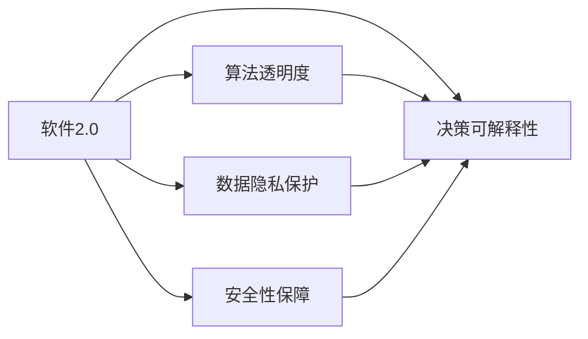

                 

# 软件 2.0 的社会责任：科技向善

> 关键词：软件 2.0, 社会责任, 科技向善, 人工智能, 数据伦理, 数字公民

## 1. 背景介绍

### 1.1 问题由来

随着信息技术的飞速发展，软件2.0时代已经到来。软件2.0以其智能算法、大数据处理能力、强大的自我学习和进化能力，对社会各个领域产生了深远的影响。然而，这一新兴技术在带来便利的同时，也带来了诸多挑战，如数据隐私泄露、算法偏见、信息不对称、网络攻击等问题。科技的发展需要更多社会责任感的引导，确保其健康、可持续地服务社会。

### 1.2 问题核心关键点

软件2.0的社会责任主要包括数据隐私保护、算法透明度、决策可解释性、安全性保障等方面。只有在这几个关键点上作出努力，才能确保科技向善，发挥其正面价值。

## 2. 核心概念与联系

### 2.1 核心概念概述

- **软件2.0**：基于人工智能和大数据技术的智能软件，具备自我学习和优化能力。
- **数据隐私保护**：保护个人信息不被滥用，保障用户数据安全。
- **算法透明度**：确保算法的工作过程和决策依据能够被理解和解释。
- **决策可解释性**：使得算法能够提供清晰、可理解的决策理由。
- **安全性保障**：确保软件系统不受恶意攻击，保障数据安全。

这些核心概念之间存在密切联系。数据隐私保护是基础，算法透明度和决策可解释性是实现公正、透明决策的前提，安全性保障则是确保这些目标得以实现的外部环境。

### 2.2 核心概念原理和架构的 Mermaid 流程图



### 2.3 核心概念间的逻辑关系

- **数据隐私保护**：是软件2.0系统设计和运行的基石，保护用户数据不被非法获取和使用。
- **算法透明度**：通过公开算法原理和参数，使开发者和用户理解其工作原理和决策依据。
- **决策可解释性**：确保算法的决策过程可以被用户和监管机构解释，避免黑箱操作。
- **安全性保障**：通过技术手段和规范措施，防止软件系统被攻击和滥用。

这些概念共同构成了软件2.0的伦理框架，保障其在发展过程中服务于社会，而不是损害公共利益。

## 3. 核心算法原理 & 具体操作步骤
### 3.1 算法原理概述

软件2.0的社会责任主要通过数据隐私保护、算法透明度、决策可解释性和安全性保障四个方面实现。以下是核心算法原理的概述：

1. **数据隐私保护**：基于差分隐私（Differential Privacy）和同态加密（Homomorphic Encryption）等技术，确保数据在处理和存储过程中不被泄露。
2. **算法透明度**：通过模型解释性技术（如LIME、SHAP等），使算法的工作原理和决策依据可被理解。
3. **决策可解释性**：使用可解释性模型和推理方法（如符号解释、基于规则的推理等），使决策过程具有可解释性。
4. **安全性保障**：通过加密技术、访问控制和入侵检测等手段，保护软件系统免受网络攻击和恶意行为。

### 3.2 算法步骤详解

**步骤一：数据隐私保护**

1. **数据收集与处理**：
   - 使用差分隐私技术，在数据收集阶段就加入噪声，确保个体数据无法被识别。
   - 采用同态加密算法，对敏感数据进行加密，确保数据在传输和存储过程中不被解密。

2. **数据访问控制**：
   - 实施严格的访问控制策略，确保只有授权人员和系统可以访问数据。
   - 定期进行安全审计，检查系统是否存在潜在漏洞。

**步骤二：算法透明度**

1. **算法原理公开**：
   - 公开算法的工作原理、参数设置和训练过程。
   - 提供算法实现代码，便于第三方审查和验证。

2. **算法评估与验证**：
   - 进行算法透明度的评估，确保算法的公正性和可靠性。
   - 引入社区评审机制，邀请专家对算法进行审查和改进。

**步骤三：决策可解释性**

1. **模型选择与设计**：
   - 使用可解释性模型，如决策树、规则集等，确保决策过程透明。
   - 设计简单易懂的决策规则，避免过于复杂的算法使用。

2. **解释方法与工具**：
   - 采用解释工具（如LIME、SHAP等），生成决策解释报告。
   - 提供可视化工具，帮助用户理解算法输出和决策过程。

**步骤四：安全性保障**

1. **加密与解密技术**：
   - 使用加密技术保护数据和系统，防止数据泄露。
   - 实现同态加密，确保数据在加密状态下仍能进行有效计算。

2. **入侵检测与防护**：
   - 部署入侵检测系统，实时监测系统活动，识别异常行为。
   - 实施多层次防护措施，包括防火墙、反病毒软件等。

### 3.3 算法优缺点

**优点**：
- 确保数据隐私和安全性，保护用户权益。
- 提高算法透明度和决策可解释性，增强用户信任。
- 增强系统安全性，防止网络攻击。

**缺点**：
- 增加了系统复杂性和维护成本。
- 部分技术（如差分隐私、同态加密）可能需要较高的计算资源。

### 3.4 算法应用领域

软件2.0的社会责任不仅限于数据隐私保护和安全性保障，还广泛应用于医疗、金融、教育、智能交通等多个领域。以下以医疗领域为例，详细说明其应用：

- **医疗领域**：通过差分隐私保护患者隐私，同时通过算法透明度和决策可解释性，确保医疗决策的公正和透明。使用安全性保障技术，保护患者数据不受泄露和攻击。

## 4. 数学模型和公式 & 详细讲解

### 4.1 数学模型构建

软件2.0的社会责任涉及多个领域和复杂算法，其数学模型构建需要考虑多方面的因素。以数据隐私保护为例，构建的数学模型应包含：

- 数据收集策略
- 差分隐私参数设置
- 加密算法选择
- 访问控制规则

**隐私保护模型**：
$$
\epsilon-\text{DP: } P[f(D')] \leq e^{-\epsilon} P[f(D)]
$$

其中，$\epsilon$为差分隐私参数，$D$为原始数据集，$D'$为处理后的数据集，$f$为查询函数。

**同态加密模型**：
$$
C_{1} = E(D), C_{2} = f(C_{1}), D' = D
$$

其中，$E$为加密函数，$f$为计算函数，$C_{1}$和$C_{2}$分别为加密和解密后的数据。

### 4.2 公式推导过程

**差分隐私推导**：
- 引入拉普拉斯噪声，生成差分隐私保护的数据集：
$$
D' = \{D_i + \mathcal{L}(1/\epsilon)\}_i
$$
其中，$\mathcal{L}(1/\epsilon)$为拉普拉斯分布噪声。

**同态加密推导**：
- 使用同态加密算法，确保在加密状态下进行计算：
$$
C_{2} = E(f(E^{-1}(C_1)))
$$

### 4.3 案例分析与讲解

**案例一：医疗数据隐私保护**

- **数据收集与处理**：
  - 使用差分隐私技术，在数据收集阶段加入噪声，确保个体数据无法被识别。
  - 对敏感数据进行同态加密，确保数据在传输和存储过程中不被解密。

- **数据访问控制**：
  - 实施严格的访问控制策略，确保只有授权人员和系统可以访问数据。
  - 定期进行安全审计，检查系统是否存在潜在漏洞。

**案例二：金融领域安全性保障**

- **加密与解密技术**：
  - 使用AES加密算法保护数据和系统，防止数据泄露。
  - 实现同态加密，确保数据在加密状态下仍能进行有效计算。

- **入侵检测与防护**：
  - 部署入侵检测系统，实时监测系统活动，识别异常行为。
  - 实施多层次防护措施，包括防火墙、反病毒软件等。

## 5. 项目实践：代码实例和详细解释说明

### 5.1 开发环境搭建

为了进行软件2.0的社会责任实践，需要搭建一个支持差分隐私、同态加密、访问控制和安全审计的开发环境。以下是具体步骤：

1. **安装差分隐私库**：使用`dp-learning`库，支持差分隐私保护。
2. **安装同态加密库**：使用`pycryptodome`库，支持同态加密算法。
3. **配置访问控制**：使用`Flask`和`Flask-Security`库，实现权限管理。
4. **部署安全审计工具**：使用`OWASP ZAP`和`Nessus`等工具，进行安全审计。

### 5.2 源代码详细实现

以下是一个简化的Python代码实现，用于差分隐私保护和同态加密：

```python
import dp_learning as dp
from Crypto.Cipher import AES

def differential_privacy(data, epsilon):
    # 引入拉普拉斯噪声
    noisy_data = [x + dp.laplace(1/epsilon) for x in data]
    return noisy_data

def homomorphic_encryption(data, key):
    # 使用AES加密算法进行同态加密
    cipher = AES.new(key, AES.MODE_ECB)
    encrypted_data = cipher.encrypt(data)
    return encrypted_data
```

### 5.3 代码解读与分析

**代码解读**：
- `differential_privacy`函数：使用差分隐私技术，生成带有噪声的数据。
- `homomorphic_encryption`函数：使用AES加密算法，对数据进行同态加密。

**代码分析**：
- 差分隐私技术：引入拉普拉斯噪声，确保个体数据无法被识别。
- 同态加密算法：使用AES加密算法，确保数据在加密状态下仍能进行有效计算。

### 5.4 运行结果展示

通过上述代码实现，可以生成带有噪声的差分隐私保护数据，并对敏感数据进行同态加密处理。以下是一个简单的数据处理示例：

```python
data = [1, 2, 3, 4, 5]
epsilon = 0.1
noisy_data = differential_privacy(data, epsilon)
encrypted_data = homomorphic_encryption(noisy_data, 'my_secret_key')
print(noisy_data)
print(encrypted_data)
```

## 6. 实际应用场景

### 6.1 智慧医疗

智慧医疗领域需要处理大量敏感的病人数据，如何保护这些数据的隐私和安全，是关键问题。通过差分隐私和同态加密技术，智慧医疗系统可以保障数据的隐私性和安全性。

**应用场景**：
- 病历数据隐私保护：使用差分隐私技术，对病人的病历数据进行匿名化处理。
- 医疗决策支持系统：通过同态加密技术，确保医疗决策系统在加密状态下进行数据计算和分析。

### 6.2 金融行业

金融行业需要处理大量的敏感信息，如客户交易记录、账户信息等。保障这些信息的安全，是金融机构的核心任务。

**应用场景**：
- 交易记录加密：使用同态加密技术，保护客户交易记录的隐私。
- 欺诈检测系统：通过差分隐私技术，对客户数据进行匿名化处理，防止数据泄露。

### 6.3 教育行业

教育行业需要处理大量的学生数据，如成绩、兴趣等。保障这些数据的安全和隐私，是教育机构的核心任务。

**应用场景**：
- 学生成绩隐私保护：使用差分隐私技术，对学生成绩进行匿名化处理。
- 学习数据分析：通过同态加密技术，保护学生数据的安全，同时进行数据分析和改进。

## 7. 工具和资源推荐

### 7.1 学习资源推荐

为了更好地理解和掌握软件2.0的社会责任，以下是推荐的几项学习资源：

1. **《软件2.0的社会责任》系列论文**：涵盖差分隐私、同态加密、访问控制和安全审计等主题。
2. **Coursera《数据隐私与伦理》课程**：介绍数据隐私保护和伦理规范，涵盖差分隐私、同态加密等技术。
3. **Kaggle《数据隐私保护》竞赛**：通过实际案例，学习和实践差分隐私和同态加密技术。
4. **IEEE《数据隐私保护》专题会议**：汇集学术界和工业界的研究成果，推动数据隐私保护技术的发展。

### 7.2 开发工具推荐

为了提高开发效率和实践效果，以下是推荐的几款开发工具：

1. **PyTorch**：支持深度学习模型的开发，方便实现差分隐私和同态加密技术。
2. **TensorFlow**：支持复杂模型的训练和推理，支持多种加密算法和隐私保护技术。
3. **AES加密库**：支持AES加密算法的实现，保护敏感数据的安全。
4. **OWASP ZAP**：开源网络安全扫描器，进行入侵检测和防护。

### 7.3 相关论文推荐

软件2.0的社会责任涉及多个研究领域，以下是推荐的几篇相关论文：

1. **《差分隐私：保护数据隐私的技术》**：介绍差分隐私的基本原理和实现方法。
2. **《同态加密：保护数据隐私的密码学技术》**：介绍同态加密的实现原理和应用场景。
3. **《访问控制技术》**：介绍访问控制策略和实现方法，保障数据的安全性。
4. **《安全审计技术》**：介绍安全审计工具和实践方法，确保系统的安全性。

## 8. 总结：未来发展趋势与挑战

### 8.1 研究成果总结

软件2.0的社会责任涉及多个技术领域和实践环节，其研究成果可以总结如下：

1. **差分隐私**：在数据处理阶段加入噪声，保护个体数据隐私。
2. **同态加密**：在加密状态下进行数据计算，保障数据隐私。
3. **访问控制**：通过权限管理，确保数据访问的安全性。
4. **安全审计**：通过工具和手段，保障系统的安全性。

### 8.2 未来发展趋势

未来，软件2.0的社会责任将呈现以下几个发展趋势：

1. **隐私保护技术升级**：差分隐私和同态加密技术将不断改进，提供更高的隐私保护水平。
2. **访问控制策略优化**：更灵活的权限管理和更严格的访问控制策略，保障数据的安全性。
3. **安全审计工具发展**：更智能、更自动化的安全审计工具，实时监测系统活动，防止网络攻击。
4. **多技术融合**：结合人工智能和大数据技术，提高系统的智能化和自动化水平。

### 8.3 面临的挑战

尽管软件2.0的社会责任研究取得了一定的成果，但在实施过程中仍面临以下挑战：

1. **技术复杂性**：差分隐私和同态加密技术需要较高的计算资源和复杂性，增加了系统的维护成本。
2. **数据可解释性**：如何在保障隐私的前提下，提供数据解释性，是一个技术难题。
3. **资源消耗**：差分隐私和同态加密技术可能带来较大的资源消耗，如何平衡隐私保护和系统性能。
4. **安全性保障**：网络攻击手段不断进化，如何保障系统安全性仍然是一个长期挑战。

### 8.4 研究展望

未来，软件2.0的社会责任研究需要在以下几个方面进行深入探索：

1. **多技术融合**：结合差分隐私、同态加密、访问控制和安全审计技术，形成完整的隐私保护框架。
2. **智能隐私保护**：使用人工智能技术，实时分析和处理隐私威胁，提高隐私保护能力。
3. **隐私保护算法**：开发更高效、更灵活的隐私保护算法，提升隐私保护水平。
4. **数据治理机制**：建立数据治理机制，确保数据的使用符合伦理规范，保护用户权益。

## 9. 附录：常见问题与解答

### Q1：如何实现差分隐私保护？

A: 实现差分隐私保护主要包括以下几个步骤：
1. **数据扰动**：在原始数据上加入拉普拉斯噪声，确保个体数据无法被识别。
2. **查询函数设计**：设计合适的查询函数，确保扰动后的数据仍然可用于统计分析。
3. **隐私参数设置**：根据数据敏感度和隐私要求，设置合适的差分隐私参数。

### Q2：同态加密技术如何实现？

A: 同态加密技术主要包括以下几个步骤：
1. **数据加密**：使用加密算法（如AES）对数据进行加密处理。
2. **计算过程加密**：在加密状态下进行数据计算，确保数据不被解密。
3. **结果解密**：使用密钥对计算结果进行解密，得到最终结果。

### Q3：访问控制策略如何实施？

A: 实施访问控制策略主要包括以下几个步骤：
1. **权限管理**：定义不同角色的权限，限制访问数据的用户和系统。
2. **访问审计**：记录用户访问行为，进行定期审计，检查安全漏洞。
3. **异常检测**：部署入侵检测系统，实时监测系统活动，识别异常行为。

### Q4：安全审计工具如何部署？

A: 部署安全审计工具主要包括以下几个步骤：
1. **工具选择**：选择适合的审计工具（如OWASP ZAP），确保工具与系统兼容。
2. **配置审计规则**：根据系统特点，配置审计规则，确保全面覆盖系统活动。
3. **定期审计**：定期进行审计，及时发现和修复安全漏洞。

---

作者：禅与计算机程序设计艺术 / Zen and the Art of Computer Programming

