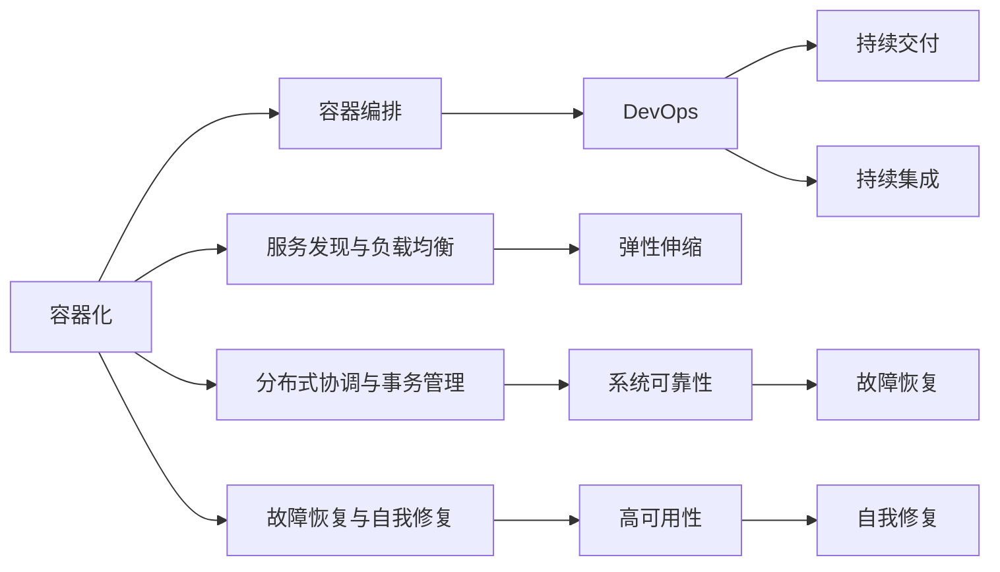

                 

# 软件2.0的容器化与云原生开发

> 关键词：软件2.0,容器化,云原生,DevOps,微服务,云计算,分布式系统,分布式协调,开源社区

## 1. 背景介绍

### 1.1 问题由来
随着软件工程的不断发展，软件开发模式经历了从单体应用到微服务的演进。微服务架构打破了传统单体应用的束缚，使得软件系统更加灵活、可扩展、易维护。然而，随着服务数量增多，传统的微服务部署和运维模式面临诸多挑战：

1. **复杂性增加**：微服务系统中的服务数量众多，各服务间依赖关系复杂，使得系统的设计和维护成本显著增加。
2. **部署困难**：微服务需要跨越多个主机和网络环境，部署和回滚操作繁琐且易出错。
3. **运维复杂**：微服务架构导致系统状态多样，故障诊断和问题排查难度大，运维效率低下。

在这样的背景下，容器化和云原生开发应运而生。通过将应用打包到容器中，并利用云原生技术进行自动化运维，能够大大简化微服务的部署和运维过程，提升系统的灵活性和可扩展性。容器化与云原生技术已成为构建下一代软件架构的基础，引领了软件2.0时代的到来。

### 1.2 问题核心关键点
容器化和云原生开发的核心在于通过标准化的容器和自动化的编排机制，实现微服务的无缝集成和高效运维。具体包括以下关键点：

1. **容器化**：将应用打包到容器中，通过镜像管理和编排，实现应用的快速部署和灵活扩展。
2. **自动化**：利用CI/CD流水线，实现代码构建、测试、部署和回滚的自动化，提升开发和运维效率。
3. **弹性伸缩**：通过容器编排工具，自动调整服务实例数量，实现系统负载的动态平衡。
4. **服务发现与负载均衡**：利用服务网格或服务注册中心，实现服务间的高效通信与负载均衡。
5. **分布式协调与事务管理**：采用分布式一致性协议和事务管理框架，保证系统的可靠性和数据一致性。
6. **故障恢复与自我修复**：利用自我修复机制和告警监控，确保系统在故障发生时能够快速恢复。

这些关键点构成了容器化和云原生开发的基础，为构建稳定、高效、灵活的软件架构提供了有力支持。

### 1.3 问题研究意义
容器化和云原生开发的广泛应用，对于推动软件工程的现代化和智能化进程，具有重要意义：

1. **提升开发效率**：通过容器化和自动化工具，开发和运维的复杂性显著降低，促进了持续交付和持续集成(CI/CD)的普及。
2. **改善运维管理**：通过自动化的编排和监控机制，系统运维的效率和可靠性大幅提升，减少了人为操作的错误。
3. **增强系统灵活性**：通过弹性伸缩和分布式协调技术，系统能够快速响应负载变化和故障事件，提高系统的适应性和可靠性。
4. **降低成本**：容器化和云原生技术能够显著降低硬件资源和运维成本，使得企业能够更专注于业务创新。
5. **促进技术创新**：容器化和云原生开发催生了许多新的技术趋势，如函数即服务(FaaS)、事件驱动架构(EDA)等，推动了软件架构的不断演进。

通过理解容器化和云原生开发的原理和实践，开发人员和架构师能够更好地应对微服务系统的复杂性，提升开发和运维的效率，构建更稳定、高效、灵活的软件系统。

## 2. 核心概念与联系

### 2.1 核心概念概述

容器化和云原生开发涉及多个核心概念，它们之间相互联系，共同构建了一个完整的技术生态系统。以下是几个核心概念的介绍及其相互关系：

1. **容器化**：将应用打包到容器中，通过镜像管理和编排，实现应用的快速部署和灵活扩展。
2. **容器编排**：通过容器编排工具，如Kubernetes，实现服务实例的自动管理和弹性伸缩。
3. **服务发现与负载均衡**：利用服务网格或服务注册中心，实现服务间的高效通信与负载均衡。
4. **分布式协调与事务管理**：采用分布式一致性协议和事务管理框架，保证系统的可靠性和数据一致性。
5. **故障恢复与自我修复**：利用自我修复机制和告警监控，确保系统在故障发生时能够快速恢复。
6. **DevOps文化**：融合开发和运维，实现软件开发生命周期的自动化和持续优化。

这些概念之间的联系可以通过以下Mermaid流程图来展示：



这个流程图展示了各个核心概念之间的相互关系，帮助我们更好地理解容器化和云原生开发的技术框架。

## 3. 核心算法原理 & 具体操作步骤
### 3.1 算法原理概述

容器化和云原生开发的核心算法原理主要涉及以下几个方面：

1. **容器化算法**：将应用打包到容器中，使用Docker等容器技术实现应用隔离和部署标准化。
2. **容器编排算法**：通过编排工具如Kubernetes，自动管理服务实例，实现弹性伸缩和负载均衡。
3. **服务发现与负载均衡算法**：利用Consul、Eureka等服务网格工具，实现服务间的有效通信和负载均衡。
4. **分布式协调与事务管理算法**：采用etcd、Zookeeper等分布式协调工具，实现系统的可靠性和数据一致性。
5. **故障恢复与自我修复算法**：通过Hystrix、Resilience4j等工具，实现故障自愈和系统恢复。

这些算法共同构成了容器化和云原生开发的技术基础，使得微服务系统能够高效、稳定、灵活地运行。

### 3.2 算法步骤详解

容器化和云原生开发的具体操作步骤如下：

**Step 1: 应用容器化**
- 将应用代码打包到Docker容器中，生成镜像文件。
- 利用Docker CLI或其他管理工具，推送镜像到容器仓库（如Docker Hub、GitHub等）。

**Step 2: 容器编排**
- 在云平台上安装和配置容器编排工具（如Kubernetes）。
- 定义容器编排的YAML文件，描述应用的服务实例数量、资源需求、网络配置等信息。
- 启动容器编排系统，自动创建和管理服务实例。

**Step 3: 服务发现与负载均衡**
- 部署服务网格工具（如Consul、Eureka），实现服务间的注册与发现。
- 利用负载均衡算法，如轮询、加权轮询、最少连接等，实现服务的负载均衡。

**Step 4: 分布式协调与事务管理**
- 安装分布式协调工具（如etcd、Zookeeper），保证系统的一致性和可靠性。
- 采用分布式事务管理框架（如Spring Cloud），保证跨服务的数据一致性。

**Step 5: 故障恢复与自我修复**
- 部署自我修复机制，如Hystrix、Resilience4j，监控系统健康状态，自动处理故障。
- 配置告警系统，及时发现并解决系统问题，提升系统可用性。

### 3.3 算法优缺点

容器化和云原生开发具有以下优点：

1. **快速部署和灵活扩展**：通过容器化，应用可以打包成镜像，实现快速部署和灵活扩展。
2. **自动化和标准化**：通过容器编排和自动化工具，实现代码构建、测试、部署和回滚的标准化。
3. **高效资源利用**：通过弹性伸缩和负载均衡，优化资源使用，提升系统效率。
4. **高可靠性和高可用性**：通过分布式协调和自我修复机制，保证系统的可靠性和高可用性。

同时，容器化和云原生开发也存在一些缺点：

1. **学习曲线较陡**：容器化和云原生技术涉及众多概念和工具，学习成本较高。
2. **部署复杂性增加**：尽管自动化简化了操作，但部署配置的复杂性仍较传统系统高。
3. **网络通信开销**：微服务系统的网络通信开销较大，可能会影响系统性能。
4. **监控和调试难度**：系统复杂性增加，使得监控和调试的难度也随之上升。

尽管存在这些缺点，但容器化和云原生开发在现代软件架构中已广泛应用，极大地提升了开发和运维的效率和系统的稳定性。

### 3.4 算法应用领域

容器化和云原生开发已广泛应用于各种领域，包括但不限于以下方面：

1. **金融服务**：金融机构利用容器化技术实现交易系统的快速部署和灵活扩展，提升交易系统的可靠性。
2. **电子商务**：电商平台利用云原生技术实现订单处理、库存管理、物流跟踪等服务的自动化管理，提升用户体验。
3. **医疗健康**：医疗机构利用容器化技术实现医疗系统的快速部署和灵活扩展，提高医疗服务效率。
4. **物流运输**：物流公司利用云原生技术实现运输调度和路径规划，优化物流管理。
5. **智能制造**：制造企业利用容器化和云原生技术实现生产线的智能化管理，提升生产效率。
6. **物联网**：物联网系统利用容器化和云原生技术实现设备的快速部署和灵活扩展，提升系统可靠性。

## 4. 数学模型和公式 & 详细讲解
### 4.1 数学模型构建

容器化和云原生开发涉及的数学模型主要包括：

1. **资源需求模型**：定义应用所需的CPU、内存、磁盘等资源，通过模型计算最优资源分配。
2. **负载均衡模型**：定义负载均衡算法，如轮询、加权轮询等，计算最优负载分配策略。
3. **弹性伸缩模型**：定义弹性伸缩策略，如水平扩展、垂直扩展等，计算最优实例数量。
4. **故障恢复模型**：定义故障恢复策略，如重试机制、熔断机制等，计算最优恢复方案。

### 4.2 公式推导过程

以下推导两个常用的数学模型：资源需求模型和负载均衡模型。

**资源需求模型**：
假设应用A需要CPU 0.5G、内存 1G、磁盘 IOPS 10000，则其资源需求可以表示为：

$$
R_A = (0.5, 1, 10000)
$$

**负载均衡模型**：
假设服务实例数量为3，每个实例的负载为100，则轮询算法的负载分配策略为：

$$
L = \frac{100}{3} \approx 33.33
$$

### 4.3 案例分析与讲解

**案例1：Docker容器化**

```bash
# 创建Dockerfile
FROM ubuntu:16.04
RUN apt-get update && apt-get install -y nginx curl
COPY index.html /usr/share/nginx/html/
EXPOSE 80
CMD ["nginx", "-g", "daemon off;"]
```

使用Docker构建应用镜像：

```bash
docker build -t myapp .
docker push myapp
```

**案例2：Kubernetes容器编排**

定义Kubernetes Pod配置文件（deployment.yaml）：

```yaml
apiVersion: apps/v1
kind: Deployment
metadata:
  name: myapp-deployment
spec:
  replicas: 3
  selector:
    matchLabels:
      app: myapp
  template:
    metadata:
      labels:
        app: myapp
    spec:
      containers:
      - name: myapp
        image: myapp:latest
        ports:
        - containerPort: 80
```

使用kubectl启动Pod：

```bash
kubectl apply -f deployment.yaml
```

**案例3：Consul服务发现与负载均衡**

配置Consul客户端，连接Consul集群：

```bash
consulctl join -address=consul-node1:8500
```

在Kubernetes Pod中安装Consul代理：

```bash
kubectl set env daemonset/myapp-agents --consul-service-url=http://consul-node1:8500
```

## 5. 项目实践：代码实例和详细解释说明
### 5.1 开发环境搭建

要搭建一个容器化和云原生开发的环境，需要以下工具和软件：

1. **Docker**：用于容器化应用，并提供镜像管理功能。
2. **Kubernetes**：用于容器编排，实现服务自动管理和弹性伸缩。
3. **Consul**：用于服务发现与负载均衡，确保服务间的有效通信。
4. **etcd**：用于分布式协调，保证系统的一致性和可靠性。

安装这些工具和软件的具体步骤如下：

1. **安装Docker**：

```bash
sudo apt-get update
sudo apt-get install docker-ce
sudo systemctl start docker
sudo systemctl enable docker
```

2. **安装Kubernetes**：

```bash
sudo apt-get install -y apt-transport-https curl
curl -s https://packages.cloud.google.com/apt/doc/apt-key.gpg | sudo apt-key add -
echo "deb https://apt.kubernetes.io/ kubernetes-xenial main" | sudo tee /etc/apt/sources.list.d/kubernetes.list
sudo apt-get update
sudo apt-get install -y kubelet kubeadm kubectl
```

3. **安装Consul**：

```bash
sudo apt-get update
sudo apt-get install -y consul
sudo systemctl start consul
sudo systemctl enable consul
```

4. **安装etcd**：

```bash
sudo apt-get update
sudo apt-get install -y etcd
sudo systemctl start etcd
sudo systemctl enable etcd
```

### 5.2 源代码详细实现

下面以一个简单的HTTP服务为例，展示Docker容器化和Kubernetes容器编排的实现过程。

**Dockerfile**：

```dockerfile
FROM ubuntu:16.04
RUN apt-get update && apt-get install -y nginx curl
COPY index.html /usr/share/nginx/html/
EXPOSE 80
CMD ["nginx", "-g", "daemon off;"]
```

**Kubernetes Pod配置文件**：

```yaml
apiVersion: apps/v1
kind: Deployment
metadata:
  name: myapp-deployment
spec:
  replicas: 3
  selector:
    matchLabels:
      app: myapp
  template:
    metadata:
      labels:
        app: myapp
    spec:
      containers:
      - name: myapp
        image: myapp:latest
        ports:
        - containerPort: 80
```

使用kubectl创建Pod：

```bash
kubectl apply -f deployment.yaml
```

### 5.3 代码解读与分析

在上述代码中，我们使用Docker实现了应用的容器化，并使用Kubernetes实现了容器的编排和管理。具体分析如下：

1. **Dockerfile**：
   - `FROM ubuntu:16.04`：指定基础镜像为Ubuntu 16.04。
   - `RUN apt-get update && apt-get install -y nginx curl`：安装Nginx和curl。
   - `COPY index.html /usr/share/nginx/html/`：将index.html文件拷贝到Nginx配置目录中。
   - `EXPOSE 80`：指定Nginx监听端口为80。
   - `CMD ["nginx", "-g", "daemon off;"]`：启动Nginx。

2. **Kubernetes Pod配置文件**：
   - `apiVersion: apps/v1`：指定API版本。
   - `kind: Deployment`：指定部署类型。
   - `metadata`：定义Pod的元数据。
   - `spec`：定义Pod的规范。
   - `replicas: 3`：指定Pod的副本数量。
   - `selector`：定义Pod的标签选择器。
   - `template`：定义Pod的模板。
   - `metadata`：定义Pod的元数据。
   - `labels`：定义Pod的标签。
   - `spec`：定义Pod的规范。
   - `containers`：定义Pod的容器列表。
   - `name: myapp`：定义容器的名称。
   - `image: myapp:latest`：指定容器的镜像。
   - `ports`：定义容器的端口。

通过以上代码，我们实现了应用的基本容器化和Kubernetes容器编排功能。在实际应用中，还需要根据具体需求进行进一步的配置和优化。

### 5.4 运行结果展示

运行上述代码后，可以通过以下命令查看Pod状态：

```bash
kubectl get pods
```

## 6. 实际应用场景
### 6.1 智能客服系统

智能客服系统通过容器化和云原生技术，实现了快速部署和灵活扩展，提升了系统的响应速度和稳定性。具体实现步骤如下：

1. **微服务拆分**：将客服系统拆分为用户管理、消息处理、语音识别等微服务。
2. **容器化**：将每个微服务打包成Docker镜像，并存储到容器仓库中。
3. **容器编排**：使用Kubernetes管理服务实例，实现弹性伸缩和负载均衡。
4. **服务发现与负载均衡**：使用Consul实现服务间的有效通信和负载均衡。
5. **分布式协调与事务管理**：使用etcd实现系统的一致性和可靠性。
6. **故障恢复与自我修复**：使用Hystrix实现故障自愈和系统恢复。

通过这些技术，智能客服系统能够高效地处理大量用户请求，快速响应用户咨询，提升客户满意度。

### 6.2 金融舆情监测系统

金融舆情监测系统通过容器化和云原生技术，实现了实时监控和快速响应，提升了系统的可靠性和实时性。具体实现步骤如下：

1. **微服务拆分**：将舆情监测系统拆分为数据采集、情感分析、事件识别等微服务。
2. **容器化**：将每个微服务打包成Docker镜像，并存储到容器仓库中。
3. **容器编排**：使用Kubernetes管理服务实例，实现弹性伸缩和负载均衡。
4. **服务发现与负载均衡**：使用Consul实现服务间的有效通信和负载均衡。
5. **分布式协调与事务管理**：使用etcd实现系统的一致性和可靠性。
6. **故障恢复与自我修复**：使用Hystrix实现故障自愈和系统恢复。

通过这些技术，金融舆情监测系统能够实时监控网络舆情，快速响应负面信息传播，保障金融安全。

### 6.3 个性化推荐系统

个性化推荐系统通过容器化和云原生技术，实现了快速部署和灵活扩展，提升了推荐效果和用户满意度。具体实现步骤如下：

1. **微服务拆分**：将推荐系统拆分为用户画像、物品推荐、数据处理等微服务。
2. **容器化**：将每个微服务打包成Docker镜像，并存储到容器仓库中。
3. **容器编排**：使用Kubernetes管理服务实例，实现弹性伸缩和负载均衡。
4. **服务发现与负载均衡**：使用Consul实现服务间的有效通信和负载均衡。
5. **分布式协调与事务管理**：使用etcd实现系统的一致性和可靠性。
6. **故障恢复与自我修复**：使用Hystrix实现故障自愈和系统恢复。

通过这些技术，个性化推荐系统能够快速响应用户需求，提供精准推荐内容，提升用户满意度和平台活跃度。

## 7. 工具和资源推荐
### 7.1 学习资源推荐

为了帮助开发者系统掌握容器化和云原生开发的技术基础和实践技巧，这里推荐一些优质的学习资源：

1. **Kubernetes官方文档**：Kubernetes的官方文档，包含详细的安装、配置和使用指南。
2. **Docker官方文档**：Docker的官方文档，详细介绍Docker容器的构建、管理和使用。
3. **Consul官方文档**：Consul的官方文档，详细介绍Consul的服务发现和配置。
4. **etcd官方文档**：etcd的官方文档，详细介绍etcd的分布式协调和存储。
5. **《Kubernetes实战》**：实战指南，帮助开发者深入理解Kubernetes的原理和实践。
6. **《Docker实战》**：实战指南，帮助开发者深入理解Docker的原理和实践。
7. **《Consul实战》**：实战指南，帮助开发者深入理解Consul的原理和实践。
8. **《etcd实战》**：实战指南，帮助开发者深入理解etcd的原理和实践。

通过对这些资源的学习实践，相信你一定能够快速掌握容器化和云原生开发的核心技术和实践方法。

### 7.2 开发工具推荐

高效的开发离不开优秀的工具支持。以下是几款用于容器化和云原生开发常用的工具：

1. **Docker**：用于容器化应用，并提供镜像管理功能。
2. **Kubernetes**：用于容器编排，实现服务自动管理和弹性伸缩。
3. **Consul**：用于服务发现与负载均衡，确保服务间的有效通信。
4. **etcd**：用于分布式协调，保证系统的一致性和可靠性。
5. **Prometheus**：用于监控系统性能，收集和分析系统指标。
6. **Grafana**：用于监控系统可视化，展示系统性能和告警信息。
7. **Jaeger**：用于分布式跟踪，分析系统调用链路和性能瓶颈。
8. **Kubernetes CLI**：用于Kubernetes的命令行操作和管理。

合理利用这些工具，可以显著提升容器化和云原生开发的开发效率，加快创新迭代的步伐。

### 7.3 相关论文推荐

容器化和云原生开发的技术发展源于学界的持续研究。以下是几篇奠基性的相关论文，推荐阅读：

1. **Docker：An open platform for distributed applications**：介绍Docker容器的设计思想和实现原理。
2. **Kubernetes: Scaling Distributed Systems Resiliently**：介绍Kubernetes的架构设计和技术细节。
3. **Consul: A Distributed Highly Available Service Discovery and Configuration Protocol**：介绍Consul的实现原理和应用场景。
4. **etcd: A high performance, scalable, low latency Key-Value store for distributed systems**：介绍etcd的实现原理和应用场景。

这些论文代表了大规模分布式系统的研究前沿，为容器化和云原生开发提供了理论支撑。

## 8. 总结：未来发展趋势与挑战
### 8.1 总结

本文对容器化和云原生开发的技术基础和实践方法进行了全面系统的介绍。首先阐述了容器化和云原生开发的核心概念和实现原理，明确了微服务系统构建的基础技术。其次，从原理到实践，详细讲解了容器化和云原生开发的核心算法和操作步骤，给出了微服务系统的代码实例和详细解释说明。同时，本文还广泛探讨了容器化和云原生开发在实际应用中的各种场景，展示了微服务系统的广泛应用和巨大潜力。

通过本文的系统梳理，可以看到，容器化和云原生开发已成为现代软件架构的重要组成部分，极大提升了开发和运维的效率，降低了系统复杂性。未来，伴随技术的不断演进，容器化和云原生开发必将在更多的应用场景中发挥重要作用，推动软件工程向智能化、自动化方向迈进。

### 8.2 未来发展趋势

展望未来，容器化和云原生开发将呈现以下几个发展趋势：

1. **多云融合**：越来越多的企业将基于云原生技术构建多云环境，实现资源优化和灵活调度。
2. **自动化与智能化**：通过智能运维工具和AI技术，自动化和智能化运维将成为主流趋势。
3. **边缘计算**：容器化和云原生技术将逐步向边缘计算领域拓展，实现实时计算和低延迟通信。
4. **微服务治理**：微服务治理将成为容器化和云原生开发的核心，通过治理机制提升微服务系统的可靠性。
5. **开源生态完善**：开源社区将持续推动容器化和云原生技术的发展，提供更完善的工具和框架。

这些趋势凸显了容器化和云原生开发的前景广阔，将推动软件工程向更加高效、灵活、可靠的方向发展。

### 8.3 面临的挑战

尽管容器化和云原生开发已取得显著成就，但在迈向更加智能化、自动化的应用过程中，仍面临诸多挑战：

1. **学习曲线陡峭**：容器化和云原生技术涉及众多概念和工具，学习成本较高。
2. **部署和管理复杂**：尽管自动化简化了操作，但部署和管理配置的复杂性仍较传统系统高。
3. **监控和调试难度大**：系统复杂性增加，使得监控和调试的难度也随之上升。
4. **安全性和隐私问题**：容器化和云原生系统面临更多的安全风险和隐私问题，需要采取更严格的安全措施。

尽管存在这些挑战，但容器化和云原生开发在现代软件架构中已广泛应用，极大地提升了开发和运维的效率和系统的稳定性。未来，随着技术的不断演进和应用场景的拓展，这些挑战将逐步被克服。

### 8.4 研究展望

未来，容器化和云原生开发的研究方向将从以下几个方面展开：

1. **容器和微服务的进一步优化**：通过更加高效的数据模型和算法，优化容器和微服务的设计和部署。
2. **自动化和智能化运维**：开发更智能的运维工具和AI技术，实现更高效的自动化管理。
3. **多云融合和边缘计算**：探索多云融合和边缘计算的实现方案，提升系统的灵活性和实时性。
4. **微服务治理和自适应架构**：研究微服务治理机制和自适应架构，提升微服务系统的可靠性和自适应性。
5. **容器化和云原生工具的改进**：推动容器化和云原生工具的改进和创新，提供更完善的开发和运维支持。

这些研究方向将推动容器化和云原生开发技术向更加高效、灵活、可靠的方向发展，为构建下一代软件架构奠定坚实基础。

## 9. 附录：常见问题与解答

**Q1：什么是容器化？**

A: 容器化是将应用打包到容器中，通过镜像管理和编排，实现应用的快速部署和灵活扩展。

**Q2：什么是云原生开发？**

A: 云原生开发是基于容器化和微服务架构的开发方式，通过自动化和智能化运维，实现软件的快速迭代和持续优化。

**Q3：什么是Kubernetes？**

A: Kubernetes是用于容器编排的工具，能够自动管理服务实例，实现弹性伸缩和负载均衡。

**Q4：什么是Consul？**

A: Consul是用于服务发现和负载均衡的工具，能够实现服务间的有效通信和负载均衡。

**Q5：什么是etcd？**

A: etcd是用于分布式协调的工具，能够实现系统的一致性和可靠性。

通过这些问题的解答，相信你对容器化和云原生开发的基本概念和技术有了更深入的理解。容器化和云原生开发已成为构建下一代软件架构的重要技术，相信在未来将得到更广泛的应用和深入的研究。

