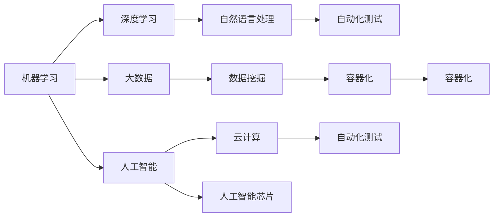

                 

# 软件2.0的技能图谱：数学、编程还是炼丹？

## 1. 背景介绍

在信息技术高速发展的今天，软件开发已经从传统的1.0时代逐步迈向了2.0时代。传统软件开发主要依赖程序员手工编写代码，而2.0时代则更加强调软件的自适应和自动化能力，引入了一系列新兴技术，如机器学习、大数据、云计算等。在这些技术的驱动下，软件的开发和维护变得更加高效和智能，同时也对软件开发者提出了新的要求。

本文将探讨在软件2.0时代，作为一名软件开发者，需要掌握的技能图谱，包括数学、编程以及一些新的技术和理念，如机器学习、人工智能、大数据等。我们将从这些技术的基本原理和应用出发，分析其在软件开发中的应用，并给出一些实际案例和代码实现。

## 2. 核心概念与联系

### 2.1 核心概念概述

软件开发2.0时代，需要掌握的核心概念和技能包括：

- **机器学习（Machine Learning, ML）**：通过数据训练模型，实现预测、分类、聚类等功能，广泛应用于推荐系统、自然语言处理等领域。
- **深度学习（Deep Learning, DL）**：一种特殊的机器学习方法，基于多层神经网络，能够处理复杂非线性问题。
- **大数据（Big Data）**：通过处理大规模数据，挖掘出有价值的信息，支撑企业决策。
- **人工智能（Artificial Intelligence, AI）**：使计算机具备类人智能，包括感知、学习、推理等功能。
- **云计算（Cloud Computing）**：基于互联网的计算模式，通过网络提供高性能计算能力。
- **自然语言处理（Natural Language Processing, NLP）**：使计算机能够理解和生成自然语言，如语音识别、情感分析等。
- **数据挖掘（Data Mining）**：从大量数据中提取隐含的知识和规律，支撑业务决策。
- **人工智能芯片（AI Chip）**：专门用于加速AI模型计算的硬件设备，如TPU、GPU等。
- **自动化测试（Automated Testing）**：通过编写自动化测试用例，实现软件测试的自动化，提高测试效率和覆盖率。
- **容器化（Containerization）**：通过容器技术，实现软件部署的自动化、可移植性和可伸缩性。

### 2.2 核心概念原理和架构的 Mermaid 流程图



这些核心概念之间存在紧密的联系，相互支撑，共同构成了软件2.0时代的技术体系。下面我们从机器学习开始，深入探讨这些技术的原理和应用。

## 3. 核心算法原理 & 具体操作步骤

### 3.1 算法原理概述

机器学习是数据驱动的智能技术，其核心思想是通过训练模型，让机器能够从数据中学习规律，并用于预测或分类。深度学习是机器学习的一个子集，通过多层神经网络，能够处理更复杂的非线性问题。

在软件2.0时代，机器学习和深度学习技术被广泛应用于各个领域，如图像识别、语音识别、自然语言处理等。这些技术不仅能够提升软件的智能化水平，还能显著提高软件的开发效率和用户体验。

### 3.2 算法步骤详解

机器学习和深度学习的算法步骤大致包括以下几个步骤：

1. **数据收集与预处理**：收集原始数据，并进行清洗、去重、归一化等预处理操作。
2. **特征工程**：提取和设计对模型有帮助的特征，减少噪音，提高模型的泛化能力。
3. **模型训练**：通过训练数据训练模型，找到最优的模型参数。
4. **模型评估**：在测试数据上评估模型性能，如准确率、召回率、F1-score等指标。
5. **模型优化**：通过调整模型参数、增加正则化等方法，提高模型性能。
6. **模型部署**：将训练好的模型部署到实际应用中，实现实时预测或分类。

### 3.3 算法优缺点

**机器学习的优点**：

- 能够处理大规模数据，挖掘出隐含的知识和规律。
- 能够处理非线性问题，模型性能较好。
- 可以不断学习和更新，实现自适应。

**机器学习的缺点**：

- 需要大量的标注数据进行训练，获取数据成本较高。
- 模型复杂度较高，训练和部署成本高。
- 对数据的噪声和异常值敏感，容易过拟合。

**深度学习的优点**：

- 能够处理更复杂的非线性问题，模型性能更好。
- 能够自动提取特征，减少人工干预。

**深度学习的缺点**：

- 需要大量的标注数据和计算资源，训练成本高。
- 模型复杂度高，容易过拟合。
- 模型难以解释，缺乏可解释性。

### 3.4 算法应用领域

机器学习和深度学习技术在软件2.0时代得到了广泛应用，涵盖了各个领域，包括但不限于：

- **图像识别**：如人脸识别、物体检测等。
- **语音识别**：如语音转文本、文本转语音等。
- **自然语言处理**：如情感分析、机器翻译、问答系统等。
- **推荐系统**：如商品推荐、新闻推荐等。
- **金融风控**：如信用评分、风险预测等。
- **医疗诊断**：如影像分析、病历诊断等。
- **智能客服**：如自动回复、情感分析等。
- **智能制造**：如设备监测、故障预测等。

## 4. 数学模型和公式 & 详细讲解 & 举例说明

### 4.1 数学模型构建

在机器学习和深度学习中，数学模型是核心。常见的数学模型包括线性回归、逻辑回归、决策树、支持向量机、神经网络等。这里以神经网络为例，介绍其数学模型构建。

神经网络是一个由多层神经元组成的网络，每一层都包含多个神经元。输入层接收原始数据，经过若干隐藏层，最终输出预测结果。神经网络的核心是权重矩阵和偏置向量，它们控制着输入和输出之间的关系。

### 4.2 公式推导过程

以多层感知器（Multilayer Perceptron, MLP）为例，其数学模型推导如下：

$$
\hat{y} = \sigma(W_n \hat{x} + b_n) = \sigma(W_{n-1} \sigma(W_{n-2} \hat{x} + b_{n-2}) + b_{n-1})
$$

其中，$\sigma$ 为激活函数，$W$ 和 $b$ 分别为权重矩阵和偏置向量，$\hat{x}$ 为输入数据。

### 4.3 案例分析与讲解

下面我们以情感分析任务为例，展示如何使用机器学习进行情感分类。

首先，收集情感分析的训练数据集，并对其进行预处理，包括文本分词、去除停用词、词向量化等。然后，设计特征工程，提取文本中的特征，如词频、TF-IDF、词向量化等。

接着，选择合适的机器学习模型进行训练。以朴素贝叶斯分类器为例，使用交叉验证方法进行模型训练和评估。在测试集上进行性能测试，如准确率、召回率、F1-score等指标。最后，将训练好的模型部署到实际应用中，实现实时情感分析。

## 5. 项目实践：代码实例和详细解释说明

### 5.1 开发环境搭建

在进行机器学习项目实践时，需要安装Python和常用的科学计算库，如NumPy、Pandas、SciPy等。同时，安装机器学习框架，如TensorFlow、PyTorch、Scikit-learn等。这些库提供了丰富的机器学习算法和工具，方便开发者进行模型训练和部署。

### 5.2 源代码详细实现

以情感分析为例，展示如何使用TensorFlow进行模型训练和部署。

```python
import tensorflow as tf
import numpy as np

# 加载数据集
from tensorflow.keras.datasets import imdb
(x_train, y_train), (x_test, y_test) = imdb.load_data(num_words=10000)

# 数据预处理
x_train = np.reshape(x_train, (len(x_train), 10000))
x_test = np.reshape(x_test, (len(x_test), 10000))

# 构建模型
model = tf.keras.Sequential([
    tf.keras.layers.Embedding(10000, 16, input_length=10000),
    tf.keras.layers.GlobalAveragePooling1D(),
    tf.keras.layers.Dense(16, activation='relu'),
    tf.keras.layers.Dense(1, activation='sigmoid')
])

# 编译模型
model.compile(optimizer='adam', loss='binary_crossentropy', metrics=['accuracy'])

# 训练模型
model.fit(x_train, y_train, epochs=10, validation_data=(x_test, y_test))

# 评估模型
test_loss, test_acc = model.evaluate(x_test, y_test)
print('Test accuracy:', test_acc)
```

### 5.3 代码解读与分析

这段代码展示了如何使用TensorFlow进行情感分析的模型训练和评估。首先，加载IMDB数据集，并对数据进行预处理，将其转化为模型所需的格式。然后，定义一个简单的神经网络模型，包含嵌入层、池化层和全连接层。最后，编译模型，并使用交叉验证方法进行训练和评估。

## 6. 实际应用场景

### 6.1 智能客服系统

智能客服系统是机器学习在实际应用中的典型案例之一。通过训练机器学习模型，智能客服系统可以自动理解用户意图，并给出相应的回答。例如，可以使用自然语言处理技术，对用户的问题进行分词、实体识别等处理，然后使用情感分析等技术，判断用户的情绪状态，从而给出合适的回答。

### 6.2 推荐系统

推荐系统是机器学习在电商、新闻等领域的常见应用。通过训练机器学习模型，推荐系统可以根据用户的历史行为，推荐可能感兴趣的物品或新闻。例如，可以使用协同过滤算法，分析用户之间的相似性，从而进行推荐。

### 6.3 金融风控

金融风控是机器学习在金融领域的重要应用之一。通过训练机器学习模型，金融风控系统可以预测用户的信用评分、风险等级等。例如，可以使用决策树模型，对用户的信用记录、收入情况等进行综合分析，从而进行风险评估。

## 7. 工具和资源推荐

### 7.1 学习资源推荐

- **《Python机器学习》**：介绍机器学习基础和常用算法，包括线性回归、逻辑回归、决策树等。
- **《深度学习》**：介绍深度学习基础和常用算法，包括卷积神经网络、循环神经网络等。
- **《机器学习实战》**：通过实际案例，展示机器学习算法的应用。
- **《TensorFlow官方文档》**：介绍TensorFlow的安装、使用和模型训练方法。
- **《Scikit-learn官方文档》**：介绍Scikit-learn的安装、使用和常用算法。

### 7.2 开发工具推荐

- **Jupyter Notebook**：一个交互式的编程环境，方便进行代码编写和模型训练。
- **PyCharm**：一个专业的Python开发工具，提供代码补全、调试、版本控制等功能。
- **Anaconda**：一个Python环境管理工具，方便进行虚拟环境搭建和管理。

### 7.3 相关论文推荐

- **《深度学习》**：Ian Goodfellow等人的经典之作，介绍了深度学习的基础和常用算法。
- **《机器学习》**：Tom Mitchell的经典之作，介绍了机器学习的基础和常用算法。
- **《大数据时代》**：Viktor Mayer-Schönberger的著作，介绍了大数据的基础和应用。
- **《云计算》**：Moshe Zadka的经典之作，介绍了云计算的基础和常用技术。
- **《自然语言处理综论》**：Jurafsky等人的经典之作，介绍了自然语言处理的基础和常用算法。

## 8. 总结：未来发展趋势与挑战

### 8.1 研究成果总结

软件2.0时代，机器学习和深度学习技术取得了长足进步，广泛应用于各个领域。这些技术不仅提升了软件的智能化水平，还大大降低了软件开发和维护的成本。未来，随着技术的不断进步，机器学习和深度学习技术将在更多领域得到应用，为各行各业带来新的机遇和挑战。

### 8.2 未来发展趋势

未来，机器学习和深度学习技术将呈现以下几个发展趋势：

- **自动化和智能化**：机器学习和深度学习技术的自动化和智能化程度将进一步提升，减少人工干预，提高工作效率。
- **模型可解释性**：模型可解释性将成为研究热点，通过对模型的解释，帮助开发者更好地理解和优化模型。
- **边缘计算**：机器学习和深度学习技术将向边缘计算方向发展，实现更高效的本地数据处理和分析。
- **跨模态学习**：机器学习和深度学习技术将进一步向跨模态学习方向发展，实现多模态数据的融合和分析。
- **联邦学习**：机器学习和深度学习技术将向联邦学习方向发展，实现数据隐私保护和分布式训练。

### 8.3 面临的挑战

尽管机器学习和深度学习技术取得了巨大成功，但在未来发展中，仍面临以下挑战：

- **数据隐私和安全**：数据隐私和安全问题将日益凸显，如何在保护数据隐私的前提下，实现模型的训练和应用，是一个重要的挑战。
- **模型可解释性**：尽管模型可解释性逐渐受到关注，但目前大部分模型仍缺乏可解释性，如何提高模型的可解释性，是一个亟待解决的问题。
- **计算资源和成本**：机器学习和深度学习技术需要大量的计算资源和成本，如何降低计算成本，提高模型训练和推理效率，是一个重要的研究方向。
- **模型鲁棒性**：模型鲁棒性问题将逐渐显现，如何在数据多样性和复杂性增加的情况下，保证模型的稳定性和鲁棒性，是一个重要的挑战。
- **模型优化和调优**：模型优化和调优技术仍需进一步提升，如何在保证模型精度的前提下，优化模型的计算资源和推理效率，是一个重要的研究方向。

### 8.4 研究展望

未来，机器学习和深度学习技术需要从以下几个方向进行研究和探索：

- **无监督学习和半监督学习**：在数据标注成本较高的情况下，无监督学习和半监督学习将具有重要意义，进一步降低数据标注成本。
- **跨领域迁移学习**：通过跨领域迁移学习，实现模型的泛化能力和迁移能力，提高模型的适应性。
- **模型压缩和加速**：通过模型压缩和加速技术，减少模型的计算资源和推理时间，提升模型的应用效率。
- **模型可解释性和可视化**：通过模型可解释性和可视化技术，提升模型的透明性和可解释性，帮助开发者更好地理解和优化模型。
- **跨模态学习和融合**：通过跨模态学习和融合技术，实现多模态数据的融合和分析，提升模型的综合能力。

## 9. 附录：常见问题与解答

**Q1：如何选择合适的机器学习算法？**

A: 选择机器学习算法时，需要考虑数据的特点、问题的复杂度和模型的应用场景。常用的算法包括线性回归、逻辑回归、决策树、支持向量机、神经网络等。在实际应用中，需要根据具体问题进行选择和调优。

**Q2：如何避免模型过拟合？**

A: 避免模型过拟合的方法包括正则化、dropout、早停等。正则化方法可以限制模型的复杂度，避免过拟合。Dropout方法可以随机关闭一些神经元，减少模型的过拟合。早停方法可以在模型训练过程中，及时停止训练，避免过拟合。

**Q3：如何在数据量不足的情况下进行模型训练？**

A: 在数据量不足的情况下，可以使用迁移学习和半监督学习等方法。迁移学习可以将预训练模型的知识迁移到新任务中，提升模型的泛化能力。半监督学习可以使用少量标注数据和大量未标注数据进行联合训练，提升模型的性能。

**Q4：如何提高模型的可解释性？**

A: 提高模型可解释性的方法包括模型可视化、局部可解释性方法等。模型可视化方法可以展示模型的决策过程，帮助开发者更好地理解模型的行为。局部可解释性方法可以在特定情况下，提供局部可解释性，帮助开发者更好地理解和优化模型。

**Q5：如何平衡模型的计算资源和推理效率？**

A: 平衡模型计算资源和推理效率的方法包括模型压缩和加速技术。模型压缩方法可以减小模型的参数量和计算量，提升模型的推理效率。模型加速技术可以通过硬件加速和优化算法，提升模型的计算效率。

总之，软件2.0时代，机器学习和深度学习技术将成为软件开发的重要工具和手段。开发者需要不断学习和掌握这些技术，才能在激烈的竞争中占据优势。未来，随着技术的不断进步，机器学习和深度学习技术将在更多领域得到应用，为各行各业带来新的机遇和挑战。只有勇于创新、敢于突破，才能不断拓展机器学习和深度学习技术的边界，让智能技术更好地造福人类社会。

---

作者：禅与计算机程序设计艺术 / Zen and the Art of Computer Programming

