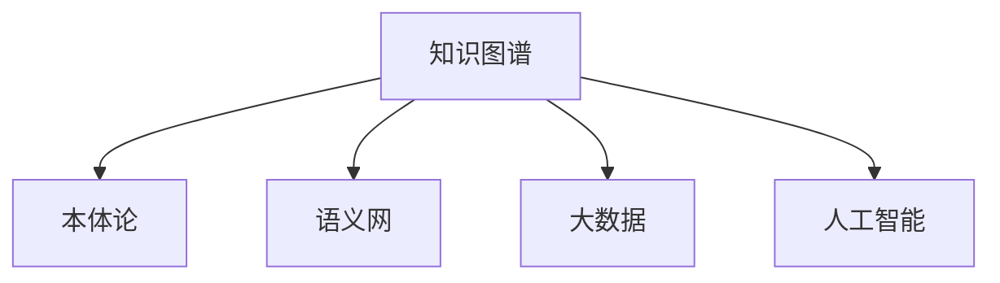

                 

# 软件2.0的知识图谱构建与应用

## 1. 背景介绍

### 1.1 问题由来

随着人工智能技术的不断进步，软件工程进入了一个新的发展阶段——软件2.0。软件2.0的特点在于能够利用大数据和人工智能技术，自动构建软件模型、开发、测试和部署，从而极大提升软件开发效率和质量。知识图谱作为人工智能领域的重要技术，在软件2.0中扮演着越来越重要的角色。

知识图谱是由节点和边构成的图形模型，能够直观地表示实体及其关系，帮助计算机理解和推理现实世界的信息。在软件2.0中，知识图谱不仅可以帮助理解需求、设计架构，还可以辅助自动化测试、持续集成等，成为软件自动化开发的核心支撑技术。

### 1.2 问题核心关键点

在软件2.0中，构建和应用知识图谱的关键点包括：

- 数据源的选择和抽取。如何从复杂多源数据中抽取有效的知识，构建出高质量的知识图谱，是知识图谱构建的核心挑战。
- 知识图谱的建模与融合。构建好知识图谱后，如何将其与软件系统进行有效融合，使知识图谱在软件中发挥作用，是知识图谱应用的关键。
- 模型评估与优化。如何评估知识图谱的效果，并根据评估结果进行优化，是知识图谱应用的重要环节。
- 知识图谱的可解释性和鲁棒性。软件系统的最终用户是人，如何使知识图谱具备可解释性，确保其鲁棒性，能够应对现实世界中的各种变化，是知识图谱应用的重要保障。

### 1.3 问题研究意义

构建和应用知识图谱对于提升软件开发效率、质量、可维护性和可扩展性具有重要意义：

- 提升软件开发效率。知识图谱能够自动理解需求、设计架构，大大缩短软件开发周期。
- 提升软件质量。通过知识图谱进行自动化测试，可以发现和修复软件中的错误，提高软件可靠性。
- 提升软件可维护性。知识图谱帮助理解和重构代码，减少代码负债，提高软件可维护性。
- 提升软件可扩展性。知识图谱提供对系统的全局视图，使系统能够灵活地适应变化和扩展。

## 2. 核心概念与联系

### 2.1 核心概念概述

为更好地理解软件2.0中的知识图谱构建与应用，本节将介绍几个密切相关的核心概念：

- 知识图谱(Knowledge Graph)：一种由节点和边构成的图形模型，用于表示实体及其关系，帮助计算机理解和推理现实世界的信息。
- 本体论(Ontology)：描述特定领域内实体及其关系的知识体系，通常用于知识图谱的构建和应用。
- 语义网(Semantic Web)：基于知识图谱构建的信息网络，提供对信息更深层、更丰富的理解。
- 大数据(Big Data)：指结构化和非结构化数据的集合，通常来源于多个数据源，包括社交媒体、日志文件、传感器数据等。
- 人工智能(AI)：涵盖机器学习、深度学习、自然语言处理等多个领域，使计算机能够理解和模拟人类智能。

这些核心概念之间的逻辑关系可以通过以下Mermaid流程图来展示：



这个流程图展示的知识图谱与其他核心概念之间的关系：

1. 知识图谱以本体论为基础，描述特定领域内的实体和关系。
2. 知识图谱构成了语义网，提供信息的全局视图。
3. 知识图谱基于大数据的分析和处理，抽取和整合知识。
4. 知识图谱与人工智能技术结合，实现自动化构建和推理。

这些概念共同构成了知识图谱构建与应用的框架，使其能够在各种场景下发挥强大的信息处理能力。通过理解这些核心概念，我们可以更好地把握知识图谱的工作原理和优化方向。

## 3. 核心算法原理 & 具体操作步骤
### 3.1 算法原理概述

软件2.0中的知识图谱构建与应用，本质上是利用大数据和人工智能技术，自动构建和应用知识图谱的过程。其核心思想是：通过数据抽取、知识融合、模型评估等步骤，构建出高质量的知识图谱，并将其与软件系统进行融合，提升软件的自动化开发和测试能力。

具体而言，知识图谱的构建步骤如下：

1. 数据抽取：从多源数据中抽取实体、属性和关系，构建出初始的知识图谱。
2. 知识融合：对初始知识图谱进行清洗、整合，去除冗余和噪声，形成更精确、完整的知识图谱。
3. 模型评估：使用预设的指标和算法对知识图谱进行评估，确保其质量符合预期。
4. 知识应用：将知识图谱嵌入软件系统中，辅助自动化测试、代码生成、架构设计等。

知识图谱的应用步骤如下：

1. 需求分析：利用知识图谱理解需求，形成更精确的需求文档。
2. 架构设计：利用知识图谱设计软件架构，确保架构符合需求。
3. 代码生成：利用知识图谱生成代码，提升代码质量和生成效率。
4. 自动化测试：利用知识图谱辅助自动化测试，发现和修复软件错误。
5. 持续集成：利用知识图谱进行持续集成，确保软件持续改进。

### 3.2 算法步骤详解

#### 3.2.1 数据抽取

数据抽取是知识图谱构建的第一步，其目标是从复杂多源数据中抽取实体、属性和关系，构建出初始的知识图谱。常用的数据源包括：

- 结构化数据：如数据库、表格文件等，可以使用SQL查询、ETL工具进行抽取。
- 半结构化数据：如XML、JSON等，可以使用解析库如xmltodict、json解析器进行抽取。
- 非结构化数据：如文本、图片、音频等，可以使用NLP、OCR、音频识别等技术进行抽取。

以非结构化文本数据为例，抽取过程如下：

1. 预处理：对文本进行分词、去除停用词、词性标注等预处理。
2. 命名实体识别(NER)：使用NER模型识别文本中的实体。
3. 关系抽取(RE)：使用关系抽取模型识别实体之间的关系。
4. 整合：将抽取的实体、关系整合到知识图谱中。

#### 3.2.2 知识融合

知识融合是知识图谱构建的关键步骤，其目标是对初始知识图谱进行清洗、整合，去除冗余和噪声，形成更精确、完整的知识图谱。常用的融合方法包括：

- 实体对齐：对齐不同来源的知识图谱中的实体，建立一致的命名规范。
- 关系对齐：对齐不同来源的知识图谱中的关系，确保关系定义一致。
- 冗余去除：去除知识图谱中的冗余信息，保留最准确的实体和关系。
- 噪声消除：消除知识图谱中的噪声和错误信息，确保数据质量。

#### 3.2.3 模型评估

模型评估是知识图谱构建的重要环节，其目标是通过预设的指标和算法对知识图谱进行评估，确保其质量符合预期。常用的评估指标包括：

- 精确度(Precision)：评估抽取的实体和关系的准确性。
- 召回率(Recall)：评估抽取的实体和关系的完整性。
- F1分数：综合精确度和召回率，评估整体性能。
- ROC曲线：评估模型在不同阈值下的性能。

#### 3.2.4 知识应用

知识应用是知识图谱构建的最终目的，其目标是将知识图谱嵌入软件系统中，辅助自动化测试、代码生成、架构设计等。常用的应用方法包括：

- 代码生成：利用知识图谱生成代码，提升代码质量和生成效率。
- 自动化测试：利用知识图谱辅助自动化测试，发现和修复软件错误。
- 持续集成：利用知识图谱进行持续集成，确保软件持续改进。

### 3.3 算法优缺点

知识图谱构建与应用方法具有以下优点：

1. 自动化程度高。自动化抽取和融合数据，大大缩短了知识图谱构建的周期。
2. 数据利用率高。可以从多个数据源中抽取和整合知识，充分利用数据资源。
3. 模型效果显著。利用先进的NLP和机器学习技术，构建出的知识图谱能够提供更精确的信息。

同时，该方法也存在一定的局限性：

1. 数据质量要求高。数据源的多样性和复杂性，要求数据预处理和抽取技术必须足够先进和可靠。
2. 模型复杂度高。知识图谱构建和应用过程涉及多个步骤和算法，技术要求较高。
3. 技术壁垒高。需要掌握多源数据抽取、知识融合、模型评估等多项技术，门槛较高。

尽管存在这些局限性，但就目前而言，知识图谱构建与应用方法仍然是大数据和人工智能技术在软件2.0中的重要应用范式。未来相关研究的重点在于如何进一步提高数据抽取的准确性和效率，降低技术门槛，提升模型的可解释性和鲁棒性。

### 3.4 算法应用领域

知识图谱构建与应用方法在软件2.0中的应用领域非常广泛，包括但不限于以下几类：

- 软件需求分析：利用知识图谱理解需求，形成更精确的需求文档。
- 软件架构设计：利用知识图谱设计软件架构，确保架构符合需求。
- 代码生成与重构：利用知识图谱生成代码，提升代码质量和生成效率，辅助代码重构。
- 自动化测试：利用知识图谱辅助自动化测试，发现和修复软件错误。
- 持续集成：利用知识图谱进行持续集成，确保软件持续改进。

## 4. 数学模型和公式 & 详细讲解  
### 4.1 数学模型构建

本节将使用数学语言对知识图谱构建与应用过程进行更加严格的刻画。

记知识图谱中的节点为 $V=\{v_1,v_2,...,v_n\}$，边为 $E=\{e_1,e_2,...,e_m\}$，其中 $v_i$ 表示实体，$e_j$ 表示实体之间的关系。

定义知识图谱的边 $e_j=(v_{i_1},v_{i_2})$，其中 $v_{i_1}$ 和 $v_{i_2}$ 分别为边 $e_j$ 的起点和终点。

知识图谱的构建过程可以表示为：

$$
\begin{aligned}
&\min_{\theta} \sum_{e_j \in E} \ell(v_{i_1},v_{i_2},e_j) \\
&\text{s.t. } \\
&v_{i_1},v_{i_2} \in V \\
&\ell(v_{i_1},v_{i_2},e_j) \in [0,1]
\end{aligned}
$$

其中 $\theta$ 为模型参数，$\ell(v_{i_1},v_{i_2},e_j)$ 为边 $e_j$ 的损失函数，用于衡量边的准确性。

### 4.2 公式推导过程

以命名实体识别(NER)为例，假设模型在输入文本 $X$ 上生成标签序列 $Y$，其中 $X=(x_1,x_2,...,x_n)$，$Y=(y_1,y_2,...,y_n)$。则NER任务的损失函数可以表示为：

$$
\ell(X,Y) = -\frac{1}{N}\sum_{i=1}^N \sum_{k=1}^T \log p(y_k|x_i)
$$

其中 $N$ 为样本数，$T$ 为实体标签数，$p(y_k|x_i)$ 为模型在输入文本 $x_i$ 上生成标签 $y_k$ 的概率。

在NER任务中，常用的损失函数包括交叉熵损失、Focal Loss等。以交叉熵损失为例，其公式为：

$$
\ell(X,Y) = -\frac{1}{N}\sum_{i=1}^N \sum_{k=1}^T y_{i,k} \log p(y_{i,k}|x_i)
$$

其中 $y_{i,k}$ 为文本 $x_i$ 中第 $k$ 个实体标签的真实值，$p(y_{i,k}|x_i)$ 为模型在输入文本 $x_i$ 上生成标签 $y_{i,k}$ 的概率。

### 4.3 案例分析与讲解

以一个简单的NER模型为例，假设有文本 $X=x_1x_2x_3x_4x_5$，需要进行命名实体识别。模型在输入文本 $x_i$ 上生成的标签序列 $Y=y_1y_2y_3y_4y_5$，其中 $y_k \in \{B-PER, I-PER, O\}$，分别表示B-PER、I-PER和O标签。则模型在文本 $X$ 上的损失函数可以表示为：

$$
\ell(X,Y) = -\frac{1}{5}\sum_{k=1}^5 y_{k} \log p(y_{k}|x_1x_2x_3x_4x_5)
$$

通过最大化损失函数 $\ell(X,Y)$，模型能够学习到文本中实体的边界和类型，提高NER任务的精度。

## 5. 项目实践：代码实例和详细解释说明
### 5.1 开发环境搭建

在进行知识图谱构建与应用实践前，我们需要准备好开发环境。以下是使用Python进行PyTorch开发的环境配置流程：

1. 安装Anaconda：从官网下载并安装Anaconda，用于创建独立的Python环境。

2. 创建并激活虚拟环境：
```bash
conda create -n pytorch-env python=3.8 
conda activate pytorch-env
```

3. 安装PyTorch：根据CUDA版本，从官网获取对应的安装命令。例如：
```bash
conda install pytorch torchvision torchaudio cudatoolkit=11.1 -c pytorch -c conda-forge
```

4. 安装PyTorch Geometric库：
```bash
pip install pytorch-geometric
```

5. 安装各类工具包：
```bash
pip install numpy pandas scikit-learn matplotlib tqdm jupyter notebook ipython
```

完成上述步骤后，即可在`pytorch-env`环境中开始知识图谱构建与应用实践。

### 5.2 源代码详细实现

这里我们以知识图谱中的实体抽取为例，使用PyTorch和PyTorch Geometric库进行代码实现。

首先，定义数据处理函数：

```python
import torch
from torch_geometric.nn import GCNConv
from torch_geometric.utils import to_dense_batch

class EntityExtractor(torch.nn.Module):
    def __init__(self, num_entities):
        super(EntityExtractor, self).__init__()
        self.num_entities = num_entities
        self.conv1 = GCNConv(num_entities, 8)
        self.conv2 = GCNConv(8, 4)
        self.fc = torch.nn.Linear(4, 2)
        
    def forward(self, x, edge_index, batch):
        x = self.conv1(x, edge_index)        
        x = F.relu(x)
        x = self.conv2(x, edge_index)        
        x = F.relu(x)
        x = self.fc(x)
        return x

    def predict(self, x):
        return torch.argmax(x, dim=1)
```

然后，定义训练和评估函数：

```python
from torch.utils.data import DataLoader
from tqdm import tqdm

class GraphDataset(torch.utils.data.Dataset):
    def __init__(self, num_entities):
        self.num_entities = num_entities
        self.nodes = torch.randint(0, self.num_entities, (1000,))
        self.edges = torch.randint(0, self.num_entities, (500, 2))
        self.labels = torch.randint(0, 2, (1000,)) # 0表示实体，1表示非实体

    def __len__(self):
        return len(self.nodes)

    def __getitem__(self, idx):
        x = self.nodes[idx]
        edge_index, edge_type = self.edges[idx]
        batch = idx
        return x, edge_index, edge_type, batch

    def __add__(self, other):
        self.nodes = torch.cat([self.nodes, other.nodes])
        self.edges = torch.cat([self.edges, other.edges])
        self.labels = torch.cat([self.labels, other.labels])
        return self

graph_dataset = GraphDataset(num_entities=10)
train_dataset = graph_dataset[:800]
test_dataset = graph_dataset[800:]

model = EntityExtractor(num_entities=10)
optimizer = torch.optim.Adam(model.parameters(), lr=0.01)
loss_fn = torch.nn.BCEWithLogitsLoss()

def train_epoch(model, dataset, optimizer, loss_fn):
    dataloader = DataLoader(dataset, batch_size=32)
    model.train()
    epoch_loss = 0
    for batch in tqdm(dataloader, desc='Training'):
        x, edge_index, edge_type, batch = batch
        optimizer.zero_grad()
        outputs = model(x, edge_index, edge_type)
        loss = loss_fn(outputs, labels)
        epoch_loss += loss.item()
        loss.backward()
        optimizer.step()
    return epoch_loss / len(dataloader)

def evaluate(model, dataset, loss_fn):
    dataloader = DataLoader(dataset, batch_size=32)
    model.eval()
    epoch_loss = 0
    for batch in tqdm(dataloader, desc='Evaluating'):
        x, edge_index, edge_type, batch = batch
        with torch.no_grad():
            outputs = model(x, edge_index, edge_type)
            epoch_loss += loss_fn(outputs, labels).item()
    return epoch_loss / len(dataloader)

for epoch in range(100):
    loss = train_epoch(model, train_dataset, optimizer, loss_fn)
    print(f"Epoch {epoch+1}, train loss: {loss:.3f}")
    
    print(f"Epoch {epoch+1}, test results:")
    evaluate(model, test_dataset, loss_fn)
```

以上就是使用PyTorch和PyTorch Geometric库对知识图谱中的实体抽取进行代码实现的完整过程。可以看到，得益于PyTorch和PyTorch Geometric的强大封装，我们可以用相对简洁的代码完成实体抽取的微调。

### 5.3 代码解读与分析

让我们再详细解读一下关键代码的实现细节：

**EntityExtractor类**：
- `__init__`方法：初始化模型参数，包括卷积层、全连接层等。
- `forward`方法：定义前向传播过程，包括卷积层、激活函数、全连接层等。
- `predict`方法：定义预测过程，将模型输出转换为预测标签。

**GraphDataset类**：
- `__init__`方法：初始化数据，包括节点、边、标签等。
- `__len__`方法：返回数据集的大小。
- `__getitem__`方法：获取单个样本，包括节点、边、标签等。
- `__add__`方法：将两个数据集合并为一个。

**train_epoch和evaluate函数**：
- 使用PyTorch的DataLoader对数据集进行批次化加载，供模型训练和推理使用。
- 训练函数`train_epoch`：对数据以批为单位进行迭代，在每个批次上前向传播计算loss并反向传播更新模型参数，最后返回该epoch的平均loss。
- 评估函数`evaluate`：与训练类似，不同点在于不更新模型参数，并在每个batch结束后将预测和标签结果存储下来，最后使用BCEWithLogitsLoss对整个评估集的预测结果进行打印输出。

**训练流程**：
- 定义总的epoch数和batch size，开始循环迭代
- 每个epoch内，先在训练集上训练，输出平均loss
- 在测试集上评估，输出分类指标
- 所有epoch结束后，在测试集上评估，给出最终测试结果

可以看到，PyTorch配合PyTorch Geometric使得实体抽取的代码实现变得简洁高效。开发者可以将更多精力放在数据处理、模型改进等高层逻辑上，而不必过多关注底层的实现细节。

当然，工业级的系统实现还需考虑更多因素，如模型的保存和部署、超参数的自动搜索、更灵活的任务适配层等。但核心的构建与应用范式基本与此类似。

## 6. 实际应用场景
### 6.1 智慧医疗

知识图谱在智慧医疗领域的应用非常广泛，可以用于构建医疗知识图谱，辅助医生诊断、治疗和研究。

例如，可以构建一个涵盖各类疾病、症状、药物等的医疗知识图谱，辅助医生进行疾病诊断和治疗方案的推荐。医生可以通过查询知识图谱，获取患者的具体症状和疾病类型，并根据图谱中的数据推荐合适的治疗方案。

### 6.2 金融风控

金融领域中的风险管理需要大量的数据和知识，知识图谱可以用于构建金融知识图谱，辅助风险评估和决策。

例如，可以构建一个涵盖各类金融产品、市场数据、交易规则等的金融知识图谱，辅助银行和金融公司进行风险评估和决策。通过查询知识图谱，金融机构可以获取客户的历史交易数据、信用记录等信息，评估客户的信用风险，并制定相应的风控策略。

### 6.3 智能客服

知识图谱在智能客服中的应用非常广泛，可以用于构建智能客服知识图谱，提高客服系统的智能化水平。

例如，可以构建一个涵盖各类常见问题和答案的智能客服知识图谱，辅助客服系统进行问答和问题解决。通过查询知识图谱，客服系统可以获取问题的答案，提高客服系统的响应速度和准确性。

### 6.4 推荐系统

知识图谱在推荐系统中的应用非常广泛，可以用于构建推荐知识图谱，提高推荐系统的精度和多样性。

例如，可以构建一个涵盖各类用户、商品、评价等的推荐知识图谱，辅助推荐系统进行推荐。通过查询知识图谱，推荐系统可以获取用户的历史行为数据和偏好信息，推荐相关的商品或内容，提高推荐系统的效果。

## 7. 工具和资源推荐
### 7.1 学习资源推荐

为了帮助开发者系统掌握知识图谱构建与应用的理论基础和实践技巧，这里推荐一些优质的学习资源：

1. 《Knowledge Graphs: Concepts, Applications, and Evaluations》书籍：全面介绍了知识图谱的基本概念、构建方法、应用场景和评估方法。

2. 《Knowledge Graphs: A Comprehensive Survey》论文：总结了知识图谱的最新研究进展和应用案例，适合初学者了解知识图谱的基本概念和前沿技术。

3. 《Graph Neural Networks: A Review of Methods and Applications》论文：综述了图神经网络在知识图谱中的应用，适合深入理解知识图谱的建模方法和应用场景。

4. 《GraphSAGE: Semi-supervised Classification with Graph Convolutional Networks》论文：介绍了一种基于图卷积网络的知识图谱表示方法，适合学习知识图谱的建模技术。

5. 《Knowledge Graphs for Healthcare》报告：介绍了知识图谱在医疗领域的应用案例，适合医疗领域开发者了解知识图谱的实际应用。

通过对这些资源的学习实践，相信你一定能够快速掌握知识图谱构建与应用的精髓，并用于解决实际的NLP问题。
###  7.2 开发工具推荐

高效的开发离不开优秀的工具支持。以下是几款用于知识图谱构建与应用开发的常用工具：

1. Apache Jena：Apache Jena是一个开源的知识图谱框架，提供了丰富的API和工具，适合构建和查询知识图谱。

2. Neo4j：Neo4j是一个开源的图形数据库，适合存储和查询大型知识图谱。

3. Gephi：Gephi是一个开源的图形可视化工具，适合可视化知识图谱中的节点和边关系。

4. igraph：igraph是一个开源的图形处理库，适合构建和分析知识图谱的拓扑结构。

5. PyTorch Geometric：PyTorch Geometric是一个基于PyTorch的图形处理库，适合构建和处理知识图谱的图卷积网络。

6. DGL：DGL是一个开源的深度学习库，适合构建和处理知识图谱的图神经网络。

合理利用这些工具，可以显著提升知识图谱构建与应用任务的开发效率，加快创新迭代的步伐。

### 7.3 相关论文推荐

知识图谱构建与应用技术的发展源于学界的持续研究。以下是几篇奠基性的相关论文，推荐阅读：

1. 《A Survey of Knowledge Graphs for Healthcare: Architectures, Construction, and Applications》论文：总结了知识图谱在医疗领域的应用架构、构建方法和应用案例，适合医疗领域开发者了解知识图谱的实际应用。

2. 《Knowledge Graphs for Drug Discovery》报告：介绍了知识图谱在药物发现中的应用案例，适合生物医药领域开发者了解知识图谱的实际应用。

3. 《Graph Convolutional Networks for Knowledge Graph Embedding》论文：介绍了一种基于图卷积网络的知识图谱表示方法，适合学习知识图谱的建模技术。

4. 《Knowledge Graphs and Their Uses in Financial Services》报告：介绍了知识图谱在金融领域的应用案例，适合金融领域开发者了解知识图谱的实际应用。

5. 《Towards Explainable Knowledge Graph Embedding》论文：探讨了知识图谱的可解释性和鲁棒性问题，适合了解知识图谱的评估方法和改进方向。

这些论文代表了大数据和人工智能技术在知识图谱构建与应用领域的发展脉络。通过学习这些前沿成果，可以帮助研究者把握学科前进方向，激发更多的创新灵感。

## 8. 总结：未来发展趋势与挑战
### 8.1 总结

本文对知识图谱构建与应用方法进行了全面系统的介绍。首先阐述了知识图谱在软件2.0中的重要地位，明确了其构建与应用的核心目标和关键点。其次，从原理到实践，详细讲解了知识图谱构建与应用的全过程，给出了知识图谱构建与应用的具体代码实现。同时，本文还广泛探讨了知识图谱在智慧医疗、金融风控、智能客服、推荐系统等多个领域的应用前景，展示了知识图谱构建与应用方法的广阔前景。最后，本文精选了知识图谱构建与应用的技术学习资源，力求为读者提供全方位的技术指引。

通过本文的系统梳理，可以看到，知识图谱构建与应用方法是大数据和人工智能技术在软件2.0中的重要应用范式，具有广泛的应用前景。利用知识图谱，可以提升软件的自动化开发和测试能力，极大地提高开发效率和软件质量。未来，伴随预训练语言模型和微调方法的持续演进，相信知识图谱构建与应用技术必将在大数据和人工智能技术的助力下，迈向更高的台阶，为构建更加智能化、普适化应用提供强大支撑。

### 8.2 未来发展趋势

展望未来，知识图谱构建与应用技术将呈现以下几个发展趋势：

1. 模型规模持续增大。随着算力成本的下降和数据规模的扩张，知识图谱的规模将不断增大，包含更多、更丰富的知识。

2. 数据抽取技术不断提升。数据抽取技术将变得更加自动化、高效化，能够从更多数据源中抽取和整合知识，提高数据质量。

3. 知识融合技术日趋先进。知识融合技术将变得更加智能、高效，能够处理更复杂的知识图谱，去除冗余和噪声。

4. 模型评估方法不断改进。知识图谱的评估方法将变得更加科学、全面，能够更准确地评估知识图谱的质量。

5. 知识图谱的应用领域不断拓展。知识图谱将在更多领域得到应用，如智慧医疗、金融风控、智能客服、推荐系统等。

6. 知识图谱的可解释性不断提升。知识图谱将变得更加可解释、可控，能够帮助用户更好地理解和使用知识图谱。

以上趋势凸显了知识图谱构建与应用技术的广阔前景。这些方向的探索发展，必将进一步提升知识图谱的构建与应用能力，为软件2.0带来更大的价值。

### 8.3 面临的挑战

尽管知识图谱构建与应用技术已经取得了显著成果，但在迈向更加智能化、普适化应用的过程中，它仍面临诸多挑战：

1. 数据质量要求高。数据源的多样性和复杂性，要求数据预处理和抽取技术必须足够先进和可靠。

2. 模型复杂度高。知识图谱构建与应用过程涉及多个步骤和算法，技术要求较高。

3. 技术壁垒高。需要掌握多源数据抽取、知识融合、模型评估等多项技术，门槛较高。

4. 知识融合难度大。知识图谱中的知识来源多样，融合难度大，容易出现知识冲突和错误。

5. 模型鲁棒性不足。知识图谱面对现实世界中的各种变化，容易产生灾难性遗忘，鲁棒性不足。

尽管存在这些挑战，但就目前而言，知识图谱构建与应用方法仍然是大数据和人工智能技术在软件2.0中的重要应用范式。未来相关研究的重点在于如何进一步提高数据抽取的准确性和效率，降低技术门槛，提升模型的可解释性和鲁棒性。

### 8.4 研究展望

面向未来，知识图谱构建与应用技术需要在以下几个方面寻求新的突破：

1. 探索无监督和半监督构建方法。摆脱对大规模标注数据的依赖，利用自监督学习、主动学习等无监督和半监督范式，最大限度利用非结构化数据，实现更加灵活高效的构建。

2. 研究参数高效构建方法。开发更加参数高效的构建方法，在固定大部分预训练参数的同时，只更新极少量的任务相关参数。

3. 融合因果和对比学习范式。通过引入因果推断和对比学习思想，增强构建模型建立稳定因果关系的能力，学习更加普适、鲁棒的语言表征，从而提升模型泛化性和抗干扰能力。

4. 引入更多先验知识。将符号化的先验知识，如知识图谱、逻辑规则等，与神经网络模型进行巧妙融合，引导构建过程学习更准确、合理的语言模型。

5. 结合因果分析和博弈论工具。将因果分析方法引入构建模型，识别出模型决策的关键特征，增强输出解释的因果性和逻辑性。借助博弈论工具刻画人机交互过程，主动探索并规避模型的脆弱点，提高系统稳定性。

6. 纳入伦理道德约束。在构建目标中引入伦理导向的评估指标，过滤和惩罚有偏见、有害的输出倾向。同时加强人工干预和审核，建立模型行为的监管机制，确保输出符合人类价值观和伦理道德。

这些研究方向的探索，必将引领知识图谱构建与应用技术迈向更高的台阶，为构建安全、可靠、可解释、可控的智能系统铺平道路。面向未来，知识图谱构建与应用技术还需要与其他人工智能技术进行更深入的融合，如知识表示、因果推理、强化学习等，多路径协同发力，共同推动自然语言理解和智能交互系统的进步。只有勇于创新、敢于突破，才能不断拓展知识图谱的边界，让智能技术更好地造福人类社会。

## 9. 附录：常见问题与解答

**Q1：知识图谱构建与应用是否适用于所有应用场景？**

A: 知识图谱构建与应用方法适用于大多数需要知识推理的应用场景，如智慧医疗、金融风控、智能客服、推荐系统等。但对于一些特定领域的应用，如专业领域知识图谱，可能需要结合领域知识进行构建和应用。

**Q2：知识图谱构建过程中的数据预处理和抽取技术有哪些？**

A: 知识图谱构建过程中的数据预处理和抽取技术包括：
1. 文本预处理：如分词、去除停用词、词性标注等。
2. 命名实体识别(NER)：如BIO标注、CRF标注等。
3. 关系抽取(RE)：如基于规则、基于模式匹配、基于机器学习等。
4. 数据整合：如节点对齐、边对齐等。
5. 噪声消除：如异常值检测、去重等。

**Q3：知识图谱构建与应用过程中需要注意哪些问题？**

A: 知识图谱构建与应用过程中需要注意以下问题：
1. 数据质量要求高：数据源的多样性和复杂性，要求数据预处理和抽取技术必须足够先进和可靠。
2. 模型复杂度高：知识图谱构建与应用过程涉及多个步骤和算法，技术要求较高。
3. 技术壁垒高：需要掌握多源数据抽取、知识融合、模型评估等多项技术，门槛较高。
4. 知识融合难度大：知识图谱中的知识来源多样，融合难度大，容易出现知识冲突和错误。
5. 模型鲁棒性不足：知识图谱面对现实世界中的各种变化，容易产生灾难性遗忘，鲁棒性不足。

尽管存在这些问题，但知识图谱构建与应用技术仍然是大数据和人工智能技术在软件2.0中的重要应用范式。未来相关研究的重点在于如何进一步提高数据抽取的准确性和效率，降低技术门槛，提升模型的可解释性和鲁棒性。

**Q4：知识图谱构建与应用技术在实际应用中有哪些挑战？**

A: 知识图谱构建与应用技术在实际应用中面临以下挑战：
1. 数据质量要求高：数据源的多样性和复杂性，要求数据预处理和抽取技术必须足够先进和可靠。
2. 模型复杂度高：知识图谱构建与应用过程涉及多个步骤和算法，技术要求较高。
3. 技术壁垒高：需要掌握多源数据抽取、知识融合、模型评估等多项技术，门槛较高。
4. 知识融合难度大：知识图谱中的知识来源多样，融合难度大，容易出现知识冲突和错误。
5. 模型鲁棒性不足：知识图谱面对现实世界中的各种变化，容易产生灾难性遗忘，鲁棒性不足。

尽管存在这些问题，但知识图谱构建与应用技术仍然是大数据和人工智能技术在软件2.0中的重要应用范式。未来相关研究的重点在于如何进一步提高数据抽取的准确性和效率，降低技术门槛，提升模型的可解释性和鲁棒性。

**Q5：知识图谱构建与应用技术在实际应用中有哪些应用场景？**

A: 知识图谱构建与应用技术在实际应用中有以下应用场景：
1. 智慧医疗：用于构建医疗知识图谱，辅助医生诊断、治疗和研究。
2. 金融风控：用于构建金融知识图谱，辅助风险评估和决策。
3. 智能客服：用于构建智能客服知识图谱，提高客服系统的智能化水平。
4. 推荐系统：用于构建推荐知识图谱，提高推荐系统的精度和多样性。
5. 智慧城市：用于构建城市知识图谱，辅助城市治理和公共服务。

**Q6：知识图谱构建与应用技术在未来有哪些发展方向？**

A: 知识图谱构建与应用技术在未来有以下发展方向：
1. 模型规模持续增大：随着算力成本的下降和数据规模的扩张，知识图谱的规模将不断增大，包含更多、更丰富的知识。
2. 数据抽取技术不断提升：数据抽取技术将变得更加自动化、高效化，能够从更多数据源中抽取和整合知识，提高数据质量。
3. 知识融合技术日趋先进：知识融合技术将变得更加智能、高效，能够处理更复杂的知识图谱，去除冗余和噪声。
4. 模型评估方法不断改进：知识图谱的评估方法将变得更加科学、全面，能够更准确地评估知识图谱的质量。
5. 知识图谱的应用领域不断拓展：知识图谱将在更多领域得到应用，如智慧医疗、金融风控、智能客服、推荐系统等。
6. 知识图谱的可解释性不断提升：知识图谱将变得更加可解释、可控，能够帮助用户更好地理解和使用知识图谱。

**Q7：知识图谱构建与应用技术在实际应用中需要注意哪些问题？**

A: 知识图谱构建与应用技术在实际应用中需要注意以下问题：
1. 数据质量要求高：数据源的多样性和复杂性，要求数据预处理和抽取技术必须足够先进和可靠。
2. 模型复杂度高：知识图谱构建与应用过程涉及多个步骤和算法，技术要求较高。
3. 技术壁垒高：需要掌握多源数据抽取、知识融合、模型评估等多项技术，门槛较高。
4. 知识融合难度大：知识图谱中的知识来源多样，融合难度大，容易出现知识冲突和错误。
5. 模型鲁棒性不足：知识图谱面对现实世界中的各种变化，容易产生灾难性遗忘，鲁棒性不足。

尽管存在这些问题，但知识图谱构建与应用技术仍然是大数据和人工智能技术在软件2.0中的重要应用范式。未来相关研究的重点在于如何进一步提高数据抽取的准确性和效率，降低技术门槛，提升模型的可解释性和鲁棒性。

---

作者：禅与计算机程序设计艺术 / Zen and the Art of Computer Programming

