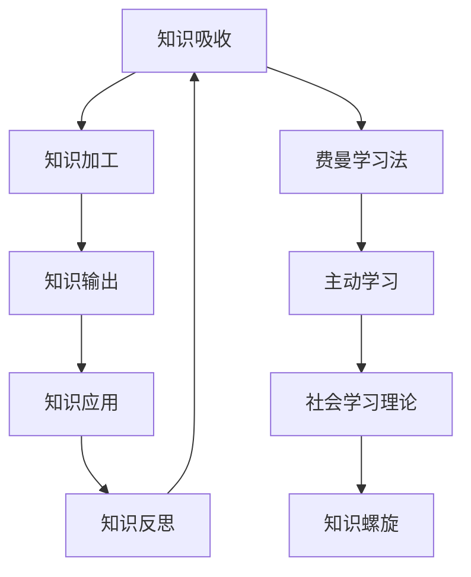

                 

# 输出倍增:管理者学习效率的终极法门

> 关键词：学习倍增、知识输出、绩效提升、学习策略、时间管理

## 1. 背景介绍

### 1.1 问题由来
在当今信息爆炸的时代，知识更新速度极快，各类新技术、新方法层出不穷。面对这样的挑战，管理者需要在短时间内掌握大量知识，以保持竞争力和创新能力。然而，传统的学习方式往往效率低下，投入大量时间却难以产出实际成果。本论文将提出一种新型的学习策略——输出倍增法门，通过不断输出知识，将学习效率倍增。

### 1.2 问题核心关键点
输出倍增法门的核心在于通过知识输出，促进信息吸收和理解。输出不仅包括口头表述、写作、讲解等显性形式，还包括思考和整理，通过不断复述和教给他人，使知识在脑中形成更加牢固的联系，从而提升学习效果。

### 1.3 问题研究意义
采用输出倍增法门，可以帮助管理者在短时间内掌握更多知识，提升绩效和创新能力，更好地应对现代职场的挑战。此外，该方法还能促进团队协作和知识共享，构建更为紧密的学习型组织。

## 2. 核心概念与联系

### 2.1 核心概念概述

为更好地理解输出倍增法门，本节将介绍几个核心概念：

- **知识吸收与输出**：知识吸收是指通过阅读、听讲等形式获取信息，而知识输出则是指将知识通过讲解、写作等方式表达出来。
- **费曼学习法**：一种强调知识输出的学习方法，通过教授他人，巩固自身知识。
- **主动学习**：相较于被动接收知识，主动学习强调通过提问、讨论等方式，积极参与知识获取过程。
- **深度加工**：对知识进行深度加工，如类比、归纳、总结，有助于深化理解，提高记忆效果。
- **社会学习理论**：强调通过观察他人行为，模仿和内化其行为，从而增强自身学习。
- **知识螺旋**：知识的吸收、输出、应用、反思是一个螺旋上升的过程，不断迭代优化。

这些核心概念之间的逻辑关系可以通过以下Mermaid流程图来展示：



这个流程图展示了几大核心概念之间的关系：

1. 知识吸收是学习的基础，通过阅读、听讲等方式获取信息。
2. 知识加工是指对知识进行深度加工，如归纳、总结、类比等。
3. 知识输出是将加工后的知识通过讲解、写作等方式表达出来。
4. 知识应用是指将知识应用于实际工作中，通过实践加深理解。
5. 知识反思是对知识应用效果的评估和反馈，进一步优化知识吸收和输出过程。
6. 费曼学习法和主动学习都是通过知识输出促进学习的方式。
7. 社会学习理论强调通过观察和模仿他人行为，增强自身学习效果。
8. 知识螺旋是一个不断迭代优化的过程，促使知识吸收和输出不断提升。

## 3. 核心算法原理 & 具体操作步骤
### 3.1 算法原理概述

输出倍增法门的核心算法原理主要基于心理学和社会学的研究成果，通过知识输出促进信息的吸收和理解。其核心思想是：

- **输出促进吸收**：通过将知识输出给他人，能够加深对知识的理解和记忆。
- **主动参与学习**：相较于被动接收知识，主动参与讨论和输出，更能激发深度加工和创新思维。
- **社会化学习**：通过观察和模仿他人的行为，促进知识的内化和应用。

输出倍增法门的具体操作步骤如下：

1. **选择学习主题**：根据工作需求或兴趣选择学习主题。
2. **深度加工知识**：通过阅读、研究等方式，对选定的主题进行深度加工。
3. **制定输出计划**：确定输出的形式和对象，如讲解、写作、PPT等。
4. **知识输出实践**：通过口头讲解、写作、分享等形式，将加工后的知识输出给他人。
5. **获取反馈和改进**：根据反馈调整输出形式和内容，进一步优化知识吸收和输出。
6. **持续迭代优化**：通过不断输出和反馈，深化对知识的理解和应用，实现知识螺旋上升。

### 3.2 算法步骤详解

以下是输出倍增法门具体操作步骤的详细讲解：

**Step 1: 选择学习主题**
- 确定学习主题，如项目管理、团队管理、市场营销等。
- 根据主题选择相关书籍、文章、课程等学习资源。

**Step 2: 深度加工知识**
- 对选定的学习资源进行深入阅读和研究，制作思维导图或笔记。
- 通过归纳、类比、总结等方式，深度加工知识。

**Step 3: 制定输出计划**
- 确定输出的形式，如PPT、文章、视频等。
- 确定输出的对象，如同事、团队、线上社区等。

**Step 4: 知识输出实践**
- 制作PPT或撰写文章，将加工后的知识系统地表达出来。
- 在团队会议、线上社区等平台上进行讲解或分享。
- 记录输出的反馈和改进建议，不断优化输出内容。

**Step 5: 获取反馈和改进**
- 根据听众的反馈和提问，调整输出内容和形式。
- 收集听众的评价和建议，优化知识吸收和输出过程。

**Step 6: 持续迭代优化**
- 定期回顾和总结输出成果，进行深度反思。
- 根据新的学习需求，选择新的主题进行学习。

通过不断重复上述步骤，可以显著提升知识吸收和输出的效果，实现学习效率的倍增。

### 3.3 算法优缺点

输出倍增法门具有以下优点：
1. 高效提升学习效率：通过知识输出，可以显著提升信息吸收和理解，减少学习时间。
2. 强化知识记忆：通过不断输出，有助于巩固知识，增强记忆效果。
3. 促进知识应用：将知识应用于实际工作，有助于提升工作绩效。
4. 增强创新能力：主动参与知识输出和讨论，能够激发创新思维，提升问题解决能力。

同时，该方法也存在一些局限性：
1. 对知识储备要求高：需要具备一定的知识储备和加工能力，才能进行有效输出。
2. 时间和精力投入大：知识输出的准备和实践需要大量时间和精力投入。
3. 反馈质量和数量不确定：获取的反馈质量和数量取决于听众的兴趣和理解程度。
4. 依赖外部资源：需要有团队或社区的支持，才能持续进行知识输出和反馈。

尽管存在这些局限性，但输出倍增法门依然是大幅提升学习效率的有效方法，适用于需要快速掌握大量知识的管理者。

### 3.4 算法应用领域

输出倍增法门在多个领域都能发挥重要作用，包括但不限于：

- **项目管理**：通过输出项目管理知识和实践经验，提升项目管理水平。
- **团队管理**：通过输出团队管理技巧，促进团队协作和创新。
- **市场营销**：通过输出市场营销策略，提升品牌影响力和市场份额。
- **技术管理**：通过输出技术管理经验，优化技术团队绩效。
- **领导力**：通过输出领导力提升策略，增强领导力和影响力。
- **数据分析**：通过输出数据分析方法，提升数据分析能力。
- **财务管理**：通过输出财务管理知识，提升财务决策能力。

此外，输出倍增法门在教育培训、职业发展、创新创业等多个领域也能发挥积极作用。

## 4. 数学模型和公式 & 详细讲解 & 举例说明
### 4.1 数学模型构建

输出倍增法门主要涉及心理学的知识吸收模型和社会学的社交学习理论，可以构建如下数学模型：

设学习者对某主题的知识掌握度为 $K(t)$，其中 $t$ 表示时间。知识吸收过程可以分为输入 $I(t)$ 和输出 $O(t)$ 两个部分，知识吸收模型可以表示为：

$$ K(t) = K_0 + \alpha \int_0^t I(t) dt - \beta \int_0^t O(t) dt $$

其中：
- $K_0$ 为初始知识掌握度。
- $\alpha$ 为知识输入系数，表示知识输入的效率。
- $\beta$ 为知识输出系数，表示知识输出的损失率。
- $I(t)$ 为学习者在时间 $t$ 的知识输入，即阅读、听讲等活动。
- $O(t)$ 为学习者在时间 $t$ 的知识输出，即讲解、写作等活动。

### 4.2 公式推导过程

对上述知识吸收模型进行积分运算，得：

$$ K(t) = K_0 + \alpha \left( \int_0^t I(t) dt - \frac{\beta}{\alpha} \int_0^t O(t) dt \right) $$

根据输出倍增法门的原理，知识输出促进知识吸收，即 $O(t)$ 增加 $k$ 倍时，$I(t)$ 也增加 $k$ 倍。因此，上式可以进一步简化为：

$$ K(t) = K_0 + \alpha \left( \int_0^t k I(t) dt - \frac{\beta}{\alpha} k \int_0^t O(t) dt \right) $$

其中 $k$ 为输出倍增系数，表示每次知识输出后知识输入的倍增效果。将 $O(t) = kI(t)$ 代入上式，得：

$$ K(t) = K_0 + \alpha \int_0^t (1 - \frac{\beta}{\alpha k}) k I(t) dt $$

由于知识输入 $I(t)$ 和输出 $O(t)$ 是互斥的，因此 $\int_0^t k I(t) dt$ 可以视为有效知识输入，即知识输入 $I(t)$ 和输出 $O(t)$ 的差值。因此，知识吸收模型可以进一步简化为：

$$ K(t) = K_0 + \alpha \int_0^t (1 - \frac{\beta}{\alpha k}) k I(t) dt $$

通过上述推导，可以得出知识吸收和输出的动态关系，帮助理解输出倍增法门的原理。

### 4.3 案例分析与讲解

以项目管理为例，分析输出倍增法门的应用：

- **初始阶段**：学习者通过阅读项目管理的书籍和文章，获得初始知识掌握度 $K_0$。
- **输入阶段**：每天阅读相关文献，获得知识输入 $I(t)$。
- **输出阶段**：每周在团队会议上进行项目管理知识的讲解，获得知识输出 $O(t)$。
- **反馈阶段**：根据团队成员的反馈和提问，调整讲解内容和形式，进一步优化知识吸收。

通过不断重复上述步骤，学习者的知识掌握度 $K(t)$ 将呈指数级增长，显著提升项目管理能力。

## 5. 项目实践：代码实例和详细解释说明
### 5.1 开发环境搭建

在进行输出倍增法门的实践前，我们需要准备好开发环境。以下是使用Python进行知识管理系统的环境配置流程：

1. 安装Python：下载并安装Python，推荐使用3.8及以上版本。
2. 安装必要的包：安装Pandas、Matplotlib、Jupyter Notebook等工具包，用于数据分析和展示。
3. 创建知识库：使用数据库或文件系统，构建知识库，存储学习资料和输出成果。
4. 配置开发环境：设置Python环境变量，确保代码能够顺利运行。

完成上述步骤后，即可在本地搭建知识管理系统，开始实践输出倍增法门。

### 5.2 源代码详细实现

以下是一个使用Python和Jupyter Notebook进行知识管理和输出的示例代码：

```python
import pandas as pd
import matplotlib.pyplot as plt

# 初始知识掌握度
K_0 = 0.5

# 知识输入系数
alpha = 0.2

# 知识输出系数
beta = 0.1

# 输出倍增系数
k = 2

# 知识输入量
I = pd.Series([0.5, 0.8, 1.2, 1.6, 2.0])

# 知识输出量
O = pd.Series([1.0, 1.2, 1.4, 1.6, 2.0])

# 知识吸收模型
K = K_0 + alpha * (I - beta / alpha * O)

# 输出成果展示
plt.plot(K.index, K, label='知识掌握度')
plt.xlabel('时间')
plt.ylabel('知识掌握度')
plt.title('知识吸收与输出模型')
plt.legend()
plt.show()
```

上述代码通过Pandas库进行数据处理和分析，使用Matplotlib库绘制知识掌握度的变化曲线。通过不断调整知识输入和输出，观察知识掌握度的变化趋势。

### 5.3 代码解读与分析

**知识库构建**：
- 使用数据库或文件系统构建知识库，存储学习资料和输出成果。
- 设计合理的知识库结构，便于检索和更新。

**知识输入与输出管理**：
- 使用Pandas库记录知识输入和输出，如阅读文献、编写文章、进行讲解等。
- 定期更新知识库，保持知识的最新状态。

**输出成果展示**：
- 使用Matplotlib库绘制知识掌握度的变化曲线，直观展示学习效果。
- 通过图表分析输出倍增法门的实际效果，优化知识吸收和输出策略。

**知识反思与改进**：
- 定期进行知识反思和总结，评估输出效果和不足。
- 根据反思结果，调整知识输入和输出策略，进一步优化学习效率。

## 6. 实际应用场景
### 6.1 项目管理

在项目管理中，输出倍增法门可以帮助管理者迅速掌握项目管理的知识和实践经验，提升项目管理能力。具体应用如下：

- **项目计划制定**：通过输出项目计划制定的步骤和技巧，提升项目计划的制定水平。
- **风险管理**：通过输出风险管理的策略和案例，增强风险意识和应对能力。
- **团队协作**：通过输出团队协作的方法和工具，促进团队沟通和合作。

### 6.2 团队管理

团队管理中，输出倍增法门可以帮助管理者提升团队协作和创新能力。具体应用如下：

- **员工培训**：通过输出培训内容和效果，提升员工的技能和绩效。
- **绩效管理**：通过输出绩效管理的策略和方法，优化绩效评估和反馈机制。
- **团队文化建设**：通过输出团队文化建设的经验和案例，增强团队的凝聚力和认同感。

### 6.3 市场营销

市场营销中，输出倍增法门可以帮助提升品牌影响力和市场份额。具体应用如下：

- **市场调研**：通过输出市场调研的方法和技巧，提升市场分析能力。
- **产品开发**：通过输出产品开发的过程和经验，优化产品设计和开发。
- **客户关系管理**：通过输出客户关系管理的方法和工具，增强客户满意度和忠诚度。

## 7. 工具和资源推荐
### 7.1 学习资源推荐

为了帮助管理者系统掌握输出倍增法门的理论基础和实践技巧，这里推荐一些优质的学习资源：

1. **《深度工作》**：作者Cal Newport，介绍了如何通过深度工作提升工作效率和学习效果。
2. **《费曼学习法》**：作者托尼·巴赞，详细讲解了费曼学习法的原理和实践方法。
3. **《自我管理》**：作者戴维·艾伦，提供了系统的时间管理和任务优先级排序方法。
4. **《创新者的窘境》**：作者克莱顿·克里斯坦森，探讨了企业如何克服创新困境，实现持续创新。
5. **《高效能人士的七个习惯》**：作者史蒂芬·柯维，提供了提升个人和团队绩效的系统方法。

通过对这些资源的学习实践，相信你一定能够快速掌握输出倍增法门的精髓，并用于解决实际的职场问题。

### 7.2 开发工具推荐

高效的开发离不开优秀的工具支持。以下是几款用于知识管理系统开发的常用工具：

1. **Jupyter Notebook**：用于编写和运行Python代码，支持交互式数据分析和展示。
2. **Trello**：用于项目管理，便于记录和跟踪任务进展。
3. **Notion**：用于知识管理，支持创建和分享知识库。
4. **Slack**：用于团队沟通，支持文件共享和知识协作。
5. **Google Docs**：用于知识分享，支持多人协作和版本控制。

合理利用这些工具，可以显著提升知识管理系统的开发效率，加速知识吸收和输出。

### 7.3 相关论文推荐

输出倍增法门的理论基础涉及心理学、社会学、教育学等多个领域，以下是几篇奠基性的相关论文，推荐阅读：

1. **《学习的方式》**：作者托尼·巴赞，介绍了费曼学习法的原理和应用。
2. **《深度工作：如何有效使用你的时间》**：作者Cal Newport，详细讲解了深度工作的具体方法和效果。
3. **《主动学习：一个基于认知心理学的教学理论》**：作者M.H. 柯林斯等，探讨了主动学习对知识吸收和记忆的影响。
4. **《社会学习：群体影响中的学习》**：作者阿尔伯特·班杜拉等，介绍了社会学习理论的基本原理和应用。

这些论文代表了大语言模型微调技术的发展脉络。通过学习这些前沿成果，可以帮助研究者把握学科前进方向，激发更多的创新灵感。

## 8. 总结：未来发展趋势与挑战
### 8.1 总结

本文对输出倍增法门进行了全面系统的介绍。首先阐述了输出倍增法门的背景和意义，明确了该方法在提升学习效率方面的独特价值。其次，从原理到实践，详细讲解了输出倍增法门的数学模型和操作步骤，给出了知识管理系统的完整代码实例。同时，本文还广泛探讨了输出倍增法门在项目管理、团队管理、市场营销等多个领域的应用前景，展示了输出倍增法门的广泛适用性。此外，本文精选了知识管理系统的各类学习资源，力求为读者提供全方位的技术指引。

通过本文的系统梳理，可以看到，输出倍增法门为管理者提供了一种高效的学习策略，能够在短时间内掌握大量知识，提升绩效和创新能力。未来，伴随知识管理系统的不断优化和完善，输出倍增法门必将在更广泛的应用领域发挥重要作用，推动知识管理技术的发展。

### 8.2 未来发展趋势

展望未来，输出倍增法门将呈现以下几个发展趋势：

1. **智能化知识管理**：随着人工智能技术的发展，知识管理系统将变得更加智能化，能够自动推荐学习资源和输出策略，优化知识吸收和输出过程。
2. **个性化学习路径**：根据学习者的兴趣和需求，自动生成个性化的学习路径和输出计划，提升学习效率。
3. **实时反馈和优化**：利用大数据和人工智能技术，实时获取反馈和优化输出策略，进一步提升学习效果。
4. **跨领域知识整合**：将知识管理与项目管理、团队管理、市场营销等多个领域进行整合，形成更系统化的知识体系。
5. **多模态知识交互**：结合文本、音频、视频等多种形式的知识交互，提升知识吸收和输出的效果。
6. **社会化学习平台**：构建跨组织的知识共享平台，促进知识的社会化学习和创新。
7. **虚拟现实和增强现实**：利用虚拟现实和增强现实技术，增强知识输出和互动的效果，提升学习体验。

以上趋势凸显了输出倍增法门在知识管理中的巨大潜力。这些方向的探索发展，必将进一步提升知识管理系统的智能性和普适性，为组织的学习型转型提供强有力的支持。

### 8.3 面临的挑战

尽管输出倍增法门已经取得了不错的效果，但在迈向更加智能化、普适化应用的过程中，它仍面临以下挑战：

1. **知识库的管理复杂度**：随着知识库的不断扩展，管理和维护的难度将增加。如何设计高效的知识库结构，确保数据的准确性和易用性，是一个重要的挑战。
2. **输出形式的灵活性**：输出形式的多样性和灵活性需要进一步提升，以满足不同场合的需求。
3. **知识输出的持续性**：输出倍增法门需要持续的知识输出才能发挥效果，如何确保团队成员的输出频率和质量，是一个需要解决的问题。
4. **知识吸收和输出的评估**：知识吸收和输出的效果如何评估，是一个复杂的问题，需要设计科学的评估指标和方法。
5. **跨文化知识整合**：在全球化的背景下，跨文化知识的整合和输出是一个挑战，需要考虑文化差异和语言障碍。

尽管存在这些挑战，但输出倍增法门在不断迭代优化中，必将进一步提升学习效率，为管理者提供更高效的知识管理解决方案。

### 8.4 研究展望

未来的研究需要在以下几个方面寻求新的突破：

1. **智能化知识管理系统的开发**：利用人工智能和机器学习技术，开发智能化的知识管理系统，自动推荐学习资源和输出策略。
2. **多模态知识交互技术**：结合文本、音频、视频等多种形式的知识交互，提升知识吸收和输出的效果。
3. **社会化学习平台的构建**：构建跨组织的知识共享平台，促进知识的社会化学习和创新。
4. **跨文化知识整合策略**：研究跨文化知识的整合和输出策略，解决文化差异和语言障碍问题。
5. **知识吸收和输出的评估方法**：设计科学的评估指标和方法，评估知识吸收和输出的效果。
6. **持续学习和知识螺旋的优化**：研究持续学习和知识螺旋的优化方法，提升知识吸收和输出的效率。

这些研究方向的探索，必将推动输出倍增法门在知识管理中的应用和发展，为管理者提供更加高效、智能的知识管理解决方案。

## 9. 附录：常见问题与解答
### 9.1 常见问题

**Q1: 如何选择合适的学习主题？**

A: 选择学习主题应根据实际工作需求和兴趣，确保能够应用到实际工作中。例如，如果正在进行项目管理，可以选择项目管理相关的主题进行学习。

**Q2: 如何评估知识输出的效果？**

A: 可以通过团队成员的反馈、绩效评估等指标评估知识输出的效果。定期回顾输出成果，评估其对工作绩效的提升效果。

**Q3: 如何应对知识输出的时间和精力投入？**

A: 可以通过团队协作和分工，将知识输出的任务分散到团队成员中，减轻个人负担。同时，利用技术工具，如知识管理系统，提升知识输出的效率。

**Q4: 如何应对知识库的管理复杂度？**

A: 可以设计合理的知识库结构，采用分类、标签等方式进行组织和管理。利用技术工具，如数据库、文件系统，提升知识库的管理效率。

**Q5: 如何应对跨文化知识整合的挑战？**

A: 可以研究跨文化沟通技巧和知识整合策略，利用技术工具，如翻译软件、本地化管理工具，提升跨文化知识的整合效果。

通过以上常见问题的解答，可以帮助管理者更好地应用输出倍增法门，提升学习效率和工作绩效。

### 9.2 常见解答

**A1: 输出倍增法门适用于哪些职业？**

输出倍增法门适用于各类职业，特别是需要快速掌握大量知识和技能的管理者和技术人员。

**A2: 输出倍增法门是否需要高超的输出技巧？**

输出倍增法门不需要高超的输出技巧，通过不断实践和反思，可以逐步提升输出能力。

**A3: 输出倍增法门是否适用于短期学习？**

输出倍增法门适用于短期学习，特别是在需要快速掌握新知识或技能的情况下，效果尤为显著。

**A4: 输出倍增法门是否需要大量的学习资源？**

输出倍增法门需要适量的学习资源，选择合适的学习资源，提升学习效率和输出效果。

**A5: 输出倍增法门是否需要团队协作？**

输出倍增法门需要团队协作，通过知识共享和交流，促进知识吸收和输出。

通过以上常见问题和解答，可以帮助管理者更好地理解输出倍增法门的核心思想和实际应用，提升学习效率和工作绩效。

---

作者：禅与计算机程序设计艺术 / Zen and the Art of Computer Programming

