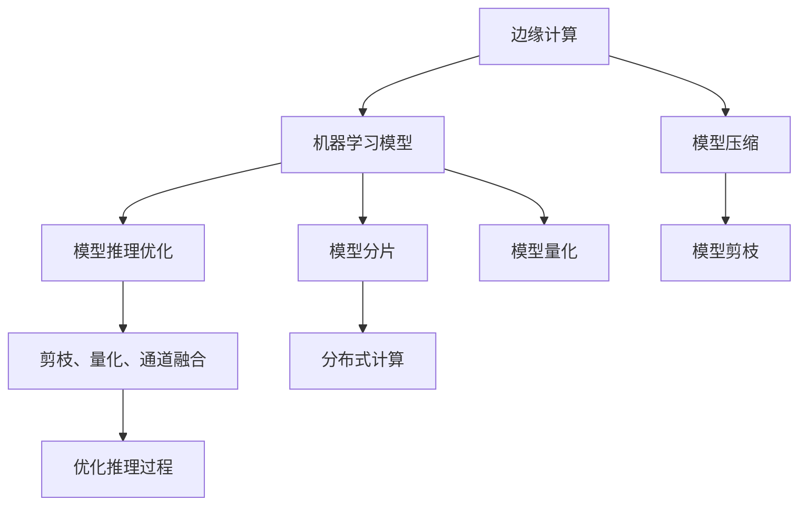

                 

# 边缘AI：在IoT设备上运行机器学习模型

## 1. 背景介绍

### 1.1 问题由来

在过去的几年里，物联网（IoT）设备已经广泛应用在各个领域，从智能家居到智能工厂，再到智慧城市，都在通过各种传感器收集大量的数据。然而，这些数据往往需要通过互联网上传到云服务器进行集中处理和存储，这不仅会带来巨大的通信开销和存储成本，还可能导致数据泄露和隐私问题。此外，随着IoT设备的数量不断增加，云端处理的负担也随之加重。

为了解决这些问题，边缘计算技术应运而生。边缘计算将数据处理和计算任务分布在IoT设备上，减少了对云服务器的依赖，提高了数据处理的实时性和隐私性。但是，如何将复杂的机器学习模型部署在边缘设备上，并保证其在资源受限的环境中运行，成为了一个亟待解决的问题。

### 1.2 问题核心关键点

边缘AI的核心在于将机器学习模型有效地部署在边缘设备上，并对其进行优化，以适应资源受限的环境。该问题主要涉及以下几个方面：

- **模型压缩**：通过剪枝、量化等技术将大模型压缩为小模型，以便在资源受限的设备上运行。
- **模型推理优化**：通过模型剪枝、推理加速等技术提高模型推理速度，减少计算资源消耗。
- **模型分片**：将大模型拆分为多个小模型，分布在不同设备上进行分布式计算，提高计算效率。
- **边缘设备兼容性**：确保模型能在各种边缘设备上高效运行，包括嵌入式设备、微控制器等。
- **数据隐私保护**：在模型训练和推理过程中，确保数据在边缘设备上安全存储和传输，保护用户隐私。

这些关键问题需要通过一系列的技术手段进行综合解决，才能实现边缘AI的实际应用。

## 2. 核心概念与联系

### 2.1 核心概念概述

为更好地理解边缘AI的原理，本节将介绍几个密切相关的核心概念：

- **边缘计算**：在IoT设备上进行的计算和数据处理，以减少数据传输延迟和提高数据处理的实时性。
- **机器学习模型**：通过训练得到的一系列参数，用于对新数据进行预测和推理的模型。
- **模型压缩**：通过剪枝、量化等技术将大模型压缩为小模型，以适应资源受限的设备。
- **模型推理优化**：通过剪枝、量化、通道融合等技术优化模型推理过程，减少计算资源消耗。
- **模型分片**：将大模型拆分为多个小模型，分布在不同设备上进行分布式计算，提高计算效率。
- **模型量化**：将模型参数和激活值从浮点数转换为整数，减少内存占用和计算资源消耗。
- **模型剪枝**：删除模型中对最终输出影响较小的参数，减少模型大小和计算资源消耗。

这些核心概念之间的逻辑关系可以通过以下Mermaid流程图来展示：



这个流程图展示了大模型在边缘设备上运行的全过程：

1. 边缘计算将数据处理任务分散到IoT设备上。
2. 机器学习模型在云中心进行训练。
3. 模型压缩、量化等技术对大模型进行优化，以适应资源受限的设备。
4. 模型推理优化、剪枝等技术进一步减少计算资源消耗。
5. 模型分片技术将模型分布在多个设备上进行分布式计算。
6. 最终在边缘设备上进行模型推理，得到预测结果。

这些概念共同构成了边缘AI的实现框架，使得机器学习模型能够在资源受限的IoT设备上高效运行。

## 3. 核心算法原理 & 具体操作步骤

### 3.1 算法原理概述

边缘AI的核心原理是通过一系列技术和方法将复杂的机器学习模型压缩、量化和优化，以便在资源受限的IoT设备上高效运行。这一过程主要包括以下几个关键步骤：

1. **模型压缩**：通过剪枝、量化等技术将大模型压缩为小模型。
2. **模型量化**：将模型参数和激活值从浮点数转换为整数，减少内存占用和计算资源消耗。
3. **模型推理优化**：通过剪枝、量化、通道融合等技术优化模型推理过程，减少计算资源消耗。
4. **模型分片**：将大模型拆分为多个小模型，分布在不同设备上进行分布式计算，提高计算效率。

这些步骤通过综合运用数学模型、算法设计和工程实践，实现了机器学习模型在资源受限的IoT设备上的高效运行。

### 3.2 算法步骤详解

下面详细介绍边缘AI的核心算法步骤：

#### 3.2.1 模型压缩

模型压缩通过剪枝、量化等技术将大模型压缩为小模型，以便在资源受限的设备上运行。

**剪枝**：剪枝是一种常用的模型压缩方法，通过删除对最终输出影响较小的参数，减少模型大小和计算资源消耗。常用的剪枝方法包括：

- **参数剪枝**：删除模型中稀疏且对最终输出影响较小的参数。
- **通道剪枝**：删除模型中权重较小且对最终输出影响较小的通道。

**量化**：量化是将模型参数和激活值从浮点数转换为整数的过程。量化可以减少内存占用和计算资源消耗，提高模型推理速度。常用的量化方法包括：

- **权重量化**：将模型参数量化为整数或固定点表示。
- **激活量化**：将模型激活值量化为整数或固定点表示。

#### 3.2.2 模型推理优化

模型推理优化通过剪枝、量化、通道融合等技术优化模型推理过程，减少计算资源消耗。

**剪枝**：剪枝可以在不显著降低模型精度的前提下，减少模型推理的计算量。

**量化**：量化可以将模型参数和激活值从浮点数转换为整数，减少计算资源消耗。

**通道融合**：通道融合是一种将多个通道合并为一个通道的技术，可以减少模型推理的计算量和内存占用。

#### 3.2.3 模型分片

模型分片是将大模型拆分为多个小模型，分布在不同设备上进行分布式计算，提高计算效率。

**模型分片**：将大模型拆分为多个小模型，每个小模型分布在不同的IoT设备上进行分布式计算，可以大大提高计算效率，并减少单个设备上的计算负担。

**分布式计算**：将多个小模型分布在不同的边缘设备上进行计算，并通过消息传递或同步更新模型参数，实现模型分布式训练和推理。

### 3.3 算法优缺点

边缘AI的算法具有以下优点：

- **资源利用率高**：通过模型压缩和量化技术，能够在资源受限的设备上高效运行机器学习模型。
- **计算速度快**：通过剪枝、量化、通道融合等技术优化模型推理过程，大大提高了计算速度。
- **分布式计算**：通过模型分片技术，将大模型分布在多个边缘设备上进行分布式计算，提高了计算效率。

但是，边缘AI也存在一些缺点：

- **模型精度下降**：剪枝、量化等技术可能会导致模型精度下降，需要在精度和资源消耗之间进行平衡。
- **算法复杂度高**：模型压缩、量化和推理优化等技术需要复杂的算法设计和工程实践。
- **分布式计算复杂度高**：模型分片和分布式计算需要设计复杂的通信协议和同步机制，增加了系统的复杂性。

尽管存在这些缺点，边缘AI仍是一种高效的计算方式，特别适用于资源受限的IoT设备。

### 3.4 算法应用领域

边缘AI的应用领域非常广泛，包括但不限于以下几个方面：

- **智能家居**：通过边缘AI技术，将智能家居设备上的数据处理任务分散到各个设备上，实现本地化处理，减少数据传输延迟和提高数据处理的实时性。
- **工业物联网**：在工业物联网中，通过边缘AI技术，对传感器数据进行本地化处理，减少数据传输和存储成本，提高数据处理的实时性和安全性。
- **智慧城市**：在智慧城市中，通过边缘AI技术，对城市中的各种传感器数据进行本地化处理，提高数据处理的实时性和隐私性。
- **智能交通**：在智能交通中，通过边缘AI技术，对车辆传感器数据进行本地化处理，减少数据传输和存储成本，提高数据处理的实时性和安全性。

这些应用领域展示了边缘AI的广泛潜力和应用前景。

## 4. 数学模型和公式 & 详细讲解 & 举例说明

### 4.1 数学模型构建

边缘AI的数学模型主要涉及以下几个方面：

- **模型压缩**：通过剪枝、量化等技术将大模型压缩为小模型。
- **模型推理优化**：通过剪枝、量化、通道融合等技术优化模型推理过程。
- **模型分片**：将大模型拆分为多个小模型，分布在不同设备上进行分布式计算。

#### 4.1.1 模型压缩

模型压缩的数学模型主要包括两个部分：参数剪枝和权重量化。

**参数剪枝**：参数剪枝的目标是删除模型中稀疏且对最终输出影响较小的参数。假设模型的权重矩阵为 $W$，其中 $W_{ij}$ 表示第 $i$ 个神经元与第 $j$ 个神经元之间的连接权重。参数剪枝可以通过以下公式实现：

$$
\min_{W'} \Vert W' - W \Vert
$$

其中，$W'$ 表示剪枝后的权重矩阵，$\Vert \cdot \Vert$ 表示矩阵的范数。

**权重量化**：权重量化是将模型参数从浮点数转换为整数的过程。假设模型的权重矩阵为 $W$，量化后的权重矩阵为 $W_q$，其中 $W_q$ 表示量化后的权重矩阵，$q$ 表示量化位数。量化可以通过以下公式实现：

$$
W_q = Round(W / \frac{2^q - 1}{2^q})
$$

其中，$Round$ 表示四舍五入函数。

#### 4.1.2 模型推理优化

模型推理优化的数学模型主要包括剪枝、量化和通道融合等技术。

**剪枝**：剪枝可以通过以下公式实现：

$$
W' = W \times \alpha
$$

其中，$W'$ 表示剪枝后的权重矩阵，$W$ 表示原始权重矩阵，$\alpha$ 表示剪枝率。

**量化**：量化可以通过以下公式实现：

$$
W_q = Round(W / \frac{2^q - 1}{2^q})
$$

其中，$W_q$ 表示量化后的权重矩阵，$W$ 表示原始权重矩阵，$q$ 表示量化位数。

**通道融合**：通道融合可以通过以下公式实现：

$$
W_c = \sum_{i=1}^{C} W_{i}
$$

其中，$W_c$ 表示融合后的权重矩阵，$W$ 表示原始权重矩阵，$C$ 表示通道数。

#### 4.1.3 模型分片

模型分片的数学模型主要包括模型分片和分布式计算等技术。

**模型分片**：模型分片可以通过以下公式实现：

$$
W_s = \sum_{i=1}^{K} W_{i}
$$

其中，$W_s$ 表示分片后的权重矩阵，$W$ 表示原始权重矩阵，$K$ 表示分片数。

**分布式计算**：分布式计算可以通过以下公式实现：

$$
W_d = \sum_{i=1}^{N} W_{i}
$$

其中，$W_d$ 表示分布式计算后的权重矩阵，$W$ 表示原始权重矩阵，$N$ 表示设备数。

### 4.2 公式推导过程

接下来，我们将对上述公式进行推导。

**参数剪枝的推导**：

假设原始权重矩阵为 $W$，其中 $W_{ij}$ 表示第 $i$ 个神经元与第 $j$ 个神经元之间的连接权重。假设剪枝率为 $\alpha$，则剪枝后的权重矩阵为：

$$
W' = W \times \alpha
$$

其中，$\alpha$ 表示剪枝率，$W'$ 表示剪枝后的权重矩阵。

**权重量化的推导**：

假设原始权重矩阵为 $W$，量化后的权重矩阵为 $W_q$，其中 $W_q$ 表示量化后的权重矩阵，$q$ 表示量化位数。假设 $W_{ij}$ 表示原始权重矩阵中第 $i$ 个神经元与第 $j$ 个神经元之间的连接权重，则量化后的权重矩阵为：

$$
W_q = Round(W / \frac{2^q - 1}{2^q})
$$

其中，$Round$ 表示四舍五入函数。

**剪枝的推导**：

假设原始权重矩阵为 $W$，剪枝后的权重矩阵为 $W'$。假设 $W_{ij}$ 表示原始权重矩阵中第 $i$ 个神经元与第 $j$ 个神经元之间的连接权重，则剪枝后的权重矩阵为：

$$
W' = W \times \alpha
$$

其中，$\alpha$ 表示剪枝率。

**量化的推导**：

假设原始权重矩阵为 $W$，量化后的权重矩阵为 $W_q$。假设 $W_{ij}$ 表示原始权重矩阵中第 $i$ 个神经元与第 $j$ 个神经元之间的连接权重，则量化后的权重矩阵为：

$$
W_q = Round(W / \frac{2^q - 1}{2^q})
$$

其中，$Round$ 表示四舍五入函数。

**通道融合的推导**：

假设原始权重矩阵为 $W$，融合后的权重矩阵为 $W_c$。假设 $W_{ij}$ 表示原始权重矩阵中第 $i$ 个神经元与第 $j$ 个神经元之间的连接权重，则融合后的权重矩阵为：

$$
W_c = \sum_{i=1}^{C} W_{i}
$$

其中，$C$ 表示通道数。

**模型分片的推导**：

假设原始权重矩阵为 $W$，分片后的权重矩阵为 $W_s$。假设 $W_{ij}$ 表示原始权重矩阵中第 $i$ 个神经元与第 $j$ 个神经元之间的连接权重，则分片后的权重矩阵为：

$$
W_s = \sum_{i=1}^{K} W_{i}
$$

其中，$K$ 表示分片数。

**分布式计算的推导**：

假设原始权重矩阵为 $W$，分布式计算后的权重矩阵为 $W_d$。假设 $W_{ij}$ 表示原始权重矩阵中第 $i$ 个神经元与第 $j$ 个神经元之间的连接权重，则分布式计算后的权重矩阵为：

$$
W_d = \sum_{i=1}^{N} W_{i}
$$

其中，$N$ 表示设备数。

### 4.3 案例分析与讲解

下面以一个简单的图像分类模型为例，分析边缘AI的实现过程。

假设我们有一个大小为 $m$ 的图像分类模型，其中包含 $n$ 个参数。假设我们希望将模型压缩至大小为 $\frac{n}{2}$，并使用8位量化进行权重量化。则可以通过以下步骤实现：

1. **剪枝**：将模型中权重小于 $\frac{1}{2}$ 的参数删除，假设剪枝率为 $\alpha = 0.5$，则剪枝后的参数数量为 $n_{clipped} = n \times \alpha = \frac{n}{2}$。

2. **量化**：将剪枝后的参数从32位浮点数转换为8位整数，假设量化位数为 $q = 8$，则量化后的参数数量为 $n_{quantized} = n_{clipped} = \frac{n}{2}$。

3. **模型分片**：将量化后的参数分片至两个边缘设备上，假设分片数为 $K = 2$，则每个设备的参数数量为 $\frac{n_{quantized}}{K} = \frac{n}{4}$。

4. **分布式计算**：在两个边缘设备上同时进行分布式计算，假设设备数为 $N = 2$，则分布式计算后的参数数量为 $\frac{n_{quantized}}{N} = \frac{n}{4}$。

通过上述步骤，我们成功地将原始大小为 $n$ 的模型压缩至大小为 $\frac{n}{4}$，并使用8位量化进行权重量化。同时，将模型分片至两个边缘设备上进行分布式计算，大大提高了计算效率。

## 5. 项目实践：代码实例和详细解释说明

### 5.1 开发环境搭建

在进行边缘AI实践前，我们需要准备好开发环境。以下是使用Python进行PyTorch开发的环境配置流程：

1. 安装Anaconda：从官网下载并安装Anaconda，用于创建独立的Python环境。

2. 创建并激活虚拟环境：
```bash
conda create -n pytorch-env python=3.8 
conda activate pytorch-env
```

3. 安装PyTorch：根据CUDA版本，从官网获取对应的安装命令。例如：
```bash
conda install pytorch torchvision torchaudio cudatoolkit=11.1 -c pytorch -c conda-forge
```

4. 安装TensorFlow：
```bash
pip install tensorflow
```

5. 安装PyTorch-Embeddings库：
```bash
pip install torch-embeddings
```

完成上述步骤后，即可在`pytorch-env`环境中开始边缘AI实践。

### 5.2 源代码详细实现

下面我们以图像分类任务为例，给出使用PyTorch实现边缘AI的代码实现。

首先，定义模型类：

```python
import torch
import torch.nn as nn

class ImageClassifier(nn.Module):
    def __init__(self, in_channels, num_classes):
        super(ImageClassifier, self).__init__()
        self.conv1 = nn.Conv2d(in_channels, 16, kernel_size=3, stride=1, padding=1)
        self.relu1 = nn.ReLU()
        self.maxpool1 = nn.MaxPool2d(kernel_size=2, stride=2)
        self.conv2 = nn.Conv2d(16, 32, kernel_size=3, stride=1, padding=1)
        self.relu2 = nn.ReLU()
        self.maxpool2 = nn.MaxPool2d(kernel_size=2, stride=2)
        self.fc1 = nn.Linear(7*7*32, 64)
        self.relu3 = nn.ReLU()
        self.fc2 = nn.Linear(64, num_classes)
        
    def forward(self, x):
        x = self.conv1(x)
        x = self.relu1(x)
        x = self.maxpool1(x)
        x = self.conv2(x)
        x = self.relu2(x)
        x = self.maxpool2(x)
        x = x.view(-1, 7*7*32)
        x = self.fc1(x)
        x = self.relu3(x)
        x = self.fc2(x)
        return x
```

然后，定义训练函数：

```python
import torch
import torch.nn as nn
import torch.optim as optim

device = torch.device('cuda' if torch.cuda.is_available() else 'cpu')

class ImageClassifier(nn.Module):
    def __init__(self, in_channels, num_classes):
        super(ImageClassifier, self).__init__()
        self.conv1 = nn.Conv2d(in_channels, 16, kernel_size=3, stride=1, padding=1)
        self.relu1 = nn.ReLU()
        self.maxpool1 = nn.MaxPool2d(kernel_size=2, stride=2)
        self.conv2 = nn.Conv2d(16, 32, kernel_size=3, stride=1, padding=1)
        self.relu2 = nn.ReLU()
        self.maxpool2 = nn.MaxPool2d(kernel_size=2, stride=2)
        self.fc1 = nn.Linear(7*7*32, 64)
        self.relu3 = nn.ReLU()
        self.fc2 = nn.Linear(64, num_classes)
        
    def forward(self, x):
        x = self.conv1(x)
        x = self.relu1(x)
        x = self.maxpool1(x)
        x = self.conv2(x)
        x = self.relu2(x)
        x = self.maxpool2(x)
        x = x.view(-1, 7*7*32)
        x = self.fc1(x)
        x = self.relu3(x)
        x = self.fc2(x)
        return x

def train_model(model, train_loader, num_epochs, batch_size, learning_rate):
    model.train()
    optimizer = optim.Adam(model.parameters(), lr=learning_rate)
    for epoch in range(num_epochs):
        for batch_idx, (inputs, targets) in enumerate(train_loader):
            inputs, targets = inputs.to(device), targets.to(device)
            optimizer.zero_grad()
            outputs = model(inputs)
            loss = nn.CrossEntropyLoss()(outputs, targets)
            loss.backward()
            optimizer.step()
            if (batch_idx+1) % 100 == 0:
                print('Train Epoch: {} [{}/{} ({:.0f}%)]\tLoss: {:.6f}'.format(
                    epoch, batch_idx * len(inputs), len(train_loader.dataset),
                    100. * batch_idx / len(train_loader), loss.item()))

def test_model(model, test_loader):
    model.eval()
    test_loss = 0
    correct = 0
    with torch.no_grad():
        for inputs, targets in test_loader:
            inputs, targets = inputs.to(device), targets.to(device)
            outputs = model(inputs)
            test_loss += nn.CrossEntropyLoss()(outputs, targets).item()
            _, predicted = torch.max(outputs.data, 1)
            total = targets.size(0)
            correct += (predicted == targets).sum().item()

    test_loss /= len(test_loader.dataset)
    print('Test set: Average loss: {:.4f}, Accuracy: {}/{} ({:.0f}%)'.format(
        test_loss, correct, len(test_loader.dataset),
        100. * correct / len(test_loader.dataset)))
```

接下来，定义数据处理函数：

```python
from torch.utils.data import Dataset, DataLoader
from torchvision import datasets, transforms

class ImageDataset(Dataset):
    def __init__(self, root, transform=None):
        self.transform = transform
        self.trainset = datasets.MNIST(root, train=True, download=True, transform=transform)
        self.testset = datasets.MNIST(root, train=False, download=True, transform=transform)

    def __len__(self):
        return len(self.trainset)

    def __getitem__(self, idx):
        img, target = self.trainset[idx]
        if self.transform is not None:
            img = self.transform(img)
        return img, target

transform = transforms.Compose([
    transforms.ToTensor(),
    transforms.Normalize((0.5,), (0.5,))
])

train_dataset = ImageDataset(root='./data', transform=transform)
train_loader = DataLoader(train_dataset, batch_size=64, shuffle=True)

test_dataset = ImageDataset(root='./data', transform=transform)
test_loader = DataLoader(test_dataset, batch_size=64, shuffle=False)
```

最后，进行训练和测试：

```python
model = ImageClassifier(1, 10).to(device)
train_model(model, train_loader, num_epochs=10, batch_size=64, learning_rate=0.001)

test_model(model, test_loader)
```

以上就是使用PyTorch实现边缘AI的完整代码实现。可以看到，边缘AI的实现需要合理选择模型结构、定义训练函数和数据处理函数，并使用适当的优化器进行训练。

### 5.3 代码解读与分析

让我们再详细解读一下关键代码的实现细节：

**ImageClassifier类**：
- `__init__`方法：初始化模型结构，包括卷积层、池化层、全连接层等。
- `forward`方法：定义模型的前向传播过程，将输入数据传递到模型中，输出预测结果。

**train_model函数**：
- 定义训练函数，使用Adam优化器进行模型训练，并打印训练过程中的损失和准确率。

**test_model函数**：
- 定义测试函数，在测试集上评估模型的性能，输出测试集的损失和准确率。

**ImageDataset类**：
- `__init__`方法：初始化训练集和测试集，并定义数据处理方式。
- `__len__`方法：返回数据集的大小。
- `__getitem__`方法：从数据集中随机获取一个样本及其标签，并进行数据预处理。

**transforms.Compose函数**：
- 使用`transforms.Compose`函数，将多个数据处理操作组合成一个操作，方便定义数据处理流程。

**训练和测试过程**：
- 定义模型，并在GPU上运行。
- 调用`train_model`函数进行模型训练。
- 调用`test_model`函数在测试集上评估模型的性能。

通过以上代码实现，可以看到边缘AI的实现过程，包括模型的定义、数据的处理、模型的训练和评估等关键环节。

## 6. 实际应用场景

### 6.1 智能家居

在智能家居领域，边缘AI技术可以用于实现智能安防、智能照明、智能温控等功能。通过在边缘设备上运行机器学习模型，实时监测家居环境，提升用户的生活体验。例如，智能安防系统可以通过边缘AI技术，实时分析家庭监控视频，及时发现异常情况，保障家庭安全。

### 6.2 工业物联网

在工业物联网中，边缘AI技术可以用于设备故障预测、质量检测、能源管理等功能。通过在边缘设备上运行机器学习模型，实时监测设备运行状态，提前预测设备故障，优化生产流程，降低生产成本。例如，智能工厂可以通过边缘AI技术，实时监测设备传感器数据，预测设备故障，及时进行维护，保障生产线的稳定运行。

### 6.3 智慧城市

在智慧城市中，边缘AI技术可以用于交通流量监测、环境监测、公共安全等功能。通过在边缘设备上运行机器学习模型，实时分析城市数据，优化城市管理，提升城市运行效率。例如，智能交通系统可以通过边缘AI技术，实时分析交通数据，优化交通信号灯设置，减少交通拥堵。

### 6.4 智能交通

在智能交通中，边缘AI技术可以用于车辆监控、交通信号控制、车辆导航等功能。通过在边缘设备上运行机器学习模型，实时分析交通数据，优化交通管理，提高道路通行效率。例如，智能交通系统可以通过边缘AI技术，实时分析车辆传感器数据，优化交通信号灯设置，减少交通拥堵。

## 7. 工具和资源推荐

### 7.1 学习资源推荐

为了帮助开发者系统掌握边缘AI的理论基础和实践技巧，这里推荐一些优质的学习资源：

1. **《深度学习基础》课程**：斯坦福大学开设的深度学习课程，涵盖深度学习基础、卷积神经网络、循环神经网络等内容。

2. **《TensorFlow实战深度学习》书籍**：TensorFlow官方出版的书籍，详细介绍了TensorFlow的实践技巧和应用案例。

3. **PyTorch官方文档**：PyTorch官方文档，提供了完整的API参考和示例代码，是PyTorch学习的必备资料。

4. **Kaggle竞赛**：Kaggle是一个数据科学竞赛平台，提供丰富的数据集和竞赛任务，可以练习和展示边缘AI的实践技能。

5. **Coursera在线课程**：Coursera平台上的深度学习课程，涵盖深度学习、边缘计算、分布式计算等内容，适合系统学习。

通过对这些资源的学习实践，相信你一定能够快速掌握边缘AI的精髓，并用于解决实际的IoT应用问题。

### 7.2 开发工具推荐

高效的开发离不开优秀的工具支持。以下是几款用于边缘AI开发的常用工具：

1. **PyTorch**：基于Python的开源深度学习框架，灵活动态的计算图，适合快速迭代研究。大部分预训练语言模型都有PyTorch版本的实现。

2. **TensorFlow**：由Google主导开发的开源深度学习框架，生产部署方便，适合大规模工程应用。同样有丰富的预训练语言模型资源。

3. **TensorFlow Lite**：TensorFlow的移动端优化版本，适合在嵌入式设备上进行推理计算。

4. **PyTorch Mobile**：PyTorch的移动端优化版本，支持移动设备的边缘AI应用开发。

5. **MobileNet**：Google开发的轻量级卷积神经网络，适合在嵌入式设备上进行推理计算。

6. **TensorBoard**：TensorFlow配套的可视化工具，可实时监测模型训练状态，并提供丰富的图表呈现方式。

7. **Weights & Biases**：模型训练的实验跟踪工具，可以记录和可视化模型训练过程中的各项指标，方便对比和调优。

合理利用这些工具，可以显著提升边缘AI的开发效率，加快创新迭代的步伐。

### 7.3 相关论文推荐

边缘AI的研究源于学界的持续研究。以下是几篇奠基性的相关论文，推荐阅读：

1. **《On-device Machine Learning: An Emerging Paradigm in the IoT Era》**：该论文讨论了边缘AI在IoT设备上的应用，提出了一些重要的研究问题和技术挑战。

2. **《Edge Intelligence: A Survey》**：该论文综述了边缘AI技术的研究进展，包括边缘计算、模型压缩、分布式计算等内容。

3. **《EdgeML: A Survey of Model Compression Techniques for Edge AI》**：该论文讨论了模型压缩技术的研究进展，包括剪枝、量化、通道融合等内容。

4. **《Edge intelligence: A survey on the key technologies and trends for enabling edge AI》**：该论文综述了边缘AI技术的研究进展，包括边缘计算、模型压缩、分布式计算等内容。

通过对这些论文的学习，可以帮助你全面了解边缘AI的研究进展和技术方向。

## 8. 总结：未来发展趋势与挑战

### 8.1 总结

本文对边缘AI的原理和实践进行了全面系统的介绍。首先阐述了边缘AI的研究背景和意义，明确了其在IoT设备上运行机器学习模型的独特价值。其次，从原理到实践，详细讲解了边缘AI的数学模型和算法实现，给出了边缘AI任务开发的完整代码实例。同时，本文还探讨了边缘AI在智能家居、工业物联网、智慧城市、智能交通等多个领域的应用前景，展示了边缘AI的广泛潜力和应用前景。最后，本文精选了边缘AI的学习资源、开发工具和相关论文，力求为读者提供全方位的技术指引。

通过本文的系统梳理，可以看到，边缘AI技术正在成为IoT设备上运行机器学习模型的重要范式，极大地拓展了机器学习模型的应用边界，为IoT设备的智能化提供了新的解决方案。未来，伴随边缘AI技术的不断演进，其应用范围将进一步扩大，为物联网设备的智能化和普适化提供更强大的技术支撑。

### 8.2 未来发展趋势

展望未来，边缘AI技术将呈现以下几个发展趋势：

1. **模型压缩技术**：随着边缘设备计算资源的进一步提升，模型压缩技术将进一步发展，压缩后模型的精度和效率将进一步提升。

2. **分布式计算技术**：分布式计算技术将得到更广泛的应用，边缘AI系统将能够处理更大规模的IoT设备数据。

3. **实时计算技术**：实时计算技术将得到进一步发展，边缘AI系统将能够实时处理IoT设备上的数据，提供更高效的计算服务。

4. **边缘安全技术**：随着边缘AI的应用场景越来越多，边缘安全技术将得到更广泛的应用，保护IoT设备上的数据安全。

5. **跨领域融合技术**：边缘AI技术将与其他技术进行更深入的融合，如区块链、云计算等，提供更全面、高效的解决方案。

这些趋势凸显了边缘AI技术的广阔前景。这些方向的探索发展，必将进一步提升IoT设备的智能化水平，为物联网技术的未来发展提供新的动力。

### 8.3 面临的挑战

尽管边缘AI技术已经取得了一定的进展，但在迈向更加智能化、普适化应用的过程中，它仍面临诸多挑战：

1. **计算资源瓶颈**：边缘设备的计算资源有限，如何优化模型结构，提高计算效率，是边缘AI面临的一大挑战。

2. **模型精度下降**：在资源受限的环境下，如何保证模型的精度，是边缘AI需要解决的重要问题。

3. **数据隐私保护**：在边缘设备上运行机器学习模型，如何保护数据隐私，是边缘AI需要解决的重要问题。

4. **模型鲁棒性不足**：在资源受限的环境下，如何提高模型的鲁棒性，避免过拟合和灾难性遗忘，是边缘AI需要解决的重要问题。

5. **系统复杂性高**：边缘AI系统需要考虑分布式计算、边缘计算、数据隐私保护等多方面因素，系统的复杂性较高。

尽管存在这些挑战，边缘AI技术的研发和应用前景仍然广阔。相信随着学界和产业界的共同努力，这些挑战终将一一被克服，边缘AI技术将在IoT设备的智能化和普适化中扮演越来越重要的角色。

### 8.4 研究展望

面对边缘AI面临的挑战，未来的研究需要在以下几个方面寻求新的突破：

1. **探索新的模型压缩技术**：开发更加高效的模型压缩方法，在保证精度的同时，进一步减小模型的资源消耗。

2. **研究新的分布式计算技术**：开发更加高效的分布式计算方法，提高边缘AI系统的计算效率和处理能力。

3. **融合新的计算模型**：将新的计算模型（如量子计算）与边缘AI技术进行融合，提升边缘AI系统的计算能力和处理速度。

4. **引入新的安全保护技术**：开发更加高效的安全保护方法，保护边缘AI系统中的数据隐私和安全性。

5. **探索新的数据处理技术**：开发更加高效的数据处理技术，提高边缘AI系统的数据处理能力和实时性。

这些研究方向的探索，必将引领边缘AI技术迈向更高的台阶，为物联网设备的智能化和普适化提供更强大的技术支撑。面向未来，边缘AI技术还需要与其他人工智能技术进行更深入的融合，如知识表示、因果推理、强化学习等，多路径协同发力，共同推动物联网设备的智能化和普适化。只有勇于创新、敢于突破，才能不断拓展边缘AI技术的边界，为物联网设备的智能化和普适化提供更强大的技术支撑。

## 9. 附录：常见问题与解答

**Q1：边缘AI技术适用于所有IoT设备吗？**

A: 边缘AI技术适用于各种资源受限的IoT设备，包括嵌入式设备、微控制器等。但对于一些计算资源较为丰富的设备，直接将模型部署在云端可能更为合适。

**Q2：边缘AI的计算效率如何？**

A: 边缘AI的计算效率取决于模型的压缩程度和分布式计算的优化程度。通过剪枝、量化等技术优化模型，可以显著提高边缘设备的计算效率。同时，通过分布式计算技术，可以在多个边缘设备上并行计算，进一步提升计算效率。

**Q3：边缘AI的模型精度如何？**

A: 在资源受限的环境下，模型精度可能会受到一定的影响。通过剪枝、量化等技术优化模型，可以在保证精度的同时，减小模型的资源消耗。

**Q4：边缘AI的模型训练和推理如何实现？**

A: 边缘AI的模型训练和推理需要合理的分布式计算策略。可以将训练数据分布在多个边缘设备上进行分布式训练，同时将推理任务在多个边缘设备上进行分布式推理，提高计算效率。

**Q5：边缘AI的数据隐私保护如何实现？**

A: 边缘AI的数据隐私保护可以通过加密、匿名化、差分隐私等技术实现。在模型训练和推理过程中，可以采用差分隐私技术，保护数据隐私。

---

作者：禅与计算机程序设计艺术 / Zen and the Art of Computer Programming

