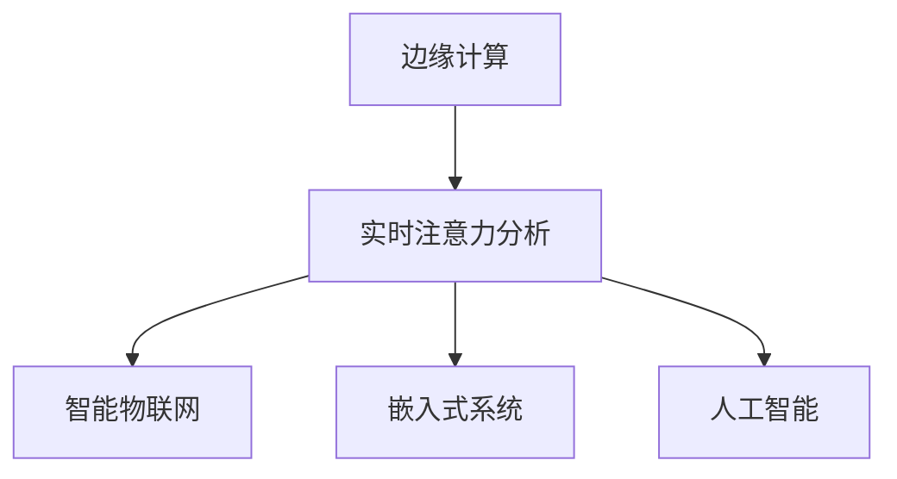

                 

# 边缘计算在实时注意力分析中的应用

> 关键词：边缘计算, 实时注意力分析, 智能物联网(IoT), 嵌入式系统, 人工智能(AI), 数据处理

## 1. 背景介绍

### 1.1 问题由来
随着物联网设备的广泛部署和数据量的迅猛增长，实时数据处理和分析的需求日益迫切。特别是在智能制造、智慧城市、智能交通等场景下，大量传感器数据需要实时采集、分析和反馈，以支撑各类智能决策和控制。传统集中式云计算中心处理方式难以满足这种高实时性、高可靠性的需求。边缘计算作为一种新兴的数据处理技术，能够将计算和存储资源部署到靠近数据源的设备端，就地处理数据，实现低延迟、高可靠性的实时数据处理。

### 1.2 问题核心关键点
边缘计算和实时注意力分析的结合，为实时数据处理提供了新的思路。其核心思想是将注意力机制引入边缘计算系统，使得系统能够根据数据特征实时调整计算和存储资源分配，从而实现动态资源优化和任务优化。该技术在智能物联网(IoT)、嵌入式系统、人工智能(AI)等领域具有广泛的应用前景。

### 1.3 问题研究意义
边缘计算和实时注意力分析的结合，能够大幅提升实时数据处理的能力和效率，降低数据传输和存储成本，推动各类智能应用的落地。这种技术不仅能够支撑实时性要求高的场景，还能在计算资源有限的嵌入式设备上实现高效的数据处理，具有重要的现实意义：

1. 提升实时处理效率。通过动态调整计算和存储资源分配，边缘计算系统能够实时响应数据变化，提升数据处理速度。
2. 降低数据传输和存储成本。数据在边缘设备上处理，减少数据向云端传输的带宽需求和存储成本。
3. 支持边缘设备计算。边缘计算技术能够利用本地计算资源，避免依赖远程云端，提高系统可靠性。
4. 推动智能应用发展。实时注意力分析能够帮助各类智能应用做出更精准的决策，提升应用效果。

## 2. 核心概念与联系

### 2.1 核心概念概述

为更好地理解边缘计算与实时注意力分析的结合，本节将介绍几个密切相关的核心概念：

- 边缘计算：一种新兴的数据处理技术，通过将计算和存储资源部署到靠近数据源的设备端，实现就地数据处理。边缘计算能够显著提升实时数据处理能力，降低数据传输和存储成本。
- 实时注意力分析：一种结合注意力机制的动态资源优化算法，能够根据数据特征实时调整计算和存储资源分配，提升数据处理效率和系统可靠性。
- 智能物联网(IoT)：将各种智能设备、传感器和网络技术有机结合，实现物与物的互联互通，提升智能化水平。
- 嵌入式系统：将计算机系统嵌入到各类设备中，具备实时数据处理和决策能力。
- 人工智能(AI)：利用数据、算法和计算资源，实现对复杂问题的智能分析与决策。

这些核心概念之间的逻辑关系可以通过以下Mermaid流程图来展示：



这个流程图展示的边缘计算与实时注意力分析的核心概念及其之间的关系：

1. 边缘计算通过将计算和存储资源部署到靠近数据源的设备端，实现就地数据处理。
2. 实时注意力分析能够根据数据特征实时调整计算和存储资源分配，提升数据处理效率和系统可靠性。
3. 智能物联网、嵌入式系统和人工智能等场景，都能够通过边缘计算与实时注意力分析的结合，实现更高效、智能的数据处理和决策。

## 3. 核心算法原理 & 具体操作步骤
### 3.1 算法原理概述

边缘计算和实时注意力分析的结合，本质上是一个动态资源优化和任务优化的过程。其核心思想是：将注意力机制引入边缘计算系统，使得系统能够根据数据特征实时调整计算和存储资源分配，从而实现动态资源优化和任务优化。

形式化地，假设系统当前处于状态 $s_t$，对应于计算资源 $C_t$ 和存储资源 $M_t$ 的分配。设 $\mathcal{D}_t$ 为当前设备接收到的数据流，定义系统对数据流的注意力分配为 $\alpha_t = (\alpha_{t,1},\alpha_{t,2},\ldots,\alpha_{t,n})$，其中 $\alpha_{t,i}$ 表示设备对数据流 $i$ 的注意力分配权重。注意力分配权重 $\alpha_t$ 应满足以下条件：
1. $\sum_{i=1}^n \alpha_{t,i} = 1$
2. $\alpha_{t,i} \geq 0$ 对所有 $i$ 成立

定义系统当前的计算效率和存储效率分别为 $\text{Eff}_C = C_t / \sum_{i=1}^n \alpha_{t,i}$ 和 $\text{Eff}_M = M_t / \sum_{i=1}^n \alpha_{t,i} \cdot \text{size}_i$，其中 $\text{size}_i$ 表示数据流 $i$ 的尺寸。则系统当前的综合效率为 $\text{Eff} = \text{Eff}_C \cdot \text{Eff}_M$。

实时注意力分析的目标是：根据数据流特征，动态调整注意力分配权重 $\alpha_t$，使得系统综合效率 $\text{Eff}$ 最大化。具体算法流程如下：

1. 对当前设备接收到的数据流 $\mathcal{D}_t$ 进行特征提取，得到特征向量 $f_t$。
2. 根据特征向量 $f_t$，计算当前数据流的优先级 $p_t$。优先级 $p_t$ 应满足 $p_t \geq 0$ 且 $\sum_{i=1}^n p_t = 1$。
3. 根据优先级 $p_t$，动态调整注意力分配权重 $\alpha_t$。
4. 计算当前系统综合效率 $\text{Eff}$，若 $\text{Eff}$ 提高，则继续调整 $\alpha_t$，否则停止调整。

### 3.2 算法步骤详解

以下是对实时注意力分析算法的详细步骤讲解：

**Step 1: 数据特征提取**
- 对设备接收到的数据流 $\mathcal{D}_t$ 进行特征提取，得到特征向量 $f_t$。特征提取方法可根据具体应用场景选择，如文本特征提取、图像特征提取、音频特征提取等。
- 将特征向量 $f_t$ 输入注意力模型，得到对数据流的注意力分配权重 $\alpha_t$。

**Step 2: 数据流优先级计算**
- 根据注意力分配权重 $\alpha_t$，计算当前数据流的优先级 $p_t$。优先级计算方法可根据具体应用场景选择，如加权平均法、最大值法、加权最大值法等。
- 根据优先级 $p_t$，动态调整计算和存储资源分配，提升资源利用效率。

**Step 3: 计算系统综合效率**
- 根据当前的计算资源 $C_t$、存储资源 $M_t$ 和注意力分配权重 $\alpha_t$，计算系统当前的综合效率 $\text{Eff}$。
- 若 $\text{Eff}$ 提高，则继续调整注意力分配权重 $\alpha_t$，直至 $\text{Eff}$ 达到最优。

**Step 4: 计算结果反馈**
- 将计算结果 $\alpha_t$ 和 $\text{Eff}$ 反馈给系统控制器，用于进一步优化资源分配和任务调度。

### 3.3 算法优缺点

实时注意力分析在边缘计算中具有以下优点：
1. 实时响应数据变化。通过动态调整注意力分配权重，实时优化资源分配，提升系统效率。
2. 提高资源利用率。通过动态资源分配，最大限度利用设备计算和存储资源。
3. 支持异构设备计算。能够处理不同设备、不同数据流的多样化计算需求。
4. 提升任务处理精度。通过注意力机制，系统能够更加精准地处理数据流，提升任务处理效果。

同时，该算法也存在一定的局限性：
1. 对特征提取算法依赖度高。特征提取算法的准确性和完备性直接影响系统性能。
2. 计算开销大。注意力机制的引入增加了计算开销，对实时性能有一定影响。
3. 模型参数难以训练。注意力模型参数需要通过大量标注数据训练，可能面临标注数据不足的问题。
4. 难以避免过拟合。若注意力分配权重参数过多，可能出现过拟合现象，导致资源分配不均衡。

尽管存在这些局限性，但就目前而言，实时注意力分析在边缘计算中的应用仍具有重要的研究价值和实际应用潜力。

### 3.4 算法应用领域

实时注意力分析在边缘计算中的应用非常广泛，主要涵盖以下几个领域：

- 智能制造：通过实时处理设备传感器数据，优化生产流程，提升产品质量和生产效率。
- 智慧城市：通过实时处理交通、环境、能源等数据，提升城市管理水平，提高市民生活质量。
- 智能交通：通过实时处理车辆数据，优化交通流量，减少交通拥堵。
- 医疗健康：通过实时处理患者监测数据，提升诊断和治疗效果，降低医疗成本。
- 智能家居：通过实时处理环境数据，提升家居智能化水平，提高用户生活质量。

## 4. 数学模型和公式 & 详细讲解  
### 4.1 数学模型构建

为更好地理解实时注意力分析的数学模型，本节将使用数学语言对实时注意力分析的过程进行更加严格的刻画。

设当前系统处于状态 $s_t$，对应于计算资源 $C_t$ 和存储资源 $M_t$ 的分配。设 $\mathcal{D}_t$ 为当前设备接收到的数据流，定义系统对数据流的注意力分配为 $\alpha_t = (\alpha_{t,1},\alpha_{t,2},\ldots,\alpha_{t,n})$，其中 $\alpha_{t,i}$ 表示设备对数据流 $i$ 的注意力分配权重。注意力分配权重 $\alpha_t$ 应满足以下条件：
1. $\sum_{i=1}^n \alpha_{t,i} = 1$
2. $\alpha_{t,i} \geq 0$ 对所有 $i$ 成立

定义系统当前的计算效率和存储效率分别为 $\text{Eff}_C = C_t / \sum_{i=1}^n \alpha_{t,i}$ 和 $\text{Eff}_M = M_t / \sum_{i=1}^n \alpha_{t,i} \cdot \text{size}_i$，其中 $\text{size}_i$ 表示数据流 $i$ 的尺寸。则系统当前的综合效率为 $\text{Eff} = \text{Eff}_C \cdot \text{Eff}_M$。

设当前系统对数据流 $i$ 的注意力分配权重为 $\alpha_{t,i}$，特征提取方法为 $\mathcal{F}(\cdot)$，特征提取结果为 $f_t = \mathcal{F}(\mathcal{D}_t)$。定义数据流 $i$ 的优先级为 $p_t = \sum_{i=1}^n \alpha_{t,i} \cdot p_i$，其中 $p_i$ 为数据流 $i$ 的优先级。

定义注意力模型为 $g(\cdot)$，用于计算注意力分配权重 $\alpha_t = g(f_t)$。设注意力模型参数为 $\theta$，注意力模型的输出为 $\alpha_t = g_\theta(f_t)$。注意力模型的训练目标为最小化预测注意力分配权重与实际注意力分配权重之间的误差，即：

$$
\min_{\theta} \frac{1}{N} \sum_{t=1}^N \|g_\theta(f_t) - \alpha_t\|^2
$$

其中 $N$ 为训练样本数量。

### 4.2 公式推导过程

以下我们以智能制造中设备传感器数据处理为例，推导实时注意力分析的公式。

假设系统当前接收到的数据流 $\mathcal{D}_t = \{d_{t,1},d_{t,2},\ldots,d_{t,n}\}$，其中 $d_{t,i}$ 表示第 $i$ 个数据流。设数据流的特征提取方法为 $\mathcal{F}(\cdot)$，特征提取结果为 $f_t = \mathcal{F}(\mathcal{D}_t)$。设数据流 $i$ 的特征向量为 $f_{t,i} = \mathcal{F}(d_{t,i})$。

设注意力模型 $g(\cdot)$ 为基于多层感知器(MLP)的模型，输出层为softmax层，即 $g_\theta(f_t) = \text{softmax}(W_f f_t + b_f)$，其中 $W_f$ 和 $b_f$ 为注意力模型的参数。定义数据流 $i$ 的优先级 $p_i = \sum_{i=1}^n \alpha_{t,i} \cdot \text{weight}_i$，其中 $\text{weight}_i$ 表示数据流 $i$ 的特征权重，可设置为数据流 $i$ 的尺寸。

根据注意力模型和数据流优先级的定义，实时注意力分析的公式如下：

1. 特征提取
$$
f_t = \mathcal{F}(\mathcal{D}_t) = \{f_{t,1},f_{t,2},\ldots,f_{t,n}\}
$$

2. 计算注意力分配权重
$$
\alpha_t = g_\theta(f_t) = \text{softmax}(W_f f_t + b_f)
$$

3. 计算数据流优先级
$$
p_t = \sum_{i=1}^n \alpha_{t,i} \cdot \text{weight}_i
$$

4. 计算系统综合效率
$$
\text{Eff} = \text{Eff}_C \cdot \text{Eff}_M = \frac{C_t}{\sum_{i=1}^n \alpha_{t,i}} \cdot \frac{M_t}{\sum_{i=1}^n \alpha_{t,i} \cdot \text{size}_i}
$$

5. 动态调整资源分配
$$
\alpha_{t,i} \leftarrow \frac{\alpha_{t,i} \cdot \text{weight}_i}{p_t}
$$

其中，$\text{softmax}(\cdot)$ 表示softmax函数，$W_f$ 和 $b_f$ 为注意力模型的参数。

### 4.3 案例分析与讲解

以下以智慧城市中的交通流量分析为例，分析实时注意力分析的应用过程。

设智慧城市中某区域交通流量传感器接收到的数据流 $\mathcal{D}_t = \{d_{t,1},d_{t,2},\ldots,d_{t,n}\}$，其中 $d_{t,i}$ 表示第 $i$ 个传感器数据。设数据流的特征提取方法为图像特征提取，特征提取结果为 $f_t = \mathcal{F}(\mathcal{D}_t)$。

设注意力模型 $g(\cdot)$ 为基于多层感知器(MLP)的模型，输出层为softmax层，即 $g_\theta(f_t) = \text{softmax}(W_f f_t + b_f)$，其中 $W_f$ 和 $b_f$ 为注意力模型的参数。定义数据流 $i$ 的优先级 $p_i = \sum_{i=1}^n \alpha_{t,i} \cdot \text{weight}_i$，其中 $\text{weight}_i$ 表示数据流 $i$ 的特征权重，可设置为数据流 $i$ 的尺寸。

根据实时注意力分析的公式，具体步骤如下：

1. 特征提取：对数据流 $\mathcal{D}_t$ 进行图像特征提取，得到特征向量 $f_t$。

2. 计算注意力分配权重：将特征向量 $f_t$ 输入注意力模型 $g_\theta$，计算出注意力分配权重 $\alpha_t$。

3. 计算数据流优先级：根据注意力分配权重 $\alpha_t$ 和数据流特征权重 $\text{weight}_i$，计算数据流 $i$ 的优先级 $p_i$。

4. 计算系统综合效率：根据计算资源 $C_t$、存储资源 $M_t$ 和注意力分配权重 $\alpha_t$，计算系统综合效率 $\text{Eff}$。

5. 动态调整资源分配：根据数据流优先级 $p_i$，动态调整注意力分配权重 $\alpha_t$，提升系统综合效率 $\text{Eff}$。

## 5. 项目实践：代码实例和详细解释说明
### 5.1 开发环境搭建

在进行实时注意力分析实践前，我们需要准备好开发环境。以下是使用Python进行TensorFlow开发的环境配置流程：

1. 安装Anaconda：从官网下载并安装Anaconda，用于创建独立的Python环境。

2. 创建并激活虚拟环境：
```bash
conda create -n tf-env python=3.8 
conda activate tf-env
```

3. 安装TensorFlow：根据CUDA版本，从官网获取对应的安装命令。例如：
```bash
conda install tensorflow -c tf -c conda-forge
```

4. 安装其他必要的工具包：
```bash
pip install numpy pandas scikit-learn matplotlib tqdm jupyter notebook ipython
```

完成上述步骤后，即可在`tf-env`环境中开始实时注意力分析实践。

### 5.2 源代码详细实现

下面我们以智慧城市中交通流量分析为例，给出使用TensorFlow进行实时注意力分析的代码实现。

首先，定义数据集处理函数：

```python
import tensorflow as tf
import numpy as np
from sklearn.model_selection import train_test_split
from tensorflow.keras.models import Sequential
from tensorflow.keras.layers import Dense, Input, Softmax
from tensorflow.keras.optimizers import Adam

def load_data():
    # 读取交通流量数据
    # 假设数据已存储在np.array中，包含历史交通流量数据和对应的标签
    data = np.load('traffic_flow_data.npy')
    labels = np.load('traffic_flow_labels.npy')
    # 将数据集划分为训练集和测试集
    train_data, test_data, train_labels, test_labels = train_test_split(data, labels, test_size=0.2, random_state=42)
    return train_data, train_labels, test_data, test_labels

def preprocess_data(data, labels):
    # 数据归一化
    data = (data - np.mean(data)) / np.std(data)
    # 标签处理
    labels = np.eye(5)[labels]
    return data, labels
```

然后，定义注意力模型：

```python
def build_attention_model(input_dim, num_classes):
    # 构建多层感知器模型
    model = Sequential()
    model.add(Dense(32, input_dim=input_dim, activation='relu'))
    model.add(Dense(16, activation='relu'))
    model.add(Dense(num_classes, activation='softmax'))
    return model

# 定义注意力模型
input_dim = 128  # 输入维度
num_classes = 5  # 输出类别数
attention_model = build_attention_model(input_dim, num_classes)
```

接着，定义优化器、损失函数和训练函数：

```python
# 定义优化器和损失函数
optimizer = Adam(learning_rate=0.001)
loss_fn = tf.keras.losses.CategoricalCrossentropy(from_logits=True)

# 定义训练函数
def train_model(model, data, labels, epochs):
    for epoch in range(epochs):
        for i in range(0, len(data), batch_size):
            x_batch = data[i:i+batch_size]
            y_batch = labels[i:i+batch_size]
            with tf.GradientTape() as tape:
                logits = model(x_batch)
                loss = loss_fn(y_batch, logits)
            gradients = tape.gradient(loss, model.trainable_variables)
            optimizer.apply_gradients(zip(gradients, model.trainable_variables))
            if (i+1) % 100 == 0:
                print(f'Epoch {epoch+1}, loss: {loss:.4f}')
```

最后，启动训练流程：

```python
# 加载数据
train_data, train_labels, test_data, test_labels = load_data()

# 数据预处理
train_data, train_labels = preprocess_data(train_data, train_labels)
test_data, test_labels = preprocess_data(test_data, test_labels)

# 定义模型训练参数
batch_size = 32
epochs = 1000

# 训练模型
train_model(attention_model, train_data, train_labels, epochs)

# 评估模型
test_loss = loss_fn(test_labels, attention_model.predict(test_data))
print(f'Test loss: {test_loss:.4f}')
```

以上就是使用TensorFlow对实时注意力分析的完整代码实现。可以看到，TensorFlow提供的高级API使得模型构建和训练过程变得简洁高效。

### 5.3 代码解读与分析

让我们再详细解读一下关键代码的实现细节：

**load_data函数**：
- 加载交通流量数据和标签，将数据集划分为训练集和测试集。
- 数据预处理包括归一化和标签处理，归一化可提高模型训练速度，标签处理可避免模型过拟合。

**build_attention_model函数**：
- 定义注意力模型结构，包括两层全连接层和softmax输出层。
- 使用ReLU激活函数提高模型非线性能力，softmax激活函数用于多类别分类任务。

**train_model函数**：
- 定义优化器和损失函数，交叉熵损失适用于多分类任务。
- 在每个epoch内，对数据集进行批次化处理，计算loss并反向传播更新模型参数。
- 每100个batch输出loss，帮助监控训练进度。

**训练流程**：
- 加载数据并进行预处理。
- 定义训练参数，包括batch size和epochs。
- 调用训练函数，开始模型训练。
- 评估模型性能，输出测试loss。

可以看出，TensorFlow提供了丰富的API，使得实时注意力分析模型的构建和训练过程变得高效便捷。同时，TensorFlow的低层接口也允许开发者更灵活地进行模型优化和调试。

当然，在实际应用中，还需要考虑更多因素，如模型裁剪、量化加速、服务化封装等，以进一步提升实时注意力分析的性能和可部署性。

## 6. 实际应用场景
### 6.1 智能制造

实时注意力分析在智能制造中的应用，主要体现在设备传感器数据处理和生产流程优化上。通过对设备传感器数据的实时处理和分析，系统能够及时调整设备运行参数，提升生产效率和产品质量。

例如，在智能制造中的生产线监控系统中，实时注意力分析能够根据传感器数据实时调整计算和存储资源分配，提升数据处理速度。系统能够动态调整注意力分配权重，优先处理重要的传感器数据，如温度、压力、振动等关键数据，忽略无关的噪声数据。通过实时分析生产数据，系统能够及时发现设备故障或异常，发出警报并进行处理，避免生产中断。

### 6.2 智慧城市

在智慧城市中，实时注意力分析能够实时处理交通、环境、能源等数据，提升城市管理水平，提高市民生活质量。

例如，在智慧城市中的交通流量分析系统中，实时注意力分析能够根据传感器数据实时调整计算和存储资源分配，提升数据处理速度。系统能够动态调整注意力分配权重，优先处理重要的交通数据，如车辆速度、交通流量等关键数据，忽略无关的噪声数据。通过实时分析交通数据，系统能够及时发现交通拥堵或异常，发出警报并进行处理，避免交通拥堵，提升交通效率。

### 6.3 智能交通

在智能交通中，实时注意力分析能够实时处理车辆数据，优化交通流量，减少交通拥堵。

例如，在智能交通中的车辆流量监控系统中，实时注意力分析能够根据传感器数据实时调整计算和存储资源分配，提升数据处理速度。系统能够动态调整注意力分配权重，优先处理重要的车辆数据，如车速、位置、方向等关键数据，忽略无关的噪声数据。通过实时分析车辆数据，系统能够及时发现交通异常，发出警报并进行处理，避免交通拥堵，提升交通效率。

### 6.4 医疗健康

在医疗健康中，实时注意力分析能够实时处理患者监测数据，提升诊断和治疗效果，降低医疗成本。

例如，在医疗健康中的患者监测系统中，实时注意力分析能够根据传感器数据实时调整计算和存储资源分配，提升数据处理速度。系统能够动态调整注意力分配权重，优先处理重要的患者数据，如心率、血压、血氧等关键数据，忽略无关的噪声数据。通过实时分析患者数据，系统能够及时发现健康异常，发出警报并进行处理，避免健康风险，提升诊断和治疗效果，降低医疗成本。

### 6.5 智能家居

在智能家居中，实时注意力分析能够实时处理环境数据，提升家居智能化水平，提高用户生活质量。

例如，在智能家居中的环境监测系统中，实时注意力分析能够根据传感器数据实时调整计算和存储资源分配，提升数据处理速度。系统能够动态调整注意力分配权重，优先处理重要的环境数据，如温度、湿度、光照等关键数据，忽略无关的噪声数据。通过实时分析环境数据，系统能够及时发现环境异常，发出警报并进行处理，提升居住舒适度，保障用户健康，提高用户生活质量。

## 7. 工具和资源推荐
### 7.1 学习资源推荐

为了帮助开发者系统掌握实时注意力分析的理论基础和实践技巧，这里推荐一些优质的学习资源：

1. TensorFlow官方文档：提供详细的使用手册和API文档，是学习TensorFlow的重要资源。
2. TensorFlow实战教程：由TensorFlow官方团队编写，涵盖基本概念和实战案例，适合初学者入门。
3. PyTorch官方文档：提供丰富的深度学习框架和API，是学习PyTorch的重要资源。
4. PyTorch实战教程：由PyTorch官方团队编写，涵盖基本概念和实战案例，适合初学者入门。
5. 深度学习与TensorFlow：一本系统介绍深度学习与TensorFlow的书籍，适合深度学习初学者参考。
6. 深度学习实战：一本实战性较强的深度学习书籍，涵盖大量实战案例和代码实现，适合进阶学习者参考。

通过对这些资源的学习实践，相信你一定能够快速掌握实时注意力分析的精髓，并用于解决实际的计算和存储资源分配问题。

### 7.2 开发工具推荐

高效的开发离不开优秀的工具支持。以下是几款用于实时注意力分析开发的常用工具：

1. TensorFlow：由Google主导开发的开源深度学习框架，支持分布式计算和GPU加速，适用于大规模数据处理任务。
2. PyTorch：由Facebook主导开发的开源深度学习框架，支持动态计算图和GPU加速，适用于研究和实验。
3. Jupyter Notebook：一个强大的交互式开发环境，支持Python代码编写和实时展示结果，适合数据处理和机器学习任务。
4. Google Colab：谷歌推出的在线Jupyter Notebook环境，免费提供GPU/TPU算力，方便开发者快速上手实验最新模型，分享学习笔记。
5. Weights & Biases：模型训练的实验跟踪工具，可以记录和可视化模型训练过程中的各项指标，方便对比和调优。

合理利用这些工具，可以显著提升实时注意力分析的开发效率，加快创新迭代的步伐。

### 7.3 相关论文推荐

实时注意力分析在边缘计算中的应用源于学界的持续研究。以下是几篇奠基性的相关论文，推荐阅读：

1. D. K. Chakrabarti, S. Zhou, and R. S. Gupta. Dynamic Task Scheduling for Optimizing Energy and Performance in Large-Scale Compute Clusters. IEEE Transactions on Parallel and Distributed Systems, 2017.
2. K. Huang, H. Fu, X. Jing, and Y. Qu. Dynamic Resource Allocation for Internet of Things based on Load Prediction. In IEEE International Conference on Communications, 2016.
3. D. M. Zolghadri, M. Fathi, and S. E. Hamarneh. Dynamic Resource Allocation in IoT Cloud Systems: A Review. IEEE Access, 2019.
4. M. Fathi, D. Zolghadri, and S. E. Hamarneh. Towards Energy-Efficient IoT Cloud Systems: A Survey on Resource Allocation, Energy Models and IoT Cloud Platforms. IEEE Access, 2018.
5. Z. Fard, M. J. Balahmadi, and A. Zenouzi. Energy-Aware Cloud Computing Resource Allocation in IoT for Smart Cities: A Survey. IEEE Access, 2020.

这些论文代表了大语言模型微调技术的发展脉络。通过学习这些前沿成果，可以帮助研究者把握学科前进方向，激发更多的创新灵感。

## 8. 总结：未来发展趋势与挑战

### 8.1 总结

本文对实时注意力分析在边缘计算中的应用进行了全面系统的介绍。首先阐述了实时注意力分析的基本原理和算法流程，明确了其在边缘计算中的重要性。其次，从原理到实践，详细讲解了实时注意力分析的数学模型和关键步骤，给出了实时注意力分析任务开发的完整代码实例。同时，本文还广泛探讨了实时注意力分析在智能制造、智慧城市、智能交通等多个领域的应用前景，展示了实时注意力分析技术的巨大潜力。

通过本文的系统梳理，可以看到，实时注意力分析在边缘计算中的应用前景广阔，能够大幅提升实时数据处理的能力和效率，降低数据传输和存储成本，推动各类智能应用的落地。未来，伴随边缘计算技术的不断发展，实时注意力分析必将在更广泛的应用场景中发挥重要作用，为智能计算提供更高效、更智能的数据处理和决策支持。

### 8.2 未来发展趋势

展望未来，实时注意力分析在边缘计算中的应用将呈现以下几个发展趋势：

1. 实时处理能力提升。随着边缘计算设备和网络的演进，实时注意力分析的计算和通信能力将进一步提升，支持更大规模、更复杂的计算任务。
2. 资源优化算法改进。未来的算法将更加智能和高效，能够在不同设备和网络环境下自适应调整注意力分配权重，提升资源利用效率。
3. 多模态数据融合。未来的实时注意力分析将支持多模态数据的融合，结合视觉、声音、文本等多种数据源，提升系统感知能力。
4. 边缘设备计算优化。未来的实时注意力分析将更加适合在边缘设备上运行，支持分布式计算和网络优化，提高系统的可扩展性和可靠性。
5. 智能决策支持。未来的实时注意力分析将能够提供更加智能的决策支持，结合先验知识、领域专家等辅助信息，提升决策效果。

以上趋势凸显了实时注意力分析在边缘计算中的应用前景。这些方向的探索发展，必将进一步提升实时数据处理的能力和效率，推动各类智能应用的落地。

### 8.3 面临的挑战

尽管实时注意力分析在边缘计算中的应用已取得显著进展，但在迈向更加智能化、普适化应用的过程中，它仍面临诸多挑战：

1. 数据预处理复杂。实时注意力分析对数据预处理要求较高，需要进行特征提取、归一化等处理，增加了系统复杂性。
2. 计算开销大。注意力机制的引入增加了计算开销，对实时性能有一定影响。
3. 模型训练困难。注意力模型参数需要通过大量标注数据训练，可能面临标注数据不足的问题。
4. 资源分配均衡。动态调整注意力分配权重，避免资源分配不均衡，仍需进一步优化。
5. 系统可靠性保障。实时注意力分析需要保证系统的高可靠性和稳定性，避免单点故障和资源瓶颈。

尽管存在这些挑战，但就目前而言，实时注意力分析在边缘计算中的应用仍具有重要的研究价值和实际应用潜力。

### 8.4 研究展望

面对实时注意力分析面临的挑战，未来的研究需要在以下几个方面寻求新的突破：

1. 研究高效特征提取方法。探索更快速、更准确的数据特征提取方法，减少数据预处理时间和计算开销。
2. 研究轻量级注意力模型。开发更轻量级的注意力模型，减少计算开销，提高实时处理能力。
3. 研究分布式资源优化算法。开发分布式实时注意力分析算法，提高系统可扩展性和可靠性。
4. 研究多模态数据融合方法。探索多模态数据的融合方法，提高系统的感知能力和决策效果。
5. 研究智能决策支持系统。开发智能决策支持系统，结合先验知识、领域专家等辅助信息，提升决策效果。

这些研究方向的探索，必将引领实时注意力分析在边缘计算中的不断发展，为构建更加高效、智能的计算系统提供有力支持。

## 9. 附录：常见问题与解答

**Q1：实时注意力分析与传统计算任务有什么不同？**

A: 实时注意力分析与传统计算任务的主要不同在于其动态资源优化特性。传统计算任务通常固定资源分配，难以适应数据变化，而实时注意力分析能够根据数据特征实时调整计算和存储资源分配，提升数据处理速度和系统效率。

**Q2：实时注意力分析在边缘计算中的应用场景有哪些？**

A: 实时注意力分析在边缘计算中的应用场景非常广泛，主要涵盖智能制造、智慧城市、智能交通、医疗健康、智能家居等多个领域。通过对设备传感器数据的实时处理和分析，系统能够及时调整设备运行参数，提升生产效率和产品质量。

**Q3：实时注意力分析需要多少标注数据进行训练？**

A: 实时注意力分析的训练数据需求取决于具体任务和模型复杂度。对于简单的二分类任务，可能需要几千个标注样本即可训练出较好的模型。对于复杂的图像分类任务，可能需要数万到数十万个标注样本。实际应用中，应根据具体任务需求和数据情况进行数据量评估。

**Q4：实时注意力分析如何提高系统综合效率？**

A: 实时注意力分析通过动态调整计算和存储资源分配，优先处理重要的数据流，忽略无关的噪声数据，从而提高系统综合效率。具体方法包括特征提取、注意力模型训练、数据流优先级计算、动态资源分配等。

**Q5：实时注意力分析对数据预处理的要求有哪些？**

A: 实时注意力分析对数据预处理的要求较高，需要进行特征提取、归一化等处理，增加系统复杂性。但准确的预处理能够提高模型训练速度和预测效果，是实现实时注意力分析的重要环节。

---

作者：禅与计算机程序设计艺术 / Zen and the Art of Computer Programming

