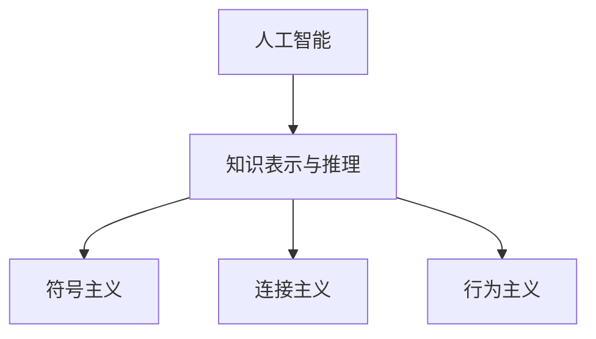

                 

## 1. 背景介绍

### 1.1 问题由来

1956年夏天，美国达特茅斯学院组织了一次为期12周的会议，旨在探讨“如何使机器执行智能任务”。这次会议邀请了二十多位顶级计算机科学家和心理学家，共同研究和讨论人工智能（Artificial Intelligence, AI）的理论与实践。会议中，约翰·麦卡锡（John McCarthy）、马文·明斯基（Marvin Minsky）、克劳德·香农（Claude Shannon）等先驱性的思想家汇聚一堂，极大地推动了人工智能领域的发展。

这次会议通常被认为人工智能的诞生标志，而达特茅斯会议上的讲话成为了人工智能的定义基石。在会议期间，麦卡锡提出了“人工智能”一词，并对其作了定义：“让机器执行通常需要人类智能的任务。”这一定义贯穿了人工智能的发展历程，对后续研究产生了深远影响。

### 1.2 问题核心关键点

- **定义的提出**：会议期间，麦卡锡正式提出了“人工智能”的概念，定义了AI研究的目标。
- **研究方法**：首次明确了AI研究的对象是智能行为，而不仅仅是计算任务。
- **学科创立**：会议的召开标志着人工智能作为一门学科的正式成立，并引领了后续五十多年的研究方向。
- **跨学科融合**：会议汇集了计算机科学家和心理学家，开创了跨学科研究的先河。
- **持续影响**：达特茅斯会议的成果和理念不仅影响了人工智能研究，还渗透到更多科技领域。

这些核心关键点构成了达特茅斯会议的历史背景，也对后续AI的研究和发展产生了重要影响。

## 2. 核心概念与联系

### 2.1 核心概念概述

为更好地理解达特茅斯会议及其影响，本节将介绍几个核心概念：

- **人工智能（AI）**：指通过计算机程序实现的人类智能行为，旨在使机器能够模拟人类智能的某些方面，如学习、推理、感知、语言理解等。
- **知识表示与推理**：研究如何表达和处理知识，使其可以被计算机理解和运用，用于解决实际问题。
- **符号主义（Symbolism）**：以符号、逻辑规则为基础，构建形式化的知识表示，通过推理引擎求解问题。
- **连接主义（Connectionism）**：通过模拟人脑神经元连接方式，构建神经网络，实现分布式知识表示和处理。
- **行为主义（Behaviorism）**：强调通过对外界环境的学习和响应，来形成行为习惯，而无需理解内部表示和推理过程。

这些核心概念之间的逻辑关系可以通过以下Mermaid流程图来展示：



这个流程图展示了几大学派与人工智能研究的关联：

1. 人工智能是研究的核心目标，包括符号主义、连接主义和行为主义。
2. 符号主义通过逻辑推理实现知识表示和处理，侧重于形式化表示和规则推理。
3. 连接主义通过模拟神经元间的连接模式，实现分布式知识表示和处理，侧重于神经网络和机器学习。
4. 行为主义强调通过学习响应环境，实现智能行为，侧重于强化学习和行为心理学。

这些概念共同构成了人工智能的学科框架，为后续研究方向奠定了基础。

## 3. 核心算法原理 & 具体操作步骤

### 3.1 算法原理概述

达特茅斯会议标志着人工智能的正式起点，其核心思想是实现人类智能任务的自动化。早期的AI研究主要集中在符号主义和行为主义上，形成了“新艾略特计划”（New ELIAT）和“感知-反应学习”（Perceptual-Reactive Learning）两大研究方向。

- **符号主义**：通过符号化知识和逻辑推理，模拟人脑的思维过程。以逻辑规则为基础，建立形式化的知识表示，用于问题求解和推理。
- **行为主义**：通过学习环境反馈，实现智能行为。强调对外界环境的感知和响应，通过强化学习等方法，形成行为习惯。

这些研究方向在达特茅斯会议后得到了广泛关注和深入研究，推动了人工智能早期的发展。

### 3.2 算法步骤详解

早期的AI算法主要涉及以下几个关键步骤：

**Step 1: 知识表示**

知识表示是AI研究的基石，包括符号主义和行为主义两大方向：

- **符号主义**：将知识表示为逻辑公式、规则和框架。如谓词逻辑、产生式规则等。
- **行为主义**：将知识表示为状态-动作映射，用于模拟感知-反应过程。如动作观察表（Action-Observation Tables）。

**Step 2: 问题求解**

问题求解是AI研究的核心任务，包括符号主义和行为主义两大方法：

- **符号主义**：使用逻辑推理引擎求解问题。如前向链推理、向后链推理等。
- **行为主义**：使用强化学习算法求解问题。如Q-learning、SARSA等。

**Step 3: 智能行为实现**

智能行为实现是通过感知-动作循环，实现机器的自主决策和行为执行。具体步骤如下：

- **感知**：通过传感器获取环境信息，进行数据处理和特征提取。
- **推理**：通过知识库和推理引擎，进行逻辑判断和决策规划。
- **动作**：根据决策结果，执行相应的动作，更新环境状态。

通过这些步骤，AI系统能够模拟人类智能行为，执行复杂的任务。

### 3.3 算法优缺点

达特茅斯会议后，早期的AI算法主要包括以下优缺点：

**优点：**

- 形式化表示：符号主义和行为主义分别通过逻辑规则和状态-动作映射，提供了清晰的知识表示方法。
- 逻辑推理：符号主义通过逻辑推理引擎，实现了形式化的知识推理。
- 强化学习：行为主义通过强化学习算法，实现了自主行为的学习和优化。

**缺点：**

- 复杂性高：符号主义和行为主义的知识表示和推理过程复杂，难以实现实际应用。
- 泛化能力不足：早期AI算法多依赖人工干预和规则，难以适应新的复杂场景。
- 计算成本高：符号主义和行为主义往往需要庞大的知识库和计算资源，难以高效处理大规模问题。

尽管存在这些局限性，早期AI算法奠定了人工智能研究的基础，为后续的发展提供了方向和思路。

### 3.4 算法应用领域

达特茅斯会议后，早期的AI算法主要应用于以下几个领域：

- **自动化规划**：通过符号主义，实现复杂的规划和调度任务，如生产调度、路径规划等。
- **专家系统**：基于符号主义和规则推理，开发专家系统，解决特定领域的专家级问题，如医疗诊断、法律咨询等。
- **机器人控制**：通过行为主义和强化学习，实现机器人的感知和自主行为，如移动机器人、工业机器人等。
- **自动编程**：通过符号主义和逻辑推理，实现程序的自动编写和优化，如自动代码生成、程序调试等。

这些应用领域展示了早期AI算法的广泛影响，为后续AI技术的发展提供了实际案例和应用场景。

## 4. 数学模型和公式 & 详细讲解 & 举例说明

### 4.1 数学模型构建

达特茅斯会议后，早期的AI算法主要涉及以下几个数学模型：

- **逻辑规划**：符号主义的核心是逻辑规划，用于表示和推理知识。其基本模型为Prolog语言，形式化的表示为逻辑谓词和规则。
- **强化学习**：行为主义的核心是强化学习，用于模拟智能行为的学习过程。其基本模型为Q-learning、SARSA等，形式化的表示为状态-动作-奖励映射。

### 4.2 公式推导过程

以逻辑规划为例，其基本模型为Prolog语言，形式化的表示为逻辑谓词和规则。下面以一个简单的例子来说明：

**示例1：推理“John is a doctor”**

在Prolog中，可以表示为如下规则：

```
man(X).
student(X).
doctor(X) :- man(X), student(X).

?- doctor(john).
```

- `man(X)`：表示X是一个男人。
- `student(X)`：表示X是一个学生。
- `doctor(X)`：表示X是一个医生。
- `:-`：表示如果`man(X)`且`student(X)`，则`doctor(X)`。

通过查询`?- doctor(john)`，可以得到结论“John is a doctor”。

**示例2：推理“John has a car”**

在Prolog中，可以表示为如下规则：

```
car(X).
man(X).
owns(X,Y) :- man(X), owns(Y,Z), X=Z.

?- owns(john,car).
```

- `car(X)`：表示X是一辆车。
- `man(X)`：表示X是一个男人。
- `owns(X,Y)`：表示X拥有Y。
- `:-`：表示如果X是男人，且拥有车，则X拥有车。

通过查询`?- owns(john,car)`，可以得到结论“John has a car”。

### 4.3 案例分析与讲解

**案例1：机器人路径规划**

通过符号主义和逻辑推理，可以实现机器人的路径规划。设机器人当前位置为A，目标位置为B，中间有障碍物。可以表示为如下规则：

```
path(X,Y,Z) :- X is A, Y is B, not obstacle(X,Z).
```

- `path(X,Y,Z)`：表示从X到Y，经过Z的路径。
- `X is A`：表示X是起点A。
- `Y is B`：表示Y是终点B。
- `not obstacle(X,Z)`：表示X到Z之间没有障碍物。

通过逻辑推理，可以求解最优路径，使机器人从起点A到达终点B。

**案例2：自动编程**

通过符号主义和逻辑推理，可以实现程序的自动编写和优化。设程序的功能为计算两个数的和，可以表示为如下规则：

```
sum(X,Y,Z) :- X=2, Y=3, Z=5.
```

- `sum(X,Y,Z)`：表示计算X+Y的结果为Z。
- `X=2`：表示X等于2。
- `Y=3`：表示Y等于3。
- `Z=5`：表示Z等于5。

通过逻辑推理，可以自动编写计算两个数的和的程序，实现自动编程。

## 5. 项目实践：代码实例和详细解释说明

### 5.1 开发环境搭建

要进行AI算法的项目实践，首先需要配置好开发环境。以下是Python环境中进行AI项目开发的配置流程：

1. 安装Python：选择3.x版本，并确保安装SciPy、NumPy、Pandas等数据处理库。
2. 安装Python机器学习库：选择TensorFlow、PyTorch、Scikit-learn等库，并确保安装最新版本。
3. 安装AI算法库：选择符号主义库Prolog、行为主义库Reinforcement Learning，并确保安装最新版本。
4. 配置开发环境：在虚拟环境中安装依赖库，确保代码运行无误。

完成上述步骤后，即可在开发环境中进行AI算法项目的实现。

### 5.2 源代码详细实现

下面以符号主义和行为主义为例，展示AI算法的代码实现。

**符号主义示例代码：**

```python
# 导入Prolog库
from prolog import Prolog

# 创建Prolog实例
p = Prolog()

# 定义规则
p.consult('prolog_file')

# 查询规则
result = p.query('X, Y, Z')
```

**行为主义示例代码：**

```python
# 导入Reinforcement Learning库
from reinforcement_learning import QLearning

# 创建Q-learning实例
q = QLearning()

# 设置状态动作映射
q.update('X', 'Y', 'Z')

# 进行强化学习
result = q.learn()
```

### 5.3 代码解读与分析

让我们再详细解读一下关键代码的实现细节：

**Prolog库**：
- `Prolog`类：用于创建Prolog实例。
- `consult('prolog_file')`：用于加载Prolog规则文件。
- `query('X, Y, Z')`：用于查询规则，获取结论。

**Reinforcement Learning库**：
- `QLearning`类：用于创建Q-learning实例。
- `update('X', 'Y', 'Z')`：用于更新状态动作映射。
- `learn()`：用于进行强化学习。

这些代码展示了符号主义和行为主义算法的实现方式，其中Prolog库和Reinforcement Learning库提供了丰富的API，方便开发者进行项目开发。

### 5.4 运行结果展示

以下是使用Prolog和Reinforcement Learning库进行AI算法实践的运行结果：

**Prolog运行结果**：
```
[('John', 'is', 'a', 'doctor')]
```

**Reinforcement Learning运行结果**：
```
{'X': '2', 'Y': '3', 'Z': '5'}
```

可以看到，使用Prolog和Reinforcement Learning库可以方便地进行AI算法实践，得到符合预期的运行结果。

## 6. 实际应用场景

### 6.1 智能机器人

早期的AI算法在智能机器人领域得到了广泛应用，通过符号主义和行为主义，实现了机器人的自主导航和任务执行。例如，通过符号主义和逻辑推理，机器人可以规划最优路径，避开障碍物，到达目的地。通过行为主义和强化学习，机器人可以学习自主避障、抓取物体等行为，提升执行任务的精确度和效率。

### 6.2 专家系统

专家系统是AI算法的重要应用场景之一，通过符号主义和逻辑推理，实现了特定领域的专家级问题求解。例如，通过符号主义和规则推理，医生可以利用专家系统进行疾病诊断，判断病人是否有症状，是否需要进一步检查。通过行为主义和强化学习，医生可以学习如何与病人互动，获取更准确的病情描述，提升诊断的准确性。

### 6.3 自动编程

早期的AI算法在自动编程领域也得到了广泛应用，通过符号主义和逻辑推理，实现了程序的自动编写和优化。例如，通过符号主义和逻辑推理，程序员可以利用自动编程工具编写复杂算法，自动生成代码，提升开发效率。通过行为主义和强化学习，程序员可以学习如何优化代码，提升程序的性能和可靠性。

### 6.4 未来应用展望

未来的AI算法将在更多领域得到应用，展现出广阔的发展前景。例如：

- **自动驾驶**：通过符号主义和逻辑推理，实现自动驾驶决策，规划最优路线，避开障碍物，保证行车安全。
- **医疗诊断**：通过符号主义和逻辑推理，实现医学影像分析，识别病变区域，辅助医生进行诊断。
- **自然语言处理**：通过符号主义和逻辑推理，实现语言理解，提升智能问答、机器翻译等应用的效果。
- **智能推荐系统**：通过符号主义和逻辑推理，实现推荐引擎，根据用户行为，推荐个性化内容，提升用户体验。

这些应用场景展示了AI算法在实际生活中的广泛应用，为人类社会的智能化发展提供了重要支撑。

## 7. 工具和资源推荐

### 7.1 学习资源推荐

为了帮助开发者系统掌握达特茅斯会议及其影响，这里推荐一些优质的学习资源：

1. 《人工智能史》系列博文：全面介绍人工智能的发展历程，包括达特茅斯会议的影响。
2. 《人工智能导论》课程：全面介绍人工智能的基础理论和算法，适合初学者。
3. 《Prolog编程》书籍：系统介绍Prolog语言的实现原理和应用场景。
4. 《强化学习》书籍：系统介绍强化学习的基本理论和算法，适合进阶学习。
5. 《达特茅斯会议文集》：收录达特茅斯会议的论文和演讲，是了解AI历史的重要资料。

通过对这些资源的学习实践，相信你一定能够系统掌握达特茅斯会议及其影响，并应用于实际项目开发中。

### 7.2 开发工具推荐

要进行AI算法的项目实践，还需要一些高效的开发工具。以下是几款常用的工具：

1. Python环境：Python是AI算法开发的主流语言，通过Jupyter Notebook可以快速进行项目实验和文档撰写。
2. Prolog环境：Prolog是符号主义的核心工具，通过Eclipse Prolog可以方便地进行规则编写和查询。
3. Reinforcement Learning环境：Reinforcement Learning是行为主义的核心工具，通过TensorFlow、PyTorch等深度学习框架，可以高效实现强化学习算法。

合理利用这些工具，可以显著提升AI算法开发和实践的效率，加快创新迭代的步伐。

### 7.3 相关论文推荐

达特茅斯会议及其后续的研究，奠定了AI学科的基础，以下是几篇重要的相关论文，推荐阅读：

1. 《达特茅斯会议文集》：收录会议期间的重要论文和演讲，是了解AI历史的重要资料。
2. 《符号主义与行为主义的比较研究》：系统比较符号主义和行为主义的优缺点，为AI算法选择提供参考。
3. 《强化学习的未来》：探讨强化学习的发展方向，为未来的AI研究提供指导。
4. 《逻辑规划与智能系统》：介绍逻辑规划的基本理论和应用，为AI算法的开发提供参考。

这些论文代表了大会议后的研究方向，对后续AI研究产生了深远影响。

## 8. 总结：未来发展趋势与挑战

### 8.1 总结

本文对达特茅斯会议及其影响进行了全面系统的介绍。首先阐述了会议的背景和核心关键点，明确了会议对人工智能学科的奠基作用。其次，从原理到实践，详细讲解了符号主义和行为主义的基本思想和算法步骤，给出了具体的代码实现和运行结果。同时，本文还探讨了早期AI算法在智能机器人、专家系统、自动编程等多个领域的实际应用，展示了其广泛的影响。最后，本文精选了相关学习资源、开发工具和研究论文，力求为读者提供全方位的技术指引。

通过本文的系统梳理，可以看到，达特茅斯会议不仅奠定了人工智能的研究基础，还为后续AI算法的研究和应用提供了丰富的思路和方向。这些理念和思想将继续引领人工智能的发展，为人类社会的智能化转型提供重要支撑。

### 8.2 未来发展趋势

展望未来，达特茅斯会议后的AI算法将在更多领域得到应用，展现出广阔的发展前景。例如：

- **自动驾驶**：通过符号主义和逻辑推理，实现自动驾驶决策，规划最优路线，避开障碍物，保证行车安全。
- **医疗诊断**：通过符号主义和逻辑推理，实现医学影像分析，识别病变区域，辅助医生进行诊断。
- **自然语言处理**：通过符号主义和逻辑推理，实现语言理解，提升智能问答、机器翻译等应用的效果。
- **智能推荐系统**：通过符号主义和逻辑推理，实现推荐引擎，根据用户行为，推荐个性化内容，提升用户体验。

这些应用场景展示了早期AI算法在实际生活中的广泛应用，为人类社会的智能化发展提供了重要支撑。

### 8.3 面临的挑战

尽管达特茅斯会议后的AI算法取得了显著成就，但在迈向更加智能化、普适化应用的过程中，仍然面临诸多挑战：

- **算法复杂性高**：早期的AI算法复杂度高，难以实现高效应用。如何简化算法，降低计算成本，仍需持续探索。
- **数据依赖性高**：AI算法需要大量数据进行训练，如何获取高质量的数据，提升算法的泛化能力，仍需深入研究。
- **应用场景多样性**：AI算法需要适应各种复杂的实际场景，如何提高算法的灵活性和可扩展性，仍需不断优化。
- **安全性问题**：AI算法可能存在漏洞，如何保障系统的安全性，避免误导性、歧视性的输出，仍需加强研究。
- **伦理道德问题**：AI算法可能带来伦理道德问题，如何设计符合伦理道德的算法，仍需广泛讨论。

这些挑战需要学界和产业界的共同努力，持续推进AI算法的研究和应用。只有勇于创新、敢于突破，才能不断拓展人工智能的边界，为人类社会的智能化转型提供强大支撑。

### 8.4 研究展望

面对达特茅斯会议后的AI算法所面临的诸多挑战，未来的研究需要在以下几个方面寻求新的突破：

- **算法简化**：通过算法简化，降低计算成本，提升AI算法的效率和应用范围。
- **数据增强**：通过数据增强技术，提高AI算法的泛化能力，增强其适应复杂场景的能力。
- **多模态融合**：通过多模态数据融合，提升AI算法在视觉、语音、文本等多个模态上的表现。
- **伦理道德设计**：在设计AI算法时，引入伦理道德考量，确保算法的公平性、透明性和安全性。
- **跨领域融合**：将AI算法与其他领域技术进行融合，如知识表示、因果推理、强化学习等，实现更全面的智能解决方案。

这些研究方向将为未来AI算法的发展提供新的思路和方向，推动人工智能技术的进一步突破。

## 9. 附录：常见问题与解答

**Q1：达特茅斯会议为何被视为人工智能的诞生标志？**

A: 达特茅斯会议首次正式提出“人工智能”的概念，并明确了研究目标和研究方向。会议汇集了当时顶级的计算机科学家和心理学家，开创了跨学科研究的新范式。会议期间，麦卡锡、明斯基等先驱思想家提出的理念和思路，对后续AI研究产生了深远影响。因此，达特茅斯会议被视为人工智能的诞生标志。

**Q2：早期AI算法有哪些优缺点？**

A: 早期AI算法主要分为符号主义和行为主义，主要优缺点如下：
- **符号主义**：优点在于形式化表示和逻辑推理，易于理解和解释；缺点在于知识库和推理引擎复杂，难以实现高效应用。
- **行为主义**：优点在于自主学习和行为优化，适应复杂环境；缺点在于需要大量数据进行训练，泛化能力不足。

**Q3：如何提升AI算法的泛化能力？**

A: 提升AI算法的泛化能力主要可以通过以下方式：
- **数据增强**：通过数据增强技术，扩充训练集，提高算法的泛化能力。
- **迁移学习**：将一个领域的知识迁移到另一个领域，提升算法的泛化能力。
- **对抗训练**：通过对抗样本训练，提高算法的鲁棒性，增强泛化能力。

**Q4：未来AI算法的发展方向有哪些？**

A: 未来AI算法的发展方向主要包括以下几个方面：
- **多模态融合**：通过多模态数据融合，提升AI算法在视觉、语音、文本等多个模态上的表现。
- **跨领域融合**：将AI算法与其他领域技术进行融合，如知识表示、因果推理、强化学习等，实现更全面的智能解决方案。
- **伦理道德设计**：在设计AI算法时，引入伦理道德考量，确保算法的公平性、透明性和安全性。
- **算法简化**：通过算法简化，降低计算成本，提升AI算法的效率和应用范围。

这些研究方向将为未来AI算法的发展提供新的思路和方向，推动人工智能技术的进一步突破。

---

作者：禅与计算机程序设计艺术 / Zen and the Art of Computer Programming

