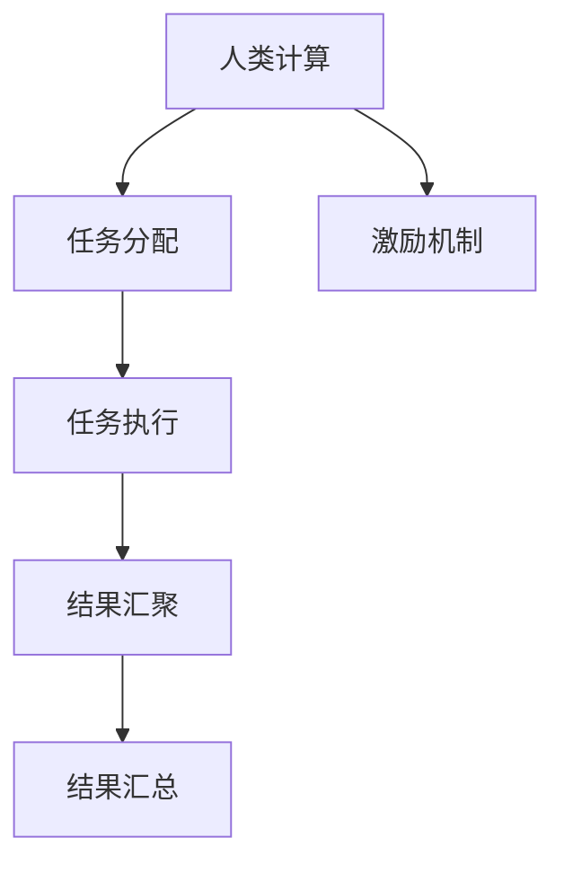

                 

## 1. 背景介绍

### 1.1 问题由来

人类计算(Human Computation)，又称众包计算、分布式计算等，是指通过大量人类工作者共同完成计算任务的一种方式。近年来，随着互联网和移动设备的普及，人类计算迅速崛起，成为计算机科学和数据科学领域的一支重要力量。其背后的原理是“智慧的汇聚”，即大量工作者分散在不同时间和地点，但共同致力于解决复杂问题，汇聚成巨大的智慧资源。

人类计算在学术界和工业界的应用广泛，从科学研究、社会科学到商业决策，都取得了显著成果。例如，Fold@home项目通过分布式计算，帮助科学家加速了蛋白质折叠模拟；Amazon Mechanical Turk平台提供人类计算服务，为企业提供了廉价、高效的众包劳动力；Airbnb、Uber等平台，利用众包信息获取来优化定价和供需匹配。

### 1.2 问题核心关键点

人类计算的核心在于利用人类智慧的非线性增益，即一个人单独工作时效率较低，但当多人共同工作时，整体效率会远远超过单独工作的效率总和。这种非线性增益反映了人类智慧的协作效应，也成为人类计算成功的重要因素。

人类计算的关键在于：

- 如何设计高效、易行的任务分配机制，确保参与者能够充分利用各自的专业知识和经验。
- 如何激励机制吸引高质人力资源，确保参与者的积极性。
- 如何对计算结果进行筛选和审核，保证结果的准确性和可靠性。

### 1.3 问题研究意义

研究人类计算的本质和实现方式，对于理解人类智慧的协作原理，推动人类智慧资源的最大化利用，具有重要意义。它不仅能推动计算机科学和数据科学的发展，还能在更广泛的社会经济领域，如科学研究、商业决策、公共事务等，带来深远的影响。

## 2. 核心概念与联系

### 2.1 核心概念概述

为了更好地理解人类计算的原理，本节将介绍几个关键概念：

- **人类计算(Human Computation)**：利用人类工作者的智慧共同完成计算任务的一种方式，即众包计算、分布式计算等。
- **任务分配(Task Assignment)**：将计算任务合理分配给不同的人工工作者，确保其高效完成。
- **任务执行(Task Execution)**：人工工作者执行分配的任务，利用各自的计算能力。
- **结果汇聚(Result Aggregation)**：将分散的计算结果进行汇总、筛选和整合，形成统一的结果。
- **激励机制(Incentive Mechanism)**：通过奖励、排名等方式激励工作者积极参与，确保其高效性和可靠性。

这些概念之间的逻辑关系可以通过以下Mermaid流程图来展示：



这个流程图展示了大规模人类计算的基本流程：首先进行任务分配，确保每个任务都有合适的人力资源；接着，任务执行者各自计算结果；最后，结果汇聚和汇总，得到最终的答案。激励机制则贯穿整个过程，确保参与者积极参与和高质量输出。

## 3. 核心算法原理 & 具体操作步骤

### 3.1 算法原理概述

人类计算的算法原理，可以从以下几个方面进行理解：

- **任务设计**：将复杂的计算任务拆解为多个小任务，每个小任务可以独立完成，并且适合通过人工计算来解决。
- **任务分配**：利用算法将小任务合理分配给不同的人工工作者。常见的任务分配算法包括最大匹配算法、线性规划算法等。
- **结果汇聚**：将分散的小任务结果进行整合，得到最终结果。常见的结果汇聚算法包括投票算法、加权平均算法等。
- **激励机制**：设计合适的奖励和惩罚机制，确保人工工作者的高质量参与。常见的激励机制包括奖金、排名、认证等。

### 3.2 算法步骤详解

人类计算的详细步骤通常包括以下几个方面：

**Step 1: 任务设计**
- 分析计算任务，将其拆解为多个小任务。例如，蛋白质折叠模拟可以拆解为多个子任务，每个子任务涉及特定的物理化学参数计算。
- 对每个小任务进行描述，形成清晰的任务说明书。例如，任务说明书应包括计算目标、输入输出、计算方法等。

**Step 2: 任务分配**
- 利用算法将任务分配给不同的人工工作者。例如，采用最大匹配算法，将每个任务分配给计算能力最强且最空闲的工作者。
- 将任务分配结果通知每个工作者，并提供计算所需的资源和工具。例如，提供计算所需的公式和程序代码。

**Step 3: 任务执行**
- 人工工作者利用分配到的资源和工具，执行分配的任务。例如，每个工作者通过编程计算自己的任务。
- 工作者在计算过程中，利用在线协作工具共享信息和进度。例如，使用GitHub、Google Docs等工具进行协作。

**Step 4: 结果汇聚**
- 将每个工作者的计算结果汇总，得到最终结果。例如，通过加权平均算法，将每个工作者的计算结果进行汇总。
- 对汇总结果进行审核和验证，确保其准确性和可靠性。例如，通过专家评审、同行评议等方式进行审核。

**Step 5: 结果公开**
- 将最终结果公开，供其他研究者或用户使用。例如，将计算结果发布到学术期刊或公开数据库中。
- 对参与者进行奖励和表彰，鼓励更多人参与。例如，发放奖金、颁发证书等方式。

### 3.3 算法优缺点

人类计算的优点包括：

- **利用大量人类智慧**：能够解决一些复杂且难以自动化的计算问题。
- **灵活性高**：适合处理多种计算任务，适应性强。
- **可扩展性强**：随着人力规模的扩大，计算能力会线性增长。

然而，人类计算也存在一些缺点：

- **质量难以保证**：部分工作者的计算结果可能存在误差或偏差。
- **协调成本高**：任务分配和结果汇聚过程中，需要高成本的协调和管理。
- **激励机制复杂**：设计有效的激励机制需要考虑多种因素，如公平性、激励强度等。

### 3.4 算法应用领域

人类计算在多个领域中得到了广泛应用：

- **科学研究**：例如，Fold@home项目通过人类计算加速蛋白质折叠模拟，AlphaFold利用人类计算提升了蛋白质结构预测的精度。
- **社会科学**：例如，G shining use of workers，通过众包调查收集大量社会数据，用于政策制定和社会研究。
- **商业决策**：例如，Amazon Mechanical Turk利用众包劳动力进行产品测试、广告创意评估等，显著降低成本。
- **公共事务**：例如，GovDesk项目利用人类计算进行城市规划、社区管理等，提高了公共服务的效率。

这些应用展示了人类计算在解决复杂问题、提高决策质量、优化资源配置等方面的巨大潜力。

## 4. 数学模型和公式 & 详细讲解 & 举例说明

### 4.1 数学模型构建

人类计算的数学模型，可以从任务分配和结果汇聚两个方面进行构建：

- **任务分配模型**：利用图论和线性规划等方法，构建任务分配模型。例如，用图表示任务和工作者之间的关系，利用最大匹配算法进行任务分配。
- **结果汇聚模型**：利用统计学和机器学习等方法，构建结果汇聚模型。例如，用加权平均算法对计算结果进行汇总，确保结果的准确性。

### 4.2 公式推导过程

以Fold@home项目为例，展示任务分配和结果汇聚的数学推导过程：

**任务分配**：
- 将蛋白质折叠问题拆解为多个小任务，例如计算特定残基的能量。
- 构建任务图 $G=(V,E)$，顶点为工作者和任务，边表示工作者可以执行的任务。
- 利用最大匹配算法 $M$ 进行任务分配，最大匹配问题可以通过匈牙利算法求解。

**结果汇聚**：
- 每个工作者计算特定残基的能量，得到计算结果。
- 将计算结果汇总，得到蛋白质折叠的最终能量。
- 使用加权平均算法对计算结果进行合并，例如 $\bar{E} = \sum_{i=1}^N w_i E_i / \sum_{i=1}^N w_i$，其中 $w_i$ 为每个工作者的权重。

### 4.3 案例分析与讲解

以Fold@home项目为例，进一步讲解人类计算的应用：

Fold@home是一个利用人类计算加速蛋白质折叠模拟的项目。该项目通过众包计算，将计算任务拆解为多个小任务，每个任务计算特定残基的能量。项目中，每个工作者利用在线协作工具完成分配的任务，并将结果提交到项目服务器。服务器通过最大匹配算法将任务合理分配给工作者，并通过加权平均算法汇总计算结果。通过这种分布式计算方式，Fold@home显著提高了蛋白质折叠模拟的效率和精度，加速了相关领域的科学研究进展。

## 5. 项目实践：代码实例和详细解释说明

### 5.1 开发环境搭建

在进行人类计算项目开发前，需要先搭建好开发环境：

1. 安装Python、R等编程语言。
2. 安装相关库和框架，如TensorFlow、PyTorch、R语言等。
3. 配置分布式计算环境，例如使用Spark、Hadoop等分布式计算平台。

### 5.2 源代码详细实现

下面以Fold@home项目为例，展示人类计算的代码实现：

**任务设计**：
```python
# 任务说明书：计算特定残基的能量
def calculate_energy(residue):
    # 计算特定残基的能量
    # ...
    return energy
```

**任务分配**：
```python
# 构建任务图
graph = nx.Graph()
graph.add_nodes_from(['worker1', 'worker2', ...])
graph.add_edges_from([('task1', 'worker1'), ('task2', 'worker2'), ...])
# 利用最大匹配算法进行任务分配
matching = nx.max_weight_matching(graph)
# 分配任务并通知工作者
for task, worker in matching.items():
    # 通知工作者并分配计算资源
    notify_worker(worker, task)
```

**任务执行**：
```python
# 工作者计算任务
def compute_task(worker, task):
    # 计算特定任务
    # ...
    return result
# 利用在线协作工具共享信息
def share_info(worker, task):
    # 利用GitHub、Google Docs等工具共享信息和进度
    # ...
```

**结果汇聚**：
```python
# 汇总计算结果
def aggregate_results(results):
    # 利用加权平均算法汇总结果
    weighted_avg = sum(results) / len(results)
    return weighted_avg
# 审核和验证结果
def verify_results(results):
    # 利用专家评审、同行评议等方式审核结果
    # ...
```

**结果公开**：
```python
# 公开结果
def publish_results(results):
    # 将计算结果发布到学术期刊或公开数据库中
    # ...
# 对参与者进行奖励和表彰
def reward_workers(results):
    # 发放奖金、颁发证书等方式奖励参与者
    # ...
```

### 5.3 代码解读与分析

让我们再详细解读一下关键代码的实现细节：

**任务说明书**：
- 描述了每个小任务的计算目标、输入输出、计算方法等，是任务分配和执行的基础。

**任务图构建**：
- 利用网络x（NetworkX）库构建任务图，顶点为工作者和任务，边表示工作者可以执行的任务。
- 最大匹配算法（Max Weight Matching）用于将任务合理分配给工作者，确保高效完成。

**任务执行和协作**：
- 工作者通过在线协作工具（如GitHub、Google Docs等）共享信息和进度，利用程序代码计算分配的任务。
- 通过G shining use of workers，将计算结果汇总并共享，确保结果的准确性和可靠性。

**结果审核和公开**：
- 利用专家评审、同行评议等方式审核结果，确保结果的准确性和可靠性。
- 通过在线平台（如学术期刊、公开数据库等）公开结果，供其他研究者或用户使用。
- 对参与者进行奖励和表彰，鼓励更多人参与。

## 6. 实际应用场景

### 6.1 科学研究

人类计算在科学研究中的应用，可以显著加速复杂计算任务的求解。例如，Fold@home项目通过人类计算，加速了蛋白质折叠模拟，提升了分子生物学研究的进展。类似地，CrowdFlower项目利用人类计算进行科学实验设计和数据分析，提高了科学研究的效率和精度。

### 6.2 社会科学

社会科学领域也需要大量计算任务，例如数据收集、统计分析等。通过人类计算，可以快速完成这些任务，提高社会研究的效率。例如，G shining use of workers，通过众包调查收集大量社会数据，用于政策制定和社会研究。

### 6.3 商业决策

商业决策过程中，需要大量数据分析和计算任务。人类计算能够快速完成这些任务，帮助企业做出更明智的决策。例如，Amazon Mechanical Turk利用众包劳动力进行产品测试、广告创意评估等，显著降低了企业的成本。

### 6.4 公共事务

公共事务管理中，需要大量的计算和数据处理任务。通过人类计算，可以提高公共服务的效率和质量。例如，GovDesk项目利用人类计算进行城市规划、社区管理等，提高了公共服务的效率和质量。

## 7. 工具和资源推荐

### 7.1 学习资源推荐

为了帮助开发者系统掌握人类计算的理论基础和实践技巧，这里推荐一些优质的学习资源：

1. **《Human Computation and Crowdsourcing》**：介绍人类计算和众包计算的基础理论和应用实践，是一本系统全面、通俗易懂的书籍。
2. **Coursera《Human Computation》**：斯坦福大学开设的课程，涵盖人类计算的原理、技术和应用，适合入门和进阶学习。
3. **Kaggle平台**：提供大量人类计算和众包计算的实际案例，可以学习到实际应用中的技术和方法。
4. **OpenDataKit**：提供人类计算和众包计算的平台和工具，可以快速进行任务设计和结果汇聚。

通过对这些资源的学习实践，相信你一定能够快速掌握人类计算的精髓，并用于解决实际的计算问题。

### 7.2 开发工具推荐

高效的开发离不开优秀的工具支持。以下是几款用于人类计算开发的常用工具：

1. **TensorFlow**：基于Python的开源深度学习框架，适合进行大规模分布式计算。
2. **PyTorch**：基于Python的开源深度学习框架，灵活动态的计算图，适合快速迭代研究。
3. **R语言**：统计分析能力强，适合进行数据处理和结果汇总。
4. **GitHub**：代码托管平台，适合进行协作开发和代码版本管理。
5. **Google Docs**：在线协作工具，适合进行任务分配和结果共享。

合理利用这些工具，可以显著提升人类计算任务的开发效率，加快创新迭代的步伐。

### 7.3 相关论文推荐

人类计算和众包计算的研究在学术界和工业界已经得到了广泛关注，以下是几篇奠基性的相关论文，推荐阅读：

1. **Human Computation and the Power of Crowds**：一篇综述性论文，总结了人类计算和众包计算的基础理论和应用实践。
2. **The Promise and Peril of Crowdsourcing**：探讨了众包计算的优势和挑战，对未来发展提出了新的展望。
3. **The Spatial Crowdsourced Internet**：利用人类计算进行地理信息获取和分析，展示了人类计算的潜力。

这些论文代表了大规模人类计算的发展脉络。通过学习这些前沿成果，可以帮助研究者把握学科前进方向，激发更多的创新灵感。

## 8. 总结：未来发展趋势与挑战

### 8.1 总结

本文对人类计算的本质和实现方式进行了全面系统的介绍。首先阐述了人类计算和众包计算的基本概念和应用场景，明确了任务设计、任务分配、结果汇聚和激励机制等关键步骤。其次，从原理到实践，详细讲解了人类计算的数学模型和具体实现，给出了人类计算任务开发的完整代码实例。同时，本文还广泛探讨了人类计算在科学研究、社会科学、商业决策等众多领域的应用前景，展示了人类计算的巨大潜力。

通过本文的系统梳理，可以看到，人类计算作为一种新型计算方式，正在成为计算机科学和数据科学的重要手段，拓展了计算资源的边界，推动了复杂问题的解决。未来，伴随人类计算技术的持续演进，必将在更多领域带来变革性影响。

### 8.2 未来发展趋势

展望未来，人类计算技术将呈现以下几个发展趋势：

1. **技术迭代加速**：随着计算能力和网络技术的提升，人类计算的效率和精度将显著提高，能够处理更复杂、更精细的计算任务。
2. **应用领域拓展**：人类计算将广泛应用于更多领域，如智能制造、智慧农业、环境监测等，推动跨领域的协同创新。
3. **算法和工具创新**：新的任务分配算法和结果汇聚算法将不断涌现，进一步提高人类计算的效率和效果。
4. **协作机制优化**：更加灵活、高效的任务分配和激励机制将不断优化，确保参与者的高质量参与和持续激励。
5. **数据和隐私保护**：随着人类计算的普及，数据和隐私保护将受到更多关注，需要设计更加安全的协作平台和机制。

这些趋势凸显了人类计算技术的广阔前景，展示了其在解决复杂问题、推动社会进步方面的巨大潜力。

### 8.3 面临的挑战

尽管人类计算技术已经取得了瞩目成就，但在迈向更加智能化、普适化应用的过程中，仍面临诸多挑战：

1. **质量控制**：如何确保参与者的高质量参与，避免低质任务和错误输出，将是人类计算的一大难题。
2. **协调成本**：任务分配和结果汇聚过程中，需要高成本的协调和管理，如何降低成本，提高效率，还需进一步研究。
3. **激励机制**：设计合适的激励机制，吸引高质量人力资源，确保其积极性和可靠性，是一大挑战。
4. **数据和隐私**：如何保护参与者的数据隐私，防止数据泄露和滥用，还需进一步探索。

### 8.4 研究展望

面对人类计算面临的挑战，未来的研究需要在以下几个方面寻求新的突破：

1. **提高质量控制**：设计更加科学合理的任务分配和结果汇聚机制，确保参与者的高质量参与。
2. **优化协作机制**：利用区块链、分布式账本等技术，降低协调成本，提高任务执行效率。
3. **设计有效激励**：结合经济激励、社会激励等多方面因素，设计更加有效的激励机制。
4. **保护数据隐私**：利用数据加密、匿名化等技术，保护参与者的数据隐私，防止数据滥用。

这些研究方向将推动人类计算技术走向成熟，为大规模协作计算带来新的突破。面向未来，人类计算技术需要与其他人工智能技术进行更深入的融合，如自然语言处理、机器学习等，多路径协同发力，共同推动复杂问题的解决。只有勇于创新、敢于突破，才能不断拓展计算资源的边界，推动科学研究和社会进步。

## 9. 附录：常见问题与解答

**Q1: 人类计算和众包计算有什么区别？**

A: 人类计算和众包计算本质相同，都是利用大量人类工作者共同完成计算任务。但人类计算更强调协作效应和非线性增益，适用于处理复杂、难以自动化的计算任务。而众包计算更多用于任务外包，适合处理标准化、重复性较高的计算任务。

**Q2: 如何设计有效的激励机制？**

A: 设计有效的激励机制需要考虑多个因素，如任务难度、工作量、参与者专业性等。一般来说，采用经济激励（如奖金、佣金）、社会激励（如认证、荣誉）等手段，结合公平性、激励强度等设计原则，可以有效提升参与者的积极性和质量。

**Q3: 人类计算面临的主要挑战是什么？**

A: 人类计算面临的主要挑战包括质量控制、协调成本、激励机制、数据隐私等方面。如何确保高质量参与、降低协调成本、设计有效激励和保护数据隐私，将是未来人类计算技术研究的重要方向。

**Q4: 人类计算有哪些典型的应用案例？**

A: 人类计算在多个领域中得到了广泛应用，例如Fold@home项目通过人类计算加速蛋白质折叠模拟，Amazon Mechanical Turk利用众包劳动力进行产品测试、广告创意评估等，显著降低了企业的成本。这些应用展示了人类计算在解决复杂问题、提高决策质量、优化资源配置等方面的巨大潜力。

---

作者：禅与计算机程序设计艺术 / Zen and the Art of Computer Programming

