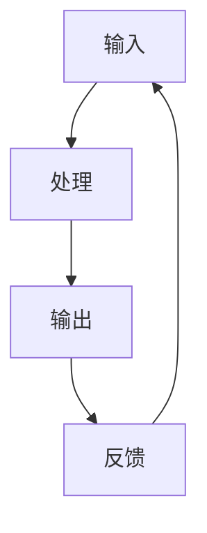

                 

# 重塑个人工作流：输入、处理、输出、反馈的循环

## 1. 背景介绍

### 1.1 问题由来

在信息爆炸的时代，个人和组织每天都在面对海量的数据和信息。如何在工作中有效利用这些信息，成为了新时代的重要挑战。个人工作流的重塑，即是对输入、处理、输出、反馈的整个循环进行优化，旨在提高工作效率、降低决策误差，同时提升创造力和适应性。

随着人工智能、大数据、云计算等技术的飞速发展，我们有了更多工具和方法来辅助这一过程。例如，数据分析、机器学习、自然语言处理等技术可以帮助我们更高效地处理和理解信息。但同时，这些技术的复杂性和多样性也带来了新的挑战，如何合理使用这些工具，提升工作流效率，成为了一个值得深入探讨的问题。

### 1.2 问题核心关键点

个人工作流的重塑，核心在于通过数据驱动的方法，实现输入、处理、输出、反馈的闭环优化。具体包括以下几个关键点：

- **输入优化**：如何高效获取、筛选和整理信息，避免信息过载和噪声干扰。
- **处理自动化**：利用自动化工具，如机器学习算法、自然语言处理模型等，提升信息处理的效率和准确性。
- **输出合理化**：合理组织信息输出形式，如报告、图表、摘要等，便于决策和理解。
- **反馈机制**：建立有效的反馈机制，根据实际效果调整工作流程，持续优化输入、处理、输出的各个环节。

本文将从以上几个方面入手，系统探讨如何通过技术手段重塑个人工作流，提高工作效率和决策质量。

## 2. 核心概念与联系

### 2.1 核心概念概述

为了更好地理解工作流的优化方法，我们需要先梳理几个核心概念：

- **输入**：指个人获取信息的方式和渠道，包括阅读文献、浏览网页、观看视频、聆听演讲等。
- **处理**：指对获取到的信息进行筛选、分析和提取有用内容的过程。
- **输出**：指将处理后的信息以报告、PPT、笔记等形式进行整理和呈现。
- **反馈**：指根据实际应用效果，对输入、处理和输出环节进行调整和优化。

这些概念相互关联，构成了一个完整的个人工作流循环。通过系统化的方法，对这一循环进行优化，可以显著提升工作效率和决策质量。

### 2.2 核心概念原理和架构的 Mermaid 流程图



该流程图展示了输入、处理、输出、反馈的完整循环。其中，输入经过处理后生成输出，输出再反馈回输入，形成了一个持续优化的闭环系统。

## 3. 核心算法原理 & 具体操作步骤

### 3.1 算法原理概述

个人工作流的优化，本质上是一个数据驱动的优化过程。通过收集、分析输入数据，利用机器学习算法进行自动化处理，输出有效信息，再通过反馈机制进行持续优化，不断提升工作流的效率和效果。

在具体实现上，可以分为以下几个步骤：

1. **输入数据收集**：通过爬虫、API调用等方式，自动收集相关领域的最新数据和信息。
2. **数据预处理**：对收集到的数据进行清洗、去重、归一化等预处理操作，确保数据质量。
3. **特征提取和模型训练**：利用自然语言处理、图像处理等技术，从数据中提取特征，并通过机器学习模型进行训练，实现信息的自动分析和理解。
4. **信息输出**：将训练后的模型输出结果进行整理和呈现，如生成报告、可视化图表等。
5. **反馈调整**：根据实际应用效果，对模型进行调参和优化，调整输入和处理环节，确保输出信息的质量和时效性。

### 3.2 算法步骤详解

**Step 1: 输入数据收集**

输入数据的收集是工作流优化的第一步。为了确保数据的全面性和时效性，可以采用以下方法：

- **爬虫技术**：利用Python爬虫库，如BeautifulSoup、Scrapy等，自动抓取网页数据。
- **API接口调用**：通过访问公开的API接口，获取相关领域的最新数据，如金融市场数据、气象数据等。
- **数据订阅**：订阅各种数据源，如新闻订阅、邮件通知等，获取最新的信息。

**Step 2: 数据预处理**

收集到的数据往往存在格式不一、噪音干扰等问题，需要经过预处理才能进行下一步分析。常用的预处理方法包括：

- **清洗**：去除重复、无效、噪声数据。
- **归一化**：将数据转换为统一的格式和单位，便于后续分析。
- **特征提取**：利用自然语言处理技术，提取文本数据的关键词、实体等特征。

**Step 3: 特征提取和模型训练**

特征提取是信息处理的核心环节。利用机器学习算法，如朴素贝叶斯、随机森林、神经网络等，对提取出的特征进行训练和预测。常用的工具包括：

- **scikit-learn**：Python机器学习库，提供了丰富的算法和工具。
- **TensorFlow、PyTorch**：深度学习框架，支持构建复杂的神经网络模型。
- **NLTK、spaCy**：自然语言处理库，用于处理文本数据。

**Step 4: 信息输出**

输出信息的整理和呈现，是工作流优化的关键。根据不同的任务需求，可以采用以下方式：

- **报告**：将分析结果整理成报告形式，便于阅读和理解。
- **可视化图表**：使用Matplotlib、Seaborn等库，生成数据可视化图表，直观展示结果。
- **自然语言生成**：利用GPT等自然语言生成模型，生成简洁明了的摘要和总结。

**Step 5: 反馈调整**

最后，根据实际应用效果，对输入、处理和输出环节进行调整。常用的反馈方法包括：

- **用户调查**：通过问卷调查等方式，收集用户对输出信息的反馈。
- **A/B测试**：对不同输出形式进行A/B测试，对比效果，选择最优方案。
- **数据对比**：利用历史数据和最新数据进行对比，评估模型的性能和稳定性。

### 3.3 算法优缺点

基于数据驱动的个人工作流优化方法，具有以下优点：

- **高效性**：自动化处理大大提升了信息处理的效率，减少了人工工作量。
- **准确性**：机器学习算法在数据驱动下，能够提高信息处理的准确性，减少人为误判。
- **可扩展性**：通过调整输入和处理环节，可以灵活扩展工作流，适应不同场景和需求。

同时，该方法也存在以下局限：

- **数据依赖**：依赖于高质量的数据输入，数据缺失或错误会影响结果。
- **算法复杂度**：算法的选择和调参需要一定的专业知识和经验，增加了工作复杂度。
- **实时性问题**：处理大数据集时，可能面临实时性问题，需要优化算法和硬件配置。

### 3.4 算法应用领域

个人工作流的优化方法，已经在多个领域得到了广泛应用，例如：

- **数据分析**：利用机器学习模型对大量数据进行自动分析和预测，生成报告和可视化图表。
- **金融分析**：通过自然语言处理技术，自动分析新闻、财报等文本信息，生成市场分析和投资建议。
- **市场营销**：利用情感分析等技术，自动分析社交媒体数据，生成市场调研报告和营销策略。
- **项目管理**：通过数据驱动的方法，自动生成项目进展报告和问题清单，提高项目管理效率。

除了上述这些典型应用外，工作流优化技术还被创新性地应用到更多场景中，如智慧医疗、智能家居、智能制造等，为各行各业带来了新的变革。

## 4. 数学模型和公式 & 详细讲解 & 举例说明

### 4.1 数学模型构建

假设个人每天收集的数据量为 $N$，处理后的有效信息量为 $M$，信息输出的准确性为 $A$，用户满意度为 $S$。则个人工作流的优化目标可以表示为：

$$
\max_{N, M, A, S} \left( \frac{M}{N} \cdot A \cdot S \right)
$$

其中，$\frac{M}{N}$ 表示信息处理的效率，$A$ 表示输出的准确性，$S$ 表示用户满意度。

### 4.2 公式推导过程

以情感分析任务为例，推导基于机器学习的工作流优化模型。假设输入文本为 $x_i \in \mathbb{R}^d$，情感标签为 $y_i \in \{1, -1\}$，模型输出为 $\hat{y}_i \in \mathbb{R}$，损失函数为交叉熵损失 $L(y_i, \hat{y}_i)$。则优化目标为：

$$
\min_{\theta} \frac{1}{N} \sum_{i=1}^N L(y_i, \hat{y}_i)
$$

其中，$\theta$ 为模型的参数，$L(y_i, \hat{y}_i) = -y_i \log \hat{y}_i - (1 - y_i) \log (1 - \hat{y}_i)$ 为交叉熵损失函数。

### 4.3 案例分析与讲解

假设某金融分析师每天收集到的新闻数据量为1000条，通过自然语言处理技术，识别出其中80%包含市场分析信息，20%为噪音数据。利用情感分析模型，对每条新闻进行情感分析，准确率达到90%，用户对输出报告的满意度为80%。则每天实际生成的有效市场分析信息量为：

$$
M = 1000 \times 80\% \times 90\% = 720
$$

因此，每天的工作流优化目标为：

$$
\max_{N, M, A, S} \left( \frac{720}{1000} \cdot 90\% \cdot 80\% \right) = 0.648
$$

通过不断优化输入、处理和输出环节，可以进一步提升工作流的效率和效果。

## 5. 项目实践：代码实例和详细解释说明

### 5.1 开发环境搭建

在进行项目实践前，我们需要准备好开发环境。以下是使用Python进行数据分析的开发环境配置流程：

1. 安装Anaconda：从官网下载并安装Anaconda，用于创建独立的Python环境。

2. 创建并激活虚拟环境：
```bash
conda create -n pyenv python=3.8 
conda activate pyenv
```

3. 安装必要的Python库：
```bash
pip install pandas numpy matplotlib scikit-learn
```

4. 安装数据处理工具：
```bash
pip install beautifulsoup4 scrapy requests
```

5. 安装数据可视化工具：
```bash
pip install matplotlib seaborn plotly
```

完成上述步骤后，即可在`pyenv`环境中开始项目实践。

### 5.2 源代码详细实现

以下是一个基于情感分析的Python代码示例，演示如何自动收集、处理和输出数据：

```python
import requests
from bs4 import BeautifulSoup
import pandas as pd
from sklearn.model_selection import train_test_split
from sklearn.linear_model import LogisticRegression
import matplotlib.pyplot as plt

# 数据收集
url = 'https://finance.example.com/news'
response = requests.get(url)
soup = BeautifulSoup(response.text, 'html.parser')
news = soup.find_all('div', {'class': 'news-item'})

# 数据预处理
data = pd.DataFrame(columns=['text', 'label'])
for news_item in news:
    text = news_item.text
    label = 1 if 'positive' in text.lower() else -1
    data = data.append({'text': text, 'label': label}, ignore_index=True)

# 特征提取
text_vectorizer = CountVectorizer()
X = text_vectorizer.fit_transform(data['text'])
y = data['label']

# 模型训练
X_train, X_test, y_train, y_test = train_test_split(X, y, test_size=0.2)
model = LogisticRegression()
model.fit(X_train, y_train)

# 信息输出
predictions = model.predict(X_test)
accuracy = round(model.score(X_test, y_test) * 100, 2)
print(f'模型准确率：{accuracy}%')

# 可视化
plt.hist(predictions, bins=[-1, 0, 1], edgecolor='black')
plt.title('模型输出分布')
plt.xlabel('情感得分')
plt.ylabel('数量')
plt.show()
```

### 5.3 代码解读与分析

让我们再详细解读一下关键代码的实现细节：

**数据收集**：
- 使用requests库访问指定网页，获取HTML内容。
- 利用BeautifulSoup库解析HTML，提取出新闻内容。

**数据预处理**：
- 将提取的新闻内容存储为Pandas DataFrame，添加标签列。
- 利用CountVectorizer将文本转换为向量表示。

**模型训练**：
- 利用train_test_split将数据集分为训练集和测试集。
- 使用LogisticRegression训练情感分析模型。

**信息输出**：
- 对测试集进行预测，计算模型准确率。
- 使用Matplotlib生成情感得分的直方图，直观展示模型输出。

可以看到，通过简单的代码实现，我们可以高效地收集、处理和输出情感分析结果。这只是一个初步的示例，实际应用中，我们还需要对数据集进行更深入的分析和预处理，选择合适的模型和算法，进行更精确的预测和可视化。

## 6. 实际应用场景

### 6.1 金融市场分析

金融分析师每天面临大量的市场信息，如何高效处理这些信息，生成有价值的市场分析报告，是提高工作效率的关键。通过基于情感分析的自动化处理，金融分析师可以实时获取市场动态，快速生成投资建议。

在具体实现上，可以部署情感分析模型，自动抓取金融网站的新闻、财报等数据，利用自然语言处理技术，识别新闻中的市场情绪，生成实时市场分析报告。这样，金融分析师可以实时掌握市场趋势，快速做出投资决策。

### 6.2 社交媒体监测

社交媒体是获取公众情绪的重要渠道。通过情感分析技术，可以实时监测社交媒体上的舆情变化，快速识别热门话题和舆情趋势。

在实践中，可以部署情感分析模型，自动抓取Twitter、Facebook等社交媒体平台上的文本数据，利用自然语言处理技术，提取文本情感，生成社交媒体舆情报告。通过持续监测和分析，可以及时发现舆情变化，为公关、品牌管理等提供决策支持。

### 6.3 产品市场调研

产品市场调研需要大量的用户反馈和市场数据，传统的人工处理方式耗时耗力，效率低下。利用情感分析技术，可以快速处理大量用户评论，生成市场调研报告。

在具体实现上，可以部署情感分析模型，自动抓取电商平台的商品评论，利用自然语言处理技术，提取评论情感，生成产品市场调研报告。这样，产品研发团队可以快速了解用户反馈，优化产品设计和市场策略。

### 6.4 未来应用展望

随着情感分析等技术的发展，未来在工作流优化领域，将会有更多创新应用：

1. **跨领域数据融合**：将情感分析技术与图像处理、语音识别等技术融合，实现多模态数据的全面分析。
2. **实时动态分析**：利用实时数据流处理技术，实现情感分析的实时动态更新，提高市场反应速度。
3. **深度学习模型应用**：引入深度学习模型，提升情感分析的准确性和泛化能力，适应更多复杂场景。
4. **增强交互体验**：利用自然语言生成技术，生成个性化的用户反馈和建议，提升用户体验和满意度。

## 7. 工具和资源推荐

### 7.1 学习资源推荐

为了帮助开发者系统掌握个人工作流优化方法，这里推荐一些优质的学习资源：

1. **《Python数据科学手册》**：全面介绍了Python在数据科学中的应用，包括数据处理、机器学习、可视化等。
2. **Coursera《数据科学导论》课程**：由Johns Hopkins大学开设的入门课程，涵盖数据处理、统计分析、机器学习等基础知识。
3. **Kaggle数据科学竞赛**：通过参与实际项目，锻炼数据处理和分析能力。
4. **GitHub开源项目**：浏览和参与开源项目，学习他人的实现方式和最佳实践。
5. **HuggingFace官方文档**：Transformer等模型的详细文档，提供丰富的样例代码和教程。

通过对这些资源的学习实践，相信你一定能够快速掌握个人工作流优化的精髓，并用于解决实际的业务问题。

### 7.2 开发工具推荐

高效的开发离不开优秀的工具支持。以下是几款用于工作流优化的常用工具：

1. **Jupyter Notebook**：免费的交互式编程环境，支持Python、R等多种语言，方便数据处理和模型开发。
2. **JupyterLab**：Jupyter Notebook的改进版，提供更强大的交互式开发环境。
3. **Anaconda**：集成了Python、NumPy、Pandas等多种工具的集成环境，方便快速开发和部署。
4. **TensorFlow**：Google开源的深度学习框架，支持分布式训练和模型部署。
5. **scikit-learn**：Python机器学习库，提供了丰富的算法和工具。
6. **BeautifulSoup、Scrapy**：Python爬虫库，用于数据采集和处理。

合理利用这些工具，可以显著提升工作流优化的开发效率，加快创新迭代的步伐。

### 7.3 相关论文推荐

个人工作流优化技术的发展源于学界的持续研究。以下是几篇奠基性的相关论文，推荐阅读：

1. **《A Survey on Data Mining and Statistical Learning for Human Behavior Prediction》**：综述了利用数据挖掘和统计学习技术进行人类行为预测的研究。
2. **《The Unreasonable Effectiveness of Transfer Learning》**：讨论了迁移学习在数据驱动决策中的应用，强调了预训练模型的重要性。
3. **《Towards Explanation-aware AI for Finance》**：探讨了在金融领域中，如何利用可解释性技术提高模型决策的透明度和可信度。
4. **《A Survey on Text Classification for Stock Market Sentiment Analysis》**：综述了利用文本分类技术进行金融市场情感分析的研究。
5. **《Modeling Stock Market Sentiment with Twitter Data》**：介绍了如何利用Twitter数据进行金融市场情感分析，生成市场舆情报告。

这些论文代表了大语言模型微调技术的发展脉络。通过学习这些前沿成果，可以帮助研究者把握学科前进方向，激发更多的创新灵感。

## 8. 总结：未来发展趋势与挑战

### 8.1 总结

本文对基于数据驱动的个人工作流优化方法进行了全面系统的介绍。首先阐述了工作流优化的背景和意义，明确了输入、处理、输出、反馈的优化目标。其次，从原理到实践，详细讲解了工作流优化的各个环节，给出了项目实践的完整代码实现。同时，本文还探讨了工作流优化在金融市场分析、社交媒体监测、产品市场调研等实际应用场景中的具体应用，展示了工作流优化技术的广泛应用前景。最后，本文精选了工作流优化技术的学习资源、开发工具和相关论文，力求为读者提供全方位的技术指引。

通过本文的系统梳理，可以看到，基于数据驱动的个人工作流优化方法在提升工作效率和决策质量方面具有巨大的潜力。未来，伴随技术的不断进步，工作流优化技术还将进一步扩展应用范围，为各行各业带来更高效、更智能的解决方案。

### 8.2 未来发展趋势

展望未来，个人工作流优化技术将呈现以下几个发展趋势：

1. **多模态融合**：将文本、图像、语音等多种信息源进行融合，实现更全面、更丰富的数据处理。
2. **实时动态分析**：利用实时数据流处理技术，实现数据处理的动态更新，提高决策效率。
3. **智能推荐系统**：结合推荐系统技术，实现个性化信息推荐，提升用户体验和满意度。
4. **知识图谱整合**：利用知识图谱技术，整合各类领域的知识和规则，提升信息处理的深度和广度。
5. **增强交互体验**：利用自然语言生成和理解技术，提升用户交互体验，提供更加人性化的服务。

这些趋势凸显了个人工作流优化技术的广阔前景。这些方向的探索发展，必将进一步提升工作效率和决策质量，为各行各业带来新的变革。

### 8.3 面临的挑战

尽管个人工作流优化技术已经取得了显著成就，但在迈向更加智能化、普适化应用的过程中，仍面临诸多挑战：

1. **数据质量问题**：数据质量直接影响分析结果，如何获取高质量的数据源，消除噪声干扰，是亟待解决的问题。
2. **算法复杂度**：复杂的数据处理和模型训练，需要较高的技术门槛，如何简化算法和工具，提升易用性，将是一大挑战。
3. **资源限制**：大规模数据处理和模型训练，需要高性能的硬件设备和计算资源，如何优化资源配置，提高运行效率，是关键问题。
4. **模型解释性**：复杂模型缺乏可解释性，如何提高模型透明度，增强用户信任，是重要的研究方向。
5. **隐私保护**：处理敏感数据时，如何保护用户隐私，遵守数据保护法规，是重要的法律和道德问题。

### 8.4 研究展望

面对个人工作流优化面临的种种挑战，未来的研究需要在以下几个方面寻求新的突破：

1. **自动化数据采集和预处理**：开发更加智能的数据采集和预处理工具，减少人工工作量，提升数据质量。
2. **轻量级模型优化**：开发轻量级模型，提升模型的实时性和推理效率，降低资源消耗。
3. **跨模态信息融合**：研究跨模态信息融合技术，实现文本、图像、语音等多种信息源的深度融合，提升信息处理的全面性。
4. **增强模型解释性**：引入可解释性技术，提高模型的透明度和可信度，增强用户信任。
5. **隐私保护机制**：研究隐私保护技术，确保数据处理过程中的隐私保护和合规性。

这些研究方向将引领个人工作流优化技术的不断进步，为各行各业带来更加智能、高效、可信的解决方案。相信随着技术的不断演进，个人工作流优化技术将进一步拓展应用边界，为人类社会带来更深远的影响。

## 9. 附录：常见问题与解答

**Q1：如何评估工作流优化的效果？**

A: 工作流优化的效果评估可以从以下几个方面进行：

1. **准确性**：模型输出的准确性，如分类精度、回归均方误差等。
2. **效率**：处理数据的速度和资源消耗，如每秒处理条数、内存占用率等。
3. **可解释性**：模型的透明度和解释性，如模型参数、决策路径等。
4. **用户体验**：用户对输出结果的满意度，如用户调查、A/B测试等。

通过综合评估这些指标，可以全面了解工作流优化的效果，并根据实际需求进行优化。

**Q2：数据质量对工作流优化有什么影响？**

A: 数据质量直接影响工作流优化的效果。如果数据存在噪声、缺失、错误等问题，模型输出的结果也会受到影响。因此，在实际应用中，需要采取以下措施来保证数据质量：

1. **数据清洗**：对数据进行去重、去噪、归一化等处理，确保数据的一致性和完整性。
2. **数据标注**：对数据进行人工标注，确保标注结果的准确性。
3. **数据增强**：通过数据增强技术，如数据扩充、生成对抗网络等，增加数据的多样性和覆盖面。

通过提高数据质量，可以提升工作流优化的效果，增强模型的准确性和泛化能力。

**Q3：工作流优化需要哪些技术支持？**

A: 工作流优化需要以下技术支持：

1. **数据处理技术**：如爬虫技术、数据清洗技术、特征提取技术等。
2. **机器学习技术**：如分类、回归、聚类等算法。
3. **自然语言处理技术**：如文本分词、情感分析、实体识别等。
4. **可视化技术**：如数据可视化、模型可视化等。
5. **深度学习技术**：如神经网络、卷积神经网络、循环神经网络等。

通过综合应用这些技术，可以实现高效的数据处理和分析，提升工作流优化效果。

**Q4：工作流优化过程中需要注意哪些问题？**

A: 工作流优化过程中，需要注意以下问题：

1. **数据隐私**：处理敏感数据时，需要遵守数据保护法规，确保数据隐私。
2. **模型泛化**：模型需要具备泛化能力，避免过拟合。
3. **实时性**：在处理实时数据时，需要优化算法和硬件配置，确保实时性。
4. **可解释性**：提高模型的透明度和解释性，增强用户信任。
5. **资源限制**：合理配置资源，避免资源浪费和瓶颈。

通过关注这些问题，可以更好地实现工作流优化，提升工作效率和决策质量。

**Q5：工作流优化技术在哪些领域有应用？**

A: 工作流优化技术在多个领域都有应用，例如：

1. **金融领域**：利用情感分析技术，自动分析市场数据，生成投资建议。
2. **医疗领域**：利用文本分析技术，自动分析医疗记录，生成疾病预测报告。
3. **市场营销**：利用情感分析技术，自动分析社交媒体数据，生成市场调研报告。
4. **人力资源**：利用文本分析技术，自动分析简历和员工评价，生成招聘和绩效报告。
5. **物流领域**：利用自然语言处理技术，自动分析订单和客服记录，生成运营分析报告。

除了上述这些典型应用外，工作流优化技术还被创新性地应用到更多场景中，如智慧城市、智能制造等，为各行各业带来了新的变革。

---

作者：禅与计算机程序设计艺术 / Zen and the Art of Computer Programming

