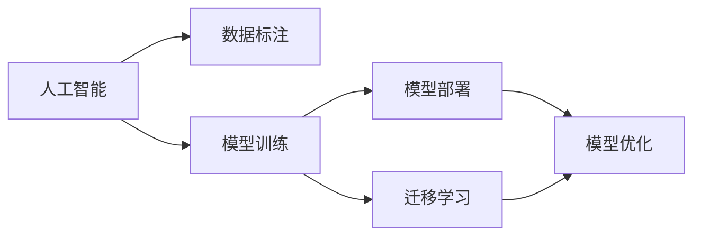

                 

# 降低成本vs提高性能:AI产品开发的两难选择

## 1. 背景介绍

在当前人工智能（AI）技术日益成熟、应用范围不断拓展的背景下，企业对AI产品的需求愈发强烈。然而，AI产品开发面临着降低成本和提高性能的双重挑战。降低成本可以提升经济效益，提高性能则可以提升用户体验。如何在这两者之间寻找最优解，成为企业AI产品开发的一大难题。

### 1.1 问题由来

随着AI技术的发展，越来越多的企业希望通过AI技术提升业务效率、优化客户体验。但与此同时，AI产品开发和部署的成本也随之增加。一方面，高质量的AI模型需要大量的数据进行训练，而高质量数据往往需要昂贵的标注费用。另一方面，AI模型的开发、部署和维护也需要较高的技术门槛和人力成本。这就导致了企业在AI产品开发中面临成本高、效率低的问题。

此外，AI产品的性能也是一个重要指标。性能不足的AI产品无法满足用户需求，甚至可能导致用户体验下降，进而影响企业的市场竞争力。性能不足可能源于模型复杂度、训练数据量、超参数设置等方面问题，需要大量的时间和资源进行优化。

### 1.2 问题核心关键点

AI产品开发中，降低成本和提高性能之间的矛盾主要体现在以下几个方面：

- **数据成本**：高质量的数据标注费用昂贵，尤其是在需要大规模标注数据的场景下。
- **模型复杂度**：复杂的模型需要更多的训练数据和时间才能收敛，导致开发成本和开发周期增加。
- **计算资源**：AI模型训练和推理需要强大的计算资源，尤其是深度神经网络模型，其计算复杂度高，对硬件要求严格。
- **技术门槛**：AI产品开发需要高度专业化的技术团队，这增加了企业的技术成本。
- **性能瓶颈**：低性能的AI产品无法提供高质量的用户体验，可能难以获得市场认可。

以上问题点要求企业在AI产品开发过程中，需要在成本、时间和资源等各方面进行权衡和优化，找到最优解。

## 2. 核心概念与联系

### 2.1 核心概念概述

要解决上述问题，需要对以下核心概念有清晰的理解和联系：

- **人工智能（AI）**：利用计算机算法和模型，使机器具有类似人类的智能行为，如语音识别、图像识别、自然语言处理等。
- **数据标注**：将原始数据进行标注，使其具有训练和推理所需的形式，如分类、回归、序列标注等。
- **模型训练**：通过大量数据训练AI模型，使其能够从输入数据中学习到知识，从而进行推理预测。
- **模型部署**：将训练好的模型部署到实际应用环境中，提供服务或API接口，供外部使用。
- **模型优化**：通过调整模型参数、改进算法等方法，提升模型的性能和效率。
- **迁移学习**：利用已有模型的知识，通过微调或迁移学习的方式，在新任务上快速获得更好的性能。

这些概念之间存在紧密联系，如图示：



这些概念共同构成了AI产品开发的完整流程，需要在降低成本和提高性能之间寻找平衡。

## 3. 核心算法原理 & 具体操作步骤
### 3.1 算法原理概述

在AI产品开发中，降低成本和提高性能是一对矛盾。一方面，需要尽可能降低数据标注成本，另一方面需要提高模型性能。如何在这两者之间找到最优解，是AI产品开发的关键问题。

### 3.2 算法步骤详解

#### 3.2.1 数据收集与标注

数据是AI产品开发的基础，数据的收集和标注是降低成本和提高性能的关键环节。以下是具体步骤：

1. **数据收集**：收集与目标任务相关的数据，可以通过公开数据集、爬取网络数据、用户数据等方式获取。数据收集成本取决于数据来源和规模。
2. **数据标注**：对收集到的数据进行标注，标注费用较高，尤其是需要大量标注的任务。可以通过众包平台、自建标注团队等方式进行数据标注。

#### 3.2.2 模型选择与训练

选择合适的模型是降低成本和提高性能的另一个关键点。以下是具体步骤：

1. **模型选择**：根据任务需求选择合适的模型，如基于卷积神经网络的图像识别、基于循环神经网络的自然语言处理等。模型复杂度越高，性能越好，但开发和训练成本也越高。
2. **模型训练**：在选定的模型基础上进行训练，一般需要大量数据和计算资源。可以通过分布式训练、模型压缩等技术优化训练过程。

#### 3.2.3 模型优化与评估

模型优化和评估是提升性能和降低成本的重要步骤。以下是具体步骤：

1. **模型优化**：通过调整模型参数、改进算法等方法，提升模型的性能和效率。常见的方法包括梯度下降、正则化、Dropout等。
2. **模型评估**：对训练好的模型进行评估，衡量其性能和效果。常见的评估指标包括准确率、召回率、F1分数等。

#### 3.2.4 迁移学习与微调

迁移学习是降低成本和提高性能的有效方法。以下是具体步骤：

1. **预训练模型**：使用预训练的模型作为初始化参数，可以减少数据标注量和训练时间。
2. **微调**：在预训练模型的基础上，针对特定任务进行微调，进一步提升性能。

### 3.3 算法优缺点

#### 3.3.1 优点

1. **降低成本**：通过迁移学习和预训练，可以减少数据标注量和计算资源，降低开发成本。
2. **提升性能**：预训练模型已经学习到通用的知识，通过微调可以快速提升模型性能。
3. **提高效率**：迁移学习可以减少训练时间和开发周期，快速上线。

#### 3.3.2 缺点

1. **泛化能力不足**：预训练模型和微调模型可能无法很好地适应特定任务，性能提升有限。
2. **模型复杂度较高**：复杂模型需要更多的计算资源和训练时间，增加成本。
3. **数据依赖性强**：需要高质量的数据进行训练，数据获取成本高。

## 4. 数学模型和公式 & 详细讲解 & 举例说明

### 4.1 数学模型构建

在AI产品开发中，常用的数学模型包括线性回归、逻辑回归、神经网络等。以神经网络为例，模型构建步骤如下：

1. **输入层**：输入数据，如图像像素、文本单词等。
2. **隐藏层**：神经网络的核心层，通过权重矩阵和激活函数进行特征提取和映射。
3. **输出层**：根据任务需求，输出分类、回归等结果。

### 4.2 公式推导过程

以神经网络的反向传播算法为例，公式推导过程如下：

1. **前向传播**：计算模型输出，公式为：
   $$
   y = f(Wx + b)
   $$
   其中，$W$为权重矩阵，$x$为输入向量，$b$为偏置项，$f$为激活函数。

2. **计算损失函数**：根据任务需求，计算模型输出与真实标签之间的差异，如均方误差、交叉熵等。

3. **反向传播**：计算损失函数对权重和偏置的梯度，公式为：
   $$
   \frac{\partial \mathcal{L}}{\partial W}, \frac{\partial \mathcal{L}}{\partial b}
   $$
   通过链式法则，反向传播算法可以高效计算梯度，更新模型参数。

### 4.3 案例分析与讲解

以图像识别为例，模型构建过程如下：

1. **数据准备**：收集大量图像数据，并进行标注。
2. **预训练模型**：使用预训练的模型（如ResNet、VGG等）作为初始化参数。
3. **微调**：在预训练模型的基础上，针对特定任务进行微调。
4. **模型优化**：通过调整超参数、改进算法等方法，提升模型性能。

## 5. 项目实践：代码实例和详细解释说明

### 5.1 开发环境搭建

以下是使用Python进行PyTorch开发的环境配置流程：

1. 安装Anaconda：从官网下载并安装Anaconda，用于创建独立的Python环境。
2. 创建并激活虚拟环境：
   ```bash
   conda create -n pytorch-env python=3.8 
   conda activate pytorch-env
   ```
3. 安装PyTorch：根据CUDA版本，从官网获取对应的安装命令。例如：
   ```bash
   conda install pytorch torchvision torchaudio cudatoolkit=11.1 -c pytorch -c conda-forge
   ```
4. 安装Transformers库：
   ```bash
   pip install transformers
   ```
5. 安装各类工具包：
   ```bash
   pip install numpy pandas scikit-learn matplotlib tqdm jupyter notebook ipython
   ```

完成上述步骤后，即可在`pytorch-env`环境中开始开发。

### 5.2 源代码详细实现

以图像识别任务为例，使用PyTorch和Transformer库进行开发：

```python
import torch
import torch.nn as nn
import torchvision.transforms as transforms
from torchvision import datasets, models

# 定义数据预处理
transform = transforms.Compose([
    transforms.Resize(256),
    transforms.CenterCrop(224),
    transforms.ToTensor(),
    transforms.Normalize(mean=[0.485, 0.456, 0.406], std=[0.229, 0.224, 0.225])
])

# 加载数据集
train_dataset = datasets.ImageFolder(root='data/train', transform=transform)
test_dataset = datasets.ImageFolder(root='data/test', transform=transform)
val_dataset = datasets.ImageFolder(root='data/val', transform=transform)

# 定义数据加载器
train_loader = torch.utils.data.DataLoader(train_dataset, batch_size=32, shuffle=True)
test_loader = torch.utils.data.DataLoader(test_dataset, batch_size=32, shuffle=False)
val_loader = torch.utils.data.DataLoader(val_dataset, batch_size=32, shuffle=False)

# 定义模型
model = models.resnet50(pretrained=True)
num_ftrs = model.fc.in_features
model.fc = nn.Linear(num_ftrs, num_classes)

# 定义损失函数和优化器
criterion = nn.CrossEntropyLoss()
optimizer = torch.optim.SGD(model.parameters(), lr=0.001, momentum=0.9)

# 训练过程
for epoch in range(num_epochs):
    for i, (inputs, labels) in enumerate(train_loader):
        inputs, labels = inputs.to(device), labels.to(device)
        optimizer.zero_grad()
        outputs = model(inputs)
        loss = criterion(outputs, labels)
        loss.backward()
        optimizer.step()
```

### 5.3 代码解读与分析

1. **数据预处理**：使用`transforms`模块进行图像预处理，包括调整大小、中心裁剪、归一化等操作，以便模型能够更好地处理数据。
2. **数据加载器**：使用`DataLoader`对数据集进行批次化加载，供模型训练和推理使用。
3. **模型定义**：使用`resnet50`预训练模型，并在顶层添加全连接层，输出分类结果。
4. **损失函数和优化器**：使用交叉熵损失函数和随机梯度下降（SGD）优化器，进行模型训练。

## 6. 实际应用场景

### 6.1 医疗影像分析

在医疗影像分析领域，AI产品需要快速、准确地识别和分析医学影像，如X光片、CT扫描等。AI产品可以显著提高诊断效率，减少误诊和漏诊。

具体实现如下：

1. **数据收集**：收集大量医学影像数据，并进行标注。
2. **模型选择与训练**：选择基于卷积神经网络的模型，如ResNet、VGG等，进行预训练和微调。
3. **模型优化与评估**：通过调整超参数、改进算法等方法，提升模型性能。

### 6.2 金融风险评估

金融风险评估是金融机构的重要应用场景，AI产品可以帮助快速、准确地评估信用风险、市场风险等。AI产品可以显著降低金融机构的风险评估成本，提高决策效率。

具体实现如下：

1. **数据收集**：收集金融市场数据、信用评分数据等，并进行标注。
2. **模型选择与训练**：选择基于神经网络的模型，如RNN、LSTM等，进行预训练和微调。
3. **模型优化与评估**：通过调整超参数、改进算法等方法，提升模型性能。

### 6.3 智能客服系统

智能客服系统可以大幅提高客户服务效率，降低人工成本。AI产品可以通过分析客户历史对话数据，提供个性化服务，提升客户满意度。

具体实现如下：

1. **数据收集**：收集客户历史对话数据，并进行标注。
2. **模型选择与训练**：选择基于循环神经网络的模型，如LSTM、GRU等，进行预训练和微调。
3. **模型优化与评估**：通过调整超参数、改进算法等方法，提升模型性能。

## 7. 工具和资源推荐

### 7.1 学习资源推荐

为了帮助开发者系统掌握AI产品开发的技术基础和实践技巧，这里推荐一些优质的学习资源：

1. 《深度学习》系列书籍：由吴恩达、Ian Goodfellow等人撰写，深入浅出地介绍了深度学习的基本概念和算法。
2. 《TensorFlow实战》书籍：由Google TensorFlow团队撰写，详细介绍了TensorFlow框架的使用方法和实践技巧。
3. 《PyTorch官方文档》：PyTorch官方提供的详细文档，包含丰富的示例代码和使用方法。
4. Coursera、Udacity等在线课程平台：提供各种深度学习相关课程，包括理论基础、实践应用等。
5. Kaggle竞赛：通过参与Kaggle竞赛，可以积累实践经验，提升技术水平。

### 7.2 开发工具推荐

高效的开发离不开优秀的工具支持。以下是几款用于AI产品开发的常用工具：

1. Jupyter Notebook：开源的交互式笔记本，适合进行数据分析、模型训练等。
2. PyTorch：基于Python的开源深度学习框架，灵活高效的计算图，适合快速迭代研究。
3. TensorFlow：由Google主导开发的开源深度学习框架，生产部署方便，适合大规模工程应用。
4. Keras：基于TensorFlow和Theano的高层API，简单易用，适合初学者入门。
5. Scikit-learn：开源的机器学习库，提供各种机器学习算法和工具。
6. Numpy：开源的科学计算库，提供高效的数组操作和数学运算功能。

### 7.3 相关论文推荐

AI产品开发领域的研究成果众多，以下是几篇具有代表性的论文，推荐阅读：

1. "ImageNet Classification with Deep Convolutional Neural Networks"：AlexNet论文，提出了基于卷积神经网络的图像识别方法，是深度学习领域的经典之作。
2. "Very Deep Convolutional Networks for Large-Scale Image Recognition"：Google Inception论文，提出了Inception模块，提升了深度神经网络的计算效率和性能。
3. "Convolutional Neural Networks for Sentence Classification"：TextCNN论文，提出了基于卷积神经网络的文本分类方法，提升了自然语言处理模型的性能。
4. "Fine-Tuning BERT for Task-Agnostic Language Understanding"：使用BERT模型进行微调的论文，展示了BERT模型在各种NLP任务上的强大性能。
5. "Adaptive Layerwise Transfer Learning with Adaptive Attention"：提出了基于适应性注意力机制的微调方法，提高了微调模型的泛化能力和鲁棒性。

## 8. 总结：未来发展趋势与挑战

### 8.1 总结

本文对AI产品开发中降低成本和提高性能之间的矛盾进行了全面系统的介绍。首先阐述了AI产品开发的基本流程和关键技术，明确了在开发过程中降低成本和提高性能的重要性。其次，从原理到实践，详细讲解了数据标注、模型选择、模型训练等关键环节的实现细节，给出了具体的代码示例。同时，本文还广泛探讨了AI产品在医疗影像分析、金融风险评估、智能客服系统等多个领域的应用前景，展示了AI产品开发的多样性和广泛性。此外，本文精选了AI产品开发的各类学习资源和工具，力求为读者提供全方位的技术指引。

通过本文的系统梳理，可以看到，AI产品开发是一项复杂而系统的工程任务，需要在降低成本和提高性能之间进行全面优化。未来，AI产品开发将继续面临诸多挑战，但同时也充满了无限机遇。相信通过技术创新和工程实践的不断进步，AI产品开发将更加高效、灵活、可靠，为各行各业带来更多变革性影响。

### 8.2 未来发展趋势

展望未来，AI产品开发将呈现以下几个发展趋势：

1. **自动化和自动化优化**：AI产品开发过程中，自动化和自动化优化将成为主流。自动标注、自动超参数优化等技术将大大降低人工成本，提高开发效率。
2. **模型压缩与量化**：为了降低计算资源消耗，模型压缩和量化技术将广泛应用。如剪枝、量化、知识蒸馏等技术，可以在保证性能的前提下，显著降低计算成本。
3. **分布式计算**：大规模AI产品开发需要强大的计算资源，分布式计算技术将进一步提升计算效率，降低资源消耗。
4. **跨领域融合**：AI产品开发将与更多领域的技术进行融合，如知识图谱、区块链、物联网等，拓展AI应用场景。
5. **低成本部署**：AI产品开发将逐步实现低成本部署，通过云服务、边缘计算等技术，降低开发和维护成本。

### 8.3 面临的挑战

尽管AI产品开发取得了显著进展，但在迈向更加智能化、普适化应用的过程中，仍面临诸多挑战：

1. **数据获取成本高**：高质量的数据标注费用昂贵，尤其是需要大规模标注数据的场景下，获取成本高。
2. **模型计算资源消耗大**：大规模深度神经网络模型的计算资源消耗大，对硬件要求严格，难以实现低成本部署。
3. **技术门槛高**：AI产品开发需要高度专业化的技术团队，这增加了企业的技术成本。
4. **模型泛化能力不足**：预训练模型和微调模型可能无法很好地适应特定任务，性能提升有限。
5. **模型鲁棒性不足**：模型面对域外数据时，泛化性能往往大打折扣。对于测试样本的微小扰动，模型容易发生波动。

### 8.4 研究展望

未来的AI产品开发研究需要在以下几个方面寻求新的突破：

1. **无监督和半监督学习**：摆脱对大规模标注数据的依赖，利用自监督学习、主动学习等无监督和半监督范式，最大限度利用非结构化数据，实现更加灵活高效的AI产品开发。
2. **模型压缩与量化**：开发更加参数高效和计算高效的AI产品，如剪枝、量化、知识蒸馏等技术，在保证性能的前提下，显著降低计算成本。
3. **跨领域融合**：将符号化的先验知识，如知识图谱、逻辑规则等，与神经网络模型进行巧妙融合，引导AI产品开发过程学习更准确、合理的知识表示。
4. **分布式计算**：通过分布式计算技术，提升大规模AI产品开发的速度和效率，降低资源消耗。
5. **模型鲁棒性提升**：引入对抗训练、模型蒸馏等技术，提升AI产品的鲁棒性和泛化能力。

这些研究方向的探索，将引领AI产品开发技术迈向更高的台阶，为构建安全、可靠、可解释、可控的AI产品铺平道路。面向未来，AI产品开发需要不断创新和突破，才能真正实现人工智能技术的广泛应用。

## 9. 附录：常见问题与解答

**Q1：如何选择合适的模型？**

A: 选择模型需要考虑以下几个因素：
1. **任务需求**：根据任务需求选择合适的模型，如基于卷积神经网络的图像识别、基于循环神经网络的自然语言处理等。
2. **数据规模**：数据规模越大，选择越复杂的模型效果越好。
3. **计算资源**：计算资源越丰富，选择越复杂的模型效果越好。

**Q2：如何降低数据标注成本？**

A: 降低数据标注成本可以通过以下方法：
1. **利用众包平台**：通过众包平台进行数据标注，降低标注费用。
2. **自建标注团队**：建立自己的标注团队，控制成本。
3. **半监督学习**：利用已有数据进行半监督学习，减少标注需求。
4. **无监督学习**：利用无监督学习算法进行数据标注，降低标注成本。

**Q3：如何优化模型性能？**

A: 优化模型性能可以通过以下方法：
1. **调整超参数**：通过调整超参数，如学习率、批量大小等，优化模型性能。
2. **改进算法**：通过改进算法，如梯度下降、正则化等，优化模型性能。
3. **数据增强**：通过数据增强技术，如旋转、平移等，提升模型泛化能力。
4. **模型压缩与量化**：通过剪枝、量化等技术，降低计算成本。

**Q4：如何进行模型部署？**

A: 模型部署可以通过以下步骤：
1. **模型训练**：在开发环境中进行模型训练。
2. **模型保存**：将训练好的模型保存为模型文件。
3. **模型部署**：将模型文件部署到目标环境中，提供服务或API接口，供外部使用。
4. **模型优化**：在部署环境中进行模型优化，如性能调优、部署优化等。

---

作者：禅与计算机程序设计艺术 / Zen and the Art of Computer Programming

