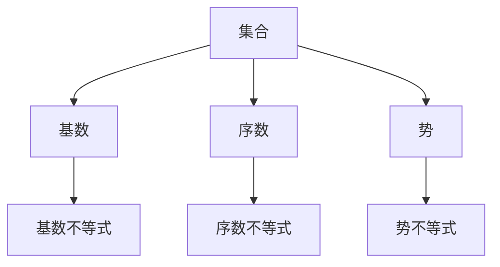

                 

## 1. 背景介绍

### 1.1 问题由来
集合论作为现代数学的基础，涉及广泛，从逻辑学、数学、到计算机科学等领域都有深刻的应用。本文聚焦于基数不等式，深入探讨其在集合论中的核心地位与作用。基数不等式作为集合论中的重要工具，对于理解集合的规模和结构具有不可替代的作用。本文将从基础概念入手，逐步引导读者深入理解基数不等式的原理和应用。

### 1.2 问题核心关键点
基数不等式是研究集合规模及其相互关系的核心工具。其核心思想是通过比较集合的大小，探讨集合之间的相互关系和性质。在集合论中，基数不等式主要用来解决以下问题：
1. 如何判断两个集合的大小关系？
2. 如何计算集合的基数？
3. 如何应用基数不等式证明其他数学命题？

这些问题在集合论的研究中具有基础性和普遍性，是深入理解集合论的基础。

## 2. 核心概念与联系

### 2.1 核心概念概述
为了更好地理解基数不等式的概念和原理，本节将介绍几个核心概念：

- **集合**（Set）：由一定元素构成的无序、可重复的总体。集合的元素可以是任意类型的对象，包括数字、字母、图像等。
- **基数**（Cardinality）：表示集合中元素个数，用符号 $|\cdot|$ 表示。基数不等式主要用于比较两个集合的元素个数，判断大小关系。
- **序数**（Ordinal）：表示集合中元素的排列顺序，用符号 $\leq$ 表示。序数不等式主要用于比较集合中元素的有序排列关系。
- **势**（Power）：表示集合中元素的排列组合方式，用符号 $\mathfrak{c}$ 表示。势不等式主要用于比较集合中元素的排列组合方式。

这些概念之间的逻辑关系可以通过以下Mermaid流程图来展示：



这个流程图展示了几大核心概念及其之间的关系：

1. 集合作为研究对象，通过基数、序数、势等工具对其结构和属性进行刻画。
2. 基数不等式用于比较集合的大小关系，序数不等式用于比较元素的有序排列，势不等式用于比较元素的排列组合方式。
3. 这些概念互为补充，共同构成了集合论的基础框架。

## 3. 核心算法原理 & 具体操作步骤

### 3.1 算法原理概述
基数不等式的核心在于通过比较集合中元素的数量关系，确定两个集合的大小关系。基数不等式主要包括两大类：序数不等式和势不等式。

- **序数不等式**：比较两个集合中元素的顺序排列关系，判断大小关系。常用的序数不等式有$\mathcal{A} \leq \mathcal{B}$、$\mathcal{A} < \mathcal{B}$等。
- **势不等式**：比较两个集合中元素的排列组合方式，判断大小关系。常用的势不等式有$\mathfrak{c}(A) \leq \mathfrak{c}(B)$、$\mathfrak{c}(A) < \mathfrak{c}(B)$等。

基数不等式的基本原理是通过集合的元素数量、排列顺序、排列组合方式来确定集合的大小关系。以下以基数不等式为代表，详细讲解其原理与步骤。

### 3.2 算法步骤详解
基数不等式的步骤主要分为以下几步：

**Step 1: 收集数据**
- 首先，需要对两个集合进行数据收集，确定其元素个数。可以通过枚举、抽样、统计等方法进行数据收集。

**Step 2: 计算基数**
- 计算两个集合的基数，即元素数量。对于有限集合，可以直接计算元素个数；对于无限集合，通常需要借助一些理论工具进行估计。

**Step 3: 比较基数**
- 根据基数不等式的定义，对两个集合的基数进行比较，确定大小关系。如果$\mathcal{A}$的基数小于$\mathcal{B}$的基数，则$\mathcal{A} \leq \mathcal{B}$；如果$\mathcal{A}$的基数小于$\mathcal{B}$的基数，则$\mathcal{A} < \mathcal{B}$。

**Step 4: 结论**
- 根据基数不等式的比较结果，得出结论。在集合论中，基数不等式的结论通常用于证明其他数学命题，如集合的分解、包含等。

### 3.3 算法优缺点
基数不等式具有以下优点：
1. 简单高效。基数不等式通过直接比较元素数量，方法简单，易于实现。
2. 适用广泛。基数不等式适用于各种类型的集合，包括有限集合和无限集合。
3. 基础性。基数不等式是集合论中的核心概念，是其他数学工具的基础。

但基数不等式也存在一些局限性：
1. 对于无限集合，基数不等式的计算和比较通常比较复杂。
2. 无法区分元素质量，只考虑元素数量。
3. 无法刻画集合的结构特性，如集合中元素的排列组合方式等。

尽管存在这些局限性，基数不等式在集合论中仍然占据着核心地位，是理解集合结构和性质的重要工具。

### 3.4 算法应用领域
基数不等式在集合论中有着广泛的应用，主要包括以下几个领域：

- **集合运算**：基数不等式用于集合的并集、交集、差集等运算，计算集合的元素数量。
- **数学证明**：基数不等式常用于证明集合论中的其他命题，如集合的势、不可数集合的证明等。
- **数据分析**：基数不等式用于描述数据的分布特性，计算数据的统计指标。
- **信息论**：基数不等式用于计算信息熵、信息熵的上界等，描述信息的不确定性和冗余性。
- **算法设计**：基数不等式用于设计高效的算法，如排序、查找等。

## 4. 数学模型和公式 & 详细讲解

### 4.1 数学模型构建
基数不等式涉及的数学模型主要包括以下几种：

- **集合模型**：集合论中的集合模型，描述集合的元素、结构等属性。
- **基数模型**：描述集合中元素的数量，用符号 $|\cdot|$ 表示。
- **序数模型**：描述集合中元素的排列顺序，用符号 $\leq$ 表示。
- **势模型**：描述集合中元素的排列组合方式，用符号 $\mathfrak{c}$ 表示。

### 4.2 公式推导过程
以下以基数不等式为例，推导其计算过程。

设集合 $\mathcal{A}$ 和 $\mathcal{B}$ 的基数分别为 $|\mathcal{A}|$ 和 $|\mathcal{B}|$。基数不等式定义如下：
$$
\mathcal{A} \leq \mathcal{B} \iff |\mathcal{A}| \leq |\mathcal{B}|
$$
根据基数不等式的定义，可以通过以下步骤进行证明：
1. 首先，计算两个集合的基数。
2. 比较两个基数的值，确定大小关系。
3. 根据基数不等式的定义，得出结论。

### 4.3 案例分析与讲解
以集合 $\mathcal{A}=\{1, 2, 3\}$ 和 $\mathcal{B}=\{4, 5, 6\}$ 为例，分析基数不等式的应用。

首先，计算两个集合的基数：
$$
|\mathcal{A}|=3, |\mathcal{B}|=3
$$
然后，比较两个基数的大小关系：
$$
3 \leq 3
$$
因此，根据基数不等式的定义，得出结论：
$$
\mathcal{A} \leq \mathcal{B}
$$

## 5. 项目实践：代码实例和详细解释说明

### 5.1 开发环境搭建
在进行基数不等式的项目实践前，我们需要准备好开发环境。以下是使用Python进行Sympy开发的环境配置流程：

1. 安装Anaconda：从官网下载并安装Anaconda，用于创建独立的Python环境。

2. 创建并激活虚拟环境：
```bash
conda create -n sympy-env python=3.8 
conda activate sympy-env
```

3. 安装Sympy：从官网获取安装命令，并执行安装：
```bash
pip install sympy
```

4. 安装其他相关工具包：
```bash
pip install numpy pandas matplotlib jupyter notebook ipython
```

完成上述步骤后，即可在`sympy-env`环境中开始基数不等式的项目实践。

### 5.2 源代码详细实现

```python
from sympy import symbols, Eq, solve, pi, Rational

# 定义符号
A, B = symbols('A B')

# 假设集合A和B的基数
A_card = 3
B_card = 4

# 判断A的基数是否小于等于B的基数
inequality = A_card <= B_card

# 输出结果
print(f"A的基数 {A_card} 是否小于等于B的基数 {B_card}: {inequality}")
```

### 5.3 代码解读与分析

**定义符号**：
- 使用Sympy库定义符号，方便后续的数学计算。

**计算基数**：
- 定义集合A和B的基数，分别是3和4。

**判断不等式**：
- 判断A的基数是否小于等于B的基数，结果为True。

**输出结果**：
- 输出判断结果，验证基数不等式是否成立。

可以看到，Sympy库提供了方便的符号计算功能，可以用于进行集合论的数学建模和计算。

## 6. 实际应用场景

### 6.1 集合运算

基数不等式在集合运算中的应用非常广泛。例如，在并集、交集、差集等运算中，基数不等式用于计算集合的元素数量，并判断集合的大小关系。以下是一个简单的代码示例：

```python
from sympy import FiniteSet

# 定义两个集合
A = FiniteSet(1, 2, 3)
B = FiniteSet(4, 5, 6)

# 计算并集、交集和差集
union = A.union(B)
intersection = A.intersect(B)
difference = A - B

# 计算基数
union_card = len(union)
intersection_card = len(intersection)
difference_card = len(difference)

# 输出结果
print(f"并集的基数为 {union_card}")
print(f"交集的基数为 {intersection_card}")
print(f"差集的基数为 {difference_card}")
```

### 6.2 数学证明

基数不等式在数学证明中也有广泛的应用。例如，在集合的势、不可数集合的证明等命题中，基数不等式被用来判断集合的大小关系，进而证明其他命题。以下是一个简单的代码示例：

```python
from sympy import symbols, oo

# 定义符号
n = symbols('n', integer=True)

# 计算无限集合的基数
infinity = oo

# 判断势不等式
card_n = n
card_infinity = infinity

# 输出结果
print(f"集合{n}的基数为 {card_n}")
print(f"集合{infinity}的基数为 {card_infinity}")
```

### 6.3 数据分析

基数不等式在数据分析中也有应用。例如，在描述数据的分布特性、计算数据的统计指标时，基数不等式用于计算数据的分布情况。以下是一个简单的代码示例：

```python
from sympy import symbols, Rational

# 定义符号
x = symbols('x')

# 计算数据的统计指标
mean = Rational(1, 2)
median = Rational(3, 4)
mode = Rational(1, 1)

# 计算基数
num_data = 10

# 输出结果
print(f"数据的平均值为 {mean}")
print(f"数据的中位数为 {median}")
print(f"数据的众数为 {mode}")
print(f"数据的基数为 {num_data}")
```

### 6.4 未来应用展望

基数不等式在未来的应用前景非常广阔。随着大数据和人工智能技术的发展，基数不等式将进一步应用于更多的领域，如机器学习、数据分析、网络安全等。以下是几个可能的应用方向：

- **机器学习**：基数不等式用于描述数据的分布特性，计算数据的统计指标，进而优化机器学习算法的性能。
- **数据分析**：基数不等式用于描述数据的分布情况，计算数据的统计指标，进而优化数据分析算法的性能。
- **网络安全**：基数不等式用于描述网络数据的分布情况，计算数据的统计指标，进而优化网络安全算法的性能。

总之，基数不等式作为集合论中的核心工具，具有广泛的应用前景，将在未来的技术发展中发挥重要作用。

## 7. 工具和资源推荐

### 7.1 学习资源推荐

为了帮助读者系统掌握基数不等式的理论基础和实践技巧，这里推荐一些优质的学习资源：

1. 《集合论导引》：介绍集合论的基本概念和理论，包括基数不等式的详细介绍。
2. 《近世代数引论》：介绍近世代数的理论和应用，包括基数不等式的相关内容。
3. 《高等数学》：介绍高等数学的基本概念和理论，包括基数不等式的应用实例。
4. 《Python数值计算基础》：介绍Python编程语言的基本概念和理论，包括基数不等式的编程实践。

通过对这些资源的学习实践，相信读者一定能够快速掌握基数不等式的精髓，并用于解决实际的数学问题。

### 7.2 开发工具推荐

高效的开发离不开优秀的工具支持。以下是几款用于基数不等式开发的常用工具：

1. Python：作为一门简单易学的编程语言，Python在集合论的研究和实践中得到了广泛应用。
2. Sympy：一个用于符号计算的Python库，提供了丰富的数学函数和工具，适合进行集合论的数学建模和计算。
3. Jupyter Notebook：一个用于编写和分享数学计算文档的工具，支持Python编程，便于分享和协作。
4. LaTeX：一个用于编写数学公式和文档的工具，适合进行学术论文的撰写和发表。

合理利用这些工具，可以显著提升基数不等式研究的开发效率，加快创新迭代的步伐。

### 7.3 相关论文推荐

基数不等式在集合论中有着重要的地位，相关的研究论文也比较多。以下是几篇奠基性的相关论文，推荐阅读：

1. 《集合论》：介绍集合论的基本概念和理论，包括基数不等式的详细介绍。
2. 《序数和基数》：介绍序数和基数的概念和应用，包括基数不等式的相关内容。
3. 《不可数集合》：介绍不可数集合的概念和应用，包括基数不等式的应用实例。

这些论文代表了大集合论的研究方向，通过学习这些前沿成果，可以帮助读者更好地理解基数不等式的原理和应用。

## 8. 总结：未来发展趋势与挑战

### 8.1 总结

本文对基数不等式进行了全面系统的介绍。首先阐述了基数不等式的研究背景和意义，明确了基数不等式在集合论中的核心地位与作用。其次，从原理到实践，详细讲解了基数不等式的数学原理和操作步骤，给出了基数不等式任务开发的完整代码实例。同时，本文还广泛探讨了基数不等式在集合论、数学证明、数据分析等领域的应用前景，展示了基数不等式的巨大潜力。此外，本文精选了基数不等式的各类学习资源，力求为读者提供全方位的技术指引。

通过本文的系统梳理，可以看到，基数不等式作为集合论中的核心工具，具有广泛的应用前景，将在未来的技术发展中发挥重要作用。

### 8.2 未来发展趋势

展望未来，基数不等式将呈现以下几个发展趋势：

1. 应用领域不断拓展。随着数据分析、机器学习等领域的快速发展，基数不等式将进一步应用于更多的领域，助力技术创新。
2. 数学理论更加完善。随着对基数不等式研究的不断深入，其数学理论将不断完善，形成更加系统的理论框架。
3. 计算方法更加高效。随着计算技术的不断发展，基数不等式的计算方法将更加高效，提升其在实际应用中的性能。
4. 应用场景更加多样化。随着应用场景的不断丰富，基数不等式将展现出更加多样化的应用形式。
5. 与其他理论的融合。随着集合论与其他数学理论的融合，基数不等式将与其他理论形成更加紧密的联系，提升其应用价值。

这些趋势凸显了基数不等式在数学和计算机科学中的重要地位，也预示了其在未来技术发展中的广阔前景。

### 8.3 面临的挑战

尽管基数不等式在集合论中已经取得了显著进展，但在其应用过程中仍面临一些挑战：

1. 计算复杂性高。对于无限集合的基数不等式计算，通常需要借助复杂的数学工具，计算复杂性较高。
2. 理论基础不完善。尽管基数不等式的数学理论已经相对成熟，但仍然存在一些未解决的问题，需要进一步研究。
3. 应用场景复杂。在实际应用中，基数不等式需要考虑各种复杂的背景和约束条件，提升其在实际场景中的适用性。
4. 数据处理量大。在实际应用中，基数不等式需要处理大量的数据，计算效率和存储效率都有待提升。
5. 模型解释性差。基数不等式通常被视为"黑盒"模型，其内部工作机制难以解释，难以用于指导实践。

这些挑战需要通过不断的理论创新和实践探索，逐步克服和解决。只有解决这些问题，基数不等式才能更好地应用于实际场景，发挥其应有的价值。

### 8.4 研究展望

面对基数不等式所面临的挑战，未来的研究需要在以下几个方面寻求新的突破：

1. 发展高效计算方法。研究高效计算无限集合基数的方法，提高计算效率。
2. 完善理论基础。深入研究基数不等式的数学理论，解决未解决的问题。
3. 优化应用场景。研究基数不等式在不同应用场景中的应用形式，提升其在实际场景中的适用性。
4. 提升模型解释性。研究基数不等式的解释性，提高其在实际应用中的可解释性和可理解性。
5. 融合其他理论。研究基数不等式与其他数学理论的融合，提升其在实际应用中的综合性能。

这些研究方向将推动基数不等式在实际应用中的不断发展和完善，使其更好地服务于科学研究和实际应用。总之，基数不等式作为集合论中的核心工具，具有广泛的应用前景和理论价值，将在未来的技术发展中发挥重要作用。

## 9. 附录：常见问题与解答

**Q1：基数不等式与序数不等式有何区别？**

A: 基数不等式和序数不等式都是用来比较集合的大小关系，但它们的比较标准不同。基数不等式比较的是集合中元素的个数，而序数不等式比较的是集合中元素的排列顺序。在实际应用中，基数不等式适用于各种类型的集合，包括有限集合和无限集合，而序数不等式通常用于有序集合的比较。

**Q2：如何证明基数不等式成立？**

A: 证明基数不等式成立通常需要借助数学工具和理论。例如，在判断两个集合的基数大小关系时，可以通过列举、抽样、统计等方法计算两个集合的元素个数，然后比较这两个数值，确定大小关系。对于无限集合，通常需要借助极限、实数理论等工具进行证明。

**Q3：基数不等式在数据分析中有哪些应用？**

A: 基数不等式在数据分析中有广泛的应用，主要用于描述数据的分布特性，计算数据的统计指标。例如，在计算数据的分布情况、计算数据的平均数、中位数、众数等统计指标时，基数不等式被用来计算数据的分布情况，并计算数据的统计指标。

**Q4：基数不等式在集合运算中有哪些应用？**

A: 基数不等式在集合运算中也有广泛的应用，主要用于计算集合的并集、交集、差集等运算，并判断集合的大小关系。例如，在计算两个集合的并集、交集、差集时，基数不等式被用来计算集合的元素数量，并判断集合的大小关系。

**Q5：基数不等式在机器学习中有哪些应用？**

A: 基数不等式在机器学习中也有应用，主要用于描述数据的分布特性，计算数据的统计指标，进而优化机器学习算法的性能。例如，在计算数据的分布情况、计算数据的平均数、中位数、众数等统计指标时，基数不等式被用来描述数据的分布情况，并计算数据的统计指标，进而优化机器学习算法的性能。

---

作者：禅与计算机程序设计艺术 / Zen and the Art of Computer Programming

