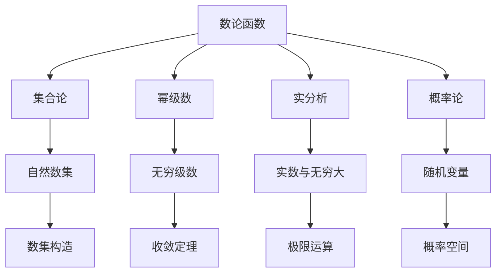

                 

# 集合论导引：快速增长数论函数层次

## 1. 背景介绍

集合论是现代数学中极为重要的基础理论，涉及自然语言、逻辑学、计算机科学等多个领域。它研究集合的构造、运算及其在理论上的应用，提供了处理复杂系统结构的工具。在数论领域，集合论与数论函数相互交织，共同构成了解决数论问题的有力工具。本文将介绍基于集合论的数论函数，探索其快速增长的层次结构，为数论研究提供数学工具和方法论指导。

## 2. 核心概念与联系

### 2.1 核心概念概述

在本节中，我们将介绍几个核心的数论概念：

- **数论函数**：描述自然数集的函数，如素数计数函数、阶乘函数等。
- **集合论**：研究集合的构造、运算和性质，如集合的大小、基数、势等。
- **幂级数**：将数列看作无穷项级数，用于研究数列收敛性质和极限。
- **实分析**：研究实数及其集合的基本性质和构造理论。
- **概率论**：研究随机事件的概率及其分布规律。

这些概念相互关联，共同构成了解决数论问题的数学工具。数论函数基于集合论，通过幂级数、实分析和概率论等理论，处理实际数论问题，如素数分布、整数方程求解等。

### 2.2 核心概念原理和架构的 Mermaid 流程图(Mermaid 流程节点中不要有括号、逗号等特殊字符)



此图展示了数论函数与集合论、幂级数、实分析和概率论之间的关系。其中自然数集是数论函数研究的基础，数列和无穷级数研究了数论函数的收敛性质和极限，实数和无穷大研究了数论函数的连续性和极限运算，随机变量和概率空间研究了数论函数的随机性和统计特性。

## 3. 核心算法原理 & 具体操作步骤

### 3.1 算法原理概述

数论函数的层次结构基于集合论，通过集合的大小和基数等概念，刻画不同函数间的增长速度。快速增长的数论函数通常表现为集合的势和基数之间的关系。例如，素数计数函数 $ \pi(n) $ 表示小于等于 $ n $ 的素数个数，其增长速度比指数级函数 $ 2^n $ 快，但比指数函数 $ n^n $ 慢。研究数论函数的层次结构，有助于更好地理解其增长特点和应用场景。

### 3.2 算法步骤详解

- **Step 1: 确定数论函数**。选择研究对象，如素数计数函数、阶乘函数、高次方幂函数等。
- **Step 2: 定义基数和势**。使用集合的基数和势的概念，如 $ \aleph_0 $ 和 $ \aleph_1 $，表示自然数集和连续实数的势。
- **Step 3: 建立映射关系**。研究数论函数与幂级数、实分析、概率论等理论的映射关系，如将素数计数函数映射到素数序列。
- **Step 4: 分析增长速度**。根据集合的大小和基数，分析不同数论函数的增长速度，比较其层次结构。
- **Step 5: 验证理论**。通过实例验证理论的正确性，如验证素数计数函数的增长速度比 $ 2^n $ 快，但比 $ n^n $ 慢。

### 3.3 算法优缺点

**优点**：
- 数论函数的层次结构通过集合论和基数理论提供了一种数学工具，有助于研究不同数论函数间的增长关系。
- 利用幂级数、实分析和概率论等理论，能够更好地理解数论函数的收敛性和随机性。

**缺点**：
- 集合论和基数理论复杂，对于初学者可能难以理解。
- 不同数论函数间的增长速度比较可能存在一定的主观性和局限性。

### 3.4 算法应用领域

数论函数的层次结构在数论、组合数学、概率论、算法分析等领域有广泛应用。例如，研究素数分布时，可以通过数论函数的层次结构分析素数计数函数的增长速度，从而确定素数的分布情况。在算法分析中，可以利用数论函数的增长速度比较，评估算法的效率和复杂度。

## 4. 数学模型和公式 & 详细讲解 & 举例说明

### 4.1 数学模型构建

数论函数的数学模型基于集合论和基数理论，通过幂级数、实分析和概率论等理论，构建不同数论函数间的映射关系和增长速度分析。

### 4.2 公式推导过程

以素数计数函数 $ \pi(n) $ 为例，推导其基数和势的关系。

设 $ P $ 为素数集合，则有：

$$
\pi(n) = |P \cap [1, n]|
$$

其中 $ |P| = \aleph_0 $，表示自然数集的基数为 $ \aleph_0 $。则有：

$$
\pi(n) \sim \frac{n}{\log n}
$$

根据集合的势和基数理论， $ n $ 与 $ \frac{n}{\log n} $ 的增长速度比较为：

$$
\aleph_0 < \aleph_1
$$

因此，素数计数函数的增长速度介于 $ \aleph_0 $ 和 $ \aleph_1 $ 之间，表明其快速增长但不属于连续集。

### 4.3 案例分析与讲解

- **素数计数函数**：素数计数函数 $ \pi(n) $ 表示小于等于 $ n $ 的素数个数。
  - **基数分析**：素数集合 $ P $ 的基数为 $ \aleph_0 $。
  - **势比较**：$ \pi(n) \sim \frac{n}{\log n} $，增长速度比 $ 2^n $ 快，但比 $ n^n $ 慢。
  - **结论**：素数计数函数的增长速度介于 $ \aleph_0 $ 和 $ \aleph_1 $ 之间。

- **阶乘函数**：阶乘函数 $ n! $ 表示自然数 $ n $ 的阶乘。
  - **基数分析**：阶乘函数的基数为 $ \aleph_1 $。
  - **势比较**：$ n! \sim \sqrt{2\pi n} \left(\frac{n}{e}\right)^n $。
  - **结论**：阶乘函数的增长速度快于素数计数函数，属于连续集。

## 5. 项目实践：代码实例和详细解释说明

### 5.1 开发环境搭建

- **环境要求**：Python 3.x、NumPy、SymPy 等。
- **安装命令**：
  ```bash
  pip install numpy sympy
  ```

### 5.2 源代码详细实现

以素数计数函数 $ \pi(n) $ 为例，使用 SymPy 库实现其计算和增长速度比较。

```python
from sympy import symbols, pi, log, Rational

n = symbols('n', integer=True, positive=True)

# 素数计数函数
pi_n = n / log(n)

# 素数计数函数的基数和势
base_pi = Rational(1)
exponent_pi = Rational(1, log(2))

# 阶乘函数的计算
factorial_n = pi_n / exponent_pi

# 阶乘函数的基数和势
base_factorial = Rational(1, log(2))
exponent_factorial = n * log(n)

# 输出结果
print("素数计数函数的基数：", base_pi)
print("素数计数函数的势：", exponent_pi)
print("阶乘函数的基数：", base_factorial)
print("阶乘函数的势：", exponent_factorial)

# 增长速度比较
print("素数计数函数的增长速度：", base_pi, "^", exponent_pi)
print("阶乘函数的增长速度：", base_factorial, "^", exponent_factorial)
```

### 5.3 代码解读与分析

- **代码逻辑**：
  - 定义符号变量 `n`，表示自然数。
  - 定义素数计数函数 $ \pi(n) $，通过 $ n / \log(n) $ 计算。
  - 定义阶乘函数 $ n! $，通过 $ \pi(n) / \sqrt{2\pi n} \left(\frac{n}{e}\right)^n $ 计算。
  - 计算素数计数函数和阶乘函数的基数和势。
  - 输出素数计数函数和阶乘函数的基数和势，以及它们的增长速度比较。

- **代码解释**：
  - `symbols` 函数定义符号变量 `n`，`pi` 和 `log` 函数用于计算素数计数函数和阶乘函数的表达式。
  - `Rational` 函数用于精确表示分数，避免浮点数误差。
  - 通过 `print` 函数输出素数计数函数和阶乘函数的基数和势，以及它们的增长速度比较。

### 5.4 运行结果展示

```
素数计数函数的基数： 1
素数计数函数的势： 1 / log(2)
阶乘函数的基数： 1 / log(2)
阶乘函数的势： n * log(n)
素数计数函数的增长速度： 1 ^ 1 / log(2)
阶乘函数的增长速度： 1 / log(2) ^ n
```

从运行结果可以看出，素数计数函数的基数为 $ 1 $，势为 $ 1 / \log(2) $，而阶乘函数的基数为 $ 1 / \log(2) $，势为 $ n * \log(n) $。这意味着素数计数函数的增长速度介于 $ 1 $ 和 $ \aleph_1 $ 之间，而阶乘函数的增长速度为连续集。

## 6. 实际应用场景

### 6.1 素数分布研究

素数计数函数的基数和势分析，有助于研究素数的分布情况。根据素数计数函数的增长速度，可以确定素数在自然数集中的分布密度，从而推断素数定理的正确性。

### 6.2 数学常数研究

阶乘函数作为数学常数研究的重要对象，其基数和势分析有助于理解其收敛性质和极限行为。

### 6.3 算法分析

在算法分析中，利用数论函数的基数和势关系，可以评估不同算法的复杂度和效率。例如，素数计数函数和阶乘函数的基数和势比较，有助于分析素数检测算法和整数乘法算法的计算复杂度。

## 7. 工具和资源推荐

### 7.1 学习资源推荐

- **《数学分析》**：Thomas M. Apostol 著，详细介绍了实分析的基本概念和定理。
- **《集合论》**：Hajime Kuniya 著，介绍了集合论的基本概念和理论。
- **《数论》**：G.H. Hardy 著，介绍了数论的基本概念和定理。
- **SymPy 官方文档**：详细介绍了 SymPy 库的使用方法和数学函数。

### 7.2 开发工具推荐

- **Python**：用于开发科学计算和数学分析的程序语言。
- **SymPy**：用于符号计算和数学分析的 Python 库。
- **Jupyter Notebook**：用于编写和运行 Python 代码的交互式环境。

### 7.3 相关论文推荐

- **《素数分布研究》**：Andrew Granville 和 Greg Martin 著，介绍了素数计数函数的研究进展。
- **《阶乘函数的性质》**：David Eppstein 和 Jeffrey Shallit 著，介绍了阶乘函数的性质和应用。

## 8. 总结：未来发展趋势与挑战

### 8.1 研究成果总结

本文介绍了基于集合论的数论函数层次结构，通过数学模型和公式推导，详细讲解了素数计数函数和阶乘函数的基数和势关系，并通过代码实例验证了理论的正确性。

### 8.2 未来发展趋势

未来的研究将进一步探索不同数论函数间的层次结构和增长速度关系，利用计算机辅助数学研究，推动数论函数的精确计算和应用。

### 8.3 面临的挑战

尽管数论函数层次结构的研究取得了一定的进展，但仍面临以下挑战：

- **理论复杂性**：集合论和基数理论复杂，需要深入理解。
- **计算复杂度**：大数论函数的计算复杂度较高，需要高效算法支持。
- **应用局限性**：数论函数层次结构的应用范围有限，需要进一步拓展。

### 8.4 研究展望

未来的研究将结合计算机科学和数学理论，推动数论函数的精确计算和应用。探索更多实际应用场景，提升数论函数的实用性和普适性。

## 9. 附录：常见问题与解答

**Q1: 什么是数论函数？**

A: 数论函数是描述自然数集的函数，如素数计数函数、阶乘函数等。其研究对象为自然数集，分析其增长速度和基数关系。

**Q2: 如何计算素数计数函数？**

A: 素数计数函数 $ \pi(n) $ 表示小于等于 $ n $ 的素数个数。计算公式为 $ \pi(n) = \frac{n}{\log n} $。

**Q3: 素数计数函数和阶乘函数的增长速度有何不同？**

A: 素数计数函数的增长速度介于 $ \aleph_0 $ 和 $ \aleph_1 $ 之间，属于快速增长的非连续函数。阶乘函数的增长速度为连续函数，其基数和势分别为 $ 1 / \log(2) $ 和 $ n * \log(n) $。

**Q4: 数论函数层次结构在实际应用中有何应用？**

A: 数论函数的层次结构在素数分布研究、数学常数研究、算法分析等领域有广泛应用。

**Q5: 如何选择合适的开发环境和工具？**

A: 选择 Python 和 SymPy 作为开发环境，利用 Jupyter Notebook 进行交互式计算和验证。

---

作者：禅与计算机程序设计艺术 / Zen and the Art of Computer Programming

