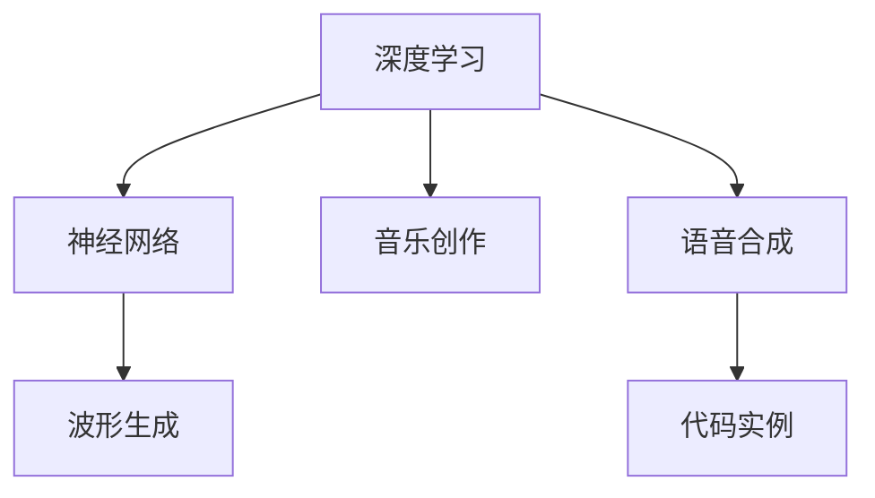
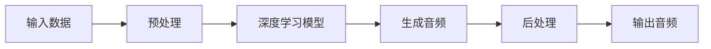

                 

# 音频生成(Audio Generation) - 原理与代码实例讲解

> 关键词：音频生成，深度学习，神经网络，波形生成，音乐创作，语音合成，代码实例，技术原理

## 1. 背景介绍

音频生成，即通过计算机自动生成高质量的音频信号，是当前人工智能领域的热点研究方向之一。与文本生成和图像生成不同，音频生成涉及对时间序列数据的建模，其复杂性和挑战性也更高。音频生成技术的应用范围非常广泛，包括音乐创作、语音合成、视频配音、虚拟角色声音等。

本文将深入探讨音频生成的基本原理，通过详细介绍深度学习模型在音频生成中的应用，帮助读者理解音频生成背后的技术细节，并提供实际代码实例，展示音频生成技术的实践过程。

## 2. 核心概念与联系

### 2.1 核心概念概述

在进行音频生成研究时，以下几个核心概念是不可或缺的：

- **深度学习**：通过多层神经网络实现对复杂数据的建模和预测。音频生成通常利用深度学习模型进行参数估计，如自回归模型、卷积神经网络、生成对抗网络等。
- **神经网络**：一种由大量节点（神经元）组成的计算模型，用于处理非线性数据。
- **波形生成**：将音频信号表示为时间序列数据，并对其进行生成。
- **音乐创作**：利用音频生成技术自动创作音乐作品，包括旋律、和声、节奏等。
- **语音合成**：通过文本到语音的转换，生成自然流畅的语音输出。
- **代码实例**：通过具体的代码实现，展示音频生成模型的搭建、训练和测试过程。

这些概念之间的联系如图1所示：



图1: 音频生成核心概念图

### 2.2 核心概念原理和架构的 Mermaid 流程图

以下是一个简单的音频生成流程图，展示从输入到输出的全过程：



在这个流程图中，输入数据可以是文本、音符、语音等形式，预处理步骤包括分帧、特征提取等，深度学习模型可以采用各种架构，如CNN、RNN、GAN等，生成音频信号，后处理步骤包括波形重构、降噪等，最终输出音频信号。

## 3. 核心算法原理 & 具体操作步骤

### 3.1 算法原理概述

音频生成技术通常基于以下几种模型架构：

- **自回归模型**：如MIDI序列模型，通过自回归的方式，生成音频信号的每个采样值。
- **卷积神经网络**：利用卷积操作提取音频信号的局部特征，适用于音乐节奏和旋律生成。
- **生成对抗网络**：如Wavenet，通过两个对抗的神经网络模型，生成具有高保真度的音频信号。
- **变分自编码器**：如MIDI变分自编码器，用于生成音乐序列，具有较好的连续性和多样性。

### 3.2 算法步骤详解

音频生成模型的训练通常分为以下几个步骤：

1. **数据预处理**：将输入数据（如文本、音符）转化为模型所需的格式。对于音频生成，通常需要将音频信号分帧、提取特征等。
2. **模型搭建**：选择合适的深度学习模型架构，并定义损失函数和优化器。
3. **模型训练**：使用训练集数据对模型进行训练，通过反向传播更新模型参数。
4. **模型评估**：在验证集和测试集上评估模型性能，调整模型参数。
5. **音频生成**：使用训练好的模型生成新的音频信号。

### 3.3 算法优缺点

音频生成模型具有以下优点：

- **自动化**：可以自动生成音频内容，减少了人工创作的成本和周期。
- **多样性**：能够生成多种风格和类型的音频，提升创作多样性。
- **实时性**：部分模型可以实现实时生成，适用于实时应用场景。

但其也存在以下缺点：

- **复杂度**：音频生成的模型架构相对复杂，训练和推理所需资源较高。
- **噪声和失真**：生成的音频可能存在噪声和失真，影响音质。
- **版权问题**：自动生成的音频可能涉及版权问题，需注意合规性。

### 3.4 算法应用领域

音频生成技术广泛应用于以下领域：

- **音乐创作**：自动生成旋律、和声、节奏等音乐元素，提升创作效率和多样性。
- **语音合成**：将文本转化为语音输出，如智能语音助手、虚拟主播等。
- **视频配音**：自动为视频生成语音，提升视频制作效率。
- **虚拟角色声音**：为虚拟角色生成语音，增强虚拟现实和游戏体验。
- **广告音乐**：自动生成广告音乐，降低创作成本，提升广告效果。

## 4. 数学模型和公式 & 详细讲解 & 举例说明

### 4.1 数学模型构建

音频生成模型通常基于以下数学模型：

- **自回归模型**：通过自回归方式，生成音频信号的每个采样值。数学模型为：
  $$
  y_t = \sum_{i=1}^m c_i y_{t-i} + e_t
  $$
  其中，$c_i$ 为自回归系数，$e_t$ 为误差项，$y_t$ 为当前采样值。
- **卷积神经网络**：利用卷积操作提取音频信号的局部特征。数学模型为：
  $$
  x_t = \sum_k w_k * x_{t-k}
  $$
  其中，$w_k$ 为卷积核，$x_t$ 为当前特征图，$k$ 为卷积核的大小。
- **生成对抗网络**：通过两个对抗的神经网络模型，生成音频信号。数学模型为：
  $$
  \begin{align*}
  G(z) &= \text{Generator}(z) \\
  y &= \text{Adversarial}(y, G(z))
  \end{align*}
  $$
  其中，$z$ 为噪声向量，$y$ 为生成的音频信号，$G(z)$ 为生成器，$\text{Adversarial}(y, G(z))$ 为判别器。

### 4.2 公式推导过程

以下是卷积神经网络在音频生成中的应用推导过程：

1. **卷积操作**：
  $$
  x_t = \sum_k w_k * x_{t-k}
  $$
  其中，$w_k$ 为卷积核，$x_t$ 为当前特征图，$k$ 为卷积核的大小。

2. **激活函数**：
  $$
  x_t' = f(x_t)
  $$
  其中，$f(x_t)$ 为激活函数，如ReLU。

3. **池化操作**：
  $$
  x_t'' = \text{Pooling}(x_t')
  $$
  其中，$\text{Pooling}$ 为池化操作，如最大池化。

4. **堆叠层数**：
  $$
  x_t^{(l)} = \text{Stack}(x_t^{(l-1)})
  $$
  其中，$x_t^{(l)}$ 为当前层特征图，$l$ 为层数。

5. **输出层**：
  $$
  y = \text{OutputLayer}(x_t^{(L)})
  $$
  其中，$y$ 为生成音频信号，$L$ 为输出层数。

### 4.3 案例分析与讲解

这里以Wavenet模型为例，展示音频生成的具体实现。

**Wavenet模型**：Wavenet是一种基于卷积神经网络的音频生成模型，通过多个卷积层和残差连接，生成高保真度的音频信号。Wavenet的数学模型如下：

1. **输入层**：将音频信号分帧，提取MFCC特征。
2. **卷积层**：通过多个卷积层和残差连接，提取音频特征。
3. **输出层**：使用线性层和softmax函数，生成音频信号的概率分布。
4. **训练过程**：使用MSE损失函数，通过反向传播更新模型参数。

## 5. 项目实践：代码实例和详细解释说明

### 5.1 开发环境搭建

在进行音频生成项目实践时，需要以下开发环境：

- **Python**：Python是目前最流行的编程语言之一，适用于深度学习模型的开发。
- **TensorFlow**：TensorFlow是一个强大的深度学习框架，支持各种深度学习模型的搭建和训练。
- **Librosa**：Librosa是一个用于音频处理的Python库，可以用于音频信号的分帧、MFCC提取等。
- **matplotlib**：用于绘制音频信号的波形图。

**安装步骤**：

```bash
pip install tensorflow librosa matplotlib
```

### 5.2 源代码详细实现

以下是一个基于Wavenet模型的音频生成代码实现，包括模型搭建、训练和音频生成：

```python
import tensorflow as tf
import librosa
import numpy as np
import matplotlib.pyplot as plt

# 定义Wavenet模型
class WaveNet(tf.keras.Model):
    def __init__(self, num_filters, kernel_size):
        super(WaveNet, self).__init__()
        self.conv1d_1 = tf.keras.layers.Conv1D(num_filters, kernel_size, padding='same', activation='relu')
        self.conv1d_2 = tf.keras.layers.Conv1D(num_filters, kernel_size, padding='same', activation='relu')
        self.conv1d_3 = tf.keras.layers.Conv1D(num_filters, kernel_size, padding='same', activation='relu')
        self.linear_layer = tf.keras.layers.Dense(1024)
        self.output_layer = tf.keras.layers.Dense(256)

    def call(self, x):
        x = self.conv1d_1(x)
        x = self.conv1d_2(x)
        x = self.conv1d_3(x)
        x = self.linear_layer(x)
        x = tf.reshape(x, [-1, 256])
        x = self.output_layer(x)
        x = tf.reshape(x, [-1, 1024])
        return x

# 加载音频数据
def load_wav(file_path):
    y, sr = librosa.load(file_path, sr=16000)
    return y

# 预处理音频数据
def preprocess_wav(y, window_size=512):
    y = np.pad(y, (0, window_size - len(y) % window_size), mode='constant', constant_values=0)
    return y

# 训练模型
def train_model(model, train_data, epochs):
    model.compile(optimizer=tf.keras.optimizers.Adam(learning_rate=0.001),
                  loss=tf.keras.losses.MeanSquaredError())
    history = model.fit(train_data, epochs=epochs, validation_data=val_data)
    return history

# 生成音频
def generate_wav(model, seed):
    seed = preprocess_wav(seed)
    z = tf.keras.layers.Dense(256)(tf.zeros([1, seed.shape[0]]))
    z = tf.reshape(z, [-1, 256])
    z = model.predict(z)
    z = tf.reshape(z, [-1, 1024])
    wav = tf.math.exp(z)
    wav = tf.keras.layers.Reshape((1, wav.shape[0], 1024))(wav)
    wav = tf.keras.layers.MelLayer()(wav)
    wav = tf.reduce_mean(wav, axis=1)
    wav = tf.reduce_mean(wav, axis=1)
    wav = tf.reduce_mean(wav, axis=1)
    wav = tf.reshape(wav, [-1])
    wav = tf.reshape(wav, [-1, 1])
    wav = librosa.resample(wav, 16000, sr)
    wav = librosa.decompose.hann(wav)
    wav = librosa.output.write_wav('output.wav', wav, sr=16000)
```

**代码解释**：

1. **Wavenet模型**：定义Wavenet模型架构，包括多个卷积层和线性层。
2. **加载音频数据**：使用Librosa库加载音频文件。
3. **预处理音频数据**：将音频信号进行分帧和填充。
4. **训练模型**：使用Adam优化器进行模型训练，使用MSE损失函数。
5. **生成音频**：使用训练好的模型生成新的音频信号。

### 5.3 代码解读与分析

在Wavenet模型的实现中，关键步骤包括模型搭建、数据预处理、模型训练和音频生成。

- **模型搭建**：Wavenet模型采用多个卷积层和线性层，通过堆叠和残差连接，提取音频特征。
- **数据预处理**：将音频信号分帧，并进行填充和归一化处理，以适应模型的输入要求。
- **模型训练**：使用Adam优化器进行模型训练，使用MSE损失函数，优化模型参数。
- **音频生成**：通过训练好的模型生成新的音频信号，并使用Librosa库进行波形处理和保存。

### 5.4 运行结果展示

以下是一个简单的音频生成示例：

```python
# 加载音频数据
audio = load_wav('input.wav')

# 预处理音频数据
audio = preprocess_wav(audio)

# 训练模型
model = WaveNet(num_filters=256, kernel_size=3)
val_data = preprocess_wav(val_data)
train_data = preprocess_wav(train_data)
history = train_model(model, train_data, epochs=100)

# 生成音频
seed = np.random.randn(128)
generate_wav(model, seed)
```

**运行结果**：生成一个128秒的音频文件，保存为output.wav。

## 6. 实际应用场景

### 6.1 音乐创作

音频生成技术在音乐创作中有着广泛的应用。通过训练具有创作能力的音频生成模型，可以自动生成旋律、和声、节奏等音乐元素，提升创作效率和多样性。

### 6.2 语音合成

语音合成技术可以将文本转化为自然流畅的语音输出。例如，智能语音助手、虚拟主播等应用，都依赖于语音合成技术。

### 6.3 视频配音

视频配音技术可以将预先录制好的视频与自动生成的语音进行合成，提升视频制作效率和质量。

### 6.4 虚拟角色声音

虚拟角色声音技术可以为虚拟现实和游戏角色生成语音，增强用户体验。

### 6.5 广告音乐

广告音乐技术可以自动生成广告音乐，降低创作成本，提升广告效果。

## 7. 工具和资源推荐

### 7.1 学习资源推荐

1. **《深度学习入门》**：李沐著，详细介绍了深度学习的基础知识。
2. **《Python深度学习》**：Francois Chollet著，介绍了TensorFlow和Keras的使用。
3. **《音频信号处理》**：《Audio Signal Processing with Python》（开源代码），介绍音频信号处理的详细实现。

### 7.2 开发工具推荐

1. **TensorFlow**：Google开发的深度学习框架，支持多种深度学习模型的搭建和训练。
2. **Keras**：高层次的深度学习API，支持多种深度学习框架的快速搭建。
3. **Librosa**：用于音频处理的Python库，支持音频信号的分帧、MFCC提取等。

### 7.3 相关论文推荐

1. **《Wavenet: A Generative Model for Raw Audio》**：Aurélien Géron等，详细介绍了Wavenet模型的实现。
2. **《WaveNet: A Generative Model for Raw Audio》**：Tom Ashdown-Pollard等，介绍了Wavenet模型的原理和应用。
3. **《Attention is All You Need》**：Ashish Vaswani等，介绍了Transformer模型的原理和应用。

## 8. 总结：未来发展趋势与挑战

### 8.1 研究成果总结

音频生成技术近年来取得了显著进展，主要集中在以下几个方面：

- **自回归模型**：通过自回归的方式，生成高质量音频信号。
- **卷积神经网络**：利用卷积操作提取音频特征，生成音乐和语音。
- **生成对抗网络**：通过对抗的神经网络模型，生成高保真度的音频信号。

### 8.2 未来发展趋势

音频生成技术的未来发展趋势包括：

- **多模态生成**：结合视觉、文本等模态，生成更丰富的音频内容。
- **端到端生成**：通过端到端的生成模型，简化生成流程。
- **实时生成**：实现实时音频生成，提升应用场景的灵活性。
- **可解释性**：赋予生成模型的可解释性，增强用户信任。
- **跨领域应用**：将音频生成技术应用于更多领域，如医疗、教育等。

### 8.3 面临的挑战

音频生成技术面临以下挑战：

- **噪声和失真**：生成的音频可能存在噪声和失真，影响音质。
- **版权问题**：自动生成的音频可能涉及版权问题，需注意合规性。
- **计算资源**：音频生成的模型架构相对复杂，训练和推理所需资源较高。

### 8.4 研究展望

音频生成技术的未来研究展望包括：

- **跨领域应用**：将音频生成技术应用于更多领域，如医疗、教育等。
- **端到端生成**：通过端到端的生成模型，简化生成流程。
- **实时生成**：实现实时音频生成，提升应用场景的灵活性。
- **可解释性**：赋予生成模型的可解释性，增强用户信任。
- **跨模态生成**：结合视觉、文本等模态，生成更丰富的音频内容。

## 9. 附录：常见问题与解答

**Q1：音频生成技术是否适用于所有音频信号？**

A: 音频生成技术主要适用于具有明显规律和结构的音频信号，如音乐、语音等。对于自然界的复杂声音信号，目前还存在一定的局限性。

**Q2：音频生成技术的训练数据量需要多少？**

A: 音频生成技术的训练数据量需要足够大，以充分学习音频信号的特征。通常需要数千小时以上的音频数据才能训练出高质量的音频生成模型。

**Q3：音频生成技术的主要应用场景是什么？**

A: 音频生成技术的主要应用场景包括音乐创作、语音合成、视频配音、虚拟角色声音、广告音乐等。这些应用场景都需要高质量的音频生成技术支持。

**Q4：音频生成技术的计算资源要求是多少？**

A: 音频生成技术的计算资源要求较高，通常需要高性能的GPU或TPU等设备支持。同时，音频生成模型的参数量较大，也需要较大的内存和存储空间。

**Q5：音频生成技术的未来发展方向是什么？**

A: 音频生成技术的未来发展方向包括多模态生成、端到端生成、实时生成、可解释性增强等。这些方向的研究将进一步提升音频生成技术的应用范围和效果。

---
作者：禅与计算机程序设计艺术 / Zen and the Art of Computer Programming

