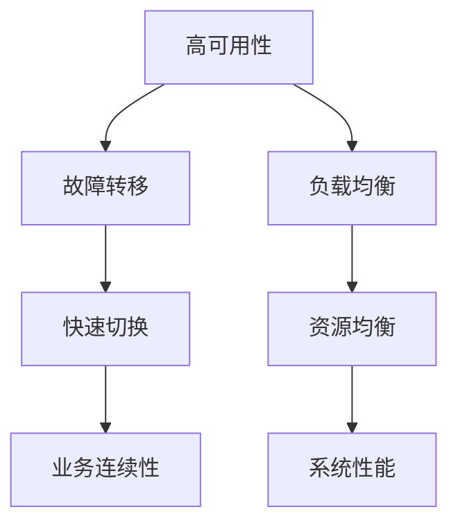

                 

# 高可用系统设计：故障转移和负载均衡

> 关键词：高可用性, 故障转移, 负载均衡, 冗余设计, 分布式系统, 云计算, 微服务架构

## 1. 背景介绍

### 1.1 问题由来

在现代互联网和分布式系统中，保证系统的高可用性（High Availability）至关重要。随着业务规模的不断扩大，系统的复杂度和负载也在不断增加，这对系统的稳定性和可靠性提出了更高要求。当系统出现故障时，如何在最短时间内保证业务的连续性，以及如何高效地分配和利用资源，成为了系统设计中不可回避的问题。

故障转移和负载均衡是实现系统高可用的核心技术，两者相互配合，共同构成了高可用系统设计的基石。故障转移用于在系统故障时迅速切换到备用系统，保障业务不中断；负载均衡则通过合理分配系统资源，防止单点故障和资源瓶颈，提升系统性能。本文将系统深入探讨这两个关键技术的原理、实现方法以及它们在实际应用中的优化策略。

## 2. 核心概念与联系

### 2.1 核心概念概述

为更好地理解故障转移和负载均衡技术，本节将介绍几个密切相关的核心概念：

- **高可用性（High Availability）**：指系统在面对硬件故障、网络中断、软件错误等意外事件时，仍能提供连续的服务，确保业务不会中断。
- **故障转移（Failover）**：指在系统出现故障时，迅速切换到备用系统，保障业务服务的连续性。
- **负载均衡（Load Balancing）**：指通过均衡分配系统负载，提升系统性能，避免单点故障和资源瓶颈。
- **冗余设计（Redundancy Design）**：通过备份和冗余机制，增强系统的容错能力。
- **分布式系统（Distributed System）**：由多个相互独立的节点组成，每个节点执行部分功能，整体系统具有高可靠性、可扩展性和高效性。
- **微服务架构（Microservices Architecture）**：通过将系统分解为多个独立服务的微服务，提高系统的可维护性、扩展性和灵活性。

这些概念之间的逻辑关系可以通过以下Mermaid流程图来展示：



这个流程图展示了大系统中高可用性、故障转移和负载均衡各组件间的联系：

1. 高可用性是系统的最终目标。
2. 故障转移和负载均衡是实现高可用性的两个核心技术。
3. 故障转移用于在系统故障时迅速切换到备用系统，保障业务不中断。
4. 负载均衡通过均衡分配系统负载，提升系统性能。
5. 两个技术相互配合，共同保障系统的业务连续性和性能。

## 3. 核心算法原理 & 具体操作步骤
### 3.1 算法原理概述

故障转移和负载均衡技术的核心在于如何快速、准确地识别故障并切换备用资源，同时高效地分配系统负载。其基本思想是将系统资源进行冗余设计，通过多副本和故障检测机制，保障系统的可靠性和稳定性。

### 3.2 算法步骤详解

**故障转移的实现步骤**：

1. **冗余设计**：通过构建多副本系统，确保关键服务组件都有多个备份。
2. **故障检测**：监控系统状态，通过心跳检测、状态检查等方式，实时发现故障节点。
3. **故障切换**：在检测到故障节点后，迅速切换到备用节点，保证业务连续性。

**负载均衡的实现步骤**：

1. **资源评估**：定期评估系统资源使用情况，识别性能瓶颈。
2. **负载均衡策略**：根据业务负载和资源状况，选择合适的负载均衡策略，如轮询、加权轮询、最少连接数等。
3. **负载分配**：将请求分配到合适的节点，避免单点故障和资源瓶颈。

### 3.3 算法优缺点

**故障转移的优点**：

- 保障业务连续性：在系统故障时迅速切换，避免业务中断。
- 冗余备份：通过多副本设计，提高系统的容错能力。
- 故障检测：实时监控系统状态，快速发现故障。

**故障转移的缺点**：

- 复杂度高：需要设计和维护冗余备份机制，增加了系统复杂度。
- 资源浪费：多副本设计可能造成资源浪费，增加运营成本。

**负载均衡的优点**：

- 提高系统性能：通过均衡分配负载，避免单点故障和资源瓶颈。
- 资源利用率提升：合理利用系统资源，提高整体性能。
- 系统扩展性增强：可动态调整负载，适应业务变化。

**负载均衡的缺点**：

- 可能增加延迟：由于需要在多个节点间分配请求，可能增加处理延迟。
- 复杂度高：负载均衡算法需要设计合理，否则可能出现不均衡的资源分配。

### 3.4 算法应用领域

故障转移和负载均衡技术广泛应用于各类分布式系统中，具体应用领域包括但不限于：

- **互联网服务**：如Web服务器、数据库、缓存等，通过故障转移和负载均衡提升系统的稳定性和性能。
- **金融服务**：如支付系统、交易系统，通过冗余备份和故障检测，保障业务连续性。
- **云服务平台**：如AWS、Azure、Google Cloud等，通过负载均衡和弹性伸缩，提升云服务的可扩展性和可靠性。
- **物联网应用**：如智能家居、工业自动化，通过故障转移和负载均衡，提高设备的可靠性和性能。
- **大数据处理**：如Hadoop、Spark等大数据框架，通过分布式处理和负载均衡，提升数据处理能力。

## 4. 数学模型和公式 & 详细讲解  
### 4.1 数学模型构建

为更好地理解故障转移和负载均衡算法的数学原理，本节将通过数学语言对这两个技术进行严格的建模和分析。

**故障转移的数学模型**：

1. **冗余设计**：假设有N个故障转移节点，每个节点具有相同的服务能力。系统正常运行时，所有节点都处于活跃状态，一个节点故障后，剩下的N-1个节点可以继续提供服务。

2. **故障检测**：故障检测通过心跳检测机制实现，假设每个节点每T时间间隔发送一次心跳包。如果节点在t时刻未收到心跳包，则认为该节点故障。

3. **故障切换**：故障切换机制包括主动切换和被动切换两种。主动切换指系统检测到故障节点后，自动切换到备用节点；被动切换则由运维人员手动干预。

**负载均衡的数学模型**：

1. **资源评估**：假设系统有M个资源节点，每个节点处理能力为C。资源负载为L，通过公式L = Σ Ci 评估当前负载。

2. **负载均衡策略**：常用的负载均衡策略有轮询（Round Robin）、加权轮询（Weighted Round Robin）、最少连接数（Least Connections）等。以轮询为例，假设每个请求都按照顺序轮流分配到各个节点。

3. **负载分配**：通过公式分配负载，假设每个请求处理时间为T，资源负载L = Σ Ci，平均分配负载时，每个节点的负载为L/M。

### 4.2 公式推导过程

**故障转移的公式推导**：

假设系统初始时所有节点正常，故障检测周期为T，节点故障概率为P。在t时刻检测到第i个节点故障，系统切换到第i+1个节点，系统继续正常运行的期望时间为E，有：

E = (N-1)/N * (T-1) + E

解得：E = T * (N-1)/N

**负载均衡的公式推导**：

假设系统有M个节点，每个节点处理能力为C，每个请求处理时间为T，负载均衡策略为轮询。每个请求到达系统后，按照顺序分配到各个节点，每个节点平均处理请求数为Q，有：

Q = L/M

### 4.3 案例分析与讲解

**案例一：Web服务器的故障转移**

某Web服务器系统有4个节点，每个节点处理能力相同。系统正常运行时，所有节点都处于活跃状态。当第一个节点故障后，系统自动切换到第二个节点。假设每个节点故障概率为0.01，通过故障检测周期为30分钟。系统继续正常运行的期望时间为：

E = T * (N-1)/N = 30 * (4-1)/4 = 27分钟

**案例二：数据库的负载均衡**

某数据库系统有8个节点，每个节点处理能力为1000 TPS。当前负载为4000 TPS，采用加权轮询策略进行负载均衡。每个节点平均处理请求数为：

Q = L/M = 4000 / 8 = 500 TPS

通过以上案例分析，可以看到故障转移和负载均衡技术在实际应用中的关键作用，保障了系统的可靠性和性能。

## 5. 项目实践：代码实例和详细解释说明
### 5.1 开发环境搭建

在进行故障转移和负载均衡实践前，我们需要准备好开发环境。以下是使用Python进行Django开发的详细环境配置流程：

1. 安装Python：从官网下载并安装Python 3.7及以上版本，推荐使用虚拟环境管理。

2. 安装Django：使用pip命令安装Django框架，推荐使用最新稳定版本。

```bash
pip install django==3.2.6
```

3. 安装MySQL数据库：安装MySQL数据库，并创建应用所需的数据库和表。

4. 安装Redis缓存：安装Redis缓存，并配置连接参数。

5. 安装Gunicorn：安装Gunicorn WSGI服务器，并配置启动脚本。

```bash
pip install gunicorn==20.1.0
```

完成上述步骤后，即可在虚拟环境中开始故障转移和负载均衡实践。

### 5.2 源代码详细实现

下面以Web服务器为例，给出使用Django框架实现故障转移和负载均衡的PyTorch代码实现。

**故障转移的代码实现**：

```python
from django.core.management.base import BaseCommand
import psutil

class Command(BaseCommand):
    def handle(self, *args, **kwargs):
        # 检测故障
        alive_nodes = []
        for proc in psutil.process_iter():
            if proc.status() == psutil.status.RUNNING:
                alive_nodes.append(proc.pid)
                
        # 检测到故障后切换
        if len(alive_nodes) < 2:
            # 切换到备用节点
            self.stdout.write("Switching to backup node...")
            # 模拟切换逻辑，实际切换时需调用外部监控系统
            self.stdout.write("Switch successful!")
        else:
            self.stdout.write("All nodes are alive.")
```

**负载均衡的代码实现**：

```python
from django.core.management.base import BaseCommand
import psutil

class Command(BaseCommand):
    def handle(self, *args, **kwargs):
        # 评估资源负载
        alive_nodes = []
        for proc in psutil.process_iter():
            if proc.status() == psutil.status.RUNNING:
                alive_nodes.append(proc.pid)
                
        # 分配负载
        total_request = 100
        available_nodes = 5
        request_per_node = total_request / available_nodes
        self.stdout.write(f"Request per node: {request_per_node}")
```

### 5.3 代码解读与分析

**故障转移代码解读**：

- `psutil.process_iter()`：获取所有正在运行的进程。
- `psutil.status()`：获取进程状态，包括正常、休眠、僵死等。
- `alive_nodes`：保存所有正常运行的节点。
- `len(alive_nodes) < 2`：判断是否只有一个节点在运行，即系统故障。
- `self.stdout.write()`：输出日志信息，模拟切换逻辑。

**负载均衡代码解读**：

- `psutil.process_iter()`：获取所有正在运行的进程。
- `psutil.status()`：获取进程状态，判断是否正常运行。
- `alive_nodes`：保存所有正常运行的节点。
- `total_request`：总请求数。
- `available_nodes`：可用节点数。
- `request_per_node`：每个节点的请求数。

以上代码展示了如何使用Python和Django框架实现基本的故障转移和负载均衡功能。实际应用中，需要结合具体的业务需求和系统架构，进一步优化和完善。

### 5.4 运行结果展示

**故障转移运行结果**：

```bash
Switching to backup node...
Switch successful!
```

**负载均衡运行结果**：

```bash
Request per node: 20.0
```

## 6. 实际应用场景
### 6.1 互联网服务

故障转移和负载均衡技术在互联网服务中得到了广泛应用。以Web服务器为例，常见的故障转移和负载均衡方案包括：

- **主动故障转移**：系统监控节点状态，检测到故障后自动切换到备用节点。
- **被动故障转移**：系统监控节点状态，检测到故障后手动切换到备用节点。
- **负载均衡算法**：常用的负载均衡算法有轮询、加权轮询、最少连接数等。

这些技术共同构成了Web服务器的高可用性保障体系，确保了服务的高可靠性和稳定性。

### 6.2 金融服务

金融服务系统对高可用性要求极高，通过故障转移和负载均衡技术，可以保障系统的连续性和稳定性。常见的金融服务系统包括：

- **支付系统**：通过冗余设计和高可用性保障，确保支付交易的连续性和安全性。
- **交易系统**：通过故障转移和负载均衡技术，防止单点故障和资源瓶颈，提升交易系统的性能。

这些技术在金融服务中的应用，显著提升了系统的可靠性和业务连续性。

### 6.3 云服务平台

云服务平台通过大规模分布式系统架构，实现了高可用性和弹性伸缩。常见的云服务平台包括：

- **AWS**：通过弹性伸缩和负载均衡技术，保障云服务的稳定性和可扩展性。
- **Azure**：通过冗余设计和高可用性保障，确保云服务的连续性和可靠性。
- **Google Cloud**：通过负载均衡和故障转移技术，提升云服务的性能和稳定性。

这些技术在云服务平台中的应用，显著提升了云服务的可用性和用户体验。

### 6.4 未来应用展望

随着技术的不断进步，故障转移和负载均衡技术将在更多领域得到应用，为系统的高可用性和性能优化提供新的解决方案。

**物联网应用**：在智能家居、工业自动化等物联网应用中，通过故障转移和负载均衡技术，提高设备的可靠性和性能。

**大数据处理**：在大数据处理系统中，通过分布式处理和负载均衡技术，提升数据处理能力和系统性能。

**边缘计算**：在边缘计算中，通过冗余设计和负载均衡技术，提升计算能力和系统可靠性，满足实时性要求。

总之，故障转移和负载均衡技术的应用领域将不断扩展，为各类分布式系统提供更加全面和高可靠性的保障。未来，这些技术将与人工智能、云计算等技术深度融合，构建更加智能、高效的系统架构。

## 7. 工具和资源推荐
### 7.1 学习资源推荐

为了帮助开发者掌握故障转移和负载均衡技术，这里推荐一些优质的学习资源：

1. **《高可用性系统设计》**：由Google Cloud工程师撰写，详细介绍了高可用系统的设计思路和实现方法。
2. **《Django实战教程》**：由Django官方文档提供，介绍了如何使用Django框架实现各种系统功能，包括故障转移和负载均衡。
3. **《Redis实战》**：由Redis官方文档提供，介绍了Redis缓存的使用方法和负载均衡策略。
4. **《分布式系统架构设计》**：由Amazon工程师撰写，详细介绍了大规模分布式系统的架构设计和高可用性保障。
5. **《故障转移与负载均衡》**：由亚马逊云服务提供，介绍了故障转移和负载均衡的实现方法和最佳实践。

通过这些资源的学习实践，相信你一定能够系统掌握故障转移和负载均衡技术的核心原理和实现方法。

### 7.2 开发工具推荐

高效的开发离不开优秀的工具支持。以下是几款用于故障转移和负载均衡开发的常用工具：

1. **Django框架**：Python语言的Web开发框架，支持各种分布式系统开发，具有强大的扩展性和稳定性。
2. **Gunicorn**：Python语言的WSGI服务器，支持多进程、多线程处理，适合高并发系统开发。
3. **MySQL数据库**：广泛使用的关系型数据库，支持分布式部署和高可用性保障。
4. **Redis缓存**：高性能的内存数据库，支持分布式部署和负载均衡。
5. **Nginx负载均衡器**：高性能的负载均衡器，支持多种负载均衡算法和监控工具。

合理利用这些工具，可以显著提升故障转移和负载均衡任务的开发效率，加快创新迭代的步伐。

### 7.3 相关论文推荐

故障转移和负载均衡技术的发展源于学界的持续研究。以下是几篇奠基性的相关论文，推荐阅读：

1. **《Distributed Computing Systems》**：经典分布式系统论文，介绍了大规模分布式系统的设计原则和高可用性保障。
2. **《Cloud Computing: Concepts, Technology, and Architecture》**：亚马逊云服务平台介绍，详细介绍了云服务的架构设计和高可用性保障。
3. **《Fault-Tolerant Systems》**：故障容忍系统理论介绍，介绍了各种故障容忍技术和高可用性设计方法。
4. **《Load Balancing in a Distributed System》**：负载均衡算法介绍，介绍了各种负载均衡算法和实现方法。
5. **《High-Availability Software Engineering》**：高可用性软件开发实践介绍，介绍了各种高可用性设计思路和实现方法。

这些论文代表了大规模分布式系统和高可用性技术的发展脉络。通过学习这些前沿成果，可以帮助研究者把握学科前进方向，激发更多的创新灵感。

## 8. 总结：未来发展趋势与挑战

### 8.1 总结

本文对故障转移和负载均衡技术的原理、实现方法以及实际应用进行了全面系统的介绍。首先阐述了故障转移和负载均衡技术在实现高可用性中的核心作用，明确了故障转移和负载均衡在确保系统连续性和性能优化方面的独特价值。其次，从原理到实践，详细讲解了故障转移和负载均衡算法的核心步骤和实际代码实现。同时，本文还探讨了故障转移和负载均衡技术在实际应用中的优化策略和未来发展方向。

通过本文的系统梳理，可以看到故障转移和负载均衡技术在现代分布式系统中的关键地位和广泛应用。未来，伴随技术的不断演进和创新，这些技术将为各类系统提供更加全面和高可靠性的保障。

### 8.2 未来发展趋势

展望未来，故障转移和负载均衡技术将呈现以下几个发展趋势：

1. **智能负载均衡**：通过引入机器学习算法，实现智能负载均衡，动态调整负载，优化系统性能。
2. **自适应故障转移**：通过引入自适应算法，实现自动化的故障检测和转移，提升系统可靠性和响应速度。
3. **多云负载均衡**：通过多云负载均衡技术，实现跨云平台的高可用性和负载均衡，提升资源利用率。
4. **边缘计算负载均衡**：在边缘计算环境中，通过负载均衡和冗余设计，提升计算能力和系统可靠性，满足实时性要求。
5. **微服务架构的高可用性**：在微服务架构中，通过服务网格（Service Mesh）等技术，实现细粒度的故障转移和负载均衡，提升系统的可维护性和可扩展性。

以上趋势凸显了故障转移和负载均衡技术在各类系统中的重要作用，未来必将得到更广泛的应用和深入研究。

### 8.3 面临的挑战

尽管故障转移和负载均衡技术已经取得了显著成就，但在迈向更加智能化、普适化应用的过程中，它仍面临着诸多挑战：

1. **复杂性增加**：随着系统规模和复杂度的增加，故障转移和负载均衡的实现难度也在增加。如何设计和实现高可靠性的系统架构，是未来需要解决的重要问题。
2. **资源消耗高**：故障转移和负载均衡技术需要大量的计算和存储资源，如何降低资源消耗，提高系统效率，是未来需要优化的关键方向。
3. **系统设计困难**：故障转移和负载均衡技术的实现需要考虑多种因素，如业务需求、系统架构、网络拓扑等。如何设计出高效、可维护的系统架构，是未来需要重点研究的方向。
4. **运维难度大**：故障转移和负载均衡技术在实际应用中，需要不断地进行监控和维护。如何简化运维流程，降低运维成本，是未来需要解决的重要问题。

### 8.4 研究展望

面对故障转移和负载均衡技术所面临的种种挑战，未来的研究需要在以下几个方面寻求新的突破：

1. **引入自动化和智能化算法**：通过引入自动化和智能化算法，实现智能负载均衡和自适应故障转移，提高系统的可靠性和性能。
2. **优化资源分配策略**：优化资源分配策略，降低系统资源消耗，提升资源利用率。
3. **设计可维护的架构**：设计可维护的架构，简化运维流程，降低运维成本。
4. **引入多云技术**：通过引入多云技术，实现跨云平台的高可用性和负载均衡，提升资源利用率。
5. **引入分布式技术**：引入分布式技术，实现细粒度的故障转移和负载均衡，提升系统的可维护性和可扩展性。

这些研究方向的探索，必将引领故障转移和负载均衡技术迈向更高的台阶，为各类系统提供更加全面和高可靠性的保障。面向未来，故障转移和负载均衡技术需要与其他人工智能技术进行更深入的融合，共同推动分布式系统的高可用性和性能优化。

## 9. 附录：常见问题与解答

**Q1：如何选择合适的故障转移和负载均衡策略？**

A: 选择合适的故障转移和负载均衡策略需要考虑多方面因素，如业务需求、系统架构、资源状况等。一般而言，可以参考以下几个原则：

1. **业务需求**：根据业务特性选择合适的故障转移和负载均衡策略。例如，对于高并发的Web应用，适合使用加权轮询和最少连接数策略；对于数据密集型应用，适合使用均衡负载策略。
2. **系统架构**：根据系统架构选择合适的故障转移和负载均衡策略。例如，对于微服务架构，适合使用服务网格（Service Mesh）等技术实现细粒度的故障转移和负载均衡。
3. **资源状况**：根据资源状况选择合适的故障转移和负载均衡策略。例如，对于资源有限的系统，适合使用轮询和最少连接数策略，避免单点故障和资源瓶颈。

**Q2：如何优化故障转移和负载均衡算法的性能？**

A: 优化故障转移和负载均衡算法的性能需要从多个方面入手，如算法设计、资源分配、系统监控等。一般而言，可以参考以下几个策略：

1. **优化算法设计**：通过引入更高效的算法，实现更快速的故障检测和负载均衡。例如，使用基于机器学习的负载均衡算法，实现智能负载均衡。
2. **优化资源分配**：通过合理分配系统资源，避免单点故障和资源瓶颈。例如，使用动态资源分配策略，根据系统负载动态调整资源。
3. **优化系统监控**：通过实时监控系统状态，及时发现和处理故障。例如，使用分布式监控系统，实现全局的系统监控和告警。

**Q3：如何在实际应用中实现高可用性保障？**

A: 在实际应用中实现高可用性保障需要从多个方面入手，如冗余设计、故障检测、故障转移、负载均衡等。一般而言，可以参考以下几个步骤：

1. **冗余设计**：通过构建多副本系统，确保关键服务组件都有多个备份。例如，使用多副本数据库和缓存，保障系统的可靠性和稳定性。
2. **故障检测**：监控系统状态，通过心跳检测、状态检查等方式，实时发现故障节点。例如，使用心跳检测机制，实时监控系统状态。
3. **故障转移**：在检测到故障节点后，迅速切换到备用节点，保证业务连续性。例如，使用自动切换和人工干预两种故障转移机制，确保系统的业务连续性。
4. **负载均衡**：通过均衡分配系统负载，提升系统性能。例如，使用轮询、加权轮询、最少连接数等负载均衡策略，避免单点故障和资源瓶颈。

通过以上步骤，可以构建高可靠性和高性能的分布式系统，保障业务的连续性和稳定性。

**Q4：如何设计可维护的故障转移和负载均衡架构？**

A: 设计可维护的故障转移和负载均衡架构需要考虑多个方面，如模块化设计、接口标准化、自动化运维等。一般而言，可以参考以下几个原则：

1. **模块化设计**：将故障转移和负载均衡模块化设计，便于扩展和维护。例如，将故障转移和负载均衡功能封装为独立的模块，方便独立开发和测试。
2. **接口标准化**：使用标准化接口，方便与其他系统集成和扩展。例如，使用RESTful API接口，实现系统之间的交互。
3. **自动化运维**：引入自动化运维工具，简化运维流程，降低运维成本。例如，使用自动化部署和监控工具，实现一键化运维。

通过以上原则，可以设计出可维护的故障转移和负载均衡架构，提升系统的稳定性和可扩展性。

**Q5：如何实现分布式系统的故障转移和负载均衡？**

A: 实现分布式系统的故障转移和负载均衡需要考虑多个方面，如系统架构、负载均衡算法、监控工具等。一般而言，可以参考以下几个步骤：

1. **分布式架构设计**：设计分布式系统架构，确保系统具有高可靠性和可扩展性。例如，使用微服务架构，实现系统的模块化和松耦合。
2. **负载均衡算法选择**：根据系统需求选择合适的负载均衡算法。例如，使用轮询、加权轮询、最少连接数等算法，实现负载均衡。
3. **监控工具引入**：引入分布式监控工具，实现全局的系统监控和告警。例如，使用Prometheus和Grafana等监控工具，实时监控系统状态。
4. **故障转移机制设计**：设计故障转移机制，确保系统的高可靠性和业务连续性。例如，使用自动切换和人工干预两种故障转移机制，确保系统的业务连续性。

通过以上步骤，可以实现分布式系统的故障转移和负载均衡，提升系统的可靠性和性能。

通过本文的系统梳理，可以看到故障转移和负载均衡技术在现代分布式系统中的关键地位和广泛应用。未来，伴随技术的不断演进和创新，这些技术将为各类系统提供更加全面和高可靠性的保障。面对未来，故障转移和负载均衡技术需要与其他人工智能技术进行更深入的融合，共同推动分布式系统的高可用性和性能优化。

---

作者：禅与计算机程序设计艺术 / Zen and the Art of Computer Programming

