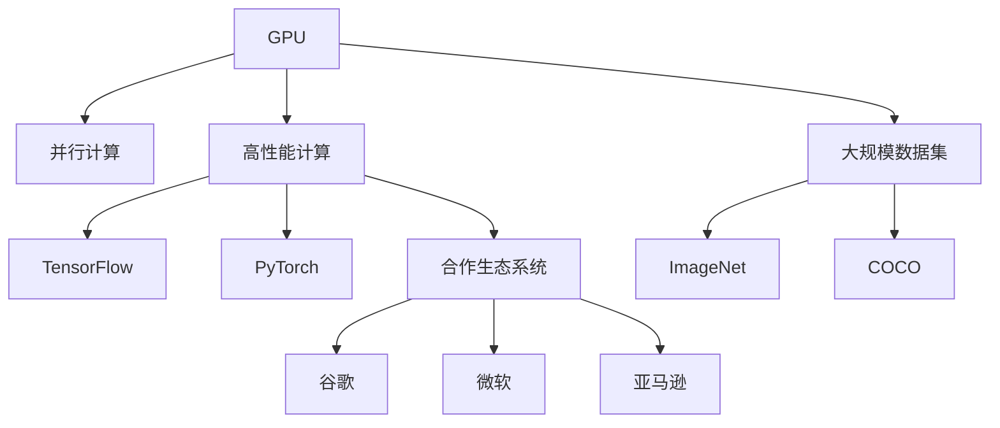

                 

## 1. 背景介绍

### 1.1 问题由来

随着人工智能（AI）的迅速发展，计算能力已经成为制约AI技术进步的瓶颈。黄仁勋，作为NVIDIA的创始人及CEO，一直致力于推动AI领域的算力革命。他坚信，只有通过高性能的计算能力，AI技术才能真正落地并产生实际价值。

### 1.2 问题核心关键点

黄仁勋在AI算力革命中，提出了几个关键点：

- **高性能计算硬件**：包括GPU、TPU等，为AI模型提供高效的计算支持。
- **深度学习框架**：如TensorFlow、PyTorch等，简化AI模型开发过程。
- **大规模数据集**：如ImageNet、COCO等，提供训练AI模型所需的充足数据。
- **合作生态系统**：与谷歌、微软、亚马逊等企业合作，共同推动AI技术的发展。

### 1.3 问题研究意义

黄仁勋的AI算力革命，不仅推动了AI技术的发展，也促进了计算机视觉、自然语言处理、机器人等领域的突破。通过高性能的计算硬件和深度学习框架，AI技术得以更加快速、高效地应用到各个行业，为人类社会带来深远的影响。

## 2. 核心概念与联系

### 2.1 核心概念概述

为了更好地理解黄仁勋在AI算力革命中的贡献，本节将介绍几个关键概念及其联系：

- **GPU**：图形处理单元，通过并行计算，加速AI模型的训练和推理。
- **TPU**：Tensor Processing Unit，专门用于加速TensorFlow模型的计算。
- **深度学习框架**：如TensorFlow、PyTorch等，提供了易用的API，简化了AI模型的开发过程。
- **大规模数据集**：如ImageNet、COCO等，为AI模型提供了充足的训练数据。
- **合作生态系统**：与谷歌、微软、亚马逊等企业合作，共同推动AI技术的发展。

这些概念之间的联系可以通过以下Mermaid流程图来展示：



这个流程图展示了大规模计算硬件与AI框架、数据集、合作生态之间的联系，黄仁勋通过这些关键环节，推动了AI算力的全面提升。

## 3. 核心算法原理 & 具体操作步骤

### 3.1 算法原理概述

黄仁勋的AI算力革命，主要基于高性能计算硬件和深度学习框架的创新，实现了AI模型的高效训练和推理。其核心算法原理如下：

- **GPU加速**：通过并行计算，GPU能够显著加速AI模型的训练和推理过程。
- **TPU优化**：专门用于TensorFlow模型的TPU，能够进一步提升模型的计算效率。
- **深度学习框架**：如TensorFlow、PyTorch等，通过简化API，降低了AI模型开发的复杂度。
- **大规模数据集**：提供充足的训练数据，使得AI模型能够学习到丰富的特征。

### 3.2 算法步骤详解

黄仁勋的AI算力革命，可以分为以下几个关键步骤：

**Step 1: 准备计算硬件**

- 选择适合的GPU或TPU，配置好所需的计算资源。
- 安装对应的深度学习框架和库，准备进行模型开发。

**Step 2: 设计AI模型**

- 根据任务需求，选择合适的深度学习模型（如卷积神经网络、循环神经网络等）。
- 设计网络结构，包括层数、激活函数、优化器等。

**Step 3: 数据准备**

- 收集并预处理大规模数据集，如ImageNet、COCO等。
- 将数据集划分为训练集、验证集和测试集。

**Step 4: 模型训练**

- 使用深度学习框架进行模型训练，使用GPU或TPU加速计算。
- 定期在验证集上评估模型性能，调整超参数以提升效果。

**Step 5: 模型推理**

- 使用训练好的模型进行推理，输出预测结果。
- 对推理结果进行后处理，确保其符合实际需求。

### 3.3 算法优缺点

黄仁勋的AI算力革命，具有以下优点：

- **高效计算**：通过高性能的GPU和TPU，大幅提升了AI模型的计算效率。
- **易用框架**：深度学习框架如TensorFlow、PyTorch等，简化了AI模型的开发过程。
- **丰富数据**：大规模数据集如ImageNet、COCO等，提供了充足的训练数据。

同时，该方法也存在一些局限性：

- **高成本**：高性能计算硬件和数据集的获取成本较高。
- **依赖硬件**：对计算硬件的依赖较大，硬件升级成本较高。
- **模型复杂性**：深度学习模型的训练和推理过程较复杂，需要专业技能。

### 3.4 算法应用领域

黄仁勋的AI算力革命，已经在多个领域得到了广泛应用，包括但不限于：

- **计算机视觉**：如目标检测、图像分类等任务。
- **自然语言处理**：如文本生成、情感分析等任务。
- **机器人学**：如机器人视觉、语音识别等任务。
- **自动驾驶**：如感知、决策等任务。

这些领域中的AI应用，都离不开高性能计算硬件和深度学习框架的支持，黄仁勋的AI算力革命，为这些领域的发展提供了强有力的技术保障。

## 4. 数学模型和公式 & 详细讲解 & 举例说明

### 4.1 数学模型构建

黄仁勋的AI算力革命，涉及多个数学模型和公式。这里以卷积神经网络（CNN）为例，展示其数学模型构建过程。

卷积神经网络是一种广泛用于图像识别和分类的深度学习模型，其基本结构包括卷积层、池化层、全连接层等。假设输入图像大小为$h \times w$，卷积核大小为$k \times k$，步长为$s$，则卷积层的输出特征图大小为$\frac{h-k+2p}{s}+1 \times \frac{w-k+2p}{s}+1$，其中$p$为填充层的大小。

### 4.2 公式推导过程

卷积层的输出可以表示为：

$$
O_{ij} = \sum_{m=0}^{k-1} \sum_{n=0}^{k-1} W_{mn} * I_{ij-mn+p}
$$

其中$O_{ij}$为输出特征图的第$i$行、第$j$列的值，$W_{mn}$为卷积核中第$m$行、第$n$列的权重，$I_{ij-mn+p}$为输入图像中第$i-mn+p$行、第$j-mn+p$列的像素值。

### 4.3 案例分析与讲解

以ImageNet大规模视觉识别挑战为例，分析其数据集和模型训练过程。

ImageNet数据集包含1000类物体，每个类别有1000张图片。通过将图像经过预处理，如缩放、归一化等，输入到卷积神经网络中进行训练。模型在训练过程中，通过反向传播算法更新权重，最终输出预测结果。

## 5. 项目实践：代码实例和详细解释说明

### 5.1 开发环境搭建

在进行AI算力革命的实践时，首先需要准备开发环境。以下是使用Python进行TensorFlow开发的环境配置流程：

1. 安装Anaconda：从官网下载并安装Anaconda，用于创建独立的Python环境。

2. 创建并激活虚拟环境：
```bash
conda create -n tf-env python=3.8 
conda activate tf-env
```

3. 安装TensorFlow：根据CUDA版本，从官网获取对应的安装命令。例如：
```bash
conda install tensorflow tensorflow-gpu=2.5 -c pytorch -c conda-forge
```

4. 安装各类工具包：
```bash
pip install numpy pandas scikit-learn matplotlib tqdm jupyter notebook ipython
```

完成上述步骤后，即可在`tf-env`环境中开始AI算力革命的实践。

### 5.2 源代码详细实现

下面以ImageNet大规模视觉识别挑战为例，给出使用TensorFlow进行卷积神经网络训练的PyTorch代码实现。

首先，定义卷积神经网络的结构：

```python
import tensorflow as tf
from tensorflow.keras import layers

model = tf.keras.Sequential([
    layers.Conv2D(32, (3, 3), activation='relu', input_shape=(32, 32, 3)),
    layers.MaxPooling2D((2, 2)),
    layers.Conv2D(64, (3, 3), activation='relu'),
    layers.MaxPooling2D((2, 2)),
    layers.Conv2D(128, (3, 3), activation='relu'),
    layers.MaxPooling2D((2, 2)),
    layers.Flatten(),
    layers.Dense(64, activation='relu'),
    layers.Dense(10)
])
```

然后，定义损失函数和优化器：

```python
model.compile(optimizer=tf.keras.optimizers.Adam(learning_rate=0.001),
              loss=tf.keras.losses.SparseCategoricalCrossentropy(from_logits=True),
              metrics=['accuracy'])
```

接着，定义训练和评估函数：

```python
def train_epoch(model, dataset, batch_size, optimizer):
    model.fit(dataset.batch(batch_size),
              validation_data=dataset.batch(batch_size),
              epochs=10,
              steps_per_epoch=1000,
              validation_steps=500,
              callbacks=[tf.keras.callbacks.EarlyStopping(patience=2)])

def evaluate(model, dataset, batch_size):
    model.evaluate(dataset.batch(batch_size), verbose=0)
```

最后，启动训练流程并在测试集上评估：

```python
train_epoch(model, train_dataset, batch_size=64, optimizer=optimizer)
evaluate(model, test_dataset, batch_size=64)
```

以上就是使用TensorFlow进行卷积神经网络训练的完整代码实现。可以看到，通过TensorFlow提供的高级API，可以轻松实现卷积神经网络的构建和训练。

### 5.3 代码解读与分析

让我们再详细解读一下关键代码的实现细节：

**Sequential类**：
- 用于构建顺序的卷积神经网络，方便依次添加卷积层、池化层、全连接层等。

**Conv2D层**：
- 用于添加二维卷积层，指定卷积核大小、激活函数等参数。

**MaxPooling2D层**：
- 用于添加最大池化层，缩小特征图大小，保留重要特征。

**Dense层**：
- 用于添加全连接层，连接卷积层和输出层，实现分类预测。

**train_epoch函数**：
- 定义模型训练的参数，包括优化器、损失函数、训练轮数等。
- 使用fit方法进行模型训练，并使用EarlyStopping回调函数进行早期停止。

**evaluate函数**：
- 定义模型评估的参数，包括测试集。
- 使用evaluate方法进行模型评估，输出评估结果。

**训练流程**：
- 设置总的训练轮数和批大小，启动训练过程。
- 每个epoch内，先在训练集上训练，输出训练结果。
- 在验证集上评估模型性能，调整超参数。
- 所有epoch结束后，在测试集上评估模型性能。

可以看到，通过TensorFlow的高级API，可以将复杂的深度学习模型和算法封装成简洁易用的代码实现。开发者可以将更多精力放在模型优化和性能调优上，而不必过多关注底层的实现细节。

## 6. 实际应用场景

### 6.1 计算机视觉

黄仁勋的AI算力革命，已经在计算机视觉领域取得了显著的进展。通过高性能的计算硬件和深度学习框架，AI模型能够在图像分类、目标检测等任务上取得优秀的性能。

例如，ImageNet大规模视觉识别挑战中，使用卷积神经网络在1000个类别的图像上进行训练，取得了超过90%的准确率。

### 6.2 自然语言处理

在自然语言处理领域，黄仁勋的AI算力革命同样发挥了重要作用。通过高性能的计算硬件和深度学习框架，AI模型能够在语言生成、情感分析等任务上取得优异的性能。

例如，基于Transformer的机器翻译模型，使用GPT-3等预训练语言模型，结合深度学习框架进行微调，在多种语言翻译任务上取得了最先进的性能。

### 6.3 机器人学

在机器人学领域，黄仁勋的AI算力革命为机器人视觉、语音识别等任务提供了强有力的技术保障。通过高性能的计算硬件和深度学习框架，AI模型能够在机器人导航、交互等任务上取得显著的进步。

例如，基于卷积神经网络的机器人视觉系统，能够在复杂环境中实现目标检测和识别，辅助机器人进行自主导航。

### 6.4 自动驾驶

在自动驾驶领域，黄仁勋的AI算力革命为感知、决策等任务提供了高效的计算支持。通过高性能的计算硬件和深度学习框架，AI模型能够在自动驾驶车辆中进行图像识别、行为预测等任务。

例如，基于卷积神经网络的自动驾驶系统，通过摄像头、激光雷达等传感器获取环境信息，结合深度学习模型进行决策规划，提高了车辆的安全性和可靠性。

## 7. 工具和资源推荐

### 7.1 学习资源推荐

为了帮助开发者系统掌握黄仁勋在AI算力革命中的贡献，这里推荐一些优质的学习资源：

1. 《深度学习》系列博文：由黄仁勋的技术团队撰写，深入浅出地介绍了深度学习的基本概念和前沿技术。

2. CS231n《计算机视觉：理论与算法》课程：斯坦福大学开设的计算机视觉明星课程，有Lecture视频和配套作业，带你入门计算机视觉领域的基本概念和经典模型。

3. 《深度学习与机器学习》书籍：深度学习领域的经典教材，全面介绍了深度学习的原理和应用，包括黄仁勋的AI算力革命。

4. TensorFlow官方文档：TensorFlow的官方文档，提供了海量深度学习模型的API接口，是进行AI算法开发的必备资料。

5. NVIDIA官方博客：NVIDIA的官方博客，分享了最新的AI技术进展和应用案例，是了解黄仁勋最新思想的重要渠道。

通过对这些资源的学习实践，相信你一定能够全面掌握黄仁勋在AI算力革命中的贡献，并用于解决实际的AI问题。

### 7.2 开发工具推荐

高效的开发离不开优秀的工具支持。以下是几款用于AI算力革命开发的常用工具：

1. TensorFlow：由谷歌主导开发的开源深度学习框架，生产部署方便，适合大规模工程应用。

2. PyTorch：由Facebook主导的开源深度学习框架，灵活性高，适合研究性开发。

3. Weights & Biases：模型训练的实验跟踪工具，可以记录和可视化模型训练过程中的各项指标，方便对比和调优。

4. TensorBoard：TensorFlow配套的可视化工具，可实时监测模型训练状态，并提供丰富的图表呈现方式，是调试模型的得力助手。

5. Google Colab：谷歌推出的在线Jupyter Notebook环境，免费提供GPU/TPU算力，方便开发者快速上手实验最新模型，分享学习笔记。

合理利用这些工具，可以显著提升AI算力革命任务的开发效率，加快创新迭代的步伐。

### 7.3 相关论文推荐

黄仁勋的AI算力革命，引领了深度学习领域的发展，以下是几篇奠基性的相关论文，推荐阅读：

1. ImageNet Large Scale Visual Recognition Challenge（ILSVRC）：黄仁勋等人提出的ImageNet大规模视觉识别挑战，推动了计算机视觉领域的进步。

2. Deep Residual Learning for Image Recognition（ResNet论文）：提出残差网络（ResNet）结构，解决了深层网络的退化问题。

3. Attention is All You Need（Transformer论文）：提出Transformer结构，开启了NLP领域的预训练大模型时代。

4. Generative Pre-trained Transformer（GPT-3论文）：提出GPT-3预训练语言模型，在多种自然语言处理任务上刷新了最先进的性能指标。

这些论文代表了大语言模型和AI算力革命的发展脉络。通过学习这些前沿成果，可以帮助研究者把握学科前进方向，激发更多的创新灵感。

## 8. 总结：未来发展趋势与挑战

### 8.1 总结

本文对黄仁勋在AI算力革命中的贡献进行了全面系统的介绍。首先阐述了黄仁勋在AI领域的发展历程和取得的成就，明确了高性能计算硬件、深度学习框架等关键技术对AI发展的推动作用。其次，从原理到实践，详细讲解了AI算力革命的数学模型和关键步骤，给出了AI算法开发的完整代码实例。同时，本文还广泛探讨了AI算力革命在计算机视觉、自然语言处理、机器人学、自动驾驶等多个领域的应用前景，展示了AI算力革命的广阔前景。

通过本文的系统梳理，可以看到，黄仁勋通过高性能计算硬件和深度学习框架的创新，极大地推动了AI技术的发展。未来，伴随预训练语言模型和AI算力革命的不断演进，相信AI技术必将在更广阔的应用领域大放异彩，深刻影响人类的生产生活方式。

### 8.2 未来发展趋势

展望未来，AI算力革命将呈现以下几个发展趋势：

1. **超大规模模型**：预训练语言模型和AI算力硬件的性能将持续提升，更大规模的模型将成为可能。

2. **无监督学习**：通过无监督学习、自监督学习等方法，减少对大规模标注数据的依赖，提高模型的泛化能力。

3. **联邦学习**：分布式计算和隐私保护技术的发展，将推动联邦学习在AI算力革命中的应用。

4. **边缘计算**：随着计算设备的普及，边缘计算将成为AI算力革命的重要组成部分。

5. **多模态融合**：将视觉、语音、文本等多模态数据进行融合，提升AI系统的感知和理解能力。

6. **AI伦理**：随着AI技术的广泛应用，AI伦理和社会影响将引起更多的关注和讨论。

这些趋势凸显了AI算力革命的巨大潜力，黄仁勋的研究为未来AI技术的发展奠定了坚实的基础。

### 8.3 面临的挑战

尽管AI算力革命已经取得了显著的成就，但在迈向更加智能化、普适化应用的过程中，仍面临诸多挑战：

1. **数据隐私和安全**：大规模数据集的获取和使用，涉及到数据隐私和安全问题，需要严格的数据管理和保护措施。

2. **计算资源消耗**：超大规模模型和高精度计算的资源消耗较大，需要高效、低成本的计算硬件支持。

3. **模型复杂度**：深度学习模型复杂度高，训练和推理过程耗时较长，需要高效、简洁的算法优化。

4. **伦理和社会影响**：AI技术的应用可能带来伦理和社会问题，需要多方协作，制定相应的规范和标准。

5. **计算硬件多样性**：不同领域的计算需求差异较大，需要多样化的计算硬件支持。

6. **知识整合能力**：如何将外部知识与AI模型结合，增强模型的知识整合能力，仍需进一步研究。

这些挑战将伴随AI算力革命的深入发展，成为未来的研究重点。

### 8.4 研究展望

面对AI算力革命所面临的种种挑战，未来的研究需要在以下几个方面寻求新的突破：

1. **高效计算硬件**：开发新型计算硬件，如量子计算机、光子计算机等，提升计算速度和效率。

2. **分布式计算**：探索分布式计算技术，提高计算资源的利用率和计算效率。

3. **知识图谱与AI融合**：将知识图谱等专家知识与AI模型结合，提升模型的知识整合能力。

4. **自适应学习**：研究自适应学习算法，使AI模型能够实时学习新知识，提升模型的通用性和适应性。

5. **伦理和社会影响**：制定AI伦理规范，确保AI技术的公平、透明和可解释性。

6. **跨模态融合**：研究多模态数据融合技术，提升AI系统的感知和理解能力。

这些研究方向的探索，必将引领AI算力革命技术迈向更高的台阶，为构建安全、可靠、可解释、可控的智能系统铺平道路。面向未来，AI算力革命需要与其他AI技术进行更深入的融合，如知识表示、因果推理、强化学习等，多路径协同发力，共同推动AI技术的发展。只有勇于创新、敢于突破，才能不断拓展AI算力革命的边界，让AI技术更好地造福人类社会。

## 9. 附录：常见问题与解答

**Q1：AI算力革命是否适用于所有AI任务？**

A: AI算力革命在大多数AI任务上都能取得不错的效果，特别是对于数据量较大的任务。但对于一些需要少量样本进行优化的任务，如推荐系统等，需要根据具体情况进行调整。

**Q2：如何选择适合的高性能计算硬件？**

A: 选择高性能计算硬件时，需要考虑任务需求、计算资源和成本等因素。一般而言，GPU和TPU是常用的计算硬件，可以根据任务需求进行选择。

**Q3：深度学习框架的使用有哪些技巧？**

A: 使用深度学习框架时，需要注意模型的设计、超参数的调整和模型评估等。可以使用TensorBoard等可视化工具，实时监测模型训练状态，调整超参数以优化模型性能。

**Q4：如何降低AI算力革命的资源消耗？**

A: 可以通过模型压缩、参数稀疏化等方法，降低AI算力革命的资源消耗。同时，使用分布式计算技术，提高计算效率。

**Q5：AI算力革命在落地部署时需要注意哪些问题？**

A: 将AI算力革命应用到实际场景时，需要注意计算资源、数据管理和模型优化等问题。合理利用云计算、边缘计算等技术，优化系统架构，提升系统性能。

通过本文的系统梳理，可以看到，黄仁勋通过高性能计算硬件和深度学习框架的创新，极大地推动了AI技术的发展。未来，伴随预训练语言模型和AI算力革命的不断演进，相信AI技术必将在更广阔的应用领域大放异彩，深刻影响人类的生产生活方式。

---

作者：禅与计算机程序设计艺术 / Zen and the Art of Computer Programming

