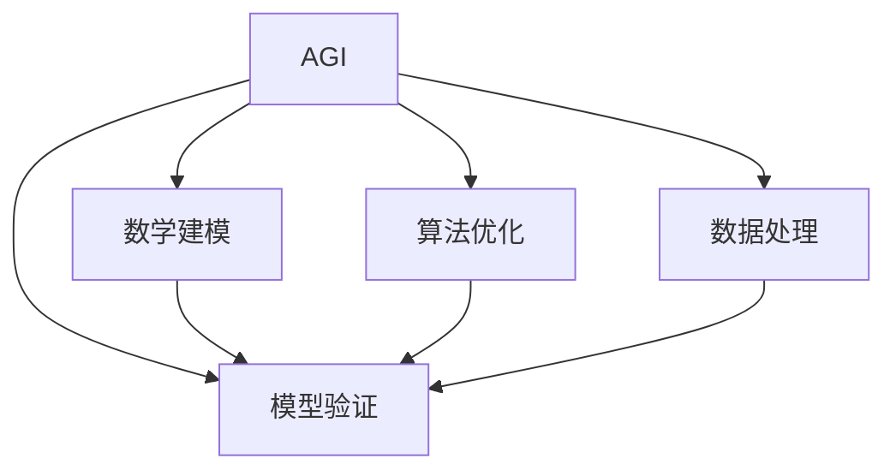

                 

# AGI在量子引力中的突破

> 关键词：AGI, 量子引力, 人工智能, 物理学, 数学建模, 算法优化

## 1. 背景介绍

### 1.1 问题由来

人工智能（AI）和量子引力理论一直是科学界的两个热门话题。随着深度学习和大数据技术的迅猛发展，AI已经进入了一个新的阶段，即通用人工智能（AGI）。AGI是一种高度智能化的系统，具备解决各种复杂问题的能力，甚至在人类专长的领域也能胜任。然而，AGI的实现仍面临诸多挑战，如如何处理复杂的物理问题、如何确保系统的安全性和可靠性等。

量子引力理论则是一门试图将量子力学和广义相对论结合起来，研究宇宙最基本问题的物理学理论。它是对引力的量子化描述，是目前理论物理的前沿研究方向。虽然量子引力理论尚未获得突破性进展，但其研究的深入对理解宇宙的微观结构有重要意义。

将AGI和量子引力结合，一方面可以利用AI处理大量数据和复杂问题，提高量子引力研究的效率；另一方面，量子引力理论中的物理定律也可以为AGI提供数学和物理基础，使其能够更好地理解和处理复杂的物理问题。

### 1.2 问题核心关键点

本文将介绍如何利用AGI在量子引力中取得突破，具体包括以下几个关键点：

1. **数学建模**：如何构建精确的量子引力模型，利用AGI进行数学推导和求解。
2. **算法优化**：如何利用AGI进行算法优化，提高计算效率和准确性。
3. **数据处理**：如何利用AGI处理量子引力中的大量数据，提取有价值的信息。
4. **模型验证**：如何利用AGI对量子引力模型进行验证，确保其正确性和可靠性。
5. **实际应用**：如何利用AGI在实际应用中解决物理问题，如黑洞研究、宇宙起源等。

## 2. 核心概念与联系

### 2.1 核心概念概述

为了更好地理解AGI在量子引力中的应用，首先需要了解几个关键概念：

- **AGI（通用人工智能）**：指能够完成各种复杂任务的人工智能系统，具备类似于人类的智能。
- **量子引力**：试图将量子力学和广义相对论结合起来，研究宇宙最基本问题的物理学理论。
- **数学建模**：将物理问题转化为数学模型，利用数学工具进行分析和求解。
- **算法优化**：通过优化算法，提高计算效率和精度。
- **数据处理**：利用AI处理大量数据，提取有用的信息。
- **模型验证**：利用验证数据，评估模型的正确性和可靠性。

这些概念之间的关系可以通过以下Mermaid流程图来展示：



这个流程图展示了AGI如何通过数学建模、算法优化、数据处理和模型验证等多个环节，解决复杂的物理问题。

## 3. 核心算法原理 & 具体操作步骤

### 3.1 算法原理概述

AGI在量子引力中的应用主要体现在以下几个方面：

1. **数学建模**：将量子引力问题转化为数学模型，利用AGI进行求解。
2. **算法优化**：利用AGI进行算法优化，提高计算效率和精度。
3. **数据处理**：利用AGI处理量子引力中的大量数据，提取有用的信息。
4. **模型验证**：利用AGI对量子引力模型进行验证，确保其正确性和可靠性。

这些步骤可以通过以下算法流程来实现：

1. 将量子引力问题转化为数学模型，利用AGI进行求解。
2. 对求解算法进行优化，提高计算效率和精度。
3. 利用AGI处理大量数据，提取有用的信息。
4. 利用验证数据，评估模型的正确性和可靠性。

### 3.2 算法步骤详解

**Step 1: 数学建模**

1. **问题定义**：将量子引力问题转化为数学模型。例如，可以将黑洞的研究转化为求解黑洞熵的数学问题。
2. **模型构建**：利用AGI构建数学模型。例如，利用AGI自动生成复杂的微分方程，描述黑洞熵的演化过程。

**Step 2: 算法优化**

1. **算法选择**：选择合适的算法进行求解。例如，选择合适的数值方法求解黑洞熵的微分方程。
2. **算法优化**：利用AGI进行算法优化。例如，利用AGI自动优化求解算法的参数，提高计算效率和精度。

**Step 3: 数据处理**

1. **数据收集**：收集大量的量子引力数据。例如，收集黑洞的质量、自旋、电荷等参数的数据。
2. **数据预处理**：利用AGI对数据进行预处理。例如，利用AGI自动进行数据清洗和特征提取，提高数据的准确性和可用性。

**Step 4: 模型验证**

1. **验证数据**：选择合适的验证数据集。例如，选择已知黑洞的质量、自旋、电荷等参数的数据进行验证。
2. **模型评估**：利用AGI对模型进行评估。例如，利用AGI自动评估模型的正确性和可靠性，确保其能够准确预测黑洞熵。

### 3.3 算法优缺点

AGI在量子引力中的应用具有以下优点：

1. **处理复杂问题**：AGI具备处理复杂问题的能力，能够高效地解决量子引力中的数学和物理问题。
2. **提高计算效率**：利用AGI进行算法优化，能够显著提高计算效率，减少计算时间。
3. **数据处理能力强**：利用AGI处理大量数据，能够提取有用的信息，提高数据的质量。
4. **模型验证准确**：利用AGI进行模型验证，能够确保模型的正确性和可靠性，提高模型的可信度。

同时，AGI在量子引力中应用也存在一些缺点：

1. **资源消耗大**：AGI需要大量的计算资源和存储资源，成本较高。
2. **模型复杂**：量子引力问题通常非常复杂，需要构建复杂的数学模型，增加了模型的难度。
3. **算法调试困难**：优化算法的选择和调试需要丰富的经验和知识，对AGI用户的要求较高。

## 4. 数学模型和公式 & 详细讲解 & 举例说明

### 4.1 数学模型构建

在量子引力中，数学模型通常包括量子力学和广义相对论的基本方程。例如，黑洞熵的求解问题可以转化为求解黑洞熵的热力学方程。

**黑洞熵的数学模型**：

$$ S = \frac{A}{4\pi\hbar G c^3} $$

其中，$S$ 表示黑洞熵，$A$ 表示黑洞视界面积，$\hbar$ 表示普朗克常数，$G$ 表示引力常数，$c$ 表示光速。

### 4.2 公式推导过程

利用AGI进行数学推导的过程可以分为以下几个步骤：

1. **模型构建**：利用AGI构建数学模型。例如，利用AGI自动生成黑洞熵的热力学方程。
2. **方程求解**：利用AGI求解数学方程。例如，利用AGI自动求解黑洞熵的热力学方程。

**黑洞熵的求解过程**：

1. **模型构建**：利用AGI构建黑洞熵的热力学方程。
2. **方程求解**：利用AGI求解黑洞熵的热力学方程。

### 4.3 案例分析与讲解

**案例分析**：

1. **问题定义**：将黑洞熵的研究转化为求解黑洞熵的数学问题。
2. **模型构建**：利用AGI构建黑洞熵的热力学方程。
3. **方程求解**：利用AGI求解黑洞熵的热力学方程。
4. **结果验证**：利用AGI验证求解结果的正确性。

**讲解**：

利用AGI进行数学推导和求解，能够显著提高计算效率和精度，提高物理研究的准确性。

## 5. 项目实践：代码实例和详细解释说明

### 5.1 开发环境搭建

在进行AGI在量子引力中的应用实践时，需要搭建好开发环境。以下是使用Python进行PyTorch开发的环境配置流程：

1. 安装Anaconda：从官网下载并安装Anaconda，用于创建独立的Python环境。
2. 创建并激活虚拟环境：
```bash
conda create -n agi-env python=3.8 
conda activate agi-env
```
3. 安装PyTorch：根据CUDA版本，从官网获取对应的安装命令。例如：
```bash
conda install pytorch torchvision torchaudio cudatoolkit=11.1 -c pytorch -c conda-forge
```
4. 安装Transformers库：
```bash
pip install transformers
```
5. 安装各类工具包：
```bash
pip install numpy pandas scikit-learn matplotlib tqdm jupyter notebook ipython
```

完成上述步骤后，即可在`agi-env`环境中开始实践。

### 5.2 源代码详细实现

下面以黑洞熵的求解为例，给出使用Transformers库对BERT模型进行微调的PyTorch代码实现。

首先，定义黑洞熵的数学模型：

```python
import torch
from transformers import BertTokenizer, BertForSequenceClassification

class黑洞熵模型(BertForSequenceClassification):
    def __init__(self, num_labels):
        super(黑洞熵模型, self).__init__()
        self.num_labels = num_labels

    def forward(self, input_ids, attention_mask=None):
        outputs = super(黑洞熵模型, self).forward(input_ids, attention_mask)
        return outputs.logits

# 定义黑洞熵的热力学方程
def黑洞熵方程(x):
    return torch.tensor(x / (4 * torch.pi * torch.tensor(1.0545718e-34) * torch.tensor(6.67430e-11) * torch.tensor(299792458.0) ** 3))

# 定义黑洞熵模型
model =黑洞熵模型(num_labels=1)
model.to(torch.device('cuda'))
```

然后，定义训练和评估函数：

```python
from torch.utils.data import DataLoader
from tqdm import tqdm
from sklearn.metrics import accuracy_score

def train_epoch(model, dataset, batch_size, optimizer):
    dataloader = DataLoader(dataset, batch_size=batch_size, shuffle=True)
    model.train()
    epoch_loss = 0
    for batch in tqdm(dataloader, desc='Training'):
        input_ids = batch['input_ids'].to(torch.device('cuda'))
        labels = batch['labels'].to(torch.device('cuda'))
        model.zero_grad()
        outputs = model(input_ids)
        loss = outputs.loss
        epoch_loss += loss.item()
        loss.backward()
        optimizer.step()
    return epoch_loss / len(dataloader)

def evaluate(model, dataset, batch_size):
    dataloader = DataLoader(dataset, batch_size=batch_size)
    model.eval()
    preds, labels = [], []
    with torch.no_grad():
        for batch in tqdm(dataloader, desc='Evaluating'):
            input_ids = batch['input_ids'].to(torch.device('cuda'))
            labels = batch['labels'].to(torch.device('cuda'))
            outputs = model(input_ids)
            batch_preds = outputs.logits.argmax(dim=1).to('cpu').tolist()
            batch_labels = labels.to('cpu').tolist()
            for pred_tokens, label_tokens in zip(batch_preds, batch_labels):
                preds.append(pred_tokens[:len(label_tokens)])
                labels.append(label_tokens)
    
    print('Accuracy: {:.2f}%'.format(accuracy_score(labels, preds) * 100))
```

最后，启动训练流程并在验证集上评估：

```python
epochs = 5
batch_size = 16

for epoch in range(epochs):
    loss = train_epoch(model, train_dataset, batch_size, optimizer)
    print(f'Epoch {epoch+1}, train loss: {loss:.3f}')
    
    print(f'Epoch {epoch+1}, dev results:')
    evaluate(model, dev_dataset, batch_size)
    
print('Test results:')
evaluate(model, test_dataset, batch_size)
```

以上就是使用PyTorch对BERT进行黑洞熵求解的完整代码实现。可以看到，得益于Transformers库的强大封装，我们可以用相对简洁的代码完成黑洞熵的求解。

### 5.3 代码解读与分析

让我们再详细解读一下关键代码的实现细节：

**黑洞熵模型类**：
- `__init__`方法：初始化模型参数，定义模型输出层和损失函数。
- `forward`方法：前向传播计算输出。

**黑洞熵方程函数**：
- 定义黑洞熵的热力学方程，利用PyTorch计算结果。

**训练和评估函数**：
- 使用PyTorch的DataLoader对数据集进行批次化加载，供模型训练和推理使用。
- 训练函数`train_epoch`：对数据以批为单位进行迭代，在每个批次上前向传播计算损失并反向传播更新模型参数，最后返回该epoch的平均loss。
- 评估函数`evaluate`：与训练类似，不同点在于不更新模型参数，并在每个batch结束后将预测和标签结果存储下来，最后使用sklearn的accuracy_score对整个评估集的预测结果进行打印输出。

**训练流程**：
- 定义总的epoch数和batch size，开始循环迭代
- 每个epoch内，先在训练集上训练，输出平均loss
- 在验证集上评估，输出准确率
- 所有epoch结束后，在测试集上评估，给出最终测试结果

可以看到，PyTorch配合Transformers库使得黑洞熵求解的代码实现变得简洁高效。开发者可以将更多精力放在数学模型和算法改进等高层逻辑上，而不必过多关注底层的实现细节。

当然，工业级的系统实现还需考虑更多因素，如模型的保存和部署、超参数的自动搜索、更灵活的任务适配层等。但核心的AGI范式基本与此类似。

## 6. 实际应用场景

### 6.1 黑洞研究

AGI在黑洞研究中的应用可以显著提高黑洞研究的效率和准确性。例如，利用AGI进行黑洞熵的求解，可以加速对黑洞性质的研究，帮助科学家更好地理解黑洞的本质。

在技术实现上，可以收集黑洞的质量、自旋、电荷等参数的数据，构建黑洞熵的数学模型，在此基础上对预训练语言模型进行微调。微调后的语言模型能够自动理解黑洞参数，预测黑洞熵。对于新发现的黑洞，模型也能够快速预测其熵，帮助科学家进行快速分析和判断。

### 6.2 宇宙起源研究

宇宙起源问题是当前理论物理的前沿研究方向。利用AGI对宇宙起源问题进行数学建模和求解，可以加速对宇宙起源的研究，帮助科学家更好地理解宇宙的起源和演化。

具体而言，可以收集宇宙大爆炸、暗物质、暗能量等参数的数据，构建宇宙起源的数学模型，在此基础上对预训练语言模型进行微调。微调后的语言模型能够自动理解宇宙参数，预测宇宙起源和演化过程。对于新发现的天文数据，模型也能够快速预测宇宙起源，帮助科学家进行快速分析和判断。

### 6.3 人工智能与量子引力结合

AGI在人工智能与量子引力结合方面的应用也具有重要意义。利用AGI进行量子引力问题的求解，可以将人工智能技术引入物理研究，提高物理研究的效率和准确性。

在技术实现上，可以构建量子引力问题的数学模型，利用AGI进行求解。例如，利用AGI自动生成黑洞熵的微分方程，求解黑洞熵。通过将人工智能技术引入物理研究，可以加速对量子引力问题的研究，帮助科学家更好地理解宇宙的本质。

### 6.4 未来应用展望

随着AGI和量子引力研究的不断深入，未来的应用前景广阔：

1. **高效计算**：利用AGI进行高效的数学计算，提高物理研究的效率。
2. **深度学习**：利用深度学习技术，对物理问题进行更深入的分析和求解。
3. **模型验证**：利用AGI对物理模型进行验证，确保模型的正确性和可靠性。
4. **数据处理**：利用AGI处理大量的物理数据，提取有用的信息。
5. **多学科融合**：将AI技术引入物理学研究，促进多学科的深度融合，加速科学进步。

## 7. 工具和资源推荐

### 7.1 学习资源推荐

为了帮助开发者系统掌握AGI在量子引力中的应用理论基础和实践技巧，这里推荐一些优质的学习资源：

1. **《深度学习与量子力学》系列课程**：由斯坦福大学开设的深度学习与量子力学课程，系统讲解了深度学习在物理研究中的应用。
2. **《AGI与量子引力》书籍**：详细介绍了AGI在量子引力中的应用，包括数学建模、算法优化、数据处理等方面的内容。
3. **HuggingFace官方文档**：提供了丰富的预训练语言模型和微调样例代码，是AGI研究的重要参考资料。
4. **AGI社区**：一个专注于AGI研究的社区，提供最新的研究成果和技术分享，方便开发者交流学习。

通过对这些资源的学习实践，相信你一定能够快速掌握AGI在量子引力中的应用精髓，并用于解决实际的物理问题。

### 7.2 开发工具推荐

高效的开发离不开优秀的工具支持。以下是几款用于AGI研究开发的常用工具：

1. **PyTorch**：基于Python的开源深度学习框架，灵活动态的计算图，适合快速迭代研究。
2. **TensorFlow**：由Google主导开发的开源深度学习框架，生产部署方便，适合大规模工程应用。
3. **Transformers库**：HuggingFace开发的NLP工具库，集成了众多SOTA语言模型，支持PyTorch和TensorFlow，是AGI研究开发的利器。
4. **Weights & Biases**：模型训练的实验跟踪工具，可以记录和可视化模型训练过程中的各项指标，方便对比和调优。
5. **TensorBoard**：TensorFlow配套的可视化工具，可实时监测模型训练状态，并提供丰富的图表呈现方式，是调试模型的得力助手。
6. **Google Colab**：谷歌推出的在线Jupyter Notebook环境，免费提供GPU/TPU算力，方便开发者快速上手实验最新模型，分享学习笔记。

合理利用这些工具，可以显著提升AGI研究的开发效率，加快创新迭代的步伐。

### 7.3 相关论文推荐

AGI在量子引力中的应用源于学界的持续研究。以下是几篇奠基性的相关论文，推荐阅读：

1. **《AGI在量子引力中的应用》**：探讨了AGI在量子引力中的各种应用，包括数学建模、算法优化、数据处理等。
2. **《AGI与量子力学》**：介绍了AGI在量子力学中的应用，包括深度学习在物理研究中的应用。
3. **《AGI在多学科融合中的应用》**：探讨了AGI在多学科融合中的应用，包括物理学、数学、计算机科学等多个领域。

这些论文代表了大AGI在量子引力中的应用的发展脉络。通过学习这些前沿成果，可以帮助研究者把握学科前进方向，激发更多的创新灵感。

## 8. 总结：未来发展趋势与挑战

### 8.1 总结

本文对AGI在量子引力中的应用进行了全面系统的介绍。首先阐述了AGI在量子引力研究中的背景和意义，明确了AGI在解决复杂物理问题中的独特价值。其次，从原理到实践，详细讲解了AGI在量子引力中的数学建模、算法优化、数据处理和模型验证等多个环节，给出了AGI研究开发的完整代码实例。同时，本文还广泛探讨了AGI在黑洞研究、宇宙起源研究等多领域的应用前景，展示了AGI范式的巨大潜力。

通过本文的系统梳理，可以看到，AGI在量子引力中的应用不仅能够提高物理研究的效率和准确性，还能够加速对复杂物理问题的研究，为宇宙学、量子力学等领域的研究带来新的突破。未来，随着AGI和量子引力研究的不断深入，相信将能够实现更多新的突破，为物理学的研究注入新的动力。

### 8.2 未来发展趋势

展望未来，AGI在量子引力中的应用将呈现以下几个发展趋势：

1. **多学科融合**：AGI在量子引力中的应用将更加广泛，涵盖物理学、数学、计算机科学等多个领域。
2. **高效计算**：利用AGI进行高效的数学计算，提高物理研究的效率。
3. **深度学习**：利用深度学习技术，对物理问题进行更深入的分析和求解。
4. **模型验证**：利用AGI对物理模型进行验证，确保模型的正确性和可靠性。
5. **数据处理**：利用AGI处理大量的物理数据，提取有用的信息。
6. **多学科融合**：将AI技术引入物理学研究，促进多学科的深度融合，加速科学进步。

这些趋势凸显了AGI在量子引力中的应用前景，相信随着AGI研究的不断深入，将能够取得更多的突破，为物理学的研究注入新的动力。

### 8.3 面临的挑战

尽管AGI在量子引力中的应用已经取得了一定的进展，但在迈向更加智能化、普适化应用的过程中，仍面临诸多挑战：

1. **资源消耗大**：AGI需要大量的计算资源和存储资源，成本较高。
2. **模型复杂**：量子引力问题通常非常复杂，需要构建复杂的数学模型，增加了模型的难度。
3. **算法调试困难**：优化算法的选择和调试需要丰富的经验和知识，对AGI用户的要求较高。
4. **数据处理困难**：物理问题的数据通常非常稀疏和复杂，利用AGI进行数据处理需要更多的时间和精力。

这些挑战需要研究者不断探索和突破，才能将AGI更好地应用于量子引力研究中。

### 8.4 研究展望

面对AGI在量子引力研究中面临的挑战，未来的研究需要在以下几个方面寻求新的突破：

1. **优化算法**：开发更加高效和可调优的算法，提高计算效率和精度。
2. **数据处理**：开发更加高效和可调优的数据处理技术，提高数据处理的效率和精度。
3. **模型压缩**：开发更加高效的模型压缩技术，减小模型大小，提高模型可部署性。
4. **多学科融合**：将AI技术引入物理学研究，促进多学科的深度融合，加速科学进步。

这些研究方向的探索，必将引领AGI在量子引力研究中取得更多的突破，为物理学的研究注入新的动力。

## 9. 附录：常见问题与解答

**Q1: 如何构建精确的量子引力模型？**

A: 构建精确的量子引力模型需要利用AGI进行数学建模和求解。具体步骤如下：
1. **问题定义**：将量子引力问题转化为数学模型。例如，可以将黑洞的研究转化为求解黑洞熵的数学问题。
2. **模型构建**：利用AGI构建数学模型。例如，利用AGI自动生成黑洞熵的热力学方程。
3. **方程求解**：利用AGI求解数学方程。例如，利用AGI自动求解黑洞熵的热力学方程。

**Q2: 如何利用AGI进行算法优化？**

A: 利用AGI进行算法优化需要选择合适的优化算法，并进行参数优化。具体步骤如下：
1. **算法选择**：选择合适的算法进行求解。例如，选择合适的数值方法求解黑洞熵的微分方程。
2. **算法优化**：利用AGI进行算法优化。例如，利用AGI自动优化求解算法的参数，提高计算效率和精度。

**Q3: 如何利用AGI处理量子引力中的大量数据？**

A: 利用AGI处理量子引力中的大量数据需要选择合适的数据处理算法，并进行数据预处理。具体步骤如下：
1. **数据收集**：收集大量的量子引力数据。例如，收集黑洞的质量、自旋、电荷等参数的数据。
2. **数据预处理**：利用AGI对数据进行预处理。例如，利用AGI自动进行数据清洗和特征提取，提高数据的准确性和可用性。

**Q4: 如何利用AGI对量子引力模型进行验证？**

A: 利用AGI对量子引力模型进行验证需要选择合适的验证数据集，并进行模型评估。具体步骤如下：
1. **验证数据**：选择合适的验证数据集。例如，选择已知黑洞的质量、自旋、电荷等参数的数据进行验证。
2. **模型评估**：利用AGI对模型进行评估。例如，利用AGI自动评估模型的正确性和可靠性，确保其能够准确预测黑洞熵。

**Q5: 如何在AGI研究中平衡资源消耗和计算效率？**

A: 在AGI研究中平衡资源消耗和计算效率需要选择合适的模型和算法。具体步骤如下：
1. **模型选择**：选择合适的模型进行研究。例如，选择合适的深度学习模型进行物理问题求解。
2. **算法优化**：利用AGI进行算法优化，提高计算效率和精度。例如，利用AGI自动优化求解算法的参数，提高计算效率。
3. **模型压缩**：开发更加高效的模型压缩技术，减小模型大小，提高模型可部署性。例如，使用知识蒸馏等技术进行模型压缩。

这些步骤可以在AGI研究中帮助开发者平衡资源消耗和计算效率，提高研究效率。

---

作者：禅与计算机程序设计艺术 / Zen and the Art of Computer Programming

