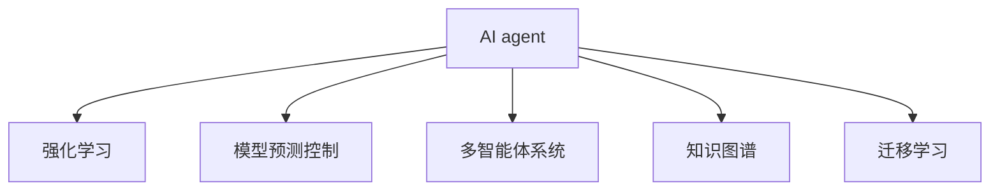

                 

# AI Agent: AI的下一个风口 解决方案与研究方向

## 1. 背景介绍

### 1.1 问题由来
人工智能（AI）已经取得了巨大的进展，从语音识别、图像识别到自然语言处理（NLP），AI技术在各个领域都有了广泛的应用。然而，随着技术的进一步发展，AI技术也面临着新的挑战和机遇。AI agent作为AI技术的下一个风口，正在成为各大公司、研究机构和初创企业的热门话题。

### 1.2 问题核心关键点
AI agent是指在特定环境中自主执行任务的智能体。它可以通过观察和互动来理解环境，做出决策，并执行相应的动作。AI agent的研发不仅涉及计算机视觉、自然语言处理、机器人学等多个领域，还需要跨学科的合作和研究。AI agent的研究目标是在复杂、多变的环境下实现自主、高效、智能的决策和行动，解决诸如无人驾驶、智能客服、智能推荐等实际问题。

## 2. 核心概念与联系

### 2.1 核心概念概述

为更好地理解AI agent的研究框架，本节将介绍几个关键概念：

- AI agent：在特定环境中自主执行任务的智能体，可以通过观察、学习和推理来适应环境变化，实现复杂任务。
- 强化学习（Reinforcement Learning, RL）：通过智能体与环境的交互，不断优化决策策略，使智能体最大化预期回报的一种学习范式。
- 模型预测控制（Model Predictive Control, MPC）：通过预测未来环境状态和决策结果，优化当前决策，实现系统的稳定性和鲁棒性。
- 多智能体系统（Multi-Agent System,MAS）：由多个智能体组成的系统，智能体之间可以协作、竞争或对抗，实现更复杂的任务。
- 知识图谱（Knowledge Graph,KG）：用于表示实体、属性和实体间关系的图结构数据，可用于辅助智能体理解复杂环境。
- 迁移学习（Transfer Learning）：通过将一个领域学到的知识迁移到另一个领域，加速新领域的学习过程。

这些概念之间的逻辑关系可以通过以下Mermaid流程图来展示：



这个流程图展示了几大核心概念及其之间的关系：

1. AI agent通过强化学习、模型预测控制、多智能体系统等方法，逐步优化决策策略。
2. 知识图谱和多智能体系统为AI agent提供了更丰富的环境和关系信息。
3. 迁移学习加速了新领域的学习过程，扩大了AI agent的应用范围。

## 3. 核心算法原理 & 具体操作步骤

### 3.1 算法原理概述

AI agent的核心算法是强化学习，通过智能体与环境的交互，不断优化决策策略，实现复杂任务的执行。强化学习的基本框架包括智能体、环境和奖励信号。智能体在环境中执行动作，环境根据动作改变状态并返回奖励信号，智能体通过学习决策策略，最大化累计奖励。

### 3.2 算法步骤详解

AI agent的训练过程一般包括以下几个关键步骤：

**Step 1: 定义问题与目标**
- 确定AI agent的任务和目标，如导航、路径规划、任务分配等。
- 定义环境状态和动作空间，如地图、机器人关节、动作指令等。

**Step 2: 构建模型与策略**
- 选择适当的模型，如Q-learning、策略梯度、深度强化学习等。
- 设计策略函数，用于计算在给定状态下采取最优动作的概率。

**Step 3: 模拟与训练**
- 构建模拟环境，用于训练AI agent。
- 使用模拟环境生成训练数据，如状态-动作-奖励三元组。
- 通过模型预测控制或基于经验回放的强化学习算法，更新智能体的决策策略。

**Step 4: 测试与评估**
- 在真实环境中测试AI agent的性能。
- 使用适当的评估指标，如成功率、路径长度、资源消耗等。
- 不断优化模型和策略，提升AI agent的鲁棒性和适应性。

### 3.3 算法优缺点

强化学习在AI agent中的应用具有以下优点：

- 自主决策：强化学习可以自主探索环境，不需要人工干预。
- 鲁棒性强：通过与环境的不断交互，AI agent能够适应复杂多变的环境。
- 适用范围广：可以应用于各种智能体系统，如机器人、无人机、自动驾驶等。

但强化学习也存在一些缺点：

- 学习效率低：需要大量数据和计算资源进行训练，学习过程较长。
- 策略不稳定：由于存在探索和利用之间的平衡问题，策略可能会在训练过程中不稳定。
- 需要设计良好的奖励函数：奖励函数的定义需要仔细考虑，否则可能导致智能体陷入局部最优解。

### 3.4 算法应用领域

AI agent的算法已经在多个领域得到了应用，例如：

- 机器人导航：在复杂的室内外环境中，AI agent能够自主导航并完成任务。
- 自动驾驶：AI agent可以通过感知、决策和控制，实现无人驾驶车辆的安全行驶。
- 智能客服：AI agent可以理解客户需求，并提供自动化的客户服务。
- 智能推荐：AI agent可以根据用户行为和历史数据，推荐个性化内容。
- 路径规划：AI agent可以优化路线选择，减少能源消耗和交通拥堵。
- 动态调度：AI agent可以优化任务分配和资源调度，提升生产效率。

## 4. 数学模型和公式 & 详细讲解 & 举例说明

### 4.1 数学模型构建

AI agent的强化学习问题可以形式化为：

- 状态空间：$S$
- 动作空间：$A$
- 奖励函数：$R: S \times A \rightarrow [0, 1]$
- 状态转移概率：$P: S \times A \rightarrow S$

在强化学习中，智能体的目标是最大化累计奖励$J(\pi)$，其中$\pi$为策略函数。可以使用值函数$V(s)$或策略函数$\pi(a|s)$来表示最优策略。

### 4.2 公式推导过程

以Q-learning算法为例，其核心思想是通过经验回放，不断优化策略函数。具体推导如下：

$$
Q(s, a) \leftarrow Q(s, a) + \alpha [r + \gamma \max_a Q(s', a') - Q(s, a)]
$$

其中，$r$为即时奖励，$\gamma$为折扣因子，$\alpha$为学习率。

### 4.3 案例分析与讲解

考虑一个简单的环境，智能体需要从起点$S_0$到达终点$S_T$，路径上存在障碍物。智能体可以通过移动$A_0$和$A_1$来避免障碍物，并获取奖励。

假设智能体在状态$S_0$采取动作$A_0$，转移到状态$S_1$，奖励为$0.8$，智能体的Q值更新为：

$$
Q(S_0, A_0) \leftarrow Q(S_0, A_0) + \alpha [0.8 - Q(S_0, A_0)]
$$

智能体在状态$S_1$可以选择$A_0$或$A_1$，通过比较两个动作的Q值，选择最优动作。假设智能体选择$A_0$，转移到状态$S_2$，奖励为$0.5$，智能体的Q值更新为：

$$
Q(S_1, A_0) \leftarrow Q(S_1, A_0) + \alpha [0.5 - Q(S_1, A_0)]
$$

智能体在状态$S_2$可以选择$A_0$或$A_1$，选择最优动作。假设智能体选择$A_0$，到达终点$S_T$，智能体的Q值更新为：

$$
Q(S_2, A_0) \leftarrow Q(S_2, A_0) + \alpha [1 - Q(S_2, A_0)]
$$

通过不断更新Q值，智能体能够学习最优的策略函数，实现从起点到终点的自主导航。

## 5. 项目实践：代码实例和详细解释说明

### 5.1 开发环境搭建

在进行AI agent的开发前，我们需要准备好开发环境。以下是使用Python进行Reinforcement Learning开发的环境配置流程：

1. 安装Anaconda：从官网下载并安装Anaconda，用于创建独立的Python环境。

2. 创建并激活虚拟环境：
```bash
conda create -n reinlearning python=3.8 
conda activate reinlearning
```

3. 安装相关依赖包：
```bash
pip install numpy scipy matplotlib gym gymnasium pyglet
```

4. 安装Reinforcement Learning框架：
```bash
pip install gym
pip install gym[atari]
```

5. 安装强化学习库：
```bash
pip install ray reinforcement
```

完成上述步骤后，即可在`reinlearning`环境中开始AI agent的开发。

### 5.2 源代码详细实现

这里我们以一个简单的路径规划问题为例，使用Reinforcement Learning库实现AI agent的路径规划。

```python
import gymnasium as gym
import numpy as np

# 创建环境
env = gym.make('GridWorld-v0')
env.render()

# 定义动作空间
actions = np.array([0, 1, 2, 3])

# 定义状态空间
state_size = 4
observation = np.zeros((state_size, state_size), dtype=np.int)

# 定义奖励函数
def reward(state, action):
    if state == 0:
        return 1
    else:
        return 0

# 定义状态转移概率
def transition(state, action):
    next_state = state - 1
    if next_state < 0 or next_state >= state_size:
        next_state = 0
    return next_state

# 定义策略函数
def policy(state, action):
    return action

# 训练AI agent
for episode in range(10000):
    state = observation
    done = False
    while not done:
        action = policy(state)
        next_state = transition(state, action)
        reward_next = reward(next_state, action)
        state = next_state
        if next_state == 0:
            done = True

# 测试AI agent
state = observation
done = False
while not done:
    action = policy(state)
    next_state = transition(state, action)
    reward_next = reward(next_state, action)
    state = next_state
    if next_state == 0:
        done = True
    env.render()
```

### 5.3 代码解读与分析

这段代码展示了AI agent的路径规划过程。我们首先创建了一个4x4的GridWorld环境，并通过定义奖励函数和状态转移概率来模拟路径规划问题。智能体的策略函数是一个简单的贪心策略，即始终选择与当前状态最近的未访问状态。

在训练过程中，智能体通过不断的探索和利用，逐渐学习到最优的路径规划策略。在测试阶段，智能体能够自主导航到目标状态，并打印出路径信息。

## 6. 实际应用场景

### 6.1 智慧物流

AI agent在智慧物流中的应用，可以实现货物自主导航、路径规划和配送优化。通过在仓库和运输车辆中安装AI agent，可以大大提升物流效率和准确性。AI agent能够自主躲避障碍物，选择最优路径，避免拥堵，并动态调整配送策略，减少运输成本。

### 6.2 智能制造

AI agent在智能制造中的应用，可以实现生产任务的自动调度、资源优化和异常检测。通过在生产线上安装AI agent，可以实时监控设备状态，自动调整生产参数，避免设备故障，提升生产效率。AI agent能够自主学习和适应新的生产任务，适应不同工人的操作习惯，实现个性化生产。

### 6.3 智能交通

AI agent在智能交通中的应用，可以实现交通流控制、路径规划和事故处理。通过在交通系统中安装AI agent，可以实时监控交通流量，自动调整红绿灯信号，避免拥堵，并动态调整路径规划策略，提高交通效率。AI agent能够自主学习和适应不同的交通场景，实现智能驾驶和自动停车。

### 6.4 未来应用展望

随着AI agent技术的发展，未来的应用场景将更加广泛和深入。AI agent将在医疗、教育、娱乐等多个领域发挥重要作用，为人类生活带来更多便利和智慧。以下是一些可能的未来应用：

- 智能医疗：AI agent可以用于病患监测、诊断和治疗方案推荐。通过分析患者数据，AI agent能够自主学习，并根据患者情况推荐最优的诊疗方案。
- 智能教育：AI agent可以用于智能辅导、课程推荐和作业批改。通过分析学生数据，AI agent能够自主学习，并根据学生的兴趣和能力推荐最优的课程和作业。
- 智能娱乐：AI agent可以用于游戏对战、内容推荐和用户交互。通过分析用户行为，AI agent能够自主学习，并根据用户喜好推荐最优的游戏内容和互动方式。

## 7. 工具和资源推荐

### 7.1 学习资源推荐

为了帮助开发者系统掌握AI agent的研究框架，这里推荐一些优质的学习资源：

1. Reinforcement Learning with Python：由Reinforcement Learning领域的专家撰写，深入浅出地介绍了强化学习的原理和实现方法，适合初学者学习。

2. Deep Reinforcement Learning：由Deep Learning领域的专家撰写，介绍了深度强化学习的最新进展和应用，适合有基础的开发者学习。

3. CS261A：斯坦福大学的强化学习课程，涵盖了强化学习的基本概念和最新算法，适合研究生学习。

4. OpenAI Gym：一个开源的强化学习框架，提供了丰富的环境和算法库，适合进行算法实验和开发。

5. TensorFlow Agents：TensorFlow的强化学习库，提供了各种强化学习算法和训练工具，适合进行大规模实验和部署。

通过对这些资源的学习实践，相信你一定能够快速掌握AI agent的研究框架，并用于解决实际的AI问题。

### 7.2 开发工具推荐

高效的开发离不开优秀的工具支持。以下是几款用于AI agent开发的常用工具：

1. TensorFlow：由Google主导开发的开源深度学习框架，适合进行大规模强化学习实验和部署。

2. PyTorch：由Facebook主导开发的开源深度学习框架，适合进行高效的强化学习实验和优化。

3. OpenAI Gym：一个开源的强化学习框架，提供了丰富的环境和算法库，适合进行算法实验和开发。

4. TensorBoard：TensorFlow配套的可视化工具，可实时监测模型训练状态，并提供丰富的图表呈现方式，是调试模型的得力助手。

5. Weights & Biases：模型训练的实验跟踪工具，可以记录和可视化模型训练过程中的各项指标，方便对比和调优。

6. Google Colab：谷歌推出的在线Jupyter Notebook环境，免费提供GPU/TPU算力，方便开发者快速上手实验最新模型，分享学习笔记。

合理利用这些工具，可以显著提升AI agent的开发效率，加快创新迭代的步伐。

### 7.3 相关论文推荐

AI agent的研究源于学界的持续研究。以下是几篇奠基性的相关论文，推荐阅读：

1. AlphaGo Zero：DeepMind开发的AlphaGo Zero算法，通过自我博弈和强化学习，达到了超级围棋的顶尖水平。

2. DeepMind AI：DeepMind开发的AI系统，实现了机器人在复杂环境中的自主导航和操作。

3. OpenAI Five：OpenAI开发的Dota2机器人，通过强化学习，达到了人类顶级选手的水平。

4. Reinforcement Learning for Playing Go：DeepMind开发的强化学习算法，通过自我博弈和奖励函数设计，实现了超级围棋的自主学习和竞争。

5. Human-AI Collaboration in Atari Games：DeepMind开发的多智能体系统，实现了多个智能体在复杂游戏中的协作和竞争。

这些论文代表了大规模强化学习的研究进展，展示了AI agent在复杂环境中的自主学习和适应能力。通过学习这些前沿成果，可以帮助研究者把握学科前进方向，激发更多的创新灵感。

## 8. 总结：未来发展趋势与挑战

### 8.1 总结

本文对AI agent的研究框架和实现方法进行了全面系统的介绍。首先阐述了AI agent的研究背景和目标，明确了AI agent在复杂环境下的自主决策和执行能力。其次，从原理到实践，详细讲解了强化学习的核心算法和操作步骤，给出了AI agent的代码实现和详细解释。同时，本文还探讨了AI agent在多个领域的应用场景，展示了AI agent技术的广泛前景。最后，本文精选了AI agent技术的各类学习资源，力求为读者提供全方位的技术指引。

通过本文的系统梳理，可以看到，AI agent技术在复杂环境下的自主决策和执行能力，为AI技术的应用开辟了新的领域。AI agent的研发不仅需要深入研究强化学习等核心算法，还需要跨学科的合作和创新，才能不断拓展AI技术的应用范围。

### 8.2 未来发展趋势

展望未来，AI agent技术将呈现以下几个发展趋势：

1. 多智能体系统的发展：多智能体系统将更加复杂，智能体之间的协作和竞争将更加智能化和动态化。通过多智能体系统，可以实现更加复杂的任务，如群体协作、对抗博弈等。

2. 深度强化学习的应用：深度强化学习将在AI agent中得到更广泛的应用，通过深度神经网络，智能体可以学习更复杂的环境和决策策略。

3. 强化学习的优化：强化学习算法将更加高效和鲁棒，通过引入迁移学习、对抗训练等方法，提升AI agent的适应性和鲁棒性。

4. 知识图谱的融合：知识图谱将与AI agent更加紧密地结合，通过知识图谱辅助智能体理解环境和执行任务，提升AI agent的智能水平。

5. 跨领域应用：AI agent将应用于更多领域，如医疗、教育、交通等，通过跨领域应用，提升AI agent的通用性和实用性。

以上趋势凸显了AI agent技术的广阔前景。这些方向的探索发展，必将进一步提升AI agent的性能和应用范围，为AI技术带来新的突破。

### 8.3 面临的挑战

尽管AI agent技术已经取得了显著进展，但在迈向更加智能化、普适化应用的过程中，仍面临诸多挑战：

1. 数据获取难度大：AI agent需要大量数据进行训练，获取高质量数据往往需要耗费大量时间和成本。

2. 模型复杂度高：AI agent模型往往需要大量参数进行训练，模型复杂度高，训练和推理过程消耗大量资源。

3. 策略不稳定：强化学习中的策略不稳定，容易陷入局部最优解，需要通过各种方法进行优化。

4. 应用场景复杂：AI agent需要在复杂多变的环境中执行任务，环境变化和干扰因素复杂，需要设计更加鲁棒的模型和策略。

5. 伦理和安全问题：AI agent在决策过程中可能会涉及伦理和安全问题，如何确保决策的公平性和安全性，是一个重要课题。

6. 跨学科合作难度大：AI agent的研发需要跨学科的合作和研究，各领域之间的沟通和协作难度较大。

正视AI agent面临的这些挑战，积极应对并寻求突破，将使AI agent技术不断进步和完善。

### 8.4 研究展望

面对AI agent面临的挑战，未来的研究需要在以下几个方面寻求新的突破：

1. 数据增强：通过数据增强方法，提升AI agent的数据获取效率和质量，加速训练过程。

2. 模型压缩：通过模型压缩和优化，降低AI agent的复杂度和资源消耗，提高训练和推理效率。

3. 鲁棒性优化：通过鲁棒性优化方法，提升AI agent的适应性和鲁棒性，应对环境变化和干扰因素。

4. 跨领域应用：通过跨领域应用，提升AI agent的通用性和实用性，拓展应用范围。

5. 伦理和安全保障：通过伦理和安全保障措施，确保AI agent决策的公平性和安全性，避免伦理和安全问题。

6. 跨学科合作：通过跨学科的合作和研究，解决各领域之间的沟通和协作问题，推动AI agent技术的进步。

这些研究方向的探索，必将引领AI agent技术迈向更高的台阶，为构建智慧社会和智能系统铺平道路。面向未来，AI agent技术需要从技术、伦理、安全等多个维度协同发力，才能不断拓展AI技术的应用范围，推动AI技术的发展和应用。

## 9. 附录：常见问题与解答

**Q1：AI agent是否适用于所有任务？**

A: AI agent适用于需要自主决策和执行的任务，如路径规划、游戏对战、智能客服等。但对于需要大量人类知识和经验的任务，如医生诊断、律师咨询等，AI agent可能难以胜任。

**Q2：AI agent在复杂环境下的适应能力如何？**

A: AI agent在复杂环境下的适应能力较强，可以通过自我学习和适应，解决复杂任务。但环境变化和干扰因素复杂时，需要设计更加鲁棒的模型和策略。

**Q3：AI agent的训练过程需要多少数据？**

A: AI agent的训练过程需要大量数据，一般建议数据量在数千到数万个样本之间。数据量不足时，可以通过数据增强方法提升训练效率和效果。

**Q4：AI agent的训练和推理过程消耗多少资源？**

A: AI agent的训练和推理过程需要大量资源，包括计算资源和存储空间。可以通过模型压缩、稀疏化存储等方法进行优化，降低资源消耗。

**Q5：AI agent的伦理和安全问题如何解决？**

A: AI agent的伦理和安全问题可以通过多学科合作和设计来解决。通过引入伦理和安全保障措施，确保AI agent决策的公平性和安全性。

本文通过系统介绍AI agent的研究框架和实现方法，展示了AI agent在复杂环境下的自主决策和执行能力，为AI技术的应用开辟了新的领域。AI agent技术的未来发展前景广阔，相信通过学界和产业界的共同努力，AI agent技术将在更多领域得到应用，为人类社会带来更多的智慧和便利。

