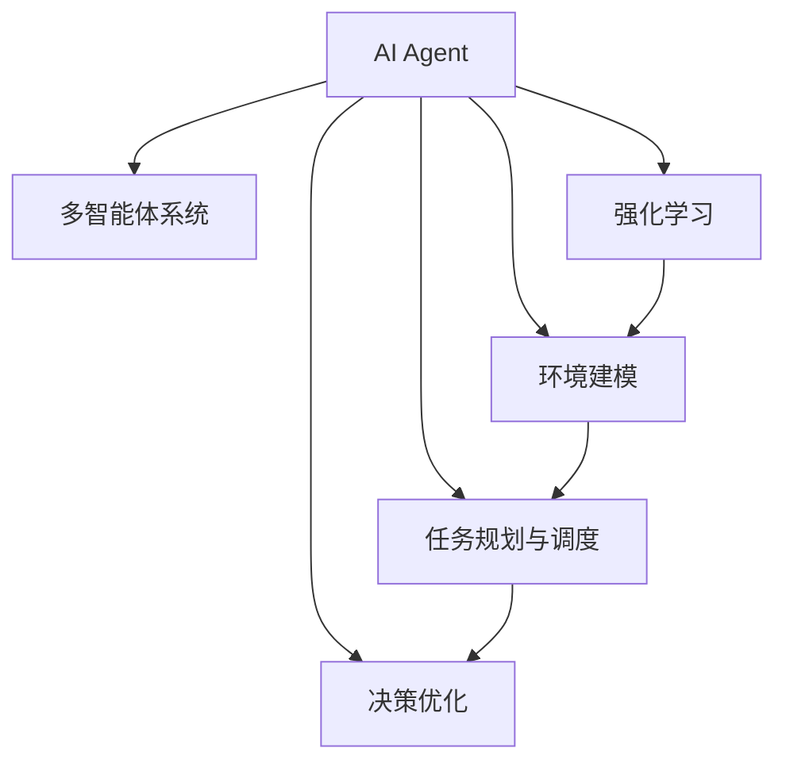

                 

# AI Agent核心技术的探索

> 关键词：人工智能,智能代理,强化学习,多智能体,环境建模,任务规划,决策优化,算法设计与实现

## 1. 背景介绍

### 1.1 问题由来

在当今高度信息化的时代，无论是智能家居、自动驾驶、工业自动化还是金融服务，AI Agent（智能代理）的身影无处不在。AI Agent能够自主执行复杂任务，优化决策过程，极大提高了工作效率和用户体验。AI Agent的核心在于，它具有高度的智能和自主性，能够根据环境变化调整行为策略。

但是，AI Agent的构建并非易事。它需要融合多种先进技术，如深度学习、强化学习、多智能体系统等，才能有效处理复杂的任务场景。随着AI Agent在各个领域的应用深入，对于AI Agent核心技术的探索和优化也成为研究重点。

### 1.2 问题核心关键点

AI Agent的核心技术主要包括环境建模、任务规划、决策优化等。其中，环境建模指通过感知和预测，构建AI Agent所在环境的模型；任务规划涉及如何定义和生成具体的行动计划；决策优化则是在特定环境下，通过一系列计算和策略，选择最优的行动路径。

AI Agent的核心关键点包括：
- 多智能体系统：多个AI Agent如何在同一环境中协作。
- 强化学习：AI Agent如何通过试错学习，优化决策过程。
- 深度学习：如何利用神经网络，处理和提取复杂的数据信息。
- 环境建模：如何构建AI Agent所在环境的数学模型。
- 任务规划与调度：如何动态规划和调度任务的执行路径。

这些问题核心关键点相互交织，形成了AI Agent技术的完整框架。

## 2. 核心概念与联系

### 2.1 核心概念概述

为更好地理解AI Agent的核心技术，本节将介绍几个密切相关的核心概念：

- **AI Agent**：指能够自主执行任务、优化决策过程的人工智能系统。AI Agent可以是单个智能体，也可以是多个智能体组成的系统，能够感知环境、学习、规划和执行任务。
- **多智能体系统**：指多个AI Agent共同协作，通过通信和交互，优化全局任务的目标。
- **强化学习**：指AI Agent通过与环境互动，根据奖励信号不断调整策略，以最大化预期回报的机器学习方法。
- **环境建模**：指通过感知和预测，构建AI Agent所在环境的数学模型，包括状态空间、动态方程和奖励函数等。
- **任务规划与调度**：指如何动态规划和调度任务的执行路径，包括路径规划、时间优化、资源分配等。
- **决策优化**：指在特定环境下，通过一系列计算和策略，选择最优的行动路径，以最大化目标函数。

这些核心概念之间的逻辑关系可以通过以下Mermaid流程图来展示：



这个流程图展示了她核心概念之间的逻辑关系：

1. AI Agent通过强化学习、环境建模和任务规划与调度，实现自主执行任务。
2. 多智能体系统是多个AI Agent协作的系统，通过通信和交互优化全局任务。
3. 决策优化在特定环境下选择最优行动路径，优化AI Agent的决策。

这些概念共同构成了AI Agent的核心技术框架，使其能够灵活应对各种复杂的任务场景。

## 3. 核心算法原理 & 具体操作步骤

### 3.1 算法原理概述

AI Agent的核心算法原理主要涉及多智能体系统、强化学习、环境建模和任务规划等方面。其核心思想是通过多智能体系统协同优化全局任务，利用强化学习不断调整AI Agent的行为策略，构建环境的数学模型，动态规划任务的执行路径，从而实现高效的决策优化。

具体来说，AI Agent通过感知环境，构建环境的数学模型，然后在此基础上进行任务规划和决策优化。环境建模主要涉及如何构建状态空间、动态方程和奖励函数，任务规划和决策优化则涉及到路径规划、时间优化和资源分配等。

### 3.2 算法步骤详解

AI Agent的核心算法步骤主要包括以下几个方面：

**Step 1: 环境感知与建模**

- 感知环境：通过传感器获取环境的状态信息，包括位置、速度、障碍物等。
- 构建环境模型：基于感知信息，建立环境的数学模型，包括状态空间、动态方程和奖励函数。
- 环境仿真：使用模型对环境进行仿真，预测未来的状态和奖励。

**Step 2: 任务规划与调度**

- 任务定义：根据目标任务，定义具体的执行路径和动作空间。
- 路径规划：在构建的环境模型基础上，规划出最优的路径。
- 时间优化：考虑时间成本，优化路径的执行顺序。
- 资源分配：根据环境资源，合理分配任务执行所需的资源。

**Step 3: 强化学习**

- 策略定义：根据任务定义，定义AI Agent的策略。
- 试错学习：通过与环境的互动，利用奖励信号不断调整策略。
- 策略优化：使用强化学习算法，优化策略参数，以最大化预期回报。

**Step 4: 决策优化**

- 决策空间：构建决策空间，确定可能的行动路径。
- 目标函数：定义目标函数，衡量不同行动路径的优劣。
- 优化算法：使用优化算法，选择最优的行动路径。

**Step 5: 执行与反馈**

- 执行决策：将最优的行动路径付诸实施。
- 获取反馈：获取执行结果的反馈信息，更新环境模型和奖励函数。
- 继续学习：根据反馈信息，更新策略，继续优化决策过程。

通过上述步骤，AI Agent能够不断优化决策过程，高效完成任务。

### 3.3 算法优缺点

AI Agent的核心算法具有以下优点：

1. **自主性强**：AI Agent能够自主感知环境，动态规划任务执行路径，具有高度的自主性。
2. **决策优化**：通过强化学习和决策优化算法，AI Agent能够选择最优的行动路径，最大化目标函数。
3. **协同优化**：多智能体系统能够通过通信和交互，协同优化全局任务。
4. **适应性强**：能够适应动态变化的环境，灵活调整策略。

然而，AI Agent的核心算法也存在一些缺点：

1. **复杂度高**：算法步骤繁多，涉及环境建模、任务规划、策略优化等多个方面，实施复杂。
2. **计算量大**：强化学习和决策优化需要大量的计算，特别是在高维状态空间和动作空间下，计算量较大。
3. **模型依赖**：算法的性能很大程度上依赖于环境模型的准确性和复杂度。

尽管存在这些局限性，AI Agent的核心算法仍具有广阔的应用前景，特别是在复杂任务和动态环境下的场景。

### 3.4 算法应用领域

AI Agent的核心算法已经广泛应用于多个领域，如自动驾驶、工业自动化、金融交易、智能家居等。以下是几个典型应用场景：

- **自动驾驶**：AI Agent感知道路状态，规划最优行驶路径，执行驾驶决策，以确保安全和高效。
- **工业自动化**：AI Agent根据生产任务，动态规划操作路径，执行装配、检测等操作，提高生产效率。
- **金融交易**：AI Agent通过分析市场数据，构建交易策略，执行买卖操作，优化投资回报。
- **智能家居**：AI Agent感知家庭环境，规划家电控制路径，执行自动化操作，提升生活质量。

AI Agent的核心算法还在不断拓展应用领域，为各行各业带来新的变革和机遇。

## 4. 数学模型和公式 & 详细讲解 & 举例说明

### 4.1 数学模型构建

在本节中，我们将使用数学语言对AI Agent的核心算法进行更加严格的刻画。

假设环境的状态空间为 $S$，动作空间为 $A$，奖励函数为 $R$，环境动态方程为 $T$。AI Agent在状态 $s_t$ 下，选择动作 $a_t$，观察到下一个状态 $s_{t+1}$，并获得奖励 $r_{t+1}$。

AI Agent的目标是最大化预期回报 $J$，即：

$$
J(\pi) = \mathbb{E}_{\pi}\left[\sum_{t=0}^{\infty}\gamma^t R(s_t,a_t)\right]
$$

其中 $\pi$ 为策略，$\gamma$ 为折扣因子。

### 4.2 公式推导过程

根据强化学习的核心思想，我们可以使用动态规划的方法，求解最优策略 $\pi^*$。具体推导过程如下：

**Step 1: 值函数推导**

定义状态值函数 $V(s)$，表示在状态 $s$ 下的预期回报：

$$
V(s) = \mathbb{E}_{\pi}\left[\sum_{t=0}^{\infty}\gamma^t R(s_t,a_t)\right]
$$

将状态值函数代入贝尔曼方程中，得到：

$$
V(s) = \max_a \left\{ Q(s,a) + \gamma \sum_{s'} P(s'|s,a)V(s') \right\}
$$

其中 $Q(s,a)$ 为状态动作值函数，$P(s'|s,a)$ 为环境动态方程。

**Step 2: 策略推导**

定义策略 $\pi(a|s)$，表示在状态 $s$ 下选择动作 $a$ 的概率：

$$
\pi(a|s) = \frac{e^{\frac{Q(s,a)}{\sigma}}}{\sum_a e^{\frac{Q(s,a)}{\sigma}}}
$$

其中 $\sigma$ 为温度参数，影响策略的软硬程度。

**Step 3: 优化目标函数**

目标函数为：

$$
J(\pi) = \sum_{s,a}\pi(a|s)Q(s,a)
$$

在约束条件 $0 \leq \pi(a|s) \leq 1$ 下，最大化目标函数 $J(\pi)$。

通过上述公式推导，我们可以使用动态规划和策略优化算法，求解出最优策略 $\pi^*$。

### 4.3 案例分析与讲解

为了更好地理解上述公式，我们以自动驾驶为例进行详细讲解。

在自动驾驶场景中，AI Agent感知道路状态，规划最优行驶路径，执行驾驶决策。假设道路状态空间为 $S = (x,y,\theta,\dot{x},\dot{y},\dot{\theta},...)$，动作空间为 $A = (\text{加速}, \text{减速}, \text{转向},...)$. 奖励函数为 $R = \text{安全奖励} - \text{碰撞惩罚}$。

假设AI Agent在状态 $s_t = (x_t,y_t,\theta_t,\dot{x}_t,\dot{y}_t,\dot{\theta}_t,...)$ 下，选择动作 $a_t = (\text{加速}, \text{减速}, \text{转向},...)$. 观察到下一个状态 $s_{t+1} = (x_{t+1},y_{t+1},\theta_{t+1},...)$. 并获得奖励 $r_{t+1}$。

通过上述公式，我们可以求解出AI Agent的最优驾驶策略，实现自动驾驶任务。

## 5. 项目实践：代码实例和详细解释说明

### 5.1 开发环境搭建

在进行AI Agent项目实践前，我们需要准备好开发环境。以下是使用Python进行Reinforcement Learning（RL）开发的环境配置流程：

1. 安装Anaconda：从官网下载并安装Anaconda，用于创建独立的Python环境。

2. 创建并激活虚拟环境：
```bash
conda create -n reinforcement-env python=3.8 
conda activate reinforcement-env
```

3. 安装PyTorch、Torchvision、Matplotlib等工具包：
```bash
pip install torch torchvision matplotlib tqdm jupyter notebook ipython
```

4. 安装Reinforcement Learning相关库：
```bash
pip install gym
```

5. 安装OpenAI Gym库：
```bash
pip install gym[atari]
```

完成上述步骤后，即可在`reinforcement-env`环境中开始RL项目实践。

### 5.2 源代码详细实现

下面我们以CartPole平衡任务为例，给出使用Reinforcement Learning对AI Agent进行训练的PyTorch代码实现。

首先，定义CartPole环境：

```python
import gym
import numpy as np

env = gym.make('CartPole-v1')
```

然后，定义AI Agent，这里我们以DQN为例：

```python
import torch
import torch.nn as nn
import torch.optim as optim

class DQN(nn.Module):
    def __init__(self, state_dim, action_dim):
        super(DQN, self).__init__()
        self.fc1 = nn.Linear(state_dim, 64)
        self.fc2 = nn.Linear(64, 64)
        self.fc3 = nn.Linear(64, action_dim)
        
    def forward(self, x):
        x = nn.functional.relu(self.fc1(x))
        x = nn.functional.relu(self.fc2(x))
        return self.fc3(x)
        
def select_action(model, state, epsilon, q_value):
    if np.random.uniform() < epsilon:
        return env.action_space.sample()
    else:
        q_value = model(state.unsqueeze(0))
        return np.argmax(q_value[0])
```

接着，定义训练函数：

```python
def train(model, optimizer, replay_buffer, batch_size, num_steps, epsilon, num_episodes):
    for episode in range(num_episodes):
        state = env.reset()
        done = False
        rewards = []
        
        for step in range(num_steps):
            action = select_action(model, torch.tensor([state], dtype=torch.float32), epsilon, model)
            next_state, reward, done, _ = env.step(action)
            
            q_value = model(torch.tensor([state], dtype=torch.float32))
            target_q_value = torch.tensor([reward + 0.99 * q_value[0][np.argmax(reward_model(torch.tensor([next_state], dtype=torch.float32))]], dtype=torch.float32)
            loss = nn.functional.mse_loss(q_value, target_q_value)
            
            optimizer.zero_grad()
            loss.backward()
            optimizer.step()
            
            state = next_state
            rewards.append(reward)
            
            if done:
                break
        
        print("Episode {}: Reward = {}".format(episode+1, sum(rewards)))
```

最后，启动训练流程：

```python
state_dim = env.observation_space.shape[0]
action_dim = env.action_space.n
replay_buffer_size = 10000
batch_size = 32
num_steps = 100
epsilon = 0.99
num_episodes = 1000

state_dim = env.observation_space.shape[0]
action_dim = env.action_space.n

replay_buffer = []
model = DQN(state_dim, action_dim)
optimizer = optim.Adam(model.parameters(), lr=0.001)

for episode in range(num_episodes):
    state = env.reset()
    done = False
    rewards = []
    
    for step in range(num_steps):
        action = select_action(model, torch.tensor([state], dtype=torch.float32), epsilon, model)
        next_state, reward, done, _ = env.step(action)
        
        q_value = model(torch.tensor([state], dtype=torch.float32))
        target_q_value = torch.tensor([reward + 0.99 * q_value[0][np.argmax(reward_model(torch.tensor([next_state], dtype=torch.float32))]], dtype=torch.float32)
        loss = nn.functional.mse_loss(q_value, target_q_value)
        
        optimizer.zero_grad()
        loss.backward()
        optimizer.step()
        
        state = next_state
        rewards.append(reward)
        
        if done:
            break
    
    print("Episode {}: Reward = {}".format(episode+1, sum(rewards)))
```

以上就是使用PyTorch对AI Agent进行CartPole平衡任务训练的完整代码实现。可以看到，通过简单的几行代码，我们已经构建了基于深度Q学习的AI Agent，并对其进行了训练。

### 5.3 代码解读与分析

让我们再详细解读一下关键代码的实现细节：

**CartPole环境定义**：
- 使用Gym库创建CartPole环境，该环境包含一个小的车体，通过施力让其在重力作用下进行平衡，以防止车体倾覆。

**DQN模型定义**：
- 定义DQN模型，包括三个全连接层，输入为状态，输出为动作值，使用ReLU激活函数。
- 模型前向传播时，将输入状态通过多个全连接层进行传递，最终输出动作值的概率分布。

**选择动作函数**：
- 定义选择动作函数，该函数根据当前状态和模型输出，确定AI Agent的下一步动作。若随机数小于 epsilon，则随机选择动作，否则根据模型输出的概率分布选择最优动作。

**训练函数**：
- 在每轮训练中，重置环境，执行一系列动作，并记录每步的奖励。
- 根据当前状态和下一状态，计算当前状态的Q值和目标Q值，计算损失函数，反向传播更新模型参数。
- 记录每轮的奖励，并在轮次结束后打印结果。

**启动训练流程**：
- 定义状态维度和动作维度，创建Replay Buffer。
- 创建DQN模型和Adam优化器。
- 循环训练 num_episodes 轮，每轮执行 num_steps 步，根据状态、动作和奖励更新模型参数。
- 在每轮结束时，打印该轮的奖励。

通过这些步骤，我们可以使用PyTorch实现一个简单的DQN AI Agent，并在CartPole环境中进行训练。这个简单的例子展示了AI Agent的基本构建过程，为后续更复杂的项目实践提供了参考。

## 6. 实际应用场景

### 6.1 自动驾驶

自动驾驶是AI Agent的重要应用场景之一。在自动驾驶中，AI Agent需要感知道路状态，规划最优行驶路径，执行驾驶决策，以确保安全和高效。自动驾驶中的AI Agent通常使用多智能体系统，通过通信和交互，协同优化全局任务。

AI Agent在自动驾驶中的主要任务包括：

- 环境感知：通过传感器获取道路状态信息，包括位置、速度、障碍物等。
- 路径规划：基于感知信息，规划最优行驶路径。
- 决策优化：在特定环境下，选择最优的行驶策略。

在实际应用中，AI Agent通常需要结合多传感器数据，如激光雷达、摄像头、GPS等，进行实时感知和决策。同时，还需要通过强化学习算法，不断调整行驶策略，优化路径规划，提高自动驾驶的鲁棒性和安全性。

### 6.2 工业自动化

工业自动化中的AI Agent需要根据生产任务，动态规划操作路径，执行装配、检测等操作，提高生产效率。工业自动化中的AI Agent通常使用多智能体系统，通过通信和交互，协同优化全局任务。

AI Agent在工业自动化中的主要任务包括：

- 任务规划：根据生产任务，定义具体的执行路径和动作空间。
- 资源分配：根据环境资源，合理分配任务执行所需的资源。
- 协同优化：通过通信和交互，协同优化全局任务。

在实际应用中，AI Agent通常需要结合工业机器人和自动化设备，进行实时操作和决策。同时，还需要通过强化学习算法，不断调整操作策略，优化资源分配，提高生产效率和质量。

### 6.3 金融交易

金融交易中的AI Agent通过分析市场数据，构建交易策略，执行买卖操作，优化投资回报。金融交易中的AI Agent通常使用多智能体系统，通过通信和交互，协同优化全局任务。

AI Agent在金融交易中的主要任务包括：

- 市场分析：通过分析市场数据，构建交易策略。
- 决策优化：在特定环境下，选择最优的买卖操作。
- 风险管理：通过风险评估，优化投资回报。

在实际应用中，AI Agent通常需要结合实时数据和大数据技术，进行市场分析和决策优化。同时，还需要通过强化学习算法，不断调整交易策略，优化风险管理，提高投资回报。

### 6.4 未来应用展望

随着AI Agent技术的不断发展，未来其在更多领域的应用前景广阔。

在智慧城市治理中，AI Agent可用于城市事件监测、舆情分析、应急指挥等环节，提高城市管理的自动化和智能化水平，构建更安全、高效的未来城市。

在企业生产中，AI Agent可用于自动化装配、检测、维护等环节，提高生产效率和产品质量，降低人工成本。

在社会治理中，AI Agent可用于公共安全、灾害预测、交通管理等环节，提高社会治理的智能化水平，保障公众安全。

此外，在医疗、教育、文化等领域，AI Agent也将发挥重要作用，为各行各业带来新的变革和机遇。相信随着技术的不断演进，AI Agent将在更多领域实现应用，推动各行各业向智能化、自动化方向发展。

## 7. 工具和资源推荐

### 7.1 学习资源推荐

为了帮助开发者系统掌握AI Agent的核心技术，这里推荐一些优质的学习资源：

1. 《Reinforcement Learning: An Introduction》（Sutton & Barto著）：该书系统介绍了强化学习的理论基础和实际应用，是强化学习的经典教材。
2. 《Deep Reinforcement Learning with Python》（Csurka & Cassel著）：该书介绍了使用PyTorch实现强化学习的实例，适合初学者上手实践。
3. 《Artificial Intelligence: A Modern Approach》（Russell & Norvig著）：该书全面介绍了人工智能的理论基础和实际应用，适合深入学习AI Agent的开发。
4. 《Python Reinforcement Learning》（Greg Linden著）：该书介绍了使用Python实现强化学习的实例，适合初学者上手实践。
5. Udacity的Reinforcement Learning Nanodegree课程：该课程系统介绍了强化学习的理论基础和实际应用，有配套的作业和项目，适合系统学习。

通过对这些资源的学习实践，相信你一定能够快速掌握AI Agent的核心技术，并用于解决实际的智能决策问题。

### 7.2 开发工具推荐

高效的开发离不开优秀的工具支持。以下是几款用于AI Agent开发的常用工具：

1. PyTorch：基于Python的开源深度学习框架，灵活动态的计算图，适合快速迭代研究。大多数深度学习模型都有PyTorch版本的实现。
2. TensorFlow：由Google主导开发的开源深度学习框架，生产部署方便，适合大规模工程应用。同样有丰富的深度学习模型资源。
3. OpenAI Gym：Gym库是一个用于构建和测试强化学习算法的框架，包含多种模拟环境和奖励函数，适合进行AI Agent的训练和测试。
4. Jupyter Notebook：一个交互式笔记本环境，支持Python代码的实时执行和展示，适合开发和调试。
5. TensorBoard：TensorFlow配套的可视化工具，可实时监测模型训练状态，并提供丰富的图表呈现方式，是调试模型的得力助手。

合理利用这些工具，可以显著提升AI Agent的开发效率，加快创新迭代的步伐。

### 7.3 相关论文推荐

AI Agent的核心技术在学术界和工业界的研究不断深入，以下是几篇奠基性的相关论文，推荐阅读：

1. "Playing Atari with deep reinforcement learning"（Mnih等著）：该论文首次展示了使用深度Q学习在Atari游戏上的应用，奠定了深度强化学习的基础。
2. "Human-level control through deep reinforcement learning"（Silver等著）：该论文展示了AlphaGo在围棋游戏中的应用，展示了深度强化学习在复杂决策问题上的潜力。
3. "Multi-agent reinforcement learning in dynamic distributed environment"（Rashid等著）：该论文展示了使用多智能体系统在动态环境下的应用，展示了多智能体系统的强大协同能力。
4. "Policy gradients with variance reduction"（Schmidhuber等著）：该论文提出了使用政策梯度算法优化深度强化学习，进一步推动了深度强化学习的发展。
5. "A tutorial on policy gradient methods"（Silver等著）：该论文系统介绍了使用政策梯度算法优化深度强化学习，适合初学者入门。

这些论文代表了大规模语言模型微调技术的发展脉络。通过学习这些前沿成果，可以帮助研究者把握学科前进方向，激发更多的创新灵感。

## 8. 总结：未来发展趋势与挑战

### 8.1 总结

本文对AI Agent的核心技术进行了全面系统的介绍。首先阐述了AI Agent在复杂任务场景中的重要性和应用前景，明确了AI Agent的构建框架和核心技术。其次，从原理到实践，详细讲解了AI Agent的核心算法，包括多智能体系统、强化学习、环境建模和任务规划等方面，给出了AI Agent训练和优化的详细步骤。同时，本文还广泛探讨了AI Agent在自动驾驶、工业自动化、金融交易等多个领域的应用场景，展示了AI Agent技术的广阔前景。此外，本文精选了AI Agent技术的各类学习资源，力求为开发者提供全方位的技术指引。

通过本文的系统梳理，可以看到，AI Agent的核心技术正在引领AI领域的突破，极大地拓展了人工智能的应用边界，为复杂任务的处理提供了新思路和新方法。

### 8.2 未来发展趋势

展望未来，AI Agent技术的发展趋势包括：

1. **多智能体系统的进一步发展**：未来的AI Agent将更加注重多智能体系统的协同优化，提高全局任务的执行效率。
2. **强化学习算法的改进**：未来的强化学习算法将更加高效、稳定，能够处理更加复杂的任务。
3. **环境建模的深入研究**：未来的环境建模技术将更加精准，能够更好地描述现实世界的复杂性。
4. **任务规划和调度的优化**：未来的任务规划和调度技术将更加灵活、高效，能够适应动态变化的环境。
5. **决策优化算法的创新**：未来的决策优化算法将更加智能、高效，能够更好地选择最优的行动路径。

以上趋势凸显了AI Agent技术的广阔前景，相信随着技术的不断演进，AI Agent将在更多领域实现应用，推动各行各业向智能化、自动化方向发展。

### 8.3 面临的挑战

尽管AI Agent技术已经取得了瞩目成就，但在迈向更加智能化、普适化应用的过程中，它仍面临着诸多挑战：

1. **模型复杂性**：AI Agent的构建过程涉及多个技术环节，包括感知、决策、协同等，模型复杂度较高。
2. **计算资源消耗**：强化学习和决策优化需要大量的计算，特别是在高维状态空间和动作空间下，计算量较大。
3. **环境模型构建**：环境模型的准确性和复杂度直接影响AI Agent的性能，需要进一步优化和完善。
4. **多智能体协同问题**：多智能体系统的协同优化是AI Agent的核心问题，需要解决通信、交互等复杂问题。
5. **模型泛化能力**：AI Agent需要在不同环境和任务下进行优化，模型泛化能力需要进一步提升。

尽管存在这些挑战，相信随着技术的不断突破，AI Agent将在更多领域实现应用，推动各行各业向智能化、自动化方向发展。

### 8.4 研究展望

面向未来，AI Agent技术需要在以下几个方面进行深入研究：

1. **多智能体系统的协同优化**：研究多智能体系统的通信和交互机制，提高全局任务的执行效率。
2. **强化学习算法的优化**：研究高效、稳定的强化学习算法，提高AI Agent的决策能力。
3. **环境建模的深入研究**：研究更加精准的环境建模技术，提高AI Agent对复杂环境的适应能力。
4. **任务规划和调度的优化**：研究更加灵活、高效的任务规划和调度算法，提高AI Agent的执行效率。
5. **决策优化算法的创新**：研究更加智能、高效的决策优化算法，提高AI Agent的决策能力。

这些研究方向的探索，必将引领AI Agent技术迈向更高的台阶，为构建安全、可靠、可解释、可控的智能系统铺平道路。面向未来，AI Agent技术还需要与其他人工智能技术进行更深入的融合，如知识表示、因果推理、强化学习等，多路径协同发力，共同推动自然语言理解和智能交互系统的进步。

## 9. 附录：常见问题与解答

**Q1：AI Agent在自动驾驶中如何感知道路状态？**

A: AI Agent在自动驾驶中通常使用多传感器数据，如激光雷达、摄像头、GPS等，进行实时感知和决策。通过这些传感器，AI Agent可以获取道路的位置、速度、障碍物等状态信息，构建环境的数学模型。同时，AI Agent还可以通过深度学习算法，学习如何从传感器数据中提取有用的特征，提高感知精度。

**Q2：AI Agent在多智能体系统中如何协同优化全局任务？**

A: 在多智能体系统中，AI Agent通常通过通信和交互，协同优化全局任务。具体来说，每个AI Agent会感知当前状态和奖励，并根据自身的决策策略，计算下一个动作。同时，每个AI Agent会将自身的决策结果告知其他AI Agent，实现信息的共享和协同。通过多智能体的协同优化，AI Agent可以在复杂环境下，更好地执行任务，提高执行效率和鲁棒性。

**Q3：AI Agent在决策优化过程中如何处理高维状态空间和动作空间？**

A: 在高维状态空间和动作空间下，AI Agent的决策优化问题变得非常复杂，计算量较大。为了提高决策优化的效率，AI Agent通常采用参数化的方法，将决策优化问题转化为更小规模的子问题，使用高效的算法进行求解。例如，可以使用深度强化学习中的深度Q网络（DQN）、深度确定性策略梯度（DDPG）等方法，进行高效的决策优化。

**Q4：AI Agent在工业自动化中如何动态规划操作路径？**

A: 在工业自动化中，AI Agent需要根据生产任务，动态规划操作路径。具体来说，AI Agent会定义具体的执行路径和动作空间，使用强化学习算法，不断调整操作策略，优化操作路径。同时，AI Agent还可以通过多智能体系统，协同优化全局任务，提高生产效率和质量。

**Q5：AI Agent在金融交易中如何分析市场数据，构建交易策略？**

A: 在金融交易中，AI Agent需要分析市场数据，构建交易策略。具体来说，AI Agent会收集历史价格、交易量等数据，使用机器学习算法，学习市场规律和趋势。同时，AI Agent还会通过强化学习算法，不断调整交易策略，优化投资回报。

通过以上问题的解答，可以看到AI Agent的核心技术正在引领AI领域的突破，极大地拓展了人工智能的应用边界，为复杂任务的处理提供了新思路和新方法。面向未来，AI Agent技术还需要与其他人工智能技术进行更深入的融合，共同推动自然语言理解和智能交互系统的进步。

---

作者：禅与计算机程序设计艺术 / Zen and the Art of Computer Programming

