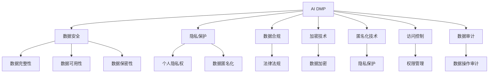

                 

## 1. 背景介绍

### 1.1 问题由来
随着数字经济和互联网技术的飞速发展，个人信息的价值日益凸显。企业通过用户行为数据的分析挖掘，可实现精准营销、优化用户体验、提升运营效率，但同时也面临着严峻的数据安全和隐私保护挑战。用户隐私保护与数据利用之间的矛盾，已成为企业数字化转型的重要瓶颈。

大用户画像（AI DMP, AI Data Management Platform）平台作为数据管理与应用的引擎，通过融合用户的多源数据，提供完整的用户画像，支持精准营销、风险管理、用户分析等业务，为企业的数据价值变现提供了重要支持。

然而，AI DMP平台在数据收集、处理、存储和分析的过程中，如何确保数据的合法性、安全性和隐私性，已成为其可持续发展的关键问题。

### 1.2 问题核心关键点
当前，数据安全和隐私保护问题主要集中在以下几个方面：

1. **数据来源合法性**：如何确保数据采集的合法性，避免侵犯用户隐私，同时保持数据的丰富性。
2. **数据存储安全性**：如何确保存储在平台中的数据不泄露、不被篡改。
3. **数据传输安全性**：如何在数据传输过程中保护数据隐私，防止数据在网络中被截获和窃取。
4. **数据处理合规性**：如何确保数据处理过程符合法律法规，特别是GDPR（欧盟通用数据保护条例）和CCPA（加州消费者隐私法）等隐私保护法规的要求。
5. **数据查询安全性**：如何设计高效且安全的查询机制，防止数据泄露或误用。
6. **数据监控与审计**：如何实时监控数据操作，及时发现并纠正违规行为。

这些问题涉及技术、法律和伦理等多方面的综合考量，需要系统性的解决方案。本文将全面探讨AI DMP平台的数据安全与隐私保护策略，为相关企业提供参考。

## 2. 核心概念与联系

### 2.1 核心概念概述

为更好地理解AI DMP平台的数据安全和隐私保护机制，本节将介绍几个核心概念：

- **AI DMP**：人工智能用户画像平台，通过收集、整合用户的多源数据，构建完整的用户画像，支持精准营销、风险管理、用户分析等业务。
- **数据安全**：指保护数据免受未经授权的访问、使用、泄露或损坏，以维护数据的完整性、可用性和保密性。
- **隐私保护**：指确保个人数据在收集、存储、处理和传输过程中，不被未经授权的第三方获取和滥用，保护用户隐私权。
- **数据合规**：指确保数据处理过程符合法律法规要求，特别是隐私保护法规如GDPR、CCPA等。
- **加密技术**：指通过加密算法将数据转换为不可读的形式，以保护数据在传输和存储过程中的隐私性。
- **匿名化技术**：指通过去除或模糊处理敏感信息，使得数据无法直接识别个人身份，从而保护用户隐私。
- **访问控制**：指通过身份验证、权限管理等手段，确保只有经过授权的人员才能访问数据。
- **数据审计**：指对数据处理过程进行记录、监控和分析，以确保数据操作的合规性和透明性。

这些核心概念之间的逻辑关系可以通过以下Mermaid流程图来展示：



这个流程图展示了大数据平台中数据安全与隐私保护的核心概念及其之间的关系：

1. AI DMP平台通过数据安全、隐私保护、数据合规等机制，确保数据的安全性和隐私性。
2. 数据加密和匿名化技术是确保数据安全的重要手段。
3. 访问控制保障了数据操作的合规性和透明性。
4. 数据审计则对数据操作进行实时监控，发现并纠正违规行为。

这些概念共同构成了AI DMP平台的数据安全与隐私保护框架，确保数据在全生命周期中的安全和合规性。

## 3. 核心算法原理 & 具体操作步骤
### 3.1 算法原理概述

AI DMP平台的数据安全和隐私保护，主要通过数据加密、匿名化、访问控制和数据审计等技术手段来实现。其核心思想是，在数据收集、存储、处理和传输的全生命周期中，始终确保数据的合法性、完整性、可用性和保密性。

### 3.2 算法步骤详解

以下是大数据平台数据安全和隐私保护的具体操作步骤：

**Step 1: 数据加密**
- 在数据收集阶段，使用对称加密或非对称加密技术对数据进行加密，防止数据在传输过程中被窃取或篡改。
- 对称加密：使用同一密钥对数据进行加密和解密，速度快但密钥管理复杂。
- 非对称加密：使用公钥加密数据，私钥解密，密钥管理简单但速度较慢。

**Step 2: 数据匿名化**
- 对敏感数据进行去标识化处理，如掩码、哈希、泛化等，确保数据无法直接识别个人身份，同时保持数据可用性。
- 掩码：对敏感信息进行部分遮挡，如姓名、身份证号等。
- 哈希：使用哈希函数对数据进行加密，生成无法还原的散列值。
- 泛化：对数据进行泛化处理，模糊化具体信息，如将精确地址转换为城市或地区。

**Step 3: 访问控制**
- 对平台中的数据进行权限管理，确保只有经过授权的人员才能访问。
- 基于角色的访问控制（RBAC）：根据用户角色分配权限，如管理员、操作员、审计员等。
- 基于属性的访问控制（ABAC）：根据用户属性（如部门、职位、时间等）动态调整权限。

**Step 4: 数据审计**
- 对数据操作进行实时监控和记录，确保数据操作的合法性和透明性。
- 日志记录：记录数据操作的时间、类型、用户、参数等信息。
- 审计分析：对日志数据进行分析和挖掘，及时发现异常行为。

### 3.3 算法优缺点

AI DMP平台的数据安全和隐私保护算法具有以下优点：

- **安全性高**：数据加密和匿名化技术，确保数据在传输和存储过程中的安全性和隐私性。
- **灵活性大**：基于角色的访问控制和属性访问控制，可以灵活配置权限，适应不同的业务需求。
- **透明度强**：数据审计记录和分析，确保数据操作的合法性和透明性。

同时，这些算法也存在一些局限性：

- **复杂度高**：数据加密和匿名化处理复杂，技术门槛高，实施难度大。
- **性能损失**：加密和解密过程会带来一定的性能损失，影响数据处理速度。
- **依赖强**：依赖于加密算法和访问控制系统的可靠性，一旦系统漏洞被攻击，数据安全风险大。

尽管存在这些局限性，但就目前而言，这些技术仍是AI DMP平台数据安全和隐私保护的主要手段。未来相关研究的重点在于如何进一步降低技术复杂度，提升数据处理效率，同时兼顾安全和隐私保护。

### 3.4 算法应用领域

AI DMP平台的数据安全和隐私保护算法，在数据驱动的各行各业中得到了广泛应用，包括但不限于：

- **金融领域**：确保用户交易数据的安全性，防止数据泄露和欺诈。
- **医疗健康**：保护患者医疗数据隐私，防止数据滥用和泄露。
- **电商零售**：保护用户购物数据隐私，防止数据被滥用。
- **社交媒体**：保护用户社交数据隐私，防止数据被滥用和泄露。
- **政府机构**：保护公民隐私数据，防止数据被滥用和泄露。

这些应用场景对数据安全和隐私保护的要求极高，AI DMP平台的数据安全和隐私保护技术为其提供了坚实保障。

## 4. 数学模型和公式 & 详细讲解  
### 4.1 数学模型构建

为更好地理解AI DMP平台的数据安全和隐私保护机制，本节将介绍几个关键数学模型：

- **对称加密模型**：
  - 数学表示：$C_1 = E_{k_1}(M_1)$
  - 其中 $M_1$ 为明文，$k_1$ 为对称密钥，$E_{k_1}$ 为加密算法，$C_1$ 为密文。

- **非对称加密模型**：
  - 数学表示：$C_2 = E_{k_2}(M_2)$
  - 其中 $M_2$ 为明文，$k_2$ 为非对称密钥，$E_{k_2}$ 为加密算法，$C_2$ 为密文。

- **哈希函数模型**：
  - 数学表示：$H(M_3) = h_k(M_3)$
  - 其中 $M_3$ 为明文，$k$ 为哈希函数密钥，$h_k$ 为哈希算法，$H(M_3)$ 为散列值。

### 4.2 公式推导过程

以下我们以对称加密和非对称加密为例，推导加密和解密过程的数学公式。

**对称加密公式推导**：

假设对称加密算法为 $E_{k_1}(M_1) = C_1$，其中 $C_1$ 为密文，$k_1$ 为对称密钥。则解密过程为 $D_{k_1}(C_1) = M_1$。

**非对称加密公式推导**：

假设非对称加密算法为 $E_{k_2}(M_2) = C_2$，其中 $C_2$ 为密文，$k_2$ 为非对称密钥。则解密过程为 $D_{k_2}(C_2) = M_2$。

### 4.3 案例分析与讲解

假设某电商平台收集用户的购物行为数据，并希望通过AI DMP平台进行数据分析和用户画像构建。在数据收集和传输过程中，需要进行数据加密保护。

**数据加密流程**：
1. 在数据收集阶段，电商平台使用对称加密算法对数据进行加密，生成密文。
2. 数据传输过程中，使用非对称加密算法对对称密钥进行加密，生成密钥密文。
3. 接收方收到密文和密钥密文后，使用非对称解密算法对密钥密文进行解密，获取对称密钥。
4. 接收方使用对称解密算法对密文进行解密，获取原始数据。

通过以上流程，确保数据在传输过程中不被截获和篡改，同时保持数据的完整性和可用性。

## 5. 项目实践：代码实例和详细解释说明
### 5.1 开发环境搭建

在进行数据安全和隐私保护项目实践前，我们需要准备好开发环境。以下是使用Python进行数据加密和访问控制的开发环境配置流程：

1. 安装Anaconda：从官网下载并安装Anaconda，用于创建独立的Python环境。

2. 创建并激活虚拟环境：
```bash
conda create -n data-security-env python=3.8 
conda activate data-security-env
```

3. 安装Python安全库：
```bash
pip install pycryptodome cryptography
```

4. 安装访问控制库：
```bash
pip install django-rest-framework-permissions
```

5. 安装日志记录库：
```bash
pip install python-logger
```

完成上述步骤后，即可在`data-security-env`环境中开始数据安全和隐私保护实践。

### 5.2 源代码详细实现

下面我们以一个简化的AI DMP平台为例，给出使用Python进行数据加密和访问控制的代码实现。

首先，定义数据加密函数：

```python
from cryptography.fernet import Fernet

def encrypt_data(data, key):
    f = Fernet(key)
    encrypted_data = f.encrypt(data)
    return encrypted_data
```

然后，定义数据解密函数：

```python
def decrypt_data(data, key):
    f = Fernet(key)
    decrypted_data = f.decrypt(data)
    return decrypted_data
```

接着，定义基于角色的访问控制函数：

```python
from django.contrib.auth.models import User
from django_learning_framework_permissions.permissions import IsOwnerOrReadOnly

def check_permissions(request, obj):
    if request.user.is_authenticated:
        return IsOwnerOrReadOnly().has_object_permission(request, view, obj)
    else:
        return False
```

最后，启动数据加密和访问控制流程：

```python
# 数据加密
key = Fernet.generate_key()
data = "Sensitive data"
encrypted_data = encrypt_data(data, key)

# 数据解密
decrypted_data = decrypt_data(encrypted_data, key)

# 访问控制
user = User.objects.get(username="user_name")
obj = "Object data"
if check_permissions(request, obj):
    # 操作成功
else:
    # 操作失败
```

以上代码展示了数据加密和基于角色的访问控制的实现。可以看到，通过使用Python安全库和权限管理库，可以方便地实现数据加密和访问控制，满足AI DMP平台的数据安全和隐私保护需求。

### 5.3 代码解读与分析

让我们再详细解读一下关键代码的实现细节：

**加密函数**：
- 使用Fernet算法进行对称加密。Fernet算法是一种基于AES加密的算法，安全性高，易于实现。
- 生成一个随机的对称密钥，并使用该密钥对数据进行加密。
- 返回加密后的密文。

**解密函数**：
- 使用Fernet算法进行对称解密。
- 解密后返回原始数据。

**访问控制函数**：
- 使用Django REST框架的权限管理模块，定义基于角色的访问控制。
- `IsOwnerOrReadOnly()`权限类，判断当前用户是否是对象的拥有者，或者是否为只读操作。
- 如果用户有操作权限，则返回True，否则返回False。

可以看到，通过合理设计数据加密和访问控制机制，可以有效地保护数据安全和隐私，确保AI DMP平台的数据合规性和透明度。

## 6. 实际应用场景
### 6.1 金融领域

在金融领域，数据安全和隐私保护尤为重要。AI DMP平台通过数据加密和匿名化技术，确保用户交易数据的安全性和隐私性，防止数据泄露和欺诈。

**具体应用**：
1. **数据加密**：使用非对称加密算法对交易数据进行加密，防止数据在传输过程中被截获和篡改。
2. **数据匿名化**：对敏感信息进行去标识化处理，如将用户身份证号、银行卡号等进行哈希处理。
3. **访问控制**：对交易数据的访问进行严格的权限管理，确保只有授权人员才能访问。
4. **数据审计**：对交易数据的访问和操作进行实时监控和记录，确保数据操作的合法性和透明性。

通过以上措施，确保交易数据的安全性和隐私性，防止数据泄露和滥用，保护用户的金融安全和隐私。

### 6.2 医疗健康

医疗健康领域对数据安全和隐私保护的要求同样极高。AI DMP平台通过数据加密和匿名化技术，确保患者医疗数据的安全性和隐私性，防止数据滥用和泄露。

**具体应用**：
1. **数据加密**：使用对称加密算法对患者医疗数据进行加密，防止数据在传输过程中被截获和篡改。
2. **数据匿名化**：对敏感信息进行去标识化处理，如将患者姓名、身份证号等进行哈希处理。
3. **访问控制**：对医疗数据的访问进行严格的权限管理，确保只有授权人员才能访问。
4. **数据审计**：对医疗数据的访问和操作进行实时监控和记录，确保数据操作的合法性和透明性。

通过以上措施，确保医疗数据的安全性和隐私性，防止数据滥用和泄露，保护患者的健康隐私。

### 6.3 电商零售

在电商零售领域，用户购物数据的安全性和隐私性同样重要。AI DMP平台通过数据加密和匿名化技术，确保用户购物数据的安全性和隐私性，防止数据滥用和泄露。

**具体应用**：
1. **数据加密**：使用对称加密算法对用户购物数据进行加密，防止数据在传输过程中被截获和篡改。
2. **数据匿名化**：对敏感信息进行去标识化处理，如将用户姓名、身份证号等进行哈希处理。
3. **访问控制**：对购物数据的访问进行严格的权限管理，确保只有授权人员才能访问。
4. **数据审计**：对购物数据的访问和操作进行实时监控和记录，确保数据操作的合法性和透明性。

通过以上措施，确保购物数据的安全性和隐私性，防止数据滥用和泄露，保护用户的购物安全和隐私。

### 6.4 未来应用展望

随着AI DMP平台的数据安全和隐私保护技术不断发展，其在数据驱动的各行各业中将得到更广泛的应用，为数据价值变现提供有力保障。

1. **智慧医疗**：通过AI DMP平台，构建患者隐私保护的智能医疗系统，实现远程诊断、智能问诊等应用。
2. **智慧金融**：通过AI DMP平台，构建安全可靠的智能金融系统，实现风险管理、精准营销等应用。
3. **智慧电商**：通过AI DMP平台，构建用户隐私保护的智能电商系统，实现个性化推荐、智能客服等应用。
4. **智慧城市**：通过AI DMP平台，构建用户隐私保护的智能城市系统，实现智慧交通、智能安防等应用。

未来，随着数据安全和隐私保护技术的不断进步，AI DMP平台将更好地支撑各行各业的数字化转型，为数据价值变现提供坚实保障。

## 7. 工具和资源推荐
### 7.1 学习资源推荐

为了帮助开发者系统掌握AI DMP平台的数据安全和隐私保护技术，这里推荐一些优质的学习资源：

1. **《数据安全与隐私保护》课程**：由国际知名的数据安全和隐私保护专家讲授，涵盖数据加密、匿名化、访问控制等核心技术，适合入门学习。
2. **《数据合规与隐私保护》书籍**：详细介绍了GDPR、CCPA等隐私保护法规，并讲解了数据合规的实现方法和技术手段，适合深入学习。
3. **《数据安全与隐私保护实战指南》书籍**：结合实际应用案例，介绍数据安全和隐私保护的最佳实践，适合工程实践。
4. **Google Cloud Privacy-Centric AI 文档**：Google云平台提供的隐私保护技术和实践指南，适合开发工程师参考。
5. **Django REST Framework Permissions 文档**：Django REST Framework的权限管理模块，适合开发工程师学习权限管理实践。

通过对这些资源的学习实践，相信你一定能够系统掌握AI DMP平台的数据安全和隐私保护技术，并应用于实际项目中。

### 7.2 开发工具推荐

高效的开发离不开优秀的工具支持。以下是几款用于数据安全和隐私保护开发的常用工具：

1. **PyCryptodome**：Python安全库，提供了多种加密算法和哈希算法，适合数据加密和匿名化操作。
2. **Cryptography**：Python加密库，提供了多种加密算法和密钥管理机制，适合数据加密和访问控制。
3. **Django REST Framework**：Python RESTful API框架，提供了权限管理模块，适合访问控制和数据审计。
4. **Python-Logger**：Python日志记录库，适合记录和分析数据操作日志，适合数据审计和监控。
5. **Jupyter Notebook**：Python交互式开发环境，适合数据加密和匿名化的快速实验和调试。

合理利用这些工具，可以显著提升数据安全和隐私保护任务的开发效率，加快创新迭代的步伐。

### 7.3 相关论文推荐

数据安全和隐私保护技术的发展源于学界的持续研究。以下是几篇奠基性的相关论文，推荐阅读：

1. **《数据加密技术综述》**：介绍了对称加密、非对称加密、哈希函数等核心技术，适合入门学习。
2. **《基于角色的访问控制模型》**：介绍了RBAC和ABAC等访问控制模型，适合深入学习。
3. **《数据隐私保护技术综述》**：详细介绍了数据匿名化、数据加密、数据审计等核心技术，适合深入研究。
4. **《GDPR隐私保护技术》**：介绍了GDPR隐私保护法规和实现方法，适合合规性学习。
5. **《数据安全和隐私保护最新进展》**：总结了数据安全和隐私保护领域的最新研究进展，适合前沿研究。

这些论文代表了大数据平台数据安全和隐私保护技术的发展脉络。通过学习这些前沿成果，可以帮助研究者把握学科前进方向，激发更多的创新灵感。

## 8. 总结：未来发展趋势与挑战

### 8.1 总结

本文对AI DMP平台的数据安全和隐私保护策略进行了全面系统的介绍。首先阐述了数据安全和隐私保护的重要性，明确了数据安全、隐私保护、数据合规等核心概念及其之间的关系。其次，从原理到实践，详细讲解了数据加密、匿名化、访问控制和数据审计等关键技术，给出了数据安全和隐私保护项目开发的完整代码实例。同时，本文还广泛探讨了数据安全和隐私保护在金融、医疗、电商等领域的应用前景，展示了数据安全和隐私保护技术的巨大潜力。最后，本文精选了数据安全和隐私保护的相关学习资源、开发工具和学术论文，力求为读者提供全方位的技术指引。

通过本文的系统梳理，可以看到，AI DMP平台的数据安全和隐私保护技术在数据驱动的各行各业中得到了广泛应用，为数据价值变现提供了坚实保障。未来，伴随数据安全和隐私保护技术的持续演进，AI DMP平台将更好地支撑各行各业的数字化转型，为数据价值变现提供坚实保障。

### 8.2 未来发展趋势

展望未来，AI DMP平台的数据安全和隐私保护技术将呈现以下几个发展趋势：

1. **数据安全技术持续发展**：随着AI和物联网技术的快速发展，数据安全技术将不断升级，确保数据在传输、存储和处理过程中的安全性。
2. **隐私保护技术日益成熟**：随着隐私保护法规的完善和数据利用的需求增加，隐私保护技术将更加成熟，确保数据隐私不被滥用。
3. **自动化和智能化程度提升**：通过引入人工智能和机器学习技术，数据安全和隐私保护将更加自动化和智能化，提升防护效率和效果。
4. **多模态数据安全**：随着多模态数据的应用越来越广泛，数据安全和隐私保护将涵盖更多类型的数据，如语音、图像、视频等。
5. **全球数据合规统一**：随着数据跨境流动的增加，全球数据合规要求将逐渐统一，数据安全和隐私保护技术将适应国际标准。
6. **数据安全与隐私保护的协同创新**：数据安全和隐私保护将与其他AI技术如区块链、云计算等进行协同创新，形成更加全面、综合的保护体系。

以上趋势凸显了AI DMP平台数据安全和隐私保护技术的广阔前景。这些方向的探索发展，必将进一步提升数据安全性和隐私保护水平，为数据价值变现提供更加坚实的技术保障。

### 8.3 面临的挑战

尽管AI DMP平台的数据安全和隐私保护技术已经取得了瞩目成就，但在迈向更加智能化、普适化应用的过程中，它仍面临着诸多挑战：

1. **技术复杂度高**：数据加密和匿名化技术复杂，技术门槛高，实施难度大。
2. **性能损失大**：加密和解密过程会带来一定的性能损失，影响数据处理速度。
3. **依赖性强**：依赖于加密算法和访问控制系统的可靠性，一旦系统漏洞被攻击，数据安全风险大。
4. **法规环境复杂**：不同国家和地区对数据安全和隐私保护的要求不同，法规环境复杂，需要不断适应和更新。
5. **数据泄露风险**：在数据收集、处理和传输的全生命周期中，数据泄露风险始终存在，需要持续监控和防范。

这些挑战需要在技术、法规、伦理等多方面综合考虑，积极应对并寻求突破，才能确保AI DMP平台的数据安全和隐私保护技术持续发展和应用。

### 8.4 研究展望

面对AI DMP平台数据安全和隐私保护所面临的挑战，未来的研究需要在以下几个方面寻求新的突破：

1. **数据安全技术的多样化**：引入更多加密算法和访问控制模型，提高数据安全和隐私保护的多样性和灵活性。
2. **数据加密和解密的高效化**：开发更加高效的数据加密和解密算法，提升数据处理速度和性能。
3. **隐私保护技术的智能化**：引入人工智能和机器学习技术，提高数据隐私保护的安全性和自动化水平。
4. **法规环境的适应性**：根据不同国家和地区的法规环境，设计合规性高、灵活性强的数据安全和隐私保护方案。
5. **数据安全与隐私保护的协同创新**：与其他AI技术如区块链、云计算等进行协同创新，形成更加全面、综合的保护体系。
6. **数据泄露风险的防范**：引入数据泄露检测和防范技术，实时监控和发现数据泄露风险，及时采取措施。

这些研究方向将为AI DMP平台数据安全和隐私保护技术提供新的突破和应用方向，推动其在各行各业中的广泛应用，为数据价值变现提供坚实的技术保障。

## 9. 附录：常见问题与解答

**Q1：数据加密和数据匿名化有什么区别？**

A: 数据加密和数据匿名化都是保护数据隐私的重要手段，但实现方式和效果有所不同。

- **数据加密**：通过加密算法将数据转换为不可读的形式，确保数据在传输和存储过程中的安全性。
- **数据匿名化**：通过去除或模糊处理敏感信息，使得数据无法直接识别个人身份，从而保护用户隐私。

加密技术主要用于数据传输和存储过程中的保护，而匿名化技术主要用于数据处理和分析阶段，确保数据隐私不被泄露。

**Q2：如何选择合适的加密算法？**

A: 选择合适的加密算法需要考虑多个因素，包括安全性、性能、易用性等。

- **安全性**：加密算法需要具有足够的安全性，防止被破解或攻击。
- **性能**：加密算法需要高效，减少对数据处理速度的影响。
- **易用性**：加密算法需要易于实现和使用，方便开发人员快速集成。

常见的加密算法包括对称加密算法（如AES）、非对称加密算法（如RSA）、哈希算法（如SHA-256）等，开发人员应根据具体需求选择合适的加密算法。

**Q3：数据安全和隐私保护在AI DMP平台中的应用场景有哪些？**

A: AI DMP平台的数据安全和隐私保护技术在数据驱动的各行各业中得到了广泛应用，包括但不限于：

- **金融领域**：确保用户交易数据的安全性和隐私性，防止数据泄露和欺诈。
- **医疗健康**：确保患者医疗数据的安全性和隐私性，防止数据滥用和泄露。
- **电商零售**：确保用户购物数据的安全性和隐私性，防止数据滥用和泄露。
- **社交媒体**：确保用户社交数据的安全性和隐私性，防止数据滥用和泄露。
- **政府机构**：确保公民隐私数据的安全性和隐私性，防止数据滥用和泄露。

这些应用场景对数据安全和隐私保护的要求极高，AI DMP平台的数据安全和隐私保护技术为其提供了坚实保障。

---

作者：禅与计算机程序设计艺术 / Zen and the Art of Computer Programming

