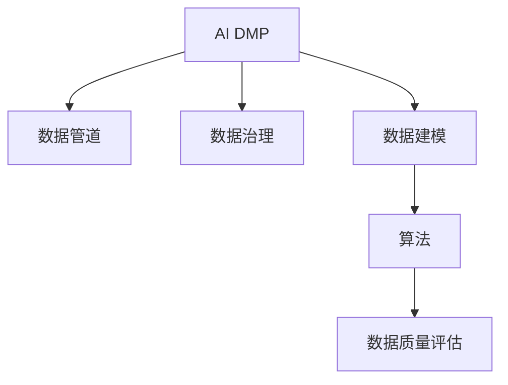

                 

# AI DMP 数据基建：数据模型与算法

> 关键词：AI DMP, 数据建模, 算法, 数据管道, 数据治理, 数据质量评估

## 1. 背景介绍

### 1.1 问题由来
在数字化转型的大背景下，企业积累了海量用户数据，但数据的复杂性和多样性给数据管理和利用带来了巨大挑战。如何从原始数据中提炼出高质量的用户画像，支撑业务决策，成为各个领域企业关注的焦点。数字营销领域，一种广泛应用的数据管理平台（Data Management Platform, DMP）应运而生。

AI DMP，即基于人工智能的数据管理平台，通过智能化的数据处理、建模和分析方法，大幅提升了数据治理和利用的效率。本文将重点介绍AI DMP在数据建模与算法层面的应用，帮助读者理解AI DMP的数据基建技术，并探讨其未来发展方向和面临的挑战。

### 1.2 问题核心关键点
AI DMP的核心技术包括数据建模、算法优化、数据管道构建、数据治理、数据质量评估等多个方面。本文将重点介绍数据建模与算法层面的核心技术，并通过实际案例展示AI DMP在企业中的应用。

## 2. 核心概念与联系

### 2.1 核心概念概述

为更好地理解AI DMP的核心技术，本节将介绍几个密切相关的核心概念：

- **AI DMP（人工智能数据管理平台）**：利用人工智能技术，自动进行数据采集、处理、建模和分析，生成高质量用户画像和业务洞察的平台。

- **数据管道（Data Pipeline）**：用于自动化数据流处理的系统架构，包括数据采集、清洗、转换和加载（ETL）等多个环节。

- **数据治理（Data Governance）**：通过一系列管理制度和技术手段，确保数据的质量、安全性和可用性，提升数据价值。

- **数据建模（Data Modeling）**：通过定义和构建数据结构，实现对数据的抽象和组织，为算法提供数据支持。

- **算法（Algorithm）**：用于自动化处理和分析数据的函数，包括特征工程、模型训练和评估等多个步骤。

- **数据质量评估（Data Quality Assessment）**：通过一系列指标和评估方法，量化数据质量，识别和修复数据问题。

这些核心概念之间的逻辑关系可以通过以下Mermaid流程图来展示：



这个流程图展示了大语言模型的核心概念及其之间的关系：

1. AI DMP通过数据管道自动采集和清洗数据，为数据建模和算法提供支持。
2. 数据治理确保数据质量和安全，是数据管道和算法可靠运行的前提。
3. 数据建模定义了数据结构，为算法处理数据提供框架。
4. 算法通过模型训练和评估，自动发现数据中的知识和规律。
5. 数据质量评估保证数据模型的准确性和稳定性。

这些概念共同构成了AI DMP的技术体系，为其提供坚实的数据基建支持。

## 3. 核心算法原理 & 具体操作步骤
### 3.1 算法原理概述

AI DMP在数据建模与算法层面的核心技术包括数据预处理、特征工程、模型训练和评估等。这些技术通过自动化数据处理和分析，帮助生成高质量的用户画像和业务洞察。

### 3.2 算法步骤详解

#### 数据预处理

数据预处理是AI DMP的首要环节，主要包括以下步骤：

1. **数据清洗**：去除重复、缺失、异常等不符合规范的数据。
2. **数据归一化**：对数值型数据进行标准化处理，使数据在尺度上具有一致性。
3. **数据转换**：将原始数据转换为更适合算法处理的格式，如时间序列转换、文本向量化等。
4. **数据采样**：根据业务需求，对数据进行有放回或无放回采样，以保证样本的多样性和代表性。

#### 特征工程

特征工程是数据建模的核心步骤，通过选取和构造有意义的特征，提升模型的预测能力和泛化能力。主要包括以下步骤：

1. **特征选择**：从原始数据中选出对目标变量有预测能力的特征。
2. **特征提取**：通过降维、嵌入式等技术，提取更有信息量的特征。
3. **特征构造**：构造新的特征，如时间窗口特征、交互特征等，提升模型性能。

#### 模型训练

模型训练是AI DMP的核心算法部分，通过训练各种机器学习模型，自动化发现数据中的知识和规律。主要包括以下步骤：

1. **模型选择**：根据业务需求和数据特征，选择合适的模型，如回归模型、分类模型、聚类模型等。
2. **模型拟合**：通过训练集对模型进行拟合，得到模型的预测能力。
3. **模型调优**：通过交叉验证等技术，调整模型参数，提升模型性能。

#### 模型评估

模型评估是AI DMP的重要环节，通过评估模型的性能，确保模型在实际应用中的效果。主要包括以下步骤：

1. **性能指标选择**：根据业务需求，选择合适的评估指标，如准确率、召回率、F1分数等。
2. **模型验证**：通过验证集评估模型的泛化能力，识别模型过拟合问题。
3. **模型部署**：将模型部署到实际应用中，进行业务落地。

### 3.3 算法优缺点

AI DMP在数据建模与算法层面的主要优点包括：

1. **自动化**：通过算法自动化处理数据，减少了人工干预，提升了效率。
2. **数据集成**：自动整合来自不同来源的数据，提升数据利用率。
3. **可解释性**：通过特征工程和模型选择，生成易于理解和解释的用户画像。

同时，AI DMP也存在一些局限性：

1. **数据隐私**：在处理敏感数据时，需要注意数据隐私和合规问题。
2. **模型鲁棒性**：模型可能面临过拟合和泛化能力不足的问题。
3. **计算资源消耗**：大数据和复杂模型需要大量计算资源，对硬件要求较高。
4. **算法复杂性**：算法选择和调优需要一定的专业知识和经验。

尽管存在这些局限性，但AI DMP在数据治理和利用方面仍然具有显著的优势，能够有效支撑企业的数字化转型和业务决策。

### 3.4 算法应用领域

AI DMP在多个领域都有广泛应用，例如：

- **数字营销**：通过用户画像生成和行为分析，优化广告投放策略，提升广告效果。
- **零售电商**：通过用户行为预测和个性化推荐，提升用户购买转化率和满意度。
- **金融风控**：通过风险评估和欺诈检测，提升金融服务的安全性和合规性。
- **医疗健康**：通过患者画像和健康行为分析，提升医疗服务质量和个性化医疗水平。
- **智能制造**：通过设备状态预测和故障诊断，提升生产效率和设备维护水平。

此外，AI DMP在物联网、智慧城市、智能家居等多个领域也具有广泛的应用前景。

## 4. 数学模型和公式 & 详细讲解 & 举例说明
### 4.1 数学模型构建

AI DMP在数学模型构建方面，通常使用多种模型和算法。以下以线性回归模型为例，进行详细讲解。

假设数据集为 $D=\{(x_i,y_i)\}_{i=1}^N$，其中 $x_i$ 为输入特征，$y_i$ 为目标变量，线性回归模型可以表示为：

$$
y_i = \theta_0 + \sum_{j=1}^{p}\theta_j x_{ij} + \epsilon_i
$$

其中 $\theta = (\theta_0, \theta_1, ..., \theta_p)$ 为模型参数，$\epsilon_i$ 为误差项。

### 4.2 公式推导过程

线性回归模型的目标是最小化损失函数 $L(\theta)$：

$$
L(\theta) = \frac{1}{2N}\sum_{i=1}^N (y_i - \hat{y}_i)^2
$$

其中 $\hat{y}_i = \theta_0 + \sum_{j=1}^{p}\theta_j x_{ij}$。

最小化上述损失函数，得到参数 $\theta$ 的解为：

$$
\theta = (X^T X)^{-1} X^T y
$$

其中 $X$ 为特征矩阵，$y$ 为目标变量向量。

### 4.3 案例分析与讲解

以下以电商数据为例，进行线性回归模型的实际应用讲解。

假设某电商网站希望预测用户的平均消费金额，数据集为 $D=\{(x_i,y_i)\}_{i=1}^N$，其中 $x_i$ 为用户特征，$y_i$ 为用户平均消费金额。数据集包含用户年龄、性别、历史消费金额等特征。

**数据预处理**：

1. **数据清洗**：去除重复、缺失数据，保留有效数据。
2. **数据归一化**：将年龄、历史消费金额等特征归一化到0-1之间。
3. **数据转换**：将性别特征转换为数值型特征。

**特征工程**：

1. **特征选择**：选择年龄、历史消费金额、性别等特征。
2. **特征提取**：对历史消费金额进行滑动平均，生成新的特征。

**模型训练**：

1. **模型选择**：选择线性回归模型。
2. **模型拟合**：使用训练集对模型进行拟合，得到模型参数 $\theta$。
3. **模型调优**：使用交叉验证调整模型参数，确保模型泛化能力。

**模型评估**：

1. **性能指标选择**：选择均方误差（MSE）作为评估指标。
2. **模型验证**：使用验证集评估模型性能，识别过拟合问题。
3. **模型部署**：将模型部署到实际应用中，进行业务落地。

通过上述步骤，电商网站可以基于用户画像，预测用户的平均消费金额，优化广告投放策略，提升广告效果。

## 5. 项目实践：代码实例和详细解释说明
### 5.1 开发环境搭建

在进行AI DMP项目实践前，我们需要准备好开发环境。以下是使用Python进行Scikit-learn开发的环境配置流程：

1. 安装Anaconda：从官网下载并安装Anaconda，用于创建独立的Python环境。

2. 创建并激活虚拟环境：
```bash
conda create -n sklearn-env python=3.8 
conda activate sklearn-env
```

3. 安装Scikit-learn：
```bash
pip install scikit-learn
```

4. 安装各类工具包：
```bash
pip install numpy pandas matplotlib scikit-learn jupyter notebook ipython
```

完成上述步骤后，即可在`sklearn-env`环境中开始AI DMP项目实践。

### 5.2 源代码详细实现

下面我们以电商数据为例，给出使用Scikit-learn进行线性回归模型训练的Python代码实现。

```python
from sklearn.linear_model import LinearRegression
from sklearn.model_selection import train_test_split
from sklearn.metrics import mean_squared_error
from sklearn.preprocessing import StandardScaler
import pandas as pd

# 读取数据
data = pd.read_csv('ecommerce_data.csv')

# 特征选择
features = ['age', 'gender', 'historical_consumption']
target = 'average_spending'

# 数据清洗
data.drop_duplicates(inplace=True)
data.dropna(inplace=True)

# 数据归一化
scaler = StandardScaler()
data[features] = scaler.fit_transform(data[features])

# 数据划分
X_train, X_test, y_train, y_test = train_test_split(data[features], data[target], test_size=0.2, random_state=42)

# 模型训练
model = LinearRegression()
model.fit(X_train, y_train)

# 模型评估
y_pred = model.predict(X_test)
mse = mean_squared_error(y_test, y_pred)
print(f'MSE: {mse:.2f}')
```

以上就是使用Scikit-learn进行线性回归模型训练的完整代码实现。可以看到，得益于Scikit-learn的强大封装，我们可以用相对简洁的代码完成线性回归模型的训练和评估。

### 5.3 代码解读与分析

让我们再详细解读一下关键代码的实现细节：

**数据读取和特征选择**：
- 使用pandas库读取电商数据，并选取年龄、性别、历史消费金额等特征。

**数据清洗**：
- 使用pandas库进行数据去重和缺失值处理，确保数据质量。

**数据归一化**：
- 使用StandardScaler库对特征进行归一化处理，使数据在尺度上具有一致性。

**数据划分**：
- 使用train_test_split函数将数据集划分为训练集和测试集，并指定测试集大小和随机种子。

**模型训练**：
- 使用LinearRegression类创建线性回归模型，并在训练集上进行拟合。

**模型评估**：
- 使用mean_squared_error函数计算测试集的均方误差，评估模型性能。

以上代码展示了从数据预处理到模型评估的完整流程。开发者可以根据具体业务需求，进一步扩展和优化AI DMP的建模与算法实现。

## 6. 实际应用场景
### 6.1 电商推荐系统

AI DMP在电商推荐系统中具有广泛的应用前景。通过用户画像生成和行为分析，电商网站可以优化推荐算法，提升用户购买转化率和满意度。

具体而言，可以收集用户浏览、点击、购买等行为数据，构建用户画像和行为特征。在电商推荐系统中，使用AI DMP进行实时推荐，能够根据用户历史行为和当前兴趣，生成个性化的商品推荐列表，提升推荐效果。

### 6.2 金融风控系统

在金融领域，AI DMP可以用于风险评估和欺诈检测，提升金融服务的安全性和合规性。通过用户行为分析和信用评分模型，AI DMP可以自动筛选出高风险用户，预警欺诈行为，降低金融风险。

具体而言，可以收集用户的交易记录、信用评分、社交网络信息等数据，构建用户画像和行为特征。在金融风控系统中，使用AI DMP进行实时风险评估和欺诈检测，能够自动化筛选高风险用户，提升金融服务的质量和效率。

### 6.3 医疗健康系统

在医疗领域，AI DMP可以用于患者画像生成和健康行为分析，提升医疗服务质量和个性化医疗水平。通过患者病历数据和健康行为数据，AI DMP可以自动生成患者画像，支持医生诊断和治疗。

具体而言，可以收集患者的病历数据、健康行为数据等，构建患者画像和健康行为特征。在医疗健康系统中，使用AI DMP进行患者画像生成和健康行为分析，能够自动化生成患者画像，支持医生诊断和治疗，提升医疗服务质量和个性化医疗水平。

### 6.4 未来应用展望

随着AI DMP技术的不断发展，其在更多领域的应用前景将更加广阔。未来，AI DMP有望在以下领域实现突破：

- **智能制造**：通过设备状态预测和故障诊断，提升生产效率和设备维护水平。
- **智慧城市**：通过城市事件监测和应急指挥，提升城市管理的自动化和智能化水平。
- **智慧零售**：通过用户行为预测和个性化推荐，提升零售体验和销售效果。
- **智能家居**：通过用户行为分析和个性化推荐，提升家居服务的智能化水平。
- **智能交通**：通过交通流量预测和路径优化，提升交通管理的效率和安全性。

以上领域的应用将为AI DMP带来新的机遇，推动其技术不断进步和应用落地。

## 7. 工具和资源推荐
### 7.1 学习资源推荐

为了帮助开发者系统掌握AI DMP的技术基础和实践技巧，这里推荐一些优质的学习资源：

1. **《机器学习实战》**：这是一本系统讲解机器学习理论和实践的书籍，涵盖了机器学习的基础知识和常用算法。

2. **《深度学习》**：这是一本介绍深度学习理论和实践的书籍，适合深度学习初学者和进阶者阅读。

3. **Coursera的机器学习和深度学习课程**：这是由斯坦福大学和Coursera联合开设的在线课程，讲解机器学习和深度学习的基本原理和应用。

4. **Kaggle数据科学竞赛平台**：这是一个开放的数据科学竞赛平台，提供大量数据集和实际应用场景，适合进行实践练习。

5. **GitHub上的机器学习项目**：这是一个代码共享平台，可以学习到各种机器学习模型的实现细节和优化技巧。

通过对这些资源的学习实践，相信你一定能够快速掌握AI DMP的技术基础和应用技巧，并用于解决实际的业务问题。

### 7.2 开发工具推荐

高效的开发离不开优秀的工具支持。以下是几款用于AI DMP开发的常用工具：

1. **Scikit-learn**：这是一个基于Python的机器学习库，提供了丰富的算法和工具，适合进行数据建模和算法优化。

2. **TensorFlow**：这是一个由Google主导的深度学习框架，生产部署方便，适合大规模工程应用。

3. **Keras**：这是一个高层次的深度学习框架，提供了简单易用的API，适合进行模型训练和评估。

4. **PyTorch**：这是一个动态计算图框架，适合进行动态图和灵活的模型训练。

5. **Jupyter Notebook**：这是一个交互式的Python开发环境，支持代码编写、数据可视化和结果展示。

合理利用这些工具，可以显著提升AI DMP的开发效率，加快创新迭代的步伐。

### 7.3 相关论文推荐

AI DMP和数据建模技术的发展源于学界的持续研究。以下是几篇奠基性的相关论文，推荐阅读：

1. **《机器学习》**：这是一本经典的机器学习教材，由Tom Mitchell撰写，介绍了机器学习的基本概念和常用算法。

2. **《深度学习》**：这是一本经典的深度学习教材，由Ian Goodfellow、Yoshua Bengio和Aaron Courville撰写，介绍了深度学习的理论和实践。

3. **《数据挖掘：概念与技术》**：这是一本数据挖掘领域的经典教材，由Jerry K. Mitchell撰写，介绍了数据挖掘的基本概念和常用技术。

4. **《AI DMP：自动化的数据管理和建模》**：这是一篇综述性论文，介绍了AI DMP的基本概念和应用场景。

这些论文代表了大数据和AI DMP技术的发展脉络。通过学习这些前沿成果，可以帮助研究者把握学科前进方向，激发更多的创新灵感。

## 8. 总结：未来发展趋势与挑战
### 8.1 研究成果总结

本文对AI DMP在数据建模与算法层面的应用进行了全面系统的介绍。通过详细讲解数据预处理、特征工程、模型训练和评估等关键技术，展示了AI DMP在实际应用中的显著效果和应用前景。

通过本文的系统梳理，可以看到，AI DMP在数据治理和利用方面具有显著的优势，能够有效支撑企业的数字化转型和业务决策。未来，伴随AI DMP技术的不断演进，其在各个领域的应用将更加广泛和深入，推动各行各业迈向智能化和数字化。

### 8.2 未来发展趋势

展望未来，AI DMP在数据建模与算法层面的主要发展趋势包括：

1. **模型复杂化**：随着算力和硬件的发展，未来AI DMP将使用更复杂的深度学习模型，如神经网络、卷积神经网络、生成对抗网络等，提升模型性能和泛化能力。

2. **数据多样化**：未来AI DMP将支持更多类型的数据，如文本、图像、视频、音频等，提升数据利用的全面性和多样性。

3. **自动化水平提升**：未来AI DMP将更加自动化，通过自动化的数据处理和模型优化，减少人工干预，提升效率。

4. **实时性增强**：未来AI DMP将支持实时数据处理和模型更新，提升数据利用和业务落地的及时性。

5. **跨领域融合**：未来AI DMP将与其他人工智能技术进行更深入的融合，如知识表示、自然语言处理、计算机视觉等，推动人工智能技术的全面发展。

这些趋势将进一步推动AI DMP技术的发展，为各行各业带来更大的价值。

### 8.3 面临的挑战

尽管AI DMP在数据建模与算法层面取得了显著进展，但在迈向更加智能化、普适化应用的过程中，仍面临诸多挑战：

1. **数据隐私和安全**：在处理敏感数据时，需要注意数据隐私和合规问题，确保数据安全和用户隐私保护。

2. **模型鲁棒性**：模型可能面临过拟合和泛化能力不足的问题，需要进一步提升模型的鲁棒性和泛化能力。

3. **计算资源消耗**：大数据和复杂模型需要大量计算资源，对硬件要求较高，需要进一步优化计算资源的使用。

4. **算法复杂性**：算法选择和调优需要一定的专业知识和经验，需要进一步提升算法的可操作性和易用性。

5. **数据质量和一致性**：数据质量和一致性问题可能影响模型的性能和效果，需要进一步提升数据质量管理能力。

6. **实时数据处理**：实时数据处理需要高效的算法和系统架构支持，需要进一步提升实时数据处理的效率和稳定性。

7. **跨领域融合**：跨领域融合需要解决不同数据类型之间的转换和协同问题，需要进一步提升数据整合能力。

这些挑战需要进一步研究和探索，才能使AI DMP技术更加成熟和完善，为各行各业带来更大的价值。

### 8.4 研究展望

面对AI DMP面临的诸多挑战，未来的研究需要在以下几个方面寻求新的突破：

1. **自动化数据处理**：开发更加自动化和智能化的数据处理工具，减少人工干预，提升数据处理的效率和质量。

2. **数据隐私保护**：开发数据隐私保护技术，确保数据安全和用户隐私保护，避免数据泄露和滥用。

3. **模型鲁棒性提升**：通过引入正则化、对抗训练等技术，提升模型的鲁棒性和泛化能力。

4. **实时数据处理**：开发高效的数据处理和模型更新算法，提升实时数据处理的能力和效率。

5. **跨领域融合**：通过知识图谱、自然语言处理等技术，实现不同数据类型之间的协同和融合，提升跨领域应用的能力。

6. **模型可解释性**：通过可解释性技术，提升模型的可解释性和透明性，增强用户信任和接受度。

这些研究方向的探索，将引领AI DMP技术迈向更高的台阶，为构建安全、可靠、可解释、可控的智能系统铺平道路。面向未来，AI DMP技术还需要与其他人工智能技术进行更深入的融合，多路径协同发力，共同推动人工智能技术的全面发展。

## 9. 附录：常见问题与解答
**Q1：AI DMP的核心技术是什么？**

A: AI DMP的核心技术包括数据预处理、特征工程、模型训练和评估等。这些技术通过自动化数据处理和分析，帮助生成高质量的用户画像和业务洞察。

**Q2：如何优化AI DMP中的模型性能？**

A: 可以通过数据预处理、特征工程、模型调优等手段优化AI DMP中的模型性能。具体而言，可以使用正则化、Dropout、模型融合等技术，提升模型的泛化能力和鲁棒性。

**Q3：AI DMP在数据隐私保护方面有哪些措施？**

A: AI DMP在数据隐私保护方面，可以采用数据匿名化、数据加密、差分隐私等技术，确保数据安全和用户隐私保护。

**Q4：AI DMP在实际应用中需要注意哪些问题？**

A: AI DMP在实际应用中需要注意数据隐私、模型鲁棒性、计算资源消耗、算法复杂性等问题。需要根据具体业务需求，进行合理的数据治理和模型调优。

**Q5：AI DMP在未来有哪些发展趋势？**

A: AI DMP的未来发展趋势包括模型复杂化、数据多样化、自动化水平提升、实时性增强、跨领域融合等。这些趋势将进一步推动AI DMP技术的发展，为各行各业带来更大的价值。

通过本文的系统梳理，可以看到，AI DMP在数据治理和利用方面具有显著的优势，能够有效支撑企业的数字化转型和业务决策。未来，伴随AI DMP技术的不断演进，其在各个领域的应用将更加广泛和深入，推动各行各业迈向智能化和数字化。

---
作者：禅与计算机程序设计艺术 / Zen and the Art of Computer Programming

