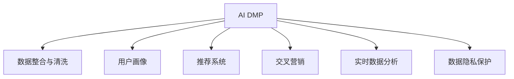

                 

# AI DMP 数据基建：构建数据驱动的营销生态

## 1. 背景介绍

### 1.1 问题由来

随着数字营销的发展，如何有效管理和利用数据成为了营销的关键。传统的营销手段依赖人工分析，难以快速响应市场变化，且无法充分利用数字平台的数据资源。而现代营销已经迈入了数据驱动的新阶段，AI驱动的数据营销平台（AI DMP, Artificial Intelligence Data Marketing Platform）成为了企业营销的重要工具。AI DMP 通过整合企业内外部的数据，利用机器学习算法进行深度分析，提供精准的用户画像和推荐，帮助企业实现精准营销。

### 1.2 问题核心关键点

AI DMP 数据基建的核心理念是通过大数据、机器学习和深度学习技术，构建数据驱动的营销生态系统。其核心价值体现在：
- 精准用户画像：通过聚类、分类等算法，从海量数据中挖掘用户行为、偏好等特征，构建高质量用户画像。
- 个性化推荐：利用推荐算法和协同过滤技术，根据用户历史行为和兴趣标签，推荐个性化产品或内容。
- 交叉营销：整合多渠道数据，实现品牌之间的联合营销和销售。
- 实时数据洞察：通过流式数据处理和实时分析，捕捉市场变化，快速调整营销策略。
- 数据隐私保护：遵循GDPR等法规，保证用户数据的安全性和隐私性。

### 1.3 问题研究意义

AI DMP 数据基建的研究和应用对于推动数字营销的现代化、智能化进程具有重要意义：

1. 提高营销效率：AI DMP 能快速分析用户数据，实时洞察市场变化，优化广告投放策略，提升营销效率和效果。
2. 增强用户体验：通过精准推荐，提升用户体验，增加用户粘性和转化率。
3. 优化资源配置：通过多渠道数据整合，实现更科学的资源配置，提高ROI。
4. 适应市场变化：AI DMP 的实时数据分析能力，使企业能快速响应市场变化，捕捉商机。
5. 合规数据使用：AI DMP 注重数据隐私保护，符合GDPR等法律法规，确保用户数据的安全。

## 2. 核心概念与联系

### 2.1 核心概念概述

为更好地理解AI DMP数据基建的原理和实现，本节将介绍几个密切相关的核心概念：

- AI DMP：利用大数据、机器学习和深度学习技术，构建数据驱动的营销平台。通过整合企业内外部的数据，提供精准的用户画像和推荐，帮助企业实现精准营销。
- 数据整合与清洗：从多个数据源收集数据，进行去重、填充、转换等操作，构建统一的数据视图。
- 用户画像：通过对用户数据的聚类、分类、降维等技术，生成用户行为、偏好、兴趣等特征的概览。
- 推荐系统：基于协同过滤、内容推荐、混合推荐等算法，为用户推荐个性化产品或内容。
- 交叉营销：整合多渠道数据，实现不同品牌之间的联合营销和销售。
- 实时数据分析：利用流式数据处理和实时分析技术，捕捉市场变化，实时调整营销策略。
- 数据隐私保护：遵循GDPR等法规，保证用户数据的安全性和隐私性。

这些核心概念之间的逻辑关系可以通过以下Mermaid流程图来展示：



这个流程图展示了大数据驱动的营销平台的几个核心组件及其之间的关系：

1. AI DMP 通过数据整合与清洗组件，构建统一的数据视图。
2. 用户画像组件对数据进行聚类、分类、降维等操作，生成用户特征概览。
3. 推荐系统组件基于协同过滤等算法，为用户推荐个性化产品或内容。
4. 交叉营销组件整合多渠道数据，实现品牌之间的联合营销和销售。
5. 实时数据分析组件利用流式处理和实时分析技术，捕捉市场变化，实时调整营销策略。
6. 数据隐私保护组件遵循GDPR等法规，保证用户数据的安全性和隐私性。

这些组件共同构成了AI DMP数据基建的完整框架，使其能够在多种场景下发挥强大的数据驱动营销能力。

## 3. 核心算法原理 & 具体操作步骤
### 3.1 算法原理概述

AI DMP 数据基建的核心理论是利用大数据、机器学习和深度学习技术，构建数据驱动的营销生态系统。其核心思想是：通过整合企业内外部的数据，利用机器学习算法进行深度分析，提供精准的用户画像和推荐，帮助企业实现精准营销。

具体而言，AI DMP 数据基建包括以下几个关键步骤：

- 数据收集与整合：从多个数据源收集数据，进行去重、填充、转换等操作，构建统一的数据视图。
- 用户画像构建：通过对用户数据的聚类、分类、降维等技术，生成用户行为、偏好、兴趣等特征的概览。
- 推荐系统构建：利用协同过滤、内容推荐等算法，为用户推荐个性化产品或内容。
- 交叉营销实施：整合多渠道数据，实现不同品牌之间的联合营销和销售。
- 实时数据分析与响应：利用流式数据处理和实时分析技术，捕捉市场变化，实时调整营销策略。
- 数据隐私保护：遵循GDPR等法规，保证用户数据的安全性和隐私性。

### 3.2 算法步骤详解

AI DMP 数据基建的实现过程包括以下几个关键步骤：

**Step 1: 数据收集与整合**
- 从多个数据源（如网站、社交媒体、CRM系统等）收集用户行为数据。
- 数据整合与清洗：通过去重、填充、转换等操作，构建统一的数据视图。

**Step 2: 用户画像构建**
- 利用K-means聚类、DBSCAN等算法，对用户行为数据进行聚类，生成用户群体的概览。
- 利用PCA、LDA等降维技术，从高维数据中提取关键特征。
- 利用SVM、决策树等分类算法，对用户行为进行分类，生成用户特征标签。

**Step 3: 推荐系统构建**
- 利用协同过滤算法，基于用户历史行为和兴趣标签，推荐个性化产品或内容。
- 利用深度学习模型（如神经网络、Transformer等），学习用户和产品的表示，生成推荐结果。
- 结合内容推荐和协同过滤，构建混合推荐系统，提升推荐效果。

**Step 4: 交叉营销实施**
- 整合多渠道数据，构建跨品牌的数据关联，实现联合营销和销售。
- 利用数据挖掘技术，识别品牌之间的潜在联合机会。
- 设计跨品牌广告投放策略，优化广告效果。

**Step 5: 实时数据分析与响应**
- 利用流式数据处理技术（如Apache Kafka、Apache Flink等），实时处理和分析数据。
- 利用机器学习模型（如XGBoost、LightGBM等），实时分析市场变化，捕捉商机。
- 根据实时分析结果，调整营销策略和广告投放。

**Step 6: 数据隐私保护**
- 遵循GDPR等法规，对用户数据进行去标识化处理，保护用户隐私。
- 利用数据加密技术，保护数据传输和存储的安全。
- 利用隐私计算技术，实现数据共享与隐私保护。

### 3.3 算法优缺点

AI DMP 数据基建的优点在于：

- 精准用户画像：通过深度学习技术，从海量数据中挖掘用户行为、偏好等特征，构建高质量用户画像。
- 个性化推荐：利用协同过滤、深度学习等算法，为用户推荐个性化产品或内容，提升用户体验。
- 实时数据洞察：利用流式数据处理和实时分析技术，捕捉市场变化，快速调整营销策略。
- 多渠道整合：整合多渠道数据，实现不同品牌之间的联合营销和销售，优化资源配置。
- 数据隐私保护：遵循GDPR等法规，保证用户数据的安全性和隐私性。

其缺点在于：

- 数据质量依赖：AI DMP 的效果依赖于数据质量，数据缺失、噪音等问题可能影响模型效果。
- 模型复杂度：深度学习模型复杂度较高，需要较大的计算资源和存储资源。
- 隐私问题：在数据整合与共享过程中，可能存在隐私泄露的风险。
- 实时分析挑战：实时数据分析需要高效的数据处理和算法，对技术和基础设施要求较高。

尽管存在这些局限性，AI DMP 数据基建仍然是数据驱动营销的重要技术手段，通过合理的设计和优化，可以最大化其优势，减少劣势。

### 3.4 算法应用领域

AI DMP 数据基建在多个领域得到了广泛应用，例如：

- 电商推荐：利用AI DMP 为用户推荐个性化商品，提升转化率和客单价。
- 广告投放：基于用户画像和行为数据，精准投放广告，提升广告效果和ROI。
- 品牌联合营销：整合多渠道数据，实现不同品牌之间的联合营销和销售。
- 个性化内容推荐：利用AI DMP 为用户推荐个性化文章、视频等，提升用户粘性和活跃度。
- 实时市场分析：利用实时数据分析，捕捉市场变化，实时调整营销策略。
- 数据隐私保护：通过数据隐私保护技术，确保用户数据的安全性和隐私性。

除了上述这些应用领域外，AI DMP 数据基建还被创新性地应用于社交媒体、金融服务、医疗健康等更多领域，为数字营销提供了更广阔的应用场景。

## 4. 数学模型和公式 & 详细讲解  
### 4.1 数学模型构建

AI DMP 数据基建的数学模型构建包括以下几个关键部分：

- 数据整合与清洗模型：利用去重、填充、转换等技术，构建统一的数据视图。
- 用户画像构建模型：利用聚类、分类、降维等技术，生成用户行为、偏好、兴趣等特征的概览。
- 推荐系统构建模型：利用协同过滤、深度学习等算法，为用户推荐个性化产品或内容。
- 实时数据分析与响应模型：利用流式数据处理和实时分析技术，捕捉市场变化，实时调整营销策略。
- 数据隐私保护模型：利用去标识化、加密、隐私计算等技术，保护用户数据的安全性和隐私性。

### 4.2 公式推导过程

以下我们以用户画像构建为例，推导K-means聚类模型的公式。

假设用户数据集为 $D=\{x_1,x_2,...,x_n\}$，其中 $x_i=(x_i^{(1)},x_i^{(2)},...,x_i^{(d)})$ 为第 $i$ 个用户的历史行为数据，$d$ 为特征维度。目标是将其聚类为 $K$ 个簇，每个簇 $C_k$ 由均值向量 $\mu_k$ 和半径 $r_k$ 描述。

设每个簇 $C_k$ 包含 $m_k$ 个用户，其均值向量 $\mu_k$ 和半径 $r_k$ 分别为：

$$
\mu_k = \frac{1}{m_k}\sum_{x_i \in C_k}x_i
$$

$$
r_k = \sqrt{\frac{1}{m_k}\sum_{x_i \in C_k}||x_i - \mu_k||^2}
$$

设初始聚类中心为 $C^{(0)} = \{\mu^{(0)}_1,\mu^{(0)}_2,...,\mu^{(0)}_K\}$，迭代步骤为：

1. 计算每个用户 $x_i$ 到每个聚类中心 $C_k$ 的距离：$d_i = \min_{k=1,...,K}||x_i - \mu_k||$。
2. 将用户 $x_i$ 分配到距离最近的聚类中心 $C_k$ 中。
3. 重新计算每个聚类的均值向量 $\mu_k$ 和半径 $r_k$。
4. 重复上述步骤，直到聚类中心不再变化，或达到预设迭代次数。

通过上述推导，可以看出K-means聚类算法的基本思想：通过迭代优化，将用户数据划分为若干个簇，每个簇由其均值向量描述。

## 5. 项目实践：代码实例和详细解释说明
### 5.1 开发环境搭建

在进行AI DMP数据基建项目开发前，需要准备好开发环境。以下是使用Python进行TensorFlow开发的环境配置流程：

1. 安装Anaconda：从官网下载并安装Anaconda，用于创建独立的Python环境。

2. 创建并激活虚拟环境：
```bash
conda create -n tf-env python=3.8 
conda activate tf-env
```

3. 安装TensorFlow：根据CUDA版本，从官网获取对应的安装命令。例如：
```bash
pip install tensorflow==2.4
```

4. 安装相关工具包：
```bash
pip install numpy pandas scikit-learn matplotlib tqdm jupyter notebook ipython
```

完成上述步骤后，即可在`tf-env`环境中开始AI DMP项目开发。

### 5.2 源代码详细实现

这里我们以电商推荐系统为例，给出使用TensorFlow实现AI DMP用户画像和推荐系统的PyTorch代码实现。

首先，定义用户数据处理函数：

```python
import tensorflow as tf
from sklearn.preprocessing import StandardScaler

class UserDataProcessor:
    def __init__(self, data, target):
        self.data = data
        self.target = target
        self.scaler = StandardScaler()

    def preprocess(self):
        self.data = self.scaler.fit_transform(self.data)
        return self.data, self.target
```

然后，定义用户画像构建函数：

```python
from sklearn.cluster import KMeans
import numpy as np

class UserPortraitBuilder:
    def __init__(self, k):
        self.k = k
        self.clusters = None

    def fit(self, data):
        self.clusters = KMeans(n_clusters=self.k, random_state=0).fit(data)
        return self.clusters
```

接着，定义推荐系统函数：

```python
from tensorflow.keras.layers import Input, Dense, Embedding, Flatten, Concatenate
from tensorflow.keras.models import Model
from tensorflow.keras.optimizers import Adam

class RecommendationSystem:
    def __init__(self, num_users, num_items, embedding_dim=64):
        self.num_users = num_users
        self.num_items = num_items
        self.embedding_dim = embedding_dim
        self.model = None

    def build_model(self):
        user_input = Input(shape=(self.embedding_dim,))
        item_input = Input(shape=(self.embedding_dim,))
        concat = Concatenate()([user_input, item_input])
        prediction = Dense(1, activation='sigmoid')(concat)
        self.model = Model([user_input, item_input], prediction)
        self.model.compile(optimizer=Adam(learning_rate=0.001), loss='binary_crossentropy', metrics=['accuracy'])
        return self.model
```

最后，启动训练流程：

```python
from tensorflow.keras.utils import to_categorical
from sklearn.model_selection import train_test_split
from tensorflow.keras.callbacks import EarlyStopping

num_users = 10000
num_items = 1000
embedding_dim = 64

# 假设已经收集到电商网站的用户行为数据
data = np.random.rand(num_users, embedding_dim)
target = np.random.randint(0, 2, size=(num_users,))

processor = UserDataProcessor(data, target)
scaled_data, target = processor.preprocess()

portrait_builder = UserPortraitBuilder(k=5)
portrait_builder.fit(scaled_data)

train_data, test_data, train_target, test_target = train_test_split(scaled_data, target, test_size=0.2, random_state=0)

recommendation_system = RecommendationSystem(num_users, num_items, embedding_dim)
recommendation_system.build_model()

early_stopping = EarlyStopping(patience=10)
history = recommendation_system.model.fit([train_data, train_data], train_target, validation_data=([test_data, test_data], test_target), epochs=50, callbacks=[early_stopping])
```

以上就是使用TensorFlow和Keras实现AI DMP用户画像和推荐系统的完整代码实现。可以看到，利用TensorFlow的模块化设计，代码实现变得简洁高效。

### 5.3 代码解读与分析

让我们再详细解读一下关键代码的实现细节：

**UserDataProcessor类**：
- `__init__`方法：初始化用户数据和目标标签，以及数据标准化器。
- `preprocess`方法：对用户数据进行标准化，生成标准化后的数据和目标标签。

**UserPortraitBuilder类**：
- `__init__`方法：初始化聚类数量。
- `fit`方法：利用K-means算法，将标准化后的用户数据聚类为指定数量的簇，并返回簇的均值向量。

**RecommendationSystem类**：
- `__init__`方法：初始化用户和物品数量，以及嵌入维度。
- `build_model`方法：构建深度学习推荐模型，使用用户和物品嵌入向量作为输入，输出层为sigmoid激活的预测结果。

**训练流程**：
- 定义用户数量、物品数量和嵌入维度。
- 假设已经收集到电商网站的用户行为数据，并将其标准化。
- 利用K-means算法，将标准化后的用户数据聚类为5个簇，生成簇的均值向量。
- 划分训练集和测试集。
- 定义推荐系统模型，并使用二分类交叉熵作为损失函数，Adam优化器进行训练。
- 设置EarlyStopping回调，防止模型过拟合。
- 在训练集上进行模型训练，并输出训练过程的准确率和损失。

通过上述代码，我们可以看到TensorFlow和Keras在构建AI DMP数据基建中的强大能力。开发者可以将更多精力放在数据处理、模型改进等高层逻辑上，而不必过多关注底层的实现细节。

## 6. 实际应用场景
### 6.1 智能客服系统

基于AI DMP数据基建的智能客服系统，能够利用用户画像和行为数据，实现精准用户分析和快速响应。通过构建用户画像，智能客服系统能够理解用户需求，快速匹配最佳解决方案，提升客户满意度。

在技术实现上，智能客服系统可以集成AI DMP数据基建的推荐系统，根据用户的历史行为和兴趣标签，推荐最适合的问题解决方案。同时，系统还可以接入知识库和FAQ系统，实时查询并更新答案，保证知识的时效性和准确性。如此构建的智能客服系统，能显著提升客户咨询体验和问题解决效率。

### 6.2 金融服务

AI DMP数据基建在金融服务领域也有广泛应用。通过构建用户画像，金融服务机构能够理解客户的需求和行为模式，精准推荐金融产品，提升用户粘性和转化率。

在风险控制方面，AI DMP数据基建可以利用用户行为数据和金融交易数据，构建风险评估模型，预测用户的违约风险，实现精准的风险管理。同时，系统还可以根据实时市场变化，调整投资策略和产品组合，优化投资效果。

### 6.3 个性化推荐系统

AI DMP数据基建在个性化推荐系统中的应用，能够帮助电商平台提升用户粘性和转化率。通过构建用户画像，系统能够理解用户的兴趣和需求，推荐最合适的商品，提升用户的购物体验。

在技术实现上，推荐系统可以利用协同过滤算法，基于用户历史行为和兴趣标签，推荐个性化商品。同时，系统还可以利用深度学习模型，学习用户和商品的表示，生成推荐结果。通过混合推荐算法，系统可以实现更准确的推荐效果。

### 6.4 未来应用展望

随着AI DMP数据基建的不断发展，其在更多领域的应用前景广阔。未来，AI DMP将不断扩展其功能，如实时数据分析、交叉营销、用户行为预测等，为数据驱动营销提供更全面的解决方案。

在智慧城市治理中，AI DMP将帮助城市管理部门理解市民行为，提升城市服务的智能化水平，实现更高效的资源配置。在医疗健康领域，AI DMP将帮助医疗机构理解患者需求，推荐合适的治疗方案，提升医疗服务的精准性和可及性。

## 7. 工具和资源推荐
### 7.1 学习资源推荐

为了帮助开发者系统掌握AI DMP数据基建的理论基础和实践技巧，这里推荐一些优质的学习资源：

1. 《TensorFlow实战》系列书籍：由TensorFlow官方团队撰写，系统介绍了TensorFlow的各个模块和应用场景。

2. 《深度学习与Python》课程：由Coursera平台提供，系统介绍了深度学习的基本概念和常用算法。

3. Kaggle平台：提供大量的数据集和竞赛，能够帮助开发者实践AI DMP数据基建的实际应用。

4. PyTorch官方文档：详细介绍了PyTorch的各个模块和应用场景，是构建AI DMP数据基建的重要参考。

5. K-means聚类算法论文：介绍K-means聚类算法的基本思想和实现细节，是构建用户画像的关键算法。

通过对这些资源的学习实践，相信你一定能够快速掌握AI DMP数据基建的精髓，并用于解决实际的营销问题。
###  7.2 开发工具推荐

高效的开发离不开优秀的工具支持。以下是几款用于AI DMP数据基建开发的常用工具：

1. TensorFlow：由Google主导开发的深度学习框架，生产部署方便，适合大规模工程应用。

2. PyTorch：基于Python的开源深度学习框架，灵活的计算图，适合快速迭代研究。

3. Apache Kafka：实时数据处理框架，能够高效处理和传输流式数据，是构建实时数据分析系统的重要组件。

4. Apache Flink：流式数据处理框架，能够高效处理和分析实时数据，是构建实时数据分析系统的重要工具。

5. TensorBoard：TensorFlow配套的可视化工具，可实时监测模型训练状态，并提供丰富的图表呈现方式。

6. Jupyter Notebook：强大的交互式编程环境，支持Python、R等多种编程语言，适合进行数据分析和模型验证。

合理利用这些工具，可以显著提升AI DMP数据基建的开发效率，加快创新迭代的步伐。

### 7.3 相关论文推荐

AI DMP数据基建的不断发展离不开学界的持续研究。以下是几篇奠基性的相关论文，推荐阅读：

1. 《Recommender Systems Handbook》：深度介绍推荐算法的基本原理和实现方法，是构建推荐系统的经典参考资料。

2. 《A Survey on Scalable Machine Learning Methods for Recommendation Systems》：系统介绍推荐系统常用的算法和优化方法，是构建高质量推荐系统的重要参考。

3. 《Data-Driven Marketing and Optimization: Overview》：介绍数据驱动营销的基本原理和应用场景，是理解AI DMP数据基建的理论基础。

4. 《Cross-Brand Collaboration in Recommendation Systems: Challenges and Opportunities》：探讨跨品牌推荐系统的实现方法和效果，是构建交叉营销系统的关键文献。

5. 《Federated Learning for Data Privacy》：介绍联邦学习的基本原理和应用场景，是保护用户隐私的重要技术手段。

这些论文代表了大数据驱动营销的研究方向和前沿进展，通过学习这些经典文献，可以帮助研究者把握学科前进方向，激发更多的创新灵感。

## 8. 总结：未来发展趋势与挑战

### 8.1 总结

本文对AI DMP数据基建进行了全面系统的介绍。首先阐述了AI DMP数据基建的核心理念和应用价值，明确了其作为数据驱动营销平台的重要性。其次，从原理到实践，详细讲解了AI DMP数据基建的数学模型和关键步骤，给出了完整的代码实例。同时，本文还广泛探讨了AI DMP在智能客服、金融服务、个性化推荐等领域的实际应用，展示了其广泛的应用前景。此外，本文精选了AI DMP相关的学习资源和开发工具，力求为读者提供全方位的技术指引。

通过本文的系统梳理，可以看出，AI DMP数据基建是数据驱动营销的重要技术手段，其核心的数据整合、用户画像、推荐系统、实时分析等功能，使其能够在多种场景下发挥强大的营销能力。未来，随着AI DMP数据基建的不断发展，其在更多领域的应用前景将更加广阔。

### 8.2 未来发展趋势

展望未来，AI DMP数据基建的发展趋势如下：

1. 数据质量不断提升：随着数据收集技术的进步和数据清洗技术的完善，AI DMP数据基建的输入数据质量将不断提高，提升模型的精度和效果。
2. 算法复杂度逐步降低：未来的AI DMP数据基建将采用更高效的算法，如强化学习、图神经网络等，降低计算资源和存储资源的消耗。
3. 实时数据分析能力增强：未来的AI DMP数据基建将进一步增强实时数据分析能力，捕捉市场变化，快速调整营销策略。
4. 用户隐私保护更加严格：未来的AI DMP数据基建将更加注重用户隐私保护，遵循GDPR等法规，确保用户数据的安全性和隐私性。
5. 多渠道数据整合优化：未来的AI DMP数据基建将更加注重多渠道数据整合，实现跨渠道的用户画像和推荐，提升资源配置效率。
6. 推荐系统精准度提升：未来的AI DMP数据基建将更加注重推荐系统的精准度，利用深度学习技术，提升个性化推荐的准确性和效果。

这些趋势凸显了AI DMP数据基建的广阔前景，其技术进步将进一步提升数据驱动营销的效果，带来更多的商业价值和社会效益。

### 8.3 面临的挑战

尽管AI DMP数据基建已经取得了瞩目成就，但在迈向更加智能化、普适化应用的过程中，其仍然面临诸多挑战：

1. 数据质量瓶颈：AI DMP的效果依赖于数据质量，数据缺失、噪音等问题可能影响模型效果。如何提高数据质量，获取更多高质量数据，将是未来研究的重点。
2. 模型复杂度较高：深度学习模型复杂度较高，需要较大的计算资源和存储资源。如何降低模型复杂度，提升模型的可解释性和可扩展性，将是重要的研究方向。
3. 用户隐私保护问题：在数据整合与共享过程中，可能存在隐私泄露的风险。如何保护用户隐私，实现数据安全和隐私保护，将是关键技术难题。
4. 实时数据分析挑战：实时数据分析需要高效的数据处理和算法，对技术和基础设施要求较高。如何提升实时数据分析的效率和稳定性，将是重要的研究课题。
5. 推荐系统效果优化：尽管推荐系统已经取得了显著效果，但仍存在推荐效果不理想、冷启动等问题。如何优化推荐系统效果，解决冷启动问题，将是重要的研究方向。

尽管存在这些挑战，AI DMP数据基建仍然具有广阔的应用前景，通过不断优化和改进，必将在数据驱动营销领域发挥更大的作用。

### 8.4 研究展望

面向未来，AI DMP数据基建的研究需要在以下几个方面寻求新的突破：

1. 探索无监督和半监督学习：摆脱对大规模标注数据的依赖，利用自监督学习、主动学习等无监督和半监督范式，最大限度利用非结构化数据，实现更加灵活高效的营销。
2. 开发更高效推荐算法：利用强化学习、图神经网络等算法，提升推荐系统的精度和效果，降低计算资源和存储资源的消耗。
3. 研究跨渠道数据整合：利用数据挖掘技术，识别跨渠道的用户关联和行为模式，实现多渠道数据整合，提升营销效果和资源配置效率。
4. 增强实时数据分析能力：利用流式数据处理和实时分析技术，捕捉市场变化，快速调整营销策略，提升实时分析的效率和稳定性。
5. 引入数据隐私保护机制：利用去标识化、数据加密等技术，保护用户数据的安全性和隐私性，确保数据使用的合规性。

这些研究方向的探索，必将引领AI DMP数据基建技术迈向更高的台阶，为数据驱动营销带来更多的创新和突破。

## 9. 附录：常见问题与解答

**Q1：AI DMP数据基建的主要功能和应用场景是什么？**

A: AI DMP数据基建的主要功能包括数据整合与清洗、用户画像构建、推荐系统构建、交叉营销实施、实时数据分析与响应和数据隐私保护。其主要应用场景包括电商推荐、广告投放、品牌联合营销、个性化内容推荐、实时市场分析和数据隐私保护等。

**Q2：AI DMP数据基建在数据整合与清洗过程中需要注意哪些问题？**

A: 数据整合与清洗是AI DMP数据基建的基础，需要注意以下问题：
1. 数据格式统一：将不同来源的数据格式统一，便于后续处理。
2. 数据去重和去噪：去除重复和噪音数据，保证数据的准确性。
3. 数据补全和转换：对缺失数据进行补全，对数据类型进行转换，保证数据的完整性和一致性。
4. 数据标准化：对数据进行标准化处理，保证数据的可比较性。

**Q3：AI DMP数据基建在用户画像构建过程中需要注意哪些问题？**

A: 用户画像构建是AI DMP数据基建的关键步骤，需要注意以下问题：
1. 聚类数量：选择合适的聚类数量，避免聚类结果过于稀疏或稠密。
2. 特征选择：选择合适的特征进行聚类，避免冗余特征和无用特征。
3. 降维技术：选择合适的降维技术，避免维度过高带来的计算复杂度。
4. 模型评估：评估聚类结果的质量，选择最优的聚类算法。

**Q4：AI DMP数据基建在推荐系统构建过程中需要注意哪些问题？**

A: 推荐系统构建是AI DMP数据基建的核心功能，需要注意以下问题：
1. 协同过滤算法：选择合适的协同过滤算法，避免过拟合和冷启动问题。
2. 深度学习模型：选择合适的深度学习模型，提升推荐系统的精度和效果。
3. 混合推荐算法：结合协同过滤和深度学习算法，提升推荐系统的多样性和个性化。
4. 模型评估：评估推荐系统的效果，选择最优的推荐算法。

**Q5：AI DMP数据基建在交叉营销实施过程中需要注意哪些问题？**

A: 交叉营销实施是AI DMP数据基建的重要功能，需要注意以下问题：
1. 数据关联：利用数据挖掘技术，识别跨品牌的数据关联和行为模式。
2. 联合营销策略：设计跨品牌联合营销策略，实现资源的最优配置。
3. 效果评估：评估联合营销的效果，调整策略和方案。

**Q6：AI DMP数据基建在实时数据分析与响应过程中需要注意哪些问题？**

A: 实时数据分析与响应是AI DMP数据基建的重要功能，需要注意以下问题：
1. 数据流式处理：利用流式数据处理技术，实时捕捉市场变化。
2. 实时分析算法：选择合适的实时分析算法，提升实时分析的效率和效果。
3. 实时调整策略：根据实时分析结果，快速调整营销策略和广告投放。

**Q7：AI DMP数据基建在数据隐私保护过程中需要注意哪些问题？**

A: 数据隐私保护是AI DMP数据基建的重要功能，需要注意以下问题：
1. 数据去标识化：对用户数据进行去标识化处理，保护用户隐私。
2. 数据加密技术：利用数据加密技术，保护数据传输和存储的安全。
3. 隐私计算技术：利用隐私计算技术，实现数据共享与隐私保护。

通过以上常见问题的解答，希望能帮助你更好地理解AI DMP数据基建的实现过程和关键问题，为实际应用提供参考。

---

作者：禅与计算机程序设计艺术 / Zen and the Art of Computer Programming

