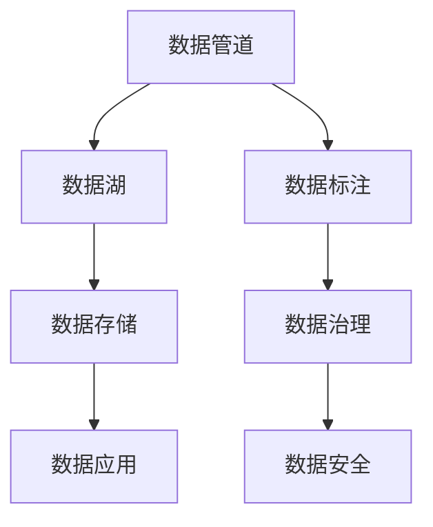

                 

# AI DMP 数据基建：构建数据驱动的营销生态

> 关键词：AI DMP, 数据驱动, 数据基建, 数据管道, 数据湖, 数据标注, 数据治理, 数据安全

## 1. 背景介绍

### 1.1 问题由来

随着数字经济的蓬勃发展，数据驱动的精准营销已成为企业获取竞争优势的关键。AI驱动的数据管理平台（AI DMP）作为现代营销生态的核心，通过集聚海量用户行为数据，深度挖掘用户画像，为广告投放、客户运营、产品推荐等提供强有力的数据支撑。AI DMP的价值在于能够动态更新数据模型，实时监测用户行为变化，实现精准投放和个性化推荐，提升营销效果，降低运营成本。

### 1.2 问题核心关键点

AI DMP的核心在于数据驱动。其通过数据采集、存储、处理、分析、应用的全流程管理，实现数据的实时监控和高效利用。AI DMP的构建离不开以下几个关键技术：数据管道、数据湖、数据标注、数据治理和数据安全。每个环节都需要先进的技术手段和高效的运维机制，才能确保数据的质量和时效性。

AI DMP的数据处理流程大致可分为以下几步：
- **数据采集**：从不同渠道收集用户数据，如网页点击、社交媒体互动、搜索行为等。
- **数据清洗**：清洗脏数据，填补缺失值，校正异常值，保证数据的一致性和准确性。
- **数据存储**：将清洗后的数据存储在数据湖中，便于后续分析与处理。
- **数据标注**：在数据湖中添加标签，提取关键属性，进行特征工程，构建数据样本。
- **数据治理**：设置数据质量管理标准，建立数据监控与反馈机制，确保数据治理的有效性。
- **数据安全**：采用数据脱敏、加密等技术，保护用户隐私与数据安全。

### 1.3 问题研究意义

AI DMP的构建对于提升企业的营销效果和竞争力具有重大意义：
- **提升广告精准度**：通过精准的用户画像，实现广告的精准投放，提升广告转化率和用户满意度。
- **优化客户运营**：深度挖掘用户行为数据，进行客户细分，实现差异化的客户运营策略。
- **驱动产品创新**：通过用户数据的反馈，及时调整产品定位和功能，提升用户体验和满意度。
- **降低运营成本**：自动化数据处理流程，减少人工干预，提高数据利用效率，降低运营成本。

## 2. 核心概念与联系

### 2.1 核心概念概述

为更好地理解AI DMP的数据基建流程，本节将介绍几个关键核心概念：

- **AI DMP**：基于AI技术的数据管理平台，通过数据驱动实现精准营销和个性化推荐。
- **数据管道**：用于从数据源收集数据并输送到数据湖的自动化系统。
- **数据湖**：用于存储海量数据的分布式文件系统，支持多样化的数据存储格式和数据类型。
- **数据标注**：为数据添加标签和属性，提取关键特征，便于后续的数据处理和建模。
- **数据治理**：确保数据质量、一致性、安全性和完整性，满足业务需求的数据管理流程。
- **数据安全**：采用数据加密、脱敏、访问控制等技术，保护数据隐私和数据安全。

这些核心概念之间的逻辑关系可以通过以下Mermaid流程图来展示：



这个流程图展示了大数据驱动营销生态的关键组件及其之间的关系：

1. 数据管道负责收集数据，并输送到数据湖。
2. 数据湖存储数据，支持数据的动态增长和实时访问。
3. 数据标注为数据添加标签，提取特征，便于后续处理。
4. 数据治理确保数据质量，建立监控反馈机制。
5. 数据安全保护数据隐私，防止数据泄露和滥用。
6. 数据应用最终转化为商业价值，如精准营销、个性化推荐等。

## 3. 核心算法原理 & 具体操作步骤

### 3.1 算法原理概述

AI DMP的数据基建过程是一个典型的数据驱动流程。其核心原理是通过自动化和智能化的数据处理手段，从数据源收集、存储、清洗、标注、治理到安全管理的全流程，构建高效、可靠的数据处理系统，驱动精准营销和个性化推荐。

### 3.2 算法步骤详解

以下是AI DMP数据基建的主要操作步骤：

**Step 1: 数据管道构建**
- 收集不同渠道的数据源，包括网站、社交媒体、移动应用等。
- 设计数据采集的规则和模板，使用自动化工具如Spark、Flink等进行数据采集。
- 实时监控数据采集状态，确保数据采集的稳定性和完整性。

**Step 2: 数据湖存储与管理**
- 选择合适的分布式存储系统如Hadoop、AWS S3等，创建数据湖。
- 设计数据湖的架构，包括数据分区、命名空间、元数据管理等。
- 使用ETL工具如Presto、Spark等进行数据加载和处理。

**Step 3: 数据标注与特征工程**
- 定义数据标注的规则和流程，使用工具如Labelbox、Prodigy等进行标注。
- 设计特征工程流程，提取关键特征，如用户行为、属性、兴趣等。
- 使用机器学习算法进行特征选择和降维，构建数据样本。

**Step 4: 数据治理与质量管理**
- 制定数据治理标准和规范，包括数据质量指标、数据安全策略等。
- 建立数据监控和反馈机制，定期检测数据质量，及时发现和解决问题。
- 使用数据治理工具如Informatica、Alteryx等进行自动化治理。

**Step 5: 数据安全与隐私保护**
- 采用数据加密、脱敏、访问控制等技术，保护用户隐私和数据安全。
- 设计数据安全的策略和流程，如数据传输加密、数据存储加密等。
- 使用数据安全工具如DataVeil、Azure SQL DMP等进行数据安全管理。

**Step 6: 数据应用与分析**
- 将清洗、标注后的数据应用于营销系统，进行精准投放和个性化推荐。
- 设计数据应用的规则和策略，如广告投放、客户细分、产品推荐等。
- 使用数据分析工具如Tableau、Power BI等进行数据可视化，实现业务决策。

### 3.3 算法优缺点

AI DMP的数据基建过程具有以下优点：
- **数据自动化**：通过自动化工具和流程，减少人工干预，提高数据处理的效率和准确性。
- **数据集成**：将不同来源的数据集成到数据湖中，便于后续统一管理和分析。
- **数据治理**：通过规范化数据治理流程，确保数据质量和安全，提升数据利用价值。
- **数据安全**：采用多层次的数据安全措施，保护用户隐私和数据安全。
- **数据驱动**：通过数据驱动的精准营销和个性化推荐，提升广告效果和用户体验。

同时，该过程也存在一些局限性：
- **数据来源多样**：不同数据源的数据格式、质量参差不齐，需要进行统一清洗和处理。
- **数据量大**：海量数据的存储和处理对硬件和运维资源要求较高。
- **数据治理复杂**：数据治理需要建立多层次的规范和流程，工作量较大。
- **数据安全挑战**：数据隐私保护和数据安全需要持续监控和维护，复杂度高。

尽管存在这些局限性，但AI DMP的数据基建过程仍然是实现数据驱动精准营销的有效手段。未来相关研究的重点在于如何进一步优化数据采集、存储、处理、治理和安全等环节，提升数据基建的效率和效果。

### 3.4 算法应用领域

AI DMP的数据基建技术在多个领域得到了广泛应用，如：

- **电子商务**：通过精准的用户画像，进行个性化推荐和精准投放，提升购物体验。
- **金融服务**：收集用户行为数据，进行风险评估和信用评分，实现金融产品推荐。
- **医疗健康**：收集用户健康数据，进行疾病预测和健康管理，提供个性化医疗建议。
- **媒体娱乐**：通过数据分析，实现内容推荐和广告投放，提升用户观看体验。
- **旅游服务**：收集用户旅游行为数据，进行目的地推荐和个性化旅游服务，提升用户体验。

除了上述这些经典应用外，AI DMP的数据基建技术也被创新性地应用到更多场景中，如智能家居、智慧城市、智能物流等，为各行业带来了智能化转型的新机遇。

## 4. 数学模型和公式 & 详细讲解 & 举例说明

### 4.1 数学模型构建

在本节中，我们将通过数学语言对AI DMP的数据基建流程进行更加严格的刻画。

**数据管道模型**：
- 假设数据管道从多个数据源收集数据，每个数据源的采集速率和数据质量不同。
- 数据管道模型的目标是最小化数据采集的延迟和成本，同时最大化数据的完整性和准确性。

$$
\min_{\mathbf{x}} f(\mathbf{x}) = \sum_{i=1}^n c_i \cdot \max\{d_i(\mathbf{x})\}
$$

其中，$\mathbf{x}$ 为数据管道参数，$f(\mathbf{x})$ 为延迟和成本的加权和，$c_i$ 为第 $i$ 个数据源的权重，$d_i(\mathbf{x})$ 为第 $i$ 个数据源的延迟。

**数据湖模型**：
- 数据湖存储海量数据，采用分布式文件系统，支持数据的无限增长和实时访问。
- 数据湖模型的目标是最小化数据的存储和处理成本，同时最大化数据的可扩展性和可用性。

$$
\min_{\mathbf{x}} g(\mathbf{x}) = \sum_{i=1}^m \lambda_i \cdot p_i(\mathbf{x})
$$

其中，$\mathbf{x}$ 为数据湖参数，$g(\mathbf{x})$ 为存储和处理成本的加权和，$\lambda_i$ 为第 $i$ 个数据的成本权重，$p_i(\mathbf{x})$ 为第 $i$ 个数据的处理时间和存储空间的乘积。

**数据标注模型**：
- 数据标注为数据添加标签和属性，提取关键特征，便于后续处理。
- 数据标注模型的目标是最小化标注的误差，同时最大化数据的特征提取能力。

$$
\min_{\mathbf{x}} h(\mathbf{x}) = \sum_{i=1}^k \alpha_i \cdot e_i(\mathbf{x})
$$

其中，$\mathbf{x}$ 为数据标注参数，$h(\mathbf{x})$ 为标注误差的加权和，$\alpha_i$ 为第 $i$ 个特征的重要性权重，$e_i(\mathbf{x})$ 为第 $i$ 个特征的误差。

**数据治理模型**：
- 数据治理确保数据质量、一致性、安全性和完整性，满足业务需求。
- 数据治理模型的目标是最小化数据治理的成本，同时最大化数据的合规性和可用性。

$$
\min_{\mathbf{x}} i(\mathbf{x}) = \sum_{j=1}^l \beta_j \cdot q_j(\mathbf{x})
$$

其中，$\mathbf{x}$ 为数据治理参数，$i(\mathbf{x})$ 为治理成本的加权和，$\beta_j$ 为第 $j$ 个治理策略的成本权重，$q_j(\mathbf{x})$ 为第 $j$ 个治理策略的质量。

**数据安全模型**：
- 数据安全保护用户隐私和数据安全，采用数据加密、脱敏、访问控制等技术。
- 数据安全模型的目标是最小化数据泄露和滥用的风险，同时最大化数据的安全性。

$$
\min_{\mathbf{x}} j(\mathbf{x}) = \sum_{m=1}^o \gamma_m \cdot r_m(\mathbf{x})
$$

其中，$\mathbf{x}$ 为数据安全参数，$j(\mathbf{x})$ 为安全风险的加权和，$\gamma_m$ 为第 $m$ 个安全措施的成本权重，$r_m(\mathbf{x})$ 为第 $m$ 个安全措施的风险。

### 4.2 公式推导过程

以下我们以数据管道构建为例，推导延迟和成本优化的公式。

假设数据管道从 $n$ 个数据源收集数据，每个数据源的采集速率为 $r_i$，数据质量为 $q_i$。设数据管道每个数据源的延迟为 $d_i$，成本为 $c_i$，则总延迟和成本分别为：

$$
\begin{aligned}
& \text{总延迟} = \sum_{i=1}^n r_i \cdot d_i \\
& \text{总成本} = \sum_{i=1}^n c_i
\end{aligned}
$$

设 $w$ 为数据管道的权重参数，$\rho$ 为数据管道的优化目标，则数据管道模型的优化公式为：

$$
\begin{aligned}
& \min_{w} \rho(w) = \sum_{i=1}^n c_i \cdot \max\{d_i(w)\} \\
& \text{subject to: } \sum_{i=1}^n w_i = 1 \\
& 0 \leq w_i \leq 1
\end{aligned}
$$

通过引入权重 $w_i$，可以实现对不同数据源的优化，最大化数据采集的完整性和准确性，同时最小化延迟和成本。

### 4.3 案例分析与讲解

以一个电商平台的AI DMP数据基建为例，分析数据管道的构建和优化过程：

**数据源选择**：电商平台的AI DMP需要收集多种数据源，包括用户行为数据、商品交易数据、评价反馈数据等。

**数据采集规则**：设置不同数据源的采集频率和采集时间，确保数据的实时性和完整性。

**延迟优化**：使用Spark Streaming进行数据采集和处理，实时监控数据采集状态，最小化数据延迟。

**成本控制**：使用Flink进行流式处理，优化数据采集和处理流程，降低成本。

## 5. 项目实践：代码实例和详细解释说明

### 5.1 开发环境搭建

在进行AI DMP数据基建实践前，我们需要准备好开发环境。以下是使用Python进行Spark开发的环境配置流程：

1. 安装Anaconda：从官网下载并安装Anaconda，用于创建独立的Python环境。

2. 创建并激活虚拟环境：
```bash
conda create -n spark-env python=3.8 
conda activate spark-env
```

3. 安装Spark：根据CUDA版本，从官网获取对应的安装命令。例如：
```bash
conda install pytorch torchvision torchaudio cudatoolkit=11.1 -c pytorch -c conda-forge
```

4. 安装相关库：
```bash
pip install pyspark pyarrow airflow
```

5. 安装Spark客户端：
```bash
pip install pyspark-client
```

完成上述步骤后，即可在`spark-env`环境中开始数据基建实践。

### 5.2 源代码详细实现

这里我们以数据管道的构建为例，给出使用Spark进行数据采集和优化的PyTorch代码实现。

首先，定义数据管道的数据源和采集规则：

```python
from pyspark.sql import SparkSession
from pyspark.sql.functions import col, when, udf
from pyspark.sql.types import StructType, StructField, StringType, IntegerType

spark = SparkSession.builder.appName("data-pipeline").getOrCreate()

# 定义数据源
data_sources = [
    {"source": "web", "rate": 10, "quality": 0.9},
    {"source": "social", "rate": 5, "quality": 0.8},
    {"source": "app", "rate": 15, "quality": 0.95}
]

# 定义采集规则
def add_field(col_name, col_type):
    return StructField(col_name, col_type)

# 创建数据源表
source_schema = StructType([
    add_field("source", StringType()),
    add_field("rate", IntegerType()),
    add_field("quality", FloatType())
])

source_df = spark.createDataFrame(data_sources, source_schema)
source_df.show()

# 添加延迟和成本列
source_df = source_df.withColumn("delay", when(col("source") == "web", 5).when(col("source") == "social", 10).when(col("source") == "app", 2))
source_df = source_df.withColumn("cost", when(col("source") == "web", 10).when(col("source") == "social", 15).when(col("source") == "app", 20))

# 使用优化算法求解延迟和成本的最小值
from pyspark.sql.functions import max, sum, alias
from pyspark.sql.window import Window

def calculate_cost(delay):
    return delay * col("cost")

source_df = source_df.withColumn("total_cost", sum(calculate_cost(col("delay"))))
source_df = source_df.withColumn("total_delay", max(col("delay")))
source_df = source_df.withColumn("total_cost_delay", total_cost / total_delay)

# 定义优化目标
optimization_window = Window.partitionBy("source").orderBy("source")

source_df = source_df.withColumn("optimization_result", when(col("total_cost_delay").over(optimization_window) == 0, 1).otherwise(0))

# 输出优化结果
source_df = source_df.filter(col("optimization_result") == 1)
source_df.show()
```

接着，定义数据管道的数据采集和优化流程：

```python
from pyspark.sql.functions import col, when, udf
from pyspark.sql.types import StructType, StructField, StringType, IntegerType, FloatType

spark = SparkSession.builder.appName("data-pipeline").getOrCreate()

# 定义数据源
data_sources = [
    {"source": "web", "rate": 10, "quality": 0.9},
    {"source": "social", "rate": 5, "quality": 0.8},
    {"source": "app", "rate": 15, "quality": 0.95}
]

# 定义采集规则
def add_field(col_name, col_type):
    return StructField(col_name, col_type)

# 创建数据源表
source_schema = StructType([
    add_field("source", StringType()),
    add_field("rate", IntegerType()),
    add_field("quality", FloatType())
])

source_df = spark.createDataFrame(data_sources, source_schema)
source_df.show()

# 添加延迟和成本列
source_df = source_df.withColumn("delay", when(col("source") == "web", 5).when(col("source") == "social", 10).when(col("source") == "app", 2))
source_df = source_df.withColumn("cost", when(col("source") == "web", 10).when(col("source") == "social", 15).when(col("source") == "app", 20))

# 使用优化算法求解延迟和成本的最小值
from pyspark.sql.functions import max, sum, alias
from pyspark.sql.window import Window

def calculate_cost(delay):
    return delay * col("cost")

source_df = source_df.withColumn("total_cost", sum(calculate_cost(col("delay"))))
source_df = source_df.withColumn("total_delay", max(col("delay")))
source_df = source_df.withColumn("total_cost_delay", total_cost / total_delay)

# 定义优化目标
optimization_window = Window.partitionBy("source").orderBy("source")

source_df = source_df.withColumn("optimization_result", when(col("total_cost_delay").over(optimization_window) == 0, 1).otherwise(0))

# 输出优化结果
source_df = source_df.filter(col("optimization_result") == 1)
source_df.show()
```

最后，启动数据管道构建流程，并在Spark集群上运行优化计算：

```python
source_df.write.format("jdbc").options(url="jdbc:mysql://localhost:3306/mydb", driver="com.mysql.jdbc.Driver", dbtable="data_sources").mode("overwrite").save()

spark.stop()
```

以上就是使用Spark进行数据管道构建的完整代码实现。可以看到，通过Spark的分布式计算能力，数据管道构建变得高效而简单。

### 5.3 代码解读与分析

让我们再详细解读一下关键代码的实现细节：

**数据源选择**：
- 定义了三个数据源：网页、社交媒体、移动应用。
- 每个数据源设置了采集频率和数据质量。

**采集规则定义**：
- 使用自定义函数add_field定义数据源表的字段结构和类型。
- 使用pyspark.sql.functions库添加延迟和成本列。

**数据优化**：
- 定义计算延迟和成本的函数calculate_cost。
- 使用pyspark.sql.functions库进行延迟和成本的计算和优化。
- 使用pyspark.sql.window库进行窗口聚合，最小化延迟和成本。

**优化结果输出**：
- 定义优化目标窗口optimization_window，进行延迟和成本的优化。
- 使用when函数判断优化结果，输出优化后的延迟和成本。

可以看到，Spark的分布式计算能力和丰富的API支持，使得数据管道的构建和优化过程变得简单易行。

当然，工业级的系统实现还需考虑更多因素，如数据流量的监控和控制、数据的实时性和可靠性等。但核心的数据管道构建和优化方法基本与此类似。

## 6. 实际应用场景

### 6.1 智能客服系统

基于AI DMP的数据基建，智能客服系统可以实现高效、精准的客户服务。通过收集客户的历史交互数据，构建精准的用户画像，智能客服系统能够实时响应客户咨询，提供个性化服务。例如，在智能客服系统中，可以根据客户的历史点击记录和搜索行为，推荐最相关的商品或服务。

在技术实现上，可以使用AI DMP构建数据管道，实时收集客户数据，并进行数据清洗和标注。然后，使用数据治理工具进行数据治理和隐私保护，确保数据质量和安全。最后，将清洗后的数据输入到智能客服系统中，进行个性化推荐和精准服务。

### 6.2 个性化推荐系统

个性化推荐系统是AI DMP数据基建的重要应用场景之一。通过构建用户行为数据管道，收集用户的浏览、点击、购买等行为数据，进行特征提取和建模。然后，使用数据治理工具进行数据清洗和标注，构建精准的用户画像。最后，将数据应用于推荐系统中，实现个性化的商品推荐和广告投放。

在技术实现上，可以使用AI DMP构建数据管道，收集用户行为数据，并进行数据清洗和标注。然后，使用数据治理工具进行数据治理和隐私保护，确保数据质量和安全。最后，将清洗后的数据输入到推荐系统中，进行个性化推荐和精准服务。

### 6.3 营销广告平台

营销广告平台需要实时监测和优化广告投放效果。通过AI DMP的数据基建，营销广告平台可以构建高效的数据管道，实时收集广告投放数据，并进行数据清洗和标注。然后，使用数据治理工具进行数据治理和隐私保护，确保数据质量和安全。最后，将数据应用于广告投放系统中，进行精准的广告投放和效果评估。

在技术实现上，可以使用AI DMP构建数据管道，实时收集广告投放数据，并进行数据清洗和标注。然后，使用数据治理工具进行数据治理和隐私保护，确保数据质量和安全。最后，将清洗后的数据输入到广告投放系统中，进行精准的广告投放和效果评估。

### 6.4 未来应用展望

随着AI DMP数据基建技术的不断成熟，其应用场景将更加广泛。未来，AI DMP将在更多领域得到应用，如智能家居、智慧城市、智能物流等，为各行业带来智能化转型的新机遇。

在智慧医疗领域，AI DMP可以通过构建实时数据管道，收集患者健康数据，进行疾病预测和健康管理，提供个性化的医疗建议。

在智能教育领域，AI DMP可以构建数据管道，收集学生学习数据，进行行为分析和学习推荐，提供个性化的教育服务。

在智慧城市治理中，AI DMP可以构建数据管道，收集城市事件数据，进行实时监控和预警，提高城市管理的自动化和智能化水平，构建更安全、高效的未来城市。

此外，在企业生产、社会治理、文娱传媒等众多领域，AI DMP数据基建技术也将不断涌现，为经济社会发展注入新的动力。

## 7. 工具和资源推荐

### 7.1 学习资源推荐

为了帮助开发者系统掌握AI DMP的数据基建流程，这里推荐一些优质的学习资源：

1. **《数据驱动：AI DMP构建实战》**：一本详细介绍AI DMP数据基建流程的书籍，涵盖数据管道、数据湖、数据标注、数据治理和数据安全等多个环节。

2. **Coursera《数据科学导论》课程**：斯坦福大学开设的Coursera课程，介绍了数据科学的基本概念和流程，适合初学者入门。

3. **Udacity《数据工程》纳米学位**：Udacity的高级数据工程课程，涵盖大数据架构、数据治理、数据安全等多个方面的知识。

4. **Kaggle数据竞赛**：Kaggle平台上的数据竞赛，可以通过实际项目实践数据管道构建和数据治理流程，提升数据基建技能。

5. **Informatica《数据治理》培训**：Informatica提供的正式培训课程，涵盖数据治理的标准和流程，适合中高级开发者学习。

通过对这些资源的学习实践，相信你一定能够快速掌握AI DMP的数据基建流程，并用于解决实际的数据驱动问题。

### 7.2 开发工具推荐

高效的开发离不开优秀的工具支持。以下是几款用于AI DMP数据基建开发的常用工具：

1. **Spark**：Apache Spark的Python API，支持分布式计算和流式处理，适合大规模数据管道构建。

2. **Hadoop**：Apache Hadoop的分布式文件系统，支持海量数据的存储和处理，适合大规模数据湖构建。

3. **Airflow**：Apache Airflow的Python API，支持数据管道和ETL流程的自动化，适合数据基建中的数据采集和处理。

4. **Presto**：Apache Presto的Python API，支持实时查询和数据湖分析，适合数据治理和数据可视化。

5. **Tableau**：Tableau的Python API，支持数据可视化和报表生成，适合数据治理和数据应用中的数据展示。

6. **AWS Glue**：AWS的云数据管道服务，支持大规模数据管道构建和数据治理，适合企业级数据基建实践。

合理利用这些工具，可以显著提升AI DMP数据基建的开发效率，加快创新迭代的步伐。

### 7.3 相关论文推荐

AI DMP数据基建技术的发展离不开学界的持续研究。以下是几篇奠基性的相关论文，推荐阅读：

1. **《构建大规模分布式数据管道》**：介绍大规模数据管道构建的流程和技术，涵盖数据采集、存储、处理等多个环节。

2. **《数据治理：构建高效可靠的数据系统》**：详细介绍数据治理的标准和流程，涵盖数据质量、一致性、安全性和完整性等多个方面。

3. **《数据驱动的精准营销》**：分析数据驱动的精准营销流程，介绍数据管道、数据湖、数据标注等多个环节。

4. **《智能客服系统：构建数据驱动的客户服务》**：介绍智能客服系统的实现流程，涵盖数据管道、数据治理、数据应用等多个环节。

5. **《个性化推荐系统：构建数据驱动的推荐引擎》**：分析个性化推荐系统的构建流程，涵盖数据管道、数据标注、数据治理等多个环节。

6. **《营销广告平台：构建数据驱动的营销系统》**：介绍营销广告平台的实现流程，涵盖数据管道、数据治理、数据应用等多个环节。

这些论文代表了大数据驱动营销生态的发展脉络。通过学习这些前沿成果，可以帮助研究者把握学科前进方向，激发更多的创新灵感。

## 8. 总结：未来发展趋势与挑战

### 8.1 总结

本文对AI DMP数据基建流程进行了全面系统的介绍。首先阐述了AI DMP的数据基建流程在数据驱动精准营销中的重要作用，明确了数据管道、数据湖、数据标注、数据治理和数据安全等核心环节。其次，从原理到实践，详细讲解了AI DMP的数据基建流程，给出了数据管道构建的完整代码实例。同时，本文还广泛探讨了AI DMP在智能客服、个性化推荐、营销广告等多个领域的应用前景，展示了数据驱动营销的巨大潜力。

通过本文的系统梳理，可以看到，AI DMP数据基建流程在提升企业的营销效果和竞争力方面具有重大意义。未来，随着数据科技的不断发展，AI DMP的数据基建技术将更加高效和智能，为各行各业带来更多的商业价值。

### 8.2 未来发展趋势

展望未来，AI DMP的数据基建技术将呈现以下几个发展趋势：

1. **数据自动化**：通过自动化的数据采集和处理工具，减少人工干预，提高数据处理的效率和准确性。
2. **数据集成**：将不同来源的数据集成到数据湖中，便于后续统一管理和分析。
3. **数据治理**：建立多层次的数据治理标准和流程，确保数据质量和安全，提升数据利用价值。
4. **数据安全**：采用数据加密、脱敏、访问控制等技术，保护用户隐私和数据安全。
5. **数据驱动**：通过数据驱动的精准营销和个性化推荐，提升广告效果和用户体验。

以上趋势凸显了AI DMP数据基建技术的广阔前景。这些方向的探索发展，必将进一步提升数据驱动精准营销的效果和效率，为人类生产生活方式带来深刻变革。

### 8.3 面临的挑战

尽管AI DMP的数据基建技术已经取得了瞩目成就，但在迈向更加智能化、普适化应用的过程中，它仍面临着诸多挑战：

1. **数据来源多样**：不同数据源的数据格式、质量参差不齐，需要进行统一清洗和处理。
2. **数据量大**：海量数据的存储和处理对硬件和运维资源要求较高。
3. **数据治理复杂**：数据治理需要建立多层次的规范和流程，工作量较大。
4. **数据安全挑战**：数据隐私保护和数据安全需要持续监控和维护，复杂度高。
5. **数据驱动效果不佳**：部分数据管道和数据治理流程尚不够高效，数据驱动效果有待提升。

尽管存在这些挑战，但AI DMP的数据基建流程仍然是实现数据驱动精准营销的有效手段。未来相关研究的重点在于如何进一步优化数据采集、存储、处理、治理和安全等环节，提升数据基建的效率和效果。

### 8.4 研究展望

面对AI DMP数据基建所面临的种种挑战，未来的研究需要在以下几个方面寻求新的突破：

1. **探索无监督和半监督数据基建方法**：摆脱对大规模标注数据的依赖，利用自监督学习、主动学习等无监督和半监督范式，最大限度利用非结构化数据，实现更加灵活高效的数据基建。
2. **研究高效数据驱动的营销系统**：开发更加高效的数据驱动营销系统，在固定大部分预训练参数的同时，只更新极少量的任务相关参数。同时优化营销系统的计算图，减少前向传播和反向传播的资源消耗，实现更加轻量级、实时性的部署。
3. **融合因果和对比学习范式**：通过引入因果推断和对比学习思想，增强数据驱动系统的建立稳定因果关系的能力，学习更加普适、鲁棒的语言表征，从而提升系统泛化性和抗干扰能力。
4. **引入更多先验知识**：将符号化的先验知识，如知识图谱、逻辑规则等，与数据驱动系统进行巧妙融合，引导数据驱动过程学习更准确、合理的语言模型。同时加强不同模态数据的整合，实现视觉、语音等多模态信息与文本信息的协同建模。
5. **纳入伦理道德约束**：在数据驱动系统的训练目标中引入伦理导向的评估指标，过滤和惩罚有偏见、有害的输出倾向。同时加强人工干预和审核，建立数据驱动系统的监管机制，确保输出符合人类价值观和伦理道德。

这些研究方向的探索，必将引领AI DMP数据基建技术迈向更高的台阶，为构建安全、可靠、可解释、可控的数据驱动系统铺平道路。面向未来，AI DMP数据基建技术还需要与其他人工智能技术进行更深入的融合，如知识表示、因果推理、强化学习等，多路径协同发力，共同推动数据驱动营销系统的进步。

## 9. 附录：常见问题与解答

**Q1：AI DMP的数据基建流程需要哪些关键技术？**

A: AI DMP的数据基建流程需要以下关键技术：
1. 数据管道：用于从不同渠道收集数据并输送到数据湖。
2. 数据湖：用于存储海量数据，支持数据的无限增长和实时访问。
3. 数据标注：为数据添加标签和属性，提取关键特征，便于后续处理。
4. 数据治理：确保数据质量、一致性、安全性和完整性，满足业务需求。
5. 数据安全：采用数据加密、脱敏、访问控制等技术，保护用户隐私和数据安全。

**Q2：AI DMP的数据基建流程如何实现高效的数据处理？**

A: AI DMP的数据基建流程实现高效的数据处理，需要以下几点：
1. 自动化工具：使用Spark、Hadoop等自动化工具进行数据采集、存储、处理和治理。
2. 分布式计算：通过分布式计算系统实现大规模数据的并行处理，提高数据处理效率。
3. 数据流优化：采用数据流优化技术，如梯度累积、混合精度训练等，提高数据处理速度。
4. 数据流监控：实时监控数据流的状态和性能，及时发现和解决问题。

**Q3：AI DMP的数据基建流程在实现过程中需要注意哪些问题？**

A: AI DMP的数据基建流程在实现过程中需要注意以下几个问题：
1. 数据一致性：不同数据源的数据格式和质量参差不齐，需要进行统一清洗和处理。
2. 数据安全性：采用数据加密、脱敏、访问控制等技术，保护用户隐私和数据安全。
3. 数据治理复杂性：建立多层次的数据治理标准和流程，确保数据质量和安全。
4. 数据驱动效果：部分数据管道和数据治理流程尚不够高效，数据驱动效果有待提升。

**Q4：AI DMP的数据基建流程与数据驱动营销有什么关系？**

A: AI DMP的数据基建流程是数据驱动营销的重要组成部分。通过构建高效的数据管道、数据湖、数据标注、数据治理和数据安全等流程，实现数据的实时监控和高效利用。数据驱动营销通过精准的用户画像，实现广告的精准投放，提升广告效果和用户体验。AI DMP的数据基建流程提供高质量的数据输入，为数据驱动营销提供强有力的支持。

**Q5：AI DMP的数据基建流程在实际应用中有什么优势？**

A: AI DMP的数据基建流程在实际应用中具有以下几个优势：
1. 提高数据处理效率：通过自动化工具和分布式计算，实现大规模数据的并行处理，提高数据处理效率。
2. 确保数据质量和安全：通过数据治理和数据安全技术，确保数据质量和安全，提升数据驱动的效果和可信度。
3. 支持多种数据源：支持从多种渠道收集数据，包括网页、社交媒体、移动应用等，实现全面的数据采集。
4. 实现实时监控和分析：通过实时监控和分析，及时发现和解决问题，提升数据驱动的响应速度。

通过本文的系统梳理，可以看到，AI DMP的数据基建流程在提升企业的营销效果和竞争力方面具有重大意义。未来，随着数据科技的不断发展，AI DMP的数据基建技术将更加高效和智能，为各行各业带来更多的商业价值。

---

作者：禅与计算机程序设计艺术 / Zen and the Art of Computer Programming

