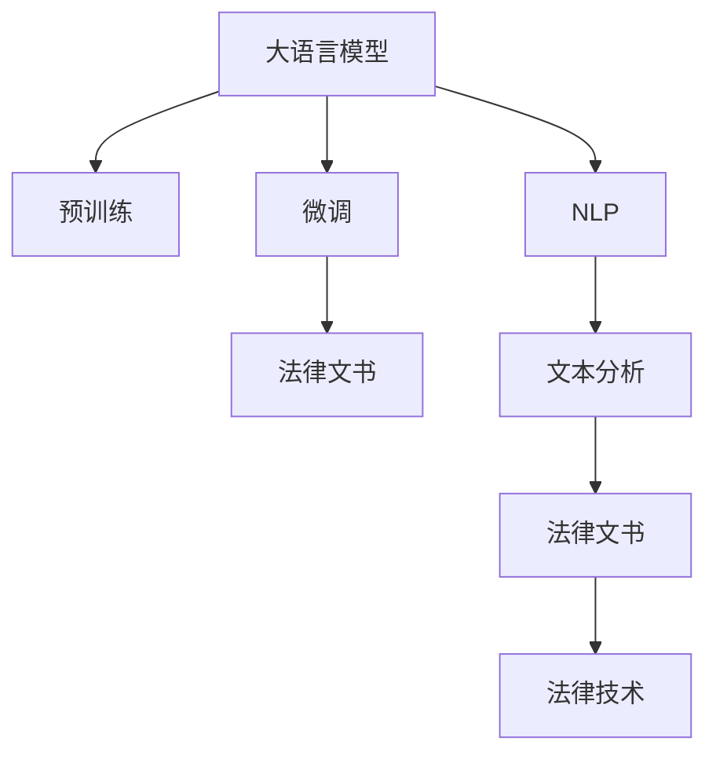

                 

# AI LLM在法律文书分析中的应用

> 关键词：法律文书分析, 人工智能, 大语言模型, 自然语言处理, 文本分析, 法律技术

## 1. 背景介绍

### 1.1 问题由来
随着人工智能技术的不断进步，大语言模型（Large Language Model, LLM）在自然语言处理（Natural Language Processing, NLP）领域取得了显著成就，尤其是在文本分析、语义理解、情感识别等方面表现出色。法律文书作为法律实践的基础性文本，是法律研究和司法判例的重要信息源，对法律文书进行高效、准确的分析，对于提升法律工作质量和效率，推动司法公正具有重要意义。

### 1.2 问题核心关键点
法律文书分析包括案件文书（如诉状、判决书、裁定书等）和法规文件（如宪法、民法、刑法等）的分析。这些文书的分析需要处理大量法律专业术语、判决逻辑和复杂结构，传统的文本分析方法难以胜任。

大语言模型在预训练阶段经历了大规模无监督学习，能够提取丰富的语言特征和知识，通过对法律文书的微调，可以适应特定法律领域的特点，并挖掘出其中的法律关系、判决逻辑和立法意图，为法律工作提供有力支持。

### 1.3 问题研究意义
法律文书分析涉及对文本信息的深度理解和高级推理，利用大语言模型可以有效提升文书处理的自动化程度和分析效率，减少人工审核的复杂度和成本。具体应用包括：
- **法律条款解析**：将法律文书与具体条款进行匹配，提供法规解读和应用指引。
- **判决结果预测**：通过分析历史判决案例，预测新案件的判决结果。
- **法律风险评估**：根据文书内容评估法律风险，辅助律师进行风险预警。
- **法律知识图谱构建**：建立法律知识网络，为法律研究和立法提供数据支持。

本文聚焦于大语言模型在法律文书分析中的应用，探讨了模型架构、微调方法、实际案例及未来发展方向，为法律人工智能的研究与应用提供指导。

## 2. 核心概念与联系

### 2.1 核心概念概述

为更好地理解大语言模型在法律文书分析中的应用，本节将介绍几个密切相关的核心概念：

- 大语言模型(Large Language Model, LLM)：基于自回归模型或自编码模型的预训练语言模型，如GPT、BERT等。通过在大量无标签文本数据上进行预训练，学习通用的语言表示和语言知识。
- 预训练(Pre-training)：在大量无标签文本数据上，通过自监督学习任务训练模型，学习语言的通用表示。
- 微调(Fine-tuning)：在预训练模型基础上，使用下游任务的少量标注数据，通过有监督学习优化模型在特定任务上的性能。
- 自然语言处理(Natural Language Processing, NLP)：涉及计算机处理和理解自然语言的技术，包括文本分析、情感识别、语义理解等。
- 文本分析(Text Analysis)：利用计算机技术对文本进行结构化、半结构化和非结构化数据的处理和分析。
- 法律文书(Legal Document)：包括法律文件、案件文书、法规文件等，是法律研究和司法判例的重要信息源。
- 法律技术(Legal Technology)：将人工智能技术应用于法律研究和司法判例，提升法律工作质量和效率的技术。

这些核心概念之间的逻辑关系可以通过以下Mermaid流程图来展示：



这个流程图展示了大语言模型与相关概念的联系：

1. 大语言模型通过预训练获得基础能力。
2. 微调对预训练模型进行特定任务的优化，使其适应法律文书分析的需求。
3. NLP技术用于处理和理解法律文书。
4. 文本分析对法律文书进行结构化处理。
5. 法律文书作为NLP和文本分析的目标数据集。
6. 法律技术将大语言模型应用于法律研究和司法判例中，提升法律工作质量。

## 3. 核心算法原理 & 具体操作步骤
### 3.1 算法原理概述

基于大语言模型的法律文书分析，实质上是通过微调技术，将预训练的语言模型转化为特定领域的法律文书处理工具。其核心思想是：在法律文书的标注数据集上进行有监督学习，使模型学习到法律领域的语言结构和知识，进而能够理解和分析法律文书的逻辑和内容。

具体而言，假设预训练的语言模型为 $M_{\theta}$，其中 $\theta$ 为预训练得到的模型参数。给定法律文书分析任务 $T$ 的标注数据集 $D=\{(x_i, y_i)\}_{i=1}^N, x_i \in \mathcal{X}, y_i \in \mathcal{Y}$，微调的目标是找到新的模型参数 $\hat{\theta}$，使得：

$$
\hat{\theta}=\mathop{\arg\min}_{\theta} \mathcal{L}(M_{\theta},D)
$$

其中 $\mathcal{L}$ 为针对任务 $T$ 设计的损失函数，用于衡量模型预测输出与真实标签之间的差异。

### 3.2 算法步骤详解

基于大语言模型的法律文书分析微调一般包括以下几个关键步骤：

**Step 1: 准备预训练模型和数据集**
- 选择合适的预训练语言模型 $M_{\theta}$，如BERT、GPT等。
- 准备法律文书分析任务的标注数据集 $D$，包括案件文书和法规文件，划分为训练集、验证集和测试集。

**Step 2: 添加任务适配层**
- 根据法律文书分析任务类型，设计合适的输出层和损失函数。例如，对于法律条款解析任务，顶层添加线性分类器和交叉熵损失函数。
- 对于判决结果预测任务，通常使用语言模型的解码器输出概率分布，并以负对数似然为损失函数。

**Step 3: 设置微调超参数**
- 选择合适的优化算法及其参数，如AdamW、SGD等，设置学习率、批大小、迭代轮数等。
- 设置正则化技术及强度，包括权重衰减、Dropout、Early Stopping等。
- 确定冻结预训练参数的策略，如仅微调顶层，或全部参数都参与微调。

**Step 4: 执行梯度训练**
- 将训练集数据分批次输入模型，前向传播计算损失函数。
- 反向传播计算参数梯度，根据设定的优化算法和学习率更新模型参数。
- 周期性在验证集上评估模型性能，根据性能指标决定是否触发 Early Stopping。
- 重复上述步骤直到满足预设的迭代轮数或 Early Stopping 条件。

**Step 5: 测试和部署**
- 在测试集上评估微调后模型 $M_{\hat{\theta}}$ 的性能，对比微调前后的精度提升。
- 使用微调后的模型对新法律文书进行推理预测，集成到实际的应用系统中。
- 持续收集新的法律文书，定期重新微调模型，以适应数据分布的变化。

以上是基于大语言模型的法律文书分析微调的一般流程。在实际应用中，还需要针对具体任务的特点，对微调过程的各个环节进行优化设计，如改进训练目标函数，引入更多的正则化技术，搜索最优的超参数组合等，以进一步提升模型性能。

### 3.3 算法优缺点

基于大语言模型的法律文书分析微调方法具有以下优点：
1. 提升文书处理效率。大语言模型可以快速分析大量的法律文书，减少人工审核工作量，提高处理速度。
2. 丰富文书分析功能。通过微调，模型可以学习到法律领域的特定知识，进行法律条款解析、判决结果预测等复杂任务。
3. 适应性强。大语言模型可以通过微调适应不同法律领域的文书分析需求，具备良好的泛化能力。
4. 降低成本。微调技术减少了对专家和人工审核的依赖，降低法律文书分析的成本和复杂度。

同时，该方法也存在一定的局限性：
1. 依赖标注数据。微调的效果很大程度上取决于标注数据的质量和数量，获取高质量标注数据的成本较高。
2. 法律领域的复杂性。法律文书涉及复杂的法律逻辑和专业术语，微调模型的性能提升可能受限于这些领域的知识。
3. 模型的可解释性不足。微调模型可能难以解释其推理过程，导致法律工作中的决策不透明。

尽管存在这些局限性，但就目前而言，基于大语言模型的法律文书分析微调方法仍是大规模法律文书处理和分析的重要手段。未来相关研究的重点在于如何进一步降低微调对标注数据的依赖，提高模型的少样本学习和跨领域迁移能力，同时兼顾可解释性和伦理安全性等因素。

### 3.4 算法应用领域

基于大语言模型的法律文书分析，已经在多个法律领域得到了应用，例如：

- **法律条款解析**：将法律条款与案件文书进行匹配，解析文书中的法律依据和具体条款。
- **判决结果预测**：根据案件文书的历史判决案例，预测新案件的判决结果。
- **法律风险评估**：分析案件文书内容，评估法律风险，辅助律师进行风险预警。
- **法律知识图谱构建**：从法律文书和法规文件中提取法律实体和关系，构建法律知识图谱，为法律研究和立法提供数据支持。
- **法律文献分析**：对法律文献进行文本分析，提取关键信息和知识，辅助法律教育和学习。

除了上述这些经典任务外，大语言模型在法律文书分析的应用还涉及法理研究、智能合约、司法判例分析等多个领域，为法律工作的智能化和信息化提供了新的技术支持。

## 4. 数学模型和公式 & 详细讲解
### 4.1 数学模型构建

本节将使用数学语言对基于大语言模型的法律文书分析过程进行更加严格的刻画。

记预训练语言模型为 $M_{\theta}$，其中 $\theta$ 为预训练得到的模型参数。假设微调任务的训练集为 $D=\{(x_i,y_i)\}_{i=1}^N, x_i \in \mathcal{X}, y_i \in \mathcal{Y}$。

定义模型 $M_{\theta}$ 在输入 $x$ 上的损失函数为 $\ell(M_{\theta}(x),y)$，则在数据集 $D$ 上的经验风险为：

$$
\mathcal{L}(\theta) = \frac{1}{N} \sum_{i=1}^N \ell(M_{\theta}(x_i),y_i)
$$

微调的优化目标是最小化经验风险，即找到最优参数：

$$
\theta^* = \mathop{\arg\min}_{\theta} \mathcal{L}(\theta)
$$

在实践中，我们通常使用基于梯度的优化算法（如SGD、Adam等）来近似求解上述最优化问题。设 $\eta$ 为学习率，$\lambda$ 为正则化系数，则参数的更新公式为：

$$
\theta \leftarrow \theta - \eta \nabla_{\theta}\mathcal{L}(\theta) - \eta\lambda\theta
$$

其中 $\nabla_{\theta}\mathcal{L}(\theta)$ 为损失函数对参数 $\theta$ 的梯度，可通过反向传播算法高效计算。

### 4.2 公式推导过程

以下我们以法律条款解析任务为例，推导交叉熵损失函数及其梯度的计算公式。

假设模型 $M_{\theta}$ 在输入 $x$ 上的输出为 $\hat{y}=M_{\theta}(x) \in [0,1]$，表示样本属于特定法律条款的概率。真实标签 $y \in \{0,1\}$。则二分类交叉熵损失函数定义为：

$$
\ell(M_{\theta}(x),y) = -[y\log \hat{y} + (1-y)\log (1-\hat{y})]
$$

将其代入经验风险公式，得：

$$
\mathcal{L}(\theta) = -\frac{1}{N}\sum_{i=1}^N [y_i\log M_{\theta}(x_i)+(1-y_i)\log(1-M_{\theta}(x_i))]
$$

根据链式法则，损失函数对参数 $\theta_k$ 的梯度为：

$$
\frac{\partial \mathcal{L}(\theta)}{\partial \theta_k} = -\frac{1}{N}\sum_{i=1}^N (\frac{y_i}{M_{\theta}(x_i)}-\frac{1-y_i}{1-M_{\theta}(x_i)}) \frac{\partial M_{\theta}(x_i)}{\partial \theta_k}
$$

其中 $\frac{\partial M_{\theta}(x_i)}{\partial \theta_k}$ 可进一步递归展开，利用自动微分技术完成计算。

在得到损失函数的梯度后，即可带入参数更新公式，完成模型的迭代优化。重复上述过程直至收敛，最终得到适应法律文书分析任务的最优模型参数 $\theta^*$。

## 5. 项目实践：代码实例和详细解释说明
### 5.1 开发环境搭建

在进行法律文书分析微调实践前，我们需要准备好开发环境。以下是使用Python进行PyTorch开发的环境配置流程：

1. 安装Anaconda：从官网下载并安装Anaconda，用于创建独立的Python环境。

2. 创建并激活虚拟环境：
```bash
conda create -n pytorch-env python=3.8 
conda activate pytorch-env
```

3. 安装PyTorch：根据CUDA版本，从官网获取对应的安装命令。例如：
```bash
conda install pytorch torchvision torchaudio cudatoolkit=11.1 -c pytorch -c conda-forge
```

4. 安装Transformers库：
```bash
pip install transformers
```

5. 安装各类工具包：
```bash
pip install numpy pandas scikit-learn matplotlib tqdm jupyter notebook ipython
```

完成上述步骤后，即可在`pytorch-env`环境中开始微调实践。

### 5.2 源代码详细实现

下面我们以法律条款解析任务为例，给出使用Transformers库对BERT模型进行微调的PyTorch代码实现。

首先，定义任务的数据处理函数：

```python
from transformers import BertTokenizer
from torch.utils.data import Dataset
import torch

class LegalDocumentDataset(Dataset):
    def __init__(self, texts, tags, tokenizer, max_len=128):
        self.texts = texts
        self.tags = tags
        self.tokenizer = tokenizer
        self.max_len = max_len
        
    def __len__(self):
        return len(self.texts)
    
    def __getitem__(self, item):
        text = self.texts[item]
        tags = self.tags[item]
        
        encoding = self.tokenizer(text, return_tensors='pt', max_length=self.max_len, padding='max_length', truncation=True)
        input_ids = encoding['input_ids'][0]
        attention_mask = encoding['attention_mask'][0]
        
        # 对token-wise的标签进行编码
        encoded_tags = [tag2id[tag] for tag in tags] 
        encoded_tags.extend([tag2id['O']] * (self.max_len - len(encoded_tags)))
        labels = torch.tensor(encoded_tags, dtype=torch.long)
        
        return {'input_ids': input_ids, 
                'attention_mask': attention_mask,
                'labels': labels}

# 标签与id的映射
tag2id = {'O': 0, 'CL款一': 1, 'CL款二': 2, 'CL款三': 3, 'CL款四': 4, 'CL款五': 5, 'CL款六': 6}
id2tag = {v: k for k, v in tag2id.items()}

# 创建dataset
tokenizer = BertTokenizer.from_pretrained('bert-base-cased')

train_dataset = LegalDocumentDataset(train_texts, train_tags, tokenizer)
dev_dataset = LegalDocumentDataset(dev_texts, dev_tags, tokenizer)
test_dataset = LegalDocumentDataset(test_texts, test_tags, tokenizer)
```

然后，定义模型和优化器：

```python
from transformers import BertForTokenClassification, AdamW

model = BertForTokenClassification.from_pretrained('bert-base-cased', num_labels=len(tag2id))

optimizer = AdamW(model.parameters(), lr=2e-5)
```

接着，定义训练和评估函数：

```python
from torch.utils.data import DataLoader
from tqdm import tqdm
from sklearn.metrics import classification_report

device = torch.device('cuda') if torch.cuda.is_available() else torch.device('cpu')
model.to(device)

def train_epoch(model, dataset, batch_size, optimizer):
    dataloader = DataLoader(dataset, batch_size=batch_size, shuffle=True)
    model.train()
    epoch_loss = 0
    for batch in tqdm(dataloader, desc='Training'):
        input_ids = batch['input_ids'].to(device)
        attention_mask = batch['attention_mask'].to(device)
        labels = batch['labels'].to(device)
        model.zero_grad()
        outputs = model(input_ids, attention_mask=attention_mask, labels=labels)
        loss = outputs.loss
        epoch_loss += loss.item()
        loss.backward()
        optimizer.step()
    return epoch_loss / len(dataloader)

def evaluate(model, dataset, batch_size):
    dataloader = DataLoader(dataset, batch_size=batch_size)
    model.eval()
    preds, labels = [], []
    with torch.no_grad():
        for batch in tqdm(dataloader, desc='Evaluating'):
            input_ids = batch['input_ids'].to(device)
            attention_mask = batch['attention_mask'].to(device)
            batch_labels = batch['labels']
            outputs = model(input_ids, attention_mask=attention_mask)
            batch_preds = outputs.logits.argmax(dim=2).to('cpu').tolist()
            batch_labels = batch_labels.to('cpu').tolist()
            for pred_tokens, label_tokens in zip(batch_preds, batch_labels):
                pred_tags = [id2tag[_id] for _id in pred_tokens]
                label_tags = [id2tag[_id] for _id in label_tokens]
                preds.append(pred_tags[:len(label_tokens)])
                labels.append(label_tags)
                
    print(classification_report(labels, preds))
```

最后，启动训练流程并在测试集上评估：

```python
epochs = 5
batch_size = 16

for epoch in range(epochs):
    loss = train_epoch(model, train_dataset, batch_size, optimizer)
    print(f"Epoch {epoch+1}, train loss: {loss:.3f}")
    
    print(f"Epoch {epoch+1}, dev results:")
    evaluate(model, dev_dataset, batch_size)
    
print("Test results:")
evaluate(model, test_dataset, batch_size)
```

以上就是使用PyTorch对BERT进行法律文书分析任务微调的完整代码实现。可以看到，得益于Transformers库的强大封装，我们可以用相对简洁的代码完成BERT模型的加载和微调。

### 5.3 代码解读与分析

让我们再详细解读一下关键代码的实现细节：

**LegalDocumentDataset类**：
- `__init__`方法：初始化文本、标签、分词器等关键组件。
- `__len__`方法：返回数据集的样本数量。
- `__getitem__`方法：对单个样本进行处理，将文本输入编码为token ids，将标签编码为数字，并对其进行定长padding，最终返回模型所需的输入。

**tag2id和id2tag字典**：
- 定义了标签与数字id之间的映射关系，用于将token-wise的预测结果解码回真实的标签。

**训练和评估函数**：
- 使用PyTorch的DataLoader对数据集进行批次化加载，供模型训练和推理使用。
- 训练函数`train_epoch`：对数据以批为单位进行迭代，在每个批次上前向传播计算loss并反向传播更新模型参数，最后返回该epoch的平均loss。
- 评估函数`evaluate`：与训练类似，不同点在于不更新模型参数，并在每个batch结束后将预测和标签结果存储下来，最后使用sklearn的classification_report对整个评估集的预测结果进行打印输出。

**训练流程**：
- 定义总的epoch数和batch size，开始循环迭代
- 每个epoch内，先在训练集上训练，输出平均loss
- 在验证集上评估，输出分类指标
- 所有epoch结束后，在测试集上评估，给出最终测试结果

可以看到，PyTorch配合Transformers库使得BERT微调的代码实现变得简洁高效。开发者可以将更多精力放在数据处理、模型改进等高层逻辑上，而不必过多关注底层的实现细节。

当然，工业级的系统实现还需考虑更多因素，如模型的保存和部署、超参数的自动搜索、更灵活的任务适配层等。但核心的微调范式基本与此类似。

## 6. 实际应用场景
### 6.1 智能法律服务

基于大语言模型的法律文书分析，可以广泛应用于智能法律服务系统的构建。传统法律服务往往需要律师具备丰富的法律知识和经验，人工处理文档，效率低且成本高。而使用微调后的文书分析模型，可以自动识别和解析法律文书，提供法规解读、法律建议、风险预警等智能服务。

在技术实现上，可以收集律师在处理案件文书时的历史标注数据，训练模型学习如何从法律文本中提取关键信息。微调后的文书分析模型可以自动理解法律文书的内容，匹配相应的法规条款，辅助律师进行文书处理，提高工作效率，减少错误率。

### 6.2 法律知识图谱构建

法律文书包含大量的法律实体和关系，如法律条款、司法案例、法规文件等。通过微调，可以从这些文书中提取法律实体和关系，构建法律知识图谱，为法律研究和立法提供数据支持。

法律知识图谱可以为法律专家提供全面的知识检索服务，加速法律研究进程。同时，图谱还可以用于法律建议生成、法律文书自动生成等应用，进一步提升法律工作的智能化水平。

### 6.3 法律风险评估

法律文书分析可以帮助评估案件文书中的法律风险。例如，通过分析案件文书中的诉讼请求、证据材料、判决结果等文本内容，评估案件的胜诉概率和法律风险等级。这种风险评估系统可以辅助律师进行案件筛选，提高决策准确性和成功率。

### 6.4 法律文献分析

利用大语言模型对法律文献进行文本分析，可以提取其中的关键信息和知识，为法律教育和学习提供支持。例如，通过分析法律条文、司法判例、法学论文等文本，提取出核心法律概念、法条解释、案例判决等内容，用于法律教育课程的辅助教学。

### 6.5 未来应用展望

随着大语言模型和微调方法的不断发展，基于微调范式将在更多领域得到应用，为传统行业带来变革性影响。

在智慧司法领域，基于微调的法律文书分析技术可以提升司法审判的智能化水平，加速司法判例的生成和分析，提升司法公正和效率。

在智能合约领域，微调技术可以帮助自动解读合同条款，分析合同风险，提供智能合约的生成和审核服务，提升合同签订的智能化水平。

在法律教育领域，通过微调技术提取和分析法律文献，可以为法律教育和培训提供丰富的教育资源，辅助法学教师和学生理解和掌握法律知识。

在智能法律咨询领域，基于微调的法律文书分析可以构建智能法律咨询系统，为用户提供法律建议和解决方案，提高法律咨询的智能化水平。

## 7. 工具和资源推荐
### 7.1 学习资源推荐

为了帮助开发者系统掌握大语言模型在法律文书分析中的应用，这里推荐一些优质的学习资源：

1. 《Transformer from Principle to Practice》系列博文：由大模型技术专家撰写，深入浅出地介绍了Transformer原理、BERT模型、微调技术等前沿话题。

2. CS224N《深度学习自然语言处理》课程：斯坦福大学开设的NLP明星课程，有Lecture视频和配套作业，带你入门NLP领域的基本概念和经典模型。

3. 《Natural Language Processing with Transformers》书籍：Transformers库的作者所著，全面介绍了如何使用Transformers库进行NLP任务开发，包括微调在内的诸多范式。

4. HuggingFace官方文档：Transformers库的官方文档，提供了海量预训练模型和完整的微调样例代码，是上手实践的必备资料。

5. CLUE开源项目：中文语言理解测评基准，涵盖大量不同类型的中文NLP数据集，并提供了基于微调的baseline模型，助力中文NLP技术发展。

通过对这些资源的学习实践，相信你一定能够快速掌握大语言模型在法律文书分析中的应用，并用于解决实际的法律问题。
### 7.2 开发工具推荐

高效的开发离不开优秀的工具支持。以下是几款用于大语言模型在法律文书分析中微调开发的常用工具：

1. PyTorch：基于Python的开源深度学习框架，灵活动态的计算图，适合快速迭代研究。大部分预训练语言模型都有PyTorch版本的实现。

2. TensorFlow：由Google主导开发的开源深度学习框架，生产部署方便，适合大规模工程应用。同样有丰富的预训练语言模型资源。

3. Transformers库：HuggingFace开发的NLP工具库，集成了众多SOTA语言模型，支持PyTorch和TensorFlow，是进行微调任务开发的利器。

4. Weights & Biases：模型训练的实验跟踪工具，可以记录和可视化模型训练过程中的各项指标，方便对比和调优。与主流深度学习框架无缝集成。

5. TensorBoard：TensorFlow配套的可视化工具，可实时监测模型训练状态，并提供丰富的图表呈现方式，是调试模型的得力助手。

6. Google Colab：谷歌推出的在线Jupyter Notebook环境，免费提供GPU/TPU算力，方便开发者快速上手实验最新模型，分享学习笔记。

合理利用这些工具，可以显著提升大语言模型在法律文书分析中的微调任务的开发效率，加快创新迭代的步伐。

### 7.3 相关论文推荐

大语言模型和微调技术的发展源于学界的持续研究。以下是几篇奠基性的相关论文，推荐阅读：

1. Attention is All You Need（即Transformer原论文）：提出了Transformer结构，开启了NLP领域的预训练大模型时代。

2. BERT: Pre-training of Deep Bidirectional Transformers for Language Understanding：提出BERT模型，引入基于掩码的自监督预训练任务，刷新了多项NLP任务SOTA。

3. Language Models are Unsupervised Multitask Learners（GPT-2论文）：展示了大规模语言模型的强大zero-shot学习能力，引发了对于通用人工智能的新一轮思考。

4. Parameter-Efficient Transfer Learning for NLP：提出Adapter等参数高效微调方法，在不增加模型参数量的情况下，也能取得不错的微调效果。

5. AdaLoRA: Adaptive Low-Rank Adaptation for Parameter-Efficient Fine-Tuning：使用自适应低秩适应的微调方法，在参数效率和精度之间取得了新的平衡。

这些论文代表了大语言模型在法律文书分析中的微调技术的发展脉络。通过学习这些前沿成果，可以帮助研究者把握学科前进方向，激发更多的创新灵感。

## 8. 总结：未来发展趋势与挑战
### 8.1 总结

本文对基于大语言模型的法律文书分析进行了全面系统的介绍。首先阐述了大语言模型在法律文书分析中的应用背景和意义，明确了微调在拓展法律文书处理自动化、提升法律工作质量和效率方面的独特价值。其次，从原理到实践，详细讲解了微调的数学原理和关键步骤，给出了法律文书分析任务微调的具体代码实现。同时，本文还广泛探讨了微调方法在智能法律服务、法律知识图谱构建、法律风险评估等多个法律领域的应用前景，展示了微调范式的巨大潜力。

通过本文的系统梳理，可以看到，基于大语言模型的法律文书分析微调技术正在成为法律人工智能的重要手段，极大地提升了法律工作的智能化水平。未来，伴随预训练语言模型和微调方法的持续演进，基于微调范式将在更多法律场景中得到应用，为司法公正和法律研究提供新的技术支撑。

### 8.2 未来发展趋势

展望未来，大语言模型在法律文书分析中的应用将呈现以下几个发展趋势：

1. 法律领域模型的专用化。随着法律知识图谱和法律数据集的积累，越来越多的专用法律模型将被开发出来，适应特定法律领域的需求，具备更强的法律理解和推理能力。

2. 少样本学习和跨领域迁移能力提升。未来的大语言模型微调方法将更好地利用预训练知识，实现少样本学习，提升模型的泛化能力和迁移能力，适应更多法律任务。

3. 法律知识融合与集成。微调模型将更多地与法律专家知识、法律规则库等结合，形成更加全面、准确的知识图谱和推理规则，提高法律文书分析的准确性和可靠性。

4. 法律文书分析的实时化。通过微调技术，大语言模型可以实时处理新的法律文书，为司法实践提供即时的法律建议和分析，提升司法审判的效率和公正性。

5. 法律文书分析的可解释性提升。未来的大语言模型将更多地引入可解释性技术，如因果推断、知识图谱推理等，提高法律文书分析的可解释性和可信度。

6. 法律文书分析的多模态融合。法律文书分析将更多地结合语音、视频、图像等多模态数据，提升法律分析的全面性和智能化水平。

以上趋势凸显了大语言模型在法律文书分析中的广阔前景。这些方向的探索发展，必将进一步提升法律文书分析的智能化水平，为法律研究和司法实践提供更高效、更精准的技术支持。

### 8.3 面临的挑战

尽管大语言模型在法律文书分析中已经取得了显著进展，但在迈向更加智能化、普适化应用的过程中，仍面临诸多挑战：

1. 标注数据的高成本。法律文书的标注需要专业法律人士参与，成本较高。如何降低标注成本，提高数据质量，成为微调应用推广的瓶颈。

2. 法律知识的复杂性。法律文书涉及复杂的法律逻辑和专业术语，微调模型可能难以完全理解。如何提高模型对法律领域的理解能力，提升法律文书分析的准确性，是一大挑战。

3. 模型可解释性不足。微调模型可能难以解释其内部决策逻辑，导致法律工作中的决策不透明。如何增强模型的可解释性，提高法律文书分析的可信度和公正性，是亟需解决的问题。

4. 法律文书的结构化处理。法律文书存在多样化的格式和结构，难以统一处理。如何设计高效的文书处理管道，提升模型的泛化能力，是微调应用中的重要挑战。

5. 法律领域的动态变化。法律知识更新较快，如何保持模型对新法律条文的快速适应，避免知识陈旧，是微调模型需要解决的问题。

6. 法律文书的隐私保护。法律文书包含敏感信息，如何保护数据的隐私性和安全性，避免数据泄露，是微调应用中必须考虑的因素。

正视微调面临的这些挑战，积极应对并寻求突破，将是大语言模型在法律文书分析中迈向成熟的必由之路。相信随着学界和产业界的共同努力，这些挑战终将一一被克服，大语言模型在法律领域的微调应用必将在构建智能法律服务系统中发挥重要作用。

### 8.4 未来突破

面对大语言模型在法律文书分析中面临的种种挑战，未来的研究需要在以下几个方面寻求新的突破：

1. 探索无监督和半监督微调方法。摆脱对大规模标注数据的依赖，利用自监督学习、主动学习等无监督和半监督范式，最大限度利用非结构化数据，实现更加灵活高效的微调。

2. 研究参数高效和计算高效的微调范式。开发更加参数高效的微调方法，在固定大部分预训练参数的同时，只更新极少量的任务相关参数。同时优化微调模型的计算图，减少前向传播和反向传播的资源消耗，实现更加轻量级、实时性的部署。

3. 融合因果和对比学习范式。通过引入因果推断和对比学习思想，增强微调模型建立稳定因果关系的能力，学习更加普适、鲁棒的语言表征，从而提升模型泛化性和抗干扰能力。

4. 引入更多先验知识。将符号化的先验知识，如知识图谱、逻辑规则等，与神经网络模型进行巧妙融合，引导微调过程学习更准确、合理的语言模型。同时加强不同模态数据的整合，实现视觉、语音等多模态信息与文本信息的协同建模。

5. 结合因果分析和博弈论工具。将因果分析方法引入微调模型，识别出模型决策的关键特征，增强输出解释的因果性和逻辑性。借助博弈论工具刻画人机交互过程，主动探索并规避模型的脆弱点，提高系统稳定性。

6. 纳入伦理道德约束。在模型训练目标中引入伦理导向的评估指标，过滤和惩罚有偏见、有害的输出倾向。同时加强人工干预和审核，建立模型行为的监管机制，确保输出符合人类价值观和伦理道德。

这些研究方向的探索，必将引领大语言模型在法律文书分析中的应用迈向更高的台阶，为构建智能法律服务系统提供新的技术支撑。面向未来，大语言模型在法律领域的微调技术还需要与其他人工智能技术进行更深入的融合，如知识表示、因果推理、强化学习等，多路径协同发力，共同推动法律人工智能技术的发展。只有勇于创新、敢于突破，才能不断拓展法律文书的处理边界，让智能技术更好地服务于司法实践和法律研究。

## 9. 附录：常见问题与解答

**Q1：大语言模型在法律文书分析中是否需要大量标注数据？**

A: 大语言模型在法律文书分析中的应用，标注数据的需求量相对于传统机器学习方法要小得多。这是因为大语言模型在预训练阶段已经学习到了丰富的语言知识和结构，可以通过微调快速适应特定法律领域的知识。但在标注数据不足的情况下，微调效果可能受到影响。因此，尽管需求量较小，但仍然需要获取一定量的标注数据以确保微调的有效性。

**Q2：微调过程中如何设置合适的学习率？**

A: 微调过程中，设置合适的学习率至关重要。一般建议从1e-5开始调参，逐步减小学习率，直至收敛。在微调法律文书分析任务时，建议使用较小的学习率（如2e-5），以避免破坏预训练权重。也可以使用warmup策略，在开始阶段使用较小的学习率，再逐渐过渡到预设值。需要注意的是，不同的优化器(如AdamW、Adafactor等)以及不同的学习率调度策略，可能需要设置不同的学习率阈值。

**Q3：如何缓解微调过程中的过拟合问题？**

A: 微调过程中，过拟合是一个常见的问题，特别是在标注数据较少的情况下。缓解过拟合的方法包括：
1. 数据增强：通过回译、近义替换等方式扩充训练集。
2. 正则化：使用L2正则、Dropout、Early Stopping等防止模型过度适应小规模训练集。
3. 对抗训练：引入对抗样本，提高模型鲁棒性。
4. 参数高效微调：只调整少量参数（如Adapter、Prefix等），减小过拟合风险。
5. 多模型集成：训练多个微调模型，取平均输出，抑制过拟合。

这些策略往往需要根据具体任务和数据特点进行灵活组合。只有在数据、模型、训练、推理等各环节进行全面优化，才能最大限度地发挥大语言模型微调的优势。

**Q4：微调后的大语言模型在法律文书分析中的应用场景有哪些？**

A: 微调后的大语言模型在法律文书分析中可以应用于多种场景，例如：
1. 法律条款解析：自动匹配案件文书中的法律条款，提供法规解读和应用指引。
2. 判决结果预测：根据案件文书的历史判决案例，预测新案件的判决结果。
3. 法律风险评估：分析案件文书内容，评估法律风险，辅助律师进行风险预警。
4. 法律知识图谱构建：从法律文书和法规文件中提取法律实体和关系，构建法律知识图谱，为法律研究和立法提供数据支持。
5. 法律文献分析：对法律文献进行文本分析，提取其中的关键信息和知识，为法律教育和学习提供支持。
6. 智能法律咨询：构建智能法律咨询系统，为用户提供法律建议和解决方案，提高法律咨询的智能化水平。

这些应用场景展示了微调技术在法律文书分析中的广泛应用，为法律工作的智能化和信息化提供了新的技术支撑。

---

作者：禅与计算机程序设计艺术 / Zen and the Art of Computer Programming

