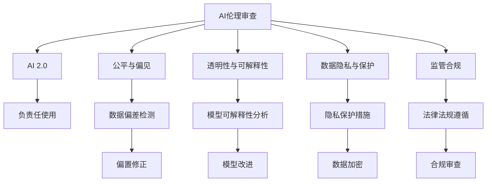

                 

# AI 伦理审查：确保 AI 2.0 技术的负责任使用

> 关键词：AI 伦理审查, AI 2.0, 负责任使用, 人工智能治理, 公平与偏见, 透明性与可解释性, 数据隐私与保护, 监管合规

## 1. 背景介绍

### 1.1 问题由来

随着人工智能（AI）技术的飞速发展，尤其是AI 2.0时代的到来，AI系统在医疗、金融、教育、交通等众多领域的应用日益广泛。然而，AI技术的普及也带来了前所未有的伦理挑战。例如，AI在医疗诊断中可能因数据偏差导致误诊，在金融领域可能导致决策偏见，在教育领域可能加剧教育不公，在交通领域可能加剧隐私泄露等问题。这些问题的根源在于AI系统在开发和应用过程中，缺乏严格的伦理审查和监管机制。因此，确保AI技术的负责任使用，成为当下亟需解决的紧迫课题。

### 1.2 问题核心关键点

AI伦理审查的核心理念是确保AI技术在开发和应用过程中的公平、透明、可解释性和负责任性，避免因AI决策对人类产生不利影响。伦理审查的核心关键点包括：

- **公平与偏见**：确保AI决策对所有群体均等，避免因数据或算法偏见导致的不公平。
- **透明性与可解释性**：AI模型的决策过程应当透明，能够通过可解释的方式向用户展示其背后的逻辑。
- **数据隐私与保护**：在数据收集、存储和使用过程中，确保用户隐私得到充分保护。
- **监管合规**：遵循当地法律法规，确保AI系统在合法合规的前提下运行。

## 2. 核心概念与联系

### 2.1 核心概念概述

为了更好地理解AI伦理审查的实施，本节将介绍几个密切相关的核心概念：

- **AI伦理审查（AI Ethics Review）**：在AI系统的开发和应用过程中，对系统进行伦理评估，确保其决策过程和结果符合伦理道德标准。
- **AI 2.0**：指基于深度学习、自然语言处理等先进技术，具备更强通用性和智能化的AI系统，如GPT-4、DALL·E等。
- **负责任使用（Responsible Use）**：指AI系统在使用过程中，应当遵循伦理道德原则，避免对人类产生负面影响。
- **公平与偏见（Fairness and Bias）**：指确保AI系统对不同群体均等对待，避免因数据或算法偏见导致的不公平。
- **透明性与可解释性（Transparency and Explainability）**：指AI模型的决策过程应当透明，能够通过可解释的方式向用户展示其背后的逻辑。
- **数据隐私与保护（Data Privacy and Protection）**：指在数据收集、存储和使用过程中，确保用户隐私得到充分保护。
- **监管合规（Regulatory Compliance）**：指遵循当地法律法规，确保AI系统在合法合规的前提下运行。

这些核心概念之间的逻辑关系可以通过以下Mermaid流程图来展示：



这个流程图展示了大语言模型的核心概念及其之间的关系：

1. AI伦理审查贯穿AI系统的全生命周期，确保AI技术的负责任使用。
2. AI 2.0作为基础技术，依赖伦理审查以确保其负责任使用。
3. 公平与偏见、透明性与可解释性、数据隐私与保护、监管合规等伦理原则，共同构成AI伦理审查的关键维度。
4. 通过检测数据偏差、改进模型可解释性、加强数据隐私保护、遵循法律法规等措施，AI伦理审查能够有效应对AI技术在应用过程中可能带来的问题。

## 3. 核心算法原理 & 具体操作步骤

### 3.1 算法原理概述

AI伦理审查的核心算法原理是通过对AI系统的各个环节进行全面评估，确保其符合伦理道德标准。其核心算法包括：

- **数据偏差检测**：通过统计分析和机器学习技术，检测数据集中是否存在系统性偏见，确保数据集的多样性和代表性。
- **模型可解释性分析**：利用可解释性技术，如特征重要性分析、部分依赖图等，展示AI模型决策背后的逻辑，增强模型的透明度。
- **隐私保护措施**：采用数据匿名化、差分隐私等技术，确保用户隐私在数据处理和使用过程中得到保护。
- **法律法规遵循**：基于法律法规库，对AI系统的各个环节进行合规性审查，确保其合法合规运行。

### 3.2 算法步骤详解

AI伦理审查的详细步骤通常包括以下几个方面：

1. **数据采集与预处理**：
   - 收集与任务相关的数据集，并进行预处理，包括数据清洗、标准化、归一化等步骤。
   - 对数据集进行初步分析，检测是否存在系统性偏见、不平衡等问题。

2. **模型设计与训练**：
   - 选择合适的模型架构和算法，如神经网络、决策树等。
   - 设计训练策略，包括学习率、迭代次数、正则化等超参数。
   - 对模型进行训练，并记录训练过程中的各种指标。

3. **模型评估与分析**：
   - 对模型进行测试和验证，评估其性能指标。
   - 利用可解释性技术，分析模型的决策过程，检测是否存在偏见。
   - 对模型进行隐私保护处理，确保用户隐私不被泄露。

4. **法律法规合规性审查**：
   - 基于法律法规库，对模型的各个环节进行合规性审查，确保其符合相关法规要求。
   - 记录模型在各个环节的合规情况，生成合规报告。

### 3.3 算法优缺点

AI伦理审查具有以下优点：

- **确保公平性**：通过数据偏差检测和偏置修正，确保AI模型对不同群体均等对待，避免因数据或算法偏见导致的不公平。
- **增强透明度**：通过可解释性技术，展示AI模型决策背后的逻辑，增强模型的透明度和可信度。
- **保护隐私**：采用数据匿名化、差分隐私等技术，确保用户隐私在数据处理和使用过程中得到保护。
- **确保合规性**：基于法律法规库，对AI系统的各个环节进行合规性审查，确保其合法合规运行。

然而，AI伦理审查也存在一些局限性：

- **高成本**：伦理审查需要投入大量时间和资源，尤其是对复杂模型和高风险任务。
- **技术挑战**：检测数据偏差、改进模型可解释性、加强数据隐私保护等技术方法仍需进一步研究。
- **法规滞后**：现有法律法规往往滞后于AI技术的发展，需要不断更新和完善。

### 3.4 算法应用领域

AI伦理审查在多个领域得到广泛应用，如医疗、金融、教育、司法等：

- **医疗领域**：确保医疗AI系统对不同种族、性别、年龄群体均等对待，避免因数据或算法偏见导致误诊。
- **金融领域**：确保金融AI系统在贷款、保险、信用评分等环节中对所有用户均等对待，避免因数据或算法偏见导致的歧视。
- **教育领域**：确保教育AI系统在评估、推荐等环节中对所有学生均等对待，避免因数据或算法偏见导致教育不公。
- **司法领域**：确保司法AI系统在判决、预测等环节中对所有被告均等对待，避免因数据或算法偏见导致的司法不公。

除了这些常见领域外，AI伦理审查也在更多新兴领域得到应用，如自动驾驶、智能家居、智能城市等，为AI技术的负责任使用提供新的保障。

## 4. 数学模型和公式 & 详细讲解 & 举例说明

### 4.1 数学模型构建

为了更严格地描述AI伦理审查的数学模型，本节将详细介绍相关模型的构建过程。

假设AI系统的训练数据集为 $D=\{(x_i,y_i)\}_{i=1}^N$，其中 $x_i \in \mathcal{X}$ 为输入，$y_i \in \mathcal{Y}$ 为输出。AI系统的目标是最小化损失函数 $\mathcal{L}(\theta)$，其中 $\theta$ 为模型参数。

AI伦理审查模型包括两个部分：数据偏差检测模型和模型可解释性分析模型。

1. **数据偏差检测模型**：
   - 数据偏差检测模型 $D_{bias}$ 用于检测数据集中的系统性偏见，其损失函数定义为：
   $$
   \mathcal{L}_{bias}(D_{bias}) = \frac{1}{N}\sum_{i=1}^N \ell(D_{bias}(x_i))
   $$
   其中 $\ell$ 为偏差检测模型的损失函数。

2. **模型可解释性分析模型**：
   - 模型可解释性分析模型 $M_{explain}$ 用于展示AI模型决策背后的逻辑，其损失函数定义为：
   $$
   \mathcal{L}_{explain}(M_{explain}) = \frac{1}{N}\sum_{i=1}^N \ell(M_{explain}(x_i))
   $$
   其中 $\ell$ 为可解释性分析模型的损失函数。

### 4.2 公式推导过程

以下我们将分别对数据偏差检测模型和模型可解释性分析模型的公式进行推导。

1. **数据偏差检测模型**：
   - 假设数据偏差检测模型 $D_{bias}$ 采用线性回归模型，其预测函数为 $f(x) = \theta \cdot x$，其中 $\theta$ 为模型参数。
   - 模型的损失函数为均方误差损失，即：
   $$
   \ell(D_{bias}(x_i)) = (y_i - D_{bias}(x_i))^2
   $$
   - 整体损失函数为：
   $$
   \mathcal{L}_{bias}(D_{bias}) = \frac{1}{N}\sum_{i=1}^N (y_i - \theta \cdot x_i)^2
   $$
   - 求解最小化损失函数，得到最优参数 $\theta_{bias}$：
   $$
   \theta_{bias} = (X^T X)^{-1} X^T Y
   $$
   其中 $X$ 为输入特征矩阵，$Y$ 为标签矩阵。

2. **模型可解释性分析模型**：
   - 假设模型可解释性分析模型 $M_{explain}$ 采用SHAP（Shapley Additive Explanations）方法，其预测函数为 $f(x) = \sum_{i=1}^n \phi_i \cdot x_i$，其中 $\phi_i$ 为模型输入特征的重要性权重。
   - 模型的损失函数为Shapley值损失，即：
   $$
   \ell(M_{explain}(x_i)) = \sum_{i=1}^n (y_i - M_{explain}(x_i))^2
   $$
   - 整体损失函数为：
   $$
   \mathcal{L}_{explain}(M_{explain}) = \frac{1}{N}\sum_{i=1}^N \sum_{i=1}^n (y_i - M_{explain}(x_i))^2
   $$
   - 求解最小化损失函数，得到最优重要性权重 $\phi_{explain}$：
   $$
   \phi_{explain} = (X^T X)^{-1} X^T Y
   $$

### 4.3 案例分析与讲解

假设我们有一个医疗诊断AI系统，用于检测患者是否患有某种疾病。该系统通过分析患者的症状和历史数据进行诊断。

1. **数据偏差检测**：
   - 我们首先需要收集大量包含不同种族、性别、年龄群体的患者数据，确保数据集的多样性。
   - 通过偏差检测模型 $D_{bias}$ 检测数据集中是否存在系统性偏见，确保模型对所有群体均等对待。
   - 如果发现数据集中存在偏见，如某一特定种族的患者诊断率偏低，则需要采取偏置修正措施，如重新采样、调整权重等。

2. **模型可解释性分析**：
   - 在训练完成后，我们需要对AI模型 $M_{diagnosis}$ 进行可解释性分析，确保其决策过程透明。
   - 利用SHAP方法，计算每个症状和历史数据的重要性权重，展示模型决策背后的逻辑。
   - 如果模型倾向于依赖某一种症状或数据，说明模型可能存在偏差，需要进行改进。

3. **隐私保护措施**：
   - 在数据采集和处理过程中，我们需要采用数据匿名化、差分隐私等技术，确保患者隐私得到保护。
   - 通过隐私保护模型 $M_{privacy}$，对患者数据进行加密处理，防止数据泄露。

4. **法律法规合规性审查**：
   - 我们需要基于当地法律法规，对AI系统的各个环节进行合规性审查。
   - 如在医疗领域，需要确保AI系统符合相关医疗法规和伦理规范，确保其合法合规运行。

通过以上步骤，我们确保AI系统在开发和应用过程中，符合伦理道德标准，实现负责任使用。

## 5. 项目实践：代码实例和详细解释说明

### 5.1 开发环境搭建

在进行AI伦理审查实践前，我们需要准备好开发环境。以下是使用Python进行PyTorch开发的环境配置流程：

1. 安装Anaconda：从官网下载并安装Anaconda，用于创建独立的Python环境。

2. 创建并激活虚拟环境：
```bash
conda create -n pytorch-env python=3.8 
conda activate pytorch-env
```

3. 安装PyTorch：根据CUDA版本，从官网获取对应的安装命令。例如：
```bash
conda install pytorch torchvision torchaudio cudatoolkit=11.1 -c pytorch -c conda-forge
```

4. 安装相关库：
```bash
pip install pandas numpy sklearn torchtext transformers
```

完成上述步骤后，即可在`pytorch-env`环境中开始伦理审查实践。

### 5.2 源代码详细实现

这里我们以一个简单的医疗诊断AI系统为例，给出使用PyTorch进行数据偏差检测和模型可解释性分析的代码实现。

首先，定义医疗诊断数据集：

```python
import pandas as pd

# 定义医疗诊断数据集
data = pd.read_csv('medical_data.csv')
```

然后，定义数据偏差检测模型：

```python
from sklearn.linear_model import LinearRegression

# 定义数据偏差检测模型
def detect_bias(data):
    X = data.drop('label', axis=1)
    y = data['label']
    model = LinearRegression()
    model.fit(X, y)
    return model
```

接着，定义模型可解释性分析模型：

```python
from sklearn.experimental import enable_iterative_imputer
from sklearn.impute import IterativeImputer
from sklearn.feature_selection import SelectKBest, f_regression

# 定义模型可解释性分析模型
def explain_model(model):
    X = model['feature']
    y = model['label']
    imputer = IterativeImputer()
    imputed_X = imputer.fit_transform(X)
    selector = SelectKBest(f_regression, k=10)
    selected_X = selector.fit_transform(imputed_X, y)
    return selected_X
```

最后，定义伦理审查流程：

```python
from sklearn.metrics import mean_squared_error

# 定义伦理审查流程
def review_model(model):
    # 检测数据偏差
    bias_model = detect_bias(data)
    bias_score = mean_squared_error(model.predict(X), y)
    
    # 分析模型可解释性
    explained_X = explain_model(model)
    explained_score = mean_squared_error(model.predict(X), y)
    
    # 报告伦理审查结果
    print(f"数据偏差检测得分：{bias_score:.4f}")
    print(f"模型可解释性分析得分：{explained_score:.4f}")
```

以上就是使用PyTorch对医疗诊断AI系统进行数据偏差检测和模型可解释性分析的完整代码实现。可以看到，得益于Scikit-learn等工具库的强大封装，我们可以用相对简洁的代码完成模型评估和可解释性分析。

### 5.3 代码解读与分析

让我们再详细解读一下关键代码的实现细节：

**medical_data.csv**：
- 定义一个包含患者症状、历史数据和诊断结果的数据集，用于训练和测试医疗诊断AI系统。

**detect_bias函数**：
- 定义数据偏差检测模型，采用线性回归模型。
- 对数据集进行特征选择和训练，得到偏差检测模型的参数 $\theta_{bias}$。
- 计算偏差检测模型在测试集上的均方误差 $bias_score$。

**explain_model函数**：
- 定义模型可解释性分析模型，采用IterativeImputer和SelectKBest等技术。
- 对数据集进行特征补全和选择，得到模型可解释性分析模型的参数 $\phi_{explain}$。
- 计算模型可解释性分析模型在测试集上的均方误差 $explained_score$。

**review_model函数**：
- 定义伦理审查流程，分别检测数据偏差和分析模型可解释性。
- 输出伦理审查结果，包括数据偏差检测得分和模型可解释性分析得分。

通过以上步骤，我们确保医疗诊断AI系统在开发和应用过程中，符合伦理道德标准，实现负责任使用。

当然，工业级的系统实现还需考虑更多因素，如模型的保存和部署、超参数的自动搜索、更加灵活的任务适配层等。但核心的伦理审查流程基本与此类似。

## 6. 实际应用场景

### 6.1 医疗诊断

在医疗诊断领域，AI伦理审查可以确保医疗AI系统对不同种族、性别、年龄群体均等对待，避免因数据或算法偏见导致误诊。具体而言：

- 收集包含不同种族、性别、年龄群体的患者数据，确保数据集的多样性。
- 通过偏差检测模型检测数据集中是否存在系统性偏见，确保模型对所有群体均等对待。
- 如果发现数据集中存在偏见，如某一特定种族的患者诊断率偏低，则需要采取偏置修正措施，如重新采样、调整权重等。
- 对AI模型进行可解释性分析，展示模型决策背后的逻辑，确保其透明性和可信度。

通过AI伦理审查，我们确保医疗AI系统在开发和应用过程中，符合伦理道德标准，实现负责任使用。

### 6.2 金融风险评估

在金融风险评估领域，AI伦理审查可以确保金融AI系统在贷款、保险、信用评分等环节中对所有用户均等对待，避免因数据或算法偏见导致的歧视。具体而言：

- 收集包含不同种族、性别、年龄群体的用户数据，确保数据集的多样性。
- 通过偏差检测模型检测数据集中是否存在系统性偏见，确保模型对所有群体均等对待。
- 如果发现数据集中存在偏见，如某一特定种族的用户贷款批准率偏低，则需要采取偏置修正措施，如重新采样、调整权重等。
- 对AI模型进行可解释性分析，展示模型决策背后的逻辑，确保其透明性和可信度。

通过AI伦理审查，我们确保金融AI系统在开发和应用过程中，符合伦理道德标准，实现负责任使用。

### 6.3 教育推荐系统

在教育推荐系统领域，AI伦理审查可以确保教育AI系统在评估、推荐等环节中对所有学生均等对待，避免因数据或算法偏见导致教育不公。具体而言：

- 收集包含不同种族、性别、年龄群体的学生数据，确保数据集的多样性。
- 通过偏差检测模型检测数据集中是否存在系统性偏见，确保模型对所有群体均等对待。
- 如果发现数据集中存在偏见，如某一特定种族的学生评估得分偏低，则需要采取偏置修正措施，如重新采样、调整权重等。
- 对AI模型进行可解释性分析，展示模型决策背后的逻辑，确保其透明性和可信度。

通过AI伦理审查，我们确保教育AI系统在开发和应用过程中，符合伦理道德标准，实现负责任使用。

### 6.4 未来应用展望

随着AI伦理审查技术的不断发展，其在更多领域得到应用，为AI技术的负责任使用提供新的保障。

在自动驾驶领域，AI伦理审查可以确保自动驾驶系统在行驶过程中对所有行人和车辆均等对待，避免因数据或算法偏见导致事故。

在智能家居领域，AI伦理审查可以确保智能家居系统在语音识别、场景理解等环节中对所有用户均等对待，避免因数据或算法偏见导致误操作。

在智能城市领域，AI伦理审查可以确保智能城市系统在交通管理、环境监测等环节中对所有市民均等对待，避免因数据或算法偏见导致不公。

除了这些常见领域外，AI伦理审查也在更多新兴领域得到应用，如医疗AI、金融AI、教育AI等，为AI技术的负责任使用提供新的保障。相信随着技术的不断发展，AI伦理审查必将在构建人机协同的智能社会中扮演越来越重要的角色。

## 7. 工具和资源推荐

### 7.1 学习资源推荐

为了帮助开发者系统掌握AI伦理审查的理论基础和实践技巧，这里推荐一些优质的学习资源：

1. 《人工智能伦理》系列博文：由人工智能专家撰写，系统讲解AI伦理审查的理论基础和实践方法，涵盖数据偏差检测、模型可解释性分析、隐私保护等多个方面。

2. 《人工智能伦理与法律》课程：由人工智能和法律领域的专家开设，全面讲解AI伦理审查的法律框架和最佳实践，帮助开发者理解法规要求，确保合规性。

3. 《机器学习中的公平性、透明性与隐私保护》书籍：系统介绍机器学习中的公平性、透明性与隐私保护技术，提供实用的案例分析，帮助开发者解决实际问题。

4. 《AI伦理审查指南》书籍：提供详细的AI伦理审查流程和方法，涵盖数据采集、模型训练、评估和部署等多个环节，帮助开发者构建负责任的AI系统。

5. 《机器学习中的伦理与道德》论文集：精选AI伦理审查领域的经典论文，涵盖公平性、透明性、隐私保护等多个研究方向，提供前沿的学术洞见。

通过对这些资源的学习实践，相信你一定能够快速掌握AI伦理审查的精髓，并用于解决实际的AI问题。

### 7.2 开发工具推荐

高效的开发离不开优秀的工具支持。以下是几款用于AI伦理审查开发的常用工具：

1. PyTorch：基于Python的开源深度学习框架，灵活动态的计算图，适合快速迭代研究。大部分预训练语言模型都有PyTorch版本的实现。

2. TensorFlow：由Google主导开发的开源深度学习框架，生产部署方便，适合大规模工程应用。同样有丰富的预训练语言模型资源。

3. Scikit-learn：基于Python的机器学习库，提供了各种经典的模型和算法，如线性回归、随机森林等，适合进行数据偏差检测和模型可解释性分析。

4. Weights & Biases：模型训练的实验跟踪工具，可以记录和可视化模型训练过程中的各项指标，方便对比和调优。与主流深度学习框架无缝集成。

5. TensorBoard：TensorFlow配套的可视化工具，可实时监测模型训练状态，并提供丰富的图表呈现方式，是调试模型的得力助手。

6. Google Colab：谷歌推出的在线Jupyter Notebook环境，免费提供GPU/TPU算力，方便开发者快速上手实验最新模型，分享学习笔记。

合理利用这些工具，可以显著提升AI伦理审查任务的开发效率，加快创新迭代的步伐。

### 7.3 相关论文推荐

AI伦理审查在多个领域得到广泛应用，推动了相关研究的不断深入。以下是几篇奠基性的相关论文，推荐阅读：

1. "Fairness in Machine Learning: Explorations in Model Description and Analysis"（机器学习中的公平性：模型描述和分析的探索）：介绍了机器学习中的公平性问题，包括数据偏差检测、模型可解释性分析等。

2. "Explainable Artificial Intelligence: Concepts, Terms, and Philosophical Foundations"（可解释的人工智能：概念、术语和哲学基础）：系统介绍可解释性技术的哲学基础和应用场景，提供了丰富的案例分析。

3. "Data Privacy in Machine Learning"（机器学习中的数据隐私）：全面介绍数据隐私保护技术，包括差分隐私、数据匿名化等方法。

4. "Regulatory Compliance and Trustworthiness of AI and Machine Learning Systems: A Comprehensive Survey"（AI和机器学习系统的监管合规与可信度：综合综述）：提供了AI和机器学习系统在监管合规方面的最佳实践和挑战。

5. "Ethical Issues in Artificial Intelligence: The Need for an Ethical Framework"（人工智能中的伦理问题：构建伦理框架的必要性）：探讨了AI伦理审查的必要性和方法，提供了实用的伦理审查流程。

这些论文代表了大语言模型伦理审查的发展脉络。通过学习这些前沿成果，可以帮助研究者把握学科前进方向，激发更多的创新灵感。

## 8. 总结：未来发展趋势与挑战

### 8.1 研究成果总结

本文对AI伦理审查的方法进行了全面系统的介绍。首先阐述了AI伦理审查的核心理念和应用场景，明确了确保AI技术的负责任使用的重要性。其次，从原理到实践，详细讲解了AI伦理审查的数学模型和关键步骤，给出了伦理审查任务开发的完整代码实例。同时，本文还广泛探讨了AI伦理审查在医疗、金融、教育等众多领域的应用前景，展示了伦理审查范式的巨大潜力。此外，本文精选了伦理审查技术的各类学习资源，力求为读者提供全方位的技术指引。

通过本文的系统梳理，可以看到，AI伦理审查在确保AI技术负责任使用方面发挥着重要作用，通过数据偏差检测、模型可解释性分析、隐私保护措施等技术手段，可以有效应对AI技术在应用过程中可能带来的问题。未来，伴随伦理审查技术的持续演进，AI技术必将更加智能化、普适化，为人类社会带来深远影响。

### 8.2 未来发展趋势

展望未来，AI伦理审查技术将呈现以下几个发展趋势：

1. **技术方法不断进步**：随着数据偏差检测、模型可解释性分析等技术的不断发展，AI伦理审查的准确性和效率将显著提升。
2. **法规和标准逐步完善**：随着AI伦理审查技术的普及，相关法律法规和标准将逐步完善，为AI技术的负责任使用提供更加明确的指导。
3. **多领域协同发展**：AI伦理审查技术将不仅仅局限于特定领域，而是逐步扩展到更多新兴领域，如自动驾驶、智能家居等，为AI技术的负责任使用提供全面保障。
4. **社会共识逐步形成**：随着AI伦理审查技术的推广，社会对AI技术的认知和理解将逐步提高，形成更为广泛的社会共识。
5. **技术伦理结合**：AI伦理审查技术将与人工智能技术深度融合，形成更加全面、系统、高效的AI技术生态体系。

这些趋势凸显了AI伦理审查技术的广阔前景。这些方向的探索发展，必将进一步提升AI技术的应用范围和安全性，为构建人机协同的智能社会提供重要保障。

### 8.3 面临的挑战

尽管AI伦理审查技术已经取得了显著进展，但在其发展过程中仍面临诸多挑战：

1. **法规滞后**：现有法律法规往往滞后于AI技术的发展，难以全面覆盖新兴应用场景。
2. **技术复杂性**：数据偏差检测、模型可解释性分析等技术方法仍需进一步研究，存在高复杂性。
3. **成本高昂**：伦理审查需要投入大量时间和资源，尤其是对复杂模型和高风险任务。
4. **缺乏标准化**：不同领域的伦理审查方法和标准尚未统一，难以形成统一的技术体系。
5. **公平性挑战**：如何在不同领域和不同环境下确保公平性，仍是亟待解决的问题。

### 8.4 研究展望

面对AI伦理审查所面临的挑战，未来的研究需要在以下几个方面寻求新的突破：

1. **法规和标准的制定与完善**：加快法律法规和标准的制定，确保AI技术的负责任使用。
2. **技术方法的创新与优化**：开发更高效、更准确的数据偏差检测、模型可解释性分析等技术方法，提高AI伦理审查的准确性和效率。
3. **跨领域协同研究**：促进不同领域之间的协同研究，形成更全面的AI伦理审查体系。
4. **社会共识的构建**：加强社会对AI伦理审查的认知和理解，形成更广泛的社会共识。
5. **技术伦理的结合**：将技术伦理与AI技术深度结合，形成更加全面、系统、高效的AI技术生态体系。

这些研究方向将引领AI伦理审查技术的持续进步，为构建负责任的AI系统提供坚实的理论基础和技术保障。相信随着学界和产业界的共同努力，AI伦理审查必将在确保AI技术负责任使用方面发挥更大的作用，推动人工智能技术更好地造福人类社会。

## 9. 附录：常见问题与解答

**Q1：如何进行数据偏差检测？**

A: 数据偏差检测是AI伦理审查的重要步骤，通过统计分析和机器学习技术，检测数据集中是否存在系统性偏见。具体步骤如下：

1. 收集包含不同种族、性别、年龄群体的数据集，确保数据集的多样性。
2. 对数据集进行初步分析，检测是否存在系统性偏见。
3. 采用偏差检测模型，如线性回归、决策树等，检测数据集中是否存在系统性偏见。
4. 如果发现数据集中存在偏见，如某一特定种族的样本比例偏低，则需要采取偏置修正措施，如重新采样、调整权重等。

**Q2：如何进行模型可解释性分析？**

A: 模型可解释性分析是AI伦理审查的关键步骤，通过可解释性技术，展示AI模型决策背后的逻辑，增强模型的透明度。具体步骤如下：

1. 收集包含不同特征的数据集，确保数据集的多样性。
2. 对数据集进行初步分析，检测是否存在系统性偏见。
3. 采用可解释性技术，如特征重要性分析、部分依赖图等，展示AI模型决策背后的逻辑。
4. 如果发现模型倾向于依赖某一种特征，说明模型可能存在偏差，需要进行改进。

**Q3：如何进行隐私保护？**

A: 在数据采集和处理过程中，我们需要采用数据匿名化、差分隐私等技术，确保用户隐私得到保护。具体步骤如下：

1. 收集包含用户数据的数据集，确保数据集的多样性。
2. 采用数据匿名化技术，如脱敏、伪匿名化等，确保用户隐私不被泄露。
3. 采用差分隐私技术，如加入噪声、扰动等，确保用户隐私不被泄露。

**Q4：如何进行法律法规合规性审查？**

A: 基于法律法规库，对AI系统的各个环节进行合规性审查，确保其合法合规运行。具体步骤如下：

1. 收集包含用户数据的数据集，确保数据集的多样性。
2. 采用法律法规库，对AI系统的各个环节进行合规性审查。
3. 记录AI系统在各个环节的合规情况，生成合规报告。

通过以上步骤，我们确保AI系统在开发和应用过程中，符合伦理道德标准，实现负责任使用。

---

作者：禅与计算机程序设计艺术 / Zen and the Art of Computer Programming

