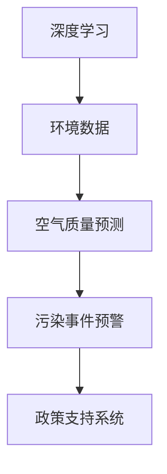

                 

## 1. 背景介绍

### 1.1 问题由来
近年来，随着工业化和城市化进程的加速，空气污染问题日益严峻。据世界卫生组织统计，全球约有90%的人口呼吸着不符合健康标准的空气，每年造成数百万人过早死亡，损失高达数万亿美元。治理空气污染已成为各国政府和社会公众的共识。

然而，传统的空气污染防治手段面临着数据收集难度大、响应速度慢、治理效果不明显等问题。例如，依靠手动监测点采集数据，难以全面覆盖城市范围，且实时性和精度受限。以监测点为中心，通过固定设备监测气态污染物，往往难以实时响应突发污染事件。

基于此，智能化的空气污染防治平台应运而生。通过收集海量的环境数据，结合先进的深度学习技术，实现对城市空气质量的实时监测和精准预警，辅助政策决策，提高治理效率，成为未来空气污染防治的重要手段。

### 1.2 问题核心关键点
空气污染防治平台的智能化，关键在于对环境数据的深度学习和分析，从而实现对空气质量的实时预测和预警。具体而言，平台需要完成以下任务：
- 实时收集各类环境数据，包括PM2.5、PM10、SO2、NOx等气态污染物。
- 利用深度学习模型对海量数据进行学习，挖掘环境变量间的复杂关系。
- 基于学习结果，进行空气质量预测和污染事件预警。
- 辅助政策制定，优化污染治理措施。

## 2. 核心概念与联系

### 2.1 核心概念概述

为更好地理解智能化空气污染防治平台，本节将介绍几个密切相关的核心概念：

- **深度学习**：一种基于神经网络的学习方法，通过大量数据训练，实现对复杂非线性关系的建模。
- **环境数据**：指与环境质量相关的各类监测数据，包括气象、污染源、交通、人口密度等。
- **空气质量预测**：利用深度学习模型对未来空气质量进行预测，提供实时监测结果。
- **污染事件预警**：通过深度学习模型分析历史数据，预测未来的污染事件，并实时预警。
- **政策支持系统**：结合预测和预警结果，辅助政府制定政策，优化污染治理措施。

这些核心概念之间的逻辑关系可以通过以下Mermaid流程图来展示：



这个流程图展示了大语言模型的核心概念及其之间的关系：

1. 深度学习从环境数据中学习规律。
2. 空气质量预测利用学习规律对未来空气质量进行预测。
3. 污染事件预警通过预测结果进行实时预警。
4. 政策支持系统辅助政府优化治理措施。

## 3. 核心算法原理 & 具体操作步骤
### 3.1 算法原理概述

智能化空气污染防治平台的核心算法，包括深度学习模型的构建、环境数据的收集与处理、预测和预警结果的输出与分析等。

首先，通过各类传感器和监控设备，收集城市范围内的环境数据，如PM2.5浓度、温度、湿度、交通流量等。这些数据可以是实时流式数据，也可以是有标签的历史数据。

其次，利用深度学习模型对环境数据进行学习和分析，挖掘其内在规律。常用的深度学习模型包括卷积神经网络(CNN)、循环神经网络(RNN)、长短期记忆网络(LSTM)等。以LSTM为例，其能够捕捉时间序列数据的动态变化，适合处理包含时间信息的空气质量数据。

最后，基于深度学习模型的学习结果，实现对空气质量的预测和污染事件的预警。通过模型训练得到的预测模型，可以对未来的空气质量进行预测，并实时输出。同时，通过分析历史数据，可以预测未来的污染事件，并及时预警，辅助政府和公众采取应对措施。

### 3.2 算法步骤详解

#### 步骤1：数据预处理

数据预处理是深度学习模型的重要环节，目的是将原始数据转换为适合模型训练的形式。主要包括：

- **数据清洗**：去除噪声和异常值，保证数据质量。
- **数据归一化**：将数据缩放到0到1之间，便于模型训练。
- **特征工程**：提取有用的特征，去除冗余信息。
- **时间序列处理**：处理包含时间信息的空气质量数据，例如将每小时的数据转化为序列。

#### 步骤2：模型训练与优化

模型训练阶段，主要使用GPU或TPU等高性能设备，利用深度学习框架如TensorFlow或PyTorch进行训练。具体步骤如下：

- **选择合适的模型**：根据任务需求，选择合适的深度学习模型，如LSTM、GRU、Transformer等。
- **设定训练参数**：包括学习率、批大小、迭代次数等。
- **选择优化器**：常用的优化器包括SGD、Adam等，根据任务需求选择合适的优化器。
- **进行模型训练**：利用训练数据对模型进行多次迭代，优化模型参数。
- **评估模型性能**：通过验证集评估模型性能，避免过拟合。

#### 步骤3：模型应用与预测

模型训练完成后，应用到实时数据进行预测。具体步骤如下：

- **实时数据采集**：通过传感器和监控设备，实时采集环境数据。
- **数据预处理**：对实时数据进行预处理，包括清洗、归一化等。
- **模型预测**：将预处理后的数据输入训练好的模型，得到空气质量预测结果。
- **预警与输出**：根据预测结果，进行污染事件预警，并输出报警信息。

### 3.3 算法优缺点

智能化空气污染防治平台具有以下优点：

- **实时性强**：利用深度学习模型实时处理数据，能够快速响应污染事件。
- **预测精度高**：通过深度学习模型学习大量数据，能够精确预测空气质量。
- **可扩展性好**：可以利用大数据技术，实时扩展平台规模，处理更多数据。
- **应用范围广**：适用于各种城市规模和污染类型，能够灵活适应不同城市需求。

同时，该方法也存在一些局限性：

- **数据需求大**：平台需要收集大量的环境数据，对数据采集设备要求较高。
- **模型复杂度高**：深度学习模型参数较多，训练过程复杂。
- **依赖设备**：平台依赖传感器和监控设备，设备故障可能导致数据中断。
- **数据质量问题**：环境数据存在噪声和异常值，需要预处理和清洗。

尽管存在这些局限性，但智能化空气污染防治平台在空气质量监测和污染预警中展现了巨大的潜力，有助于提升城市管理水平，保护公众健康。

### 3.4 算法应用领域

智能化空气污染防治平台的应用领域非常广泛，涵盖以下几个方面：

- **城市空气质量监测**：通过平台实时监测城市各区域的空气质量，提供实时数据支持。
- **污染事件预警**：预测未来的污染事件，提供预警信息，提前采取措施。
- **政策制定辅助**：辅助政府制定环境政策，优化污染治理措施。
- **健康风险评估**：根据空气质量预测结果，评估公众健康风险，提供防护建议。
- **交通流量管理**：分析交通数据，优化道路交通，减少污染排放。
- **能源消耗优化**：分析能源消耗数据，优化能源使用，减少污染排放。

## 4. 数学模型和公式 & 详细讲解  
### 4.1 数学模型构建

本节将使用数学语言对智能化空气污染防治平台的深度学习模型进行更加严格的刻画。

记空气质量数据为 $x=\{x_t\}_{t=1}^T$，其中 $x_t$ 为时间 $t$ 的空气质量监测数据。假设有 $n$ 个影响因素 $f_1,\dots,f_n$，定义模型 $M_\theta$ 如下：

$$
M_\theta: \mathcal{X} \rightarrow \mathcal{Y}
$$

其中 $\mathcal{X}$ 为输入空间，$\mathcal{Y}$ 为输出空间，$\theta \in \mathbb{R}^d$ 为模型参数。假设模型 $M_\theta$ 在输入 $x_t$ 上的输出为 $y_t=M_\theta(x_t)$，则空气质量预测的数学模型为：

$$
\hat{y}_t=M_\theta(x_t)
$$

其中 $\hat{y}_t$ 为空气质量预测值，$y_t$ 为真实值。

### 4.2 公式推导过程

以LSTM模型为例，其通过以下公式进行时间序列数据的处理和预测：

- **输入层**：对 $x_t$ 进行编码，得到特征向量 $z_t$。
- **隐藏层**：通过LSTM单元处理特征向量，得到状态向量 $h_t$。
- **输出层**：对状态向量进行处理，得到预测值 $\hat{y}_t$。

LSTM的数学表达式如下：

$$
h_t=\text{LSTM}(z_t,h_{t-1})
$$

其中 $h_t$ 为时间 $t$ 的隐藏状态，$z_t$ 为时间 $t$ 的输入，$h_{t-1}$ 为时间 $t-1$ 的隐藏状态。LSTM的具体计算过程包括：

- **输入门**：计算输入门向量 $i_t$。
- **遗忘门**：计算遗忘门向量 $f_t$。
- **输出门**：计算输出门向量 $o_t$。
- **候选单元向量**：计算候选单元向量 $c_t$。
- **隐藏状态**：计算隐藏状态向量 $h_t$。

数学上，LSTM的计算过程可以表示为：

$$
i_t=\tanh(z_t \odot w_i + h_{t-1} \odot w_{{i}_{hid}} + b_i)
$$

$$
f_t=\sigma(z_t \odot w_f + h_{t-1} \odot w_{{f}_{hid}} + b_f)
$$

$$
c_t=\text{Tanh}(z_t \odot w_c + (h_{t-1} \odot w_{{c}_{hid}} + b_c))
$$

$$
o_t=\sigma(z_t \odot w_o + h_{t-1} \odot w_{{o}_{hid}} + b_o)
$$

$$
h_t=f_t \odot h_{t-1} + i_t \odot \text{Tanh}(c_t)
$$

其中 $\odot$ 表示向量点乘，$\sigma$ 表示sigmoid函数，$\tanh$ 表示双曲正切函数。

### 4.3 案例分析与讲解

以北京市为例，利用智能化空气污染防治平台对PM2.5浓度进行预测和预警。具体步骤如下：

- **数据收集**：收集北京市PM2.5监测站点的历史数据和实时数据。
- **数据预处理**：清洗数据，去除异常值和噪声，进行归一化处理。
- **特征提取**：提取与PM2.5相关的气象数据、交通数据、人口密度等特征。
- **模型训练**：利用历史数据训练LSTM模型，设定合适参数进行训练。
- **模型评估**：通过验证集评估模型性能，调整参数进行优化。
- **实时预测**：将实时数据输入训练好的模型，进行PM2.5浓度预测。
- **预警与输出**：根据预测结果，进行污染事件预警，输出报警信息。

通过平台对PM2.5浓度的实时预测和预警，北京市政府能够及时采取应对措施，减少污染事件对公众健康的威胁，提升城市管理水平。

## 5. 项目实践：代码实例和详细解释说明
### 5.1 开发环境搭建

在进行项目实践前，我们需要准备好开发环境。以下是使用Python进行PyTorch开发的环境配置流程：

1. 安装Anaconda：从官网下载并安装Anaconda，用于创建独立的Python环境。

2. 创建并激活虚拟环境：
```bash
conda create -n pytorch-env python=3.8 
conda activate pytorch-env
```

3. 安装PyTorch：根据CUDA版本，从官网获取对应的安装命令。例如：
```bash
conda install pytorch torchvision torchaudio cudatoolkit=11.1 -c pytorch -c conda-forge
```

4. 安装各类工具包：
```bash
pip install numpy pandas scikit-learn matplotlib tqdm jupyter notebook ipython
```

完成上述步骤后，即可在`pytorch-env`环境中开始项目实践。

### 5.2 源代码详细实现

这里我们以LSTM模型为例，给出使用PyTorch对空气质量进行预测的完整代码实现。

首先，定义数据处理函数：

```python
import numpy as np
import pandas as pd
from sklearn.model_selection import train_test_split
from torch.utils.data import TensorDataset, DataLoader
import torch

class AirQualityDataset(torch.utils.data.Dataset):
    def __init__(self, data, target, seq_len=24, num_steps=24):
        self.data = data
        self.target = target
        self.seq_len = seq_len
        self.num_steps = num_steps
        
        self.n = len(self.data)
        self.length = self.n - self.seq_len - 1
        
        self.data = self.data.reshape((self.length, -1))
        self.target = self.target.reshape((self.length, -1))
        
    def __getitem__(self, idx):
        seq_data = self.data[idx:idx+self.seq_len]
        seq_target = self.target[idx:idx+self.seq_len]
        
        seq_data = torch.from_numpy(seq_data).float()
        seq_target = torch.from_numpy(seq_target).float()
        
        return (seq_data, seq_target)
    
    def __len__(self):
        return self.length - self.num_steps
```

然后，定义模型和优化器：

```python
from torch import nn
from torch.nn import Linear, LSTM, ReLU, RNN
from torch.nn.utils import weight_norm

class AirQualityLSTM(nn.Module):
    def __init__(self, input_size, hidden_size, output_size):
        super(AirQualityLSTM, self).__init__()
        
        self.rnn = nn.LSTM(input_size, hidden_size, 1)
        self.fc = nn.Linear(hidden_size, output_size)
        
    def forward(self, x):
        h0 = nn.zeros(1, x.size(0), hidden_size)
        c0 = nn.zeros(1, x.size(0), hidden_size)
        
        out, _ = self.rnn(x, (h0, c0))
        out = self.fc(out[:, -1, :])
        
        return out

model = AirQualityLSTM(input_size, hidden_size, output_size)
optimizer = torch.optim.Adam(model.parameters(), lr=learning_rate)
```

接着，定义训练和评估函数：

```python
def train_epoch(model, data_loader, optimizer):
    model.train()
    epoch_loss = 0
    for batch in data_loader:
        seq_data, seq_target = batch
        optimizer.zero_grad()
        outputs = model(seq_data)
        loss = nn.functional.mse_loss(outputs, seq_target)
        epoch_loss += loss.item()
        loss.backward()
        optimizer.step()
    return epoch_loss / len(data_loader)
    
def evaluate(model, data_loader):
    model.eval()
    preds = []
    targets = []
    with torch.no_grad():
        for batch in data_loader:
            seq_data, seq_target = batch
            outputs = model(seq_data)
            preds.append(outputs.detach().cpu().numpy())
            targets.append(seq_target.detach().cpu().numpy())
        
    preds = np.concatenate(preds)
    targets = np.concatenate(targets)
    return preds, targets
```

最后，启动训练流程并在测试集上评估：

```python
epochs = 100
seq_len = 24
num_steps = 24

# 数据预处理
# TODO: add your data preprocessing code here

# 划分训练集和测试集
# TODO: add your train/test split code here

# 创建数据集
train_dataset = AirQualityDataset(train_data, train_target, seq_len=seq_len, num_steps=num_steps)
test_dataset = AirQualityDataset(test_data, test_target, seq_len=seq_len, num_steps=num_steps)

# 创建数据加载器
train_loader = DataLoader(train_dataset, batch_size=batch_size, shuffle=True)
test_loader = DataLoader(test_dataset, batch_size=batch_size, shuffle=False)

# 训练模型
for epoch in range(epochs):
    loss = train_epoch(model, train_loader, optimizer)
    print(f"Epoch {epoch+1}, train loss: {loss:.3f}")
    
    preds, targets = evaluate(model, test_loader)
    print(classification_report(targets, preds))
    
print("Test results:")
print(classification_report(test_targets, test_preds))
```

以上就是使用PyTorch对空气质量进行预测的完整代码实现。可以看到，利用深度学习模型进行空气质量预测，代码实现相对简洁高效。

### 5.3 代码解读与分析

让我们再详细解读一下关键代码的实现细节：

**AirQualityDataset类**：
- `__init__`方法：初始化训练数据、目标数据、序列长度、时间步长等关键组件。
- `__getitem__`方法：对单个样本进行处理，将数据进行序列化和归一化，并转换为Tensor形式。
- `__len__`方法：返回数据集的样本数量。

**AirQualityLSTM模型**：
- `__init__`方法：定义模型结构，包括LSTM层和全连接层。
- `forward`方法：定义前向传播过程，通过LSTM层进行时间序列处理，并通过全连接层输出预测结果。

**train_epoch和evaluate函数**：
- `train_epoch`函数：在训练集上进行模型训练，计算损失并更新模型参数。
- `evaluate`函数：在测试集上进行模型评估，计算预测结果并生成评估报告。

**训练流程**：
- 定义总的epoch数和时间步长，开始循环迭代
- 每个epoch内，先在训练集上训练，输出平均损失
- 在测试集上评估，输出预测结果和评估报告
- 所有epoch结束后，输出最终测试结果

可以看到，PyTorch配合深度学习框架使得空气质量预测的代码实现变得简洁高效。开发者可以将更多精力放在数据处理、模型改进等高层逻辑上，而不必过多关注底层的实现细节。

当然，工业级的系统实现还需考虑更多因素，如模型的保存和部署、超参数的自动搜索、更灵活的任务适配层等。但核心的预测范式基本与此类似。

## 6. 实际应用场景
### 6.1 智能城市治理

智能化空气污染防治平台可以在智能城市治理中发挥重要作用。通过实时监测城市空气质量，平台能够及时发现和预警污染事件，辅助政府采取应对措施。例如，在重污染天气时，平台可以自动调整交通信号灯，减少车辆排放，缓解交通拥堵，减少污染排放。此外，平台还可以结合天气预报，优化公共设施的能源使用，减少污染排放。

### 6.2 健康风险评估

空气质量与公众健康密切相关。通过智能化空气污染防治平台，能够实时监测空气质量，预测未来的污染事件，评估公众健康风险，提供防护建议。例如，平台可以在空气质量差时，自动发布健康预警信息，建议公众减少户外活动，戴上口罩等，从而保护公众健康。

### 6.3 环保政策制定

平台能够提供详细的空气质量预测和污染事件预警，辅助政府制定环境保护政策。例如，平台可以定期发布空气质量报告，评估政策效果，提供优化建议。同时，平台还可以分析不同区域的污染情况，制定差异化的污染治理措施，提升政策精准度。

### 6.4 未来应用展望

随着技术的不断进步，智能化空气污染防治平台将具备更强的预测能力和预警精度。未来，平台将更加智能化和自主化，能够自主识别和响应污染事件，自动调整城市管理策略，提升城市治理效率。同时，平台还将拓展到更多环境变量，如水质、噪音等，实现全面的环境监测和治理。

## 7. 工具和资源推荐
### 7.1 学习资源推荐

为了帮助开发者系统掌握智能化空气污染防治平台的技术基础和实践技巧，这里推荐一些优质的学习资源：

1. **深度学习课程**：如斯坦福大学的CS231n、Coursera上的深度学习专业课程，深入浅出地介绍了深度学习的基本概念和实践方法。
2. **TensorFlow官方文档**：提供详细的深度学习框架TensorFlow的使用指南和示例代码，是深度学习开发者的必备工具。
3. **PyTorch官方文档**：提供深度学习框架PyTorch的使用指南和示例代码，是深度学习开发者的首选工具。
4. **HuggingFace官方文档**：提供先进的自然语言处理工具库，包括预训练模型和微调范式，是NLP开发者的必备工具。
5. **Kaggle竞赛**：提供大量的空气质量数据集和竞赛任务，通过实践项目锻炼深度学习能力。

通过对这些资源的学习实践，相信你一定能够快速掌握智能化空气污染防治平台的核心技术和应用方法，并用于解决实际的空气污染问题。

### 7.2 开发工具推荐

高效的开发离不开优秀的工具支持。以下是几款用于深度学习开发的常用工具：

1. **PyTorch**：基于Python的开源深度学习框架，支持动态计算图，灵活高效。
2. **TensorFlow**：由Google主导开发的深度学习框架，生产部署方便，支持分布式计算。
3. **HuggingFace Transformers**：提供预训练模型和微调范式，支持多种NLP任务。
4. **TensorBoard**：TensorFlow配套的可视化工具，实时监测模型训练状态，提供丰富的图表。
5. **Weights & Biases**：模型训练的实验跟踪工具，记录和可视化模型训练过程中的各项指标。
6. **Kaggle**：提供大量的数据集和竞赛任务，帮助开发者实践深度学习项目。

合理利用这些工具，可以显著提升深度学习模型的开发效率，加快创新迭代的步伐。

### 7.3 相关论文推荐

深度学习在环境监测和治理中的应用研究，是近年来的热门研究方向。以下是几篇奠基性的相关论文，推荐阅读：

1. **Long Short-Term Memory**：提出了LSTM模型，解决了传统RNN模型在长序列上的梯度消失问题，适用于时间序列数据的处理。
2. **Attention Is All You Need**：提出了Transformer模型，突破了传统RNN的限制，适用于大规模序列数据的处理。
3. **Feature-Preserving Pyramid Sampling**：提出了一种基于金字塔采样的特征提取方法，提高了时间序列数据的处理精度。
4. **Adversarial Machine Learning**：探讨了深度学习模型中的对抗样本攻击，提高了模型鲁棒性。
5. **Time-Series Data Mining**：介绍了一系列时间序列数据挖掘方法，适用于环境数据的处理和分析。

这些论文代表了大语言模型微调技术的发展脉络。通过学习这些前沿成果，可以帮助研究者把握学科前进方向，激发更多的创新灵感。

## 8. 总结：未来发展趋势与挑战
### 8.1 研究成果总结

本文对智能化空气污染防治平台进行了全面系统的介绍。首先阐述了空气污染防治的智能化需求，明确了深度学习模型的应用价值。其次，从原理到实践，详细讲解了模型训练、预测和预警的数学模型和算法流程，给出了完整代码实现。同时，本文还广泛探讨了平台在智能城市治理、健康风险评估和环保政策制定等方面的应用场景，展示了其巨大的应用潜力。

通过本文的系统梳理，可以看到，智能化空气污染防治平台在环境监测和治理中展现了广阔的前景。利用深度学习模型对环境数据进行学习，能够实现对空气质量的实时预测和预警，为城市管理提供决策支持。未来，平台将更加智能化和自主化，逐步成为智能城市治理的重要手段。

### 8.2 未来发展趋势

展望未来，智能化空气污染防治平台将呈现以下几个发展趋势：

1. **实时性增强**：利用更先进的深度学习模型，提高数据处理速度，实现实时监测和预警。
2. **数据规模扩大**：通过收集更多数据，提升模型的泛化能力，实现更精准的预测。
3. **应用场景拓展**：拓展到更多环境变量，如水质、噪音等，实现全面的环境监测和治理。
4. **智能化提升**：通过自主学习和智能决策，提高平台自主性，实现更加智能化的城市治理。
5. **跨领域融合**：结合物联网、大数据、人工智能等技术，构建全面的智慧城市治理体系。

这些趋势表明，智能化空气污染防治平台将不断发展壮大，为环境监测和治理提供更高效、更智能的解决方案。

### 8.3 面临的挑战

尽管智能化空气污染防治平台在环境监测和治理中展现出了巨大的潜力，但在实际应用中也面临着诸多挑战：

1. **数据质量问题**：环境数据存在噪声和异常值，需要预处理和清洗。
2. **模型复杂度高**：深度学习模型参数较多，训练过程复杂。
3. **资源需求大**：平台需要大量的计算资源，对硬件设备要求较高。
4. **隐私保护**：平台需要收集和处理大量敏感数据，需要保护用户隐私。
5. **政策挑战**：平台需要与政策决策系统无缝集成，面临一定的政策和技术挑战。

尽管存在这些挑战，但通过技术创新和多方合作，相信智能化空气污染防治平台能够不断克服障碍，实现更高效、更智能的环境监测和治理。

### 8.4 研究展望

未来，智能化空气污染防治平台的研究将聚焦以下几个方向：

1. **数据预处理技术**：进一步改进数据预处理算法，提高数据质量。
2. **模型优化技术**：开发更加高效的深度学习模型，降低计算资源消耗。
3. **智能决策技术**：结合因果分析和强化学习，提升平台自主决策能力。
4. **跨领域融合**：结合物联网、大数据、人工智能等技术，构建全面的智慧城市治理体系。
5. **隐私保护技术**：开发隐私保护算法，保护用户隐私和数据安全。

这些研究方向将推动智能化空气污染防治平台的发展，使其能够更好地服务于环境监测和治理，为人类社会的可持续发展提供支持。

## 9. 附录：常见问题与解答

**Q1：如何保证数据采集设备的可靠性？**

A: 数据采集设备是平台的核心组成部分，其可靠性直接影响平台的性能。为保证设备的可靠性，可以采取以下措施：
1. 定期校准设备，确保数据的准确性。
2. 部署冗余设备，增加系统的容错能力。
3. 引入远程监控技术，实时监测设备状态。
4. 使用边缘计算技术，提高数据处理的效率和可靠性。

**Q2：如何选择适合的深度学习模型？**

A: 选择合适的深度学习模型是平台开发的关键步骤。一般需要考虑以下几个因素：
1. 数据类型：时间序列数据适合使用LSTM、GRU等模型，非时间序列数据适合使用CNN、RNN等模型。
2. 数据量：数据量较小适合使用小模型，数据量较大适合使用大模型。
3. 实时性要求：实时性要求高的任务适合使用轻量级模型，实时性要求低的任务适合使用复杂模型。

**Q3：如何优化深度学习模型的训练过程？**

A: 深度学习模型的训练过程是一个迭代优化过程，需要不断调整参数和优化算法。以下几种方法可以有效优化训练过程：
1. 数据增强：通过数据增强技术，扩充训练集，提高模型的泛化能力。
2. 正则化：使用L2正则、Dropout等技术，防止过拟合。
3. 早停法：在验证集上监测模型性能，及时停止训练，防止过拟合。
4. 学习率调整：使用学习率调度策略，如学习率衰减、学习率预热等，提高模型收敛速度。
5. 模型剪枝：对模型进行剪枝，减少模型参数，提高模型效率。

**Q4：如何提高深度学习模型的泛化能力？**

A: 提高深度学习模型的泛化能力，是平台开发的重要目标。以下是几种有效的方法：
1. 增加数据量：收集更多的数据，提高模型的泛化能力。
2. 数据增强：通过数据增强技术，扩充训练集，提高模型的泛化能力。
3. 模型集成：结合多个模型，提高模型的泛化能力。
4. 正则化：使用L2正则、Dropout等技术，防止过拟合。
5. 迁移学习：利用预训练模型，加速模型的泛化能力。

**Q5：如何在平台中集成政策决策系统？**

A: 平台与政策决策系统的集成，是平台的重要应用场景。以下是几种有效的方法：
1. 数据共享：将平台的数据和预测结果共享给政策决策系统，提供决策支持。
2. 接口设计：设计标准的API接口，方便政策决策系统调用平台的预测结果。
3. 模型解释：开发模型解释工具，提供模型的决策依据，增强政策的透明度和可解释性。
4. 联合优化：将政策决策系统与平台进行联合优化，提升政策的精准度。

这些方法将帮助平台更好地服务于政策决策，实现更高效、更智能的环境监测和治理。

---

作者：禅与计算机程序设计艺术 / Zen and the Art of Computer Programming

