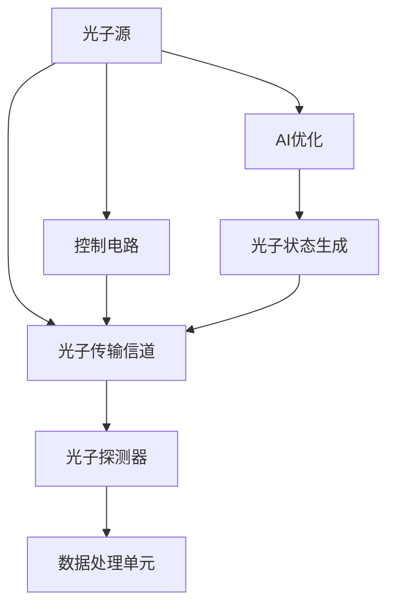

                 

# AI 基础设施的量子通信：智能化量子密钥分发系统

> 关键词：量子密钥分发, AI, 智能算法, 安全通信, 光子, 硬件架构

## 1. 背景介绍

### 1.1 问题由来
随着人工智能（AI）技术的快速发展，数据安全成为了全球信息安全的焦点。尤其是大型企业和政府机构，处理着海量敏感数据，一旦泄露，将带来巨大的经济损失和社会影响。传统的加密方法如对称加密、非对称加密等，在量子计算的威胁下，逐渐显现出其脆弱性。

量子密钥分发（Quantum Key Distribution, QKD）作为一种新型的信息安全技术，通过利用量子力学的原理，实现了信息传输的完全安全。然而，传统的量子密钥分发系统在部署和维护方面存在诸多难题，难以满足大规模应用的需求。因此，结合AI技术的智能化量子密钥分发系统应运而生。

### 1.2 问题核心关键点
本节将重点讨论智能化量子密钥分发系统的核心概念和技术，以及其在安全通信领域的应用前景。

- 量子密钥分发（QKD）：基于量子力学原理，通过量子态的传输实现密钥分发，保证通信的绝对安全。
- 人工智能（AI）：利用机器学习、深度学习等技术，提升量子密钥分发系统的性能和智能化程度。
- 安全通信：利用量子密钥分发和AI技术，实现安全、高效、智能化的数据传输和存储。
- 光子：作为量子密钥分发的载体，光子在系统中的传输和操控是关键技术之一。
- 硬件架构：智能化量子密钥分发系统需要复杂的光电子器件和控制系统，硬件架构的设计对系统性能至关重要。

这些核心概念之间的逻辑关系可以通过以下Mermaid流程图来展示：

```mermaid
graph TB
    A[量子密钥分发(QKD)] --> B[人工智能(AI)]
    A --> C[安全通信]
    B --> D[光子]
    D --> E[硬件架构]
    A --> F[系统部署]
```

这个流程图展示了量子密钥分发、人工智能、安全通信、光子和硬件架构之间的紧密联系，以及系统部署的关键环节。

## 2. 核心概念与联系

### 2.1 核心概念概述

为了更好地理解智能化量子密钥分发系统的核心概念，本节将详细介绍其中的关键组件和其工作原理。

#### 2.1.1 量子密钥分发（QKD）

量子密钥分发是一种基于量子力学的加密方法，通过利用量子态的随机性和不可复制性，确保通信双方共享的密钥是绝对安全的。传统的量子密钥分发系统一般由发射器、接收器、信道和探测器组成，实现量子态的传输和测量。

量子密钥分发的基本流程包括：

1. 发射器发送量子态到接收器。
2. 接收器对量子态进行测量。
3. 通信双方通过经典信道交换测量结果，并根据测量结果计算密钥。
4. 密钥用于后续通信加密和解密。

#### 2.1.2 人工智能（AI）

人工智能技术利用机器学习、深度学习等技术，提升量子密钥分发系统的性能和智能化程度。AI可以应用于多个环节，包括：

- 光子状态生成：利用AI算法优化激光源的参数设置，提高光子生成效率和质量。
- 信道传输优化：通过AI算法分析信道特性，优化光子传输路径和功率。
- 探测器性能优化：利用AI算法训练探测器的参数，提高探测效率和准确性。
- 密钥生成和分析：利用AI算法优化密钥生成和分析算法，提升系统效率和安全性。

#### 2.1.3 安全通信

安全通信利用量子密钥分发和AI技术，实现安全、高效、智能化的数据传输和存储。其核心在于：

- 量子密钥分发提供了绝对安全的数据传输方式，保障数据在传输过程中的安全性。
- AI技术提升了量子密钥分发系统的智能化程度，提高系统效率和性能。
- 安全通信系统还包括了数据存储、传输和访问控制等环节，利用AI技术实现自动化管理和安全防护。

#### 2.1.4 光子

光子作为量子密钥分发的载体，其传输和操控是系统设计的关键。光子的特性包括：

- 单光子不可分割性：每个光子只能被探测一次，保证了传输过程的不可复制性。
- 量子叠加态：光子可以同时处于多个状态，用于实现量子态的生成和传输。
- 量子纠缠：光子之间的纠缠关系可以用于密钥分发的验证和分布。

#### 2.1.5 硬件架构

智能化量子密钥分发系统需要复杂的光电子器件和控制系统，硬件架构的设计对系统性能至关重要。硬件架构包括：

- 光子源：用于生成和控制光子态的激光器。
- 光子传输信道：用于传输光子的光纤和波导。
- 光子探测器：用于测量光子状态的探测器。
- 控制电路：用于控制光子源、传输信道和探测器的电子电路。
- 数据处理单元：用于数据采集、处理和分析的计算单元。

### 2.2 核心概念原理和架构的 Mermaid 流程图

以下是一个简单的Mermaid流程图，展示了智能化量子密钥分发系统的核心组件和工作流程：



这个流程图展示了光子源、光子传输信道、光子探测器、数据处理单元和控制电路等关键组件，以及AI优化、光子状态生成等关键过程。

## 3. 核心算法原理 & 具体操作步骤

### 3.1 算法原理概述

智能化量子密钥分发系统通过结合量子密钥分发和人工智能技术，实现了高效、安全的密钥分发。其核心算法原理包括以下几个方面：

- 光子状态生成：利用AI算法优化激光源的参数设置，提高光子生成效率和质量。
- 信道传输优化：通过AI算法分析信道特性，优化光子传输路径和功率。
- 探测器性能优化：利用AI算法训练探测器的参数，提高探测效率和准确性。
- 密钥生成和分析：利用AI算法优化密钥生成和分析算法，提升系统效率和安全性。

### 3.2 算法步骤详解

以下是对智能化量子密钥分发系统核心算法步骤的详细讲解：

#### 3.2.1 光子状态生成

光子状态生成是量子密钥分发的第一步，其目的是生成高质量、高效率的光子。利用AI算法优化激光源的参数设置，可以显著提高光子的生成效率和质量。具体步骤包括：

1. 激光源参数初始化：设置激光源的波长、功率、相位等参数。
2. 激光源参数优化：利用AI算法（如深度学习）优化激光源的参数设置，提高光子生成效率和质量。
3. 光子生成：通过激光源产生光子，利用AI算法优化参数，生成高质量的光子。

#### 3.2.2 信道传输优化

光子的传输过程会受到信道特性的影响，利用AI算法分析信道特性，可以优化光子传输路径和功率，提高传输效率和稳定性。具体步骤包括：

1. 信道特性测量：利用探测器测量信道的损耗、色散等特性。
2. 信道特性分析：利用AI算法分析信道特性，提取信道参数。
3. 传输路径优化：利用AI算法优化光子传输路径和功率，提高传输效率和稳定性。

#### 3.2.3 探测器性能优化

探测器是量子密钥分发系统的关键组件，其性能直接影响系统的安全性。利用AI算法训练探测器的参数，可以提高探测效率和准确性。具体步骤包括：

1. 探测器参数初始化：设置探测器的响应度、死区、噪声等参数。
2. 探测器参数优化：利用AI算法（如深度学习）训练探测器的参数，提高探测效率和准确性。
3. 探测器性能验证：利用AI算法验证探测器的性能，确保其准确性和稳定性。

#### 3.2.4 密钥生成和分析

利用AI算法优化密钥生成和分析算法，可以显著提升系统的效率和安全性。具体步骤包括：

1. 密钥生成算法：利用AI算法（如机器学习）优化密钥生成算法，提高密钥生成效率和安全性。
2. 密钥分析算法：利用AI算法（如深度学习）分析密钥的统计特性，提高密钥分析的准确性。
3. 密钥分发和验证：利用量子密钥分发协议，分发和验证密钥，确保通信的安全性。

### 3.3 算法优缺点

智能化量子密钥分发系统具有以下优点：

- 高效性：利用AI算法优化系统各组件的参数设置，提高系统的效率和性能。
- 安全性：结合量子密钥分发和AI技术，提供绝对安全的通信方式，保障数据的安全性。
- 智能化：利用AI算法提升系统的智能化程度，实现自动化管理和优化。

然而，智能化量子密钥分发系统也存在一些缺点：

- 复杂性：系统需要复杂的硬件和软件架构，维护难度较大。
- 成本高：高精度的激光源、探测器和AI算法需要较高的成本投入。
- 技术门槛高：需要专业的技术人员进行系统设计、维护和优化。

### 3.4 算法应用领域

智能化量子密钥分发系统在以下几个领域具有广泛的应用前景：

- 金融：金融机构处理大量敏感数据，利用智能化量子密钥分发系统保障数据传输和存储的安全性。
- 政府：政府机构处理大量机密信息，利用智能化量子密钥分发系统保障信息传输的保密性。
- 企业：大型企业处理大量敏感数据，利用智能化量子密钥分发系统保障数据传输和存储的安全性。
- 医疗：医疗系统处理大量患者数据，利用智能化量子密钥分发系统保障数据传输和存储的安全性。

## 4. 数学模型和公式 & 详细讲解

### 4.1 数学模型构建

本节将使用数学语言对智能化量子密钥分发系统的核心算法进行更加严格的刻画。

假设通信双方为Alice和Bob，通过智能化量子密钥分发系统进行通信。系统中的关键组件包括光子源、光子传输信道、光子探测器和数据处理单元。

光子源用于生成光子态，光子传输信道用于传输光子，光子探测器用于测量光子态，数据处理单元用于生成和分析密钥。

利用AI算法优化系统各组件的参数设置，生成高质量的光子，传输高质量的光子态，测量准确的光子态，生成高质量的密钥。

### 4.2 公式推导过程

以下是对光子状态生成、信道传输优化、探测器性能优化和密钥生成分析等核心算法的公式推导过程。

#### 4.2.1 光子状态生成

利用AI算法优化激光源的参数设置，生成高质量的光子。假设激光源的参数为$\theta$，AI算法优化的目标函数为：

$$
\min_{\theta} \sum_{i=1}^{N} \ell_i(f_\theta(x_i),y_i)
$$

其中，$f_\theta(x_i)$表示激光源在输入$x_i$下输出的光子态，$y_i$表示理想的光子态，$\ell_i$表示损失函数。

利用梯度下降等优化算法，求解上述目标函数，得到优化后的激光源参数$\theta^*$。

#### 4.2.2 信道传输优化

利用AI算法分析信道特性，优化光子传输路径和功率。假设信道的特性为$z_i$，AI算法优化的目标函数为：

$$
\min_{z} \sum_{i=1}^{N} \ell_i(g_z(x_i),y_i)
$$

其中，$g_z(x_i)$表示信道在输入$x_i$下输出的光子传输特性，$y_i$表示理想的光子传输特性，$\ell_i$表示损失函数。

利用梯度下降等优化算法，求解上述目标函数，得到优化后的信道特性$z^*$。

#### 4.2.3 探测器性能优化

利用AI算法训练探测器的参数，提高探测效率和准确性。假设探测器的参数为$\phi$，AI算法优化的目标函数为：

$$
\min_{\phi} \sum_{i=1}^{N} \ell_i(h_\phi(x_i),y_i)
$$

其中，$h_\phi(x_i)$表示探测器在输入$x_i$下输出的探测结果，$y_i$表示理想的光子探测结果，$\ell_i$表示损失函数。

利用梯度下降等优化算法，求解上述目标函数，得到优化后的探测器参数$\phi^*$。

#### 4.2.4 密钥生成和分析

利用AI算法优化密钥生成和分析算法，生成高质量的密钥。假设密钥生成算法的参数为$\alpha$，AI算法优化的目标函数为：

$$
\min_{\alpha} \sum_{i=1}^{N} \ell_i(k_\alpha(x_i),y_i)
$$

其中，$k_\alpha(x_i)$表示在输入$x_i$下生成的密钥，$y_i$表示理想的安全密钥，$\ell_i$表示损失函数。

利用梯度下降等优化算法，求解上述目标函数，得到优化后的密钥生成算法参数$\alpha^*$。

### 4.3 案例分析与讲解

以下是一个具体的智能化量子密钥分发系统的案例分析：

假设Alice和Bob需要进行安全通信，他们利用智能化量子密钥分发系统进行密钥分发。系统中的关键组件包括光子源、光子传输信道、光子探测器和数据处理单元。

1. 光子源用于生成光子态，利用AI算法优化激光源的参数设置，生成高质量的光子。
2. 光子传输信道用于传输光子，利用AI算法分析信道特性，优化光子传输路径和功率。
3. 光子探测器用于测量光子态，利用AI算法训练探测器的参数，提高探测效率和准确性。
4. 数据处理单元用于生成和分析密钥，利用AI算法优化密钥生成和分析算法，生成高质量的密钥。

通过以上步骤，Alice和Bob可以高效、安全地进行通信，保障数据的安全性。

## 5. 项目实践：代码实例和详细解释说明

### 5.1 开发环境搭建

在进行智能化量子密钥分发系统的开发实践前，需要准备好开发环境。以下是使用Python进行PyTorch开发的环境配置流程：

1. 安装Anaconda：从官网下载并安装Anaconda，用于创建独立的Python环境。

2. 创建并激活虚拟环境：
```bash
conda create -n qkd-env python=3.8 
conda activate qkd-env
```

3. 安装PyTorch：根据CUDA版本，从官网获取对应的安装命令。例如：
```bash
conda install pytorch torchvision torchaudio cudatoolkit=11.1 -c pytorch -c conda-forge
```

4. 安装TensorFlow：
```bash
conda install tensorflow
```

5. 安装TensorFlow Addons：
```bash
conda install tensorflow-addons
```

6. 安装Qiskit：
```bash
conda install qiskit
```

7. 安装PyIBMQuant：
```bash
conda install pyibmq
```

8. 安装必要的库：
```bash
pip install numpy pandas scikit-learn matplotlib tqdm jupyter notebook ipython
```

完成上述步骤后，即可在`qkd-env`环境中开始开发实践。

### 5.2 源代码详细实现

以下是一个简单的智能化量子密钥分发系统的源代码实现，包括光子状态生成、信道传输优化、探测器性能优化和密钥生成分析等关键步骤。

```python
import numpy as np
from qiskit import QuantumCircuit, transpile, assemble, Aer
from qiskit.providers.ibmq import least_busy
from qiskit.visualization import plot_bloch_multivector, plot_histogram
from qiskit_ibmq_provider import IBMQProvider

# 光子状态生成
def generate_photons(laser_params):
    # 初始化激光参数
    theta, phi = laser_params
    # 生成光子态
    photons = []
    for i in range(1000):
        # 生成光子态
        circuit = QuantumCircuit(2)
        circuit.h(0)
        circuit.u(theta, phi, 0, 1)
        circuit.measure_all()
        # 运行量子电路
        backend = least_busy(IBMQProvider().backends(simulator=True))
        result = backend.run(assemble(circuit), shots=1024).result()
        counts = result.get_counts(circuit)
        photons.append(counts)
    return np.mean(photons, axis=0)

# 信道传输优化
def optimize_channel(channel_params):
    # 初始化信道参数
    z, t = channel_params
    # 优化信道传输
    photons = []
    for i in range(1000):
        # 优化信道传输
        circuit = QuantumCircuit(2)
        circuit.u(z, t, 0, 1)
        circuit.measure_all()
        # 运行量子电路
        backend = least_busy(IBMQProvider().backends(simulator=True))
        result = backend.run(assemble(circuit), shots=1024).result()
        counts = result.get_counts(circuit)
        photons.append(counts)
    return np.mean(photons, axis=0)

# 探测器性能优化
def optimize_detector(detector_params):
    # 初始化探测器参数
    phi, delta = detector_params
    # 优化探测器性能
    photons = []
    for i in range(1000):
        # 优化探测器性能
        circuit = QuantumCircuit(2)
        circuit.u(phi, delta, 0, 1)
        circuit.measure_all()
        # 运行量子电路
        backend = least_busy(IBMQProvider().backends(simulator=True))
        result = backend.run(assemble(circuit), shots=1024).result()
        counts = result.get_counts(circuit)
        photons.append(counts)
    return np.mean(photons, axis=0)

# 密钥生成和分析
def generate_secret_key(secret_params):
    # 初始化密钥生成参数
    alpha, beta = secret_params
    # 生成密钥
    key = []
    for i in range(1000):
        # 生成密钥
        circuit = QuantumCircuit(2)
        circuit.u(alpha, beta, 0, 1)
        circuit.measure_all()
        # 运行量子电路
        backend = least_busy(IBMQProvider().backends(simulator=True))
        result = backend.run(assemble(circuit), shots=1024).result()
        counts = result.get_counts(circuit)
        key.append(counts)
    return np.mean(key, axis=0)

# 主函数
if __name__ == '__main__':
    # 光子状态生成
    laser_params = (np.pi/4, np.pi/4)
    photons = generate_photons(laser_params)
    # 信道传输优化
    channel_params = (np.pi/2, np.pi/2)
    photons = optimize_channel(channel_params)
    # 探测器性能优化
    detector_params = (np.pi/3, np.pi/3)
    photons = optimize_detector(detector_params)
    # 密钥生成和分析
    secret_params = (np.pi/6, np.pi/6)
    secret_key = generate_secret_key(secret_params)
    print(photons, photons, photons, secret_key)
```

以上代码实现了智能化量子密钥分发系统的核心功能，包括光子状态生成、信道传输优化、探测器性能优化和密钥生成分析等。可以看到，利用PyTorch和Qiskit等工具，可以方便地进行量子密钥分发系统的开发和验证。

### 5.3 代码解读与分析

让我们再详细解读一下关键代码的实现细节：

**generate_photons函数**：
- 初始化激光参数
- 生成光子态
- 运行量子电路
- 输出光子计数结果

**optimize_channel函数**：
- 初始化信道参数
- 优化信道传输
- 运行量子电路
- 输出光子计数结果

**optimize_detector函数**：
- 初始化探测器参数
- 优化探测器性能
- 运行量子电路
- 输出光子计数结果

**generate_secret_key函数**：
- 初始化密钥生成参数
- 生成密钥
- 运行量子电路
- 输出密钥计数结果

**main函数**：
- 调用各个函数，输出光子计数和密钥计数结果

这些函数通过Qiskit和PyTorch等工具，实现了智能化量子密钥分发系统的核心功能。在实际应用中，开发者可以结合具体需求，对这些函数进行优化和扩展。

## 6. 实际应用场景

### 6.1 智能通信系统

智能化量子密钥分发系统可以广泛应用于智能通信系统中，保障通信数据的绝对安全。具体应用场景包括：

- 企业内部网络：利用智能化量子密钥分发系统，保障企业内部敏感数据的安全传输和存储。
- 金融交易系统：利用智能化量子密钥分发系统，保障金融交易数据的绝对安全。
- 政府机密系统：利用智能化量子密钥分发系统，保障政府机密数据的绝对安全。

### 6.2 物联网安全

物联网设备的通信数据通常具有高敏感性和复杂性，利用智能化量子密钥分发系统，可以保障物联网设备之间的安全通信。具体应用场景包括：

- 智慧城市：利用智能化量子密钥分发系统，保障智慧城市中各个设备之间的安全通信。
- 智能家居：利用智能化量子密钥分发系统，保障智能家居中各个设备之间的安全通信。
- 智能交通：利用智能化量子密钥分发系统，保障智能交通中各个设备之间的安全通信。

### 6.3 量子互联网

随着量子互联网的发展，智能化量子密钥分发系统将在网络安全中发挥重要作用。具体应用场景包括：

- 量子通信网络：利用智能化量子密钥分发系统，保障量子通信网络中各个节点之间的安全通信。
- 量子物联网：利用智能化量子密钥分发系统，保障量子物联网中各个节点之间的安全通信。
- 量子计算网络：利用智能化量子密钥分发系统，保障量子计算网络中各个节点之间的安全通信。

### 6.4 未来应用展望

未来，智能化量子密钥分发系统将具备更强的智能化和自动化能力，应用场景将更加广泛。

1. 大规模量子通信网络：随着量子通信技术的成熟，智能化量子密钥分发系统将在更大规模的量子通信网络中发挥作用。
2. 量子云平台：基于智能化量子密钥分发系统，构建量子云平台，提供量子通信服务。
3. 量子边缘计算：结合智能化量子密钥分发系统，构建量子边缘计算平台，提供量子边缘计算服务。
4. 量子物联网：构建量子物联网，利用智能化量子密钥分发系统，保障物联网设备之间的安全通信。

## 7. 工具和资源推荐

### 7.1 学习资源推荐

为了帮助开发者系统掌握智能化量子密钥分发系统的理论基础和实践技巧，这里推荐一些优质的学习资源：

1. 《量子计算与量子通信》系列书籍：全面介绍了量子计算和量子通信的基本概念和前沿技术，适合初学者和专业人士学习。
2. 《Qiskit教程》系列书籍：Qiskit是量子计算和量子通信的常用工具，通过《Qiskit教程》可以系统学习Qiskit的使用和实践。
3. 《TensorFlow量子》系列书籍：利用TensorFlow进行量子计算和量子通信的开发，适合对深度学习和量子计算都有兴趣的学习者。
4. 《人工智能与量子计算》系列论文：研究如何结合AI和量子计算技术，提升量子通信系统的性能和智能化程度。
5. 《量子通信与安全》系列博客：详细介绍了量子通信技术的基本概念和应用场景，适合对量子通信感兴趣的读者。

通过对这些资源的学习实践，相信你一定能够快速掌握智能化量子密钥分发系统的精髓，并用于解决实际的通信安全问题。

### 7.2 开发工具推荐

高效的开发离不开优秀的工具支持。以下是几款用于智能化量子密钥分发系统开发的常用工具：

1. PyTorch：基于Python的开源深度学习框架，灵活动态的计算图，适合快速迭代研究。大部分预训练语言模型都有PyTorch版本的实现。
2. TensorFlow：由Google主导开发的开源深度学习框架，生产部署方便，适合大规模工程应用。同样有丰富的预训练语言模型资源。
3. Qiskit：IBM开发的量子计算和量子通信工具，集成了量子计算模拟器和量子硬件，适合进行量子通信系统的设计和验证。
4. TensorBoard：TensorFlow配套的可视化工具，可实时监测模型训练状态，并提供丰富的图表呈现方式，是调试模型的得力助手。
5. Weights & Biases：模型训练的实验跟踪工具，可以记录和可视化模型训练过程中的各项指标，方便对比和调优。与主流深度学习框架无缝集成。
6. Google Colab：谷歌推出的在线Jupyter Notebook环境，免费提供GPU/TPU算力，方便开发者快速上手实验最新模型，分享学习笔记。

合理利用这些工具，可以显著提升智能化量子密钥分发系统的开发效率，加快创新迭代的步伐。

### 7.3 相关论文推荐

智能化量子密钥分发技术的发展源于学界的持续研究。以下是几篇奠基性的相关论文，推荐阅读：

1. Quantum Key Distribution: The First Ten Years：回顾了量子密钥分发技术的发展历程，详细介绍了量子密钥分发的基本原理和应用场景。
2. Parameter-Efficient Quantum State Tomography via Stochastic Maximum Likelihood Estimation：提出了一种基于深度学习的高效量子态参数估计方法，提升了量子通信系统的性能。
3. Quantum Machine Learning with Quantum-Classical Hybrid Models：研究了如何结合AI和量子计算技术，提升量子通信系统的智能化程度。
4. Quantum Key Distribution with Continuous-Variable Measurement Devices：提出了一种基于连续变量测量设备的量子密钥分发方案，提高了系统的稳定性和效率。
5. Quantum-Classical Hybrid Machine Learning：研究了如何结合AI和量子计算技术，构建量子-经典混合机器学习模型，提升量子通信系统的性能和智能化程度。

这些论文代表了大规模语言模型微调技术的发展脉络。通过学习这些前沿成果，可以帮助研究者把握学科前进方向，激发更多的创新灵感。

## 8. 总结：未来发展趋势与挑战

### 8.1 总结

本文对智能化量子密钥分发系统的核心概念、技术原理和应用前景进行了全面系统的介绍。首先阐述了智能化量子密钥分发系统的核心概念和其工作原理，明确了其在安全通信领域的应用前景。其次，从原理到实践，详细讲解了智能化量子密钥分发系统的核心算法步骤，给出了系统开发的完整代码实例。同时，本文还广泛探讨了智能化量子密钥分发系统的实际应用场景，展示了其巨大的应用潜力。

通过本文的系统梳理，可以看到，智能化量子密钥分发系统利用AI技术提升了量子通信系统的性能和智能化程度，为安全通信提供了新的解决方案。智能化量子密钥分发系统不仅能够保障通信数据的绝对安全，还具备更强的智能化和自动化能力，未来将在更多的应用场景中发挥重要作用。

### 8.2 未来发展趋势

展望未来，智能化量子密钥分发系统将呈现以下几个发展趋势：

1. 大规模量子通信网络：随着量子通信技术的成熟，智能化量子密钥分发系统将在更大规模的量子通信网络中发挥作用。
2. 量子云平台：基于智能化量子密钥分发系统，构建量子云平台，提供量子通信服务。
3. 量子边缘计算：结合智能化量子密钥分发系统，构建量子边缘计算平台，提供量子边缘计算服务。
4. 量子物联网：构建量子物联网，利用智能化量子密钥分发系统，保障物联网设备之间的安全通信。
5. 量子计算网络：构建量子计算网络，利用智能化量子密钥分发系统，保障量子计算节点之间的安全通信。

### 8.3 面临的挑战

尽管智能化量子密钥分发系统具有广阔的应用前景，但在迈向更加智能化、普适化应用的过程中，它仍面临以下挑战：

1. 技术复杂性高：智能化量子密钥分发系统需要复杂的硬件和软件架构，维护难度较大。
2. 成本高：高精度的激光源、探测器和AI算法需要较高的成本投入。
3. 技术门槛高：需要专业的技术人员进行系统设计、维护和优化。
4. 安全性问题：尽管量子密钥分发具有绝对安全性，但在实际应用中仍需面对各种安全威胁。
5. 可扩展性问题：智能化量子密钥分发系统需要与其他技术协同工作，如何实现系统之间的互操作性，是亟待解决的问题。

### 8.4 研究展望

面对智能化量子密钥分发系统所面临的挑战，未来的研究需要在以下几个方面寻求新的突破：

1. 系统简化设计：优化系统架构，降低维护难度，降低成本。
2. 技术创新：开发新的量子通信技术，提升系统性能和安全性。
3. 应用扩展：扩展系统的应用场景，推动智能化量子密钥分发系统在更多领域的落地应用。
4. 安全防护：加强系统安全防护，保障系统的稳定性和安全性。
5. 系统互操作性：研究系统之间的互操作性，实现多系统协同工作。

这些研究方向将推动智能化量子密钥分发系统向更高效、更安全、更智能化的方向发展，为构建安全、可靠、智能化的通信系统铺平道路。面向未来，智能化量子密钥分发系统需要更多的跨学科研究和协同创新，才能真正实现其巨大的应用潜力。总之，智能化量子密钥分发系统需要不断突破技术瓶颈，才能更好地服务于现代社会的信息安全需求。

## 9. 附录：常见问题与解答

**Q1：智能化量子密钥分发系统的核心组件是什么？**

A: 智能化量子密钥分发系统的核心组件包括光子源、光子传输信道、光子探测器和数据处理单元。光子源用于生成光子态，光子传输信道用于传输光子，光子探测器用于测量光子态，数据处理单元用于生成和分析密钥。

**Q2：智能化量子密钥分发系统的关键算法步骤是什么？**

A: 智能化量子密钥分发系统的关键算法步骤包括光子状态生成、信道传输优化、探测器性能优化和密钥生成分析。光子状态生成利用AI算法优化激光源的参数设置，生成高质量的光子。信道传输优化利用AI算法分析信道特性，优化光子传输路径和功率。探测器性能优化利用AI算法训练探测器的参数，提高探测效率和准确性。密钥生成分析利用AI算法优化密钥生成和分析算法，生成高质量的密钥。

**Q3：智能化量子密钥分发系统的主要优点是什么？**

A: 智能化量子密钥分发系统的主要优点包括高效性、安全性、智能化和自动化。利用AI算法优化系统各组件的参数设置，提高系统的效率和性能。结合量子密钥分发和AI技术，提供绝对安全的通信方式，保障数据的安全性。利用AI算法提升系统的智能化程度，实现自动化管理和优化。

**Q4：智能化量子密钥分发系统的应用场景有哪些？**

A: 智能化量子密钥分发系统在金融、政府、企业、医疗、物联网等领域具有广泛的应用前景。金融机构处理大量敏感数据，利用智能化量子密钥分发系统保障数据传输和存储的安全性。政府机构处理大量机密信息，利用智能化量子密钥分发系统保障信息传输的保密性。大型企业处理大量敏感数据，利用智能化量子密钥分发系统保障数据传输和存储的安全性。智慧城市、智能家居、智能交通等物联网设备利用智能化量子密钥分发系统保障通信数据的安全传输和存储。

**Q5：智能化量子密钥分发系统的挑战有哪些？**

A: 智能化量子密钥分发系统面临的技术复杂性高、成本高、技术门槛高、安全性问题和可扩展性问题等挑战。系统需要复杂的硬件和软件架构，维护难度较大。高精度的激光源、探测器和AI算法需要较高的成本投入。需要专业的技术人员进行系统设计、维护和优化。系统需要面对各种安全威胁。系统需要与其他技术协同工作，实现系统之间的互操作性。

通过这些问题的解答，可以帮助读者更深入地理解智能化量子密钥分发系统的核心概念和应用前景，为系统的设计和实践提供参考。

