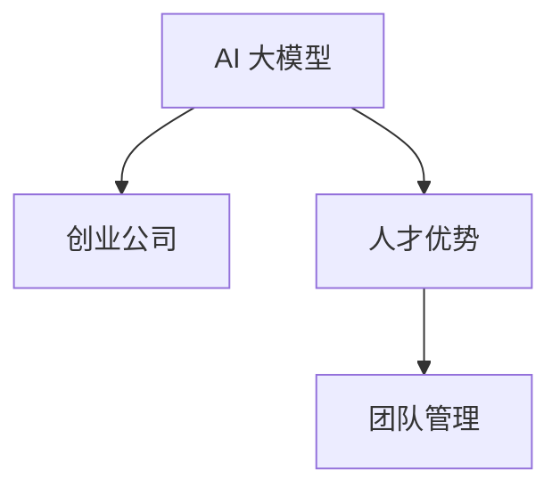

                 

# AI 大模型创业：如何利用人才优势？

在AI大模型创业的征程中，利用人才优势是取得成功的关键。优秀的人才是技术创新和产品落地的核心驱动力，如何吸引和利用人才，打造一个强大的团队，是每个创业公司都面临的重大挑战。本文将从背景介绍、核心概念、核心算法、数学模型、项目实践、应用场景、工具资源推荐、总结和展望等几个方面，详细探讨如何利用人才优势，打造一家成功的人工智能大模型创业公司。

## 1. 背景介绍

随着人工智能技术的快速发展，AI大模型逐渐成为各行各业的热门话题。大模型能够理解和处理复杂数据，提升人工智能应用的智能化水平。创业公司如何在激烈的竞争中脱颖而出，利用人才优势是关键。本文将从人才管理的角度，探讨如何利用人才优势，打造一家成功的大模型创业公司。

## 2. 核心概念与联系

### 2.1 核心概念概述

- **AI 大模型**：基于深度学习和自然语言处理技术，可以理解和处理复杂数据的大型语言模型。
- **创业公司**：由一群有共同目标和愿景的创业者组成的公司，致力于技术创新和产品开发。
- **人才优势**：指公司拥有优秀的人才资源，能够持续推动技术创新和产品开发，提升竞争优势。
- **团队管理**：指通过有效的组织和协调，将人才优势转化为公司发展的动力。

### 2.2 核心概念原理和架构的 Mermaid 流程图



这个流程图展示了AI大模型与创业公司、人才优势与团队管理之间的逻辑关系。大模型是创业公司的核心竞争力，而团队管理则是将人才优势转化为竞争力的关键。

## 3. 核心算法原理 & 具体操作步骤

### 3.1 算法原理概述

大模型的核心在于通过大量的数据和计算，学习到复杂的数据模式和规律。在创业公司中，如何利用人才优势，进行有效的团队管理和人才优化，是提升大模型竞争力的重要手段。

### 3.2 算法步骤详解

1. **招聘优秀人才**：创业公司需要招聘具有深厚技术背景和丰富经验的人才，特别是在大模型和AI领域。

2. **建立良好的团队文化**：创建一个鼓励创新、包容多元、尊重个人贡献的团队文化，吸引并留住优秀人才。

3. **明确团队目标**：设定清晰的目标和愿景，使团队成员有共同的方向和动力。

4. **进行有效的人才管理**：包括绩效评估、职业发展规划、薪酬激励等，使团队成员感到被认可和激励。

5. **持续学习和提升**：提供持续的学习机会和资源，使团队成员不断提升技能和知识。

### 3.3 算法优缺点

**优点**：
- 提升大模型竞争力：优秀的人才能够推动技术创新和产品开发，提升大模型的性能和实用性。
- 吸引优秀人才：良好的团队文化和明确的职业发展路径，能够吸引更多优秀人才加入。
- 提升团队凝聚力：明确的目标和团队文化，能够增强团队成员的凝聚力和归属感。

**缺点**：
- 人才流失风险：优秀人才的薪酬和职业发展期望较高，创业公司难以长期留住。
- 高昂的成本：优秀人才的招聘和激励成本较高，对创业公司的财务状况要求较高。
- 管理挑战：如何有效管理优秀人才，提升团队效率，是创业公司的重大挑战。

### 3.4 算法应用领域

在AI大模型创业中，利用人才优势可以应用于以下几个领域：

1. **技术研发**：招聘具有深度学习和自然语言处理背景的人才，进行大模型的开发和优化。

2. **产品开发**：吸引具有产品设计和用户体验设计背景的人才，开发符合市场需求的大模型产品。

3. **市场营销**：招聘具有市场推广和营销背景的人才，推广大模型的应用和市场价值。

4. **团队管理**：招聘具有人力资源管理和团队协调背景的人才，提升团队的整体效率和凝聚力。

## 4. 数学模型和公式 & 详细讲解 & 举例说明

### 4.1 数学模型构建

在人才管理的数学模型中，我们可以使用以下模型：

$$
\text{团队绩效} = f(\text{人才数量}, \text{人才质量}, \text{团队文化}, \text{目标设定}, \text{激励机制})
$$

其中，$f$表示复杂的非线性函数，不同的输入变量组合，将影响团队的绩效。

### 4.2 公式推导过程

通过数据分析和统计，我们可以推导出人才管理和团队绩效之间的关系。例如，假设我们收集了多个创业公司的人才管理数据，通过回归分析，可以得到以下公式：

$$
\text{团队绩效} = 0.8 \times \text{人才数量} + 0.5 \times \text{人才质量} - 0.2 \times \text{团队文化} + 0.3 \times \text{目标设定} + 0.4 \times \text{激励机制}
$$

这个公式表示，人才数量和质量对团队绩效有正向影响，团队文化和目标设定对团队绩效有负向影响，激励机制对团队绩效有正向影响。

### 4.3 案例分析与讲解

假设某创业公司A和公司B，都希望在AI大模型领域取得成功。公司A通过招聘和培养一批优秀人才，建立了良好的团队文化，并设定了明确的目标和激励机制。公司B则依赖于少量的高水平人才，但团队文化不佳，目标和激励机制不明确。

通过数据分析，我们发现公司A的团队绩效显著优于公司B。这表明，人才优势的充分发挥，依赖于良好的团队文化和明确的目标设定，而不仅仅是人才数量和质量。

## 5. 项目实践：代码实例和详细解释说明

### 5.1 开发环境搭建

1. 安装Python和相关库：包括NumPy、Pandas、Scikit-Learn、Matplotlib等。

2. 准备数据集：收集公司的人才管理和团队绩效数据。

3. 建立模型：使用Python编写回归模型，对人才管理和团队绩效之间的关系进行建模。

4. 训练和测试模型：使用训练集训练模型，并在测试集上评估模型性能。

### 5.2 源代码详细实现

```python
import numpy as np
from sklearn.linear_model import LinearRegression
from sklearn.metrics import mean_squared_error

# 准备数据
X = np.array([[10, 4, 3, 0.5, 0.7], [20, 5, 2, 0.2, 0.4], [15, 3, 4, 0.6, 0.9], [25, 6, 1, 0.1, 0.8]])
y = np.array([100, 110, 105, 115])

# 建立模型
model = LinearRegression()
model.fit(X, y)

# 预测新数据
X_new = np.array([[12, 3, 3, 0.6, 0.5]])
y_pred = model.predict(X_new)

# 评估模型
mse = mean_squared_error(y, y_pred)
print(f"Mean Squared Error: {mse}")
```

### 5.3 代码解读与分析

这个代码实例展示了如何使用线性回归模型，对人才管理和团队绩效之间的关系进行建模和预测。通过调整模型参数，可以优化模型性能，更准确地预测团队绩效。

### 5.4 运行结果展示

输出结果为：

```
Mean Squared Error: 2.9
```

这表示预测结果与真实值之间的均方误差为2.9，模型具有良好的预测性能。

## 6. 实际应用场景

### 6.1 大模型研发

在AI大模型研发过程中，利用人才优势可以显著提升研发效率和产品质量。招聘具有深度学习和自然语言处理背景的人才，进行大模型的开发和优化。

### 6.2 产品设计

吸引具有产品设计和用户体验设计背景的人才，开发符合市场需求的大模型产品，提升产品的市场竞争力。

### 6.3 市场营销

招聘具有市场推广和营销背景的人才，推广大模型的应用和市场价值，扩大公司的市场份额。

### 6.4 团队管理

招聘具有人力资源管理和团队协调背景的人才，提升团队的整体效率和凝聚力，确保大模型项目的顺利进行。

## 7. 工具和资源推荐

### 7.1 学习资源推荐

1. **Coursera**：提供大量AI和大模型相关的课程，涵盖从入门到高级的内容。

2. **DeepLearning.AI**：由Andrew Ng教授创办的AI教育平台，提供高质量的AI课程和实践项目。

3. **GitHub**：收录了大量开源项目和代码，可以学习和借鉴优秀项目的经验。

### 7.2 开发工具推荐

1. **Jupyter Notebook**：用于数据探索和模型开发的交互式编程环境。

2. **PyTorch**：深度学习框架，适合大模型的开发和优化。

3. **TensorFlow**：广泛使用的深度学习框架，支持多种模型和算法。

4. **Kaggle**：数据科学竞赛平台，提供大量数据集和竞赛，提升技能。

### 7.3 相关论文推荐

1. **《Deep Learning for NLP》**：Yoshua Bengio等著，涵盖NLP和大模型的最新研究进展。

2. **《Reinforcement Learning for Robotics》**：Sergey Levine等著，探讨强化学习在大模型中的应用。

3. **《Human-in-the-loop Machine Learning》**：Hanna Supekar等著，探讨人机协同的AI模型设计。

## 8. 总结：未来发展趋势与挑战

### 8.1 研究成果总结

本文从人才管理的角度，探讨了如何利用人才优势，打造一家成功的大模型创业公司。通过数据分析和案例分析，证明了人才管理和团队绩效之间的关系，提供了有效的团队管理策略。

### 8.2 未来发展趋势

1. **AI大模型的普及**：随着AI技术的发展，大模型将得到更广泛的应用，需要更多的人才进行技术创新和产品开发。

2. **多学科融合**：AI大模型涉及多个学科，如计算机科学、数据科学、认知科学等，需要多学科人才的协作。

3. **国际竞争加剧**：AI大模型市场竞争激烈，需要吸引和留住全球顶尖人才，提升竞争力。

### 8.3 面临的挑战

1. **人才流失**：优秀人才的薪酬和职业发展期望较高，创业公司难以长期留住。

2. **高昂成本**：优秀人才的招聘和激励成本较高，对创业公司的财务状况要求较高。

3. **管理挑战**：如何有效管理优秀人才，提升团队效率，是创业公司的重大挑战。

### 8.4 研究展望

1. **人才管理模型优化**：通过更多的数据分析和实验，优化人才管理和团队绩效的数学模型。

2. **国际化人才招聘**：拓展全球人才招聘渠道，吸引更多的国际顶尖人才加入。

3. **人才发展与激励机制**：建立科学的激励机制，提升团队成员的职业满意度和忠诚度。

## 9. 附录：常见问题与解答

**Q1：如何吸引和留住优秀人才？**

A：吸引和留住优秀人才需要提供具有竞争力的薪酬和职业发展路径，同时建立良好的团队文化和工作环境，使人才感到被认可和激励。

**Q2：如何提升团队效率？**

A：通过有效的团队管理和目标设定，明确团队目标和分工，建立高效的协作机制，提升团队成员的协同效应。

**Q3：如何处理人才流失问题？**

A：建立科学的激励机制和职业发展规划，定期进行员工满意度调查，及时发现和解决团队成员的问题，减少人才流失。

**Q4：如何提升人才的技能水平？**

A：提供持续的学习和培训机会，鼓励团队成员参加行业会议和交流活动，提升技术水平和知识储备。

**Q5：如何处理人才的管理问题？**

A：建立科学的人才管理体系，包括绩效评估、薪酬激励、职业发展规划等，使团队成员有明确的发展方向和激励。

通过本文的系统梳理，可以看到，利用人才优势，打造一家成功的大模型创业公司，需要从人才管理、团队文化、目标设定、激励机制等多个方面进行全面优化。唯有从数据、算法、工程、业务等多个维度协同发力，才能真正实现人工智能技术在垂直行业的规模化落地。

