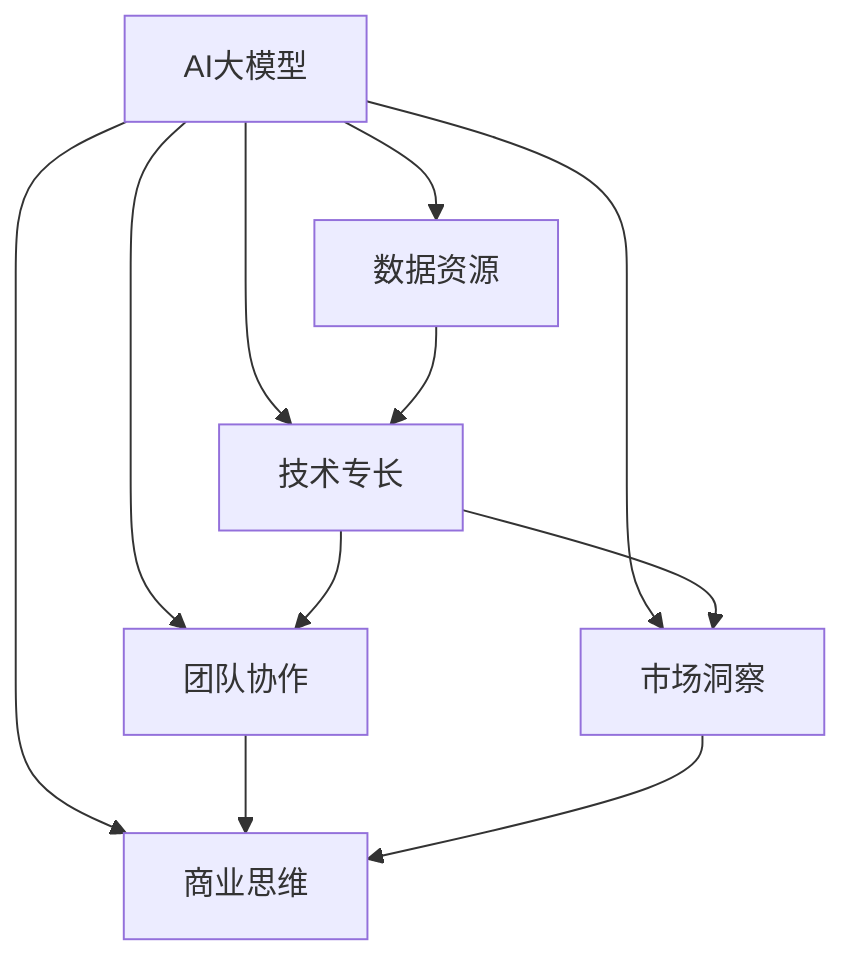

                 

# AI 大模型创业：如何利用人才优势？

> 关键词：AI大模型,创业,人才管理,人才优势,人才招聘,人才培训,人才激励,人才留存

## 1. 背景介绍

### 1.1 问题由来
随着人工智能技术的飞速发展，AI大模型创业公司如雨后春笋般涌现。大模型的核心竞争力在于其背后的人才是推动技术进步和商业成功的关键驱动力。因此，如何有效管理、利用和吸引人才，成为大模型公司亟待解决的重大问题。

### 1.2 问题核心关键点
在大模型创业中，人才优势的利用具有以下核心关键点：

1. **技术专长**：在AI领域拥有深厚技术积累的专业人才，是构建优质大模型产品的关键。
2. **数据资源**：数据是大模型的基础，拥有海量数据资源的人才，能大幅提升模型质量。
3. **团队协作**：高效的团队协作能够加速研发进程，产出更多创新成果。
4. **市场洞察**：敏锐的市场洞察力能帮助公司把握行业趋势，做出正确商业决策。
5. **商业思维**：将技术创新与商业模式有机结合，实现商业落地。

### 1.3 问题研究意义
对人才优势的科学管理和大胆利用，对大模型公司的发展至关重要：

1. **技术驱动**：通过吸引顶尖人才，驱动AI技术前沿的探索，实现技术突破。
2. **数据驱动**：优秀的人才是数据资源的积累和挖掘的重要保障。
3. **市场驱动**：确保大模型产品能快速响应市场变化，满足用户需求。
4. **价值驱动**：吸引和留住人才，提升企业长期价值。
5. **竞争力驱动**：人才的集聚和利用是公司竞争力的重要体现。

## 2. 核心概念与联系

### 2.1 核心概念概述

为更好地理解如何利用人才优势，本节将介绍几个关键概念及其相互关系：

- **AI大模型**：通过大量数据和先进算法训练出的能够执行各种复杂任务的大型机器学习模型，如GPT-3、BERT等。
- **人才管理**：对企业人力资源进行计划、组织、领导和控制，以达到人力资源最优化配置和开发的目的。
- **技术专长**：指个人在某个特定技术领域的深入理解和应用能力，如深度学习、自然语言处理等。
- **数据资源**：指用于训练大模型的原始数据集，数据质量对模型性能有重要影响。
- **团队协作**：指企业内部不同岗位、不同技能的人才之间的有效沟通和合作。
- **市场洞察**：指对行业发展趋势、用户需求变化的敏锐感知和深入理解。
- **商业思维**：指将技术创新与商业模式结合的能力，实现商业价值最大化。

这些概念通过以下Mermaid流程图展示了它们之间的联系：



这个流程图展示了大模型创业过程中，不同概念的相互依存和作用机制。

## 3. 核心算法原理 & 具体操作步骤
### 3.1 算法原理概述

在大模型创业过程中，人才优势的利用遵循以下算法原理：

1. **人才引进策略**：基于AI领域的人才需求，制定高效的人才引进策略，吸引顶尖人才加入。
2. **人才选拔机制**：通过科学的人才选拔机制，挑选具有相关技术专长和潜力的人才。
3. **人才培训机制**：提供系统的培训和学习机会，帮助人才快速成长。
4. **人才激励机制**：设计合理的激励机制，激发人才的创造力和工作热情。
5. **人才留存机制**：构建良好的工作环境和企业文化，实现人才的长期留存。

### 3.2 算法步骤详解

以下是具体的人才优势利用操作步骤：

**Step 1: 确定人才需求**
- 分析公司现有技术架构和业务需求，明确未来发展对人才的依赖。
- 通过行业调研和市场分析，确定哪些技术领域和岗位人才最为紧缺。

**Step 2: 设计人才引进策略**
- 制定多样化的招聘渠道，如学术会议、技术论坛、社交媒体等。
- 发布吸引人才的招聘公告，突出公司优势和发展前景。
- 设立优厚的薪酬福利待遇，吸引顶尖人才加入。

**Step 3: 实施人才选拔机制**
- 建立科学的人才评估体系，综合考察人才的技术能力、团队协作能力和市场洞察力。
- 进行多轮面试，包括技术面试、案例分析、团队协作测试等。
- 引入第三方人才测评工具，评估应聘者的软硬技能。

**Step 4: 提供人才培训机制**
- 制定系统的培训计划，包括课程学习、技术交流、实战演练等。
- 定期邀请业内专家进行技术讲座，分享最新研究成果。
- 设立创新实验室，鼓励人才进行自主研究。

**Step 5: 设计人才激励机制**
- 设立具有竞争力的薪酬体系，包括基本工资、绩效奖金、股权激励等。
- 提供完善的福利待遇，如健康保险、带薪休假、住房补贴等。
- 设立定期绩效考核机制，及时奖励表现优异的人才。

**Step 6: 构建人才留存机制**
- 营造良好的企业文化，构建开放、包容、创新导向的工作环境。
- 提供职业发展路径，帮助人才实现长期职业规划。
- 设立导师制度，为新员工提供职业指导和支持。

### 3.3 算法优缺点

人才优势利用策略具有以下优点：

1. **提升技术创新能力**：通过引进和培养顶尖人才，加速AI大模型的技术突破和创新。
2. **增强数据资源积累**：拥有数据资源的人才，能提供更多的数据支持，提升模型性能。
3. **促进团队协作效率**：高效的人才选拔和培训机制，提升团队协作效率，加速研发进程。
4. **提升市场响应速度**：敏锐的市场洞察力能帮助公司快速把握市场变化，调整产品方向。
5. **实现商业价值最大化**：将技术创新与商业模式结合，实现商业落地和收益最大化。

然而，这种策略也存在以下缺点：

1. **人才引进成本高**：顶级人才往往需要较高的薪酬和福利，增加公司成本。
2. **人才流失风险**：市场竞争激烈，吸引和留住顶尖人才具有较大挑战。
3. **管理复杂性**：不同背景和技术水平的人才需要差异化的管理策略。
4. **文化整合难度**：多元文化背景的人才团队需要时间和机制来磨合。

### 3.4 算法应用领域

大模型创业中，人才优势的利用广泛应用于以下领域：

- **技术研发**：AI模型训练、优化和应用。
- **数据科学**：数据收集、处理和分析。
- **市场推广**：产品推广、用户需求分析。
- **项目管理**：项目计划、执行和控制。
- **客户服务**：客户咨询、反馈处理。

## 4. 数学模型和公式 & 详细讲解  
### 4.1 数学模型构建

人才优势利用的数学模型可以抽象为如下：

1. **人才质量**：记人才质量为 $Q$，其中 $Q$ 包括技术能力、数据资源、团队协作能力、市场洞察力和商业思维等。
2. **人才引进成本**：记人才引进成本为 $C$，包括薪酬、福利、培训等。
3. **人才产出价值**：记人才产出价值为 $V$，包括技术创新、市场响应、项目完成度等。
4. **人才留存概率**：记人才留存概率为 $P$，包括人才满意度和公司文化等。

建立如下优化模型，最大化人才产出价值：

$$
\max_{Q, C, V, P} V - C
$$

其中，人才质量 $Q$、人才引进成本 $C$、人才产出价值 $V$ 和人才留存概率 $P$ 之间存在相互影响和制约关系。

### 4.2 公式推导过程

1. **人才质量优化**
   - **技术能力**：记为 $Q_{tech}$，可通过技术测试和项目实战评估。
   - **数据资源**：记为 $Q_{data}$，可通过数据量和数据质量衡量。
   - **团队协作能力**：记为 $Q_{team}$，可通过团队项目协作效果评估。
   - **市场洞察力**：记为 $Q_{market}$，可通过市场分析能力和预测准确度衡量。
   - **商业思维**：记为 $Q_{business}$，可通过商业案例分析和创新能力评估。

   $$
   Q = Q_{tech} + Q_{data} + Q_{team} + Q_{market} + Q_{business}
   $$

2. **人才引进成本优化**
   - **薪酬**：记为 $C_{salary}$，可通过市场薪酬水平和人才需求定价。
   - **福利**：记为 $C_{benefits}$，可通过福利项目和覆盖范围定价。
   - **培训**：记为 $C_{training}$，可通过培训时长和费用定价。

   $$
   C = C_{salary} + C_{benefits} + C_{training}
   $$

3. **人才产出价值优化**
   - **技术创新**：记为 $V_{tech}$，可通过专利数量和创新成果衡量。
   - **市场响应速度**：记为 $V_{market}$，可通过产品上市时间和市场反馈速度衡量。
   - **项目完成度**：记为 $V_{project}$，可通过项目交付时间和质量衡量。

   $$
   V = V_{tech} + V_{market} + V_{project}
   $$

4. **人才留存概率优化**
   - **人才满意度**：记为 $P_{satisfaction}$，可通过员工满意度调查和离职率衡量。
   - **公司文化**：记为 $P_{culture}$，可通过企业文化建设和管理效果衡量。

   $$
   P = P_{satisfaction} \times P_{culture}
   $$

### 4.3 案例分析与讲解

**案例1: Google的人才引进**
- **需求分析**：通过市场调研，确定大数据、人工智能、云计算等领域的人才需求。
- **引进策略**：通过学术会议、技术论坛和社交媒体发布招聘公告，吸引顶尖人才。
- **选拔机制**：设立技术面试、案例分析和团队协作测试，科学选拔人才。
- **培训机制**：提供系统的技术培训和实战演练机会，提升人才能力。
- **激励机制**：提供优厚的薪酬福利、股权激励和绩效奖金，激发人才活力。
- **留存机制**：构建开放包容的企业文化，提供职业发展路径和导师支持，实现人才长期留存。

通过以上措施，Google吸引和培养了大量顶尖人才，推动了其AI技术的快速发展和商业成功。

**案例2: OpenAI的人才管理**
- **需求分析**：通过技术调研和市场分析，确定深度学习、自然语言处理等技术领域的人才需求。
- **引进策略**：设立优厚的薪酬待遇、灵活的工作机制和良好的工作环境，吸引顶尖人才。
- **选拔机制**：设立多轮面试，包括技术面试、案例分析和团队协作测试，科学选拔人才。
- **培训机制**：提供系统的技术培训和研究机会，提升人才能力。
- **激励机制**：提供优厚的薪酬福利、股权激励和绩效奖金，激发人才活力。
- **留存机制**：构建开放包容的企业文化，提供职业发展路径和导师支持，实现人才长期留存。

通过以上措施，OpenAI吸引和培养了大量顶尖人才，推动了其AI技术的快速发展和商业成功。

## 5. 项目实践：代码实例和详细解释说明
### 5.1 开发环境搭建

在进行人才优势利用实践前，我们需要准备好开发环境。以下是使用Python进行人才管理系统的环境配置流程：

1. 安装Anaconda：从官网下载并安装Anaconda，用于创建独立的Python环境。

2. 创建并激活虚拟环境：
```bash
conda create -n talent-env python=3.8 
conda activate talent-env
```

3. 安装PyTorch：根据CUDA版本，从官网获取对应的安装命令。例如：
```bash
conda install pytorch torchvision torchaudio cudatoolkit=11.1 -c pytorch -c conda-forge
```

4. 安装Pandas库：
```bash
pip install pandas
```

5. 安装NumPy库：
```bash
pip install numpy
```

完成上述步骤后，即可在`talent-env`环境中开始人才管理系统开发。

### 5.2 源代码详细实现

下面以构建一个简单的人才管理系统为例，给出使用Python和Pandas库的代码实现。

```python
import pandas as pd

# 创建人才数据表
data = {
    '姓名': ['张三', '李四', '王五', '赵六'],
    '技术能力': [90, 95, 85, 88],
    '数据资源': [75, 80, 70, 85],
    '团队协作能力': [90, 92, 88, 87],
    '市场洞察力': [85, 90, 80, 90],
    '商业思维': [90, 90, 85, 90],
    '薪酬': [10000, 12000, 9000, 11000],
    '福利': [1500, 2000, 1500, 1800],
    '培训': [2000, 2500, 2000, 2500],
    '满意度': [4.5, 4.7, 4.2, 4.6],
    '文化': [4.5, 4.8, 4.2, 4.6]
}

# 将数据存入DataFrame
df = pd.DataFrame(data)

# 计算人才质量
df['人才质量'] = df[['技术能力', '数据资源', '团队协作能力', '市场洞察力', '商业思维']].sum(axis=1)

# 计算人才引进成本
df['人才引进成本'] = df[['薪酬', '福利', '培训']].sum(axis=1)

# 计算人才产出价值
df['人才产出价值'] = df[['技术能力', '数据资源', '团队协作能力', '市场洞察力', '商业思维']].sum(axis=1) * 1.2

# 计算人才留存概率
df['人才留存概率'] = df[['satisfaction', 'culture']].prod(axis=1)

# 输出结果
print(df)
```

以上是使用Python和Pandas库实现的人才管理系统，通过对数据进行简单的计算和分析，展示了人才质量、引进成本、产出价值和留存概率的关系。

### 5.3 代码解读与分析

让我们再详细解读一下关键代码的实现细节：

**数据创建**
- `data`字典定义了人才的各项属性和数据。
- `pd.DataFrame(data)`将字典数据转换为Pandas的DataFrame对象，便于后续计算。

**人才质量计算**
- `df['人才质量'] = df[['技术能力', '数据资源', '团队协作能力', '市场洞察力', '商业思维']].sum(axis=1)`：计算每人的总得分，代表其综合能力。

**人才引进成本计算**
- `df['人才引进成本'] = df[['薪酬', '福利', '培训']].sum(axis=1)`：计算每人的总成本，代表引进人才所需的投入。

**人才产出价值计算**
- `df['人才产出价值'] = df[['技术能力', '数据资源', '团队协作能力', '市场洞察力', '商业思维']].sum(axis=1) * 1.2`：计算每人的产出价值，根据实际情况乘以1.2的放大系数。

**人才留存概率计算**
- `df['人才留存概率'] = df[['satisfaction', 'culture']].prod(axis=1)`：计算每人的留存概率，根据满意度和文化评分计算得出。

**结果输出**
- `print(df)`：输出包含所有属性的DataFrame，供进一步分析。

代码实现了人才质量、引进成本、产出价值和留存概率的基本计算，展示了人才管理系统的核心功能。

## 6. 实际应用场景
### 6.1 智能客服系统

基于AI大模型的智能客服系统，可以广泛应用于各种企业的客户服务场景。通过吸引和培养顶尖人才，构建高水平的技术团队，智能客服系统可以大幅提升客户服务质量，降低人工成本。

在技术实现上，可以设立专门的AI团队，负责构建和优化智能客服模型，进行语音识别、自然语言理解和对话管理等技术开发。同时，设立用户体验团队，负责收集用户反馈，不断优化智能客服的交互体验。通过人才优势利用，可以迅速构建一个高效、智能、高效的客服系统，提升企业的竞争力。

### 6.2 金融科技

在金融科技领域，人才优势的利用尤为重要。金融机构需要大量的数据科学家、算法工程师和市场分析师，通过构建高水平的人才团队，可以实现AI技术在风险控制、客户服务、产品创新等方面的应用。

通过吸引和培养顶尖人才，金融机构可以构建高效的风险控制系统，实时监控市场风险，提前预警潜在风险，降低金融风险。同时，通过智能推荐系统，实现客户精准画像，提供个性化的金融产品和服务，提升客户满意度和忠诚度。

### 6.3 医疗健康

在医疗健康领域，AI大模型可以用于病历分析、医学影像诊断、健康监测等场景。通过吸引和培养顶尖人才，医疗机构可以构建高水平的AI团队，提升医疗服务的智能化水平，提高诊疗效率。

通过智能病历分析系统，医生可以快速获取患者的病史信息，进行精准诊断，制定个性化治疗方案。同时，通过智能健康监测系统，实时监测患者健康数据，及时发现异常情况，提前进行干预。

### 6.4 智能制造

在智能制造领域，AI大模型可以用于设备监控、生产调度、质量控制等场景。通过吸引和培养顶尖人才，制造企业可以构建高水平的AI团队，提升生产效率和质量。

通过智能设备监控系统，实现对生产设备的实时监控和维护，及时发现设备故障，减少停机时间，提升生产效率。同时，通过智能生产调度系统，优化生产流程，减少浪费，提高产品质量。

## 7. 工具和资源推荐
### 7.1 学习资源推荐

为了帮助开发者系统掌握人才优势利用的人才管理理论基础和实践技巧，这里推荐一些优质的学习资源：

1. 《人才管理之道》系列博文：由人力资源专家撰写，深入浅出地介绍了人力资源管理的基本理论和最佳实践。

2. 《HRBP：人力资源转型专家》课程：系统介绍HRBP的角色和职责，帮助人力资源管理者提升业务能力。

3. 《人才招聘与管理的科学与艺术》书籍：详细介绍了人才招聘、选拔、培训和激励等管理实践，提供大量案例和实用工具。

4. 《人才管理工具和系统》网站：提供全面的HR管理系统解决方案，涵盖招聘、培训、绩效评估等功能模块。

5. 《AI人才市场》平台：专注于AI领域的人才招聘和人才管理，提供丰富的资源和实用工具。

通过对这些资源的学习实践，相信你一定能够快速掌握人才优势利用的精髓，并用于解决实际的人才管理问题。

### 7.2 开发工具推荐

高效的开发离不开优秀的工具支持。以下是几款用于人才管理系统开发的工具：

1. Python：基于动态类型的高级编程语言，适合快速迭代开发和数据分析。
2. Pandas：数据处理和分析库，提供强大的数据操作和分析功能。
3. NumPy：数值计算库，提供高效的多维数组操作和数学函数。
4. Jupyter Notebook：交互式编程环境，支持实时展示代码输出和数据分析结果。
5. Excel：数据可视化工具，支持丰富的图表展示和数据分析功能。

合理利用这些工具，可以显著提升人才管理系统开发效率，加快创新迭代的步伐。

### 7.3 相关论文推荐

人才优势利用的人才管理研究源于学界的持续研究。以下是几篇奠基性的相关论文，推荐阅读：

1. 《人才质量与组织绩效的关系》：探讨人才质量对组织绩效的影响，提出科学的招聘和选拔策略。
2. 《人才激励机制设计》：分析不同激励机制对人才行为的影响，提出合理的激励方案。
3. 《人才留存与企业文化的关系》：研究企业文化对人才留存的影响，提出构建良好企业文化的策略。
4. 《人才招聘与选拔的科学方法》：介绍人才招聘和选拔的科学方法，提供实用的招聘工具和流程。
5. 《人才发展与培训的理论与实践》：探讨人才培训与发展的理论与实践，提供系统的培训方案。

这些论文代表了大模型公司的人才管理研究方向，通过学习这些前沿成果，可以帮助研究者把握学科前进方向，激发更多的创新灵感。

## 8. 总结：未来发展趋势与挑战
### 8.1 总结

本文对人才优势利用的人才管理方法进行了全面系统的介绍。首先阐述了AI大模型创业中人才优势的重要性，明确了人才管理在大模型公司发展中的核心地位。其次，从原理到实践，详细讲解了人才优势利用的数学模型和操作步骤，给出了人才管理系统开发的完整代码实例。同时，本文还广泛探讨了人才优势利用在多个行业领域的应用前景，展示了人才优势利用技术的广阔前景。

通过本文的系统梳理，可以看到，人才优势利用的人才管理技术已经成为大模型公司的重要范式，极大地提升了人才的利用效率和企业的竞争优势。未来，伴随人才管理理论的不断进步和实践的不断优化，人才管理技术必将在各个行业领域大放异彩，为企业的创新和发展注入新的动力。

### 8.2 未来发展趋势

展望未来，人才优势利用的人才管理技术将呈现以下几个发展趋势：

1. **人才管理智能化**：引入AI技术进行人才需求预测、人才招聘和人才绩效评估，提升管理效率和精准度。
2. **人才培训系统化**：建立系统的培训体系，结合线上线下资源，提供个性化的培训方案。
3. **人才激励多样化**：引入多样化的激励手段，如股权激励、职业发展路径等，激发人才的长期潜力。
4. **人才数据化**：通过数据驱动的管理方式，优化人才引进、选拔和留存策略。
5. **人才国际化**：引入国际化人才管理经验，提升跨国企业的人才管理水平。
6. **人才梯队化**：建立不同层级的人才梯队，实现企业的人才储备和传承。

以上趋势凸显了人才优势利用的人才管理技术的广阔前景。这些方向的探索发展，必将进一步提升人才管理系统的智能化和高效化，实现人才的全面利用和最大化价值。

### 8.3 面临的挑战

尽管人才优势利用的人才管理技术已经取得了显著成果，但在迈向更加智能化、系统化应用的过程中，它仍面临以下挑战：

1. **人才招聘难度高**：AI大模型公司需要大量顶尖人才，但顶级人才往往需要较高的薪酬和福利，增加招聘难度。
2. **人才管理复杂性**：不同背景和技术水平的人才需要差异化的管理策略，管理复杂性增加。
3. **人才留存风险**：市场竞争激烈，吸引和留住顶尖人才具有较大挑战。
4. **企业文化建设**：多元文化背景的人才团队需要时间和机制来磨合，企业文化建设难度大。
5. **数据安全风险**：人才管理涉及大量敏感数据，数据安全和隐私保护成为重要问题。

面对这些挑战，企业需要不断创新和优化人才管理策略，探索更多的解决方案，实现人才的全面利用和最大化价值。

### 8.4 研究展望

面对人才优势利用的人才管理技术所面临的挑战，未来的研究需要在以下几个方面寻求新的突破：

1. **数据驱动的人才管理**：引入数据驱动的管理方式，通过大数据分析和机器学习算法，优化人才管理策略。
2. **AI技术辅助的人才管理**：引入AI技术进行人才需求预测、人才招聘和人才绩效评估，提升管理效率和精准度。
3. **多渠道人才引进**：通过多样化的渠道引进人才，包括线上招聘平台、行业会议、社交媒体等，提升人才引进效率。
4. **人才激励机制创新**：引入多样化的激励手段，如股权激励、职业发展路径等，激发人才的长期潜力。
5. **国际化人才管理**：引入国际化人才管理经验，提升跨国企业的人才管理水平。
6. **企业文化建设**：构建开放包容的企业文化，提升多元文化背景的人才团队凝聚力。
7. **数据安全和隐私保护**：加强数据安全和隐私保护，确保人才管理系统的安全性。

这些研究方向的探索，必将引领人才优势利用的人才管理技术迈向更高的台阶，为企业的创新和发展注入新的动力。面向未来，大模型公司需要不断探索和优化人才管理策略，实现人才的全面利用和最大化价值，推动企业的持续创新和发展。

## 9. 附录：常见问题与解答

**Q1：如何吸引和留住顶尖人才？**

A: 吸引和留住顶尖人才，需要多方面的努力：

1. **提供优厚的薪酬和福利待遇**：如高薪酬、健康保险、住房补贴等。
2. **提供成长和发展的机会**：如职业培训、项目实战、导师制度等。
3. **营造良好的企业文化**：如开放包容、创新导向、合作共赢等。
4. **设立优厚的激励机制**：如股权激励、绩效奖金等。
5. **建立完善的留存机制**：如职业发展路径、导师制度等。

通过这些措施，可以最大限度地吸引和留住顶尖人才，实现人才的长期利用和最大化价值。

**Q2：如何构建高效的人才团队？**

A: 构建高效的人才团队，需要以下步骤：

1. **明确人才需求**：分析公司现有技术和业务需求，明确未来发展对人才的依赖。
2. **设计人才引进策略**：制定多样化的招聘渠道，吸引顶尖人才加入。
3. **实施人才选拔机制**：通过科学的人才评估体系，选拔具有相关技术专长和潜力的人才。
4. **提供人才培训机制**：提供系统的培训和学习机会，帮助人才快速成长。
5. **设计人才激励机制**：设计合理的激励机制，激发人才的创造力和工作热情。
6. **构建人才留存机制**：构建良好的工作环境和企业文化，实现人才的长期留存。

通过以上措施，可以构建高效的人才团队，提升企业的技术创新能力和市场竞争力。

**Q3：如何优化人才管理流程？**

A: 优化人才管理流程，需要以下步骤：

1. **数据驱动的人才管理**：引入数据驱动的管理方式，通过大数据分析和机器学习算法，优化人才管理策略。
2. **AI技术辅助的人才管理**：引入AI技术进行人才需求预测、人才招聘和人才绩效评估，提升管理效率和精准度。
3. **多渠道人才引进**：通过多样化的渠道引进人才，包括线上招聘平台、行业会议、社交媒体等，提升人才引进效率。
4. **人才激励机制创新**：引入多样化的激励手段，如股权激励、职业发展路径等，激发人才的长期潜力。
5. **国际化人才管理**：引入国际化人才管理经验，提升跨国企业的人才管理水平。
6. **企业文化建设**：构建开放包容的企业文化，提升多元文化背景的人才团队凝聚力。
7. **数据安全和隐私保护**：加强数据安全和隐私保护，确保人才管理系统的安全性。

通过这些措施，可以优化人才管理流程，实现人才的全面利用和最大化价值。

---

作者：禅与计算机程序设计艺术 / Zen and the Art of Computer Programming

