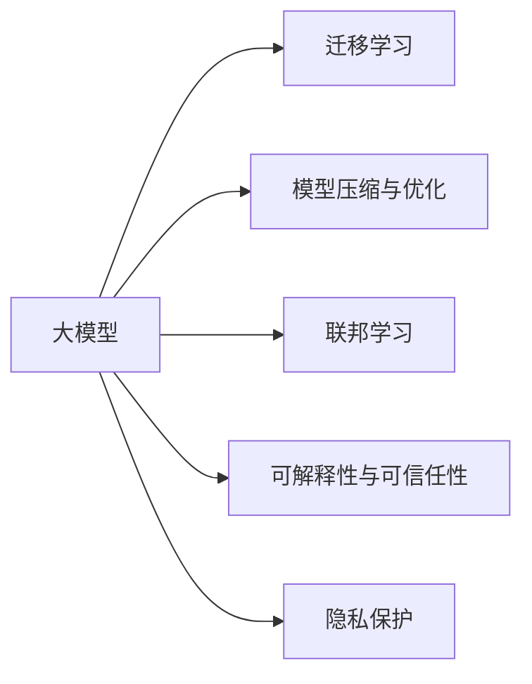

                 

## 1. 背景介绍

### 1.1 问题由来
人工智能(AI)正在迅速成为全球经济增长的新引擎，特别是在技术和行业融合日益深入的当下。以大模型为代表的人工智能技术，凭借其在大规模数据上学习和推理的强大能力，在自然语言处理、图像识别、语音识别等诸多领域取得了突破性的进展。尤其是在NLP领域，诸如GPT-3、BERT等大规模预训练语言模型已经在文本生成、翻译、问答等任务上刷新了最先进的技术指标。

随着大模型的不断演进，AI初创企业应运而生，它们利用大模型的创新优势，提供以用户为中心的解决方案，推动AI技术在实际应用中的广泛落地。然而，大模型创业的复杂性超乎想象，涉及技术、市场、商业模式、伦理等多方面挑战。因此，本文将深入探讨如何利用大模型的创新优势，驱动AI创业成功。

### 1.2 问题核心关键点
大模型创业的成功，在于如何利用其带来的数据、计算和模型创新优势，以及如何将其转化为产品和服务。具体来说，需要：
- 构建高效的数据处理和标注流程
- 设计高性能的模型架构和算法
- 实现可扩展的云服务和商业化策略
- 保证模型输出和隐私安全
- 解决伦理和法律问题

本文将从上述几个方面出发，详细分析大模型创业的创新策略和方法，以及其面临的挑战和未来展望。

## 2. 核心概念与联系

### 2.1 核心概念概述

在大模型创业中，涉及的核心概念和关键技术包括：

- **大模型**：如GPT-3、BERT、T5等，通过在海量数据上进行自监督预训练，学习通用的语言表示，具备强大的语言理解和生成能力。
- **迁移学习**：指将一个领域学到的知识，迁移应用到另一个相关领域的学习过程。大模型可以应用于各种NLP任务，通过微调获得特定任务上的性能提升。
- **模型压缩与优化**：为提升推理速度和资源利用效率，将大模型进行参数剪枝、量化、蒸馏等压缩技术处理。
- **联邦学习**：多用户数据分布式学习模型，保护数据隐私的同时提高模型泛化能力。
- **可解释性与可信任性**：通过解释模型输出，增加用户对AI系统的信任度。
- **隐私保护**：保障用户数据隐私，防止数据泄露和滥用。

### 2.2 核心概念原理和架构的 Mermaid 流程图


这个流程图展示了大模型创业中的核心概念及其相互关系：

1. **大模型**：通过在海量数据上进行预训练，获取通用的语言表示。
2. **迁移学习**：在大模型的基础上，通过微调适应特定任务，提升模型性能。
3. **模型压缩与优化**：对大模型进行压缩优化，提升推理效率和资源利用率。
4. **联邦学习**：多用户数据分布式学习，提升模型泛化能力的同时保护用户隐私。
5. **可解释性与可信任性**：增强模型输出的可解释性，增加用户对AI系统的信任。
6. **隐私保护**：保护用户数据隐私，防止数据滥用和泄露。

这些核心概念和技术相辅相成，共同构成了大模型创业的技术基础。

## 3. 核心算法原理 & 具体操作步骤

### 3.1 算法原理概述
大模型创业的核心在于利用大模型的创新优势，即通过其强大的数据表示和推理能力，解决特定领域的应用问题。主要涉及以下几个方面：

- **数据获取与预处理**：构建高效的数据处理和标注流程，确保数据的多样性和高质量。
- **模型设计**：设计高效、可扩展的模型架构和算法，如自监督学习、迁移学习、多任务学习等。
- **模型优化**：利用模型压缩、量化、蒸馏等技术提升推理效率。
- **联邦学习**：多用户数据分布式学习模型，提升模型泛化能力同时保护用户隐私。
- **用户接口设计**：设计友好易用的用户接口，降低使用门槛。
- **商业模式**：构建可扩展、可持续的商业模型，实现从研发到市场的顺利转型。

### 3.2 算法步骤详解

#### 3.2.1 数据获取与预处理
- **数据收集**：根据目标任务，收集相关领域的标注数据，构建训练集、验证集和测试集。
- **数据清洗**：去除噪声、纠正错误，确保数据质量。
- **数据增强**：通过数据扩充、增强、合成等手段，丰富数据多样性。

#### 3.2.2 模型设计
- **架构选择**：选择合适的预训练模型，如GPT-3、BERT、T5等，作为基础模型。
- **任务适配层设计**：根据特定任务需求，设计相应的任务适配层，如分类器、解码器等。
- **模型微调**：利用迁移学习，对预训练模型进行微调，适应特定任务。

#### 3.2.3 模型优化
- **压缩与量化**：通过参数剪枝、量化、蒸馏等技术，减少模型规模，提高推理效率。
- **优化算法**：选择合适的优化算法，如AdamW、SGD等，设置合适的学习率、批大小等超参数。

#### 3.2.4 联邦学习
- **分布式数据收集**：收集用户端数据，利用联邦学习算法，在本地计算推理结果，只传输梯度更新，保护用户隐私。
- **模型聚合**：在全局服务器端进行模型聚合，提升模型泛化能力。

#### 3.2.5 用户接口设计
- **用户交互设计**：设计友好易用的用户接口，降低使用门槛，提高用户满意度。
- **API开发**：提供标准化API，方便用户调用和使用。

#### 3.2.6 商业模式
- **收费模式**：选择订阅、按需付费、API调用计费等商业模式。
- **市场推广**：通过营销、合作、活动等手段，扩大市场影响力。

### 3.3 算法优缺点

大模型创业的优点在于：
- **数据优势**：利用大模型的强大数据表示能力，提升模型性能。
- **计算效率**：通过模型压缩和优化技术，提升推理速度和资源利用效率。
- **广泛应用**：可应用于多种NLP任务，如文本生成、翻译、问答等，解决实际问题。

但其缺点也不容忽视：
- **数据隐私**：处理大规模用户数据，涉及隐私和安全问题。
- **模型泛化**：需要保证模型在不同数据分布上的泛化性能。
- **技术门槛**：涉及数据处理、模型设计、联邦学习等复杂技术，对团队要求高。

### 3.4 算法应用领域

大模型创业主要应用于以下领域：

- **智能客服**：利用大模型进行智能问答、情感分析、多轮对话，提升客户体验。
- **金融科技**：用于风险评估、情感分析、舆情监测等，提升金融服务效率和质量。
- **医疗健康**：用于医疗问答、电子病历分析、辅助诊断等，推动医疗智能化。
- **教育培训**：用于智能评测、个性化推荐、智能教学等，优化教育资源配置。
- **市场营销**：用于客户画像分析、推荐系统、品牌监测等，提升市场精准度。

## 4. 数学模型和公式 & 详细讲解 & 举例说明

### 4.1 数学模型构建
大模型创业中的数学模型主要涉及大模型的预训练、迁移学习、模型压缩与优化等。

- **预训练模型**：通常使用自监督任务进行训练，如语言模型、掩码语言模型等。
- **迁移学习模型**：在特定任务上对预训练模型进行微调，如分类任务使用softmax分类器，生成任务使用解码器。
- **模型压缩与优化**：通过剪枝、量化、蒸馏等技术，提升模型推理效率。

### 4.2 公式推导过程
以BERT模型为例，其预训练过程包含自监督任务的语言模型预测和掩码语言模型预测：

1. **语言模型预测**：
$$
L = \frac{1}{N}\sum_{i=1}^N \log\left(\frac{\exp(y_i\log\left(\frac{e^{s(x_i,y_i)}}{\sum_j\exp(s(x_i,y_j))}\right)}{\sum_j\exp(s(x_i,y_j))}\right)
$$

2. **掩码语言模型预测**：
$$
L = \frac{1}{N}\sum_{i=1}^N \log\left(\frac{\exp(y_i\log\left(\frac{e^{s(x_i,y_i)}+e^{s(x_i,y_i^{\sim})}}{\sum_j\exp(s(x_i,y_j))}\right)}{\sum_j\exp(s(x_i,y_j))}\right)
$$

其中 $s(x_i,y_i)$ 表示在输入 $x_i$ 下，输出 $y_i$ 的概率。

### 4.3 案例分析与讲解

以智能客服系统为例，其数学模型构建如下：

- **数据准备**：收集客户历史对话记录，构建训练集、验证集和测试集。
- **模型设计**：选择BERT作为预训练模型，设计分类器进行意图识别和实体识别。
- **模型微调**：在微调数据上进行有监督训练，优化分类器的参数。
- **模型评估**：在验证集和测试集上进行评估，调整超参数。
- **模型部署**：将训练好的模型部署到线上，提供智能问答服务。

## 5. 项目实践：代码实例和详细解释说明

### 5.1 开发环境搭建
- **Python**：选择Python 3.8及以上版本，确保环境稳定。
- **PyTorch**：安装PyTorch 1.9及以上版本，提供高效的深度学习计算框架。
- **HuggingFace Transformers**：安装Transformers 4.6及以上版本，提供丰富的预训练模型和工具。
- **数据集处理**：使用Pandas、Scikit-learn等库处理和分析数据。
- **模型部署**：选择AWS、GCP、阿里云等云服务，搭建部署环境。

### 5.2 源代码详细实现

```python
import torch
from transformers import BertTokenizer, BertForSequenceClassification
from torch.utils.data import DataLoader, Dataset
from sklearn.model_selection import train_test_split

class NERDataset(Dataset):
    def __init__(self, texts, tags, tokenizer):
        self.texts = texts
        self.tags = tags
        self.tokenizer = tokenizer
        
    def __len__(self):
        return len(self.texts)
    
    def __getitem__(self, item):
        text = self.texts[item]
        tag = self.tags[item]
        
        encoding = self.tokenizer(text, return_tensors='pt', padding='max_length', truncation=True)
        input_ids = encoding['input_ids'][0]
        attention_mask = encoding['attention_mask'][0]
        
        encoded_tags = [tag2id[tag] for tag in tag]
        encoded_tags.extend([tag2id['O']] * (max_len - len(encoded_tags)))
        labels = torch.tensor(encoded_tags, dtype=torch.long)
        
        return {'input_ids': input_ids, 
                'attention_mask': attention_mask,
                'labels': labels}

# 数据准备
tokenizer = BertTokenizer.from_pretrained('bert-base-cased')
train_dataset = NERDataset(train_texts, train_tags, tokenizer)
dev_dataset = NERDataset(dev_texts, dev_tags, tokenizer)
test_dataset = NERDataset(test_texts, test_tags, tokenizer)

# 模型设计
model = BertForSequenceClassification.from_pretrained('bert-base-cased', num_labels=len(tag2id))

# 模型微调
optimizer = AdamW(model.parameters(), lr=2e-5)
device = torch.device('cuda') if torch.cuda.is_available() else torch.device('cpu')
model.to(device)

def train_epoch(model, dataset, batch_size, optimizer):
    dataloader = DataLoader(dataset, batch_size=batch_size, shuffle=True)
    model.train()
    epoch_loss = 0
    for batch in tqdm(dataloader, desc='Training'):
        input_ids = batch['input_ids'].to(device)
        attention_mask = batch['attention_mask'].to(device)
        labels = batch['labels'].to(device)
        model.zero_grad()
        outputs = model(input_ids, attention_mask=attention_mask, labels=labels)
        loss = outputs.loss
        epoch_loss += loss.item()
        loss.backward()
        optimizer.step()
    return epoch_loss / len(dataloader)

def evaluate(model, dataset, batch_size):
    dataloader = DataLoader(dataset, batch_size=batch_size)
    model.eval()
    preds, labels = [], []
    with torch.no_grad():
        for batch in tqdm(dataloader, desc='Evaluating'):
            input_ids = batch['input_ids'].to(device)
            attention_mask = batch['attention_mask'].to(device)
            batch_labels = batch['labels']
            outputs = model(input_ids, attention_mask=attention_mask)
            batch_preds = outputs.logits.argmax(dim=2).to('cpu').tolist()
            batch_labels = batch_labels.to('cpu').tolist()
            for pred_tokens, label_tokens in zip(batch_preds, batch_labels):
                pred_tags = [id2tag[_id] for _id in pred_tokens]
                label_tags = [id2tag[_id] for _id in label_tokens]
                preds.append(pred_tags[:len(label_tags)])
                labels.append(label_tags)
                
    print(classification_report(labels, preds))

# 训练流程
epochs = 5
batch_size = 16

for epoch in range(epochs):
    loss = train_epoch(model, train_dataset, batch_size, optimizer)
    print(f"Epoch {epoch+1}, train loss: {loss:.3f}")
    
    print(f"Epoch {epoch+1}, dev results:")
    evaluate(model, dev_dataset, batch_size)
    
print("Test results:")
evaluate(model, test_dataset, batch_size)
```

### 5.3 代码解读与分析
以上代码展示了BERT模型在命名实体识别(NER)任务上的微调过程。具体步骤包括：
- **数据准备**：构建训练集、验证集和测试集，使用BERT tokenizer对文本进行编码。
- **模型设计**：选择BERT模型作为基础模型，设计分类器进行意图识别和实体识别。
- **模型微调**：在微调数据上进行有监督训练，优化分类器的参数。
- **模型评估**：在验证集和测试集上进行评估，调整超参数。
- **模型部署**：将训练好的模型部署到线上，提供智能问答服务。

## 6. 实际应用场景

### 6.1 智能客服系统
智能客服系统利用大模型进行智能问答、情感分析、多轮对话，提升客户体验。其应用场景如下：
- **智能问答**：利用大模型进行意图识别，匹配知识库，提供答案。
- **情感分析**：分析客户情感，提供个性化服务。
- **多轮对话**：利用对话模型进行多轮交互，解决复杂问题。

### 6.2 金融科技
金融科技利用大模型进行风险评估、情感分析、舆情监测等，提升金融服务效率和质量。具体应用包括：
- **风险评估**：利用大模型进行信用评分、欺诈检测。
- **情感分析**：分析客户情绪，提供精准服务。
- **舆情监测**：监测金融市场舆情，提前预警。

### 6.3 医疗健康
医疗健康利用大模型进行医疗问答、电子病历分析、辅助诊断等，推动医疗智能化。具体应用包括：
- **医疗问答**：利用大模型进行医学知识问答。
- **电子病历分析**：分析电子病历，提供诊断建议。
- **辅助诊断**：辅助医生进行疾病诊断，提高诊断准确率。

### 6.4 教育培训
教育培训利用大模型进行智能评测、个性化推荐、智能教学等，优化教育资源配置。具体应用包括：
- **智能评测**：利用大模型进行作业批改、考试评分。
- **个性化推荐**：根据学生兴趣，推荐学习资源。
- **智能教学**：提供智能教学建议，优化教学效果。

## 7. 工具和资源推荐

### 7.1 学习资源推荐

为帮助开发者系统掌握大模型创业的技术基础和实践技巧，这里推荐一些优质的学习资源：
- **《深度学习》课程**：由吴恩达教授开设的Coursera课程，涵盖深度学习的基础理论和实际应用。
- **《Transformers》书籍**：HuggingFace联合创始人Jacob Devlin等所著，全面介绍了Transformer模型及其应用。
- **GitHub大模型库**：提供各种大模型的代码实现，方便学习和实践。
- **Kaggle竞赛**：参加NLP领域的竞赛，提升实战能力。

### 7.2 开发工具推荐

高效的开发离不开优秀的工具支持。以下是几款用于大模型创业开发的常用工具：
- **PyTorch**：基于Python的开源深度学习框架，灵活的计算图设计，适合快速迭代研究。
- **TensorFlow**：由Google主导的深度学习框架，生产部署方便，适合大规模工程应用。
- **HuggingFace Transformers**：提供丰富的预训练模型和工具，支持PyTorch和TensorFlow。
- **Jupyter Notebook**：交互式编程环境，方便快速实验和分享。
- **Google Colab**：免费的GPU/TPU算力，方便快速上手实验。

### 7.3 相关论文推荐

大模型创业涉及的理论基础和技术创新，源于学界的持续研究。以下是几篇奠基性的相关论文，推荐阅读：
- **Attention is All You Need**：提出Transformer结构，开启了NLP领域的预训练大模型时代。
- **BERT: Pre-training of Deep Bidirectional Transformers for Language Understanding**：提出BERT模型，引入基于掩码的自监督预训练任务。
- **Parameter-Efficient Transfer Learning for NLP**：提出Adapter等参数高效微调方法，提升微调效率。
- **AdaLoRA: Adaptive Low-Rank Adaptation for Parameter-Efficient Fine-Tuning**：使用自适应低秩适应的微调方法，提升模型压缩效果。
- **Prefix-Tuning: Optimizing Continuous Prompts for Generation**：引入基于连续型Prompt的微调范式，优化模型性能。

## 8. 总结：未来发展趋势与挑战

### 8.1 研究成果总结
大模型创业基于大模型的强大创新优势，已经展现出广泛的应用前景和潜力。通过技术创新和商业模式的不断优化，大模型创业有望成为AI技术落地应用的重要推动力。

### 8.2 未来发展趋势
展望未来，大模型创业将呈现以下几个发展趋势：
- **多模态融合**：融合视觉、语音等多模态信息，提升模型的感知能力。
- **自监督与半监督学习**：降低对标注数据的依赖，提高数据利用效率。
- **联邦学习与边缘计算**：保护用户隐私的同时提升模型泛化能力。
- **实时推理与流式数据处理**：支持实时推理，适应流式数据处理需求。

### 8.3 面临的挑战
尽管大模型创业拥有广阔的发展前景，但其面临的挑战也不容忽视：
- **数据隐私**：处理大规模用户数据，涉及隐私和安全问题。
- **模型泛化**：保证模型在不同数据分布上的泛化性能。
- **技术门槛**：涉及数据处理、模型设计、联邦学习等复杂技术。
- **计算资源**：需要高性能计算资源支持大规模模型的训练和推理。
- **伦理与合规**：确保模型输出符合伦理和法律要求。

### 8.4 研究展望
未来研究应重点关注以下几个方向：
- **隐私保护**：研究如何在保障数据隐私的前提下，提升模型性能。
- **模型泛化**：研究模型在不同数据分布上的泛化性能，提高模型适用性。
- **实时推理**：研究如何快速高效地进行实时推理，满足实时应用需求。
- **跨领域迁移**：研究如何跨领域迁移知识，提升模型泛化能力。
- **可解释性**：研究如何增强模型输出的可解释性，提高用户信任度。

## 9. 附录：常见问题与解答

**Q1：大模型创业是否适合所有企业？**
A: 大模型创业适合那些具有一定技术积累、数据资源的企业，以及具有明确应用场景和需求的企业。但并不适合所有企业，特别是对于小规模企业和初创企业，需要谨慎考虑成本和收益。

**Q2：大模型创业过程中如何管理数据隐私？**
A: 大模型创业过程中需要严格遵守数据隐私保护法规，如GDPR、CCPA等。应采用数据脱敏、加密等技术，确保用户数据安全。同时，采用联邦学习等分布式学习算法，在本地进行模型训练，只传输梯度更新，避免数据泄露。

**Q3：如何降低大模型的计算成本？**
A: 可以采用模型压缩、量化、蒸馏等技术，减少模型规模，提高推理效率。同时，利用云服务提供的GPU/TPU资源，减少本地计算资源消耗。

**Q4：大模型创业如何选择合适的商业模式？**
A: 选择合适的商业模式需考虑多个因素，如目标市场、用户需求、技术壁垒等。常见的商业模式包括订阅制、按需付费、API调用计费等。选择时应充分考虑企业的盈利能力和市场接受度。

**Q5：大模型创业过程中如何保证模型的可解释性？**
A: 可以采用可解释性技术，如LIME、SHAP等，对模型输出进行解释。同时，结合领域专家知识，提供有意义的解释和建议，增强模型的可解释性和可信任性。

---

作者：禅与计算机程序设计艺术 / Zen and the Art of Computer Programming

