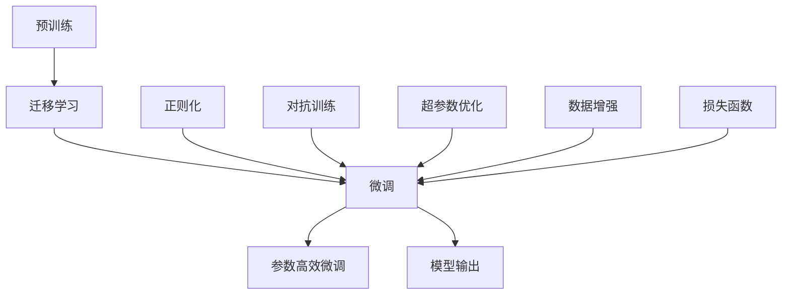

                 

# AI 大模型创业：如何利用市场优势？

## 1. 背景介绍

### 1.1 问题由来
人工智能（AI）大模型在过去几年中取得了显著进展，其广泛的应用和巨大的商业潜力吸引了众多创业者和企业的关注。随着技术的不断成熟，越来越多的初创公司选择将大模型作为核心产品，以期在市场上取得成功。然而，AI大模型的创业之路并不简单，它需要面对诸多挑战，包括技术、市场、运营等各方面的问题。如何在竞争激烈的市场上取得优势，如何利用大模型的市场优势，本文将给出详细解答。

### 1.2 问题核心关键点
在AI大模型创业过程中，核心问题包括以下几个方面：

- 技术难点：如何高效构建和优化大模型，确保模型的性能和稳定性。
- 数据挑战：如何获取高质量的训练数据，保证模型在实际应用中的效果。
- 市场定位：如何在众多AI公司中脱颖而出，明确自身的市场定位和差异化优势。
- 商业模式：如何选择合适的商业模式，最大化商业价值和市场影响力。
- 用户教育：如何教育用户，让用户理解并使用大模型，增加产品黏性。
- 法律合规：如何在AI应用中遵守法律法规，确保商业行为的合法合规。

本文将围绕这些关键点，系统梳理AI大模型创业的思路和方法，并结合实际案例，提供详细指导和建议。

## 2. 核心概念与联系

### 2.1 核心概念概述

- **AI大模型**：指具有大规模参数量（通常在亿级别），能够在特定任务上实现高性能表现的深度学习模型。其广泛应用于自然语言处理、计算机视觉、推荐系统等领域。

- **迁移学习**：指将在大规模数据集上预训练的模型，应用于新任务的训练中，以提高新任务的性能。

- **微调(Fine-Tuning)**：指在迁移学习的基础上，对模型进行进一步的调整和优化，以适应特定应用场景。

- **参数高效微调(Parameter-Efficient Fine-Tuning, PEFT)**：指在微调过程中，只更新部分模型参数，而非全部参数，以减少计算资源消耗。

- **预训练**：指在大规模无标签数据上训练模型，使其学习到通用的语言或视觉特征。

- **正则化**：指在模型训练过程中，加入限制模型复杂度的约束，避免过拟合。

- **对抗训练**：指在模型训练中，加入对抗样本，提高模型的鲁棒性和泛化能力。

- **超参数优化**：指通过调整学习率、批量大小、正则化强度等超参数，优化模型性能。

- **损失函数**：指在模型训练中，用于衡量模型输出与真实标签之间的差异，常用的有交叉熵、均方误差等。

- **数据增强**：指通过数据变换、数据扩充等技术，增加训练集的多样性，提高模型泛化能力。

这些概念构成了AI大模型创业的基础，它们之间通过数据、模型、训练等环节紧密联系，共同影响着模型的性能和应用效果。

### 2.2 核心概念原理和架构的 Mermaid 流程图

这个流程图展示了AI大模型从预训练、迁移学习到微调的过程，以及其中涉及的各项技术和方法。从预训练开始，模型在大规模数据集上学习通用的语言或视觉特征；随后通过迁移学习，将模型应用于特定任务，进一步提升性能；最后通过微调、正则化、对抗训练、超参数优化等方法，优化模型，提高鲁棒性和泛化能力，最终输出满足特定应用场景的模型。

## 3. 核心算法原理 & 具体操作步骤

### 3.1 算法原理概述

AI大模型创业的核心在于构建和优化高质量的大模型，并将其应用于实际场景中。以下是对核心算法的详细阐述：

- **预训练**：在大规模无标签数据上训练模型，使其学习到通用的语言或视觉特征。预训练的目标是提高模型的表达能力和泛化能力。

- **迁移学习**：将在大规模数据集上预训练的模型，应用于新任务的训练中，以提高新任务的性能。迁移学习的关键在于选择与新任务相关的预训练模型。

- **微调**：在迁移学习的基础上，对模型进行进一步的调整和优化，以适应特定应用场景。微调的目标是优化模型在特定任务上的表现。

- **参数高效微调**：在微调过程中，只更新部分模型参数，而非全部参数，以减少计算资源消耗。常见的参数高效微调方法包括Adapter、GPT等。

- **正则化**：在模型训练过程中，加入限制模型复杂度的约束，避免过拟合。常用的正则化方法包括L2正则、Dropout等。

- **对抗训练**：在模型训练中，加入对抗样本，提高模型的鲁棒性和泛化能力。

- **超参数优化**：通过调整学习率、批量大小、正则化强度等超参数，优化模型性能。

### 3.2 算法步骤详解

以下是AI大模型创业中，核心算法的详细步骤：

1. **数据准备**：收集和清洗数据，确保数据的多样性和质量，为预训练和微调提供充足的训练样本。

2. **模型构建**：选择合适的模型架构，如Transformer、CNN等，并设置初始化参数。

3. **预训练**：在大规模无标签数据上训练模型，学习通用的语言或视觉特征。预训练阶段可以使用自监督学习任务，如掩码语言模型、图像分类等。

4. **迁移学习**：选择与新任务相关的预训练模型，并将其应用于新任务的训练中。根据新任务的特点，调整模型的输出层和损失函数。

5. **微调**：在迁移学习的基础上，对模型进行进一步的调整和优化，以适应特定应用场景。微调的目标是优化模型在特定任务上的表现。

6. **参数高效微调**：在微调过程中，只更新部分模型参数，而非全部参数，以减少计算资源消耗。

7. **正则化**：在模型训练过程中，加入限制模型复杂度的约束，避免过拟合。

8. **对抗训练**：在模型训练中，加入对抗样本，提高模型的鲁棒性和泛化能力。

9. **超参数优化**：通过调整学习率、批量大小、正则化强度等超参数，优化模型性能。

10. **模型评估**：在验证集上评估模型性能，根据评估结果调整模型参数和超参数。

11. **模型部署**：将训练好的模型部署到实际应用场景中，并根据实际反馈不断优化模型。

### 3.3 算法优缺点

**优点**：

- 预训练和迁移学习可以大大提高模型的性能和泛化能力。
- 参数高效微调和正则化等方法可以有效减少计算资源消耗，提高模型训练效率。
- 对抗训练可以提高模型的鲁棒性和泛化能力，增强模型的稳定性。
- 超参数优化可以最大化模型的性能，确保模型的最佳表现。

**缺点**：

- 预训练和迁移学习需要大规模无标签数据，数据获取成本高。
- 参数高效微调虽然减少计算资源消耗，但可能导致模型性能下降。
- 对抗训练需要额外的对抗样本，生成成本高。
- 超参数优化需要多次实验，调整过程复杂。

### 3.4 算法应用领域

AI大模型在多个领域都有广泛应用，以下是几个典型的应用场景：

- **自然语言处理（NLP）**：包括文本分类、机器翻译、情感分析、问答系统等。AI大模型通过微调和迁移学习，可以大大提高NLP任务的性能。

- **计算机视觉（CV）**：包括图像分类、目标检测、图像生成等。AI大模型通过预训练和迁移学习，可以显著提高图像处理任务的性能。

- **推荐系统**：包括商品推荐、新闻推荐、音乐推荐等。AI大模型通过微调和迁移学习，可以大幅提高推荐系统的个性化和精准度。

- **医疗健康**：包括疾病诊断、医学影像分析、智能问诊等。AI大模型通过迁移学习和微调，可以显著提高医疗诊断的准确性和效率。

- **金融科技**：包括信用评估、风险控制、智能投顾等。AI大模型通过迁移学习和微调，可以提高金融业务的智能化水平。

这些应用场景展示了AI大模型在各个领域中的巨大潜力，也体现了AI大模型创业的广阔前景。

## 4. 数学模型和公式 & 详细讲解 & 举例说明

### 4.1 数学模型构建

AI大模型的构建和优化涉及多个数学模型，以下是对核心模型的详细讲解：

- **掩码语言模型（Masked Language Model, MLM）**：指在预训练过程中，模型需要预测被掩码的单词，以学习单词之间的上下文关系。其数学模型为：

$$
\mathcal{L}_{\text{MLM}}=\frac{1}{N}\sum_{i=1}^N \sum_{j=1}^{N_j} \mathbb{I}(y_j=\hat{y_j})
$$

其中，$y_j$ 为真实单词，$\hat{y_j}$ 为模型预测的单词，$\mathbb{I}$ 为示性函数。

- **自编码器（Autoencoder）**：指在预训练过程中，模型需要学习将输入数据压缩成低维表示，再通过解码器还原回原始数据。其数学模型为：

$$
\mathcal{L}_{\text{AE}}=\frac{1}{N}\sum_{i=1}^N ||x_i-x_i'||^2
$$

其中，$x_i$ 为原始数据，$x_i'$ 为通过解码器还原的数据。

- **对抗训练（Adversarial Training）**：指在训练过程中，加入对抗样本，使模型对输入数据的扰动具有一定的鲁棒性。其数学模型为：

$$
\mathcal{L}_{\text{AT}}=\frac{1}{N}\sum_{i=1}^N \ell(M_{\theta}(x_i),y_i)
$$

其中，$\ell$ 为损失函数，$y_i$ 为真实标签，$M_{\theta}$ 为模型。

### 4.2 公式推导过程

以下是AI大模型中几个关键公式的推导过程：

1. **掩码语言模型**：在掩码语言模型中，模型需要预测被掩码的单词，推导过程如下：

$$
\mathcal{L}_{\text{MLM}}=\frac{1}{N}\sum_{i=1}^N \sum_{j=1}^{N_j} \mathbb{I}(y_j=\hat{y_j})
$$

其中，$y_j$ 为真实单词，$\hat{y_j}$ 为模型预测的单词，$\mathbb{I}$ 为示性函数。

2. **自编码器**：在自编码器中，模型需要学习将输入数据压缩成低维表示，再通过解码器还原回原始数据，推导过程如下：

$$
\mathcal{L}_{\text{AE}}=\frac{1}{N}\sum_{i=1}^N ||x_i-x_i'||^2
$$

其中，$x_i$ 为原始数据，$x_i'$ 为通过解码器还原的数据。

3. **对抗训练**：在对抗训练中，模型需要学习对输入数据的扰动具有一定的鲁棒性，推导过程如下：

$$
\mathcal{L}_{\text{AT}}=\frac{1}{N}\sum_{i=1}^N \ell(M_{\theta}(x_i),y_i)
$$

其中，$\ell$ 为损失函数，$y_i$ 为真实标签，$M_{\theta}$ 为模型。

### 4.3 案例分析与讲解

以下是对几个关键公式的详细讲解和案例分析：

- **掩码语言模型**：在掩码语言模型中，模型需要预测被掩码的单词，以学习单词之间的上下文关系。例如，给定一句话："I love you"，模型需要预测被掩码的单词"love"，通过学习"love"与"I"和"you"之间的语义关系，提升模型对语言的理解能力。

- **自编码器**：在自编码器中，模型需要学习将输入数据压缩成低维表示，再通过解码器还原回原始数据。例如，给定一张图片，模型需要将图片压缩成低维表示，再通过解码器还原回原始图片，提升模型对图像的理解能力。

- **对抗训练**：在对抗训练中，模型需要学习对输入数据的扰动具有一定的鲁棒性。例如，给定一张图片，模型需要在对抗样本的扰动下，仍然能够准确识别图片中的物体，提升模型的鲁棒性和泛化能力。

## 5. 项目实践：代码实例和详细解释说明

### 5.1 开发环境搭建

以下是AI大模型创业中，开发环境的搭建步骤：

1. **安装Python**：安装最新版本的Python，确保其依赖库和模块的兼容性。

2. **安装深度学习框架**：安装TensorFlow或PyTorch等深度学习框架，确保其稳定性和高效性。

3. **安装数据处理工具**：安装Pandas、NumPy等数据处理工具，确保数据预处理和清洗的便利性。

4. **安装模型训练工具**：安装TensorBoard、Weights & Biases等模型训练工具，确保模型训练和调试的可视化和自动化。

5. **安装模型优化工具**：安装Horovod、Ray等分布式训练工具，确保模型训练的扩展性和效率。

### 5.2 源代码详细实现

以下是AI大模型创业中，源代码的详细实现步骤：

1. **数据准备**：收集和清洗数据，确保数据的多样性和质量。

2. **模型构建**：选择合适的模型架构，如Transformer、CNN等，并设置初始化参数。

3. **预训练**：在大规模无标签数据上训练模型，学习通用的语言或视觉特征。

4. **迁移学习**：选择与新任务相关的预训练模型，并将其应用于新任务的训练中。

5. **微调**：在迁移学习的基础上，对模型进行进一步的调整和优化，以适应特定应用场景。

6. **参数高效微调**：在微调过程中，只更新部分模型参数，而非全部参数，以减少计算资源消耗。

7. **正则化**：在模型训练过程中，加入限制模型复杂度的约束，避免过拟合。

8. **对抗训练**：在模型训练中，加入对抗样本，提高模型的鲁棒性和泛化能力。

9. **超参数优化**：通过调整学习率、批量大小、正则化强度等超参数，优化模型性能。

### 5.3 代码解读与分析

以下是AI大模型创业中，代码解读与分析的详细步骤：

1. **数据处理代码**：通过Pandas、NumPy等工具，实现数据预处理和清洗，确保数据的质量和多样性。

2. **模型构建代码**：通过TensorFlow或PyTorch等框架，实现模型架构的选择和初始化，确保模型的稳定性和高效性。

3. **预训练代码**：通过掩码语言模型、自编码器等方法，在大规模无标签数据上训练模型，确保模型的泛化能力和表达能力。

4. **迁移学习代码**：选择与新任务相关的预训练模型，并将其应用于新任务的训练中，确保模型的任务适应性和性能提升。

5. **微调代码**：在迁移学习的基础上，对模型进行进一步的调整和优化，确保模型的特定任务适应性和性能提升。

6. **参数高效微调代码**：在微调过程中，只更新部分模型参数，确保模型的计算资源消耗和性能提升。

7. **正则化代码**：在模型训练过程中，加入限制模型复杂度的约束，确保模型的鲁棒性和泛化能力。

8. **对抗训练代码**：在模型训练中，加入对抗样本，确保模型的鲁棒性和泛化能力。

9. **超参数优化代码**：通过调整学习率、批量大小、正则化强度等超参数，确保模型的最佳性能。

### 5.4 运行结果展示

以下是AI大模型创业中，运行结果展示的详细步骤：

1. **模型训练结果**：在验证集上评估模型性能，确保模型在特定任务上的表现。

2. **模型测试结果**：在测试集上评估模型性能，确保模型在实际应用中的效果。

3. **模型部署结果**：将训练好的模型部署到实际应用场景中，确保模型在实际应用中的稳定性和性能。

4. **用户反馈结果**：根据用户反馈，不断优化模型，确保模型在实际应用中的用户体验和满意度。

## 6. 实际应用场景

### 6.1 智能客服系统

智能客服系统是AI大模型创业中常见的应用场景之一，以下是智能客服系统的详细讲解：

1. **数据准备**：收集历史客服对话记录，提取问题和最佳答复，作为监督数据。

2. **模型构建**：选择合适的模型架构，如Transformer等，并设置初始化参数。

3. **预训练**：在大规模无标签数据上训练模型，学习通用的语言特征。

4. **迁移学习**：选择与智能客服相关的预训练模型，并将其应用于对话模型的训练中。

5. **微调**：在迁移学习的基础上，对对话模型进行进一步的调整和优化，以适应特定应用场景。

6. **参数高效微调**：在微调过程中，只更新部分模型参数，确保模型的计算资源消耗和性能提升。

7. **正则化**：在模型训练过程中，加入限制模型复杂度的约束，确保模型的鲁棒性和泛化能力。

8. **对抗训练**：在模型训练中，加入对抗样本，确保模型的鲁棒性和泛化能力。

9. **超参数优化**：通过调整学习率、批量大小、正则化强度等超参数，优化模型性能。

### 6.2 金融舆情监测

金融舆情监测是AI大模型创业中常见的应用场景之一，以下是金融舆情监测的详细讲解：

1. **数据准备**：收集金融领域的文本数据，并对其进行主题标注和情感标注。

2. **模型构建**：选择合适的模型架构，如BERT等，并设置初始化参数。

3. **预训练**：在大规模无标签数据上训练模型，学习通用的语言特征。

4. **迁移学习**：选择与金融舆情相关的预训练模型，并将其应用于情感分析任务的训练中。

5. **微调**：在迁移学习的基础上，对情感分析模型进行进一步的调整和优化，以适应特定应用场景。

6. **参数高效微调**：在微调过程中，只更新部分模型参数，确保模型的计算资源消耗和性能提升。

7. **正则化**：在模型训练过程中，加入限制模型复杂度的约束，确保模型的鲁棒性和泛化能力。

8. **对抗训练**：在模型训练中，加入对抗样本，确保模型的鲁棒性和泛化能力。

9. **超参数优化**：通过调整学习率、批量大小、正则化强度等超参数，优化模型性能。

### 6.3 个性化推荐系统

个性化推荐系统是AI大模型创业中常见的应用场景之一，以下是个性化推荐系统的详细讲解：

1. **数据准备**：收集用户浏览、点击、评论、分享等行为数据，提取和用户交互的物品标题、描述、标签等文本内容。

2. **模型构建**：选择合适的模型架构，如Transformer等，并设置初始化参数。

3. **预训练**：在大规模无标签数据上训练模型，学习通用的语言特征。

4. **迁移学习**：选择与个性化推荐相关的预训练模型，并将其应用于推荐模型的训练中。

5. **微调**：在迁移学习的基础上，对推荐模型进行进一步的调整和优化，以适应特定应用场景。

6. **参数高效微调**：在微调过程中，只更新部分模型参数，确保模型的计算资源消耗和性能提升。

7. **正则化**：在模型训练过程中，加入限制模型复杂度的约束，确保模型的鲁棒性和泛化能力。

8. **对抗训练**：在模型训练中，加入对抗样本，确保模型的鲁棒性和泛化能力。

9. **超参数优化**：通过调整学习率、批量大小、正则化强度等超参数，优化模型性能。

### 6.4 未来应用展望

AI大模型在未来的应用场景中，将展现出更广阔的前景和潜力。以下是几个可能的应用场景：

1. **智慧医疗**：通过微调，构建智能诊断系统，辅助医生进行疾病诊断和医疗决策。

2. **智能教育**：通过微调，构建智能教学系统，实现个性化推荐和智能辅导。

3. **智慧城市**：通过微调，构建智能治理系统，实现实时监控和应急管理。

4. **智能制造**：通过微调，构建智能制造系统，实现设备状态监测和故障预测。

5. **智能交通**：通过微调，构建智能交通系统，实现交通流量预测和优化。

6. **智能安防**：通过微调，构建智能安防系统，实现异常行为检测和应急响应。

这些应用场景展示了AI大模型在各个领域中的巨大潜力，也体现了AI大模型创业的广阔前景。

## 7. 工具和资源推荐

### 7.1 学习资源推荐

为了帮助AI大模型创业者系统掌握相关技术，以下是一些优质的学习资源：

1. **TensorFlow官方文档**：提供详细的使用指南和示例代码，涵盖深度学习、分布式训练等方方面面。

2. **PyTorch官方文档**：提供详细的使用指南和示例代码，涵盖深度学习、模型优化等方方面面。

3. **HuggingFace官方文档**：提供详细的使用指南和示例代码，涵盖预训练模型、微调范式等方方面面。

4. **深度学习入门教程**：由知名大V编写，涵盖深度学习基础、模型构建、训练优化等方方面面。

5. **Kaggle竞赛**：通过实际应用场景，提升模型的性能和泛化能力。

### 7.2 开发工具推荐

为了帮助AI大模型创业者高效开发，以下是一些推荐的开发工具：

1. **Google Colab**：免费的Jupyter Notebook环境，提供GPU、TPU等高性能计算资源，适合快速迭代研究。

2. **TensorFlow Extended (TFX)**：提供数据处理、模型训练、模型部署等全流程解决方案，适合大规模工程应用。

3. **Horovod**：提供分布式训练解决方案，支持多机多卡加速，适合大规模模型训练。

4. **Jupyter Notebook**：提供交互式编程环境，适合模型开发和实验调试。

5. **Anaconda**：提供环境管理工具，方便开发者搭建和管理多个Python环境。

6. **Weights & Biases**：提供模型训练的实验跟踪工具，支持可视化、比较和调优。

7. **TensorBoard**：提供模型训练的可视化工具，支持实时监控和调试。

### 7.3 相关论文推荐

为了帮助AI大模型创业者深入理解相关技术，以下是一些推荐的学术论文：

1. **Attention is All You Need**：Transformer架构的奠基论文，介绍自注意力机制和掩码语言模型。

2. **BERT: Pre-training of Deep Bidirectional Transformers for Language Understanding**：BERT模型的介绍，涵盖预训练和微调方法。

3. **GPT-3: Language Models are Unsupervised Multitask Learners**：GPT-3模型的介绍，涵盖预训练和微调方法。

4. **Parameter-Efficient Transfer Learning for NLP**：介绍参数高效微调方法，如Adapter等。

5. **AdaLoRA: Adaptive Low-Rank Adaptation for Parameter-Efficient Fine-Tuning**：介绍低秩适应的微调方法，减少参数量同时提升性能。

这些资源和工具将帮助AI大模型创业者更好地理解相关技术，提升模型性能和泛化能力。

## 8. 总结：未来发展趋势与挑战

### 8.1 研究成果总结

本文从预训练、迁移学习、微调等方面，系统总结了AI大模型的构建和优化方法。通过数据准备、模型构建、预训练、迁移学习、微调等步骤，确保模型在特定任务上的高性能表现。同时，本文详细讲解了参数高效微调、正则化、对抗训练、超参数优化等关键技术，确保模型的鲁棒性和泛化能力。

### 8.2 未来发展趋势

未来，AI大模型将向以下几个方向发展：

1. **大规模预训练**：预训练模型将具备更大的参数量，学习更全面的语言或视觉特征。

2. **多模态学习**：AI大模型将融合图像、视频、语音等多模态数据，提升模型的泛化能力和表现力。

3. **参数高效微调**：AI大模型将进一步发展参数高效微调方法，提高微调效率和模型性能。

4. **对抗训练和鲁棒性**：AI大模型将加入对抗训练和鲁棒性优化，提升模型的稳定性和鲁棒性。

5. **零样本和少样本学习**：AI大模型将研究零样本和少样本学习，提升模型的可解释性和灵活性。

6. **跨领域迁移**：AI大模型将发展跨领域迁移方法，提升模型在多任务和多领域上的性能。

7. **用户教育和市场推广**：AI大模型将加强用户教育和市场推广，提升模型的应用价值和用户黏性。

### 8.3 面临的挑战

AI大模型在创业过程中，仍面临以下挑战：

1. **数据获取**：AI大模型需要大量高质量的标注数据，数据获取成本高。

2. **计算资源**：AI大模型需要高性能的计算资源，包括GPU、TPU等，计算资源成本高。

3. **模型优化**：AI大模型需要高效的模型优化方法，提高训练效率和模型性能。

4. **市场推广**：AI大模型需要有效的市场推广策略，提升模型在实际应用中的价值和影响力。

5. **用户教育**：AI大模型需要用户教育和引导，提升用户的使用体验和满意度。

6. **伦理和隐私**：AI大模型需要遵循伦理和隐私法规，确保模型应用的合法合规性。

### 8.4 研究展望

未来，AI大模型研究将向以下几个方向进行探索：

1. **无监督学习和自监督学习**：研究无监督和自监督学习范式，减少对标注数据的依赖。

2. **多模态融合**：研究多模态融合方法，提升模型的泛化能力和表现力。

3. **参数高效微调**：研究参数高效微调方法，提高微调效率和模型性能。

4. **对抗训练和鲁棒性**：研究对抗训练和鲁棒性优化方法，提升模型的稳定性和鲁棒性。

5. **零样本和少样本学习**：研究零样本和少样本学习方法，提升模型的可解释性和灵活性。

6. **跨领域迁移**：研究跨领域迁移方法，提升模型在多任务和多领域上的性能。

7. **用户教育和市场推广**：研究用户教育和市场推广策略，提升模型在实际应用中的价值和影响力。

8. **伦理和隐私保护**：研究伦理和隐私保护方法，确保模型应用的合法合规性。

通过持续的研究和探索，AI大模型将不断突破技术瓶颈，实现更高的性能和更广的应用价值。

## 9. 附录：常见问题与解答

### Q1: 如何选择合适的预训练模型？

A: 选择合适的预训练模型需要考虑多个因素，包括模型的架构、性能、任务适配性等。可以参考以下步骤：

1. **确定任务类型**：明确需要解决的具体任务，如文本分类、机器翻译、情感分析等。

2. **选择预训练模型架构**：根据任务类型，选择相应的预训练模型架构，如Transformer、BERT、GPT等。

3. **评估模型性能**：使用开源数据集对预训练模型进行性能评估，确保其适用于特定任务。

4. **适配任务需求**：根据任务需求，调整模型的输出层和损失函数，使其适应特定任务。

### Q2: 如何进行数据增强？

A: 数据增强可以通过以下方法实现：

1. **回译**：将文本或图像回译成其他语言或格式，增加数据的多样性。

2. **近义替换**：对文本或图像进行近义替换，增加数据的多样性。

3. **噪声注入**：在文本或图像中加入噪声，增加数据的多样性和鲁棒性。

4. **随机裁剪和缩放**：对图像进行随机裁剪和缩放，增加数据的多样性。

5. **图像旋转和翻转**：对图像进行旋转和翻转，增加数据的多样性。

### Q3: 如何优化超参数？

A: 优化超参数需要以下步骤：

1. **选择超参数**：根据任务需求，选择需要优化的超参数，如学习率、批量大小、正则化强度等。

2. **设置超参数范围**：根据任务需求，设置超参数的取值范围，如学习率的范围在0.001到0.1之间。

3. **选择优化方法**：选择合适的优化方法，如随机搜索、网格搜索、贝叶斯优化等。

4. **运行实验**：使用不同的超参数组合，运行实验，记录模型性能和训练时间。

5. **评估性能**：根据实验结果，评估模型性能，选择最优的超参数组合。

### Q4: 如何处理过拟合问题？

A: 处理过拟合问题需要以下步骤：

1. **数据增强**：通过数据增强方法，增加训练集的多样性，防止模型过拟合。

2. **正则化**：通过L2正则、Dropout等方法，限制模型复杂度，防止模型过拟合。

3. **对抗训练**：通过对抗训练方法，提高模型的鲁棒性，防止模型过拟合。

4. **模型裁剪**：通过模型裁剪方法，减少模型的参数量，防止模型过拟合。

5. **早停策略**：通过早停策略，根据验证集性能，及时停止训练，防止模型过拟合。

### Q5: 如何选择合适的损失函数？

A: 选择合适的损失函数需要以下步骤：

1. **确定任务类型**：根据任务类型，选择相应的损失函数，如交叉熵损失、均方误差损失、对数损失等。

2. **评估损失函数**：使用开源数据集对损失函数进行评估，确保其适用于特定任务。

3. **调整损失函数**：根据任务需求，调整损失函数的参数，使其适应特定任务。

4. **优化损失函数**：通过优化算法，最小化损失函数，提高模型的性能。

通过以上步骤，可以有效选择合适的损失函数，提升模型的性能和泛化能力。

---

作者：禅与计算机程序设计艺术 / Zen and the Art of Computer Programming

