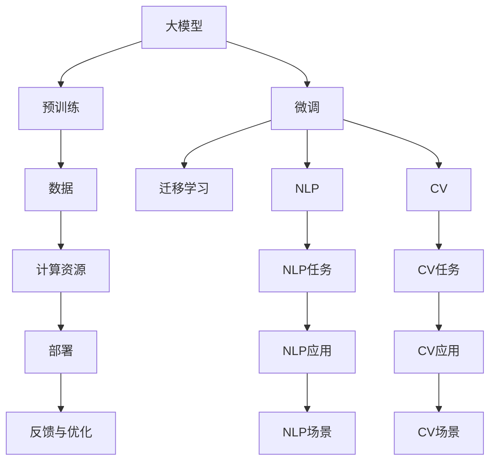

                 

## 1. 背景介绍

随着人工智能技术的飞速发展，大模型在各行各业中的应用愈发广泛。无论是电商推荐、智能客服、金融风控、医疗诊断，还是自动驾驶、工业生产、法律咨询等领域，AI大模型都在通过其强大的计算能力和泛化能力，为实际业务提供深度见解和解决方案。然而，要充分发挥AI大模型的潜力，除了算法和技术本身，还需要关注其如何高效落地，实现商业化运营。本文将重点探讨AI大模型创业过程中如何利用渠道优势，帮助企业更快、更有效地将技术转化为商业价值。

## 2. 核心概念与联系

### 2.1 核心概念概述

#### 2.1.1 大模型
大模型通常指那些使用大量数据和计算资源进行预训练的深度学习模型，如BERT、GPT等。这些模型拥有丰富的知识储备和强大的泛化能力，能够广泛应用于各类NLP和CV任务。

#### 2.1.2 预训练与微调
预训练是在大规模无标签数据上进行的自我监督学习过程，旨在学习通用知识。微调则是在预训练基础上，利用少量有标签数据对模型进行有监督的优化，使其适应特定任务。

#### 2.1.3 迁移学习
迁移学习是指将一个任务学到的知识迁移到另一个相关但不同的任务中，从而提高在新任务上的表现。

#### 2.1.4 深度学习
深度学习是一种基于神经网络的学习范式，通过多层次的非线性变换来提取数据的复杂特征。

#### 2.1.5 自然语言处理（NLP）
NLP是AI领域的一个重要分支，旨在让机器能够理解和处理人类语言。

#### 2.1.6 计算机视觉（CV）
CV是AI的另一大分支，涉及图像识别、视频分析、物体检测等视觉相关任务。

### 2.2 核心概念联系

大模型、预训练、微调、迁移学习、深度学习、NLP和CV等概念，共同构成了AI大模型的技术和应用框架。大模型通过预训练获取通用知识，然后在特定任务上通过微调和迁移学习进一步提升表现。深度学习为模型提供了强大的计算能力，而NLP和CV则分别应用于自然语言和视觉领域，覆盖了语言理解和图像处理等核心任务。

下面，我们将使用Mermaid流程图来展示这些概念之间的联系：



该流程图表明，大模型通过预训练和微调得到知识，然后通过迁移学习将知识应用于特定任务，如NLP和CV任务。最后，模型在具体应用场景下发挥作用。

## 3. 核心算法原理 & 具体操作步骤

### 3.1 算法原理概述

大模型利用大量数据进行预训练，学习到语言或视觉的复杂模式和特征。随后，通过微调过程，将这一知识应用于特定任务，从而提升模型的性能。微调通常包括两个步骤：特征提取和任务适配。

1. **特征提取**：大模型通过预训练学习到通用的语言或视觉特征，能够在不同的任务中提取有用的信息。
2. **任务适配**：针对特定任务，通过微调来调整模型的参数，使得模型能够更好地适应任务的需求。

### 3.2 算法步骤详解

#### 3.2.1 准备数据
1. **收集数据**：确定任务类型和数据源，收集相应领域的数据集。
2. **预处理数据**：清洗、标注和处理数据，使之符合模型要求。

#### 3.2.2 模型选择与加载
1. **选择模型**：根据任务需求选择合适的预训练模型，如BERT、GPT、ResNet等。
2. **加载模型**：使用相应的库加载预训练模型，如TensorFlow、PyTorch等。

#### 3.2.3 定义任务适配层
1. **设计适配层**：根据任务类型设计适配层，如全连接层、卷积层、RNN等。
2. **配置损失函数**：选择合适的损失函数，如交叉熵损失、均方误差等。

#### 3.2.4 微调训练
1. **设置超参数**：如学习率、批大小、迭代次数等。
2. **训练模型**：使用训练数据对模型进行微调训练。
3. **验证与优化**：在验证集上评估模型性能，根据评估结果调整超参数和模型结构。

#### 3.2.5 测试与部署
1. **测试模型**：在测试集上评估模型性能。
2. **部署模型**：将模型部署到生产环境，供实际应用调用。
3. **持续优化**：根据反馈不断优化模型，保持最佳性能。

### 3.3 算法优缺点

#### 3.3.1 优点
1. **高效泛化**：大模型具有强大的泛化能力，能够适应新数据和新任务。
2. **快速部署**：微调过程相对简单，训练周期短，模型可以快速投入使用。
3. **节省成本**：通过微调，可以减少从头训练所需的标注数据和计算资源。

#### 3.3.2 缺点
1. **数据依赖**：微调效果依赖于标注数据的质量和数量，标注成本较高。
2. **过拟合风险**：微调过程中容易发生过拟合，需要特别注意正则化。
3. **计算资源要求高**：预训练和微调需要大量的计算资源，特别是高性能计算设备。

### 3.4 算法应用领域

AI大模型广泛应用于以下几个领域：

#### 3.4.1 自然语言处理（NLP）
- 机器翻译：将一种语言翻译成另一种语言。
- 问答系统：回答用户提出的自然语言问题。
- 情感分析：判断文本的情感倾向。
- 命名实体识别：识别文本中的实体（如人名、地名等）。

#### 3.4.2 计算机视觉（CV）
- 图像分类：将图像分类到不同的类别。
- 目标检测：识别图像中的特定目标。
- 图像生成：生成高质量的图像。
- 图像分割：将图像分割成不同的区域。

#### 3.4.3 智能推荐
- 电商推荐：根据用户的历史行为推荐商品。
- 广告推荐：根据用户的兴趣推荐广告。
- 内容推荐：根据用户的偏好推荐文章、视频等。

#### 3.4.4 医疗健康
- 疾病诊断：通过病历和影像诊断疾病。
- 健康咨询：回答用户的健康相关问题。
- 药物研发：通过药物的化学性质预测其药效。

#### 3.4.5 金融风控
- 信用评估：根据用户的历史行为评估其信用风险。
- 欺诈检测：识别金融交易中的欺诈行为。
- 风险预测：预测金融市场的价格波动。

## 4. 数学模型和公式 & 详细讲解 & 举例说明

### 4.1 数学模型构建

在微调过程中，我们通常使用以下数学模型来表示模型的学习过程：

#### 4.1.1 损失函数
损失函数用于衡量模型预测输出与真实标签之间的差异。常见的损失函数包括交叉熵损失和均方误差损失。

$$
\mathcal{L}(y,\hat{y}) = -\sum_{i=1}^{N}y_i\log\hat{y}_i
$$

其中，$y$ 表示真实标签，$\hat{y}$ 表示模型的预测输出，$N$ 表示样本数。

#### 4.1.2 梯度下降
梯度下降算法通过反向传播计算损失函数对模型参数的梯度，然后更新参数以最小化损失函数。

$$
\theta_{t+1} = \theta_t - \alpha \nabla_{\theta}\mathcal{L}(\theta_t)
$$

其中，$\alpha$ 表示学习率，$\nabla_{\theta}\mathcal{L}(\theta_t)$ 表示损失函数对模型参数的梯度。

### 4.2 公式推导过程

#### 4.2.1 交叉熵损失推导
交叉熵损失函数可以表示为：

$$
\mathcal{L}(y,\hat{y}) = -\sum_{i=1}^{N}y_i\log\hat{y}_i
$$

其中，$y_i$ 表示样本 $i$ 的真实标签，$\hat{y}_i$ 表示模型对样本 $i$ 的预测输出。

根据梯度下降算法的定义，我们可以得到模型参数的更新公式：

$$
\theta_{t+1} = \theta_t - \alpha \frac{1}{N}\sum_{i=1}^{N}\frac{\partial \mathcal{L}(\theta_t)}{\partial \theta_i}
$$

将交叉熵损失函数的导数代入上式，得到：

$$
\theta_{t+1} = \theta_t - \alpha \frac{1}{N}\sum_{i=1}^{N}\frac{\partial (-y_i\log\hat{y}_i)}{\partial \theta_i} = \theta_t - \alpha \frac{1}{N}\sum_{i=1}^{N}\frac{-y_i}{\hat{y}_i}
$$

简化后，得到：

$$
\theta_{t+1} = \theta_t - \alpha \frac{1}{N}\sum_{i=1}^{N}(y_i - \hat{y}_i)
$$

这就是梯度下降算法的更新公式。

### 4.3 案例分析与讲解

#### 4.3.1 案例一：情感分析
假设我们有一个情感分析任务，数据集包含电影评论和其对应的情感标签（积极或消极）。

1. **数据准备**：收集电影评论和对应的情感标签，并对其进行预处理。
2. **模型选择**：选择BERT模型作为预训练模型。
3. **任务适配**：在BERT模型的顶部添加一个全连接层，输出情感分类结果。
4. **微调训练**：在标注数据上使用交叉熵损失进行微调训练。
5. **测试评估**：在测试集上评估模型性能，如准确率和F1分数。

#### 4.3.2 案例二：图像分类
假设我们有一个图像分类任务，数据集包含各类物体的图像和其对应的标签。

1. **数据准备**：收集图像数据并对其进行预处理。
2. **模型选择**：选择ResNet模型作为预训练模型。
3. **任务适配**：在ResNet模型的顶部添加一个全连接层，输出图像分类结果。
4. **微调训练**：在标注数据上使用交叉熵损失进行微调训练。
5. **测试评估**：在测试集上评估模型性能，如准确率和混淆矩阵。

## 5. 项目实践：代码实例和详细解释说明

### 5.1 开发环境搭建

#### 5.1.1 准备环境
1. **安装Python**：在Linux系统下，安装Python 3.7及以上版本。
2. **安装相关库**：安装TensorFlow、Keras、Numpy等深度学习库，可以使用pip命令进行安装。

#### 5.1.2 设置数据集
1. **数据集准备**：收集并准备数据集，可以是一个本地文件夹或者使用公共数据集。
2. **数据预处理**：对数据进行预处理，如数据清洗、归一化等。
3. **数据加载**：使用TensorFlow的DataLoader类对数据进行加载。

### 5.2 源代码详细实现

#### 5.2.1 代码实例
以下是一个基于TensorFlow的情感分析项目的代码实现。

```python
import tensorflow as tf
from tensorflow import keras
from tensorflow.keras.layers import Dense, Flatten, Dropout
from tensorflow.keras.models import Model
from tensorflow.keras.preprocessing.text import Tokenizer
from tensorflow.keras.preprocessing.sequence import pad_sequences

# 定义模型
input_layer = keras.layers.Input(shape=(128,), name='input_layer')
embedding_layer = keras.layers.Embedding(input_dim=10000, output_dim=128, mask_zero=True, name='embedding_layer')(input_layer)
flatten_layer = keras.layers.Flatten()(embedding_layer)
dropout_layer = keras.layers.Dropout(rate=0.5, name='dropout_layer')(flatten_layer)
output_layer = keras.layers.Dense(units=2, activation='softmax', name='output_layer')(dropout_layer)
model = Model(inputs=input_layer, outputs=output_layer)

# 定义损失函数
loss_fn = tf.keras.losses.CategoricalCrossentropy()

# 定义优化器
optimizer = tf.keras.optimizers.Adam()

# 训练模型
model.compile(optimizer=optimizer, loss=loss_fn, metrics=['accuracy'])
model.fit(x_train, y_train, epochs=10, validation_data=(x_val, y_val))
```

#### 5.2.2 代码解释
1. **定义模型**：使用keras定义模型结构，包括输入层、嵌入层、全连接层和输出层。
2. **定义损失函数**：选择交叉熵损失函数。
3. **定义优化器**：选择Adam优化器。
4. **训练模型**：使用fit方法进行模型训练。

### 5.3 代码解读与分析

#### 5.3.1 代码解释
1. **输入层**：定义输入层的形状，这里假设输入的文本长度为128。
2. **嵌入层**：将文本转换为向量表示，使用Embedding层。
3. **全连接层**：将嵌入层的输出连接一个全连接层，进行特征提取。
4. **dropout层**：使用Dropout层进行正则化，防止过拟合。
5. **输出层**：使用softmax层进行分类。
6. **模型编译**：编译模型，指定损失函数和优化器。
7. **模型训练**：使用fit方法进行模型训练，指定训练数据、验证数据、epoch数等参数。

#### 5.3.2 代码分析
1. **模型结构设计**：代码中设计的模型结构包括输入层、嵌入层、全连接层和输出层，是一个典型的神经网络模型。
2. **正则化**：使用Dropout层进行正则化，可以有效防止过拟合。
3. **优化器选择**：选择Adam优化器，适用于大多数深度学习任务。

### 5.4 运行结果展示

#### 5.4.1 训练结果
在训练过程中，可以使用TensorBoard等工具可视化训练过程。

#### 5.4.2 测试结果
在测试集上评估模型性能，如准确率、召回率和F1分数。

## 6. 实际应用场景

### 6.1 智能客服
智能客服系统可以利用大模型进行对话理解和生成。通过微调BERT等模型，可以实现自动问答、情感分析、意图识别等功能，提升客户服务体验。

### 6.2 金融风控
金融风控系统可以利用大模型进行信用评估、欺诈检测、风险预测等。通过微调模型，可以提升风险管理效率和精准度。

### 6.3 医疗健康
医疗健康系统可以利用大模型进行疾病诊断、健康咨询、药物研发等。通过微调模型，可以提升医疗服务的智能化水平。

### 6.4 智能推荐
智能推荐系统可以利用大模型进行用户画像分析、行为预测、推荐算法优化等。通过微调模型，可以提升推荐效果和用户满意度。

## 7. 工具和资源推荐

### 7.1 学习资源推荐

#### 7.1.1 TensorFlow官方文档
TensorFlow是深度学习领域的重要工具，官方文档详细介绍了TensorFlow的各种功能和用法。

#### 7.1.2 PyTorch官方文档
PyTorch是另一款流行的深度学习框架，官方文档提供了丰富的教程和示例。

#### 7.1.3 Keras官方文档
Keras是一个高级深度学习API，提供了简单易用的接口，适合初学者使用。

### 7.2 开发工具推荐

#### 7.2.1 Jupyter Notebook
Jupyter Notebook是一个交互式编程环境，适合进行数据分析和模型训练。

#### 7.2.2 TensorBoard
TensorBoard是TensorFlow的可视化工具，可以实时监测模型训练过程。

#### 7.2.3 Keras Tuner
Keras Tuner是Keras的超参数优化工具，可以自动搜索最优的超参数组合。

### 7.3 相关论文推荐

#### 7.3.1 《Transformers: A New Architecture for Structuring Machine Learning Algorithms》
这篇文章介绍了Transformer模型的结构，是深度学习领域的重要论文。

#### 7.3.2 《Attention Is All You Need》
这篇文章提出了Transformer模型，开启了NLP领域的大模型预训练时代。

#### 7.3.3 《BERT: Pre-training of Deep Bidirectional Transformers for Language Understanding》
这篇文章介绍了BERT模型，是NLP领域的大模型预训练里程碑。

## 8. 总结：未来发展趋势与挑战

### 8.1 未来发展趋势

#### 8.1.1 大模型规模化
大模型规模将进一步增大，预训练模型参数量将达到数十亿甚至数百亿级别，具有更强的泛化能力和知识储备。

#### 8.1.2 微调技术优化
微调技术将不断优化，参数高效微调、少样本学习等方法将得到更广泛的应用，提高模型效率和性能。

#### 8.1.3 多模态学习
多模态学习将成为未来发展方向，将文本、图像、语音等多种信息融合，提升模型表现。

#### 8.1.4 可解释性增强
模型的可解释性将得到加强，通过因果分析、知识图谱等方法，提高模型的透明性和可信度。

### 8.2 面临的挑战

#### 8.2.1 数据隐私和安全
随着模型应用范围的扩大，数据隐私和安全问题日益突出，需要加强数据保护和隐私控制。

#### 8.2.2 模型偏见和公平性
大模型可能存在偏见，需要采用公平性算法和伦理约束，确保模型公平性。

#### 8.2.3 模型复杂性和可维护性
大模型的复杂性增加，需要建立有效的模型管理和维护机制。

#### 8.2.4 计算资源成本
大模型的计算资源需求高，需要优化模型架构和训练流程，降低成本。

### 8.3 研究展望

#### 8.3.1 深度融合
大模型将与其他技术深度融合，如知识图谱、因果推理、强化学习等，拓展应用范围。

#### 8.3.2 跨领域应用
大模型将在更多领域得到应用，如智慧医疗、智能制造、智能交通等，提升行业效率和竞争力。

#### 8.3.3 算法创新
新的算法和技术将不断涌现，如深度强化学习、自监督学习等，推动大模型的演进和优化。

## 9. 附录：常见问题与解答

### 9.1 问题1：大模型如何高效落地？

答：大模型可以借助微调技术高效落地。通过在特定任务上进行微调，可以在较少的标注数据和计算资源下获得良好的性能。同时，可以利用迁移学习、多模态学习等技术，提升模型性能和泛化能力。

### 9.2 问题2：如何设计任务适配层？

答：任务适配层需要根据具体任务类型进行设计，如分类任务可以使用全连接层，生成任务可以使用解码器等。同时，需要设计合适的损失函数和优化器，确保模型能够适应特定任务。

### 9.3 问题3：微调过程中如何避免过拟合？

答：可以采用正则化、数据增强、对抗训练等方法，防止模型过拟合。同时，可以设计更复杂的模型结构，如使用卷积层、RNN等，提高模型的泛化能力。

### 9.4 问题4：如何评估微调模型的性能？

答：可以使用交叉验证、混淆矩阵、F1分数等指标评估微调模型的性能。同时，可以使用A/B测试等方法进行实际应用效果的评估。

### 9.5 问题5：大模型在医疗领域的应用有哪些？

答：大模型在医疗领域可以用于疾病诊断、健康咨询、药物研发等。通过微调，可以提升医疗服务的智能化水平和效率。

### 9.6 问题6：大模型在金融领域的应用有哪些？

答：大模型在金融领域可以用于信用评估、欺诈检测、风险预测等。通过微调，可以提升金融风险管理效率和精准度。

### 9.7 问题7：大模型在电商推荐中的应用有哪些？

答：大模型在电商推荐中可以用于用户画像分析、行为预测、推荐算法优化等。通过微调，可以提升推荐效果和用户满意度。

---

作者：禅与计算机程序设计艺术 / Zen and the Art of Computer Programming

