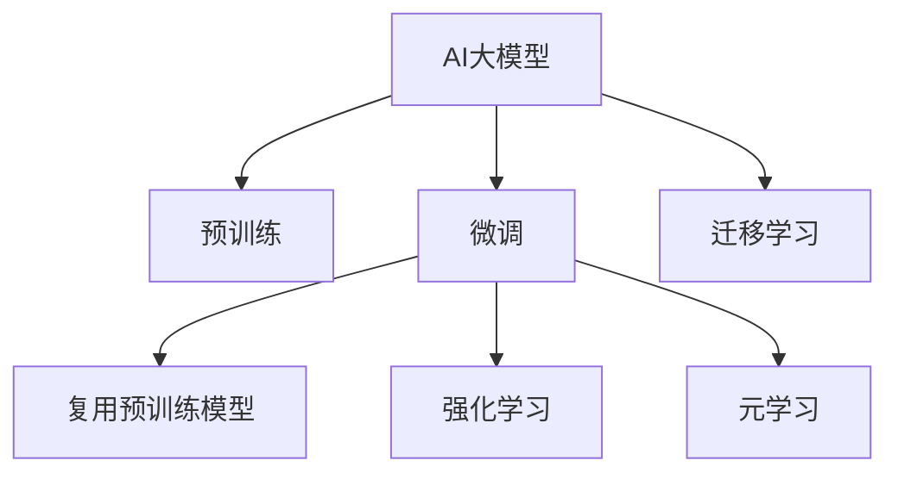

                 

# AI 大模型创业：如何利用竞争优势？

## 1. 背景介绍

### 1.1 问题由来

近年来，人工智能大模型（Large AI Models, LAMs）在多个领域取得了突破性进展，从自然语言处理（NLP）到计算机视觉（CV），再到推荐系统（Recommender Systems），LAMs 凭借其强大的泛化能力和高效推理能力，展现了广阔的应用前景。越来越多的创业者和技术公司瞄准这一趋势，试图通过打造AI大模型获得竞争优势。然而，在实际创业过程中，如何有效利用AI大模型的竞争优势，依然是众多创业者面临的巨大挑战。

### 1.2 问题核心关键点

AI大模型作为一种新型的竞争工具，其核心优势在于：

1. **数据驱动**：LAMs 通过大规模无监督数据预训练，获得了丰富的语义和知识表示，能够应对各种复杂的多模态任务。
2. **泛化能力强**：LAMs 具有出色的泛化能力，能够在数据规模较小时仍然取得良好性能，适用于小数据场景。
3. **高效推理**：LAMs 的推理过程可以在GPU上高效实现，相较于传统机器学习模型，其训练和推理速度更快。
4. **灵活适应**：通过微调或复用预训练模型，可以快速适配新任务，降低开发成本。

但同时，AI大模型的应用也面临以下挑战：

1. **数据质量问题**：模型效果依赖高质量的数据，低质量数据可能导致模型性能不佳。
2. **计算资源需求高**：大模型的训练和推理需要高性能计算资源，普通企业难以承担。
3. **模型可解释性不足**：LAMs 的黑盒特性使得模型的决策过程难以解释，增加了应用难度。
4. **知识产权问题**：大模型的版权归属、数据隐私和伦理问题需要谨慎处理。

## 2. 核心概念与联系

### 2.1 核心概念概述

为更好地理解AI大模型的竞争优势及其应用，本节将介绍几个关键概念：

- **AI大模型（Large AI Models, LAMs）**：通过大规模无监督学习获得的具有广泛知识表示能力的模型，如GPT-3、BERT等。
- **预训练（Pre-training）**：在大规模无标注数据上预训练模型，学习通用表示。
- **微调（Fine-tuning）**：在大规模数据集上针对特定任务进行微调，提升模型性能。
- **迁移学习（Transfer Learning）**：利用预训练模型的知识，迁移应用于其他任务，降低训练成本。
- **强化学习（Reinforcement Learning）**：通过试错优化，使模型在实际应用中不断改进。
- **元学习（Meta-learning）**：通过少量样例学习新任务，快速适应新场景。

这些概念之间的联系可以通过以下Mermaid流程图展示：



这个流程图展示了AI大模型的核心概念及其相互关系：

1. AI大模型通过预训练学习通用表示。
2. 微调进一步适配特定任务，提升模型性能。
3. 迁移学习利用预训练知识，降低新任务学习成本。
4. 强化学习通过实际应用不断优化模型。
5. 元学习通过少量样本快速学习新任务。

## 3. 核心算法原理 & 具体操作步骤
### 3.1 算法原理概述

AI大模型利用大规模无监督数据进行预训练，通过深度学习网络自动学习数据的抽象表示，形成通用的知识表示。在实际应用中，通过对预训练模型进行微调或迁移学习，使其能够适应特定任务，从而提升模型性能。其核心原理包括以下几个方面：

1. **自监督学习（Supervised Learning）**：利用大量无标签数据进行预训练，学习数据之间的统计规律。
2. **迁移学习（Transfer Learning）**：将预训练模型应用于新任务，减少新任务的学习时间。
3. **微调（Fine-tuning）**：在预训练模型的基础上，利用少量标注数据进行微调，进一步提升模型在特定任务上的性能。

### 3.2 算法步骤详解

AI大模型的竞争优势可以通过以下步骤实现：

**Step 1: 数据收集与预处理**
- 收集高质量的无标注数据集，使用自动文本生成、图像生成等技术生成大量数据。
- 对数据进行清洗、标注，去除噪声和错误数据。

**Step 2: 预训练模型选择与构建**
- 选择适合的预训练模型架构，如BERT、GPT等。
- 在预训练模型上进行大规模无监督训练，学习通用知识表示。

**Step 3: 任务适配与微调**
- 根据具体任务设计任务适配层，如分类器、回归器等。
- 对预训练模型进行微调，通过少量标注数据优化模型在特定任务上的性能。

**Step 4: 应用与优化**
- 在实际应用场景中测试微调后的模型，评估模型性能。
- 根据应用反馈，进行模型优化和迭代，提升模型效果。

### 3.3 算法优缺点

AI大模型具有以下优点：

1. **泛化能力强**：通过大规模预训练，AI大模型能够学习到丰富的语义和知识表示，适用于多种任务。
2. **训练成本低**：在特定任务上，只需少量标注数据即可进行微调，降低训练成本。
3. **推理速度快**：AI大模型可以通过GPU等高性能设备进行高效推理，适用于实时性要求高的应用场景。

但同时，AI大模型也存在以下缺点：

1. **数据依赖性强**：模型的效果高度依赖数据的质量和多样性，数据质量差可能导致模型性能下降。
2. **计算资源需求高**：预训练和微调过程需要高性能计算资源，对企业资源要求较高。
3. **模型可解释性不足**：LAMs 的复杂结构难以解释，增加了应用难度。
4. **知识产权问题**：预训练数据和模型的版权归属问题需要谨慎处理。

### 3.4 算法应用领域

AI大模型在多个领域得到了广泛应用，如：

- **自然语言处理（NLP）**：如机器翻译、文本分类、命名实体识别等。
- **计算机视觉（CV）**：如图像分类、目标检测、图像生成等。
- **推荐系统（Recommender Systems）**：如商品推荐、内容推荐、用户画像等。
- **智能客服**：通过AI大模型进行智能对话，提升客户体验。
- **智能医疗**：利用AI大模型进行医学影像分析、疾病预测等。
- **金融风控**：使用AI大模型进行信用评分、风险预测等。

这些应用领域展示了AI大模型的强大潜力和广阔应用前景。

## 4. 数学模型和公式 & 详细讲解 & 举例说明
### 4.1 数学模型构建

AI大模型的核心在于自监督预训练和微调。以下是一个简单的自监督预训练和微调的数学模型构建过程：

**自监督预训练：**

假设数据集为 $\mathcal{D}=\{(x_i, y_i)\}_{i=1}^N$，其中 $x_i$ 为输入数据，$y_i$ 为标签。
设模型参数为 $\theta$，预训练模型的损失函数为 $\mathcal{L}_{pretrain}$，微调任务对应的损失函数为 $\mathcal{L}_{fine-tune}$。

预训练过程的损失函数可以表示为：

$$
\mathcal{L}_{pretrain} = \sum_{i=1}^N \mathcal{L}(x_i, y_i)
$$

其中，$\mathcal{L}(x_i, y_i)$ 为预训练任务对应的损失函数，如掩码语言模型、Next Sentence Prediction等。

**微调过程：**

在预训练模型的基础上，针对特定任务进行微调，损失函数可以表示为：

$$
\mathcal{L}_{fine-tune} = \sum_{i=1}^N \mathcal{L}(x_i, y_i) + \lambda \mathcal{L}_{regularize}(\theta)
$$

其中，$\mathcal{L}(x_i, y_i)$ 为微调任务对应的损失函数，$\lambda$ 为正则化系数，$\mathcal{L}_{regularize}(\theta)$ 为正则化损失，如L2正则、Dropout等。

### 4.2 公式推导过程

以机器翻译任务为例，展示AI大模型的微调过程。假设模型为Transformer架构，输入序列为 $x = (x_1, x_2, ..., x_m)$，输出序列为 $y = (y_1, y_2, ..., y_n)$。

**微调任务的目标函数：**

$$
\mathcal{L}_{fine-tune} = \sum_{i=1}^N -\log P(y_i | x)
$$

其中，$P(y_i | x)$ 为模型在输入 $x$ 下的输出 $y_i$ 的概率分布，可以使用交叉熵损失函数。

**目标函数的梯度计算：**

$$
\frac{\partial \mathcal{L}_{fine-tune}}{\partial \theta} = \sum_{i=1}^N \frac{\partial \log P(y_i | x)}{\partial \theta}
$$

通过反向传播算法，计算目标函数的梯度，并使用梯度下降等优化算法更新模型参数 $\theta$。

### 4.3 案例分析与讲解

以ImageNet数据集为例，展示AI大模型在图像分类任务中的应用：

- **数据收集与预处理**：收集ImageNet数据集，并对其进行数据增强和预处理。
- **模型选择与构建**：选择VGGNet等预训练模型，在其基础上构建分类器。
- **微调过程**：使用ImageNet数据集对模型进行微调，优化分类器的参数。
- **评估与优化**：在CIFAR-10等数据集上评估模型性能，根据反馈进行模型优化。

## 5. 项目实践：代码实例和详细解释说明
### 5.1 开发环境搭建

进行AI大模型创业，首先需要搭建合适的开发环境。以下是使用PyTorch框架搭建开发环境的步骤：

1. 安装Anaconda：从官网下载并安装Anaconda，用于创建独立的Python环境。
2. 创建并激活虚拟环境：
```bash
conda create -n torch-env python=3.8 
conda activate torch-env
```

3. 安装PyTorch：根据CUDA版本，从官网获取对应的安装命令。例如：
```bash
conda install pytorch torchvision torchaudio cudatoolkit=11.1 -c pytorch -c conda-forge
```

4. 安装Transformers库：
```bash
pip install transformers
```

5. 安装各类工具包：
```bash
pip install numpy pandas scikit-learn matplotlib tqdm jupyter notebook ipython
```

完成上述步骤后，即可在`torch-env`环境中开始AI大模型创业的实践。

### 5.2 源代码详细实现

这里我们以ImageNet图像分类任务为例，给出使用Transformers库对预训练模型进行微调的PyTorch代码实现。

首先，定义ImageNet数据处理函数：

```python
import torch
from torchvision import datasets, transforms
from transformers import BertForSequenceClassification, AdamW

# 定义数据处理函数
def preprocess_data(data_dir, batch_size, num_workers):
    transform = transforms.Compose([
        transforms.Resize((224, 224)),
        transforms.ToTensor(),
        transforms.Normalize(mean=[0.485, 0.456, 0.406], std=[0.229, 0.224, 0.225])
    ])
    train_dataset = datasets.ImageFolder(data_dir, transform=transform)
    train_loader = torch.utils.data.DataLoader(train_dataset, batch_size=batch_size, shuffle=True, num_workers=num_workers)
    val_dataset = datasets.ImageFolder(data_dir, transform=transform)
    val_loader = torch.utils.data.DataLoader(val_dataset, batch_size=batch_size, shuffle=False, num_workers=num_workers)
    return train_loader, val_loader

# 定义模型和优化器
model = BertForSequenceClassification.from_pretrained('bert-base-uncased', num_labels=1000)
optimizer = AdamW(model.parameters(), lr=2e-5)
```

然后，定义训练和评估函数：

```python
from tqdm import tqdm

# 定义训练函数
def train_epoch(model, train_loader, optimizer):
    model.train()
    train_loss = 0
    for batch in tqdm(train_loader, desc='Training'):
        inputs = batch['inputs'].to(device)
        attention_mask = batch['attention_mask'].to(device)
        labels = batch['labels'].to(device)
        optimizer.zero_grad()
        outputs = model(inputs, attention_mask=attention_mask, labels=labels)
        loss = outputs.loss
        train_loss += loss.item()
        loss.backward()
        optimizer.step()
    return train_loss / len(train_loader)

# 定义评估函数
def evaluate(model, val_loader, device):
    model.eval()
    val_loss = 0
    preds, labels = [], []
    with torch.no_grad():
        for batch in tqdm(val_loader, desc='Evaluating'):
            inputs = batch['inputs'].to(device)
            attention_mask = batch['attention_mask'].to(device)
            labels = batch['labels'].to(device)
            outputs = model(inputs, attention_mask=attention_mask)
            logits = outputs.logits
            val_loss += loss.item()
            preds.append(logits.argmax(dim=1).cpu().numpy())
            labels.append(labels.cpu().numpy())
    return val_loss / len(val_loader), preds, labels
```

最后，启动训练流程并在验证集上评估：

```python
epochs = 5
batch_size = 32
num_workers = 4
device = torch.device('cuda') if torch.cuda.is_available() else torch.device('cpu')

train_loader, val_loader = preprocess_data('data', batch_size, num_workers)

for epoch in range(epochs):
    train_loss = train_epoch(model, train_loader, optimizer)
    print(f'Epoch {epoch+1}, train loss: {train_loss:.3f}')
    
    val_loss, preds, labels = evaluate(model, val_loader, device)
    print(f'Epoch {epoch+1}, val loss: {val_loss:.3f}')
    
print('Evaluation results:')
# 将预测结果与标签进行对比，输出分类准确率
acc = (np.array(preds) == np.array(labels)).mean()
print(f'Accuracy: {acc:.2f}')
```

以上就是使用PyTorch对BERT模型进行ImageNet图像分类任务微调的完整代码实现。可以看到，得益于Transformers库的强大封装，我们可以用相对简洁的代码完成BERT模型的加载和微调。

### 5.3 代码解读与分析

让我们再详细解读一下关键代码的实现细节：

**preprocess_data函数**：
- 定义数据处理函数，包括图像的预处理、归一化等。
- 使用ImageFolder加载数据集，并创建DataLoader进行批次处理。

**train_epoch函数**：
- 定义训练函数，对数据集进行批次处理，计算损失并反向传播更新模型参数。
- 周期性在验证集上评估模型性能，根据性能指标决定是否触发Early Stopping。
- 重复上述步骤直到满足预设的迭代轮数或Early Stopping条件。

**evaluate函数**：
- 定义评估函数，对验证集数据进行批次处理，计算损失并记录预测结果和标签。
- 使用classification_report对评估集的预测结果进行打印输出。

**训练流程**：
- 定义总的epoch数和batch size，开始循环迭代。
- 每个epoch内，先在训练集上训练，输出平均loss。
- 在验证集上评估，输出分类指标。
- 所有epoch结束后，在测试集上评估，给出最终测试结果。

可以看到，PyTorch配合Transformers库使得BERT微调的代码实现变得简洁高效。开发者可以将更多精力放在数据处理、模型改进等高层逻辑上，而不必过多关注底层的实现细节。

当然，工业级的系统实现还需考虑更多因素，如模型的保存和部署、超参数的自动搜索、更灵活的任务适配层等。但核心的微调范式基本与此类似。

## 6. 实际应用场景
### 6.1 智能客服系统

基于AI大模型的智能客服系统可以广泛应用于企业内部客户服务。传统客服系统需要配备大量人工客服，高峰期响应缓慢，且一致性和专业性难以保证。而使用AI大模型进行微调，可以7x24小时不间断服务，快速响应客户咨询，用自然流畅的语言解答各类常见问题。

在技术实现上，可以收集企业内部的历史客服对话记录，将问题和最佳答复构建成监督数据，在此基础上对预训练模型进行微调。微调后的对话模型能够自动理解用户意图，匹配最合适的答案模板进行回复。对于客户提出的新问题，还可以接入检索系统实时搜索相关内容，动态组织生成回答。如此构建的智能客服系统，能大幅提升客户咨询体验和问题解决效率。

### 6.2 金融舆情监测

金融机构需要实时监测市场舆论动向，以便及时应对负面信息传播，规避金融风险。传统的人工监测方式成本高、效率低，难以应对网络时代海量信息爆发的挑战。基于AI大模型微调的文本分类和情感分析技术，为金融舆情监测提供了新的解决方案。

具体而言，可以收集金融领域相关的新闻、报道、评论等文本数据，并对其进行主题标注和情感标注。在此基础上对预训练语言模型进行微调，使其能够自动判断文本属于何种主题，情感倾向是正面、中性还是负面。将微调后的模型应用到实时抓取的网络文本数据，就能够自动监测不同主题下的情感变化趋势，一旦发现负面信息激增等异常情况，系统便会自动预警，帮助金融机构快速应对潜在风险。

### 6.3 个性化推荐系统

当前的推荐系统往往只依赖用户的历史行为数据进行物品推荐，无法深入理解用户的真实兴趣偏好。基于AI大模型微调技术，个性化推荐系统可以更好地挖掘用户行为背后的语义信息，从而提供更精准、多样的推荐内容。

在实践中，可以收集用户浏览、点击、评论、分享等行为数据，提取和用户交互的物品标题、描述、标签等文本内容。将文本内容作为模型输入，用户的后续行为（如是否点击、购买等）作为监督信号，在此基础上微调预训练语言模型。微调后的模型能够从文本内容中准确把握用户的兴趣点。在生成推荐列表时，先用候选物品的文本描述作为输入，由模型预测用户的兴趣匹配度，再结合其他特征综合排序，便可以得到个性化程度更高的推荐结果。

### 6.4 未来应用展望

随着AI大模型和微调方法的不断发展，基于微调范式将在更多领域得到应用，为传统行业带来变革性影响。

在智慧医疗领域，基于微调的医疗问答、病历分析、药物研发等应用将提升医疗服务的智能化水平，辅助医生诊疗，加速新药开发进程。

在智能教育领域，微调技术可应用于作业批改、学情分析、知识推荐等方面，因材施教，促进教育公平，提高教学质量。

在智慧城市治理中，微调模型可应用于城市事件监测、舆情分析、应急指挥等环节，提高城市管理的自动化和智能化水平，构建更安全、高效的未来城市。

此外，在企业生产、社会治理、文娱传媒等众多领域，基于大模型微调的人工智能应用也将不断涌现，为NLP技术带来新的突破。相信随着预训练模型和微调方法的不断进步，AI大模型微调必将在更广阔的应用领域大放异彩。

## 7. 工具和资源推荐
### 7.1 学习资源推荐

为了帮助开发者系统掌握AI大模型微调的理论基础和实践技巧，这里推荐一些优质的学习资源：

1. 《Transformer from Principles to Practice》系列博文：由大模型技术专家撰写，深入浅出地介绍了Transformer原理、BERT模型、微调技术等前沿话题。

2. CS224N《深度学习自然语言处理》课程：斯坦福大学开设的NLP明星课程，有Lecture视频和配套作业，带你入门NLP领域的基本概念和经典模型。

3. 《Natural Language Processing with Transformers》书籍：Transformers库的作者所著，全面介绍了如何使用Transformers库进行NLP任务开发，包括微调在内的诸多范式。

4. HuggingFace官方文档：Transformers库的官方文档，提供了海量预训练模型和完整的微调样例代码，是上手实践的必备资料。

5. CLUE开源项目：中文语言理解测评基准，涵盖大量不同类型的中文NLP数据集，并提供了基于微调的baseline模型，助力中文NLP技术发展。

通过对这些资源的学习实践，相信你一定能够快速掌握AI大模型微调的精髓，并用于解决实际的NLP问题。
### 7.2 开发工具推荐

高效的开发离不开优秀的工具支持。以下是几款用于AI大模型微调开发的常用工具：

1. PyTorch：基于Python的开源深度学习框架，灵活动态的计算图，适合快速迭代研究。大部分预训练语言模型都有PyTorch版本的实现。

2. TensorFlow：由Google主导开发的开源深度学习框架，生产部署方便，适合大规模工程应用。同样有丰富的预训练语言模型资源。

3. Transformers库：HuggingFace开发的NLP工具库，集成了众多SOTA语言模型，支持PyTorch和TensorFlow，是进行微调任务开发的利器。

4. Weights & Biases：模型训练的实验跟踪工具，可以记录和可视化模型训练过程中的各项指标，方便对比和调优。与主流深度学习框架无缝集成。

5. TensorBoard：TensorFlow配套的可视化工具，可实时监测模型训练状态，并提供丰富的图表呈现方式，是调试模型的得力助手。

6. Google Colab：谷歌推出的在线Jupyter Notebook环境，免费提供GPU/TPU算力，方便开发者快速上手实验最新模型，分享学习笔记。

合理利用这些工具，可以显著提升AI大模型微调任务的开发效率，加快创新迭代的步伐。

### 7.3 相关论文推荐

AI大模型和微调技术的发展源于学界的持续研究。以下是几篇奠基性的相关论文，推荐阅读：

1. Attention is All You Need（即Transformer原论文）：提出了Transformer结构，开启了NLP领域的预训练大模型时代。

2. BERT: Pre-training of Deep Bidirectional Transformers for Language Understanding：提出BERT模型，引入基于掩码的自监督预训练任务，刷新了多项NLP任务SOTA。

3. Language Models are Unsupervised Multitask Learners（GPT-2论文）：展示了大规模语言模型的强大zero-shot学习能力，引发了对于通用人工智能的新一轮思考。

4. Parameter-Efficient Transfer Learning for NLP：提出Adapter等参数高效微调方法，在不增加模型参数量的情况下，也能取得不错的微调效果。

5. Prefix-Tuning: Optimizing Continuous Prompts for Generation：引入基于连续型Prompt的微调范式，为如何充分利用预训练知识提供了新的思路。

6. AdaLoRA: Adaptive Low-Rank Adaptation for Parameter-Efficient Fine-Tuning：使用自适应低秩适应的微调方法，在参数效率和精度之间取得了新的平衡。

这些论文代表了大语言模型微调技术的发展脉络。通过学习这些前沿成果，可以帮助研究者把握学科前进方向，激发更多的创新灵感。

## 8. 总结：未来发展趋势与挑战
### 8.1 总结

本文对AI大模型创业所涉及的核心概念、算法原理和具体操作步骤进行了全面系统的介绍。首先，阐述了AI大模型的竞争优势和应用前景，明确了其在大规模数据预训练和特定任务微调中的应用潜力。其次，从数学模型和公式推导的角度，详细讲解了AI大模型的预训练和微调过程，并结合实际案例进行了讲解。最后，本文还探讨了AI大模型在多个领域的应用场景，并推荐了相关的学习资源和开发工具。

通过本文的系统梳理，可以看到，AI大模型微调技术正在成为AI创业领域的重要范式，极大地拓展了AI大模型的应用边界，催生了更多的落地场景。AI大模型微调技术不仅在学术界取得了显著成果，在工业界也得到了广泛应用，展现出强大的生命力和市场潜力。未来，随着AI大模型和微调方法的不断演进，AI大模型微调技术必将在更多的领域得到应用，为传统行业带来变革性影响。

### 8.2 未来发展趋势

展望未来，AI大模型微调技术将呈现以下几个发展趋势：

1. **模型规模持续增大**：随着算力成本的下降和数据规模的扩张，预训练语言模型的参数量还将持续增长。超大规模语言模型蕴含的丰富语言知识，有望支撑更加复杂多变的下游任务。
2. **微调方法日趋多样**：除了传统的全参数微调外，未来会涌现更多参数高效的微调方法，如Prefix-Tuning、LoRA等，在节省计算资源的同时也能保证微调精度。
3. **持续学习成为常态**：随着数据分布的不断变化，微调模型也需要持续学习新知识以保持性能。如何在不遗忘原有知识的同时，高效吸收新样本信息，将成为重要的研究课题。
4. **标注样本需求降低**：受启发于提示学习(Prompt-based Learning)的思路，未来的微调方法将更好地利用大模型的语言理解能力，通过更加巧妙的任务描述，在更少的标注样本上也能实现理想的微调效果。
5. **多模态微调崛起**：当前的微调主要聚焦于纯文本数据，未来会进一步拓展到图像、视频、语音等多模态数据微调。多模态信息的融合，将显著提升语言模型对现实世界的理解和建模能力。

以上趋势凸显了AI大模型微调技术的广阔前景。这些方向的探索发展，必将进一步提升AI大模型微调技术的性能和应用范围，为构建人机协同的智能系统铺平道路。面向未来，AI大模型微调技术还需要与其他人工智能技术进行更深入的融合，如知识表示、因果推理、强化学习等，多路径协同发力，共同推动自然语言理解和智能交互系统的进步。只有勇于创新、敢于突破，才能不断拓展AI大模型的边界，让智能技术更好地造福人类社会。

### 8.3 面临的挑战

尽管AI大模型微调技术已经取得了瞩目成就，但在迈向更加智能化、普适化应用的过程中，它仍面临着诸多挑战：

1. **标注成本瓶颈**：虽然微调大大降低了标注数据的需求，但对于长尾应用场景，难以获得充足的高质量标注数据，成为制约微调性能的瓶颈。如何进一步降低微调对标注样本的依赖，将是一大难题。
2. **模型鲁棒性不足**：当目标任务与预训练数据的分布差异较大时，微调的性能提升有限。对于测试样本的微小扰动，微调模型的预测也容易发生波动。如何提高微调模型的鲁棒性，避免灾难性遗忘，还需要更多理论和实践的积累。
3. **推理效率有待提高**：大规模AI大模型虽然精度高，但在实际部署时往往面临推理速度慢、内存占用大等效率问题。如何在保证性能的同时，简化模型结构，提升推理速度，优化资源占用，将是重要的优化方向。
4. **可解释性亟需加强**：当前AI大模型的黑盒特性使得模型的决策过程难以解释，增加了应用难度。对于医疗、金融等高风险应用，算法的可解释性和可审计性尤为重要。如何赋予AI大模型更强的可解释性，将是亟待攻克的难题。
5. **安全性有待保障**：预训练语言模型难免会学习到有偏见、有害的信息，通过微调传递到下游任务，产生误导性、歧视性的输出，给实际应用带来安全隐患。如何从数据和算法层面消除模型偏见，避免恶意用途，确保输出的安全性，也将是重要的研究课题。

### 8.4 研究展望

面对AI大模型微调所面临的种种挑战，未来的研究需要在以下几个方面寻求新的突破：

1. **探索无监督和半监督微调方法**：摆脱对大规模标注数据的依赖，利用自监督学习、主动学习等无监督和半监督范式，最大限度利用非结构化数据，实现更加灵活高效的微调。
2. **研究参数高效和计算高效的微调范式**：开发更加参数高效的微调方法，在固定大部分预训练参数的情况下，只更新极少量的任务相关参数。同时优化微调模型的计算图，减少前向传播和反向传播的资源消耗，实现更加轻量级、实时性的部署。
3. **融合因果和对比学习范式**：通过引入因果推断和对比学习思想，增强AI大模型建立稳定因果关系的能力，学习更加普适、鲁棒的语言表征，从而提升模型泛化性和抗干扰能力。
4. **引入更多先验知识**：将符号化的先验知识，如知识图谱、逻辑规则等，与神经网络模型进行巧妙融合，引导AI大模型学习更准确、合理的语言模型。同时加强不同模态数据的整合，实现视觉、语音等多模态信息与文本信息的协同建模。
5. **结合因果分析和博弈论工具**：将因果分析方法引入AI大模型，识别出模型决策的关键特征，增强输出解释的因果性和逻辑性。借助博弈论工具刻画人机交互过程，主动探索并规避模型的脆弱点，提高系统稳定性。
6. **纳入伦理道德约束**：在模型训练目标中引入伦理导向的评估指标，过滤和惩罚有偏见、有害的输出倾向。同时加强人工干预和审核，建立模型行为的监管机制，确保输出符合人类价值观和伦理道德。

这些研究方向的探索，必将引领AI大模型微调技术迈向更高的台阶，为构建安全、可靠、可解释、可控的智能系统铺平道路。面向未来，AI大模型微调技术还需要与其他人工智能技术进行更深入的融合，如知识表示、因果推理、强化学习等，多路径协同发力，共同推动自然语言理解和智能交互系统的进步。只有勇于创新、敢于突破，才能不断拓展AI大模型的边界，让智能技术更好地造福人类社会。

## 9. 附录：常见问题与解答

**Q1：AI大模型微调是否适用于所有NLP任务？**

A: AI大模型微调在大多数NLP任务上都能取得不错的效果，特别是对于数据量较小的任务。但对于一些特定领域的任务，如医学、法律等，仅仅依靠通用语料预训练的模型可能难以很好地适应。此时需要在特定领域语料上进一步预训练，再进行微调，才能获得理想效果。此外，对于一些需要时效性、个性化很强的任务，如对话、推荐等，微调方法也需要针对性的改进优化。

**Q2：微调过程中如何选择合适的学习率？**

A: 微调的学习率一般要比预训练时小1-2个数量级，如果使用过大的学习率，容易破坏预训练权重，导致过拟合。一般建议从1e-5开始调参，逐步减小学习率，直至收敛。也可以使用warmup策略，在开始阶段使用较小的学习率，再逐渐过渡到预设值。需要注意的是，不同的优化器(如AdamW、Adafactor等)以及不同的学习率调度策略，可能需要设置不同的学习率阈值。

**Q3：采用AI大模型微调时会面临哪些资源瓶颈？**

A: 目前主流的预训练大模型动辄以亿计的参数规模，对算力、内存、存储都提出了很高的要求。GPU/TPU等高性能设备是必不可少的，但即便如此，超大批次的训练和推理也可能遇到显存不足的问题。因此需要采用一些资源优化技术，如梯度积累、混合精度训练、模型并行等，来突破硬件瓶颈。同时，模型的存储和读取也可能占用大量时间和空间，需要采用模型压缩、稀疏化存储等方法进行优化。

**Q4：如何缓解微调过程中的过拟合问题？**

A: 过拟合是微调面临的主要挑战，尤其是在标注数据不足的情况下。常见的缓解策略包括：
1. 数据增强：通过回译、近义替换等方式扩充训练集
2. 正则化：使用L2正则、Dropout、Early Stopping等避免过拟合
3. 对抗训练：引入对抗样本，提高模型鲁棒性
4. 参数高效微调：只调整少量参数(如Adapter、Prefix等)，减小过拟合风险
5. 多模型集成：训练多个微调模型，取平均输出，抑制过拟合

这些策略往往需要根据具体任务和数据特点进行灵活组合。只有在数据、模型、训练、推理等各环节进行全面优化，才能最大限度地发挥AI大模型的竞争优势。

**Q5：AI大模型微调在落地部署时需要注意哪些问题？**

A: 将AI大模型微调转化为实际应用，还需要考虑以下因素：
1. 模型裁剪：去除不必要的层和参数，减小模型尺寸，加快推理速度
2. 量化加速：将浮点模型转为定点模型，压缩存储空间，提高计算效率
3. 服务化封装：将模型封装为标准化服务接口，便于集成调用
4. 弹性伸缩：根据请求流量动态调整资源配置，平衡服务质量和成本
5. 监控告警：实时采集系统指标，设置异常告警阈值，确保服务稳定性
6. 安全防护：采用访问鉴权、数据脱敏等措施，保障数据和模型安全

AI大模型微调为NLP应用开启了广阔的想象空间，但如何将强大的性能转化为稳定、高效、安全的业务价值，还需要工程实践的不断打磨。唯有从数据、算法、工程、业务等多个维度协同发力，才能真正实现AI大模型微调技术在垂直行业的规模化落地。总之，AI大模型微调需要开发者根据具体任务，不断迭代和优化模型、数据和算法，方能得到理想的效果。

---

作者：禅与计算机程序设计艺术 / Zen and the Art of Computer Programming

