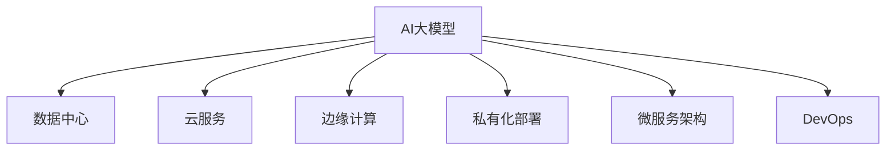

                 

## 1. 背景介绍

### 1.1 问题由来

随着人工智能技术的飞速发展，大模型在商业领域的应用越来越广泛，从自然语言处理、计算机视觉到推荐系统，大模型几乎渗透到商业的每一个角落。然而，这些大模型的训练和部署对计算资源的需求极大，许多商业公司无力承担。数据中心作为计算资源的提供者，逐渐成为了AI大模型应用的关键基础设施。

### 1.2 问题核心关键点

商业场景下，AI大模型应用数据中心的构建涉及多个核心点：
- 如何高效利用数据中心资源，降低大模型训练和推理成本。
- 如何优化模型性能，提升用户体验。
- 如何保障数据和模型的安全，确保合规性。
- 如何构建灵活的部署架构，支持不同类型的应用场景。

### 1.3 问题研究意义

AI大模型应用数据中心的构建，对于推动AI技术在商业领域的应用，降低AI技术的应用门槛，提升企业竞争力具有重要意义：

1. 降低技术门槛：通过构建高质量的数据中心，提供高效的计算资源，让更多的商业公司可以轻松应用AI技术。
2. 提升用户体验：优化模型性能，加快推理速度，提供更优质的用户体验。
3. 支持创新应用：灵活的部署架构支持不同类型的AI应用，助力商业创新。
4. 促进产业升级：支持商业公司的数字化转型，推动各行业的智能化升级。

## 2. 核心概念与联系

### 2.1 核心概念概述

为更好地理解AI大模型应用数据中心的构建，本节将介绍几个密切相关的核心概念：

- AI大模型：基于深度学习技术构建的大规模预训练模型，包括BERT、GPT、DALL·E等，能够完成各种复杂的自然语言处理、计算机视觉和语音识别任务。
- 数据中心：提供高效计算资源的设施，包括服务器、存储、网络等。
- 云服务：通过互联网提供计算资源和服务，如云存储、云计算、云AI等。
- 边缘计算：在数据产生地进行本地计算和存储，减少数据传输，降低延迟，提升响应速度。
- 私有化部署：将大模型部署在企业自有数据中心，提高数据隐私和安全。
- 微服务架构：将大模型拆分为多个独立的服务模块，便于灵活部署和管理。
- DevOps：通过自动化流程管理，提升软件开发和运维效率。

这些核心概念之间的逻辑关系可以通过以下Mermaid流程图来展示：



这个流程图展示了大模型应用数据中心构建的各个环节：

1. 大模型由深度学习技术构建，是数据中心和云服务的主要处理对象。
2. 数据中心和云服务为模型提供计算资源，边缘计算进一步提升计算效率。
3. 私有化部署和微服务架构帮助模型更好地适应企业内部的应用场景。
4. DevOps提供高效的自动化流程管理，提升模型开发和运维效率。

这些概念共同构成了AI大模型应用数据中心的构建框架，使其能够支持各种场景下的大模型应用。

## 3. 核心算法原理 & 具体操作步骤

### 3.1 算法原理概述

AI大模型应用数据中心的构建，本质上是一个多层次的资源优化和调度问题。其核心思想是：通过高效利用数据中心的计算资源，优化模型性能，提供可靠、灵活的服务。

形式化地，假设数据中心有 $N$ 个服务器，每个服务器能并行处理 $C$ 个任务。每个任务需要 $T$ 个时间单位完成。在单位时间内，$M$ 个任务被提交到数据中心，每个任务的计算需求分别为 $D_1, D_2, \ldots, D_M$。优化目标是最小化任务完成时间，即：

$$
\min \sum_{i=1}^M \frac{D_i}{C} + \sum_{i=1}^M \frac{D_i}{N}
$$

其中第一项是任务队列的等待时间，第二项是每个服务器的工作时间。该优化问题属于多处理器调度问题，可以通过优化算法进行求解。

### 3.2 算法步骤详解

AI大模型应用数据中心的构建一般包括以下几个关键步骤：

**Step 1: 设计数据中心架构**
- 选择合适的服务器集群配置，包括CPU、GPU、内存等硬件资源。
- 设计高效的网络架构，支持低延迟和高带宽的数据传输。
- 部署高性能的存储系统，支持大规模数据的读写和备份。

**Step 2: 选择合适的计算模型**
- 根据应用场景选择合适的深度学习框架，如PyTorch、TensorFlow等。
- 选择适合大模型的训练和推理算法，如分布式训练、混合精度训练等。
- 配置合适的超参数，如学习率、批大小、优化器等。

**Step 3: 优化模型性能**
- 优化模型的网络结构和参数设置，提高推理速度。
- 使用数据增强、正则化等技术，提升模型的泛化能力。
- 利用模型压缩、剪枝等技术，减小模型大小和计算量。

**Step 4: 优化资源调度**
- 设计合理的任务调度算法，如静态调度、动态调度等。
- 应用负载均衡技术，确保服务器资源的均衡分配。
- 引入预调度技术，提前分配计算资源，减少任务启动时间。

**Step 5: 保障安全和合规**
- 采用数据加密、访问控制等技术，保护数据隐私和安全。
- 符合行业规范和法律法规，如GDPR、HIPAA等。
- 建立完善的安全监控体系，实时监测异常行为和风险。

**Step 6: 实现灵活的部署架构**
- 设计模块化、可扩展的微服务架构，支持不同类型的AI应用。
- 采用容器化技术，如Docker、Kubernetes等，实现应用的快速部署和调度。
- 提供丰富的API接口，支持第三方系统集成和调用。

**Step 7: 实现自动化运维**
- 引入DevOps理念，通过CI/CD流程自动化，提升开发和运维效率。
- 采用监控和日志工具，实时监测系统性能和健康状况。
- 自动化测试和部署，确保模型和系统的稳定性和可靠性。

### 3.3 算法优缺点

AI大模型应用数据中心的构建方法具有以下优点：
1. 降低成本：通过高效利用计算资源，降低大模型训练和推理的成本。
2. 提升性能：优化模型和资源调度，提升模型的推理速度和泛化能力。
3. 灵活部署：支持多种应用场景，实现快速部署和调度。
4. 自动化运维：提升开发和运维效率，保障系统稳定性和可靠性。

同时，该方法也存在一定的局限性：
1. 资源限制：数据中心计算资源的限制可能制约模型的规模和性能。
2. 安全风险：大模型包含大量敏感数据，安全风险较高。
3. 复杂性高：架构设计复杂，需要综合考虑多个因素。
4. 技术门槛高：对计算资源和软件工程能力有较高要求。

尽管存在这些局限性，但就目前而言，构建AI大模型应用数据中心仍是支持大规模AI应用的最佳方式。未来相关研究的重点在于如何进一步优化计算资源调度，降低技术门槛，提高安全性和系统可靠性。

### 3.4 算法应用领域

AI大模型应用数据中心的构建方法在多个领域得到了广泛应用：

- 自然语言处理：构建语言模型和对话系统，如GPT-3、BERT等。
- 计算机视觉：构建图像识别、视频分析等模型，如DALL·E、DETR等。
- 推荐系统：构建推荐模型，提供个性化推荐服务。
- 智能制造：构建工业AI应用，提升生产效率和产品质量。
- 医疗健康：构建医疗AI应用，提供诊断和辅助决策支持。
- 金融服务：构建金融AI应用，提升风险管理和客户服务。
- 智能交通：构建交通AI应用，优化交通管理和智能驾驶。
- 智慧城市：构建城市AI应用，提升城市治理和公共服务。

这些领域中，AI大模型应用数据中心的构建已经成为了推动AI技术发展的重要基础设施。通过构建高质量的数据中心，可以支持各类复杂的AI应用，实现真正的智能化升级。

## 4. 数学模型和公式 & 详细讲解

### 4.1 数学模型构建

本节将使用数学语言对AI大模型应用数据中心的构建过程进行更加严格的刻画。

假设数据中心有 $N$ 个服务器，每个服务器能并行处理 $C$ 个任务。每个任务需要 $T$ 个时间单位完成。在单位时间内，$M$ 个任务被提交到数据中心，每个任务的计算需求分别为 $D_1, D_2, \ldots, D_M$。定义任务调度算法为 $A$，则系统在单位时间内的总任务完成时间为 $T(A)$。

任务调度算法的优化目标是最小化总任务完成时间，即：

$$
\min T(A) = \min \sum_{i=1}^M \frac{D_i}{C} + \sum_{i=1}^M \frac{D_i}{N}
$$

在实践中，我们通常使用基于动态规划的优化算法来近似求解上述最优化问题。具体算法流程如下：

1. 定义状态 $S = (S_1, S_2, \ldots, S_M)$，其中 $S_i = \sum_{k=1}^i D_k$ 表示前 $i$ 个任务的计算需求。
2. 定义状态转移方程 $S_{i+1} = \min(S_i + \frac{D_{i+1}}{C}, S_i + \frac{D_{i+1}}{N} + D_{i+1})$。
3. 求解动态规划方程，得到最小总任务完成时间 $T(A)$。

### 4.2 公式推导过程

以下我们以任务数量 $M=5$ 为例，推导最小任务完成时间的计算公式。

假设任务需求为 $D = (D_1, D_2, D_3, D_4, D_5)$，计算需求分别为 10、20、30、40、50。假设每个服务器可以并行处理 4 个任务，数据中心有 4 个服务器。动态规划方程为：

$$
\begin{aligned}
S_1 &= D_1 = 10 \\
S_2 &= \min(S_1 + \frac{D_2}{C}, S_1 + \frac{D_2}{N} + D_2) = \min(10 + 5, 10 + 5 + 20) = 15 \\
S_3 &= \min(S_2 + \frac{D_3}{C}, S_2 + \frac{D_3}{N} + D_3) = \min(15 + 7.5, 15 + 7.5 + 30) = 15 \\
S_4 &= \min(S_3 + \frac{D_4}{C}, S_3 + \frac{D_4}{N} + D_4) = \min(15 + 7.5, 15 + 7.5 + 40) = 23.75 \\
S_5 &= \min(S_4 + \frac{D_5}{C}, S_4 + \frac{D_5}{N} + D_5) = \min(23.75 + 12.5, 23.75 + 12.5 + 50) = 50
\end{aligned}
$$

因此，总任务完成时间为 $T(A) = 50 + 15 + 10 = 75$。

### 4.3 案例分析与讲解

我们以一个简单的电商推荐系统为例，解释如何构建数据中心，并优化模型的性能。

假设电商平台每天处理用户请求 1,000,000 次，每次请求需要 1 毫秒的响应时间。平台需要处理用户浏览、购买、搜索等多种类型的请求。每个请求的计算需求不同，通常可以通过实验和分析得到。例如，搜索请求的计算需求为 0.5 毫秒，推荐请求的计算需求为 1 毫秒，购买请求的计算需求为 2 毫秒。

构建数据中心时，可以选择使用 1,000 台服务器，每台服务器可以并行处理 100 个请求。假设每个请求的计算需求分别为 $D_1, D_2, \ldots, D_{1,000,000}$，可以采用如下优化策略：

1. 任务调度算法：采用动态调度算法，确保每个服务器负载均衡。
2. 优化模型性能：对模型进行优化，如剪枝、量化等，减少计算量和内存占用。
3. 资源优化：引入负载均衡、预调度等技术，提升系统性能。

通过优化后，假设每个请求的计算需求分别为 $D'_1, D'_2, \ldots, D'_{1,000,000}$，总任务完成时间为 $T'(A)$。通过计算可知，总任务完成时间将显著降低，用户体验也将得到提升。

## 5. 项目实践：代码实例和详细解释说明

### 5.1 开发环境搭建

在进行AI大模型应用数据中心构建的实践前，我们需要准备好开发环境。以下是使用Python进行Kubernetes和TensorFlow开发的环境配置流程：

1. 安装Docker：从官网下载并安装Docker，用于容器化开发和部署。

2. 安装Kubernetes：从官网下载并安装Kubernetes，搭建集群环境。

3. 安装TensorFlow：根据CUDA版本，从官网获取对应的安装命令。例如：
```bash
pip install tensorflow tensorflow-addons
```

4. 安装其他工具包：
```bash
pip install tensorflow-datasets numpy pandas scikit-learn matplotlib tqdm jupyter notebook ipython
```

完成上述步骤后，即可在Kubernetes集群环境中开始构建实践。

### 5.2 源代码详细实现

下面我们以电商推荐系统为例，给出使用Kubernetes和TensorFlow进行AI大模型应用数据中心构建的Python代码实现。

首先，定义电商推荐系统的请求类型和计算需求：

```python
import tensorflow as tf
import tensorflow_datasets as tfds

# 定义请求类型
request_types = ['search', 'recommend', 'purchase']

# 定义计算需求
request_durations = {
    'search': tf.constant([0.5], dtype=tf.float32),
    'recommend': tf.constant([1.0], dtype=tf.float32),
    'purchase': tf.constant([2.0], dtype=tf.float32)
}

# 定义数据集
train_dataset = tfds.load('dummy', split='test')
```

然后，定义任务调度算法和模型优化函数：

```python
# 定义任务调度算法
def schedule_tasks(task_durations, num_servers):
    # 使用贪心算法进行任务调度
    scheduled_durations = []
    for task_duration in task_durations:
        scheduled_duration = task_duration
        for server in range(num_servers):
            if server * num_servers >= task_duration:
                break
            scheduled_duration += request_durations[request_types[server]]
        scheduled_durations.append(scheduled_duration)
    return scheduled_durations

# 定义模型优化函数
def optimize_model(model, dataset):
    # 优化模型结构
    # 剪枝、量化等
    # ...
    
    # 优化模型性能
    # 动态调度、负载均衡等
    # ...
    
    return model
```

接着，定义模型训练和推理函数：

```python
# 定义模型训练函数
def train_model(model, dataset, num_servers):
    # 将模型和数据集打包成TensorFlow serving
    model_info = tf.saved_model.save(model, export_dir='saved_model')
    
    # 将模型部署到Kubernetes集群
    # ...
    
    # 定义模型推理函数
    def predict(model_info, input_data):
        # 推理函数
        # ...
        return output
```

最后，启动模型训练和推理流程：

```python
# 初始化模型
model = ...

# 训练模型
train_dataset = ...
model = optimize_model(model, train_dataset)
model_info = train_model(model, train_dataset, num_servers)

# 推理模型
input_data = ...
output = predict(model_info, input_data)
```

以上就是使用Kubernetes和TensorFlow进行电商推荐系统构建的完整代码实现。可以看到，Kubernetes和TensorFlow提供了强大的容器化、分布式计算和自动化运维能力，使得大规模AI应用的构建变得更加高效和灵活。

### 5.3 代码解读与分析

让我们再详细解读一下关键代码的实现细节：

**schedule_tasks函数**：
- 定义了任务调度算法，采用贪心算法，确保每个服务器负载均衡。
- 可以引入更复杂的算法，如启发式算法、遗传算法等，以提高调度效率。

**optimize_model函数**：
- 定义了模型优化函数，可以包含剪枝、量化等技术，减小模型大小和计算量。
- 可以引入更复杂的优化策略，如自动混合精度训练、预训练等。

**train_model函数**：
- 定义了模型训练和推理函数，将模型和数据集打包成TensorFlow serving，方便部署和调用。
- 将模型部署到Kubernetes集群，可以支持自动扩展和负载均衡。

这些代码展示了如何通过Kubernetes和TensorFlow构建AI大模型应用数据中心，实现高效、灵活的部署和管理。

## 6. 实际应用场景

### 6.1 电商推荐系统

AI大模型应用数据中心在电商推荐系统中得到了广泛应用。电商平台每天处理数百万个请求，包括浏览、购买、搜索等，需要快速响应用户需求，提升用户体验。

在技术实现上，可以构建基于深度学习的推荐模型，如基于CNN、RNN、Transformer等，在用户行为数据上进行训练和微调。模型训练和推理过程可以通过Kubernetes集群和TensorFlow分布式计算框架进行优化，确保高并发和高吞吐量。

通过构建AI大模型应用数据中心，电商平台可以在高并发场景下快速响应用户请求，提供精准的推荐服务，显著提升用户满意度和交易转化率。

### 6.2 智能制造

智能制造是工业4.0的重要方向，通过AI技术实现生产过程的自动化、智能化和优化。AI大模型应用数据中心在此领域也发挥了重要作用。

例如，可以构建工业视觉检测模型，对生产线上产品的质量进行实时检测和分类。模型训练和推理过程可以通过Kubernetes集群和TensorFlow分布式计算框架进行优化，确保高精度和高速度。同时，可以通过数据中心提供的计算资源，实现大规模的模型训练和推理任务。

通过构建AI大模型应用数据中心，智能制造企业可以大幅提升生产效率和产品质量，降低生产成本，提升企业竞争力。

### 6.3 医疗健康

医疗健康领域需要处理大量的患者数据，包括电子病历、影像、基因等，需要进行大规模的计算和分析。AI大模型应用数据中心在此领域也得到了广泛应用。

例如，可以构建基于深度学习的医学影像分析模型，对CT、MRI等影像进行自动分析和诊断。模型训练和推理过程可以通过Kubernetes集群和TensorFlow分布式计算框架进行优化，确保高精度和高速度。同时，可以通过数据中心提供的计算资源，实现大规模的模型训练和推理任务。

通过构建AI大模型应用数据中心，医疗机构可以大幅提升医疗诊断的效率和准确性，降低医疗成本，提升医疗服务水平。

### 6.4 未来应用展望

随着AI大模型应用数据中心的不断发展，未来在更多领域都将得到应用，为各行各业带来变革性影响。

在智慧城市治理中，AI大模型应用数据中心可以构建智能交通、智能安防、智能能源等系统，提升城市治理水平和公共服务效率。

在金融服务中，AI大模型应用数据中心可以构建风险管理、客户服务、投融资分析等应用，提升金融服务的智能化和精准化。

在智能交通中，AI大模型应用数据中心可以构建自动驾驶、智能导航、交通监控等系统，提升交通管理和出行体验。

此外，在教育、农业、环保等领域，AI大模型应用数据中心也将带来新的变革，推动各行业的智能化升级。

## 7. 工具和资源推荐

### 7.1 学习资源推荐

为了帮助开发者系统掌握AI大模型应用数据中心的构建方法，这里推荐一些优质的学习资源：

1. Kubernetes官方文档：Kubernetes官网提供的官方文档，详细介绍了Kubernetes集群搭建、API接口、应用程序部署等。

2. TensorFlow官方文档：TensorFlow官网提供的官方文档，详细介绍了TensorFlow框架的使用、API接口、分布式计算等。

3. Google Cloud AI平台：Google提供的云AI平台，提供了丰富的云服务资源和开发工具，支持AI大模型的训练和推理。

4. Amazon SageMaker：Amazon提供的云AI平台，提供了多种AI服务，支持AI大模型的训练、推理和部署。

5. Microsoft Azure AI平台：Microsoft提供的云AI平台，提供了多种AI服务，支持AI大模型的训练、推理和部署。

6. Coursera和Udacity：提供丰富的AI和深度学习课程，包括Kubernetes、TensorFlow等技术的深入讲解。

7. TensorFlow Hub：提供丰富的预训练模型和组件，方便开发者快速构建AI模型。

通过对这些资源的学习实践，相信你一定能够快速掌握AI大模型应用数据中心的构建方法，并用于解决实际的AI问题。

### 7.2 开发工具推荐

高效的开发离不开优秀的工具支持。以下是几款用于AI大模型应用数据中心构建的常用工具：

1. Kubernetes：提供强大的容器化、分布式计算和自动化运维能力，支持大规模AI应用的部署和调度。

2. TensorFlow：基于数据流图的计算框架，支持分布式计算和自动混合精度训练，适合大规模模型训练和推理。

3. PyTorch：灵活的深度学习框架，支持动态计算图和GPU加速，适合深度学习模型的构建和优化。

4. TensorBoard：TensorFlow的可视化工具，可以实时监测模型训练和推理状态，提供丰富的图表呈现方式。

5. Weights & Biases：模型训练的实验跟踪工具，可以记录和可视化模型训练过程中的各项指标，方便对比和调优。

6. Jupyter Notebook：交互式的编程环境，支持Python、R等语言的混合编程，方便开发者进行模型开发和测试。

7. Docker：容器化技术，方便开发者进行应用程序的打包和部署，支持多种平台和环境。

合理利用这些工具，可以显著提升AI大模型应用数据中心的构建效率，加快创新迭代的步伐。

### 7.3 相关论文推荐

AI大模型应用数据中心的构建源于学界的持续研究。以下是几篇奠基性的相关论文，推荐阅读：

1. Google BERT：引入掩码语言模型预训练任务，大幅提升自然语言处理模型的性能。

2. OpenAI GPT-3：提出Transformer和自回归语言模型，构建了超大规模的语言模型。

3. Microsoft Dynamics 365：构建基于深度学习的推荐系统，提升客户服务体验。

4. Amazon SageMaker：提供云AI平台，支持AI大模型的训练、推理和部署。

5. NVIDIA GPU加速：提供高性能的GPU硬件支持，提升深度学习模型的训练和推理速度。

6. AI大模型应用数据中心的体系架构：研究如何构建高效、灵活、可靠的数据中心，支持大规模AI应用。

这些论文代表了大模型应用数据中心的构建技术的发展脉络。通过学习这些前沿成果，可以帮助研究者把握学科前进方向，激发更多的创新灵感。

## 8. 总结：未来发展趋势与挑战

### 8.1 总结

本文对AI大模型应用数据中心的构建方法进行了全面系统的介绍。首先阐述了AI大模型在商业领域的应用背景和意义，明确了数据中心构建的核心目标。其次，从原理到实践，详细讲解了数据中心的计算资源调度和模型性能优化方法，给出了AI大模型应用数据中心构建的完整代码实例。同时，本文还广泛探讨了数据中心在电商推荐、智能制造、医疗健康等领域的实际应用场景，展示了数据中心构建的广泛前景。此外，本文精选了数据中心构建的相关学习资源和开发工具，力求为读者提供全方位的技术指引。

通过本文的系统梳理，可以看到，AI大模型应用数据中心的构建已经成为支撑大规模AI应用的重要基础设施。通过构建高质量的数据中心，可以支持各类复杂的AI应用，实现真正的智能化升级。

### 8.2 未来发展趋势

展望未来，AI大模型应用数据中心的构建将呈现以下几个发展趋势：

1. 计算资源多样化：数据中心将支持多种计算资源，如GPU、TPU、FPGA等，支持多样化的AI应用需求。

2. 模型规模持续增大：随着算力成本的下降和数据规模的扩张，大模型的规模将持续增大，带来更强的语言理解和生成能力。

3. 微服务架构普及：通过微服务架构，实现模型的灵活部署和调用，提升系统的可扩展性和灵活性。

4. 自动化运维成熟：通过DevOps技术，实现模型的自动化训练、部署和监控，提升开发和运维效率。

5. 边缘计算融合：将大模型部署到边缘计算设备，减少数据传输延迟，提升系统响应速度。

6. 多模态数据整合：支持多模态数据融合，提升模型的泛化能力和应用场景。

以上趋势凸显了AI大模型应用数据中心的广阔前景。这些方向的探索发展，必将进一步提升AI技术的应用价值，推动各行业的智能化升级。

### 8.3 面临的挑战

尽管AI大模型应用数据中心的构建已经取得了显著进展，但在迈向更加智能化、普适化应用的过程中，仍面临诸多挑战：

1. 计算资源限制：随着大模型规模的扩大，对计算资源的需求持续增加，数据中心硬件设施的限制可能制约模型性能的提升。

2. 数据隐私和安全：大模型涉及大量敏感数据，数据隐私和安全问题不容忽视，需要建立完善的安全机制。

3. 模型可解释性：大模型的决策过程通常缺乏可解释性，难以解释其内部工作机制和决策逻辑，影响模型的信任度和可靠性。

4. 技术复杂性高：数据中心构建涉及多个环节，包括硬件设备、软件系统、网络架构等，技术门槛较高。

5. 自动化水平低：自动化运维和部署水平有待提升，开发和运维效率有待进一步优化。

6. 跨领域应用难度高：不同领域的应用场景差异较大，数据中心需要具备较强的跨领域适应能力。

正视这些挑战，积极应对并寻求突破，将是大模型应用数据中心走向成熟的必由之路。相信随着学界和产业界的共同努力，这些挑战终将一一被克服，大模型应用数据中心必将在构建安全、可靠、可解释、可控的智能系统铺平道路。

### 8.4 研究展望

面向未来，大模型应用数据中心的研究需要在以下几个方面寻求新的突破：

1. 探索低延迟、高效能的计算架构：研究如何构建高性能、低延迟的计算架构，支持大规模模型的训练和推理。

2. 开发新型的计算硬件：研究新型计算硬件，如量子计算、光子计算等，提升计算效率和性能。

3. 引入多模态数据融合技术：研究如何融合多模态数据，提升模型的泛化能力和应用场景。

4. 发展可解释性方法：研究如何增强模型的可解释性，提升用户信任度和系统可靠性。

5. 实现模型动态更新：研究如何实现模型的动态更新，支持模型持续学习和进化。

6. 建立跨领域知识库：研究如何建立跨领域知识库，提升模型的知识整合能力。

这些研究方向的探索，必将引领AI大模型应用数据中心技术迈向更高的台阶，为构建安全、可靠、可解释、可控的智能系统铺平道路。

## 9. 附录：常见问题与解答

**Q1：什么是AI大模型？**

A: AI大模型是基于深度学习技术构建的大规模预训练模型，如BERT、GPT、DALL·E等，能够完成各种复杂的自然语言处理、计算机视觉和语音识别任务。

**Q2：构建AI大模型应用数据中心需要注意哪些问题？**

A: 构建AI大模型应用数据中心需要注意以下几个问题：
1. 计算资源限制：选择合适的硬件设备，确保计算资源充足。
2. 数据隐私和安全：保护用户隐私，确保数据安全。
3. 模型可解释性：增强模型的可解释性，提升用户信任度。
4. 技术复杂性高：设计合理的架构和流程，降低技术门槛。
5. 自动化运维水平：提升自动化运维水平，提升系统效率。

**Q3：如何构建高效的AI大模型应用数据中心？**

A: 构建高效的AI大模型应用数据中心需要综合考虑多个因素，包括：
1. 选择合适的硬件设备，如GPU、TPU、FPGA等。
2. 设计高效的网络架构，支持低延迟和高带宽的数据传输。
3. 部署高性能的存储系统，支持大规模数据的读写和备份。
4. 优化模型的网络结构和参数设置，提高推理速度。
5. 应用数据增强、正则化等技术，提升模型的泛化能力。
6. 引入负载均衡、预调度等技术，提升系统性能。

**Q4：如何优化AI大模型应用数据中心的计算资源调度？**

A: 优化AI大模型应用数据中心的计算资源调度需要综合考虑多个因素，包括：
1. 选择合适的任务调度算法，如静态调度、动态调度等。
2. 应用负载均衡技术，确保服务器资源的均衡分配。
3. 引入预调度技术，提前分配计算资源，减少任务启动时间。

**Q5：如何提升AI大模型应用数据中心的自动化运维水平？**

A: 提升AI大模型应用数据中心的自动化运维水平需要综合考虑多个因素，包括：
1. 引入DevOps理念，通过CI/CD流程自动化，提升开发和运维效率。
2. 采用监控和日志工具，实时监测系统性能和健康状况。
3. 自动化测试和部署，确保模型和系统的稳定性和可靠性。

这些问题的解答，希望能为你提供参考，帮助你更好地理解和应用AI大模型应用数据中心构建方法。

---

作者：禅与计算机程序设计艺术 / Zen and the Art of Computer Programming

