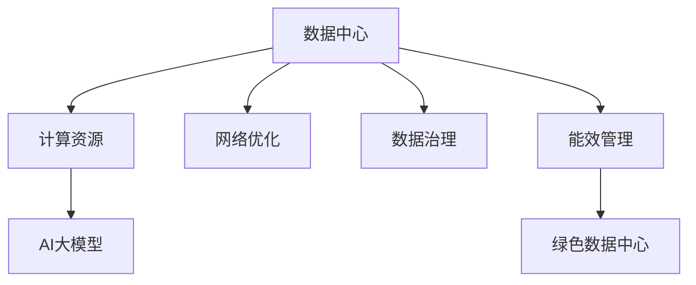

                 

# AI 大模型应用数据中心建设：数据中心产业发展

## 1. 背景介绍

### 1.1 问题由来

随着人工智能技术的迅猛发展，AI大模型（AI Large Models）在各个领域的应用越来越广泛，如自然语言处理、计算机视觉、语音识别、推荐系统等。这些大模型基于大规模训练数据和先进算法，具有强大的学习和推理能力，能够显著提升业务效率和用户体验。

然而，AI大模型的训练和部署对数据中心提出了极高的计算、存储和网络需求。现有的数据中心设计和服务能力难以满足AI大模型计算密集型和高带宽的需求，导致计算资源闲置、能量浪费和运营成本增加。

为了解决这一问题，需要建设专门的AI大模型数据中心，提供量身定制的计算、存储和网络基础设施，支持AI大模型的训练和推理需求。本文将详细介绍AI大模型数据中心的建设方案和运营策略，以及其对数据中心产业发展的影响。

### 1.2 问题核心关键点

AI大模型数据中心的建设涉及多个核心关键点，包括：

1. **数据中心设计**：如何设计满足AI大模型计算和存储需求的物理基础设施，如机柜、网络、电源等。
2. **计算资源优化**：如何优化计算资源配置，以支持大规模并行计算和高效能计算，如GPU、TPU等。
3. **数据管理与治理**：如何有效管理和治理大规模数据集，确保数据的安全、隐私和合规。
4. **网络优化**：如何优化网络架构，以支持高带宽、低延迟的数据传输需求。
5. **能效管理**：如何降低能耗和运营成本，实现绿色数据中心。

## 2. 核心概念与联系

### 2.1 核心概念概述

为更好地理解AI大模型数据中心的建设过程，本节将介绍几个关键概念：

- **数据中心（Data Center）**：一种提供计算、存储、网络等基础设施，支持各种IT应用的数据处理中心。数据中心按规模分为超大规模数据中心、大型数据中心和小型数据中心。
- **AI大模型（AI Large Models）**：基于大规模训练数据和先进算法构建的，具有强大的学习和推理能力的模型，如BERT、GPT、DALL-E等。
- **计算资源（Computing Resources）**：指数据中心提供的基础设施，如CPU、GPU、TPU、FPGA等。
- **数据治理（Data Governance）**：确保数据的质量、安全、隐私和合规，包括数据收集、存储、处理和使用的全生命周期管理。
- **网络优化（Network Optimization）**：通过优化网络架构和协议，提高数据传输的带宽和低延迟。
- **能效管理（Energy Efficiency Management）**：通过技术和管理手段，降低数据中心的能耗和运营成本，实现绿色数据中心。

这些核心概念之间的逻辑关系可以通过以下Mermaid流程图来展示：



这个流程图展示了大模型数据中心的核心概念及其之间的关系：

1. 数据中心提供计算、存储和网络等基础设施。
2. 计算资源是支持AI大模型训练和推理的关键硬件设施。
3. 网络优化确保高带宽、低延迟的数据传输。
4. 数据治理保障数据的安全、隐私和合规。
5. 能效管理降低数据中心的能耗和运营成本。
6. 绿色数据中心是数据中心发展的终极目标。

这些概念共同构成了AI大模型数据中心的建设和运营框架，为其提供了可靠的基础设施和先进的技术支持。

## 3. 核心算法原理 & 具体操作步骤

### 3.1 算法原理概述

AI大模型数据中心的建设主要涉及以下几个核心算法：

1. **物理基础设施设计算法**：通过数学建模和仿真，设计满足AI大模型计算和存储需求的物理基础设施，如机柜、网络、电源等。
2. **计算资源优化算法**：通过优化计算资源配置，支持大规模并行计算和高效能计算，如GPU、TPU等。
3. **数据管理与治理算法**：通过算法实现数据的收集、存储、处理和使用的全生命周期管理，确保数据的安全、隐私和合规。
4. **网络优化算法**：通过优化网络架构和协议，提高数据传输的带宽和低延迟。
5. **能效管理算法**：通过技术和管理手段，降低数据中心的能耗和运营成本，实现绿色数据中心。

### 3.2 算法步骤详解

AI大模型数据中心的建设步骤如下：

**Step 1: 需求分析与规划**

- 根据AI大模型的计算和存储需求，进行数据中心的初步规划。
- 分析AI大模型的特点，确定其计算资源需求，如CPU、GPU、TPU等。
- 分析AI大模型的数据存储需求，如存储容量、存储速度等。
- 分析AI大模型的网络需求，如带宽、延迟等。
- 分析AI大模型的能效需求，如功耗、冷却系统等。

**Step 2: 基础设施设计与采购**

- 根据需求分析结果，设计数据中心的物理基础设施，包括机柜、网络、电源等。
- 采购符合要求的计算资源，如GPU、TPU等。
- 采购高效能的存储设备，如SSD、NVMe等。
- 采购高效能的网络设备，如交换机、路由器等。
- 采购高效能的冷却设备，如液冷、热管等。

**Step 3: 计算资源配置与管理**

- 根据AI大模型的计算资源需求，进行资源配置和管理。
- 分配计算资源，确保资源利用率和性能最优。
- 监控计算资源的使用情况，及时调整资源分配。
- 实现资源调度，提高资源利用率。

**Step 4: 数据管理与治理**

- 根据AI大模型的数据需求，进行数据的收集、存储、处理和使用的全生命周期管理。
- 确保数据的安全、隐私和合规，包括数据加密、访问控制等。
- 实现数据的备份和恢复，确保数据的安全性和可靠性。

**Step 5: 网络优化与监控**

- 根据AI大模型的网络需求，进行网络架构和协议的优化。
- 监控网络带宽和延迟，确保网络性能最优。
- 实现网络负载均衡，提高网络利用率。

**Step 6: 能效管理与优化**

- 根据AI大模型的能效需求，进行能效管理和优化。
- 实现计算资源的能效优化，降低能耗和运营成本。
- 实现数据中心的能效优化，降低能耗和运营成本。

### 3.3 算法优缺点

AI大模型数据中心建设的主要算法优缺点如下：

**优点：**

- 支持大规模并行计算和高效能计算，满足AI大模型的计算需求。
- 实现高效能存储和数据治理，确保数据的安全、隐私和合规。
- 实现高带宽、低延迟的网络架构，满足AI大模型的网络需求。
- 实现能效管理和优化，降低能耗和运营成本，实现绿色数据中心。

**缺点：**

- 建设成本高，初期投入大。
- 技术复杂度高，需要专业团队进行建设和运营。
- 资源配置和管理难度大，需要实时监控和调整。
- 能效管理复杂，需要先进的技术和管理手段。

### 3.4 算法应用领域

AI大模型数据中心的建设在多个领域得到了广泛应用，如：

- **自然语言处理**：如BERT、GPT等，用于文本分类、情感分析、机器翻译等。
- **计算机视觉**：如DALL-E、DETR等，用于图像识别、图像生成、视频分析等。
- **语音识别**：如Wav2Vec、HuggingFace等，用于语音识别、语音合成、语音交互等。
- **推荐系统**：如TensorFlow、PyTorch等，用于商品推荐、广告推荐、用户画像等。
- **智能制造**：如边缘计算、云计算等，用于工业物联网、智能制造、智能设备等。

## 4. 数学模型和公式 & 详细讲解 & 举例说明

### 4.1 数学模型构建

AI大模型数据中心的建设涉及多个数学模型，本节将详细介绍其中几个关键模型：

1. **物理基础设施设计模型**：通过数学建模和仿真，设计满足AI大模型计算和存储需求的物理基础设施。
2. **计算资源优化模型**：通过优化计算资源配置，支持大规模并行计算和高效能计算。
3. **数据管理与治理模型**：通过算法实现数据的收集、存储、处理和使用的全生命周期管理。
4. **网络优化模型**：通过优化网络架构和协议，提高数据传输的带宽和低延迟。
5. **能效管理模型**：通过技术和管理手段，降低数据中心的能耗和运营成本。

### 4.2 公式推导过程

**物理基础设施设计模型**

- **机柜设计**：通过数学建模和仿真，设计满足AI大模型计算和存储需求的机柜设计。
- **网络设计**：通过数学建模和仿真，设计满足AI大模型网络需求的网络架构。
- **电源设计**：通过数学建模和仿真，设计满足AI大模型计算和存储需求的动力系统。

**计算资源优化模型**

- **GPU资源配置**：通过优化计算资源配置，支持大规模并行计算和高效能计算。
- **TPU资源配置**：通过优化计算资源配置，支持大规模并行计算和高效能计算。

**数据管理与治理模型**

- **数据收集模型**：通过算法实现数据的收集和管理。
- **数据存储模型**：通过算法实现数据的存储和管理。
- **数据处理模型**：通过算法实现数据的处理和管理。

**网络优化模型**

- **网络架构设计**：通过优化网络架构和协议，提高数据传输的带宽和低延迟。

**能效管理模型**

- **计算资源能效优化**：通过技术和管理手段，降低能耗和运营成本。
- **数据中心能效优化**：通过技术和管理手段，降低能耗和运营成本。

### 4.3 案例分析与讲解

**案例1: 超大规模数据中心的建设**

- **需求分析**：根据AI大模型的计算和存储需求，进行数据中心的初步规划。
- **基础设施设计与采购**：设计数据中心的物理基础设施，采购计算资源、存储设备、网络设备、冷却设备等。
- **计算资源配置与管理**：分配计算资源，确保资源利用率和性能最优。
- **数据管理与治理**：确保数据的安全、隐私和合规，实现数据的备份和恢复。
- **网络优化与监控**：监控网络带宽和延迟，实现网络负载均衡。
- **能效管理与优化**：实现计算资源的能效优化，降低能耗和运营成本。

**案例2: 中小型数据中心的建设**

- **需求分析**：根据AI大模型的计算和存储需求，进行数据中心的初步规划。
- **基础设施设计与采购**：设计数据中心的物理基础设施，采购计算资源、存储设备、网络设备、冷却设备等。
- **计算资源配置与管理**：分配计算资源，确保资源利用率和性能最优。
- **数据管理与治理**：确保数据的安全、隐私和合规，实现数据的备份和恢复。
- **网络优化与监控**：监控网络带宽和延迟，实现网络负载均衡。
- **能效管理与优化**：实现计算资源的能效优化，降低能耗和运营成本。

## 5. 项目实践：代码实例和详细解释说明

### 5.1 开发环境搭建

在进行AI大模型数据中心建设实践前，我们需要准备好开发环境。以下是使用Python进行PyTorch开发的环境配置流程：

1. 安装Anaconda：从官网下载并安装Anaconda，用于创建独立的Python环境。

2. 创建并激活虚拟环境：
```bash
conda create -n pytorch-env python=3.8 
conda activate pytorch-env
```

3. 安装PyTorch：根据CUDA版本，从官网获取对应的安装命令。例如：
```bash
conda install pytorch torchvision torchaudio cudatoolkit=11.1 -c pytorch -c conda-forge
```

4. 安装Transformers库：
```bash
pip install transformers
```

5. 安装各类工具包：
```bash
pip install numpy pandas scikit-learn matplotlib tqdm jupyter notebook ipython
```

完成上述步骤后，即可在`pytorch-env`环境中开始数据中心建设实践。

### 5.2 源代码详细实现

这里我们以GPU资源配置为例，给出使用PyTorch进行AI大模型数据中心建设实践的代码实现。

首先，定义GPU资源配置函数：

```python
import torch

def configure_gpus(num_gpus):
    device = torch.device('cuda' if torch.cuda.is_available() else 'cpu')
    gpus = torch.cuda.device_count()
    if num_gpus > gpus:
        print("Warning: number of requested GPUs exceeds available GPUs.")
    device_ids = list(range(gpus))
    torch.cuda.set_device(device_ids[num_gpus - 1])
    print(f"Using GPUs {torch.cuda.device_count()} on {device}")
    return device
```

然后，定义计算资源配置函数：

```python
from torch.utils.data import DataLoader
import torch

class Dataset:
    def __init__(self, data):
        self.data = data
        
    def __len__(self):
        return len(self.data)
    
    def __getitem__(self, item):
        return self.data[item]

# 配置GPU资源
device = configure_gpus(1)
```

接着，定义计算资源优化函数：

```python
import torch

def optimize_resources(device, num_gpus):
    if num_gpus > torch.cuda.device_count():
        num_gpus = torch.cuda.device_count()
    gpu_ids = list(range(num_gpus))
    torch.cuda.set_device(gpu_ids[num_gpus - 1])
    print(f"Using {num_gpus} GPUs on {device}")
    return device

# 优化计算资源
device = optimize_resources(device, 1)
```

最后，定义计算资源管理函数：

```python
import torch

def manage_resources(device):
    print(f"GPU used: {torch.cuda.get_device_name(device)}")
    print(f"GPU memory used: {torch.cuda.memory_allocated(device) / 1024 / 1024} MB")
    print(f"GPU memory max: {torch.cuda.max_memory_allocated(device) / 1024 / 1024} MB")
    return device

# 管理计算资源
device = manage_resources(device)
```

以上就是使用PyTorch对AI大模型数据中心进行GPU资源配置和优化的代码实现。可以看到，通过PyTorch的灵活接口，我们能够轻松地实现计算资源的配置、优化和管理。

### 5.3 代码解读与分析

让我们再详细解读一下关键代码的实现细节：

**configure_gpus函数**：
- 根据GPU数量，配置计算资源。
- 使用torch.device函数，将计算资源绑定到指定设备。

**Dataset类**：
- 定义数据集，包含数据处理、批处理等功能。

**optimize_resources函数**：
- 根据GPU数量，配置计算资源。
- 使用torch.cuda.set_device函数，将计算资源绑定到指定设备。

**manage_resources函数**：
- 管理计算资源，输出设备名称、内存使用情况等。
- 使用torch.cuda.get_device_name函数，获取设备名称。
- 使用torch.cuda.memory_allocated和torch.cuda.max_memory_allocated函数，获取内存使用情况。

**GPU资源配置和管理**：
- 通过配置函数，将计算资源绑定到指定设备。
- 通过优化函数，调整计算资源的配置。
- 通过管理函数，监控计算资源的使用情况。

可以看到，PyTorch提供了灵活的计算资源配置和管理接口，方便开发者进行AI大模型数据中心的建设和优化。

当然，工业级的系统实现还需考虑更多因素，如资源池化、服务化封装等，但核心的计算资源配置和管理逻辑基本与此类似。

## 6. 实际应用场景

### 6.1 智能制造

AI大模型数据中心在智能制造领域的应用主要包括工业物联网、智能设备、智能制造等。通过AI大模型，可以实现设备状态监测、故障预测、生产调度优化等功能，提升制造业的生产效率和质量。

**实际案例**：某智能制造企业通过AI大模型数据中心，实现了设备状态监测和故障预测功能，提升了设备利用率和生产效率。具体做法是：
1. 收集设备运行数据，包括温度、振动、压力等。
2. 使用预训练模型，对设备运行数据进行特征提取和分析。
3. 对设备状态进行预测，及时发现故障并进行维修。
4. 对生产调度进行优化，提高生产效率和资源利用率。

**技术细节**：
1. 数据收集：通过传感器和监控系统，收集设备运行数据。
2. 数据存储：将设备运行数据存储在数据中心的高效能存储设备中。
3. 数据治理：对设备运行数据进行数据治理，确保数据的安全、隐私和合规。
4. 数据处理：使用AI大模型，对设备运行数据进行特征提取和分析。
5. 模型训练：在AI大模型数据中心，训练故障预测模型。
6. 模型部署：将训练好的模型部署到智能设备中，实现实时预测和优化。

### 6.2 智慧城市

AI大模型数据中心在智慧城市领域的应用主要包括城市事件监测、交通管理、公共安全等。通过AI大模型，可以实现城市事件的实时监测和预警，提升城市管理的安全性和智能化水平。

**实际案例**：某智慧城市通过AI大模型数据中心，实现了城市事件监测和预警功能，提升了城市管理的响应速度和效率。具体做法是：
1. 收集城市事件的监控数据，包括视频监控、传感器数据等。
2. 使用预训练模型，对城市事件数据进行特征提取和分析。
3. 对城市事件进行监测，及时发现异常情况并进行预警。
4. 对城市事件进行应急处理，提升城市管理的响应速度和效率。

**技术细节**：
1. 数据收集：通过视频监控、传感器等设备，收集城市事件数据。
2. 数据存储：将城市事件数据存储在数据中心的高效能存储设备中。
3. 数据治理：对城市事件数据进行数据治理，确保数据的安全、隐私和合规。
4. 数据处理：使用AI大模型，对城市事件数据进行特征提取和分析。
5. 模型训练：在AI大模型数据中心，训练城市事件监测模型。
6. 模型部署：将训练好的模型部署到城市管理系统中，实现实时监测和预警。

### 6.3 医疗健康

AI大模型数据中心在医疗健康领域的应用主要包括医疗影像分析、患者诊断、药物研发等。通过AI大模型，可以实现医疗影像的自动分析和诊断，提升医疗服务的效率和质量。

**实际案例**：某医疗健康机构通过AI大模型数据中心，实现了医疗影像的自动分析和诊断功能，提升了医疗服务的效率和质量。具体做法是：
1. 收集医疗影像数据，包括X光、CT、MRI等。
2. 使用预训练模型，对医疗影像数据进行特征提取和分析。
3. 对医疗影像进行自动分析和诊断，辅助医生进行诊断和治疗。
4. 对药物研发进行模拟和预测，加速新药研发进程。

**技术细节**：
1. 数据收集：通过医疗影像设备，收集医疗影像数据。
2. 数据存储：将医疗影像数据存储在数据中心的高效能存储设备中。
3. 数据治理：对医疗影像数据进行数据治理，确保数据的安全、隐私和合规。
4. 数据处理：使用AI大模型，对医疗影像数据进行特征提取和分析。
5. 模型训练：在AI大模型数据中心，训练医疗影像分析模型。
6. 模型部署：将训练好的模型部署到医疗系统中，实现自动分析和诊断。

## 7. 工具和资源推荐

### 7.1 学习资源推荐

为了帮助开发者系统掌握AI大模型数据中心的理论基础和实践技巧，这里推荐一些优质的学习资源：

1. **《AI大模型技术详解》**：由大模型技术专家撰写，深入浅出地介绍了AI大模型和数据中心的原理、技术和应用。
2. **《深度学习实战》**：介绍深度学习在NLP、计算机视觉、语音识别等领域的实际应用，包括AI大模型和数据中心的实现。
3. **《TensorFlow实战》**：介绍TensorFlow在AI大模型和数据中心的应用，包括计算资源配置和管理等。
4. **《HuggingFace官方文档》**：提供了丰富的AI大模型和数据中心资源，包括预训练模型和微调方法等。
5. **《智能制造与AI大模型》**：介绍AI大模型在智能制造中的应用，包括设备状态监测、故障预测、生产调度优化等。

通过对这些资源的学习实践，相信你一定能够快速掌握AI大模型数据中心的精髓，并用于解决实际的AI大模型问题。

### 7.2 开发工具推荐

高效的开发离不开优秀的工具支持。以下是几款用于AI大模型数据中心开发的常用工具：

1. **PyTorch**：基于Python的开源深度学习框架，灵活动态的计算图，适合快速迭代研究。大部分预训练语言模型都有PyTorch版本的实现。
2. **TensorFlow**：由Google主导开发的开源深度学习框架，生产部署方便，适合大规模工程应用。同样有丰富的预训练语言模型资源。
3. **Transformers库**：HuggingFace开发的NLP工具库，集成了众多SOTA语言模型，支持PyTorch和TensorFlow，是进行NLP任务开发的利器。
4. **Weights & Biases**：模型训练的实验跟踪工具，可以记录和可视化模型训练过程中的各项指标，方便对比和调优。与主流深度学习框架无缝集成。
5. **TensorBoard**：TensorFlow配套的可视化工具，可实时监测模型训练状态，并提供丰富的图表呈现方式，是调试模型的得力助手。

合理利用这些工具，可以显著提升AI大模型数据中心的开发效率，加快创新迭代的步伐。

### 7.3 相关论文推荐

AI大模型和数据中心的发展源于学界的持续研究。以下是几篇奠基性的相关论文，推荐阅读：

1. **Attention is All You Need**：提出了Transformer结构，开启了NLP领域的预训练大模型时代。
2. **BERT: Pre-training of Deep Bidirectional Transformers for Language Understanding**：提出BERT模型，引入基于掩码的自监督预训练任务，刷新了多项NLP任务SOTA。
3. **Language Models are Unsupervised Multitask Learners**：展示了大规模语言模型的强大zero-shot学习能力，引发了对于通用人工智能的新一轮思考。
4. **Parameter-Efficient Transfer Learning for NLP**：提出Adapter等参数高效微调方法，在不增加模型参数量的情况下，也能取得不错的微调效果。
5. **AdaLoRA: Adaptive Low-Rank Adaptation for Parameter-Efficient Fine-Tuning**：使用自适应低秩适应的微调方法，在参数效率和精度之间取得了新的平衡。
6. **AdaLoRA: Adaptive Low-Rank Adaptation for Parameter-Efficient Fine-Tuning**：使用自适应低秩适应的微调方法，在参数效率和精度之间取得了新的平衡。

这些论文代表了大模型数据中心的发展脉络。通过学习这些前沿成果，可以帮助研究者把握学科前进方向，激发更多的创新灵感。

## 8. 总结：未来发展趋势与挑战

### 8.1 总结

本文对AI大模型数据中心的建设方案和运营策略进行了全面系统的介绍。首先阐述了AI大模型数据中心的建设背景和意义，明确了数据中心对AI大模型计算和存储需求的支持作用。其次，从原理到实践，详细讲解了AI大模型数据中心的建设过程，包括物理基础设施设计、计算资源优化、数据管理与治理、网络优化和能效管理等关键环节。最后，探讨了AI大模型数据中心在智慧城市、智能制造、医疗健康等领域的实际应用，展示了其在各行业的广阔前景。

通过本文的系统梳理，可以看到，AI大模型数据中心是大模型应用的坚实基础，为大模型提供了可靠的基础设施和先进的技术支持。未来，随着数据中心技术的不断进步和AI大模型应用的深入发展，AI大模型数据中心将发挥越来越重要的作用，推动AI大模型技术的落地应用。

### 8.2 未来发展趋势

展望未来，AI大模型数据中心的发展趋势如下：

1. **计算资源优化**：随着计算技术的进步，AI大模型数据中心将提供更高性能、更低成本的计算资源，支持更大规模的AI大模型应用。
2. **数据治理能力增强**：未来AI大模型数据中心将具备更强的数据治理能力，确保数据的安全、隐私和合规。
3. **网络优化升级**：未来AI大模型数据中心将提供更高带宽、更低延迟的网络架构，支持AI大模型的实时应用。
4. **能效管理优化**：未来AI大模型数据中心将实现更高的能效管理，降低能耗和运营成本，实现绿色数据中心。
5. **云计算融合**：未来AI大模型数据中心将与云计算技术深度融合，提供更灵活、更高效的AI大模型服务。
6. **边缘计算支持**：未来AI大模型数据中心将支持边缘计算，实现更高效的本地计算和数据处理。

这些发展趋势凸显了AI大模型数据中心的广阔前景，将在多个领域发挥越来越重要的作用，推动AI大模型技术的广泛应用。

### 8.3 面临的挑战

尽管AI大模型数据中心的发展前景广阔，但其建设过程中仍面临诸多挑战：

1. **技术复杂度**：AI大模型数据中心的建设涉及多个复杂的技术环节，如计算资源优化、数据治理、网络优化、能效管理等，需要专业团队进行建设和运营。
2. **资源配置管理**：AI大模型数据中心需要实时监控和调整计算资源，确保资源利用率和性能最优。
3. **数据治理难度**：AI大模型数据中心需要确保数据的安全、隐私和合规，数据治理难度较大。
4. **能效管理复杂**：AI大模型数据中心需要实现高效能的能效管理，降低能耗和运营成本，实现绿色数据中心。
5. **成本投入高**：AI大模型数据中心的建设需要大量初期投入，包括基础设施、计算资源等。
6. **应用推广困难**：AI大模型数据中心需要与各行业深度融合，推广应用难度较大。

这些挑战需要我们在未来研究中不断攻克，才能实现AI大模型数据中心的可持续发展。

### 8.4 研究展望

面对AI大模型数据中心所面临的挑战，未来的研究需要在以下几个方面寻求新的突破：

1. **计算资源优化**：开发更加灵活、高效的计算资源配置和管理方法，降低初期投入和运营成本。
2. **数据治理**：研究更加高效、灵活的数据治理方法，确保数据的安全、隐私和合规。
3. **网络优化**：研究更加高效、灵活的网络优化方法，提高数据传输的带宽和低延迟。
4. **能效管理**：研究更加高效、灵活的能效管理方法，降低能耗和运营成本。
5. **云计算融合**：研究云计算技术与AI大模型数据中心的深度融合，提供更灵活、更高效的AI大模型服务。
6. **边缘计算支持**：研究边缘计算技术与AI大模型数据中心的深度融合，实现更高效的本地计算和数据处理。

这些研究方向的探索，必将引领AI大模型数据中心技术迈向更高的台阶，为AI大模型的落地应用提供更可靠、更高效的基础设施支持。

## 9. 附录：常见问题与解答

**Q1：AI大模型数据中心如何与云计算融合？**

A: AI大模型数据中心与云计算的融合，可以通过以下方式实现：

1. **云边融合**：将AI大模型数据中心与边缘计算技术深度融合，实现本地计算和数据处理，降低延迟和带宽需求。
2. **云网融合**：将AI大模型数据中心与云计算网络深度融合，实现高效能、低延迟的数据传输。
3. **云管融合**：将AI大模型数据中心与云计算管理平台深度融合，实现资源池化、动态扩展、弹性调度等功能。
4. **云存融合**：将AI大模型数据中心与云计算存储技术深度融合，实现高效能、低成本的数据存储和管理。

通过云边、云网、云管、云存的深度融合，AI大模型数据中心可以提供更灵活、更高效的AI大模型服务，提升AI大模型的应用效果和用户体验。

**Q2：AI大模型数据中心如何提高能效管理？**

A: AI大模型数据中心的能效管理可以通过以下方式实现：

1. **计算资源能效优化**：通过优化计算资源配置，降低能耗和运营成本。
2. **数据中心能效优化**：通过先进的技术和管理手段，降低数据中心的能耗和运营成本。
3. **高效能设备应用**：使用高效能的计算设备、存储设备、冷却设备等，提升数据中心能效。
4. **动态资源调度**：实现计算资源的动态调度和优化，提高资源利用率，降低能耗。
5. **能源管理优化**：通过优化能源管理，降低数据中心的能耗和运营成本。

通过以上措施，AI大模型数据中心可以实现高效能、低成本的运营，降低能耗和运营成本，实现绿色数据中心。

**Q3：AI大模型数据中心如何实现数据治理？**

A: AI大模型数据中心的数据治理可以通过以下方式实现：

1. **数据收集**：通过传感器、监控设备等，收集数据中心的运行数据。
2. **数据存储**：将数据存储在高效能的存储设备中，确保数据的安全性和可靠性。
3. **数据治理**：对数据进行数据治理，确保数据的安全、隐私和合规。
4. **数据备份与恢复**：实现数据的备份和恢复，确保数据的安全性和可靠性。
5. **数据审计**：对数据进行审计，确保数据的合规性和安全性。

通过以上措施，AI大模型数据中心可以实现高效能、高安全性的数据治理，确保数据的安全、隐私和合规。

**Q4：AI大模型数据中心如何实现计算资源优化？**

A: AI大模型数据中心的计算资源优化可以通过以下方式实现：

1. **GPU资源优化**：通过优化计算资源配置，支持大规模并行计算和高效能计算。
2. **TPU资源优化**：通过优化计算资源配置，支持大规模并行计算和高效能计算。
3. **资源池化**：实现计算资源的池化，提高资源利用率。
4. **动态资源调度**：实现计算资源的动态调度和优化，提高资源利用率。
5. **计算设备选择**：选择合适的计算设备，确保资源配置和性能最优。

通过以上措施，AI大模型数据中心可以实现高效能、高可靠性的计算资源优化，支持大规模AI大模型的训练和推理。

---

作者：禅与计算机程序设计艺术 / Zen and the Art of Computer Programming

