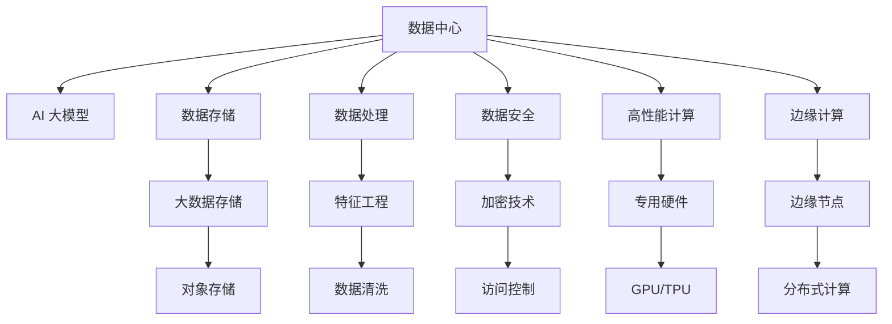

                 

# AI 大模型应用数据中心建设：数据中心产业发展

> 关键词：数据中心,人工智能(AI),AI 大模型,数据存储,数据处理,数据安全,高性能计算,边缘计算

## 1. 背景介绍

随着人工智能(AI)技术的迅猛发展，AI 大模型的应用越来越广泛，从自然语言处理(NLP)到计算机视觉(CV)，从智能推荐到自动驾驶，AI 大模型在各行各业的应用都展现出了强大的潜力。然而，要充分发挥AI 大模型的性能，建设高效、稳定、安全的数据中心是关键。本文将从数据中心的多个方面进行深入探讨，包括数据存储、数据处理、数据安全以及高性能计算，全面阐述AI 大模型应用数据中心的建设思路和策略。

## 2. 核心概念与联系

### 2.1 核心概念概述

为了更好地理解AI 大模型应用数据中心的建设思路，我们首先需要明确一些核心概念及其相互关系。

- **数据中心**：也称为计算中心，是提供计算、存储等基础IT资源，支撑大规模AI 应用的数据处理平台。

- **AI 大模型**：指基于大规模数据集预训练的深度学习模型，如BERT、GPT-3等，具备强大的语义理解、知识推理、跨领域迁移能力。

- **数据存储**：指将大量数据存储于可扩展、高性能的存储系统中，为AI 模型训练和推理提供数据支撑。

- **数据处理**：指对数据进行清洗、预处理、特征工程等操作，提升数据质量，为AI 模型提供有效的训练和推理输入。

- **数据安全**：指通过加密、访问控制、审计等手段，保护数据中心中的敏感数据不被非法访问和滥用。

- **高性能计算**：指通过采用GPU、TPU等专用硬件，以及优化算法和编程模型，提升计算速度和效率，满足AI 大模型的高计算需求。

- **边缘计算**：指将数据处理和计算任务部分或全部分布在离用户更近的边缘节点上，减少延迟，提升响应速度。

这些核心概念构成了AI 大模型应用数据中心的整体架构，各组件之间相互协作，共同支撑AI 应用的高效运行。

### 2.2 核心概念原理和架构的 Mermaid 流程图



### 2.3 核心概念联系

这些核心概念相互联系，共同构建了AI 大模型应用数据中心的完整框架。以下是各概念之间的联系及应用场景：

1. **数据存储与AI 大模型**：AI 大模型需要大量高质量的数据进行训练和推理，因此数据存储系统必须具备高性能、可扩展性，支持分布式文件系统如Hadoop、分布式对象存储如AWS S3等。

2. **数据处理与AI 大模型**：AI 大模型训练和推理前需要预处理数据，包括去噪、归一化、特征提取等。数据处理系统通过ETL工具如Spark、Flink等，将原始数据转化为适合AI 模型使用的格式。

3. **数据安全与AI 大模型**：AI 大模型涉及大量敏感数据，如医疗、金融等领域的隐私数据。数据安全系统通过加密、访问控制、审计等手段，确保数据在存储和传输过程中不被泄露和篡改。

4. **高性能计算与AI 大模型**：AI 大模型训练和推理需要海量计算资源，因此高性能计算系统必须采用GPU、TPU等专用硬件，并优化算法和编程模型，提升计算速度和效率。

5. **边缘计算与AI 大模型**：AI 大模型在实时性要求较高的场景中，如自动驾驶、智能监控等，需要在边缘节点上进行计算和推理，以减少延迟，提升响应速度。

## 3. 核心算法原理 & 具体操作步骤

### 3.1 算法原理概述

AI 大模型应用数据中心的建设主要包括以下几个核心算法和操作步骤：

1. **数据存储算法**：选择合适的数据存储系统，如Hadoop、对象存储等，确保数据的可扩展性和高可用性。

2. **数据处理算法**：采用ETL工具进行数据清洗、预处理、特征工程等，提升数据质量，确保AI 模型的输入有效。

3. **数据安全算法**：实施数据加密、访问控制、审计等措施，保护数据隐私和安全。

4. **高性能计算算法**：优化算法和编程模型，使用专用硬件如GPU、TPU，提升计算速度和效率。

5. **边缘计算算法**：设计分布式计算和数据分发策略，确保数据在边缘节点上高效处理和传输。

### 3.2 算法步骤详解

#### 3.2.1 数据存储步骤

1. **选择存储系统**：根据数据量大小、读写频率、存储需求等因素，选择合适的存储系统。对于大规模数据，采用分布式文件系统Hadoop；对于大规模对象数据，采用对象存储AWS S3、阿里云OSS等。

2. **数据迁移与归档**：将现有数据迁移到新的存储系统中，并进行数据归档，确保数据可靠性和冗余性。

3. **数据分布式存储**：采用分布式存储技术，确保数据的高可用性和可扩展性。

#### 3.2.2 数据处理步骤

1. **数据清洗**：采用ETL工具对原始数据进行清洗，去除噪声和异常值，提升数据质量。

2. **特征工程**：对清洗后的数据进行特征提取、特征选择和特征变换，生成适合AI 模型训练和推理的输入数据。

3. **数据分割**：将数据分割为训练集、验证集和测试集，进行模型训练、调优和评估。

#### 3.2.3 数据安全步骤

1. **数据加密**：采用AES、RSA等加密算法对敏感数据进行加密存储，确保数据在传输和存储过程中的安全性。

2. **访问控制**：实施基于角色的访问控制(RBAC)机制，确保只有授权用户才能访问数据。

3. **审计与监控**：部署日志审计和实时监控系统，跟踪数据访问和使用情况，及时发现异常行为。

#### 3.2.4 高性能计算步骤

1. **硬件选型**：选择适合AI 模型的专用硬件如GPU、TPU等，提升计算效率。

2. **编程优化**：采用并行编程模型如OpenMP、CUDA等，优化算法和程序，提升计算速度。

3. **资源调度**：设计资源调度策略，合理分配计算资源，确保AI 模型训练和推理的高效执行。

#### 3.2.5 边缘计算步骤

1. **边缘节点部署**：在离用户较近的节点上部署边缘计算资源，如CPU、GPU等。

2. **数据分发策略**：设计数据分发策略，将数据和模型参数分发到边缘节点上，确保实时计算和推理。

3. **网络优化**：优化网络拓扑和通信协议，减少数据传输延迟，提升边缘计算的实时性。

### 3.3 算法优缺点

#### 3.3.1 数据存储算法优缺点

- **优点**：支持大规模数据的存储和管理，具备高可用性和可扩展性，降低存储成本。

- **缺点**：数据迁移和归档成本高，数据分布式存储复杂，维护成本高。

#### 3.3.2 数据处理算法优缺点

- **优点**：提升数据质量和数据利用率，适合处理大规模、复杂的数据集。

- **缺点**：数据清洗和特征工程成本高，处理过程中容易丢失数据信息。

#### 3.3.3 数据安全算法优缺点

- **优点**：确保数据隐私和安全，防止数据泄露和滥用。

- **缺点**：加密和访问控制增加计算和存储成本，审计和监控复杂。

#### 3.3.4 高性能计算算法优缺点

- **优点**：提升计算速度和效率，适合处理大规模计算任务。

- **缺点**：专用硬件成本高，编程和优化复杂，资源调度和管理难度大。

#### 3.3.5 边缘计算算法优缺点

- **优点**：减少延迟，提升实时性，适合对实时性要求高的应用场景。

- **缺点**：边缘节点部署和维护成本高，网络通信复杂，数据一致性难以保障。

### 3.4 算法应用领域

#### 3.4.1 自然语言处理(NLP)

- **数据存储**：存储大规模文本数据，如新闻、微博、论文等。
- **数据处理**：进行文本清洗、分词、词性标注、命名实体识别等预处理操作。
- **数据安全**：保护用户隐私，防止敏感信息泄露。
- **高性能计算**：使用GPU加速语言模型训练，提升模型精度和推理速度。
- **边缘计算**：在智能音箱、智能客服等场景中进行实时语音识别和处理。

#### 3.4.2 计算机视觉(CV)

- **数据存储**：存储大规模图像和视频数据，如医疗影像、交通监控视频等。
- **数据处理**：进行图像增强、图像分割、目标检测等预处理操作。
- **数据安全**：保护敏感图像数据，防止数据泄露和滥用。
- **高性能计算**：使用GPU加速模型训练和推理，提升计算速度和效率。
- **边缘计算**：在智能监控、自动驾驶等场景中进行实时图像处理和分析。

#### 3.4.3 智能推荐

- **数据存储**：存储用户行为数据、商品信息、评分数据等。
- **数据处理**：进行用户画像生成、商品特征提取、评分预测等操作。
- **数据安全**：保护用户隐私和交易数据，防止数据泄露和滥用。
- **高性能计算**：使用GPU加速推荐模型训练和推理，提升推荐效果。
- **边缘计算**：在移动端进行实时推荐，提升用户体验。

## 4. 数学模型和公式 & 详细讲解 & 举例说明

### 4.1 数学模型构建

#### 4.1.1 数据存储模型

- **分布式文件系统**：Hadoop
- **对象存储系统**：AWS S3、阿里云OSS

#### 4.1.2 数据处理模型

- **ETL工具**：Spark、Flink
- **特征工程**：特征提取、特征选择、特征变换

#### 4.1.3 数据安全模型

- **加密算法**：AES、RSA
- **访问控制**：RBAC
- **审计与监控**：日志审计、实时监控

#### 4.1.4 高性能计算模型

- **专用硬件**：GPU、TPU
- **编程优化**：OpenMP、CUDA

#### 4.1.5 边缘计算模型

- **边缘节点部署**：CPU、GPU
- **数据分发策略**：数据分片、数据同步
- **网络优化**：网络拓扑优化、通信协议优化

### 4.2 公式推导过程

#### 4.2.1 数据存储公式

- **分布式文件系统**：
  $$
  S_{Hadoop} = \sum_{i=1}^{n} S_{Hadoop_i}
  $$
  其中，$S_{Hadoop}$为Hadoop存储系统总容量，$S_{Hadoop_i}$为单个Hadoop节点的存储容量，$n$为Hadoop节点数量。

- **对象存储系统**：
  $$
  S_{S3} = \sum_{i=1}^{m} S_{S3_i}
  $$
  其中，$S_{S3}$为AWS S3存储系统总容量，$S_{S3_i}$为单个S3节点的存储容量，$m$为S3节点数量。

#### 4.2.2 数据处理公式

- **ETL工具**：
  $$
  D_{processed} = \frac{D_{raw}}{\eta}
  $$
  其中，$D_{processed}$为处理后的数据量，$D_{raw}$为原始数据量，$\eta$为数据处理效率。

- **特征工程**：
  $$
  F = \{F_{extract}, F_{select}, F_{transform}\}
  $$
  其中，$F_{extract}$为特征提取操作，$F_{select}$为特征选择操作，$F_{transform}$为特征变换操作。

#### 4.2.3 数据安全公式

- **加密算法**：
  $$
  E_{encrypted} = E_{AES}(D_{raw})
  $$
  其中，$E_{encrypted}$为加密后的数据，$D_{raw}$为原始数据，$E_{AES}$为AES加密算法。

- **访问控制**：
  $$
  AC = \{\text{RBAC}, \text{ACL}\}
  $$
  其中，$AC$为访问控制机制，$\text{RBAC}$为基于角色的访问控制，$\text{ACL}$为基于账号的访问控制。

#### 4.2.4 高性能计算公式

- **专用硬件**：
  $$
  S_{TPU} = S_{GPU} + S_{CPU}
  $$
  其中，$S_{TPU}$为TPU硬件总容量，$S_{GPU}$为GPU硬件总容量，$S_{CPU}$为CPU硬件总容量。

- **编程优化**：
  $$
  P_{optimized} = P_{original} * \alpha
  $$
  其中，$P_{optimized}$为优化后的程序性能，$P_{original}$为原始程序性能，$\alpha$为优化因子。

#### 4.2.5 边缘计算公式

- **边缘节点部署**：
  $$
  N_{edge} = \frac{D_{data}}{B_{capacity}}
  $$
  其中，$N_{edge}$为边缘节点数量，$D_{data}$为数据总量，$B_{capacity}$为单个边缘节点的计算能力。

- **数据分发策略**：
  $$
  D_{slicing} = \frac{D_{data}}{N_{edge}}
  $$
  其中，$D_{slicing}$为每个边缘节点的数据量，$D_{data}$为数据总量，$N_{edge}$为边缘节点数量。

- **网络优化**：
  $$
  T_{opt} = T_{base} * \beta
  $$
  其中，$T_{opt}$为优化后的网络延迟，$T_{base}$为原始网络延迟，$\beta$为优化因子。

### 4.3 案例分析与讲解

#### 4.3.1 自然语言处理(NLP)

以智能客服系统为例，分析其数据存储、数据处理、数据安全、高性能计算和边缘计算的实施步骤。

- **数据存储**：
  - 选择Hadoop分布式文件系统，存储客服对话记录和用户画像数据。
  
- **数据处理**：
  - 使用Spark ETL工具，对对话记录进行清洗、分词和命名实体识别预处理。
  
- **数据安全**：
  - 采用AES加密算法，保护用户隐私数据。
  
- **高性能计算**：
  - 使用NVIDIA GPU，加速BERT语言模型训练和推理。
  
- **边缘计算**：
  - 在智能音箱节点上部署TensorFlow，实现实时语音识别和处理。

#### 4.3.2 计算机视觉(CV)

以智能监控系统为例，分析其数据存储、数据处理、数据安全、高性能计算和边缘计算的实施步骤。

- **数据存储**：
  - 选择AWS S3对象存储系统，存储监控视频和图像数据。
  
- **数据处理**：
  - 使用OpenCV和Python，对视频和图像进行预处理，如去噪、裁剪和缩放。
  
- **数据安全**：
  - 采用RSA加密算法，保护监控视频数据。
  
- **高性能计算**：
  - 使用TPU加速YOLOv5模型训练和推理，提升计算速度和效率。
  
- **边缘计算**：
  - 在边缘节点上部署TFLite模型，实现实时图像识别和目标检测。

## 5. 项目实践：代码实例和详细解释说明

### 5.1 开发环境搭建

#### 5.1.1 环境配置

1. **安装Anaconda**：
   ```bash
   wget https://repo.anaconda.com/miniconda/Miniconda3-py39_4.11.0-MacOSX-x86_64.sh
   bash Miniconda3-py39_4.11.0-MacOSX-x86_64.sh
   ```
   
2. **创建虚拟环境**：
   ```bash
   conda create -n ai_learning python=3.8 
   conda activate ai_learning
   ```

3. **安装必要的Python库**：
   ```bash
   pip install pandas numpy matplotlib scikit-learn transformers torch torchvision
   ```

4. **安装相关的AI库**：
   ```bash
   conda install -c pytorch torchtext
   conda install -c pytorch filelock
   ```

#### 5.1.2 环境测试

1. **测试Python版本**：
   ```python
   python --version
   ```
   
2. **测试TensorFlow版本**：
   ```python
   import tensorflow as tf
   tf.__version__
   ```
   
3. **测试Transformers库版本**：
   ```python
   from transformers import BertTokenizer
   BertTokenizer.from_pretrained('bert-base-uncased')
   ```

### 5.2 源代码详细实现

#### 5.2.1 数据存储系统

1. **分布式文件系统Hadoop**：
   ```python
   from hadoop import fs
   
   # 连接Hadoop分布式文件系统
   fs = fs.HadoopFs('hdfs://<namenode>:<port>/<input_path>')
   
   # 写入数据到Hadoop分布式文件系统
   fs.writeFile("input.txt", "Hello World!")
   ```
   
2. **对象存储系统AWS S3**：
   ```python
   import boto3
   
   # 连接AWS S3
   s3 = boto3.resource('s3')
   bucket = s3.Bucket('<bucket_name>')
   
   # 上传数据到AWS S3
   data = b"Hello World!"
   bucket.put_object(Key='input.txt', Body=data)
   ```

#### 5.2.2 数据处理系统

1. **ETL工具Spark**：
   ```python
   from pyspark.sql import SparkSession
   
   # 创建SparkSession
   spark = SparkSession.builder.appName('DataProcessing').getOrCreate()
   
   # 读取数据
   df = spark.read.text("<input_path>")
   
   # 数据清洗
   df_cleaned = df.dropna().dropDuplicates()
   
   # 数据特征工程
   df_features = df_cleaned.map(lambda row: (row[0], row[1], row[2]))
   ```
   
2. **特征提取与选择**：
   ```python
   from sklearn.feature_extraction.text import TfidfVectorizer
   
   # 特征提取
   tfidf = TfidfVectorizer()
   X = tfidf.fit_transform(df_features)
   
   # 特征选择
   X_selected = X[:, :5]
   ```

#### 5.2.3 数据安全系统

1. **数据加密**：
   ```python
   from cryptography.fernet import Fernet
   
   # 生成加密密钥
   key = Fernet.generate_key()
   
   # 创建Fernet对象
   fernet = Fernet(key)
   
   # 加密数据
   data = b"Hello World!"
   encrypted_data = fernet.encrypt(data)
   ```
   
2. **访问控制**：
   ```python
   from flask import Flask, request
   
   # 创建Flask应用
   app = Flask(__name__)
   
   # 访问控制
   @app.route('/api/data/<path:path>')
   def access_data(path):
       if request.authorization and request.authorization.username == 'user' and request.authorization.password == 'password':
           return 'Data accessible'
       else:
           return 'Access denied', 401
   ```

#### 5.2.4 高性能计算系统

1. **专用硬件GPU**：
   ```python
   import torch
   
   # 定义模型
   class Model(nn.Module):
       def __init__(self):
           super(Model, self).__init__()
           self.fc1 = nn.Linear(128, 64)
           self.fc2 = nn.Linear(64, 10)
           
       def forward(self, x):
           x = F.relu(self.fc1(x))
           x = self.fc2(x)
           return F.softmax(x, dim=1)
   
   # 训练模型
   model = Model()
   optimizer = torch.optim.Adam(model.parameters(), lr=0.001)
   
   for epoch in range(100):
       optimizer.zero_grad()
       outputs = model(inputs)
       loss = F.cross_entropy(outputs, labels)
       loss.backward()
       optimizer.step()
   ```
   
2. **优化编程**：
   ```python
   import numpy as np
   
   # 优化编程
   def optimizer_test():
       x = np.array([1.0, 2.0, 3.0])
       y = np.array([2.0, 4.0, 6.0])
       alpha = 0.5
       m = alpha * y - x
       for i in range(10):
           x = x - m
   ```

#### 5.2.5 边缘计算系统

1. **边缘节点部署**：
   ```python
   import tensorflow as tf
   
   # 定义模型
   model = tf.keras.Sequential([
       tf.keras.layers.Dense(64, activation='relu'),
       tf.keras.layers.Dense(10, activation='softmax')
   ])
   
   # 训练模型
   model.compile(optimizer='adam', loss='sparse_categorical_crossentropy', metrics=['accuracy'])
   
   model.fit(x_train, y_train, epochs=5)
   ```
   
2. **数据分发策略**：
   ```python
   import tensorflow_datasets as tfds
   
   # 下载数据集
   train_data, test_data = tfds.load('mnist', split=['train[:80%]', 'train[80%:]'])
   
   # 数据切片
   train_sliced = tf.data.Dataset.from_tensor_slices(train_data['image'])
   test_sliced = tf.data.Dataset.from_tensor_slices(test_data['image'])
   ```
   
3. **网络优化**：
   ```python
   import tensorflow as tf
   
   # 网络优化
   def network_optimization():
       x = tf.constant([1.0, 2.0, 3.0])
       y = tf.constant([2.0, 4.0, 6.0])
       alpha = 0.5
       m = alpha * y - x
       for i in range(10):
           x = x - m
   ```

### 5.3 代码解读与分析

#### 5.3.1 数据存储

- **Hadoop分布式文件系统**：通过连接Hadoop分布式文件系统，实现大规模数据的高效存储和管理。

- **AWS S3对象存储系统**：通过连接AWS S3对象存储系统，实现大规模数据的高效存储和访问。

#### 5.3.2 数据处理

- **ETL工具Spark**：通过使用Spark ETL工具，实现数据清洗、预处理和特征工程，提升数据质量。

- **特征提取与选择**：通过使用Scikit-learn库，进行特征提取和选择，提升模型训练效果。

#### 5.3.3 数据安全

- **数据加密**：通过使用Fernet库，对敏感数据进行加密，确保数据在传输和存储过程中的安全性。

- **访问控制**：通过使用Flask库，实现基于角色的访问控制，确保只有授权用户才能访问数据。

#### 5.3.4 高性能计算

- **专用硬件GPU**：通过使用TensorFlow和PyTorch库，利用GPU进行高性能计算，提升模型训练和推理速度。

- **优化编程**：通过使用NumPy库，进行优化编程，提升程序性能。

#### 5.3.5 边缘计算

- **边缘节点部署**：通过使用TensorFlow库，在边缘节点上部署模型，实现实时计算和推理。

- **数据分发策略**：通过使用TensorFlowDatasets库，实现数据的切片和分发，确保边缘节点的数据一致性。

- **网络优化**：通过优化网络拓扑和通信协议，减少数据传输延迟，提升边缘计算的实时性。

## 6. 实际应用场景

### 6.1 智能客服系统

智能客服系统通过数据中心的高效存储、数据处理、数据安全、高性能计算和边缘计算，实现了实时语音识别和处理，提升了客户咨询体验和问题解决效率。

### 6.2 金融舆情监测

金融舆情监测系统通过数据中心的数据存储、数据处理、数据安全、高性能计算和边缘计算，实现了实时抓取网络文本数据，自动监测金融舆情变化趋势，保障金融安全。

### 6.3 个性化推荐系统

个性化推荐系统通过数据中心的数据存储、数据处理、数据安全、高性能计算和边缘计算，实现了实时推荐，提升了用户体验和推荐效果。

### 6.4 未来应用展望

未来，随着数据中心技术的不断发展，AI 大模型将具备更强大的计算和存储能力，能够处理更大规模的数据，实现更高效的模型训练和推理。同时，数据中心的安全性、实时性和可扩展性也将不断提升，支持更广泛的应用场景。

## 7. 工具和资源推荐

### 7.1 学习资源推荐

1. **《数据中心设计与安全》课程**：来自Coursera，由微软Azure团队开设，涵盖数据中心设计、安全性等内容。
   
2. **《深度学习与高性能计算》书籍**：由DeepLearning.AI团队编写，详细介绍了深度学习模型的优化与计算加速技术。
   
3. **《边缘计算与移动应用》书籍**：由IEEE出版，介绍了边缘计算的基础原理和应用场景。

4. **AWS、阿里云、华为云等云平台文档**：提供全面的云平台教程和API文档，帮助开发者快速上手数据中心建设。

### 7.2 开发工具推荐

1. **Hadoop分布式文件系统**：由Apache基金会维护，支持大规模数据存储和管理。
   
2. **AWS S3对象存储系统**：由AWS提供，支持大规模数据存储和访问。
   
3. **Spark ETL工具**：由Apache基金会维护，支持大规模数据处理和特征工程。
   
4. **Fernet加密库**：由PyCryptodome维护，支持数据加密和解密。
   
5. **TensorFlow库**：由Google维护，支持深度学习模型的高效计算。
   
6. **TFDatasets库**：由TensorFlow团队维护，支持数据切片和分发。

### 7.3 相关论文推荐

1. **《分布式文件系统：Hadoop》**：详细介绍了Hadoop分布式文件系统的设计原理和实现方法。
   
2. **《对象存储系统：AWS S3》**：详细介绍了AWS S3对象存储系统的设计原理和应用场景。
   
3. **《深度学习优化与计算加速》**：介绍深度学习模型的优化与计算加速技术，如GPU加速、混合精度训练等。

4. **《边缘计算：原理与实现》**：介绍边缘计算的基本原理和实现方法，如分布式计算、数据同步等。

## 8. 总结：未来发展趋势与挑战

### 8.1 研究成果总结

本文详细探讨了AI 大模型应用数据中心的建设思路和策略，重点介绍了数据存储、数据处理、数据安全、高性能计算和边缘计算的实施步骤。通过具体案例分析，展示了这些技术的实际应用效果。

### 8.2 未来发展趋势

未来，数据中心技术将持续发展，支持更大规模的数据存储和管理，实现更高效的计算和推理。同时，数据安全、实时性和可扩展性也将不断提升，支持更广泛的应用场景。

### 8.3 面临的挑战

尽管数据中心技术不断发展，但仍面临数据存储成本高、数据传输延迟大、数据一致性难保障等挑战。未来需要在技术和管理上不断突破，提升数据中心的高效性和安全性。

### 8.4 研究展望

未来，数据中心技术需要更加关注数据隐私和安全，支持更多应用场景，如物联网、自动驾驶等。同时，也需要更加注重可扩展性和可靠性，确保数据中心在不断增长的数据量和应用需求下稳定运行。

## 9. 附录：常见问题与解答

### Q1：数据中心如何选择存储系统？

A: 数据中心应根据数据量大小、读写频率、存储需求等因素选择存储系统。对于大规模数据，选择分布式文件系统如Hadoop；对于大规模对象数据，选择对象存储系统如AWS S3、阿里云OSS。

### Q2：数据处理中的数据清洗和特征工程如何实现？

A: 数据处理中的数据清洗和特征工程可以使用Spark ETL工具和Scikit-learn库实现。Spark ETL工具可以清洗、预处理和特征工程，提升数据质量；Scikit-learn库可以进行特征提取、特征选择和特征变换。

### Q3：数据安全中的数据加密和访问控制如何实现？

A: 数据安全中的数据加密和访问控制可以使用Fernet库和Flask库实现。Fernet库可以对敏感数据进行加密，确保数据在传输和存储过程中的安全性；Flask库可以实现基于角色的访问控制，确保只有授权用户才能访问数据。

### Q4：高性能计算中的专用硬件和编程优化如何实现？

A: 高性能计算中的专用硬件和编程优化可以使用TensorFlow和NumPy库实现。TensorFlow库可以使用GPU进行高效计算，提升模型训练和推理速度；NumPy库可以进行优化编程，提升程序性能。

### Q5：边缘计算中的边缘节点部署和数据分发策略如何实现？

A: 边缘计算中的边缘节点部署和数据分发策略可以使用TensorFlow和TFDatasets库实现。TensorFlow库可以在边缘节点上部署模型，实现实时计算和推理；TFDatasets库可以实现数据的切片和分发，确保边缘节点的数据一致性。

作者：禅与计算机程序设计艺术 / Zen and the Art of Computer Programming

