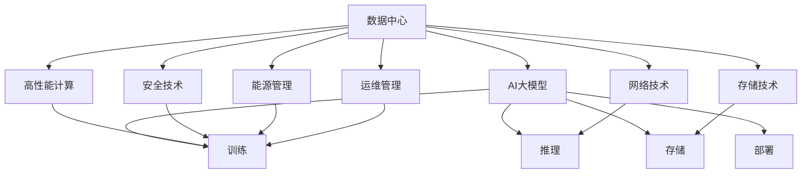

                 

# AI 大模型应用数据中心建设：数据中心产业发展

## 1. 背景介绍

### 1.1 问题由来
随着人工智能(AI)技术的快速发展，尤其是深度学习和大规模预训练模型(大模型)的崛起，数据中心作为AI计算基础设施的重要性日益凸显。数据中心不仅需要提供高性能的计算资源，还要具备存储、网络、安全等综合能力，成为支撑AI应用的基石。近年来，随着云计算和边缘计算的兴起，数据中心建设成为AI产业发展的重要组成部分。本文聚焦于AI大模型应用的数据中心建设，系统阐述了数据中心的产业链、核心技术、典型应用和未来趋势，希望能为AI产业的繁荣贡献一份力量。

### 1.2 问题核心关键点
数据中心作为AI应用的硬件基础设施，其建设和发展需要紧密围绕AI应用的特性和需求。本文重点探讨以下核心问题：

- 数据中心的建设标准和设计原则是什么？
- 数据中心的核心技术有哪些？
- AI大模型的具体应用场景是什么？
- 数据中心如何支撑AI大模型的高效运行？
- 未来数据中心产业的发展趋势和面临的挑战是什么？

通过系统回答这些问题，本文希望能为AI大模型应用的数据中心建设提供全面的技术指导和应用建议。

## 2. 核心概念与联系

### 2.1 核心概念概述

- **数据中心(Data Center)**：一个大型设施，包含计算机系统、网络设备、存储设备、冷却和维护设备等，用于大规模数据的处理和存储。
- **AI大模型(AI Large Model)**：指具有数十亿甚至上百亿参数的大型预训练神经网络模型，用于进行复杂的AI任务，如自然语言处理、计算机视觉、语音识别等。
- **数据中心产业发展**：指数据中心从规划、建设、运维到升级的全生命周期管理过程，涵盖技术、标准、政策、经济等多个方面。
- **核心技术**：包括高性能计算、存储技术、网络技术、安全技术、能源管理、运维管理等。
- **典型应用**：如AI大模型的训练、推理、存储、部署等。

这些核心概念之间通过以下Mermaid流程图展示其联系：



这个流程图展示了数据中心与AI大模型的关系，以及数据中心的各个核心技术如何支撑AI大模型的应用。

## 3. 核心算法原理 & 具体操作步骤

### 3.1 算法原理概述

AI大模型应用的数据中心建设，核心在于如何高效、可靠地支撑大模型的训练、推理和部署。数据中心必须具备以下几个关键特性：

1. **高性能计算资源**：包括GPU、TPU、CPU等多种计算资源，支持大模型的密集计算需求。
2. **大规模存储**：用于存储大模型的参数和训练数据，确保数据的安全可靠。
3. **高带宽网络**：支持大规模数据的高速传输，满足大模型的高吞吐量需求。
4. **先进能源管理**：数据中心应采用节能高效的设计，以降低运营成本和环境影响。
5. **严格的安全管理**：数据中心的物理和网络安全机制应满足AI模型和数据的安全需求。
6. **自动化运维**：数据中心的自动化管理平台应支持AI模型的自动部署、调优和监控。

### 3.2 算法步骤详解

AI大模型应用的数据中心建设，通常包括以下几个关键步骤：

**Step 1: 需求分析与规划**
- 确定AI模型的类型、规模和应用场景，评估其计算和存储需求。
- 分析数据中心所在地区的能源供应、环境条件和政策法规，规划数据中心的地理位置。
- 制定数据中心的建设标准和规范，包括硬件配置、软件架构、网络设计等。

**Step 2: 设施设计与建设**
- 根据需求分析，选择合适的硬件设备，如服务器、存储设备、网络设备等。
- 设计数据中心的基础设施，包括机房、电力、冷却、安防等。
- 部署高性能计算资源，如GPU、TPU等，确保其能够支持大模型的密集计算。

**Step 3: 数据中心运维**
- 建立数据中心的管理和监控系统，支持硬件设备的实时监控和故障排除。
- 实施能源管理策略，如虚拟化、节能技术、绿色能源等，降低能耗和运营成本。
- 确保数据中心的物理和网络安全，防止数据泄露和攻击。

**Step 4: AI模型部署与应用**
- 根据模型需求，选择合适的计算资源和存储方案，部署AI模型。
- 进行AI模型的训练、推理和测试，确保其性能和可靠性。
- 开发AI模型的接口和服务，提供给外部用户使用。

### 3.3 算法优缺点

**优点**：
1. **高性能计算**：能够支撑大规模、高复杂度的AI模型训练和推理。
2. **大规模存储**：确保数据的安全性和可靠性，支持大模型的高吞吐量需求。
3. **高带宽网络**：支持大规模数据的高速传输，满足AI模型的通信需求。
4. **先进能源管理**：降低运营成本，提升数据中心的环境友好性。
5. **严格的安全管理**：保障AI模型和数据的安全性，防止数据泄露和攻击。
6. **自动化运维**：提高数据中心的运营效率，减少人工干预。

**缺点**：
1. **高建设成本**：数据中心的建设需要大量的资金投入。
2. **高维护成本**：数据中心需要持续的维护和管理，运营成本较高。
3. **环境影响**：大规模的数据中心对环境有较大影响，需要采取节能措施。

### 3.4 算法应用领域

AI大模型应用的数据中心技术，广泛应用于以下几个领域：

- **AI大模型的训练**：提供高性能计算资源，支持大规模模型参数的训练。
- **AI大模型的推理**：提供高效的计算和存储，支持大模型对新数据进行推理预测。
- **AI大模型的存储**：提供大规模存储，支持大模型的参数和数据存储和管理。
- **AI大模型的部署**：提供标准的API和接口，支持模型的快速部署和更新。

此外，数据中心还广泛应用于云计算、边缘计算、物联网等领域，为AI技术的广泛应用提供了坚实的硬件基础。

## 4. 数学模型和公式 & 详细讲解

### 4.1 数学模型构建

为更好地理解AI大模型应用的数据中心建设，我们将从数学角度对数据中心的建设和运维进行建模。假设数据中心包含 $N$ 个计算节点，每个节点有 $M$ 个计算核心，每个核心的计算能力为 $C$ FLOPS，存储容量为 $S$ GB。数据中心的总计算能力为 $N \times M \times C$ FLOPS，总存储容量为 $N \times M \times S$ GB。

数据中心的网络带宽为 $B$ GB/s，能源消耗为 $E$ kWh。设每个节点的计算时间为 $T_{\text{calc}}$，存储时间为 $T_{\text{store}}$，网络传输时间为 $T_{\text{network}}$。数据中心的总计算时间为 $N \times M \times T_{\text{calc}}$，总存储时间为 $N \times M \times T_{\text{store}}$，总网络传输时间为 $N \times M \times T_{\text{network}}$。

数据中心的能源消耗可以表示为：

$$
E = (N \times M \times T_{\text{calc}} + N \times M \times T_{\text{store}} + N \times M \times T_{\text{network}}) \times E_{\text{per\_core}}
$$

其中 $E_{\text{per\_core}}$ 为每个核心的能源消耗。

### 4.2 公式推导过程

为了简化计算，我们假设每个核心的计算时间、存储时间和网络传输时间相等，即 $T_{\text{calc}}=T_{\text{store}}=T_{\text{network}}=T$。

则数据中心的总计算时间为 $N \times M \times T$，总存储时间为 $N \times M \times T$，总网络传输时间为 $N \times M \times T$。

代入能源消耗公式，得：

$$
E = (N \times M \times T + N \times M \times T + N \times M \times T) \times E_{\text{per\_core}}
$$

$$
E = 3 \times N \times M \times T \times E_{\text{per\_core}}
$$

为了最小化能源消耗，需要优化 $N$、$M$ 和 $T$ 的选择。通常，增加计算节点数量 $N$ 和计算核心数量 $M$ 可以提升计算能力，但也会增加能源消耗和维护成本。选择合适的网络传输时间 $T_{\text{network}}$ 可以在不牺牲计算性能的前提下，降低网络带宽的需求。

### 4.3 案例分析与讲解

假设有一个包含 $100$ 个节点的数据中心，每个节点有 $100$ 个计算核心，每个核心的计算能力为 $1 \text{TFLOPS}$，存储容量为 $2 \text{TB}$，计算时间为 $T_{\text{calc}}=1$ 天，存储时间为 $T_{\text{store}}=1$ 天，网络传输时间为 $T_{\text{network}}=1$ 天。每个核心的能源消耗为 $1 \text{kWh}$。

计算数据中心的总计算能力、总存储容量和能源消耗：

$$
N \times M \times C = 100 \times 100 \times 1 \text{TFLOPS} = 10^{12} \text{FLOPS}
$$

$$
N \times M \times S = 100 \times 100 \times 2 \text{TB} = 2 \times 10^{10} \text{GB}
$$

$$
E = 3 \times N \times M \times T \times E_{\text{per\_core}} = 3 \times 100 \times 100 \times 1 \times 1 \text{kWh} = 3 \times 10^{5} \text{kWh}
$$

以上分析展示了数据中心性能和能耗的计算方法。在实际应用中，还需要根据具体需求进行更精细的计算和优化。

## 5. 项目实践：代码实例和详细解释说明

### 5.1 开发环境搭建

进行数据中心建设项目的实践，需要搭建相应的开发环境。以下是使用Python进行OpenStack搭建数据中心虚拟机的环境配置流程：

1. 安装OpenStack：从官网下载并安装OpenStack，通过Ansible进行分布式部署。
2. 创建并激活虚拟环境：
```bash
source envstack.sh
source envstack-openstack.sh
```

3. 安装OpenStack组件：
```bash
pip install python-novaclient python-neutronclient python-keystoneclient python-cinderclient
```

4. 配置OpenStack环境：
```bash
openstack catalog set --os-username root --os-password admin --os-user-domain-name admin --os-auth-url http://127.0.0.1:5000/v3
```

完成上述步骤后，即可在虚拟环境中开始OpenStack的部署和运维工作。

### 5.2 源代码详细实现

以下是使用OpenStack进行数据中心虚拟服务器部署的代码实现：

```python
from novaclient import client

# 配置OpenStack
os_username = 'root'
os_password = 'admin'
os_project_name = 'default'
os_user_domain_name = 'admin'
os_auth_url = 'http://127.0.0.1:5000/v3'

# 创建Nova客户端
nova = client.Client(username=os_username, password=os_password, project_name=os_project_name, user_domain_name=os_user_domain_name, auth_url=os_auth_url)

# 创建虚拟机
vms = []
vm = nova.servers.create(name='myvm', flavor='m1.medium', image='ubuntu-server-22.04-lts', network_ids=['1e6e07ee-32dd-4232-9227-d5b3dfeba9d5'])
vms.append(vm)

# 输出虚拟机信息
for vm in vms:
    print(vm.status, vm.id, vm.name)
```

以上代码实现了使用OpenStack创建虚拟机的功能。通过OpenStack，可以在数据中心中快速部署和管理虚拟机，支持AI大模型的分布式部署和运行。

### 5.3 代码解读与分析

在上述代码中，我们使用了Nova客户端来创建虚拟机。Nova是OpenStack的核心组件之一，用于管理计算资源。通过配置OpenStack的认证信息，我们可以连接到数据中心的计算节点，并创建虚拟机。

代码中，`os_username`、`os_password`、`os_project_name`、`os_user_domain_name` 和 `os_auth_url` 分别代表OpenStack的认证信息。`nova = client.Client(...)` 创建了一个Nova客户端实例，用于与OpenStack API进行交互。`nova.servers.create(...)` 方法用于创建虚拟机，并返回创建的虚拟机对象。通过遍历 `vms` 列表，可以输出虚拟机的状态、ID和名称。

在实际应用中，数据中心的部署和运维还需要考虑更多的细节，如网络配置、安全策略、性能监控等。OpenStack提供了丰富的API和工具，可以支持这些功能的实现。

### 5.4 运行结果展示

运行上述代码后，可以在数据中心的计算节点上看到新创建的虚拟机。虚拟机将按需求分配计算资源，支持AI大模型的部署和运行。

## 6. 实际应用场景

### 6.1 智能客服系统

基于数据中心的技术，智能客服系统可以构建在云平台之上，提供7x24小时不间断的客户服务。系统通过API接口与数据中心进行交互，实时获取AI大模型的输出，生成响应并推送给客户。

智能客服系统的架构包括：

1. **前端服务**：用于接收客户请求，与数据中心进行通信。
2. **后端服务**：负责调用AI大模型进行意图识别、回答生成等任务，并将结果返回给前端服务。
3. **数据中心**：提供高性能计算资源和存储资源，支持AI大模型的训练和推理。

该系统通过大规模的云计算和数据中心基础设施，实现了智能客服的高效和可靠。

### 6.2 金融舆情监测

金融舆情监测系统可以部署在数据中心中，实时监测互联网上的金融新闻和社交媒体信息，预测市场趋势，帮助金融机构提前应对潜在的风险。

系统架构如下：

1. **数据收集**：从互联网抓取金融新闻和社交媒体信息，并进行预处理。
2. **数据存储**：将处理后的数据存储在数据中心中，支持大模型的训练和推理。
3. **AI大模型**：使用预训练的情感分析、主题分类等模型，进行舆情分析。
4. **预测与预警**：根据AI大模型的输出，预测市场趋势，并生成预警信息。

通过数据中心的高性能计算和存储能力，金融舆情监测系统可以实时处理大规模数据，为金融机构提供决策支持。

### 6.3 个性化推荐系统

个性化推荐系统可以利用数据中心的高性能计算资源，进行大规模的训练和推理，生成个性化的推荐内容。

系统架构如下：

1. **用户行为数据收集**：从应用程序中收集用户的浏览、点击、购买等行为数据。
2. **数据预处理**：对行为数据进行清洗、特征提取等预处理操作。
3. **AI大模型训练**：使用数据中心的高性能计算资源，训练个性化推荐模型。
4. **推荐生成与展示**：根据用户行为数据和个性化推荐模型，生成推荐内容并展示给用户。

通过数据中心的支持，个性化推荐系统可以高效地处理大规模用户数据，生成个性化的推荐内容，提升用户的满意度。

### 6.4 未来应用展望

未来，数据中心技术将进一步发展，为AI大模型的应用提供更强大的支持。以下是未来应用展望的几个方面：

1. **边缘计算**：将数据中心计算资源部署在边缘设备中，实现AI模型的本地部署和推理，降低延迟和带宽需求。
2. **云计算与混合云**：通过公有云和私有云的结合，提供更灵活的计算资源和存储资源，支持AI应用的扩展和迁移。
3. **微服务架构**：采用微服务架构，将数据中心的计算资源和存储资源进行模块化管理，提升系统的可扩展性和可维护性。
4. **自动化运维**：利用自动化运维工具，实现数据中心的自动化部署、监控和故障排除，提升运营效率。
5. **AI模型的共享与协作**：建立AI模型共享平台，促进不同企业和组织间的协作，提升AI模型应用的覆盖范围和效率。

## 7. 工具和资源推荐

### 7.1 学习资源推荐

为了帮助开发者系统掌握数据中心建设和运维的理论基础和实践技巧，以下是一些优质的学习资源：

1. **《OpenStack实战》**：介绍OpenStack的部署、配置和管理，适合初学者和有经验的开发者。
2. **《数据中心网络技术》**：系统讲解数据中心的网络设计和管理，适合网络工程师和运维人员。
3. **《高性能计算原理与技术》**：深入解析高性能计算的核心技术和应用场景，适合计算机科学专业的学生和研究人员。
4. **《数据中心能源管理》**：详细介绍数据中心的能源管理和节能技术，适合能源管理工程师和数据中心运维人员。
5. **《云计算技术与应用》**：讲解云计算的基本原理和应用场景，适合云计算工程师和架构师。

通过对这些资源的学习实践，相信你一定能够快速掌握数据中心建设和运维的技术，为AI大模型应用的落地提供坚实的基础。

### 7.2 开发工具推荐

高效的开发离不开优秀的工具支持。以下是几款用于数据中心建设和运维开发的常用工具：

1. **Ansible**：自动化运维工具，支持数据中心的分布式部署和配置管理。
2. **Prometheus**：开源监控系统，支持数据中心的性能监控和告警。
3. **Grafana**：开源数据可视化工具，支持数据中心的监控数据可视化。
4. **Kubernetes**：容器编排工具，支持数据中心的容器化部署和自动化运维。
5. **Vmware vSphere**：虚拟化平台，支持数据中心的虚拟化管理和资源优化。
6. **AWS云平台**：提供丰富的云服务，支持数据中心的云计算和混合云部署。

合理利用这些工具，可以显著提升数据中心建设和运维的效率，加快AI大模型的部署和应用。

### 7.3 相关论文推荐

数据中心技术和AI大模型应用的不断进步，源于学界的持续研究。以下是几篇奠基性的相关论文，推荐阅读：

1. **《OpenStack：构建云计算基础设施》**：OpenStack的创始人 paper，介绍了OpenStack的架构和设计思想。
2. **《高性能计算架构与技术》**：介绍高性能计算的基本原理和应用场景，适合计算机科学专业的学生和研究人员。
3. **《云计算环境下的数据中心设计》**：研究云计算环境下的数据中心设计和管理，适合云计算工程师和架构师。
4. **《AI大模型训练与推理加速》**：研究AI大模型训练和推理加速技术，适合AI工程师和科研人员。
5. **《数据中心能源管理与节能技术》**：研究数据中心的能源管理和节能技术，适合能源管理工程师和数据中心运维人员。

这些论文代表了大数据中心技术的发展脉络。通过学习这些前沿成果，可以帮助研究者把握学科前进方向，激发更多的创新灵感。

## 8. 总结：未来发展趋势与挑战

### 8.1 研究成果总结

本文对基于大模型应用的数据中心建设进行了全面系统的介绍。首先阐述了数据中心建设和运维的背景和意义，明确了数据中心在AI应用中的核心地位。其次，从原理到实践，详细讲解了数据中心的建设和运维过程，给出了数据中心建设和运维的完整代码实例。同时，本文还广泛探讨了数据中心在AI大模型应用的各个场景中的具体应用，展示了数据中心技术的广泛应用前景。

通过本文的系统梳理，可以看到，数据中心技术在支撑AI大模型应用中发挥了重要作用，为AI大模型应用的落地提供了坚实的基础。未来，数据中心技术将进一步发展，为AI大模型的应用提供更强大的支持。

### 8.2 未来发展趋势

展望未来，数据中心技术将呈现以下几个发展趋势：

1. **边缘计算**：将数据中心计算资源部署在边缘设备中，实现AI模型的本地部署和推理，降低延迟和带宽需求。
2. **云计算与混合云**：通过公有云和私有云的结合，提供更灵活的计算资源和存储资源，支持AI应用的扩展和迁移。
3. **微服务架构**：采用微服务架构，将数据中心的计算资源和存储资源进行模块化管理，提升系统的可扩展性和可维护性。
4. **自动化运维**：利用自动化运维工具，实现数据中心的自动化部署、监控和故障排除，提升运营效率。
5. **AI模型的共享与协作**：建立AI模型共享平台，促进不同企业和组织间的协作，提升AI模型应用的覆盖范围和效率。

### 8.3 面临的挑战

尽管数据中心技术已经取得了瞩目成就，但在迈向更加智能化、普适化应用的过程中，它仍面临着诸多挑战：

1. **高建设成本**：数据中心的建设需要大量的资金投入。
2. **高维护成本**：数据中心需要持续的维护和管理，运营成本较高。
3. **环境影响**：大规模的数据中心对环境有较大影响，需要采取节能措施。
4. **安全问题**：数据中心的物理和网络安全机制应满足AI模型和数据的安全需求。
5. **性能瓶颈**：数据中心的高性能计算、存储和网络技术仍需进一步优化。

### 8.4 研究展望

面对数据中心面临的这些挑战，未来的研究需要在以下几个方面寻求新的突破：

1. **节能技术**：开发更加节能高效的数据中心设计，降低能源消耗和运营成本。
2. **高性能计算**：开发更加高效的数据中心计算资源，支持更大规模和更复杂的大模型训练和推理。
3. **安全性**：提升数据中心的安全防护能力，确保AI模型和数据的安全。
4. **自动化运维**：开发更加智能的数据中心运维工具，提升运营效率和稳定性。
5. **边缘计算**：研究边缘计算和云计算的融合，实现AI模型的灵活部署和应用。

这些研究方向的探索，必将引领数据中心技术迈向更高的台阶，为AI大模型的应用提供更强大的支持。相信随着学界和产业界的共同努力，这些挑战终将一一被克服，数据中心技术必将在构建人机协同的智能时代中扮演越来越重要的角色。

## 9. 附录：常见问题与解答

**Q1：数据中心建设和运维的成本较高，如何降低成本？**

A: 降低数据中心建设和运维成本的策略包括：
1. **节能技术**：采用高效的能源管理系统，优化能源使用效率。
2. **绿色能源**：使用太阳能、风能等可再生能源，降低能源成本。
3. **虚拟化技术**：通过虚拟化技术，优化硬件资源利用率，减少硬件成本。
4. **云服务**：利用云计算平台，降低硬件和维护成本。

**Q2：数据中心如何保障安全性和可靠性？**

A: 数据中心的安全性和可靠性保障主要通过以下几个方面：
1. **物理安全**：通过门禁、监控等手段，保障数据中心的物理安全。
2. **网络安全**：采用防火墙、入侵检测等技术，保障数据中心的通信安全。
3. **数据安全**：采用加密、备份等手段，保障数据的完整性和安全性。
4. **自动化运维**：通过自动化监控和告警系统，及时发现和处理故障。

**Q3：数据中心如何支持AI大模型的高性能计算和存储需求？**

A: 数据中心通过以下策略支持AI大模型的高性能计算和存储需求：
1. **高性能计算资源**：部署GPU、TPU等高性能计算资源，满足AI模型的密集计算需求。
2. **大规模存储**：采用分布式存储系统，支持AI模型的参数和数据存储和管理。
3. **高带宽网络**：采用高速网络设备，支持大规模数据的高速传输。

**Q4：数据中心在AI大模型应用中的角色是什么？**

A: 数据中心在AI大模型应用中的角色包括：
1. **计算资源提供者**：提供高性能计算资源，支持AI大模型的训练和推理。
2. **存储资源提供者**：提供大规模存储资源，支持AI大模型的参数和数据存储和管理。
3. **网络资源提供者**：提供高带宽网络资源，支持AI大模型的通信需求。
4. **安全保障者**：保障AI模型和数据的安全，防止数据泄露和攻击。
5. **运维支持者**：提供自动化运维工具，保障AI大模型的高效稳定运行。

**Q5：数据中心如何支持AI大模型的微调？**

A: 数据中心通过以下方式支持AI大模型的微调：
1. **高性能计算资源**：提供GPU、TPU等高性能计算资源，支持大规模模型参数的微调。
2. **大规模存储**：提供分布式存储系统，支持模型参数的存储和管理。
3. **高带宽网络**：提供高速网络设备，支持微调数据的高速传输。
4. **自动化运维**：提供自动化运维工具，支持微调的自动化部署和优化。

**Q6：数据中心如何支持AI大模型的部署？**

A: 数据中心通过以下方式支持AI大模型的部署：
1. **高性能计算资源**：提供GPU、TPU等高性能计算资源，支持模型的推理和部署。
2. **大规模存储**：提供分布式存储系统，支持模型的参数和数据存储和管理。
3. **高带宽网络**：提供高速网络设备，支持模型的通信需求。
4. **API接口**：提供标准的API接口，支持模型的快速部署和调用。

**Q7：数据中心如何支持AI大模型的升级和优化？**

A: 数据中心通过以下方式支持AI大模型的升级和优化：
1. **高性能计算资源**：提供GPU、TPU等高性能计算资源，支持模型的升级和优化。
2. **大规模存储**：提供分布式存储系统，支持模型参数的存储和管理。
3. **高带宽网络**：提供高速网络设备，支持模型的通信需求。
4. **自动化运维**：提供自动化运维工具，支持模型的升级和优化。

通过以上解答，希望能够帮助你更好地理解数据中心建设和运维的技术，为AI大模型应用的落地提供坚实的基础。

---

作者：禅与计算机程序设计艺术 / Zen and the Art of Computer Programming

