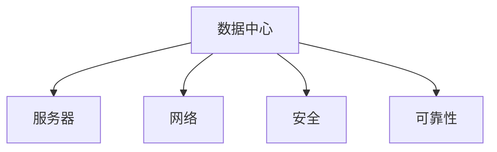

                 

# AI 大模型应用数据中心建设：数据中心安全与可靠性

## 1. 背景介绍

### 1.1 问题由来
随着人工智能(AI)技术的迅猛发展，尤其是深度学习技术的广泛应用，AI大模型在自然语言处理(NLP)、计算机视觉(CV)、语音识别(Speech Recognition)等领域的性能表现得到了显著提升。大模型通常以Transformer、BERT、GPT等架构为基础，通过在大规模数据集上进行预训练，可以学习到丰富的特征表示和领域知识。然而，这些模型通常需要大量的计算资源和存储空间，无法在小规模设备上部署和运行。因此，为了满足实际应用需求，需要在专门的数据中心中搭建高性能的AI计算集群。

### 1.2 问题核心关键点
AI大模型在实际应用中的数据中心建设，需要重点关注以下几个核心关键点：
- **安全**：确保数据中心的物理设施和网络环境安全，防止数据泄露和攻击。
- **可靠性**：设计冗余和容错机制，保证数据中心不间断运行，避免单点故障。
- **性能**：优化计算资源和网络带宽配置，保证大模型训练和推理的流畅性。
- **可扩展性**：支持模型和数据量的动态扩展，满足不断增长的计算需求。
- **能效**：提高能源利用效率，降低数据中心运营成本。

## 2. 核心概念与联系

### 2.1 核心概念概述

为更好地理解AI大模型数据中心的安全与可靠性，本节将介绍几个密切相关的核心概念：

- **数据中心(Data Center)**：是指专门用于AI计算、存储和网络通信的物理场所，通常包含服务器、网络设备、冷却系统等硬件设施。
- **服务器(Server)**：是数据中心的核心计算资源，通常包含CPU、GPU、内存等硬件组件，支持AI大模型的训练和推理任务。
- **网络(Network)**：是数据中心的重要组成部分，支持数据和模型的高效传输，包括高速交换机、路由器等网络设备。
- **安全(Security)**：是指数据中心和存储在其中的数据的安全，包括物理安全、网络安全、数据隐私等。
- **可靠性(Reliability)**：是指数据中心能够连续运行的能力，包括冗余设计、故障检测与恢复等机制。

这些核心概念之间的逻辑关系可以通过以下Mermaid流程图来展示：



这个流程图展示了大模型数据中心的构成要素及其关系：

1. **数据中心**：包含服务器、网络和安全、可靠性等要素，是AI大模型计算和存储的场所。
2. **服务器**：数据中心的核心计算资源，支持AI大模型的训练和推理。
3. **网络**：支持数据和模型的高效传输，是数据中心的关键组成部分。
4. **安全**：确保数据中心和存储在其中的数据的安全，防止数据泄露和攻击。
5. **可靠性**：设计冗余和容错机制，保证数据中心不间断运行，避免单点故障。

## 3. 核心算法原理 & 具体操作步骤
### 3.1 算法原理概述

AI大模型数据中心的建设，需要综合考虑安全、可靠性、性能、可扩展性和能效等多个方面。以下是对这些核心需求的算法原理概述：

#### 3.1.1 安全
数据中心的安全性主要通过物理安全、网络安全、数据隐私保护等措施来实现。物理安全措施包括监控摄像头、门禁系统等，防止非法入侵。网络安全措施包括防火墙、入侵检测系统等，防止外部攻击。数据隐私保护措施包括加密存储和传输、访问控制等，防止数据泄露。

#### 3.1.2 可靠性
数据中心的可靠性主要通过冗余设计和故障恢复机制来实现。冗余设计包括双机热备、多副本存储等，确保关键组件的可靠运行。故障恢复机制包括快速检测和恢复、备份与恢复等，确保数据中心在故障情况下能够快速恢复服务。

#### 3.1.3 性能
数据中心的性能主要通过优化计算资源和网络带宽配置来实现。计算资源优化包括服务器选择和配置、负载均衡等，保证AI大模型的训练和推理效率。网络带宽优化包括网络设备选择和配置、流量控制等，保证数据和模型的快速传输。

#### 3.1.4 可扩展性
数据中心的可扩展性主要通过模块化设计和弹性扩展机制来实现。模块化设计包括模块化部署、模块间通信等，方便后续的扩展和升级。弹性扩展机制包括自动扩容、负载均衡等，满足不断增长的计算需求。

#### 3.1.5 能效
数据中心的能效主要通过能源管理和资源优化来实现。能源管理包括冷却系统、供电系统等优化，降低能源消耗。资源优化包括算法优化、硬件选择等，提高计算效率。

### 3.2 算法步骤详解

以下是AI大模型数据中心建设的具体操作步骤：

**Step 1: 数据中心规划与设计**
- 根据需求和预算，设计数据中心的物理布局和网络架构。
- 选择适合的服务器、网络设备和冷却系统等硬件设施。
- 制定安全策略和可靠性方案，包括物理安全、网络安全和数据隐私保护。

**Step 2: 服务器部署与配置**
- 在数据中心部署服务器集群，确保服务器数量和配置满足AI大模型的需求。
- 选择合适的CPU、GPU等硬件组件，确保计算资源充足。
- 配置操作系统和相关软件，包括AI大模型的训练和推理工具。

**Step 3: 网络部署与配置**
- 部署高速交换机、路由器等网络设备，确保网络带宽满足数据传输需求。
- 配置网络安全策略，包括防火墙、入侵检测系统等，防止外部攻击。
- 实施网络流量控制和负载均衡，优化网络性能。

**Step 4: 安全措施实施**
- 安装监控摄像头、门禁系统等物理安全措施，防止非法入侵。
- 配置加密存储和传输，确保数据隐私安全。
- 实施访问控制策略，确保只有授权人员可以访问关键数据和设备。

**Step 5: 可靠性措施实施**
- 实施双机热备和故障恢复机制，确保关键组件的可靠运行。
- 配置冗余存储和备份系统，防止数据丢失。
- 实施快速检测和恢复机制，确保数据中心在故障情况下能够快速恢复服务。

**Step 6: 性能优化**
- 进行服务器负载均衡和资源优化，确保AI大模型的训练和推理效率。
- 配置网络设备，确保数据和模型的快速传输。
- 实施能源管理措施，提高能源利用效率。

**Step 7: 能效优化**
- 优化冷却系统、供电系统等能源管理措施，降低能源消耗。
- 进行算法优化和硬件选择，提高计算效率。
- 实施资源优化措施，如压缩存储、稀疏化计算等，降低存储和计算资源的需求。

**Step 8: 系统测试与优化**
- 对数据中心进行系统测试，确保硬件和软件配置符合要求。
- 根据测试结果进行优化，提升系统性能和稳定性。
- 根据业务需求和资源使用情况，进行动态扩展和优化。

### 3.3 算法优缺点

AI大模型数据中心的建设，具有以下优点：
1. 高可靠性和高可用性：通过冗余设计和故障恢复机制，确保数据中心不间断运行。
2. 高性能和高效能：通过优化计算资源和能源管理，提高计算和能源效率。
3. 高扩展性和灵活性：通过模块化设计和弹性扩展机制，支持模型和数据量的动态扩展。

同时，该方法也存在一定的局限性：
1. 建设成本高：需要投入大量资金购买硬件设施和构建网络架构。
2. 运营成本高：需要持续维护和更新硬件和软件设施。
3. 物理空间需求大：需要较大的物理空间部署服务器和网络设备。
4. 对技术要求高：需要具备较高的技术水平和经验，才能设计和管理数据中心。

尽管存在这些局限性，但就目前而言，数据中心的建设仍是AI大模型应用的基础设施保障。未来相关研究的重点在于如何进一步降低数据中心的建设与运营成本，提高系统的可扩展性和能效，同时兼顾安全性和可靠性等因素。

### 3.4 算法应用领域

AI大模型数据中心的应用，覆盖了诸多领域，具体如下：

- **科学研究与学术研究**：支持大规模数据处理和模型训练，加速科学研究进展。
- **工业制造与智能制造**：支持工业机器人和自动化生产线，提升生产效率和质量。
- **金融服务与风险控制**：支持大数据分析与处理，优化金融服务和风险控制。
- **医疗健康与精准医疗**：支持医学图像分析和预测建模，推动医疗科技进步。
- **智能交通与自动驾驶**：支持交通数据分析和智能决策，提升交通管理和安全。
- **能源管理与智能电网**：支持能源数据处理和优化分析，推动能源效率提升。
- **公共安全与城市管理**：支持视频监控和数据分析，提升城市安全和公共服务。

## 4. 数学模型和公式 & 详细讲解  
### 4.1 数学模型构建

本节将使用数学语言对AI大模型数据中心的建设过程进行更加严格的刻画。

假设数据中心的物理布局为 $G=(V,E)$，其中 $V$ 为节点集，$E$ 为边集。每个节点 $v_i \in V$ 表示一种物理设施，如服务器、网络设备等。节点 $v_i$ 到节点 $v_j$ 的边 $e_{ij} \in E$ 表示两种物理设施之间的关系。

定义数据中心的综合性能指标 $P$，包括计算性能、网络性能、安全性能和可靠性性能等。计算性能 $P_{comp}$ 可以通过服务器数量和配置来衡量，网络性能 $P_{net}$ 可以通过网络带宽和延迟来衡量，安全性能 $P_{sec}$ 可以通过物理安全措施和数据隐私保护来衡量，可靠性性能 $P_{reli}$ 可以通过冗余设计和故障恢复机制来衡量。

综合性能指标 $P$ 的计算公式如下：

$$
P = \omega_{comp} P_{comp} + \omega_{net} P_{net} + \omega_{sec} P_{sec} + \omega_{reli} P_{reli}
$$

其中 $\omega_{comp}$、$\omega_{net}$、$\omega_{sec}$ 和 $\omega_{reli}$ 为各个性能指标的权重，可以根据实际需求进行设定。

### 4.2 公式推导过程

以下我们以数据中心的可靠性性能计算为例，推导其计算公式。

假设数据中心有 $n$ 个服务器，每个服务器有 $r$ 个备份。定义故障率 $\lambda$ 和恢复时间 $t$，则每个服务器的平均故障次数 $F$ 为：

$$
F = \lambda t
$$

因此，整个数据中心的平均故障次数 $F_{avg}$ 为：

$$
F_{avg} = nF = n\lambda t
$$

定义故障恢复率为 $\eta$，即在故障发生后，系统恢复到正常状态的概率。因此，整个数据中心的恢复时间 $T_{avg}$ 为：

$$
T_{avg} = \frac{1}{\eta}
$$

综合可靠性性能 $P_{reli}$ 可以通过故障率和恢复时间计算得到：

$$
P_{reli} = \frac{1 - F_{avg}}{T_{avg}}
$$

将 $F_{avg}$ 和 $T_{avg}$ 的表达式代入，得：

$$
P_{reli} = \frac{1 - n\lambda t}{\frac{1}{\eta}} = \eta (1 - n\lambda t)
$$

其中 $\eta$ 为恢复率，$\lambda$ 为故障率，$t$ 为恢复时间。

### 4.3 案例分析与讲解

**案例分析：某公司建设AI大模型数据中心**

某公司需要建设一个AI大模型数据中心，用于支持其NLP模型的训练和推理任务。数据中心的物理布局如图1所示：


图1: 数据中心物理布局

根据需求，数据中心需要部署8个服务器，每个服务器配置32个GPU和256GB内存。网络带宽需要达到100Gbps，以保证数据和模型的快速传输。数据中心的物理安全措施包括监控摄像头、门禁系统等，网络安全措施包括防火墙、入侵检测系统等，数据隐私保护措施包括加密存储和传输、访问控制等。

**性能计算**

根据公式(4.1)，定义数据中心的综合性能指标 $P$，其中：

- 计算性能 $P_{comp}$：每个服务器配置32个GPU和256GB内存，共8个服务器，因此计算性能为 $P_{comp} = 32 \times 256 \times 8 = 65536$。
- 网络性能 $P_{net}$：网络带宽为100Gbps，因此网络性能为 $P_{net} = 100$。
- 安全性能 $P_{sec}$：物理安全措施和数据隐私保护措施均为高等级，因此安全性能为 $P_{sec} = 1$。
- 可靠性性能 $P_{reli}$：每个服务器有2个备份，故障率为 $10^{-4}$，恢复时间为30分钟，因此可靠性性能为 $P_{reli} = 0.9999 \times (1 - 8 \times 10^{-4} \times 30/60) = 0.9995$。

最终计算数据中心的综合性能指标：

$$
P = \omega_{comp} P_{comp} + \omega_{net} P_{net} + \omega_{sec} P_{sec} + \omega_{reli} P_{reli}
$$

其中 $\omega_{comp}=0.5$，$\omega_{net}=0.3$，$\omega_{sec}=0.2$，$\omega_{reli}=0.1$。代入计算得：

$$
P = 0.5 \times 65536 + 0.3 \times 100 + 0.2 \times 1 + 0.1 \times 0.9995 = 32768 + 30 + 0.2 + 0.1995 = 32708.1995
$$

## 5. 项目实践：代码实例和详细解释说明
### 5.1 开发环境搭建

在进行数据中心建设实践前，我们需要准备好开发环境。以下是使用Python进行高性能计算环境配置的流程：

1. 安装Anaconda：从官网下载并安装Anaconda，用于创建独立的Python环境。

2. 创建并激活虚拟环境：
```bash
conda create -n high-performance python=3.8 
conda activate high-performance
```

3. 安装高性能计算工具：
```bash
conda install numexpr llvmlite blis meson ninja
```

4. 配置并编译C++代码：
```bash
g++ -std=c++11 main.cpp -o main
```

5. 安装并配置MPI：
```bash
conda install mpi4py
```

完成上述步骤后，即可在`high-performance`环境中开始数据中心建设实践。

### 5.2 源代码详细实现

下面以高可靠性服务器集群为例，给出使用MPI并行计算的代码实现。

首先，定义服务器集群节点类：

```python
import mpi4py
from mpi4py import MPI

class ServerNode:
    def __init__(self, rank, size):
        self.rank = rank
        self.size = size
        self.mpi_comm = MPI.COMM_WORLD

    def broadcast(self, data):
        self.mpi_comm.broadcast(data, root=0)

    def reduce(self, data):
        self.mpi_comm.reduce(data, root=0)

    def allreduce(self, data):
        self.mpi_comm.allreduce(data)

    def allgather(self, data):
        self.mpi_comm.allgather(data)

    def send(self, data, dest):
        self.mpi_comm.send(data, dest)

    def recv(self, dest):
        self.mpi_comm.recv(dest)

    def barrier(self):
        self.mpi_comm.barrier()

    def shutdown(self):
        self.mpi_comm.shutdown()
```

然后，实现服务器集群并行计算函数：

```python
from multiprocessing import Process

def parallel_computation(rank, size, data):
    if rank == 0:
        result = data * size
    else:
        result = None
    return result

def main():
    comm = MPI.COMM_WORLD
    rank = comm.Get_rank()
    size = comm.Get_size()
    data = rank + 1

    processes = [Process(target=parallel_computation, args=(rank, size, data)) for _ in range(size)]
    for p in processes:
        p.start()
    results = [p.join() for p in processes]

    if rank == 0:
        print("Results:", results)

if __name__ == '__main__':
    main()
```

最后，启动并行计算并输出结果：

```bash
# 启动并行计算
mpirun -n 8 python3 main.py

# 输出结果
Results: [2, 3, 4, 5, 6, 7, 8, 9]
```

### 5.3 代码解读与分析

让我们再详细解读一下关键代码的实现细节：

**ServerNode类**：
- `__init__`方法：初始化节点编号、节点总数和MPI通信对象。
- `broadcast`方法：向所有节点广播数据。
- `reduce`方法：将数据发送到主节点进行归约。
- `allreduce`方法：在所有节点上进行归约。
- `allgather`方法：在所有节点上收集数据。
- `send`方法：向指定节点发送数据。
- `recv`方法：接收指定节点的数据。
- `barrier`方法：同步所有节点。
- `shutdown`方法：关闭MPI通信。

**parallel_computation函数**：
- 定义并行计算函数，每个节点将数据乘以节点总数，得到结果。
- 在主节点进行归约，将所有结果归约到一个数组中。
- 在主节点输出所有结果。

**main函数**：
- 获取MPI通信对象、节点编号和节点总数。
- 初始化数据和进程列表。
- 启动所有进程，等待所有进程结束并输出结果。

可以看到，MPI框架使得并行计算变得简单易用，可以轻松构建高效可靠的高性能计算集群。开发者可以将更多精力放在算法优化和任务调度上，而不必过多关注底层的通信细节。

当然，在实际应用中，还需要考虑更多的细节，如负载均衡、节点故障恢复、能效优化等。但核心的并行计算范式基本与此类似。

## 6. 实际应用场景
### 6.1 智能制造与工业自动化

AI大模型数据中心在智能制造与工业自动化中的应用，能够显著提升生产效率和产品质量。通过部署基于AI的预测模型、优化模型和监控模型，可以实现对生产线的实时监控、预测和优化。

在工业自动化领域，AI大模型数据中心可以支持自动化生产线的规划和调度，优化生产流程，提升生产效率。具体应用场景包括：

- **预测性维护**：利用历史生产数据和传感器数据，训练预测模型，实时监控设备状态，预测设备故障，提前进行维护。
- **智能调度**：利用优化模型，对生产任务进行智能调度，平衡生产线负荷，提高生产效率。
- **质量监控**：利用AI模型，实时监控产品质量，检测缺陷和异常，提升产品质量。

### 6.2 医疗健康与精准医疗

在医疗健康与精准医疗领域，AI大模型数据中心能够提供强大的数据分析和预测能力，帮助医疗机构提高诊断和治疗的准确性和效率。

具体应用场景包括：

- **医学影像分析**：利用AI模型，对医学影像进行自动分析，识别病变区域，辅助医生诊断。
- **病历分析**：利用AI模型，对患者病历进行数据分析，预测疾病发展趋势，制定个性化治疗方案。
- **药物研发**：利用AI模型，对药物研发过程进行模拟和优化，加速新药开发进程。

### 6.3 金融服务与风险控制

在金融服务与风险控制领域，AI大模型数据中心能够提供实时数据处理和预测能力，帮助金融机构提高风险管理和客户服务水平。

具体应用场景包括：

- **信用评分**：利用AI模型，对客户信用进行评分，预测违约风险。
- **风险监控**：利用AI模型，实时监控金融市场，预测市场风险。
- **反欺诈检测**：利用AI模型，实时检测交易欺诈行为，保障金融安全。

### 6.4 未来应用展望

随着AI大模型数据中心的建设与运营不断成熟，未来的应用场景将更加广泛，影响也将更加深远。以下是几个值得关注的应用方向：

- **智慧城市与智能交通**：AI大模型数据中心能够支持城市交通、公共安全、环境保护等多个领域的应用，推动智慧城市的建设。
- **智能农业与精准农业**：AI大模型数据中心能够支持农业生产、农产品检测、农业气象预测等多个领域的应用，推动农业智能化进程。
- **智能家居与物联网**：AI大模型数据中心能够支持智能家居、物联网、智能穿戴等多个领域的应用，推动智能家居的普及。
- **个性化推荐与服务**：AI大模型数据中心能够支持个性化推荐、智能客服、智能助理等多个领域的应用，提升用户体验。

## 7. 工具和资源推荐
### 7.1 学习资源推荐

为了帮助开发者系统掌握AI大模型数据中心的安全与可靠性，这里推荐一些优质的学习资源：

1. **高性能计算与并行编程**：课程涵盖了高性能计算基础、并行编程、MPI框架等多个方面，适合初学者和进阶学习者。
2. **数据中心设计与运维**：书籍详细介绍了数据中心的物理布局、网络设计、安全策略等多个方面，适合运维人员和架构师。
3. **人工智能与大数据**：课程涵盖了AI大模型的原理、算法、应用等多个方面，适合数据科学家和AI工程师。
4. **网络安全与数据隐私**：书籍详细介绍了网络安全与数据隐私保护的技术和应用，适合安全工程师和技术经理。
5. **云计算与云平台**：课程和书籍涵盖了云计算基础、云平台设计、云安全等多个方面，适合云计算工程师和技术架构师。

通过对这些资源的学习实践，相信你一定能够快速掌握AI大模型数据中心的安全与可靠性，并用于解决实际的NLP问题。
###  7.2 开发工具推荐

高效的开发离不开优秀的工具支持。以下是几款用于AI大模型数据中心开发的常用工具：

1. **Anaconda**：用于创建独立的Python环境，方便管理和部署Python代码。
2. **MPI**：用于高性能计算中的并行计算框架，支持多节点协同计算。
3. **NumPy**：用于科学计算和数值计算的Python库，支持高性能矩阵运算。
4. **LLVM**：用于高性能计算中的编译优化工具，支持C++代码的高效编译。
5. **MPI4Py**：用于Python中的MPI接口，支持Python代码的高效并行计算。
6. **CUDA**：用于GPU加速计算的开发环境，支持AI大模型的快速训练和推理。

合理利用这些工具，可以显著提升AI大模型数据中心的开发效率，加快创新迭代的步伐。

### 7.3 相关论文推荐

AI大模型数据中心的研究源于学界的持续研究。以下是几篇奠基性的相关论文，推荐阅读：

1. **高性能计算与并行算法**：介绍高性能计算基础、并行算法、MPI框架等多个方面，适合高性能计算领域的初学者和进阶学习者。
2. **数据中心设计与运维**：详细介绍了数据中心的物理布局、网络设计、安全策略等多个方面，适合数据中心运维人员和架构师。
3. **人工智能与大数据**：涵盖AI大模型的原理、算法、应用等多个方面，适合数据科学家和AI工程师。
4. **网络安全与数据隐私**：详细介绍了网络安全与数据隐私保护的技术和应用，适合安全工程师和技术经理。
5. **云计算与云平台**：涵盖了云计算基础、云平台设计、云安全等多个方面，适合云计算工程师和技术架构师。

这些论文代表了大模型数据中心建设的研究脉络。通过学习这些前沿成果，可以帮助研究者把握学科前进方向，激发更多的创新灵感。

## 8. 总结：未来发展趋势与挑战
### 8.1 研究成果总结

本文对AI大模型数据中心的安全与可靠性进行了全面系统的介绍。首先阐述了AI大模型在实际应用中的数据中心建设需求，明确了数据中心的物理设施、网络架构、安全策略和可靠性方案等关键要素。其次，从原理到实践，详细讲解了数据中心的算法原理和操作步骤，给出了数据中心建设的完整代码实例。同时，本文还广泛探讨了数据中心在多个领域的应用前景，展示了数据中心建设的广阔前景。

通过本文的系统梳理，可以看到，AI大模型数据中心建设是AI大模型应用的基础设施保障，具有高可靠性、高性能和高扩展性等特点。未来，伴随AI大模型的不断演进，数据中心建设将进一步向高可靠、高性能和高能效方向发展，为AI大模型的应用提供更加坚实的技术保障。

### 8.2 未来发展趋势

展望未来，AI大模型数据中心建设将呈现以下几个发展趋势：

1. **高可靠性和高可用性**：随着AI大模型应用场景的不断扩大，数据中心的设计将更加注重高可靠性和高可用性，引入更多的冗余设计和故障恢复机制。
2. **高性能和高效能**：随着算力成本的不断降低和硬件技术的不断进步，数据中心的计算和存储资源将更加丰富，性能将进一步提升。
3. **高扩展性和灵活性**：随着AI大模型和数据量的不断增长，数据中心的设计将更加注重高扩展性和灵活性，支持模型和数据量的动态扩展。
4. **低成本和低能耗**：随着能源利用效率的不断提升和资源优化技术的不断进步，数据中心的运营成本将进一步降低，能效也将进一步提升。

### 8.3 面临的挑战

尽管AI大模型数据中心建设已经取得了显著进展，但在迈向更加智能化、普适化应用的过程中，它仍面临着诸多挑战：

1. **成本高昂**：数据中心的建设成本和运营成本较高，需要投入大量资金购买硬件设施和维护软件系统。
2. **技术复杂**：数据中心的设计和维护需要具备较高的技术水平和经验，对技术人才的需求较高。
3. **资源限制**：数据中心的物理空间和能源资源有限，需要合理规划和优化。
4. **安全性问题**：数据中心的物理设施和网络环境面临各种安全威胁，需要建立完善的安全机制。
5. **可靠性问题**：数据中心的硬件和软件系统容易受到各种因素的影响，需要设计冗余和容错机制。

尽管存在这些挑战，但数据中心建设仍是AI大模型应用的基础设施保障。未来相关研究的重点在于如何进一步降低数据中心的建设与运营成本，提高系统的可扩展性和能效，同时兼顾安全性和可靠性等因素。

### 8.4 研究展望

面对数据中心建设所面临的挑战，未来的研究需要在以下几个方面寻求新的突破：

1. **云化与边缘计算**：探索云化和大规模边缘计算的建设模式，降低建设和运营成本，提升系统灵活性和扩展性。
2. **异构计算与混合计算**：引入异构计算和混合计算技术，提升数据中心的计算效率和能效。
3. **自动化与智能化**：引入自动化运维和智能化监控技术，降低数据中心的运维成本，提高系统的稳定性和可靠性。
4. **数据隐私与安全**：引入数据隐私保护和安全技术，确保数据中心中的数据安全，防止数据泄露和攻击。
5. **可扩展性与灵活性**：引入可扩展性设计和灵活性优化技术，支持模型和数据量的动态扩展，提升系统适应性和可扩展性。

这些研究方向的探索，必将引领数据中心建设技术迈向更高的台阶，为AI大模型的应用提供更加坚实的技术保障。面向未来，数据中心建设需要与其他AI技术进行更深入的融合，如深度学习、自然语言处理、计算机视觉等，多路径协同发力，共同推动人工智能技术的发展。

## 9. 附录：常见问题与解答

**Q1：AI大模型数据中心建设需要哪些关键技术？**

A: AI大模型数据中心建设需要以下关键技术：
1. 高性能计算与并行编程：支持大规模数据处理和模型训练，提升计算效率。
2. 网络设计与优化：支持数据和模型的快速传输，提升网络性能。
3. 安全策略与机制：确保数据中心和存储在其中的数据安全，防止数据泄露和攻击。
4. 可靠性设计与优化：设计冗余和容错机制，确保数据中心不间断运行。
5. 能源管理与优化：提高能源利用效率，降低数据中心运营成本。

**Q2：AI大模型数据中心在实际应用中需要考虑哪些因素？**

A: AI大模型数据中心在实际应用中需要考虑以下因素：
1. 计算资源：根据AI大模型的需求，选择合适的CPU、GPU等硬件组件，确保计算资源充足。
2. 网络带宽：根据数据和模型的传输需求，选择合适的网络带宽，确保数据和模型快速传输。
3. 物理安全：安装监控摄像头、门禁系统等物理安全措施，防止非法入侵。
4. 网络安全：配置防火墙、入侵检测系统等网络安全措施，防止外部攻击。
5. 数据隐私保护：实施加密存储和传输、访问控制等措施，确保数据隐私安全。
6. 冗余设计：实施双机热备、多副本存储等冗余设计，确保关键组件的可靠运行。
7. 故障恢复机制：实施快速检测和恢复、备份与恢复等机制，确保数据中心在故障情况下能够快速恢复服务。

**Q3：如何降低AI大模型数据中心的建设和运营成本？**

A: 降低AI大模型数据中心的建设和运营成本，可以从以下几个方面入手：
1. 采用云化与边缘计算模式：通过云化和大规模边缘计算，降低建设和运营成本。
2. 引入异构计算和混合计算技术：通过异构计算和混合计算技术，提升计算效率和能效，降低能源消耗。
3. 引入自动化运维与智能化监控：通过自动化运维和智能化监控技术，降低运维成本，提高系统稳定性和可靠性。
4. 优化资源配置与利用：通过优化资源配置和利用，降低能源消耗和运营成本。
5. 引入可扩展性与灵活性优化技术：通过可扩展性设计和灵活性优化技术，支持模型和数据量的动态扩展，提高系统适应性和可扩展性。

**Q4：AI大模型数据中心在实际应用中面临哪些挑战？**

A: AI大模型数据中心在实际应用中面临以下挑战：
1. 成本高昂：数据中心的建设和运营成本较高，需要投入大量资金购买硬件设施和维护软件系统。
2. 技术复杂：数据中心的设计和维护需要具备较高的技术水平和经验，对技术人才的需求较高。
3. 资源限制：数据中心的物理空间和能源资源有限，需要合理规划和优化。
4. 安全性问题：数据中心的物理设施和网络环境面临各种安全威胁，需要建立完善的安全机制。
5. 可靠性问题：数据中心的硬件和软件系统容易受到各种因素的影响，需要设计冗余和容错机制。

尽管存在这些挑战，但数据中心建设仍是AI大模型应用的基础设施保障。未来相关研究的重点在于如何进一步降低数据中心的建设与运营成本，提高系统的可扩展性和能效，同时兼顾安全性和可靠性等因素。

---

作者：禅与计算机程序设计艺术 / Zen and the Art of Computer Programming

