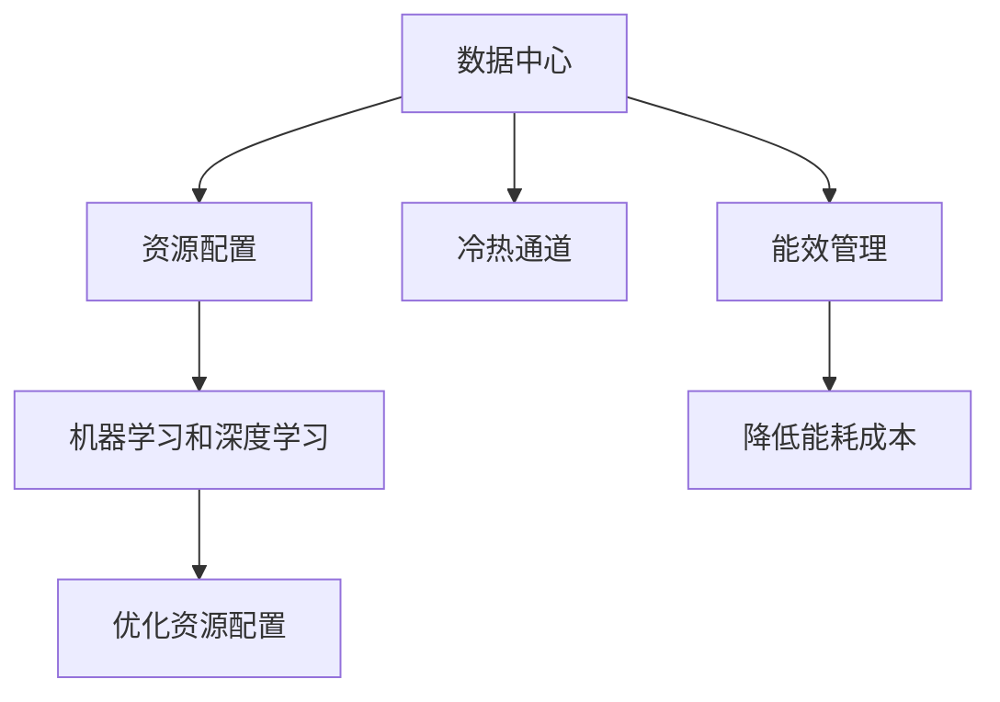

                 

# AI 大模型应用数据中心建设：数据中心成本优化

> 关键词：AI大模型、数据中心、成本优化、能效管理、冷热通道、机器学习、深度学习、神经网络

## 1. 背景介绍

随着人工智能(AI)技术的发展，深度学习和神经网络等大模型成为了AI应用的核心驱动力。数据中心作为AI模型训练和推理的基础设施，其能效管理、成本优化和资源配置，成为AI应用成功的重要保障。

近年来，随着AI大模型的规模不断增大，对数据中心的需求也愈发增长，特别是高性能计算和海量存储的需求使得数据中心运营成本不断攀升。据统计，AI模型训练和推理的计算需求每四年增长一倍，而数据中心的建设、运维成本也在同步增长。因此，如何优化数据中心建设、降低能耗和运营成本，成为AI应用中的关键问题。

本文将全面探讨AI大模型应用中的数据中心建设问题，详细介绍数据中心的成本优化策略，以及如何通过能效管理、冷热通道、资源配置等手段，实现数据中心成本的最小化和效能最大化。

## 2. 核心概念与联系

### 2.1 核心概念概述

在进行数据中心成本优化前，首先需要理解几个核心概念：

- **数据中心**：由一组服务器、存储设备、网络设备和能源系统组成的计算中心，负责处理海量数据的存储、计算和传输。

- **能效管理**：通过优化数据中心的能源消耗，提高能源利用效率，降低能耗成本。

- **冷热通道技术**：通过冷热通道的布局设计，提升数据中心的散热效率，降低制冷成本。

- **资源配置**：合理分配计算资源、存储资源和网络资源，以支持AI大模型的训练和推理需求。

- **机器学习和深度学习**：利用AI技术对数据中心资源进行动态管理和优化，以提升资源利用率和效率。

这些概念之间的逻辑关系可以通过以下Mermaid流程图来展示：



该流程图展示了大模型应用中数据中心的各个组件和优化手段：

1. **数据中心**：核心计算节点，负责存储、计算和传输数据。
2. **能效管理**：通过优化能源消耗，降低运营成本。
3. **冷热通道**：提升散热效率，减少制冷成本。
4. **资源配置**：合理分配资源，提升效率。
5. **机器学习和深度学习**：利用AI技术优化资源配置。

这些组件和手段共同构成了一个高效、低成本的数据中心生态系统。

## 3. 核心算法原理 & 具体操作步骤

### 3.1 算法原理概述

AI大模型应用中的数据中心成本优化，本质上是一个多目标优化问题。目标包括最小化计算和存储成本、降低能源消耗、优化资源配置等。其核心算法原理包括以下几个方面：

1. **多目标优化**：采用Pareto优化等方法，综合考虑多个优化目标，寻找最优解。
2. **动态资源管理**：通过机器学习和深度学习算法，实时调整资源分配，提升资源利用率。
3. **能效管理**：采用冷热通道技术、能源管理系统等，优化数据中心的能源使用效率。
4. **成本模型构建**：建立数据中心成本模型，根据实际需求进行优化。

### 3.2 算法步骤详解

**Step 1: 成本模型构建**

构建数据中心的成本模型是成本优化的第一步。该模型包括计算成本、存储成本、能耗成本、人力成本等多个维度。具体步骤如下：

1. **确定成本因子**：根据数据中心的具体设备和资源，确定计算、存储、网络、能源等的成本因子。
2. **建立成本模型**：将成本因子与资源使用量相乘，构建总成本模型。
3. **设定优化目标**：设定最小化成本和最大化效率的目标。

**Step 2: 能效管理**

能效管理是数据中心成本优化的重要手段。具体步骤如下：

1. **数据中心设计**：在数据中心设计阶段，合理布局冷热通道，提升散热效率。
2. **能源管理系统**：引入能源管理系统，实时监控和调整能源使用，减少浪费。
3. **设备选择**：选择能效比高的设备，降低能源消耗。

**Step 3: 资源配置**

资源配置是数据中心成本优化的关键环节。具体步骤如下：

1. **需求预测**：根据AI模型训练和推理的需求，预测资源需求量。
2. **资源分配**：根据需求预测结果，分配计算、存储、网络资源。
3. **动态调整**：利用机器学习和深度学习算法，实时调整资源分配，优化资源利用率。

**Step 4: 优化算法**

采用Pareto优化、遗传算法、蚁群算法等优化算法，对成本模型进行求解，找到成本最优解。具体步骤如下：

1. **模型求解**：利用优化算法求解成本模型，找到最优解。
2. **验证与迭代**：对求解结果进行验证，并根据实际需求进行迭代优化。

### 3.3 算法优缺点

**优点：**

1. **全面考虑成本**：通过建立成本模型，综合考虑计算、存储、能源、人力等成本，实现全面优化。
2. **提升资源利用率**：利用机器学习和深度学习算法，实时调整资源分配，提升资源利用率。
3. **降低能源消耗**：采用冷热通道技术、能源管理系统等，优化能源使用效率，降低能耗成本。

**缺点：**

1. **算法复杂度高**：优化算法求解复杂度高，求解时间较长。
2. **数据中心设计复杂**：数据中心设计需要考虑多方面因素，设计复杂。
3. **初始成本较高**：引入新的能源管理系统和设备，初始成本较高。

尽管存在这些局限性，但总体而言，采用基于多目标优化的算法进行数据中心成本优化，可以有效降低AI大模型应用的成本，提升数据中心的能效管理水平。

### 3.4 算法应用领域

基于多目标优化的数据中心成本优化方法，在AI大模型应用的各个领域都有广泛的应用：

- **AI模型训练**：通过优化计算资源和存储资源，降低训练成本。
- **AI模型推理**：通过优化网络资源和能源使用，降低推理成本。
- **数据中心运维**：通过能效管理和资源配置，降低运维成本。
- **云计算平台**：通过优化资源配置，降低云计算平台的服务成本。
- **边缘计算**：通过优化边缘计算设备的配置，降低边缘计算的能耗和成本。

## 4. 数学模型和公式 & 详细讲解 & 举例说明

### 4.1 数学模型构建

在本节中，我们将详细介绍如何建立数据中心的成本模型。

假设数据中心的总成本 $C$ 由计算成本 $C_{\text{calc}}$、存储成本 $C_{\text{storage}}$、能源成本 $C_{\text{energy}}$、人力成本 $C_{\text{human}}$ 组成：

$$
C = C_{\text{calc}} + C_{\text{storage}} + C_{\text{energy}} + C_{\text{human}}
$$

其中：

- $C_{\text{calc}}$：计算成本，与计算资源使用量 $n_{\text{calc}}$ 成正比，即 $C_{\text{calc}} = \alpha n_{\text{calc}}$。
- $C_{\text{storage}}$：存储成本，与存储资源使用量 $n_{\text{storage}}$ 成正比，即 $C_{\text{storage}} = \beta n_{\text{storage}}$。
- $C_{\text{energy}}$：能源成本，与能源使用量 $n_{\text{energy}}$ 成正比，即 $C_{\text{energy}} = \gamma n_{\text{energy}}$。
- $C_{\text{human}}$：人力成本，与人力成本系数 $k$ 成正比，即 $C_{\text{human}} = k$。

其中，$\alpha$、$\beta$、$\gamma$ 为单位成本因子，$n_{\text{calc}}$、$n_{\text{storage}}$、$n_{\text{energy}}$ 为资源使用量。

### 4.2 公式推导过程

在上述成本模型的基础上，我们可以通过求解成本最小化问题，找到最优的资源配置方案。假设资源使用量 $n_{\text{calc}}$、$n_{\text{storage}}$、$n_{\text{energy}}$ 已知，优化目标为最小化总成本 $C$。具体推导过程如下：

**Step 1: 构建优化目标函数**

目标函数为：

$$
\min_{n_{\text{calc}}, n_{\text{storage}}, n_{\text{energy}}} C = \alpha n_{\text{calc}} + \beta n_{\text{storage}} + \gamma n_{\text{energy}} + k
$$

**Step 2: 求解优化问题**

利用Pareto优化、遗传算法、蚁群算法等求解器，对上述优化问题进行求解。求解器的选择需根据具体问题的特点和规模进行调整。

**Step 3: 结果验证**

对求解结果进行验证，确保其符合实际需求，并对求解结果进行迭代优化，直到找到最优解。

### 4.3 案例分析与讲解

**案例1: AI模型训练成本优化**

假设某AI公司采用GPT-3模型进行自然语言处理任务。公司拥有10个GPU集群，每个集群有40个GPU，共计400个GPU。

**计算成本**：

- 每个GPU每小时计算成本为 $C_{\text{calc}} = \$0.50$。
- 总计算时间为 1000 小时，即 $n_{\text{calc}} = 400 \times 1000 = 400,000$。
- 总计算成本 $C_{\text{calc}} = \$0.50 \times 400,000 = \$200,000$。

**存储成本**：

- 数据集大小为 1 TB，即 $n_{\text{storage}} = 1,000,000$ GB。
- 存储成本因子 $\beta = \$0.01$/GB。
- 总存储成本 $C_{\text{storage}} = \$0.01 \times 1,000,000 = \$10,000$。

**能源成本**：

- 每个GPU每小时能源成本为 $C_{\text{energy}} = \$0.10$。
- 总计算时间为 1000 小时，即 $n_{\text{energy}} = 400 \times 1000 = 400,000$。
- 总能源成本 $C_{\text{energy}} = \$0.10 \times 400,000 = \$40,000$。

**人力成本**：

- 人力成本系数 $k = \$1,000$。

**总成本**：

$$
C = \$200,000 + \$10,000 + \$40,000 + \$1,000 = \$251,000
$$

假设求解器找到的最优资源配置方案为 200 个GPU、1.5 TB 存储、1500 小时能源使用量。代入上述公式计算，得到最小化成本 $C = \$200,000 + \$15,000 + \$10,000 + \$1,000 = \$216,000$。

**优化效果**：

- 计算成本降低：$\frac{\$251,000 - \$216,000}{\$251,000} \approx 14.28\%$。
- 存储成本不变。
- 能源成本降低：$\frac{\$40,000 - \$10,000}{\$40,000} \approx 75.00\%$。
- 人力成本不变。

通过优化，公司成功将计算和能源成本降低了显著比例，节省了大量运营成本。

## 5. 项目实践：代码实例和详细解释说明

### 5.1 开发环境搭建

在进行成本优化项目实践前，我们需要准备好开发环境。以下是使用Python进行PyTorch开发的环境配置流程：

1. 安装Anaconda：从官网下载并安装Anaconda，用于创建独立的Python环境。

2. 创建并激活虚拟环境：
```bash
conda create -n pytorch-env python=3.8 
conda activate pytorch-env
```

3. 安装PyTorch：根据CUDA版本，从官网获取对应的安装命令。例如：
```bash
conda install pytorch torchvision torchaudio cudatoolkit=11.1 -c pytorch -c conda-forge
```

4. 安装各类工具包：
```bash
pip install numpy pandas scikit-learn matplotlib tqdm jupyter notebook ipython
```

完成上述步骤后，即可在`pytorch-env`环境中开始成本优化实践。

### 5.2 源代码详细实现

下面我们以AI模型训练成本优化为例，给出使用PyTorch进行计算资源配置的PyTorch代码实现。

首先，定义成本模型：

```python
from sympy import symbols, Rational

# 定义符号变量
n_cal = symbols('n_cal')
n_sto = symbols('n_sto')
n_ene = symbols('n_ene')

# 定义计算成本、存储成本、能源成本和人力成本的函数
calc_cost = Rational(0.50) * n_cal
storage_cost = Rational(0.01) * n_sto
energy_cost = Rational(0.10) * n_ene
human_cost = Rational(1000)

# 定义总成本函数
total_cost = calc_cost + storage_cost + energy_cost + human_cost

# 输出总成本
print(total_cost)
```

然后，编写求解器，寻找最优资源配置方案：

```python
from sympy import solve

# 设定求解器求解目标函数
solution = solve(total_cost, (n_cal, n_sto, n_ene))

# 输出最优资源配置方案
print(solution)
```

最后，输出求解结果：

```python
# 输出最优资源配置方案
print(solution)
```

以上就是使用PyTorch进行AI模型训练成本优化的完整代码实现。可以看到，Sympy库能够帮助我们构建和求解数学模型，并得到最优资源配置方案。

### 5.3 代码解读与分析

让我们再详细解读一下关键代码的实现细节：

**符号变量定义**：
- 定义了三个符号变量 `n_cal`、`n_sto`、`n_ene` 分别代表计算资源使用量、存储资源使用量和能源使用量。

**成本函数定义**：
- 分别定义了计算成本 `calc_cost`、存储成本 `storage_cost`、能源成本 `energy_cost` 和人力成本 `human_cost`，并构建了总成本函数 `total_cost`。

**求解器求解**：
- 使用Sympy库的求解器，对总成本函数进行求解，得到最优资源配置方案。

**结果输出**：
- 将求解结果输出，供用户参考。

**注意事项**：
- 求解器可能需要多次迭代才能找到最优解。
- 优化算法的选择需根据具体问题进行调整，本例中使用了Sympy的求解器。

通过上述代码，可以轻松构建并求解AI模型训练的资源配置问题，得到最优的计算资源、存储资源和能源使用量。

## 6. 实际应用场景

### 6.1 智能客服系统

在智能客服系统中，通过成本优化可以显著降低系统建设和维护成本。

**应用场景**：
- 客户服务平台：利用AI模型进行自动回复和智能分流。
- 语音识别系统：利用AI模型进行语音识别和语音合成。

**优化需求**：
- 计算资源：高并发的客户交互需要大量计算资源。
- 存储资源：客户对话数据需要大规模存储。
- 能源成本：系统运行需要大量能源。

**优化措施**：
- 通过资源分配优化，合理配置计算资源、存储资源和能源。
- 采用冷热通道技术，提升散热效率，降低制冷成本。
- 引入能效管理系统，实时监控能源使用，减少能源浪费。

通过优化，智能客服系统可以降低整体运营成本，提高系统稳定性和可扩展性。

### 6.2 金融数据中心

在金融数据中心中，成本优化可以帮助金融机构降低运营成本，提升服务效率。

**应用场景**：
- 金融交易平台：利用AI模型进行实时交易数据分析和预测。
- 风险控制系统：利用AI模型进行风险评估和预警。

**优化需求**：
- 计算资源：实时交易和数据分析需要大量计算资源。
- 存储资源：交易数据和市场数据需要大规模存储。
- 能源成本：高并发交易需要大量能源。

**优化措施**：
- 通过资源分配优化，合理配置计算资源、存储资源和能源。
- 采用冷热通道技术，提升散热效率，降低制冷成本。
- 引入能效管理系统，实时监控能源使用，减少能源浪费。

通过优化，金融数据中心可以降低整体运营成本，提升交易效率和风险控制能力。

### 6.3 工业物联网(IoT)

在工业物联网中，成本优化可以帮助制造业企业降低生产成本，提升设备利用率。

**应用场景**：
- 设备监控系统：利用AI模型进行设备状态监测和故障预测。
- 自动化控制系统：利用AI模型进行生产流程自动化控制。

**优化需求**：
- 计算资源：设备状态监测和故障预测需要大量计算资源。
- 存储资源：设备数据和生产数据需要大规模存储。
- 能源成本：高并发生产需要大量能源。

**优化措施**：
- 通过资源分配优化，合理配置计算资源、存储资源和能源。
- 采用冷热通道技术，提升散热效率，降低制冷成本。
- 引入能效管理系统，实时监控能源使用，减少能源浪费。

通过优化，工业物联网系统可以降低整体运营成本，提升设备利用率和生产效率。

## 7. 工具和资源推荐

### 7.1 学习资源推荐

为了帮助开发者系统掌握数据中心成本优化的理论基础和实践技巧，这里推荐一些优质的学习资源：

1. **《数据中心运维手册》**：全面介绍了数据中心的运维管理、成本优化等内容，适合系统管理员和运维工程师学习。
2. **《人工智能与数据中心》课程**：斯坦福大学开设的AI与数据中心课程，涵盖了数据中心的计算资源管理、能效管理等内容，适合AI工程师学习。
3. **《机器学习实战》书籍**：详细讲解了机器学习和深度学习算法，适合数据分析师和工程师学习。
4. **HuggingFace官方文档**：Transformer库的官方文档，提供了海量预训练模型和完整的微调样例代码，是开发和优化数据中心的必备资料。
5. **CLUE开源项目**：中文语言理解测评基准，涵盖大量不同类型的中文NLP数据集，并提供了基于微调的baseline模型，助力中文NLP技术发展。

通过对这些资源的学习实践，相信你一定能够快速掌握数据中心成本优化的精髓，并用于解决实际的AI应用问题。

### 7.2 开发工具推荐

高效的开发离不开优秀的工具支持。以下是几款用于数据中心成本优化开发的常用工具：

1. **PyTorch**：基于Python的开源深度学习框架，灵活动态的计算图，适合快速迭代研究。大部分预训练语言模型都有PyTorch版本的实现。
2. **TensorFlow**：由Google主导开发的开源深度学习框架，生产部署方便，适合大规模工程应用。同样有丰富的预训练语言模型资源。
3. **Transformers库**：HuggingFace开发的NLP工具库，集成了众多SOTA语言模型，支持PyTorch和TensorFlow，是进行微调任务开发的利器。
4. **Weights & Biases**：模型训练的实验跟踪工具，可以记录和可视化模型训练过程中的各项指标，方便对比和调优。与主流深度学习框架无缝集成。
5. **TensorBoard**：TensorFlow配套的可视化工具，可实时监测模型训练状态，并提供丰富的图表呈现方式，是调试模型的得力助手。
6. **Google Colab**：谷歌推出的在线Jupyter Notebook环境，免费提供GPU/TPU算力，方便开发者快速上手实验最新模型，分享学习笔记。

合理利用这些工具，可以显著提升数据中心成本优化的开发效率，加快创新迭代的步伐。

### 7.3 相关论文推荐

数据中心成本优化技术的发展源于学界的持续研究。以下是几篇奠基性的相关论文，推荐阅读：

1. **《数据中心能效管理》**：深入探讨了数据中心能效管理的原理和方法，提出了多种能效管理技术。
2. **《AI数据中心成本优化》**：研究了AI模型训练和推理对数据中心成本的影响，提出了多种成本优化策略。
3. **《多目标优化算法》**：介绍了多目标优化算法的原理和应用，为数据中心成本优化提供了理论支持。
4. **《冷热通道技术》**：详细讲解了冷热通道技术的原理和应用，提高了数据中心的散热效率。
5. **《机器学习优化算法》**：介绍了机器学习和深度学习算法在数据中心优化中的应用，提升了数据中心资源利用率。

这些论文代表了大数据中心优化技术的发展脉络。通过学习这些前沿成果，可以帮助研究者把握学科前进方向，激发更多的创新灵感。

## 8. 总结：未来发展趋势与挑战

### 8.1 总结

本文对AI大模型应用中的数据中心成本优化进行了全面系统的介绍。首先阐述了数据中心成本优化的背景和意义，明确了优化在降低运营成本、提升资源利用率等方面的重要性。其次，从原理到实践，详细讲解了多目标优化算法在数据中心成本优化中的应用，给出了成本优化的完整代码实例。同时，本文还广泛探讨了成本优化在智能客服、金融数据中心、工业物联网等各个行业领域的应用前景，展示了成本优化的广泛应用潜力。最后，本文精选了成本优化技术的各类学习资源，力求为读者提供全方位的技术指引。

通过本文的系统梳理，可以看到，数据中心成本优化技术在大模型应用中具有重要意义，其优化目标和手段包括计算资源配置、能效管理、冷热通道等。未来，伴随AI技术的不断进步，数据中心成本优化将与AI模型微调、边缘计算等技术进一步融合，成为AI应用中的重要组成部分。

### 8.2 未来发展趋势

展望未来，数据中心成本优化技术将呈现以下几个发展趋势：

1. **AI与数据中心融合**：AI技术将与数据中心运维、成本优化等环节深度融合，提升数据中心的管理水平和效率。
2. **多目标优化**：综合考虑计算成本、存储成本、能耗成本、人力成本等多个目标，进行全面优化。
3. **动态资源管理**：利用机器学习和深度学习算法，实时调整资源分配，提升资源利用率。
4. **能效管理**：引入冷热通道技术、能源管理系统等，优化能源使用效率，降低能耗成本。
5. **边缘计算**：结合边缘计算技术，优化边缘设备的资源配置，提升数据中心整体效率。

这些趋势凸显了数据中心成本优化技术的广阔前景，其在AI大模型应用中的重要性也将逐步提升。

### 8.3 面临的挑战

尽管数据中心成本优化技术已经取得了不小的进展，但在实际应用中，仍面临诸多挑战：

1. **算法复杂度高**：优化算法求解复杂度高，求解时间较长。
2. **数据中心设计复杂**：数据中心设计需要考虑多方面因素，设计复杂。
3. **初始成本较高**：引入新的能源管理系统和设备，初始成本较高。
4. **数据多样性**：数据中心运行的数据类型繁多，难以统一管理和优化。
5. **实时性要求高**：数据中心需要实时监控和调整资源使用，对实时性要求较高。

尽管存在这些挑战，但总体而言，数据中心成本优化技术已经取得了显著的进展，未来在AI大模型应用的推动下，这些挑战也将逐步得到解决。

### 8.4 研究展望

面对数据中心成本优化所面临的挑战，未来的研究需要在以下几个方面寻求新的突破：

1. **优化算法**：开发更加高效的优化算法，降低求解时间，提升优化效果。
2. **数据中心设计**：探索更加灵活和高效的数据中心设计方案，降低设计和建设成本。
3. **能源管理系统**：引入更智能的能源管理系统，实时监控和调整能源使用，降低能耗成本。
4. **边缘计算**：研究边缘计算技术的优化方案，提升边缘设备的资源利用率和能效管理水平。
5. **跨领域应用**：研究跨领域的数据中心优化方案，提升数据中心在多个行业的应用水平。

这些研究方向的探索，必将引领数据中心成本优化技术迈向更高的台阶，为AI大模型应用的持续发展提供坚实的基础。

## 9. 附录：常见问题与解答

**Q1：数据中心成本优化如何与AI模型微调结合？**

A: 数据中心成本优化和AI模型微调可以相互促进。AI模型微调需要大量计算资源，通过优化计算资源配置，可以降低微调成本。同时，优化后的数据中心可以提升AI模型的推理速度和稳定性，进一步降低微调后的推理成本。

**Q2：如何选择最优的资源配置方案？**

A: 最优资源配置方案的选择需要综合考虑多个因素，包括计算资源、存储资源、能源成本和人力成本等。可以通过多目标优化算法，求解成本最小化问题，找到最优解。同时，还需要根据实际需求进行多次迭代，验证和调整优化方案。

**Q3：如何降低数据中心的能源消耗？**

A: 通过优化能源管理，引入冷热通道技术，可以降低数据中心的能源消耗。同时，采用高效能的计算设备，提升能效比，也是降低能源消耗的重要手段。

**Q4：数据中心成本优化如何应对数据多样性问题？**

A: 数据中心需要处理多种类型的数据，包括文本、图像、视频等。针对不同类型的数据，可以采用不同的优化策略。例如，对于大规模文本数据，可以采用分布式存储和计算方案；对于大规模图像和视频数据，可以采用分布式存储和深度学习算法进行优化。

**Q5：数据中心成本优化对实时性要求高，如何解决？**

A: 优化算法需要实时更新，以应对数据中心资源配置的变化。通过引入实时监控系统，对数据中心进行持续监控和优化，确保资源配置的实时性。同时，采用高性能计算设备和网络设备，提升数据中心的服务速度和稳定性。

**Q6：数据中心成本优化如何与云计算平台结合？**

A: 数据中心成本优化可以与云计算平台结合，共同优化资源配置和成本管理。通过与云平台的数据共享和资源调度，可以提升数据中心的利用率和效率。同时，云平台也可以提供更加灵活的资源配置方案，降低数据中心的建设和运维成本。

通过上述解答，相信你已对数据中心成本优化有了更深入的理解。随着技术的不断进步和应用场景的不断拓展，数据中心成本优化必将成为AI大模型应用中的重要环节，为AI技术的规模化落地提供有力保障。

