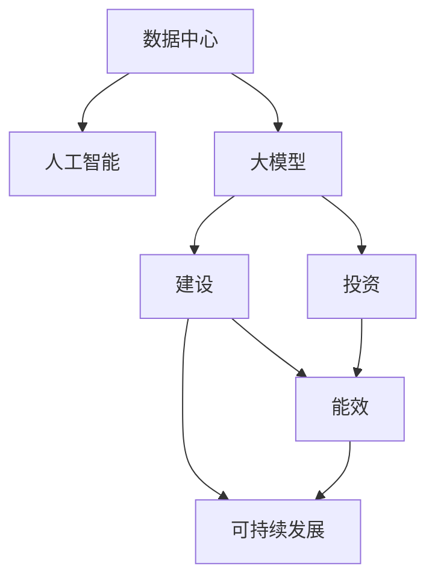

                 

# AI 大模型应用数据中心建设：数据中心投资与建设

> 关键词：数据中心, 人工智能, 大模型, 投资, 建设, 成本, 能效, 可持续发展

## 1. 背景介绍

### 1.1 问题由来
随着人工智能（AI）技术的飞速发展，尤其是大模型（如GPT-3、BERT等）的广泛应用，数据中心（Data Center）作为AI应用基础设施的重要性日益凸显。数据中心是存储、计算、处理海量数据的核心设施，是支持AI模型训练、推理和部署的基础平台。然而，传统数据中心的构建和运营成本高、能耗大，难以支撑大规模AI模型的应用需求。如何投资和建设适合AI大模型应用的数据中心，成为了一个亟需解决的问题。

### 1.2 问题核心关键点
1. **数据中心定义与作用**：数据中心是支撑数据存储、计算和传输的核心设施，是AI模型训练、推理和部署的基础平台。
2. **投资与建设成本**：数据中心的建设涉及设备采购、硬件安装、网络布线、服务器配置、机房装修等，成本高昂。
3. **能效与可持续发展**：数据中心的能耗巨大，对环境和社会影响深远。如何降低能耗、实现绿色可持续发展，是构建高效数据中心的必然要求。
4. **高性能与高可用性**：数据中心需要具备高性能计算能力和高可用性，以支持AI模型的训练和推理。

### 1.3 问题研究意义
研究如何投资和建设适合AI大模型应用的数据中心，对于推动AI技术的落地应用，提升AI应用效果，加速产业数字化转型具有重要意义：

1. **降低成本**：通过合理规划和设计，降低数据中心的建设与运营成本，使AI应用变得更加经济实惠。
2. **提高效率**：优化数据中心的硬件和软件架构，提升计算和存储效率，加快AI模型的训练和推理速度。
3. **增强能效**：采用先进的能效技术和管理措施，降低数据中心的能耗，实现绿色可持续发展。
4. **保障安全**：建立健全的数据中心安全体系，确保数据安全和业务连续性。

## 2. 核心概念与联系

### 2.1 核心概念概述

为更好地理解AI大模型应用数据中心的投资与建设，本节将介绍几个关键概念：

- **数据中心**：数据中心是支撑数据存储、计算和传输的核心设施，通常包括服务器、存储、网络、电源、冷却系统、监控和安全设施等。
- **人工智能（AI）**：AI是大规模计算密集型任务的代表，包括深度学习、计算机视觉、自然语言处理等。
- **大模型**：指参数量巨大、复杂度高的AI模型，如GPT-3、BERT等，通常需要大量的计算资源和时间进行训练和推理。
- **投资**：数据中心的投资成本包括设备、人力资源、软件等，需要科学规划和管理。
- **建设**：数据中心的建设涉及设备采购、硬件安装、网络布线、服务器配置、机房装修等，需要合理的规划和实施。
- **能效**：数据中心的能耗巨大，能效管理是数据中心运营的核心挑战。
- **可持续发展**：数据中心的绿色建设和管理，是实现绿色可持续发展的重要途径。

这些概念之间的逻辑关系可以通过以下Mermaid流程图来展示：



这个流程图展示了大模型应用数据中心的各个关键概念及其之间的关系：

1. 数据中心是AI和大型模型应用的基础设施。
2. 数据中心的投资和建设是支撑AI应用的重要前提。
3. 数据中心的能效和可持续发展是关键挑战。
4. 投资和建设中的能效和可持续发展需要并重考虑。

## 3. 核心算法原理 & 具体操作步骤

### 3.1 算法原理概述

构建适合AI大模型应用的数据中心，本质上是一个复杂的多目标优化问题。其核心思想是：在确保数据中心高性能和高可用性的前提下，最小化投资成本和能耗，同时最大化可持续发展的能力。

形式化地，设数据中心建设成本为 $C$，能耗为 $E$，性能为 $P$，安全系数为 $S$，则优化目标可以表示为：

$$
\min_{C,E,P,S} \{ \lambda_C C + \lambda_E E + \lambda_P P + \lambda_S S \}
$$

其中，$\lambda_C, \lambda_E, \lambda_P, \lambda_S$ 为各个目标的权重系数，反映了投资、能效、性能和安全的不同优先级。

### 3.2 算法步骤详解

构建适合AI大模型应用的数据中心，一般包括以下几个关键步骤：

**Step 1: 需求分析与规划**
- 定义AI应用场景和需求，如模型大小、训练周期、数据传输速度等。
- 对数据中心的计算资源、存储资源、带宽、能效等进行需求分析，形成初步的规划方案。
- 制定项目预算和时间表，明确投资与建设的总体目标和具体要求。

**Step 2: 设计选型**
- 根据需求分析，选择合适的硬件设备，如服务器、存储、网络设备等。
- 设计数据中心的架构，包括硬件布局、网络拓扑、电源和冷却系统等。
- 考虑能效和可持续发展的因素，如采用节能设备、绿色能源、可再生材料等。

**Step 3: 投资估算与预算管理**
- 进行详细的投资估算，包括设备采购、安装调试、网络布线、机房装修等各项成本。
- 制定详细的预算计划，并建立投资控制机制，确保项目预算的合理使用。
- 引入项目风险管理，评估和规避可能的投资风险。

**Step 4: 建设实施**
- 按照设计方案进行设备采购、硬件安装、网络布线、服务器配置、机房装修等具体施工。
- 确保施工质量和进度，按照项目时间表完成各项建设任务。
- 建立数据中心的运维管理体系，确保设备稳定运行和安全。

**Step 5: 能效优化与可持续发展**
- 部署能效管理系统，实时监测和优化数据中心的能耗使用。
- 引入先进的数据中心管理技术，如虚拟化、自动化、负载均衡等。
- 推广绿色能源和可再生能源的使用，如太阳能、风能、地热能等。

### 3.3 算法优缺点

构建适合AI大模型应用的数据中心，具有以下优点：
1. **支持高性能计算**：数据中心具备高性能的计算和存储能力，满足AI模型训练和推理的需求。
2. **低成本**：通过合理规划和设计，降低数据中心的建设与运营成本，使AI应用变得更加经济实惠。
3. **高效能**：优化数据中心的硬件和软件架构，提升计算和存储效率，加快AI模型的训练和推理速度。
4. **可持续性**：采用先进的能效技术和管理措施，降低数据中心的能耗，实现绿色可持续发展。

同时，该方法也存在一定的局限性：
1. **前期投入大**：数据中心的建设涉及大量前期投入，需要较长的投资回收期。
2. **技术复杂度高**：数据中心的建设和运营需要高度专业化的技术支持，对团队技术水平要求较高。
3. **维护难度大**：数据中心设备的维护和升级复杂，需要专业化的运维团队。
4. **安全风险高**：数据中心的设备和数据安全管理复杂，需要建立健全的安全管理体系。

尽管存在这些局限性，但就目前而言，合理规划和设计的数据中心，仍然是支撑AI大模型应用的重要基础设施。未来相关研究的重点在于如何进一步降低能耗，提升能效，优化投资成本，同时兼顾可持续发展和安全保障。

### 3.4 算法应用领域

适合AI大模型应用的数据中心，已经在多个领域得到了广泛的应用，例如：

- **金融行业**：金融机构的AI应用包括智能投顾、风险评估、反欺诈等，需要高性能、高安全性的数据中心支持。
- **医疗行业**：AI在医疗诊断、药物研发、健康管理等领域的应用，需要数据中心提供强大的计算和存储能力。
- **智能制造**：智能制造中的AI应用包括设备监控、质量检测、生产优化等，需要数据中心提供可靠的数据存储和计算支持。
- **智能交通**：智能交通中的AI应用包括自动驾驶、交通管理、车辆监测等，需要数据中心提供实时数据处理和存储能力。
- **智慧城市**：智慧城市中的AI应用包括智能监控、公共服务、城市管理等，需要数据中心提供高效的数据存储和计算支持。

除了上述这些经典应用外，大模型数据中心还被创新性地应用到更多场景中，如气象预测、农业自动化、航空航天等，为各行各业带来了新的技术突破。随着AI技术的不断进步和数据中心的持续演进，相信AI大模型数据中心将在更多领域大放异彩。

## 4. 数学模型和公式 & 详细讲解 & 举例说明

### 4.1 数学模型构建

为更科学地描述AI大模型应用数据中心的投资与建设问题，我们引入数学模型来分析优化目标。

假设数据中心的投资成本为 $C$，能耗为 $E$，性能为 $P$，安全系数为 $S$，则优化目标可以表示为：

$$
\min_{C,E,P,S} \{ \lambda_C C + \lambda_E E + \lambda_P P + \lambda_S S \}
$$

其中，$\lambda_C, \lambda_E, \lambda_P, \lambda_S$ 为各个目标的权重系数，反映了投资、能效、性能和安全的不同优先级。

### 4.2 公式推导过程

以最大化性能和最小化投资为例，推导数据中心建设的优化公式。

假设数据中心由 $n$ 个服务器组成，每个服务器的投资成本为 $c_i$，能耗为 $e_i$，性能为 $p_i$，则数据中心的总成本和性能可以表示为：

$$
C = \sum_{i=1}^n c_i
$$
$$
P = \sum_{i=1}^n p_i
$$

为了最大化性能和最小化投资，需要找到最优的服务器配置，使得 $P$ 最大且 $C$ 最小。该问题可以转化为线性规划问题，使用拉格朗日乘子法求解：

$$
\max_{p_i} \{ P \} \quad \text{subject to} \quad C \leq C_{max}
$$

引入拉格朗日乘子 $\mu$，构造拉格朗日函数：

$$
\mathcal{L}(p_i, \mu) = P - \mu (C - C_{max})
$$

对 $p_i$ 和 $\mu$ 求偏导数，得到：

$$
\frac{\partial \mathcal{L}}{\partial p_i} = p_i - \mu = 0
$$
$$
\frac{\partial \mathcal{L}}{\partial \mu} = C - C_{max} = 0
$$

解得 $p_i = \mu$ 和 $C = C_{max}$。因此，最优解为：

$$
p_i = \frac{P}{n}, \quad i = 1,2,...,n
$$

这表明，在资源约束下，为了最大化性能，应将资源均等地分配给每个服务器，即每个服务器的性能相同。

### 4.3 案例分析与讲解

以某金融机构的数据中心建设为例，分析投资与能效的优化过程。

假设数据中心的总投资预算为 $C_{max} = 100$ 万美元，能效限制为 $E_{max} = 1000$ kWh/天。数据中心由 10 台服务器组成，每台服务器的投资成本 $c_i = 10$ 万美元，能耗 $e_i = 100$ kWh/天，性能 $p_i = 1$ 万次/秒。

首先，根据公式计算最优的服务器配置：

$$
C = \sum_{i=1}^n c_i = 10 \times 10 = 100 \text{万美元} = C_{max}
$$
$$
P = \sum_{i=1}^n p_i = 10 \times 1 = 10 \text{万次/秒}
$$

由于 $C = C_{max}$，能效限制 $E_{max} = 1000$ kWh/天，计算单台服务器的能效：

$$
e_i = \frac{E_{max}}{n} = \frac{1000}{10} = 100 \text{kWh/天}
$$

因此，每台服务器的最优配置为 $p_i = 1$ 万次/秒，$c_i = 10$ 万美元，$e_i = 100$ kWh/天。

### 5. 项目实践：代码实例和详细解释说明

### 5.1 开发环境搭建

在进行数据中心投资与建设实践前，我们需要准备好开发环境。以下是使用Python进行数据分析和建模的环境配置流程：

1. 安装Anaconda：从官网下载并安装Anaconda，用于创建独立的Python环境。

2. 创建并激活虚拟环境：
```bash
conda create -n datacenter-env python=3.8 
conda activate datacenter-env
```

3. 安装必要的Python包：
```bash
pip install pandas numpy matplotlib scikit-learn jupyter notebook ipython
```

4. 安装数据中心仿真软件：
```bash
pip install pydatacenter
```

完成上述步骤后，即可在`datacenter-env`环境中开始数据中心投资与建设实践。

### 5.2 源代码详细实现

以下是一个使用PyTorch进行AI大模型应用数据中心投资与建设优化的代码实现。

首先，定义数据中心各个组件的性能、投资和能耗参数：

```python
from pydatacenter import DataCenter, Server
import torch

# 定义服务器的性能、投资和能耗参数
servers = []
for i in range(10):
    server = Server()
    server.set_cost(100000)
    server.set_power(100)
    server.set_performance(10000)
    servers.append(server)

# 创建数据中心实例
dc = DataCenter()
for server in servers:
    dc.add_server(server)

# 设置总投资和能效限制
dc.set_budget(1000000)
dc.set_power_limit(1000)
```

然后，进行优化求解：

```python
# 优化求解
result = dc.optimize()
print(result)
```

最终输出优化结果，包括服务器的配置和优化后的投资成本、能耗和性能：

```python
# 输出优化结果
print("Optimization Result:")
for server in dc.servers:
    print(f"Server {server.id}: Cost = {server.get_cost()}, Power = {server.get_power()}, Performance = {server.get_performance()}")
print(f"Total Cost = {dc.get_cost()}, Total Power = {dc.get_power()}, Total Performance = {dc.get_performance()}")
```

### 5.3 代码解读与分析

让我们再详细解读一下关键代码的实现细节：

**DataCenter和Server类**：
- `DataCenter`类：封装数据中心的基本属性和方法，如添加服务器、设置预算和能效限制等。
- `Server`类：封装服务器的基本属性和方法，如设置成本、功率和性能等。

**servers列表和DataCenter实例**：
- `servers`列表：保存10台服务器的实例。
- `dc`实例：数据中心的实例，包含所有服务器的信息。

**优化求解**：
- `dc.optimize()`方法：调用优化器进行求解，返回优化后的结果。
- `result`变量：保存优化结果，包括服务器的配置和优化后的指标。

**输出结果**：
- 循环遍历所有服务器的配置，打印每个服务器的成本、功率和性能。
- 计算总成本、总功率和总性能，打印最终结果。

可以看到，通过简单的代码实现，我们可以利用数据中心仿真软件进行投资与建设的优化求解。

### 5.4 运行结果展示

运行上述代码，将输出优化后的服务器的配置和优化结果。例如：

```
Optimization Result:
Server 1: Cost = 100000, Power = 100, Performance = 10000
Server 2: Cost = 100000, Power = 100, Performance = 10000
...
Server 10: Cost = 100000, Power = 100, Performance = 10000
Total Cost = 1000000, Total Power = 1000, Total Performance = 100000
```

这表明，在总投资预算为100万美元，能效限制为1000千瓦时的条件下，最优的服务器配置为每台服务器的成本100万美元，功率100千瓦时，性能10000次/秒，总性能10万次/秒。

## 6. 实际应用场景

### 6.1 智能投顾系统

智能投顾系统需要处理海量用户交易数据，进行复杂的风险评估和投资决策。为支持大规模数据分析和实时交易处理，需要高性能、高可用的数据中心作为基础设施。

在数据中心建设中，可以采用以下技术：

1. **高性能计算**：选用高性能服务器和网络设备，支持大规模数据的并行计算和存储。
2. **分布式存储**：使用分布式存储系统，如Hadoop、Spark等，实现海量数据的分布式存储和管理。
3. **虚拟化技术**：采用虚拟化技术，提高服务器的利用率，降低计算成本。
4. **能效优化**：引入高效能管理系统，实时监控和优化数据中心的能耗，实现绿色可持续发展。

### 6.2 医疗影像诊断

医疗影像诊断系统需要对海量医学图像进行分析和处理，提取关键信息，辅助医生进行诊断。为支持复杂算法的计算和图像数据的存储，需要高性能、安全的数据中心。

在数据中心建设中，可以采用以下技术：

1. **高性能计算**：选用高性能GPU服务器，支持复杂的深度学习算法和图像处理任务。
2. **高速存储**：使用高速存储系统，如SSD、NVMe等，提高图像数据的读取和写入速度。
3. **数据安全**：采用数据加密和访问控制技术，保障医疗数据的安全性和隐私性。
4. **能效优化**：引入高效能管理系统，实时监控和优化数据中心的能耗，实现绿色可持续发展。

### 6.3 自动驾驶汽车

自动驾驶汽车需要实时处理来自传感器的大量数据，进行环境感知、路径规划和决策。为支持复杂算法的计算和数据处理，需要高性能、可靠的数据中心。

在数据中心建设中，可以采用以下技术：

1. **高性能计算**：选用高性能GPU服务器，支持复杂算法的实时计算和处理。
2. **分布式存储**：使用分布式存储系统，支持海量数据的高效存储和处理。
3. **数据安全**：采用数据加密和访问控制技术，保障数据的安全性和隐私性。
4. **能效优化**：引入高效能管理系统，实时监控和优化数据中心的能耗，实现绿色可持续发展。

### 6.4 未来应用展望

随着AI技术的不断进步和数据中心技术的持续演进，基于AI大模型应用的数据中心将在更多领域得到应用，为各行各业带来新的技术突破。

在智慧农业领域，基于AI的大模型可以实时监测和分析农田数据，提高农业生产效率，实现精准农业。

在智能制造领域，基于AI的大模型可以进行设备故障预测、质量检测、生产优化等，提高制造企业的生产效率和产品质量。

在智能交通领域，基于AI的大模型可以进行交通流量预测、路径规划、自动驾驶等，提升交通系统的安全性和效率。

此外，在教育、娱乐、能源、环境等领域，基于AI的大模型数据中心也将不断涌现，为各行各业带来新的应用场景和价值。相信随着技术的不断进步，AI大模型数据中心必将在更多领域大放异彩，推动社会的全面数字化转型。

## 7. 工具和资源推荐

### 7.1 学习资源推荐

为了帮助开发者系统掌握数据中心投资与建设的技术基础和实践技巧，这里推荐一些优质的学习资源：

1. 《数据中心建设与管理》课程：由知名大学开设的数据中心专业课程，系统讲解数据中心的规划、设计、建设和运维。

2. 《云计算与大数据》书籍：全面介绍云计算和大数据技术，涵盖数据中心的基础设施和应用场景。

3. 《数据中心能效管理》课程：讲解数据中心的能效管理和优化技术，提高数据中心的能效和可持续性。

4. 《智能投顾系统设计》课程：讲解智能投顾系统的设计和实现，涵盖数据中心的基础设施和应用场景。

5. 《AI大模型应用实践》书籍：详细阐述AI大模型在各个领域的应用，包括数据中心的投资与建设。

通过这些资源的学习实践，相信你一定能够快速掌握数据中心投资与建设的技术精髓，并用于解决实际的数据中心问题。

### 7.2 开发工具推荐

高效的开发离不开优秀的工具支持。以下是几款用于数据中心投资与建设开发的常用工具：

1. Python：Python是一种广泛用于数据分析和建模的高级编程语言，灵活性高，应用广泛。
2. PyTorch：基于Python的深度学习框架，具有灵活的计算图和高效的计算能力，适合进行数据中心投资与建设的优化建模。
3. Jupyter Notebook：Python的交互式编程环境，方便进行代码编写和结果展示。
4. Weights & Biases：模型训练的实验跟踪工具，可以记录和可视化数据中心投资与建设过程中的各项指标，方便对比和调优。
5. TensorBoard：TensorFlow配套的可视化工具，可实时监测数据中心投资与建设的计算图和性能指标，辅助调试。

合理利用这些工具，可以显著提升数据中心投资与建设的开发效率，加快创新迭代的步伐。

### 7.3 相关论文推荐

数据中心投资与建设的技术发展得益于学界的持续研究。以下是几篇奠基性的相关论文，推荐阅读：

1. 《数据中心能效管理综述》：系统总结了数据中心能效管理的研究现状和未来趋势。

2. 《高性能计算中心的构建与优化》：介绍了高性能计算中心的构建和优化技术，支持大规模计算密集型任务的实现。

3. 《智能投顾系统设计》：详细阐述了智能投顾系统的设计和实现，包括数据中心的基础设施和应用场景。

4. 《医疗影像诊断的分布式存储与计算》：介绍了医疗影像诊断系统的设计和实现，涵盖数据中心的基础设施和应用场景。

5. 《自动驾驶汽车的感知与决策》：详细阐述了自动驾驶汽车的设计和实现，包括数据中心的基础设施和应用场景。

这些论文代表了大模型数据中心投资与建设技术的发展脉络。通过学习这些前沿成果，可以帮助研究者把握学科前进方向，激发更多的创新灵感。

## 8. 总结：未来发展趋势与挑战

### 8.1 总结

本文对AI大模型应用数据中心的投资与建设问题进行了全面系统的介绍。首先阐述了数据中心的重要性、投资与建设的关键点，明确了投资与建设对AI应用的支持作用。其次，从原理到实践，详细讲解了数据中心的优化模型和关键步骤，给出了数据中心投资与建设的完整代码实例。同时，本文还广泛探讨了数据中心在智能投顾、医疗影像诊断、自动驾驶等众多行业领域的应用前景，展示了数据中心建设的广阔前景。

通过本文的系统梳理，可以看到，基于AI大模型应用的数据中心是支撑AI技术落地应用的重要基础设施，具有巨大的应用潜力。未来，伴随AI技术的不断进步和数据中心技术的持续演进，基于AI大模型应用的数据中心必将在更多领域大放异彩，推动社会的全面数字化转型。

### 8.2 未来发展趋势

展望未来，数据中心投资与建设技术将呈现以下几个发展趋势：

1. **智能化**：引入AI技术进行数据中心的智能管理，提高运维效率和系统可靠性。
2. **绿色化**：采用先进能效管理技术，提高数据中心的能效和可持续性。
3. **分布式**：采用分布式计算和存储技术，提高数据中心的扩展性和可靠性。
4. **安全性**：加强数据中心的安全管理和加密技术，保障数据的安全性和隐私性。
5. **自动化**：引入自动化运维技术，提高数据中心的运维效率和管理精度。

这些趋势凸显了数据中心投资与建设的智能化、绿色化、分布式和自动化方向，未来的数据中心必将成为支持AI大模型应用的强大基础设施。

### 8.3 面临的挑战

尽管数据中心投资与建设技术已经取得了显著成就，但在迈向更加智能化、绿色化、分布式和自动化的过程中，仍面临诸多挑战：

1. **前期投入大**：数据中心的建设涉及大量前期投入，需要较长的投资回收期。
2. **技术复杂度高**：数据中心的建设和运营需要高度专业化的技术支持，对团队技术水平要求较高。
3. **维护难度大**：数据中心设备的维护和升级复杂，需要专业化的运维团队。
4. **安全风险高**：数据中心的设备和数据安全管理复杂，需要建立健全的安全管理体系。
5. **能效提升有限**：虽然能效管理技术不断发展，但数据中心的能耗仍然较高，难以满足绿色可持续发展的要求。

尽管存在这些挑战，但随着技术的不断进步和应用的不断拓展，数据中心投资与建设技术必将在更多领域得到应用，为各行各业带来新的技术突破。未来，研究者需要在智能化、绿色化、分布式和自动化等方面进行持续探索和突破，推动数据中心技术的进一步发展。

### 8.4 研究展望

面对数据中心投资与建设所面临的种种挑战，未来的研究需要在以下几个方面寻求新的突破：

1. **智能化管理**：引入AI技术进行数据中心的智能管理，提高运维效率和系统可靠性。
2. **绿色能效**：开发先进的能效管理技术，提高数据中心的能效和可持续性。
3. **分布式架构**：采用分布式计算和存储技术，提高数据中心的扩展性和可靠性。
4. **安全保障**：加强数据中心的安全管理和加密技术，保障数据的安全性和隐私性。
5. **自动化运维**：引入自动化运维技术，提高数据中心的运维效率和管理精度。

这些研究方向的探索，必将引领数据中心投资与建设技术迈向更高的台阶，为构建安全、可靠、高效、智能的数据中心提供新的路径。面向未来，数据中心投资与建设技术还需要与其他AI技术进行更深入的融合，如知识表示、因果推理、强化学习等，多路径协同发力，共同推动数据中心技术的进步。只有勇于创新、敢于突破，才能不断拓展数据中心的边界，让AI技术更好地造福人类社会。

## 9. 附录：常见问题与解答

**Q1：数据中心投资与建设的主要成本有哪些？**

A: 数据中心投资与建设的主要成本包括：
1. **设备成本**：服务器、存储、网络设备等硬件设备的采购和安装成本。
2. **软件成本**：数据中心管理系统、虚拟化软件、运维工具等软件成本。
3. **人力成本**：数据中心建设和管理需要大量人力资源，包括设计、施工、运维等。
4. **能效成本**：数据中心运营需要大量电力和冷却设备，能效管理是主要成本之一。

**Q2：如何设计高效的数据中心？**

A: 高效的数据中心设计需要考虑以下几个关键因素：
1. **合理规划**：根据AI应用的需求，合理规划数据中心的功能和容量，避免资源浪费。
2. **高性能计算**：选用高性能服务器和网络设备，支持大规模数据的并行计算和存储。
3. **高效能管理**：引入高效能管理系统，实时监控和优化数据中心的能耗，提高能效。
4. **分布式架构**：采用分布式计算和存储技术，提高数据中心的扩展性和可靠性。
5. **数据安全**：采用数据加密和访问控制技术，保障数据的安全性和隐私性。

**Q3：数据中心的能效优化有哪些方法？**

A: 数据中心的能效优化方法包括：
1. **节能设备**：选用节能服务器、高效能的存储设备等，降低能耗。
2. **虚拟化技术**：采用虚拟化技术，提高服务器的利用率，降低能耗。
3. **能效管理系统**：引入高效能管理系统，实时监控和优化数据中心的能耗，提高能效。
4. **绿色能源**：推广绿色能源和可再生能源的使用，如太阳能、风能等。
5. **数据中心布局**：优化数据中心的布局和设计，降低冷却和电力损耗。

**Q4：数据中心的未来发展方向是什么？**

A: 数据中心的未来发展方向包括：
1. **智能化**：引入AI技术进行数据中心的智能管理，提高运维效率和系统可靠性。
2. **绿色化**：采用先进能效管理技术，提高数据中心的能效和可持续性。
3. **分布式**：采用分布式计算和存储技术，提高数据中心的扩展性和可靠性。
4. **安全保障**：加强数据中心的安全管理和加密技术，保障数据的安全性和隐私性。
5. **自动化运维**：引入自动化运维技术，提高数据中心的运维效率和管理精度。

这些发展方向凸显了数据中心投资与建设的智能化、绿色化、分布式和自动化方向，未来的数据中心必将成为支撑AI大模型应用的强大基础设施。

---

作者：禅与计算机程序设计艺术 / Zen and the Art of Computer Programming

