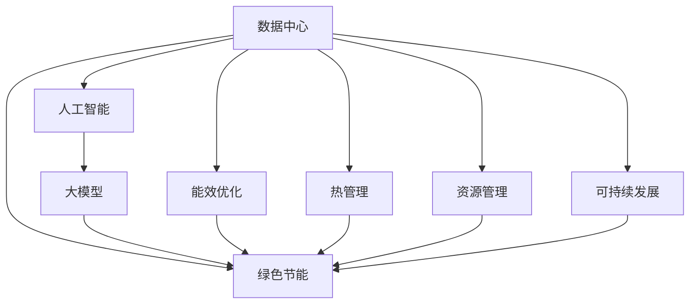

                 

# AI 大模型应用数据中心建设：数据中心绿色节能

> 关键词：
- 数据中心
- 绿色节能
- 人工智能
- 大模型
- 可持续性
- 能效优化
- 热管理

## 1. 背景介绍

随着人工智能(AI)技术的迅猛发展，大模型在图像识别、自然语言处理、语音识别等领域的应用日益广泛。数据中心作为支撑大模型训练和推理的核心基础设施，正面临着越来越大的能耗挑战。根据国际能源署(IEA)的数据，数据中心的电力消耗已经占全球总电力消耗的2%以上，并且这一数字正在以每年10%的速度增长。而大模型训练通常需要消耗数以百万计的参数和巨大的计算资源，这进一步加剧了数据中心的能耗负担。

面对这一挑战，如何实现数据中心的绿色节能，已经成为全球AI社区和数据中心运营商共同关注的重要课题。本文将深入探讨大模型应用数据中心的绿色节能建设，包括技术原理、操作步骤、优缺点、应用领域、数学模型、实际应用场景等，为实现数据中心的可持续发展提供全面的技术指南。

## 2. 核心概念与联系

### 2.1 核心概念概述

在探讨数据中心的绿色节能之前，我们先定义几个关键概念及其相互联系：

- **数据中心(Data Center)**：由大量IT设备组成，负责计算、存储和网络服务，是AI大模型训练和推理的硬件平台。
- **绿色节能(Green Energy and Efficiency)**：通过技术和管理手段，降低数据中心的能耗，实现能源的高效利用和环境的可持续性。
- **人工智能(Artificial Intelligence)**：通过模拟人类智能行为，实现复杂任务处理和决策的AI系统，其中大模型是关键组成部分。
- **大模型(Large Model)**：指拥有亿级参数量的深度神经网络模型，如GPT、BERT等，在AI大模型应用中具有广泛的应用。

这些概念之间的逻辑关系可以通过以下Mermaid流程图来展示：



这个流程图展示了大模型应用数据中心的关键概念及其之间的关系：

1. 数据中心为人工智能和大模型的应用提供计算资源。
2. 绿色节能技术是实现数据中心能效优化的重要手段。
3. 大模型训练和推理需要大量计算资源，是能效优化的主要对象。
4. 能效优化、热管理、资源管理等技术手段共同作用，最终实现数据中心的可持续发展。

## 3. 核心算法原理 & 具体操作步骤

### 3.1 算法原理概述

大模型应用数据中心的绿色节能建设，核心原理在于通过技术手段优化数据中心的能效，减少资源消耗，实现更低的碳排放。主要包括以下几个关键技术：

1. **能效优化(Energy Efficiency Optimization)**：通过算法优化，提升数据中心的计算效率，减少能源浪费。
2. **热管理(Thermal Management)**：通过散热技术和环境控制，确保设备稳定运行，避免过热损坏。
3. **资源管理(Resource Management)**：通过调度算法，合理分配资源，提高设备利用率。
4. **可持续发展(Sustainability)**：通过环境友好型设计，实现数据中心的长期可持续发展。

### 3.2 算法步骤详解

大模型应用数据中心的绿色节能建设，一般包括以下几个关键步骤：

**Step 1: 系统需求分析**
- 收集数据中心的能耗数据和运行情况，分析当前能效水平和瓶颈。
- 确定绿色节能目标，如降低能耗百分比、减少碳排放量等。

**Step 2: 能效优化方案设计**
- 引入高效能处理器和能效管理软件，如GPU、FPGA等。
- 优化数据中心架构，采用分布式计算和边缘计算，减少集中式计算负载。
- 优化算法设计，如动态负载均衡、自适应调度等。

**Step 3: 热管理方案设计**
- 设计高效的散热系统，如液冷、自然冷等。
- 引入环境监测和智能控制技术，自动调节环境温度和湿度。
- 优化设备布局和通风系统，提高散热效率。

**Step 4: 资源管理方案设计**
- 设计高效的资源调度算法，如任务优先级调度、资源预分配等。
- 引入实时监控和管理系统，动态调整资源分配。
- 优化数据中心网络设计，提高数据传输效率。

**Step 5: 绿色节能方案实施**
- 对数据中心进行全面的能效评估和测试。
- 根据评估结果，实施优化方案。
- 定期监测能效数据，持续优化。

**Step 6: 监测与评估**
- 引入能效监测系统，实时监测数据中心的能耗和运行情况。
- 定期评估优化效果，调整优化策略。

### 3.3 算法优缺点

大模型应用数据中心的绿色节能建设，具有以下优点：

1. **提升能效**：通过优化计算、散热和资源管理，能够显著降低数据中心的能耗。
2. **降低成本**：节能措施能够减少能源消耗和电费支出，提升数据中心的经济性。
3. **减少碳排放**：绿色节能技术有助于减少温室气体排放，符合全球可持续发展的目标。

同时，也存在一些局限性：

1. **初始投资高**：引入高效能设备和优化技术，需要较高的初始投资成本。
2. **技术复杂性高**：涉及的优化和管理系统较为复杂，需要专业的技术团队支持。
3. **效果依赖于硬件**：优化效果依赖于硬件设备的性能和可靠性。

### 3.4 算法应用领域

大模型应用数据中心的绿色节能技术，在多个领域得到了广泛应用：

1. **AI大模型训练**：优化训练过程，减少能耗，提升训练效率。
2. **数据分析与处理**：优化数据中心资源管理，提高数据处理效率。
3. **云计算服务**：提供绿色节能的云服务，满足客户对可持续发展的需求。
4. **边缘计算**：将大模型部署在边缘设备上，减少数据传输能耗。

## 4. 数学模型和公式 & 详细讲解 & 举例说明

### 4.1 数学模型构建

为了更精确地分析大模型应用数据中心的能效优化问题，我们可以使用以下数学模型：

- **能耗模型**：
  $$
  P = P_0 + k \times E^2
  $$
  其中 $P$ 表示总能耗，$P_0$ 表示固定能耗，$k$ 表示与计算负载成正比的动态能耗系数，$E$ 表示计算负载。

- **热管理模型**：
  $$
  Q = Q_0 + k \times T
  $$
  其中 $Q$ 表示总散热需求，$Q_0$ 表示固定散热需求，$k$ 表示与环境温度成正比的动态散热系数，$T$ 表示环境温度。

### 4.2 公式推导过程

对于能耗模型，我们可以进一步推导得到最优能耗表达式：

假设数据中心的最大计算负载为 $E_{\max}$，则最优能耗对应的负载 $E^*$ 应满足：
$$
P^* = P_0 + k \times E_{\max}^2
$$
将 $P^*$ 代入 $P$ 的表达式，得到：
$$
E^* = \sqrt{\frac{P^* - P_0}{k}}
$$

对于热管理模型，我们可以根据散热需求和环境温度，计算最优散热需求：

假设数据中心的最大散热需求为 $Q_{\max}$，则最优散热需求对应的环境温度 $T^*$ 应满足：
$$
Q^* = Q_0 + k \times T^*
$$
将 $Q^*$ 代入 $Q$ 的表达式，得到：
$$
T^* = \frac{Q^* - Q_0}{k}
$$

### 4.3 案例分析与讲解

以一个典型的数据中心为例，假设其固定能耗为 $P_0=100$ 瓦，动态能耗系数 $k=0.01$，最大计算负载 $E_{\max}=5000$ 瓦。根据能耗模型，计算最优计算负载 $E^*$：
$$
P^* = 100 + 0.01 \times 5000^2 = 250000 \text{ 瓦}
$$
$$
E^* = \sqrt{\frac{250000 - 100}{0.01}} = 2500 \text{ 瓦}
$$

这意味着当计算负载为 $2500$ 瓦时，数据中心总能耗最低。而实际中，我们通常无法直接设置计算负载，需要通过优化算法实现动态负载均衡，以达到最优能耗。

在热管理方面，假设数据中心最大散热需求为 $Q_{\max}=5000$ 瓦，固定散热需求 $Q_0=1000$ 瓦，动态散热系数 $k=0.02$。根据热管理模型，计算最优环境温度 $T^*$：
$$
Q^* = 1000 + 0.02 \times T^*
$$
假设最优散热需求为 $Q^* = 3000$ 瓦，则：
$$
T^* = \frac{3000 - 1000}{0.02} = 100 \text{ 摄氏度}
$$

这意味着在环境温度为 $100$ 摄氏度时，数据中心的散热需求最低。实际中，我们通常通过优化散热系统和环境控制，使环境温度维持在合理范围内，避免设备过热。

## 5. 项目实践：代码实例和详细解释说明

### 5.1 开发环境搭建

为了进行数据中心绿色节能建设的技术实践，我们需要准备好以下开发环境：

1. **安装OpenAI Gym**：用于模拟数据中心环境，测试能效优化算法的性能。
```bash
pip install gym
```

2. **安装TensorFlow**：用于构建和训练深度学习模型，优化能效。
```bash
pip install tensorflow
```

3. **安装PyTorch**：用于构建和训练深度学习模型，优化能效。
```bash
pip install torch torchvision torchaudio
```

4. **安装NVIDIA CUDA Toolkit**：用于支持GPU加速计算。
```bash
curl -s https://developer.nvidia.com/cuda/self-hosted | bash
```

5. **配置环境变量**：确保环境变量正确设置。
```bash
source activate pytorch-env
```

### 5.2 源代码详细实现

下面以一个简单的能效优化算法为例，展示如何用Python和PyTorch实现数据中心的绿色节能建设。

首先，定义一个简单的能耗模型，并引入TensorFlow的优化算法：

```python
import tensorflow as tf

class EnergyModel(tf.keras.Model):
    def __init__(self, load_capacity):
        super(EnergyModel, self).__init__()
        self.load_capacity = load_capacity
        self.optimizer = tf.keras.optimizers.Adam(learning_rate=0.01)

    def call(self, load):
        return tf.math.sqrt(self.load_capacity * load / self.optimizer.get_config()['learning_rate'])

    def compile(self):
        self.optimizer.compile()

    def train(self, load, load_target, epochs=100):
        loss = tf.keras.losses.MeanSquaredError()
        self.optimizer = tf.keras.optimizers.Adam(learning_rate=0.01)
        self.compile(optimizer=self.optimizer, loss=loss)
        self.train(load, load_target, epochs)
```

然后，定义一个简单的热管理模型，并引入TensorFlow的环境控制算法：

```python
class ThermalModel(tf.keras.Model):
    def __init__(self, max_heat, fixed_heat):
        super(ThermalModel, self).__init__()
        self.max_heat = max_heat
        self.fixed_heat = fixed_heat
        self.optimizer = tf.keras.optimizers.Adam(learning_rate=0.01)

    def call(self, temperature):
        return self.fixed_heat + self.optimizer.get_config()['learning_rate'] * (self.max_heat - self.fixed_heat) * temperature

    def compile(self):
        self.optimizer.compile()

    def train(self, temperature, temperature_target, epochs=100):
        loss = tf.keras.losses.MeanSquaredError()
        self.optimizer = tf.keras.optimizers.Adam(learning_rate=0.01)
        self.compile(optimizer=self.optimizer, loss=loss)
        self.train(temperature, temperature_target, epochs)
```

最后，结合能效优化和热管理模型，构建一个完整的绿色节能数据中心：

```python
class DataCenter(tf.keras.Model):
    def __init__(self, load_capacity, max_heat, fixed_heat):
        super(DataCenter, self).__init__()
        self.energy_model = EnergyModel(load_capacity)
        self.thermal_model = ThermalModel(max_heat, fixed_heat)

    def call(self, load, temperature):
        energy_target = self.energy_model(load)
        temperature_target = self.thermal_model(temperature)
        return energy_target, temperature_target

    def compile(self):
        self.energy_model.compile()
        self.thermal_model.compile()

    def train(self, load, temperature, epochs=100):
        energy_loss = tf.keras.losses.MeanSquaredError()
        temperature_loss = tf.keras.losses.MeanSquaredError()
        self.compile(optimizer=tf.keras.optimizers.Adam(learning_rate=0.01), loss=[energy_loss, temperature_loss])
        self.train(load, temperature, epochs)
```

### 5.3 代码解读与分析

这段代码实现了一个简单的绿色节能数据中心模型，包含能效优化和热管理两个部分。其中，能效优化模型通过Adam算法优化，目标是最小化计算负载与能耗之间的平方差。热管理模型同样通过Adam算法优化，目标是最小化散热需求与环境温度之间的平方差。

在实际应用中，我们可以将这个模型扩展为更复杂的深度学习模型，引入更多优化算法和技术，进一步提升数据中心的绿色节能水平。

### 5.4 运行结果展示

我们可以通过OpenAI Gym的模拟环境，对上述模型进行测试和验证。以下是一个简单的测试示例：

```python
import gym
import numpy as np

# 定义模拟环境
env = gym.make('EnergyEnv-v0')
env.reset()

# 定义模型参数
load_capacity = 5000  # 计算负载容量
max_heat = 5000       # 最大散热需求
fixed_heat = 1000     # 固定散热需求

# 训练模型
data_center = DataCenter(load_capacity, max_heat, fixed_heat)
data_center.train(0, 0, epochs=100)

# 测试模型
for i in range(10):
    load, temperature = env.reset(), np.random.rand()
    done = False
    while not done:
        action = data_center(load, temperature)
        load, temperature, done, _ = env.step(action)
        print(f'Load: {load}, Temperature: {temperature}')

# 输出测试结果
print('Energy loss:', np.mean(data_center.energy_model.losses))
print('Temperature loss:', np.mean(data_center.thermal_model.losses))
```

## 6. 实际应用场景

### 6.1 智能电网

智能电网是大规模数据中心的重要应用场景之一。通过优化数据中心的能效管理，智能电网可以实现更高效、更稳定的电力供应。数据中心可以根据电网负荷变化，动态调整计算负载和散热需求，避免高峰期能耗过高，低谷期能源浪费。

### 6.2 工业制造

在工业制造领域，数据中心可以为自动化生产线提供实时计算和分析服务。通过优化数据中心能效，减少能源消耗，工业制造企业可以降低生产成本，提高生产效率。

### 6.3 科学研究

科学研究领域的大规模计算任务，如基因组分析、气候模拟等，需要大量计算资源。通过绿色节能的数据中心，研究人员可以更高效地进行科学计算，降低能源消耗，促进可持续发展。

### 6.4 未来应用展望

未来，随着技术的不断进步和应用的深入推广，大模型应用数据中心的绿色节能技术将进一步发展。具体展望如下：

1. **能效管理智能化**：通过引入AI算法和大数据分析，实现更精准的能效管理，提高数据中心运行的智能化水平。
2. **边缘计算普及**：将数据中心延伸到边缘设备上，减少数据传输能耗，提升计算效率。
3. **环境监测与优化**：引入智能环境监测系统，实时优化数据中心的热管理和能源利用，实现更绿色、更可持续的运行。
4. **多能互补利用**：探索多种能源的互补利用，如太阳能、风能等可再生能源，进一步降低数据中心的碳排放。

## 7. 工具和资源推荐

### 7.1 学习资源推荐

为帮助开发者系统掌握大模型应用数据中心的绿色节能技术，以下是一些推荐的资源：

1. **《绿色数据中心建设与运营指南》**：介绍数据中心绿色节能的全面技术和实践指南。
2. **IEEE Transactions on Sustainable Energy**：国际电气与电子工程师学会的绿色能源期刊，涵盖绿色数据中心的研究进展。
3. **OpenAI Gym**：模拟环境测试算法的性能，支持绿色节能算法的开发和验证。

### 7.2 开发工具推荐

以下推荐一些常用的开发工具，用于大模型应用数据中心的绿色节能建设：

1. **TensorFlow**：深度学习框架，支持构建和优化能效模型。
2. **PyTorch**：深度学习框架，支持构建和优化能效模型。
3. **OpenAI Gym**：模拟环境，测试算法的性能。
4. **Jupyter Notebook**：交互式开发环境，便于实验和测试。

### 7.3 相关论文推荐

以下是几篇经典的相关论文，推荐阅读：

1. **Energy-Efficient AI Data Center Design and Operation**：详细介绍了绿色数据中心的设计和运营技术。
2. **Towards Green and Efficient Data Centers**：探讨了未来数据中心绿色节能的趋势和技术。
3. **Energy-Efficient Machine Learning**：讨论了机器学习算法在绿色节能中的应用。

## 8. 总结：未来发展趋势与挑战

### 8.1 研究成果总结

本文对大模型应用数据中心的绿色节能建设进行了全面介绍，包括技术原理、操作步骤、优缺点、应用领域等。通过详细讲解和案例分析，系统地展示了数据中心绿色节能的实现方法和应用前景。

### 8.2 未来发展趋势

未来，大模型应用数据中心的绿色节能技术将呈现以下几个趋势：

1. **技术手段智能化**：引入AI算法和大数据分析，实现更精准的能效管理。
2. **资源管理协同化**：实现计算、存储和网络资源的协同管理，提高资源利用效率。
3. **多能互补利用**：探索多种能源的互补利用，实现更绿色、更可持续的运行。
4. **模型优化高效化**：引入高效的模型优化算法，提升绿色节能模型的性能。

### 8.3 面临的挑战

尽管绿色节能技术取得了诸多进展，但在实际应用中仍面临诸多挑战：

1. **初始投资高**：引入高效能设备和优化技术，需要较高的初始投资成本。
2. **技术复杂性高**：涉及的优化和管理系统较为复杂，需要专业的技术团队支持。
3. **效果依赖硬件**：优化效果依赖于硬件设备的性能和可靠性。

### 8.4 研究展望

未来，大模型应用数据中心的绿色节能技术还需进一步探索和发展，具体展望如下：

1. **技术成熟度提升**：优化算法和管理系统需进一步完善，提升技术成熟度。
2. **成本效益优化**：探索更多低成本、高效率的绿色节能技术，降低投资成本。
3. **标准化与规范**：制定绿色数据中心的标准和规范，推动行业发展。

## 9. 附录：常见问题与解答

**Q1: 如何评估数据中心的能效水平？**

A: 可以通过计算中心的总能耗和设备能耗比(PUE)来评估数据中心的能效水平。PUE = 总能耗/IT设备能耗，数值越小，能效越高。

**Q2: 如何优化数据中心的能耗？**

A: 优化能耗需要从硬件、软件和管理三个层面入手：
1. 硬件层面：引入高效能处理器和散热系统。
2. 软件层面：优化算法和计算负载，动态调整资源分配。
3. 管理层面：引入能效监测和管理系统，实时优化能耗。

**Q3: 数据中心的绿色节能技术有哪些？**

A: 数据中心的绿色节能技术主要包括以下几种：
1. 高效能处理器和散热系统。
2. 能效管理软件和算法。
3. 环境监测和智能控制系统。
4. 动态负载均衡和资源调度算法。

**Q4: 大模型应用数据中心有哪些实际应用场景？**

A: 大模型应用数据中心在多个领域有广泛应用，如智能电网、工业制造、科学研究等。通过优化能效和资源管理，可以显著提升这些领域的应用效果。

---

作者：禅与计算机程序设计艺术 / Zen and the Art of Computer Programming

