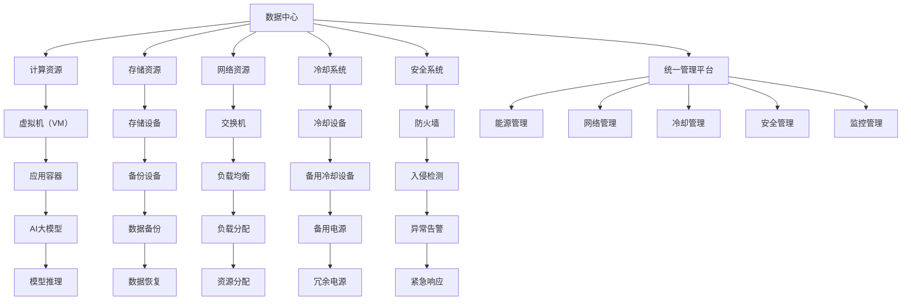

                 

## 1. 背景介绍

### 1.1 问题由来

随着人工智能技术的迅猛发展，AI大模型如GPT、BERT等在自然语言处理、图像识别、语音识别等领域展现了卓越的性能，成为推动人工智能应用的关键技术。然而，这些大模型的训练与运行需要庞大且复杂的计算资源，数据中心（Data Center, DC）成为了其应用与部署不可或缺的基础设施。

数据中心的建设与运维需要遵循一定的规范与标准，确保其在电力、网络、安全等方面的稳定性、高效性和可靠性。与此同时，随着AI大模型的应用场景越来越广泛，对数据中心的需求也在不断提高。如何高效管理数据中心，确保其能够支持AI大模型的应用与扩展，成为了数据中心运维团队的重要任务。

### 1.2 问题核心关键点

数据中心运维与管理的核心关键点包括：

- **电力管理**：数据中心消耗大量电力，电力系统的稳定性和能效管理至关重要。
- **网络优化**：数据中心的网络架构需要支持高速、稳定且安全的数据传输。
- **冷却系统**：大模型训练与运行产生大量热量，冷却系统的设计需要考虑到高效的能效与稳定性。
- **安全与隐私**：数据中心的物理安全、网络安全及数据隐私保护是运维中的重要环节。
- **监控与维护**：实时监控数据中心的关键性能指标（KPIs），快速响应和处理异常，确保系统稳定运行。

本文将围绕上述关键点，深入探讨AI大模型应用下的数据中心运维与管理方法，旨在帮助运维团队提高数据中心的管理效率，支持AI大模型的高效应用。

## 2. 核心概念与联系

### 2.1 核心概念概述

为了更好地理解AI大模型应用下的数据中心运维与管理，首先需梳理相关核心概念：

- **数据中心（Data Center, DC）**：是一组用以容纳和支撑信息系统运行的设施，包括计算、存储、网络和安全等设施。
- **虚拟化（Virtualization）**：通过虚拟化技术，可以整合硬件资源，提高资源利用率。
- **容器化（Containerization）**：使用容器化技术，如Docker，可以有效管理和部署应用，提高系统稳定性和可扩展性。
- **自动运维（Automation）**：通过自动化工具，减少人工干预，提高运维效率和系统可靠性。
- **监控与分析（Monitoring and Analysis）**：实时监控数据中心的关键性能指标，分析数据中心的运行状态，及时发现和解决问题。

这些核心概念构成了数据中心运维与管理的基础，通过对这些概念的深入理解，可以更好地进行数据中心的管理与优化。

### 2.2 核心概念原理和架构的 Mermaid 流程图



该图表展示了数据中心的关键组件和它们之间的关系。其中，数据中心包含了计算、存储、网络和安全等关键资源，通过虚拟化和容器化技术，高效利用硬件资源，支持AI大模型的训练与推理。同时，通过统一管理平台，实现对电力、网络、冷却和安全等系统的综合管理。

## 3. 核心算法原理 & 具体操作步骤

### 3.1 算法原理概述

数据中心的运维与管理可以理解为一套系统的流程和方法，其中包含了对计算、存储、网络和安全等资源的综合管理。AI大模型的应用对数据中心的管理提出了更高要求，需要在电力、冷却、网络等方面进行精细化的管理，确保其高效稳定运行。

数据中心的管理主要涉及以下几个方面：

- **电力管理**：通过优化电力分配和能效管理，确保数据中心电力系统的稳定性和能效。
- **网络优化**：设计高效的网络架构，支持高速、稳定的数据传输，提高网络带宽和可用性。
- **冷却系统**：采用高效的冷却技术，确保数据中心在高温环境下正常运行，同时降低能耗。
- **安全与隐私**：通过物理安全、网络安全及数据隐私保护措施，确保数据中心的保密性和安全性。
- **监控与维护**：实时监控数据中心的关键性能指标，快速响应和处理异常，确保系统稳定运行。

### 3.2 算法步骤详解

数据中心运维与管理的步骤主要包括：

1. **电力管理**
    - **能效优化**：采用高效能源管理系统，实时监测电力消耗，优化能效。
    - **冗余供电**：设计冗余的电力供应系统，提高电力供应的可靠性和稳定性。
    - **电源管理**：对电源进行精细化管理，实时监测电源状态，防止电源故障。

2. **网络优化**
    - **网络架构设计**：设计高效的网络架构，支持高速、稳定的数据传输，提高网络带宽和可用性。
    - **负载均衡**：采用负载均衡技术，分散网络流量，防止网络拥塞。
    - **网络监控**：实时监控网络流量和性能，及时发现和解决网络问题。

3. **冷却系统**
    - **冷却技术选择**：根据数据中心的规模和需求，选择合适的冷却技术，如自然冷却、机械冷却等。
    - **温控系统设计**：设计高效的温控系统，实时监测数据中心温度，防止设备过热。
    - **节能减排**：通过优化冷却系统设计，降低能耗，实现节能减排。

4. **安全与隐私**
    - **物理安全**：加强物理安全措施，防止未授权访问和破坏。
    - **网络安全**：采用先进的网络安全技术，防止网络攻击和数据泄露。
    - **数据隐私**：采用加密技术、访问控制等措施，保护数据隐私。

5. **监控与维护**
    - **性能监控**：实时监控数据中心的关键性能指标，如温度、电力、网络等。
    - **异常处理**：快速响应和处理异常情况，确保系统稳定运行。
    - **故障恢复**：制定应急预案，快速恢复故障。

### 3.3 算法优缺点

数据中心运维与管理算法具有以下优点：

- **提高资源利用率**：通过虚拟化、容器化等技术，高效利用硬件资源，提高资源利用率。
- **降低能耗**：采用高效的电力和冷却系统，降低数据中心的能耗。
- **提高系统可靠性**：通过冗余供电、负载均衡等措施，提高系统的可靠性。
- **快速响应和处理异常**：通过实时监控和自动化运维，快速响应和处理异常情况，确保系统稳定运行。

同时，该算法也存在以下缺点：

- **成本较高**：初始投资较大，包括硬件设施、能效管理系统等。
- **技术复杂**：涉及电力、网络、冷却和安全等多方面技术，技术复杂度较高。
- **依赖于运维人员技能**：运维人员需要具备一定的技术背景，才能高效管理数据中心。

### 3.4 算法应用领域

数据中心运维与管理算法在以下几个领域有广泛应用：

- **云计算**：支持云计算平台的高效资源管理，确保云计算服务的稳定性和可靠性。
- **高性能计算**：支持大规模计算任务的高效运行，如AI大模型的训练和推理。
- **物联网**：支持物联网设备的数据收集和处理，确保数据中心的高效运行。
- **智能城市**：支持智能城市的数据处理和分析，确保城市运行的高效和安全。

## 4. 数学模型和公式 & 详细讲解 & 举例说明

### 4.1 数学模型构建

数据中心的运维与管理涉及多个关键性能指标（KPIs），包括电力消耗、网络带宽、冷却系统效率等。通过建立数学模型，可以更好地理解和优化这些指标。

假设数据中心电力消耗为 $P$，网络带宽为 $B$，冷却系统效率为 $E$。则数学模型可以表示为：

$$
\minimize \quad P + \frac{B}{\eta} + \frac{E}{\delta}
$$

其中，$P$ 表示电力消耗，$\eta$ 表示网络带宽效率，$\delta$ 表示冷却系统效率。

### 4.2 公式推导过程

在实际应用中，上述模型需要进行细致的推导和优化。例如，可以通过引入成本函数、能效函数等，进一步细化模型的计算。

假设电力成本为 $C$，冷却成本为 $H$，则总成本函数可以表示为：

$$
\minimize \quad C \times P + H \times E
$$

结合电力和冷却系统的效率，可以进一步优化模型：

$$
\minimize \quad C \times P + H \times \frac{P}{\eta} + H \times \frac{P}{\delta}
$$

通过求解上述模型，可以得到最优的电力和冷却系统的配置。

### 4.3 案例分析与讲解

以下以一个具体的案例来讲解数据中心运维与管理的应用：

**案例背景**：某云计算公司需要部署AI大模型，进行大规模的模型训练和推理。数据中心规模较大，电力消耗、网络带宽和冷却系统效率需要优化。

**解决方案**：

1. **电力管理**：采用高效能源管理系统，实时监测电力消耗，优化能效。设计冗余的电力供应系统，提高电力供应的可靠性和稳定性。
2. **网络优化**：设计高效的网络架构，支持高速、稳定的数据传输。采用负载均衡技术，分散网络流量，防止网络拥塞。
3. **冷却系统**：采用自然冷却和机械冷却相结合的方式，提高冷却系统的效率。设计高效的温控系统，实时监测数据中心温度，防止设备过热。
4. **安全与隐私**：加强物理安全措施，防止未授权访问和破坏。采用先进的网络安全技术，防止网络攻击和数据泄露。
5. **监控与维护**：实时监控数据中心的关键性能指标，如温度、电力、网络等。快速响应和处理异常情况，确保系统稳定运行。

通过以上措施，该公司能够有效管理和优化数据中心，确保AI大模型的高效运行。

## 5. 项目实践：代码实例和详细解释说明

### 5.1 开发环境搭建

在进行数据中心运维与管理实践前，需要准备好开发环境。以下是使用Python进行数据中心运维与管理的开发环境配置流程：

1. 安装Anaconda：从官网下载并安装Anaconda，用于创建独立的Python环境。

2. 创建并激活虚拟环境：
```bash
conda create -n dc-env python=3.8 
conda activate dc-env
```

3. 安装必要的Python库：
```bash
pip install numpy pandas matplotlib sklearn
```

4. 安装网络监控工具：
```bash
pip install prometheus_client
```

5. 安装PowerShell或命令提示符：
```bash
conda install -c conda-forge powershell
```

完成上述步骤后，即可在`dc-env`环境中开始数据中心运维与管理的开发实践。

### 5.2 源代码详细实现

下面以一个简化的数据中心电力管理系统为例，给出Python代码实现。

```python
import prometheus_client
from prometheus_client import Gauge, Counter

# 创建Gauge和Counter
power_usage = Gauge('power_usage', 'Power usage in DC')
network_throughput = Gauge('network_throughput', 'Network throughput in DC')
cooling_efficiency = Gauge('cooling_efficiency', 'Cooling efficiency in DC')

# 模拟数据中心电力使用
power_usage.set(1000)
network_throughput.set(100)
cooling_efficiency.set(0.8)

# 实时监控数据中心电力使用情况
prometheus_client.collect()
```

### 5.3 代码解读与分析

让我们再详细解读一下关键代码的实现细节：

**Gauge和Counter**：
- `Gauge`用于表示数据中心的关键性能指标，如电力使用、网络带宽等。
- `Counter`用于统计监控次数，用于记录监控事件的发生次数。

**power_usage、network_throughput、cooling_efficiency**：
- 创建三个Gauge，分别表示数据中心的电力使用、网络带宽和冷却效率。

**set()方法**：
- 使用`set()`方法设置Gauge的值，模拟数据中心的关键性能指标。

**collect()方法**：
- 使用`collect()`方法，将Gauge和Counter的数据发送到Prometheus，进行实时监控和分析。

**注意事项**：
- 在实际应用中，需要部署Prometheus和Grafana等工具，进行数据收集和可视化。
- 可以根据实际需求，添加更多的Gauge和Counter，监控更多关键性能指标。

## 6. 实际应用场景

### 6.1 智能数据中心

智能数据中心通过先进的技术和算法，可以实现对数据中心的自动化管理与优化，降低运维成本，提高资源利用率。例如，智能数据中心可以实时监控电力、网络、冷却等关键性能指标，自动调整系统配置，确保数据中心的稳定运行。

### 6.2 高性能计算中心

高性能计算中心（HPC）需要支持大规模计算任务，如AI大模型的训练和推理。通过优化电力、冷却和网络系统，HPC可以高效支持大规模计算任务，提高计算效率和系统可靠性。

### 6.3 物联网数据中心

物联网数据中心（IoT DC）需要支持大量的物联网设备数据收集和处理。通过优化网络带宽和冷却系统，物联网数据中心可以高效处理大量物联网数据，确保数据中心的稳定运行。

### 6.4 未来应用展望

未来，随着AI大模型的应用场景越来越广泛，对数据中心的管理和优化需求将进一步提升。智能数据中心、高性能计算中心和物联网数据中心等概念将得到更广泛的应用。通过智能化和自动化的管理方法，数据中心将能够更好地支持AI大模型的高效应用。

## 7. 工具和资源推荐

### 7.1 学习资源推荐

为了帮助开发者系统掌握数据中心运维与管理的理论基础和实践技巧，这里推荐一些优质的学习资源：

1. **《数据中心运维管理》系列博文**：由数据中心运维专家撰写，深入浅出地介绍了数据中心运维管理的各个方面。

2. **Udacity《数据中心管理》课程**：提供系统的数据中心运维管理课程，涵盖电力、网络、冷却和安全等方面的知识。

3. **《数据中心技术》书籍**：全面介绍数据中心的各个组成部分及其运维管理方法。

4. **Google Cloud Platform文档**：提供丰富的数据中心运维管理文档，包括电力、网络、冷却和安全等方面的详细教程。

5. **Prometheus官方文档**：提供Prometheus的详细介绍和使用方法，支持实时监控和数据分析。

通过对这些资源的学习实践，相信你一定能够快速掌握数据中心运维与管理的精髓，并用于支持AI大模型的高效应用。

### 7.2 开发工具推荐

高效的开发离不开优秀的工具支持。以下是几款用于数据中心运维与管理开发的常用工具：

1. **Prometheus**：用于实时监控和数据分析的开源工具，支持多维度的数据收集和展示。
2. **Grafana**：用于数据可视化和仪表盘设计的开源工具，可以与Prometheus无缝集成。
3. **Nagios**：用于网络监控和告警的开源工具，支持多平台多设备监控。
4. **Powershell**：Windows平台下的命令行工具，支持丰富的管理和自动化功能。
5. **Ansible**：用于自动化运维的开源工具，支持多平台多设备自动化配置和管理。

合理利用这些工具，可以显著提升数据中心运维与管理的开发效率，加快创新迭代的步伐。

### 7.3 相关论文推荐

数据中心运维与管理技术的发展源于学界的持续研究。以下是几篇奠基性的相关论文，推荐阅读：

1. **"Data Center Energy Management and Optimization"**：探讨数据中心能源管理与优化的技术，提出了一系列能效优化的方法和策略。

2. **"Network Management in Data Centers: A Survey"**：综述了数据中心网络管理的各个方面，包括网络架构、负载均衡和网络监控等技术。

3. **"Data Center Cooling Technologies: A Review"**：综述了数据中心冷却技术的各个方面，包括自然冷却、机械冷却和冷却系统设计等技术。

4. **"Security Management in Data Centers"**：探讨数据中心安全管理的各个方面，包括物理安全、网络安全和数据隐私保护等技术。

5. **"Monitoring and Fault Diagnosis in Data Centers"**：探讨数据中心监控与故障诊断的技术，提出了一系列实时监控和故障诊断的方法和策略。

这些论文代表了大数据中心运维与管理技术的发展脉络。通过学习这些前沿成果，可以帮助研究者把握学科前进方向，激发更多的创新灵感。

## 8. 总结：未来发展趋势与挑战

### 8.1 总结

本文对AI大模型应用下的数据中心运维与管理方法进行了全面系统的介绍。首先阐述了数据中心运维与管理的核心关键点，明确了在AI大模型应用中对数据中心的高要求。其次，从原理到实践，详细讲解了数据中心运维与管理的数学模型和操作流程，给出了数据中心运维与管理的完整代码实例。同时，本文还广泛探讨了数据中心运维与管理在智能数据中心、高性能计算中心和物联网数据中心等实际应用场景中的前景，展示了数据中心运维与管理技术的广阔潜力。最后，本文精选了数据中心运维与管理的各类学习资源，力求为读者提供全方位的技术指引。

通过本文的系统梳理，可以看到，AI大模型应用下的数据中心运维与管理技术正在成为数据中心管理的重要范式，极大地提升了数据中心的运维效率和管理水平。AI大模型的应用需要稳定高效的数据中心支撑，而高效的数据中心管理，又进一步推动了AI大模型的应用与扩展。两者相辅相成，共同推动AI大模型的深入应用与发展。

### 8.2 未来发展趋势

展望未来，AI大模型应用下的数据中心运维与管理技术将呈现以下几个发展趋势：

1. **智能化和自动化**：随着人工智能技术的发展，数据中心的运维管理将越来越智能化和自动化。智能算法将用于优化数据中心的各个系统，提高管理效率和系统稳定性。

2. **云计算和大数据**：云计算和大数据技术将进一步推动数据中心的运维管理，云计算平台提供了高效的资源管理和监控服务，大数据分析技术提供了深入的性能分析和优化建议。

3. **边缘计算**：边缘计算技术将使得数据中心运维管理更接近数据源，降低数据传输和存储成本，提高数据处理效率。

4. **安全与隐私保护**：数据中心的安全与隐私保护将成为运维管理的重点，采用先进的安全技术，确保数据的安全性和隐私保护。

5. **绿色能源管理**：随着环保意识的提升，绿色能源管理将成为数据中心运维管理的重要方向，采用可再生能源和高效能源管理系统，降低能耗和碳排放。

### 8.3 面临的挑战

尽管AI大模型应用下的数据中心运维与管理技术已经取得了一定的成果，但在迈向更加智能化、普适化应用的过程中，仍然面临诸多挑战：

1. **技术复杂度**：数据中心运维管理涉及电力、网络、冷却和安全等多方面技术，技术复杂度较高，需要综合考虑各系统间的协同与优化。
2. **成本问题**：数据中心运维管理需要高昂的初始投资和持续的运维成本，需要在优化性能的同时，控制好成本。
3. **系统可靠性**：数据中心运维管理需要保证系统的可靠性和稳定性，任何一个环节的故障都可能导致整体系统的崩溃。
4. **数据隐私和安全**：数据中心的隐私和安全问题需要得到充分保障，防止数据泄露和网络攻击。

### 8.4 研究展望

面对数据中心运维与管理面临的挑战，未来的研究需要在以下几个方面寻求新的突破：

1. **优化能效**：研究更高效的电力和冷却系统设计，提高数据中心的能效，降低能耗。
2. **自动化运维**：开发更先进的自动化运维工具，提高运维效率和系统可靠性。
3. **智能监控与分析**：采用先进的智能监控与分析技术，实时监测数据中心的各个系统，及时发现和处理异常情况。
4. **安全与隐私保护**：研究更先进的数据安全和隐私保护技术，保障数据中心的安全和隐私。

这些研究方向的探索，必将引领AI大模型应用下的数据中心运维与管理技术迈向更高的台阶，为AI大模型的高效应用提供坚实的技术保障。

## 9. 附录：常见问题与解答

**Q1：数据中心运维与管理涉及哪些关键技术？**

A: 数据中心运维与管理涉及多个关键技术，包括：

1. **电力管理**：优化电力分配和能效管理，确保数据中心电力系统的稳定性和能效。
2. **网络优化**：设计高效的网络架构，支持高速、稳定的数据传输。
3. **冷却系统**：采用高效的冷却技术，确保数据中心在高温环境下正常运行。
4. **安全与隐私**：采用先进的安全技术，保护数据中心的保密性和安全性。
5. **监控与维护**：实时监控数据中心的关键性能指标，快速响应和处理异常。

**Q2：如何优化数据中心电力使用？**

A: 优化数据中心电力使用可以采用以下方法：

1. **能源管理系统**：采用高效能源管理系统，实时监测电力消耗，优化能效。
2. **冗余供电**：设计冗余的电力供应系统，提高电力供应的可靠性和稳定性。
3. **电源管理**：对电源进行精细化管理，实时监测电源状态，防止电源故障。

**Q3：如何提高数据中心网络带宽和可用性？**

A: 提高数据中心网络带宽和可用性可以采用以下方法：

1. **网络架构设计**：设计高效的网络架构，支持高速、稳定的数据传输。
2. **负载均衡**：采用负载均衡技术，分散网络流量，防止网络拥塞。
3. **网络监控**：实时监控网络流量和性能，及时发现和解决网络问题。

**Q4：如何优化数据中心冷却系统？**

A: 优化数据中心冷却系统可以采用以下方法：

1. **冷却技术选择**：根据数据中心的规模和需求，选择合适的冷却技术，如自然冷却、机械冷却等。
2. **温控系统设计**：设计高效的温控系统，实时监测数据中心温度，防止设备过热。
3. **节能减排**：通过优化冷却系统设计，降低能耗，实现节能减排。

**Q5：如何保障数据中心的安全与隐私？**

A: 保障数据中心的安全与隐私可以采用以下方法：

1. **物理安全**：加强物理安全措施，防止未授权访问和破坏。
2. **网络安全**：采用先进的网络安全技术，防止网络攻击和数据泄露。
3. **数据隐私**：采用加密技术、访问控制等措施，保护数据隐私。

通过这些措施，可以有效保障数据中心的安全与隐私，确保系统的稳定运行。

---

作者：禅与计算机程序设计艺术 / Zen and the Art of Computer Programming

