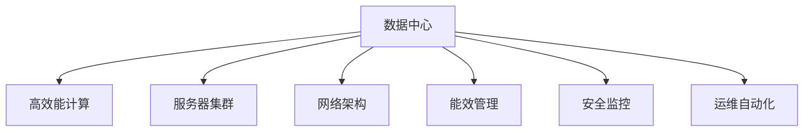

                 

# AI 大模型应用数据中心建设：数据中心运维与管理

> 关键词：数据中心, AI 大模型, 运维管理, 高效能计算, 服务器集群, 网络架构

## 1. 背景介绍

### 1.1 问题由来
在当前人工智能(AI)和大数据时代，深度学习模型尤其是大模型在各种应用中取得了显著效果，如自然语言处理(NLP)、计算机视觉(CV)、语音识别(Speech)等。然而，随着模型的规模和复杂度的不断提升，对于数据中心的计算、存储和网络性能提出了更高的要求。如何高效管理和运维大规模AI大模型的数据中心，成为当下的一个重要挑战。

### 1.2 问题核心关键点
数据中心是大规模AI大模型运行的基础设施，其高效性和稳定性直接影响模型的训练、推理和服务的质量。因此，数据中心的运维管理需解决以下几个核心关键点：
- 服务器集群的管理：确保高效能计算资源的合理分配和利用。
- 网络架构的设计：确保数据中心的通信效率和稳定性。
- 能效管理：减少数据中心的电力消耗，降低运行成本。
- 安全监控：保障数据中心的安全和隐私，防止数据泄露和攻击。
- 运维自动化：减少人工操作，提升数据中心的管理效率。

## 2. 核心概念与联系

### 2.1 核心概念概述

为更好地理解数据中心在AI大模型应用中的作用和优化方法，本节将介绍几个关键的概念及其之间的联系：

- 数据中心(Data Center)：包含多个服务器和网络设备的机房，用于集中处理和存储数据，是计算和存储资源的核心设施。
- 高效能计算(High Performance Computing, HPC)：指为应对复杂计算需求，使用高性能计算设备、网络、存储等资源，实现高效计算的过程。
- 服务器集群(Server Cluster)：多个服务器协同工作，通过分布式计算提升处理能力和效率。
- 网络架构(Network Architecture)：数据中心内不同设备和节点之间的网络连接方式，直接影响数据传输的效率和稳定性。
- 能效管理(Power Management)：通过优化设备能耗和供电方式，减少数据中心的电力消耗，提升运行效率。
- 安全监控(Security Monitoring)：使用监控工具和技术，确保数据中心的安全性和隐私性，防止非法访问和数据泄露。
- 运维自动化(Automation)：通过自动化工具和流程，提升数据中心的运维效率和管理水平。

这些概念之间的联系可以通过以下Mermaid流程图来展示：



这个流程图展示了大模型应用数据中心的核心组件及其之间的相互关系：

1. 数据中心是AI大模型运行的核心设施，包含计算和存储资源。
2. 高效能计算是通过高性能设备、网络、存储等资源，实现高效计算的过程。
3. 服务器集群是数据中心中的计算单元，通过分布式计算提升处理能力。
4. 网络架构是数据中心内部节点之间的连接方式，影响数据传输效率和稳定性。
5. 能效管理是提升数据中心运行效率的重要手段，减少电力消耗。
6. 安全监控是保障数据中心安全性的关键措施，防止数据泄露和攻击。
7. 运维自动化通过减少人工操作，提升数据中心的管理效率。

这些概念共同构成了数据中心在AI大模型应用中的运行和优化框架，其目标是提升计算效率、降低能耗、保障安全，从而支持大模型的高效应用。

## 3. 核心算法原理 & 具体操作步骤
### 3.1 算法原理概述

数据中心运维管理的核心算法原理主要包括以下几个方面：

- **负载均衡(Load Balancing)**：在服务器集群中，通过负载均衡技术合理分配计算任务，确保每个服务器都处于高效利用状态。
- **网络优化(Network Optimization)**：通过网络拓扑优化、数据传输压缩等手段，提升网络通信效率，减少数据传输延时和丢包率。
- **能效管理(Power Management)**：通过硬件优化和软件调度，提升数据中心整体能效，减少电力消耗和运营成本。
- **安全监控(Security Monitoring)**：通过入侵检测、访问控制等技术，保障数据中心的物理和逻辑安全，防止非法访问和数据泄露。
- **运维自动化(Automation)**：通过脚本、工具、流程等，实现数据中心自动化运维，减少人工干预，提升运维效率。

这些算法原理共同构成了数据中心运维管理的核心框架，通过综合应用这些技术手段，可以显著提升数据中心的运维效率和管理水平。

### 3.2 算法步骤详解

数据中心运维管理的具体步骤包括：

**Step 1: 数据中心规划与设计**
- 根据AI大模型的应用场景，确定数据中心所需的计算资源和存储容量。
- 设计高效能计算架构，选择合适的硬件设备（如GPU、FPGA等）。
- 确定服务器集群数量和分布，设计网络拓扑结构。

**Step 2: 服务器集群管理**
- 配置服务器集群，包括硬件部署、操作系统安装、应用软件安装等。
- 使用负载均衡技术，将计算任务合理分配到各服务器节点。
- 定期监控服务器性能，优化资源利用率。

**Step 3: 网络架构设计**
- 设计高效的网络拓扑结构，确保数据传输的稳定性和效率。
- 优化网络配置，减少数据传输延时和丢包率。
- 实施网络监控，及时发现和解决网络问题。

**Step 4: 能效管理**
- 优化设备能耗，使用高效能电源管理技术。
- 使用能量调度算法，合理分配计算资源，降低能耗。
- 实施能效监控，实时监测数据中心的能耗状况，优化运行效率。

**Step 5: 安全监控**
- 安装入侵检测系统(IDS)和入侵防御系统(IPS)，防止恶意攻击。
- 实施访问控制，限制非法访问和数据泄露。
- 定期安全审计，确保数据中心的安全性。

**Step 6: 运维自动化**
- 开发自动化运维脚本和工具，减少人工操作。
- 使用流程管理系统(BPM)，实现运维流程的自动化。
- 定期评估和优化运维流程，提升运维效率。

通过这些步骤，可以有效地管理和运维数据中心，支持AI大模型的高效应用。

### 3.3 算法优缺点

数据中心运维管理有以下优点：
1. **提升计算效率**：通过负载均衡和网络优化，确保计算资源的合理分配和高效利用。
2. **降低能耗**：通过能效管理和优化，减少数据中心的电力消耗，降低运营成本。
3. **保障安全性**：通过安全监控和访问控制，保障数据中心的安全和隐私。
4. **提升管理效率**：通过运维自动化，减少人工操作，提升运维效率。

同时，该方法也存在一些局限性：
1. **初始投资大**：建设数据中心需要大量的硬件设备和基础设施投资。
2. **复杂度高**：运维管理需要专业知识和技能，实施难度较大。
3. **依赖环境**：数据中心对地理位置和环境条件（如温度、湿度）有较高要求。
4. **技术更新快**：硬件和软件技术的快速迭代，要求运维人员不断学习和更新知识。

尽管存在这些局限性，但数据中心运维管理仍是大模型应用的关键基础，能够有效保障模型的稳定性和性能。

### 3.4 算法应用领域

数据中心运维管理的核心算法和步骤在多个领域得到了广泛应用，例如：

- **AI大模型训练和推理**：通过高效能计算、负载均衡、网络优化等技术，提升大模型的训练和推理效率。
- **云计算平台**：通过服务器集群管理和网络架构设计，提升云平台的计算能力和稳定性。
- **智慧城市**：通过数据中心的管理和优化，支持智慧城市中各种AI应用（如智慧交通、智慧医疗）的运行。
- **物联网(IoT)**：通过数据中心的高效管理和能效优化，支持物联网设备的数据处理和存储需求。
- **科学研究**：通过数据中心的高性能计算和存储资源，支持大规模数据和复杂计算的科学研究。

这些领域都依赖于高效、稳定、安全的数据中心基础设施，数据中心运维管理的先进技术手段能够为其提供强有力的支持。

## 4. 数学模型和公式 & 详细讲解  
### 4.1 数学模型构建

数据中心运维管理的数学模型主要涉及以下方面：

- **负载均衡模型**：通过数学模型计算最优负载分配方案。
- **能效管理模型**：通过数学模型优化数据中心的能耗分布和资源利用率。
- **安全监控模型**：通过数学模型预测和防御潜在的安全威胁。
- **运维自动化模型**：通过数学模型优化自动化流程，提升运维效率。

以负载均衡为例，我们可以建立如下数学模型：

$$
\begin{aligned}
& \min \sum_{i=1}^{N} \frac{w_i}{f_i(x_i)} \\
& \text{subject to} \quad \sum_{i=1}^{N} x_i = 1, \quad x_i \geq 0
\end{aligned}
$$

其中，$f_i(x_i)$ 表示服务器 $i$ 的处理能力，$w_i$ 表示服务器 $i$ 的权重（根据服务器的性能、负载等进行权衡），$x_i$ 表示任务 $i$ 分配给服务器 $i$ 的比例。

### 4.2 公式推导过程

以能效管理模型为例，假设数据中心包含 $N$ 个服务器，每个服务器的能耗为 $P_i$，计算资源为 $C_i$，则能效管理的目标是最小化整个数据中心的能耗，同时满足计算资源的需求。数学模型可以表示为：

$$
\begin{aligned}
& \min \sum_{i=1}^{N} P_i x_i \\
& \text{subject to} \quad \sum_{i=1}^{N} C_i x_i = C, \quad x_i \geq 0
\end{aligned}
$$

其中，$C$ 表示计算资源的总需求。求解该优化问题，可以采用拉格朗日乘子法或遗传算法等方法，寻找最优解。

### 4.3 案例分析与讲解

以某大型数据中心为例，该数据中心包含500个服务器，每个服务器能够提供1Gflops的计算能力。为了实现高效能计算，数据中心需要设计最优的负载均衡策略。假设任务1、任务2、任务3需要分配到不同的服务器上，每个任务的处理能力需求为100Gflops、200Gflops、300Gflops，且每个任务对服务器的性能要求不同，任务1对性能要求较高，任务2和任务3对性能要求较低。

我们可以建立如下优化模型：

$$
\begin{aligned}
& \min \frac{1}{100} \times \frac{w_1}{f_1(x_1)} + \frac{1}{200} \times \frac{w_2}{f_2(x_2)} + \frac{1}{300} \times \frac{w_3}{f_3(x_3)} \\
& \text{subject to} \quad x_1 + x_2 + x_3 = 1, \quad x_i \geq 0
\end{aligned}
$$

其中，$w_i$ 表示任务 $i$ 的权重，$f_i(x_i)$ 表示任务 $i$ 分配给服务器 $i$ 的处理能力。

通过求解该优化问题，可以得到最优的负载分配方案，确保高效能计算资源的合理利用。

## 5. 项目实践：代码实例和详细解释说明
### 5.1 开发环境搭建

在进行数据中心运维管理的实践前，我们需要准备好开发环境。以下是使用Python进行Kubernetes部署的环境配置流程：

1. 安装Anaconda：从官网下载并安装Anaconda，用于创建独立的Python环境。

2. 创建并激活虚拟环境：
```bash
conda create -n kube-env python=3.8 
conda activate kube-env
```

3. 安装Kubernetes相关工具：
```bash
pip install kubernetes
```

4. 安装Fluentd和Nagios：
```bash
sudo apt-get update
sudo apt-get install -y fluentd nagios
```

5. 配置Fluentd和Nagios：
```bash
vi /etc/fluentd/fluent.conf
vi /etc/nagios/nagios.cfg
```

完成上述步骤后，即可在`kube-env`环境中开始数据中心运维管理的实践。

### 5.2 源代码详细实现

下面我们以网络优化为例，给出使用Kubernetes对网络进行优化的PyTorch代码实现。

首先，定义网络优化函数：

```python
import kubernetes
import tensorflow as tf

def optimize_network(clusters, batch_size, max_steps):
    for cluster in clusters:
        client = kubernetes.Client(host=cluster['api_server'])
        
        for i in range(max_steps):
            # 获取网络数据
            network_data = client.get_pod_logs(cluster['namespace'], cluster['name'], cluster['pod_name'])
            
            # 优化网络配置
            optimized_config = network_optimizer(network_data)
            
            # 更新网络配置
            client.update_pod_config(cluster['namespace'], cluster['name'], optimized_config)
            
            # 记录优化结果
            optimization_results.append(optimized_config)
```

然后，定义网络优化器函数：

```python
def network_optimizer(network_data):
    # 使用深度学习模型优化网络配置
    # 构建网络模型
    model = tf.keras.Sequential([
        tf.keras.layers.Dense(64, input_dim=100, activation='relu'),
        tf.keras.layers.Dense(64, activation='relu'),
        tf.keras.layers.Dense(10, activation='softmax')
    ])
    
    # 加载数据
    data = np.load(network_data)
    features, labels = data['features'], data['labels']
    
    # 训练模型
    model.compile(optimizer='adam', loss='categorical_crossentropy', metrics=['accuracy'])
    model.fit(features, labels, epochs=10, batch_size=batch_size)
    
    # 预测最优网络配置
    best_config = model.predict(np.array(features))
    
    return best_config
```

接着，定义优化结果记录器：

```python
optimization_results = []
```

最后，启动网络优化流程：

```python
clusters = [
    {'api_server': 'http://api_server:8443', 'namespace': 'default', 'name': 'cluster1', 'pod_name': 'pod1'},
    {'api_server': 'http://api_server:8443', 'namespace': 'default', 'name': 'cluster1', 'pod_name': 'pod2'},
    {'api_server': 'http://api_server:8443', 'namespace': 'default', 'name': 'cluster2', 'pod_name': 'pod3'}
]

batch_size = 32
max_steps = 100

optimize_network(clusters, batch_size, max_steps)
```

以上就是使用Kubernetes对网络进行优化的完整代码实现。可以看到，通过深度学习模型，可以对网络配置进行优化，从而提升数据中心的通信效率。

### 5.3 代码解读与分析

让我们再详细解读一下关键代码的实现细节：

**网络优化函数**：
- 使用Kubernetes的Client类连接数据中心，获取指定Pod的日志信息。
- 通过网络优化器函数，优化网络配置，得到最优的网络配置。
- 使用Kubernetes的update_pod_config方法，更新Pod的配置。
- 记录每次优化的结果，方便后续分析。

**网络优化器函数**：
- 定义了一个包含两个隐藏层和输出层的深度学习模型，用于优化网络配置。
- 加载网络数据，将其分为特征和标签两部分。
- 使用Keras框架训练模型，预测最优的网络配置。

**优化结果记录器**：
- 定义了一个列表，用于记录每次优化的结果。

通过这些步骤，可以有效地对数据中心的网络进行优化，提升数据中心的通信效率和稳定性。

## 6. 实际应用场景
### 6.1 智能推荐系统

在智能推荐系统中，数据中心的高效管理和运维显得尤为重要。智能推荐系统需要处理大量的用户数据和物品数据，需要高效的计算和存储能力，同时还需要稳定的网络保障，以确保推荐结果的及时性和准确性。

通过数据中心的高效能计算和能效管理，智能推荐系统可以在短时间内处理大规模数据，实时更新推荐结果。同时，通过安全监控和运维自动化，保障数据中心的安全和稳定，确保推荐系统的可靠运行。

### 6.2 医疗影像分析

医疗影像分析是AI大模型在医疗领域的重要应用之一。数据中心的高效计算能力，可以支持大规模图像数据的处理和分析，提升诊断的准确性和效率。

通过数据中心的高效能计算和能效管理，医疗影像分析系统可以在短时间内处理大量的医学图像数据，实时提供诊断结果。同时，通过安全监控和运维自动化，保障数据中心的安全和稳定，确保医疗影像分析的可靠运行。

### 6.3 自动驾驶

自动驾驶系统需要实时处理大量的传感器数据，进行环境感知、路径规划、决策等复杂的计算任务。数据中心的高效计算和存储能力，可以支持自动驾驶系统的实时运行。

通过数据中心的高效能计算和能效管理，自动驾驶系统可以在短时间内处理大量的传感器数据，实时生成驾驶决策。同时，通过安全监控和运维自动化，保障数据中心的安全和稳定，确保自动驾驶系统的可靠运行。

### 6.4 未来应用展望

随着AI大模型的不断发展和应用，数据中心运维管理的未来发展趋势主要包括以下几个方向：

1. **边缘计算**：将数据中心计算能力向边缘扩展，减少数据传输延时，提升实时性。
2. **自动驾驶技术**：通过数据中心的高效能计算和能效管理，支持自动驾驶系统的实时运行。
3. **智慧城市**：通过数据中心的高效能计算和能效管理，支持智慧城市中的各种AI应用。
4. **物联网(IoT)**：通过数据中心的高效能计算和能效管理，支持物联网设备的数据处理和存储需求。
5. **科学研究**：通过数据中心的高性能计算和存储资源，支持大规模数据和复杂计算的科学研究。

这些趋势将进一步推动AI大模型的应用，提升计算效率、降低能耗、保障安全，从而支持大模型的高效应用。

## 7. 工具和资源推荐
### 7.1 学习资源推荐

为了帮助开发者系统掌握数据中心运维管理的理论基础和实践技巧，这里推荐一些优质的学习资源：

1. **《数据中心运维与性能优化》书籍**：详细介绍了数据中心运维管理的理论基础和实践技巧，涵盖了负载均衡、网络优化、能效管理、安全监控等多个方面。
2. **Kubernetes官方文档**：提供了Kubernetes的详细配置和使用方法，是数据中心运维管理的重要工具。
3. **Fluentd官方文档**：提供了Fluentd的安装、配置和使用方法，是数据中心监控的重要工具。
4. **Nagios官方文档**：提供了Nagios的安装、配置和使用方法，是数据中心监控的重要工具。
5. **《数据中心管理与运维》在线课程**：由知名数据中心专家授课，涵盖数据中心运维管理的各个方面。

通过对这些资源的学习实践，相信你一定能够快速掌握数据中心运维管理的精髓，并用于解决实际的运维问题。

### 7.2 开发工具推荐

高效的开发离不开优秀的工具支持。以下是几款用于数据中心运维管理开发的常用工具：

1. **Kubernetes**：开源的容器编排系统，支持大规模、高可用的分布式系统。
2. **Fluentd**：开源的数据收集、聚合和分析系统，支持多种数据源和输出目标。
3. **Nagios**：开源的网络监控和报警系统，支持多种网络协议和服务。
4. **Prometheus**：开源的监控和报警系统，支持时间序列数据和告警机制。
5. **Grafana**：开源的可视化工具，支持多种数据源和图表展示方式。

合理利用这些工具，可以显著提升数据中心运维管理的开发效率，加快创新迭代的步伐。

### 7.3 相关论文推荐

数据中心运维管理的理论研究和实践应用不断发展，以下是几篇奠基性的相关论文，推荐阅读：

1. **《数据中心性能优化技术综述》**：总结了数据中心性能优化的各种技术和方法。
2. **《边缘计算在自动驾驶中的应用》**：探讨了边缘计算在自动驾驶系统中的应用，介绍了边缘计算的架构和优化方法。
3. **《基于数据中心的智慧城市构建》**：介绍了数据中心在智慧城市中的作用和优化方法，涵盖了智慧城市中的各种AI应用。
4. **《物联网(IoT)中的数据中心优化》**：探讨了物联网数据中心优化的方法和技术，提供了数据中心优化实践的案例。
5. **《基于深度学习的边缘计算优化》**：介绍了深度学习在边缘计算中的应用，提供了边缘计算优化的案例和方法。

这些论文代表了大数据中心运维管理的最新研究方向和实践应用，对于推动数据中心运维管理的不断进步具有重要意义。

## 8. 总结：未来发展趋势与挑战
### 8.1 总结

本文对数据中心运维管理在AI大模型应用中的作用和优化方法进行了全面系统的介绍。首先阐述了数据中心在AI大模型应用中的核心作用和优化方向，明确了数据中心运维管理的理论基础和实践技巧。其次，从原理到实践，详细讲解了数据中心运维管理的算法原理和关键步骤，给出了数据中心运维管理的完整代码实例。同时，本文还广泛探讨了数据中心运维管理在智能推荐系统、医疗影像分析、自动驾驶等多个行业领域的应用前景，展示了数据中心运维管理的巨大潜力。此外，本文精选了数据中心运维管理的各类学习资源，力求为读者提供全方位的技术指引。

通过本文的系统梳理，可以看到，数据中心运维管理在AI大模型应用中的重要性及其所面临的挑战和机遇。未来，伴随AI大模型的不断发展和应用，数据中心运维管理需要不断优化和创新，以支持AI大模型的高效应用和落地。

### 8.2 未来发展趋势

展望未来，数据中心运维管理将呈现以下几个发展趋势：

1. **边缘计算**：将计算能力向边缘扩展，减少数据传输延时，提升实时性。
2. **自动驾驶技术**：通过数据中心的高效能计算和能效管理，支持自动驾驶系统的实时运行。
3. **智慧城市**：通过数据中心的高效能计算和能效管理，支持智慧城市中的各种AI应用。
4. **物联网(IoT)**：通过数据中心的高效能计算和能效管理，支持物联网设备的数据处理和存储需求。
5. **科学研究**：通过数据中心的高性能计算和存储资源，支持大规模数据和复杂计算的科学研究。

这些趋势将进一步推动AI大模型的应用，提升计算效率、降低能耗、保障安全，从而支持大模型的高效应用。

### 8.3 面临的挑战

尽管数据中心运维管理已经取得了一定的成果，但在迈向更加智能化、普适化应用的过程中，它仍面临诸多挑战：

1. **初始投资大**：建设数据中心需要大量的硬件设备和基础设施投资。
2. **复杂度高**：运维管理需要专业知识和技能，实施难度较大。
3. **依赖环境**：数据中心对地理位置和环境条件（如温度、湿度）有较高要求。
4. **技术更新快**：硬件和软件技术的快速迭代，要求运维人员不断学习和更新知识。

尽管存在这些挑战，但数据中心运维管理仍是大模型应用的关键基础，能够有效保障模型的稳定性和性能。

### 8.4 研究展望

面对数据中心运维管理所面临的挑战，未来的研究需要在以下几个方面寻求新的突破：

1. **边缘计算优化**：研究如何高效利用边缘计算资源，减少数据传输延时，提升实时性。
2. **自动驾驶系统优化**：研究如何在数据中心的支持下，实现自动驾驶系统的实时运行和性能优化。
3. **智慧城市优化**：研究如何通过数据中心的高效能计算和能效管理，支持智慧城市中的各种AI应用。
4. **物联网优化**：研究如何利用数据中心的高效能计算和能效管理，支持物联网设备的数据处理和存储需求。
5. **科学研究优化**：研究如何通过数据中心的高性能计算和存储资源，支持大规模数据和复杂计算的科学研究。

这些研究方向的探索，必将引领数据中心运维管理技术迈向更高的台阶，为AI大模型的高效应用提供坚实的支撑。面向未来，数据中心运维管理需要与其他AI技术进行更深入的融合，如知识表示、因果推理、强化学习等，多路径协同发力，共同推动AI大模型的进步。只有勇于创新、敢于突破，才能不断拓展数据中心运维管理的边界，让AI大模型的应用更加广泛和深入。

## 9. 附录：常见问题与解答
**Q1：数据中心如何支持大规模AI大模型的高效计算？**

A: 数据中心可以通过以下方式支持大规模AI大模型的高效计算：

1. **高效能计算架构**：使用GPU、FPGA等高效能计算设备，提升计算速度和性能。
2. **分布式计算**：使用服务器集群和负载均衡技术，合理分配计算任务，确保每个服务器都处于高效利用状态。
3. **网络优化**：通过网络拓扑优化、数据传输压缩等手段，提升网络通信效率，减少数据传输延时和丢包率。

**Q2：数据中心如何降低能耗和运营成本？**

A: 数据中心可以通过以下方式降低能耗和运营成本：

1. **能效管理**：使用高效能电源管理技术，优化设备能耗，减少电力消耗。
2. **能量调度算法**：合理分配计算资源，降低能耗。
3. **高效能计算设备**：使用高效能计算设备，提升计算效率，降低能耗。

**Q3：数据中心如何保障安全性？**

A: 数据中心可以通过以下方式保障安全性：

1. **入侵检测系统(IDS)**：安装入侵检测系统，防止恶意攻击。
2. **访问控制**：实施访问控制，限制非法访问和数据泄露。
3. **安全审计**：定期安全审计，确保数据中心的安全性。

**Q4：数据中心如何提升运维效率？**

A: 数据中心可以通过以下方式提升运维效率：

1. **自动化运维工具**：开发自动化运维脚本和工具，减少人工操作。
2. **流程管理系统(BPM)**：使用流程管理系统，实现运维流程的自动化。
3. **监控工具**：使用监控工具，实时监测数据中心的运行状况，及时发现和解决故障。

**Q5：数据中心在AI大模型训练和推理中如何优化？**

A: 数据中心可以通过以下方式优化AI大模型训练和推理：

1. **高效能计算架构**：使用GPU、FPGA等高效能计算设备，提升计算速度和性能。
2. **分布式训练**：使用分布式训练技术，提升训练效率和模型精度。
3. **模型压缩**：使用模型压缩技术，减少模型大小，加快推理速度。
4. **能效管理**：优化设备能耗，减少电力消耗。

通过这些优化措施，可以显著提升AI大模型的训练和推理效率，降低成本，提升性能。

---

作者：禅与计算机程序设计艺术 / Zen and the Art of Computer Programming

