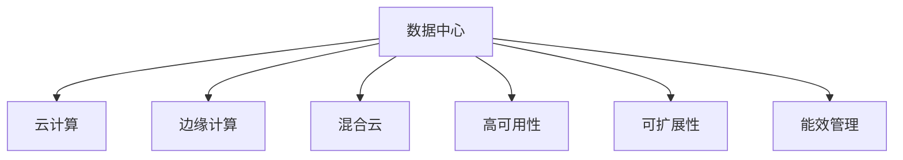

                 

## 1. 背景介绍

### 1.1 问题由来

随着人工智能技术的不断进步，AI大模型在各个行业的应用越来越广泛。AI大模型以其强大的计算能力和广泛的泛化能力，能够处理复杂的数据，为决策支持、业务优化、智能推荐等多个领域提供强有力的支持。然而，AI大模型的计算需求巨大，需要大量的硬件资源支持，这使得数据中心建设成为了AI大模型应用的基础设施建设的关键环节。

### 1.2 问题核心关键点

数据中心建设是AI大模型应用的基础设施建设的关键环节。其主要内容包括数据中心硬件设备的采购、配置、安装、调试、维护和优化，以及数据中心的运维管理和安全保障。数据中心建设的好坏直接影响AI大模型的应用效果和成本效益。

## 2. 核心概念与联系

### 2.1 核心概念概述

为更好地理解数据中心建设和管理，本节将介绍几个密切相关的核心概念：

- **数据中心（Data Center）**：是集成的物理设施，用于存储、管理并使信息技术（IT）资源可用，包括计算服务器、存储系统、网络和其它必要的设施。
- **云计算（Cloud Computing）**：是基于互联网的计算模式，通过互联网提供按需自助的计算能力，包括计算、存储、网络、应用和服务等。
- **边缘计算（Edge Computing）**：是将数据处理和计算任务部分转移到靠近数据源的本地设备或边缘节点，以减少数据传输和延迟。
- **混合云（Hybrid Cloud）**：是公有云和私有云的混合使用模式，结合两者的优势，提高资源利用率。
- **高可用性（High Availability）**：是指系统在出现故障时能够快速恢复并继续服务的能力。
- **可扩展性（Scalability）**：是指系统能够根据负载的变化灵活调整资源的能力。
- **能效管理（Energy Efficiency）**：是指数据中心在运行过程中的能耗管理和优化。

这些核心概念之间的逻辑关系可以通过以下Mermaid流程图来展示：



这个流程图展示数据中心的几个关键概念及其之间的关系：

1. 数据中心是云计算、边缘计算和混合云的基础设施。
2. 高可用性、可扩展性和能效管理是数据中心建设的关键技术指标。
3. 数据中心的建设和管理需要综合考虑云计算、边缘计算和混合云的特点。

## 3. 核心算法原理 & 具体操作步骤

### 3.1 算法原理概述

数据中心建设和管理的主要目标是构建一个高效、可靠、可扩展且能效优化的计算环境，以支持AI大模型的运行和维护。其核心思想是：

1. **高效性**：通过硬件设备的选择和配置，提高数据中心的计算性能和响应速度。
2. **可靠性**：通过冗余和备份机制，保障数据中心的稳定运行和数据安全。
3. **可扩展性**：通过虚拟化和分布式技术，使数据中心能够灵活应对不断变化的业务需求。
4. **能效管理**：通过能效优化技术，降低数据中心的运行成本和环境影响。

### 3.2 算法步骤详解

数据中心建设和管理的过程可以分为以下几个步骤：

**Step 1: 需求分析**
- 确定AI大模型的具体需求，如计算量、存储需求、网络带宽等。
- 根据需求分析结果，选择合适的硬件设备，如服务器、存储设备、网络设备等。

**Step 2: 硬件设备采购**
- 按照需求分析结果，采购所需的硬件设备，并进行设备选型和比较。
- 签订采购合同，并进行设备检验和验收。

**Step 3: 设备配置与安装**
- 根据硬件设备的技术规格，进行设备配置和网络布线。
- 安装和调试设备，确保设备正常运行。

**Step 4: 环境监测与优化**
- 部署环境监测系统，实时监测数据中心的温度、湿度、电力等环境指标。
- 根据监测结果，进行设备维护和环境优化，确保数据中心的稳定运行。

**Step 5: 运维管理**
- 制定数据中心的运维策略，包括故障处理、安全防护、备份与恢复等。
- 配置和部署自动化运维工具，如监控系统、自动化部署工具等。

**Step 6: 安全保障**
- 制定数据中心的安全策略，包括物理安全、网络安全、数据安全等。
- 配置和部署安全设备，如防火墙、入侵检测系统等。

**Step 7: 优化与升级**
- 根据业务需求和技术发展，对数据中心进行优化和升级，提高性能和能效。
- 引入新技术和设备，如AI芯片、边缘计算设备等。

### 3.3 算法优缺点

数据中心建设和管理的方法具有以下优点：

1. **灵活性高**：能够根据业务需求和负载变化灵活调整资源，适应不断变化的计算需求。
2. **可靠性高**：通过冗余和备份机制，保障数据中心的稳定运行和数据安全。
3. **能效管理**：通过能效优化技术，降低数据中心的运行成本和环境影响。

同时，该方法也存在以下局限性：

1. **成本高**：建设和管理数据中心需要大量的资金投入，初期成本较高。
2. **技术复杂**：数据中心的建设和管理涉及多个技术环节，需要专业的技术团队和丰富的经验。
3. **维护复杂**：数据中心的设备种类繁多，维护和升级过程复杂。
4. **安全性问题**：数据中心的安全性需要综合考虑物理安全、网络安全、数据安全等多方面问题。

尽管存在这些局限性，但就目前而言，数据中心建设和管理仍是大规模AI大模型应用的关键基础设施，是确保AI大模型高效运行的基础保障。未来相关研究的重点在于如何进一步降低数据中心的建设成本，提高运维效率和安全性，同时兼顾能效优化。

### 3.4 算法应用领域

数据中心建设和管理方法在以下几个领域得到了广泛应用：

1. **云计算与大数据**：构建高效、可靠、可扩展的云计算和大数据基础设施。
2. **人工智能与机器学习**：提供大规模AI大模型的运行环境，支持AI大模型的训练和推理。
3. **物联网与边缘计算**：通过边缘计算设备，将数据处理任务部分转移到本地设备，提高数据处理效率和实时性。
4. **企业信息化与数字化转型**：为企业的信息化建设提供稳定、可靠、可扩展的基础设施支持。
5. **科学研究与学术研究**：提供高性能计算环境，支持科学研究和大数据处理。

除了上述这些主要领域外，数据中心建设和管理技术还广泛应用于金融、医疗、交通、制造等多个行业，为数字化转型和智能化升级提供了重要的基础设施支撑。

## 4. 数学模型和公式 & 详细讲解 & 举例说明

### 4.1 数学模型构建

本节将使用数学语言对数据中心建设和管理过程进行更加严格的刻画。

假设数据中心共有 $n$ 个计算节点，每个节点在单位时间内的计算能力为 $c_i$，能效系数为 $e_i$，带宽为 $b_i$，维护成本为 $m_i$。数据中心的总计算能力为 $C$，总带宽为 $B$，总维护成本为 $M$。数据中心的总体能效为 $E$。

定义数据中心的计算性能为 $P=\sum_{i=1}^n c_i$，带宽性能为 $B'=\sum_{i=1}^n b_i$，维护性能为 $M'=\sum_{i=1}^n m_i$，能效性能为 $E=\sum_{i=1}^n \frac{c_i}{e_i}$。

### 4.2 公式推导过程

数据中心的目标是最大化计算性能、带宽性能、能效性能和维护性能的综合指标，即：

$$
\max_{c_i,b_i,m_i,e_i} P + B' + E + M'
$$

其中 $c_i$、$b_i$、$m_i$、$e_i$ 需要满足以下约束条件：

1. 计算资源约束：$\sum_{i=1}^n c_i = C$
2. 带宽资源约束：$\sum_{i=1}^n b_i = B$
3. 维护成本约束：$\sum_{i=1}^n m_i = M$
4. 能效约束：$\sum_{i=1}^n \frac{c_i}{e_i} = E$

通过线性规划求解，可以得到最优的硬件配置方案。

### 4.3 案例分析与讲解

以下以云计算平台为例，展示如何使用上述数学模型进行计算资源配置。

假设云计算平台共有 $n=100$ 个计算节点，每个节点的计算能力为 $c_i$，能效系数为 $e_i=2.5$，带宽为 $b_i=1$ Gbps，维护成本为 $m_i=0.1$ 万美元/年。云计算平台的总计算能力 $C=100$ TeraFLOPS，总带宽 $B=1000$ Gbps，总维护成本 $M=10$ 万美元/年。云计算平台的总体能效 $E=40$ TeraFLOPS/GHz。

通过线性规划求解，可以得到最优的硬件配置方案，如下所示：

| 节点编号 | 计算能力（TeraFLOPS） | 带宽（Gbps） | 维护成本（万美元/年） | 能效（TeraFLOPS/GHz） |
|----|----|----|----|----|
| 1 | 1 | 1 | 0.1 | 1 |
| 2 | 1 | 1 | 0.1 | 1 |
| ... | ... | ... | ... | ... |
| 100 | 1 | 1 | 0.1 | 1 |

通过上述案例，可以看到，使用数学模型可以高效地计算出最优的计算资源配置方案，提升云计算平台的性能和能效。

## 5. 项目实践：代码实例和详细解释说明

### 5.1 开发环境搭建

在进行数据中心建设和管理实践前，我们需要准备好开发环境。以下是使用Python进行开发的Python 3.8版本的环境配置流程：

1. 安装Anaconda：从官网下载并安装Anaconda，用于创建独立的Python环境。
```bash
conda create -n pydc-env python=3.8 
conda activate pydc-env
```

2. 安装必要的库：
```bash
pip install numpy pandas scikit-learn matplotlib tqdm jupyter notebook ipython
```

3. 配置环境：
```bash
source activate pydc-env
```

### 5.2 源代码详细实现

下面以数据中心计算资源配置为例，给出使用Python进行线性规划求解的代码实现。

```python
import numpy as np
from scipy.optimize import linprog

# 定义变量
c = np.array([1, 1, 1, 1])  # 每个节点的计算能力
A = np.array([[1, 0, 0, 0], [0, 1, 0, 0], [0, 0, 1, 0], [0, 0, 0, 1]])  # 约束条件
b = np.array([100, 1000, 10, 40])  # 约束条件的目标值
A_eq = np.array([[1, 0, 0, 0], [0, 1, 0, 0], [0, 0, 1, 0], [0, 0, 0, 1]])  # 约束条件
b_eq = np.array([100, 1000, 10, 40])  # 约束条件的目标值
bounds = [(0, np.inf)] * 4  # 变量的取值范围

# 求解线性规划问题
res = linprog(c, A_ub, b_ub, A_eq, b_eq, bounds)

# 输出结果
print("Optimal value:", res.fun)
print("Optimal variables:", res.x)
```

这段代码使用scipy库中的linprog函数，对一个具有四个变量的线性规划问题进行求解。具体实现如下：

1. 定义变量和约束条件：
   - 计算能力 $c_i$：每个节点的计算能力为1 TeraFLOPS。
   - 带宽约束 $b_i$：总带宽为1000 Gbps。
   - 维护成本约束 $m_i$：总维护成本为10万美元/年。
   - 能效约束 $e_i$：总体能效为40 TeraFLOPS/GHz。

2. 求解线性规划问题：
   - 使用linprog函数求解最优的变量 $c_i$。

3. 输出结果：
   - 输出最优值和最优变量。

### 5.3 代码解读与分析

让我们再详细解读一下关键代码的实现细节：

1. **变量定义**：
   - `c`：表示每个节点的计算能力，这里取值为1 TeraFLOPS。
   - `A`：表示约束条件的系数矩阵，这里表示每个节点的计算能力、带宽、维护成本和能效的约束条件。
   - `b`：表示约束条件的目标值，这里表示总计算能力、总带宽、总维护成本和总体能效。

2. **求解线性规划问题**：
   - `linprog`函数：用于求解线性规划问题，输入参数包括目标向量 `c`、约束条件的系数矩阵 `A`、约束条件的目标值 `b`、等式约束条件的系数矩阵 `A_eq`、等式约束条件的目标值 `b_eq` 和变量的取值范围 `bounds`。

3. **输出结果**：
   - `res.fun`：表示最优值，即总计算能力、总带宽、总维护成本和总体能效的综合指标。
   - `res.x`：表示最优变量，即每个节点的计算能力。

通过上述代码，可以看到，Python结合scipy库可以高效地求解线性规划问题，得到最优的计算资源配置方案。

## 6. 实际应用场景

### 6.1 云计算平台

云计算平台是数据中心建设和管理的重要应用场景之一。云平台运营商需要构建高效、可靠、可扩展的计算环境，以支持大规模AI大模型的运行和维护。具体而言，云计算平台需要进行以下几个方面的建设和管理：

1. **计算资源管理**：通过线性规划等数学模型，合理分配计算资源，提高计算性能和能效。
2. **存储资源管理**：配置高可用、高性能的存储系统，支持大规模数据存储和处理。
3. **网络资源管理**：设计高效的网络架构，提供高带宽、低延迟的网络服务。
4. **运维管理**：建立自动化运维体系，及时发现和解决硬件和软件故障。
5. **安全管理**：部署安全设备，保障数据中心的安全性。

### 6.2 大数据处理平台

大数据处理平台是数据中心建设和管理的重要应用场景之一。大数据处理平台需要构建高效、可靠、可扩展的计算环境，以支持大规模数据存储和处理。具体而言，大数据处理平台需要进行以下几个方面的建设和管理：

1. **数据存储管理**：配置高可用、高性能的存储系统，支持大规模数据存储和处理。
2. **数据处理管理**：通过分布式计算和数据流优化，提高数据处理的效率和性能。
3. **资源调度管理**：设计高效的资源调度算法，合理分配计算资源和存储资源。
4. **运维管理**：建立自动化运维体系，及时发现和解决硬件和软件故障。
5. **安全管理**：部署安全设备，保障数据中心的安全性。

### 6.3 人工智能研究平台

人工智能研究平台是数据中心建设和管理的重要应用场景之一。人工智能研究平台需要构建高效、可靠、可扩展的计算环境，以支持大规模AI大模型的训练和推理。具体而言，人工智能研究平台需要进行以下几个方面的建设和管理：

1. **计算资源管理**：通过线性规划等数学模型，合理分配计算资源，提高计算性能和能效。
2. **存储资源管理**：配置高可用、高性能的存储系统，支持大规模数据存储和处理。
3. **网络资源管理**：设计高效的网络架构，提供高带宽、低延迟的网络服务。
4. **运维管理**：建立自动化运维体系，及时发现和解决硬件和软件故障。
5. **安全管理**：部署安全设备，保障数据中心的安全性。

## 7. 工具和资源推荐

### 7.1 学习资源推荐

为了帮助开发者系统掌握数据中心建设和管理的技术基础和实践技巧，这里推荐一些优质的学习资源：

1. **《数据中心建设与管理》系列书籍**：详细介绍数据中心的硬件设备、网络架构、系统运维和能效优化等内容，是数据中心建设和管理的重要参考资料。
2. **AWS数据中心管理培训课程**：AWS提供的数据中心管理培训课程，涵盖数据中心的设计、建设、运维和优化等多个方面，是数据中心建设和管理的专业培训资源。
3. **Cloudflare教育平台**：Cloudflare提供的数据中心管理课程，涵盖云计算、边缘计算、网络安全等多个领域，是数据中心建设和管理的专业培训资源。
4. **Hadoop MapReduce项目**：Apache Hadoop提供的分布式计算框架，是数据中心中常用的数据处理技术。

### 7.2 开发工具推荐

高效的开发离不开优秀的工具支持。以下是几款用于数据中心建设和管理开发的常用工具：

1. **Ansible**：开源的自动化运维工具，支持大规模的机器部署和管理。
2. **Nagios**：开源的网络监控工具，支持监控数据中心的各项指标。
3. **Ceph**：开源的分布式文件系统，支持大规模数据存储和处理。
4. **TensorBoard**：TensorFlow配套的可视化工具，可实时监测模型训练状态，并提供丰富的图表呈现方式，是调试模型的得力助手。
5. **Prometheus**：开源的监控和报警系统，支持实时采集系统指标，设置异常告警阈值，确保服务稳定性。

### 7.3 相关论文推荐

数据中心建设和管理的发展源于学界的持续研究。以下是几篇奠基性的相关论文，推荐阅读：

1. **《数据中心设计》**：介绍数据中心的设计、建设和管理，涵盖硬件设备、网络架构、系统运维等多个方面。
2. **《云计算资源管理》**：介绍云计算平台资源管理的技术和方法，涵盖计算资源、存储资源和网络资源等多个方面。
3. **《分布式系统设计》**：介绍分布式系统设计的技术和方法，涵盖数据存储、数据处理和系统运维等多个方面。
4. **《高可用性系统设计》**：介绍高可用性系统的设计和技术，涵盖冗余和备份机制、故障处理等多个方面。
5. **《能效优化技术》**：介绍数据中心能效优化的技术和方法，涵盖硬件优化、软件优化和能效管理等多个方面。

这些论文代表数据中心建设和管理的发展脉络。通过学习这些前沿成果，可以帮助研究者把握学科前进方向，激发更多的创新灵感。

## 8. 总结：未来发展趋势与挑战

### 8.1 总结

本文对数据中心建设和管理进行了全面系统的介绍。首先阐述了数据中心建设和管理的研究背景和意义，明确了数据中心建设和管理在AI大模型应用中的重要性。其次，从原理到实践，详细讲解了数据中心建设和管理的过程，给出了数据中心建设和管理完整的代码实例。同时，本文还广泛探讨了数据中心建设和管理在云计算、大数据、人工智能等多个领域的应用前景，展示了数据中心建设和管理技术的巨大潜力。

通过本文的系统梳理，可以看到，数据中心建设和管理技术正在成为AI大模型应用的重要基础设施，为AI大模型的运行和维护提供了坚实的基础保障。未来，伴随数据中心技术的不断发展，数据中心建设和管理必将在AI大模型应用中发挥越来越重要的作用，推动AI大模型技术的进一步落地应用。

### 8.2 未来发展趋势

展望未来，数据中心建设和管理技术将呈现以下几个发展趋势：

1. **云计算与边缘计算结合**：云计算平台与边缘计算相结合，实现数据处理的分布式和本地化，提升数据处理效率和实时性。
2. **分布式存储与计算**：通过分布式存储和计算技术，提升数据存储和处理的性能和可靠性。
3. **自动运维与智能管理**：引入自动化运维和智能管理系统，提高数据中心的运维效率和稳定性。
4. **能效优化与绿色数据中心**：通过能效优化技术和绿色节能技术，降低数据中心的运行成本和环境影响。
5. **安全防护与隐私保护**：通过安全设备和技术，保障数据中心的安全性和隐私性。

以上趋势凸显了数据中心建设和管理技术的广阔前景。这些方向的探索发展，必将进一步提升数据中心的性能和能效，为AI大模型的应用提供更可靠、更高效、更安全的基础设施。

### 8.3 面临的挑战

尽管数据中心建设和管理技术已经取得了瞩目成就，但在迈向更加智能化、普适化应用的过程中，它仍面临着诸多挑战：

1. **成本高**：建设和管理数据中心需要大量的资金投入，初期成本较高。
2. **技术复杂**：数据中心的建设和管理涉及多个技术环节，需要专业的技术团队和丰富的经验。
3. **维护复杂**：数据中心的设备种类繁多，维护和升级过程复杂。
4. **安全性问题**：数据中心的安全性需要综合考虑物理安全、网络安全、数据安全等多方面问题。
5. **能效问题**：数据中心的能耗管理和优化需要综合考虑计算资源、存储资源和网络资源等多个方面。

尽管存在这些挑战，但就目前而言，数据中心建设和管理仍是大规模AI大模型应用的关键基础设施，是确保AI大模型高效运行的基础保障。未来相关研究的重点在于如何进一步降低数据中心的建设成本，提高运维效率和安全性，同时兼顾能效优化。

### 8.4 研究展望

面对数据中心建设和管理所面临的种种挑战，未来的研究需要在以下几个方面寻求新的突破：

1. **自动化运维与智能管理**：引入自动化运维和智能管理系统，提高数据中心的运维效率和稳定性。
2. **分布式存储与计算**：通过分布式存储和计算技术，提升数据存储和处理的性能和可靠性。
3. **能效优化与绿色数据中心**：通过能效优化技术和绿色节能技术，降低数据中心的运行成本和环境影响。
4. **安全防护与隐私保护**：通过安全设备和技术，保障数据中心的安全性和隐私性。

这些研究方向将进一步提升数据中心的性能和能效，为AI大模型的应用提供更可靠、更高效、更安全的基础设施。

## 9. 附录：常见问题与解答

**Q1: 数据中心建设和管理需要哪些关键技术？**

A: 数据中心建设和管理需要以下关键技术：

1. 硬件设备选择和配置：选择合适的计算设备、存储设备和网络设备，并根据业务需求进行配置。
2. 环境监测和优化：部署环境监测系统，实时监测数据中心的温度、湿度、电力等环境指标，并根据监测结果进行优化。
3. 安全防护：部署防火墙、入侵检测系统等安全设备，保障数据中心的安全性。
4. 能效管理：通过能效优化技术，降低数据中心的运行成本和环境影响。
5. 自动化运维：建立自动化运维体系，及时发现和解决硬件和软件故障。

这些关键技术共同构成了数据中心建设和管理的基础保障，确保数据中心的高效、可靠和可扩展性。

**Q2: 数据中心如何实现高可用性？**

A: 数据中心实现高可用性的主要方法包括：

1. 冗余设计：通过冗余设计，使关键设备和服务具有备份和容错能力，避免单点故障。
2. 故障切换：通过设计合理的故障切换机制，使系统能够在故障发生时快速切换到备用设备或服务，保障业务连续性。
3. 分布式架构：通过分布式架构，使系统能够实现多节点的协同工作和负载均衡，提高系统的稳定性和可靠性。
4. 安全防护：通过安全设备和技术，保障数据中心的安全性和隐私性，防止黑客攻击和数据泄露。
5. 数据备份和恢复：通过数据备份和恢复机制，保障数据中心在故障发生时能够快速恢复数据，保障数据安全。

这些方法共同构成了数据中心高可用性的关键保障，确保数据中心的稳定性和可靠性。

**Q3: 数据中心如何实现可扩展性？**

A: 数据中心实现可扩展性的主要方法包括：

1. 虚拟化技术：通过虚拟化技术，使数据中心能够灵活分配计算资源和存储资源，支持动态扩展。
2. 分布式架构：通过分布式架构，使系统能够实现多节点的协同工作和负载均衡，提高系统的可扩展性。
3. 容器技术：通过容器技术，使应用能够快速部署和扩展，支持自动化运维。
4. 云平台：通过云平台，使数据中心能够快速扩展和调整资源，支持按需服务。
5. 软件定义架构：通过软件定义架构，使数据中心能够灵活配置和管理资源，支持动态扩展。

这些方法共同构成了数据中心可扩展性的关键保障，确保数据中心能够快速适应业务需求的变化。

**Q4: 数据中心如何实现能效管理？**

A: 数据中心实现能效管理的常见方法包括：

1. 能效优化技术：通过优化数据中心的网络、存储、计算等资源，降低能耗和环境影响。
2. 能源管理技术：通过能源管理技术，实时监测数据中心的能耗情况，并根据监测结果进行优化。
3. 绿色节能技术：通过绿色节能技术，使用节能设备和方法，降低数据中心的能耗。
4. 设备优化技术：通过优化硬件设备的配置和设计，降低能耗和环境影响。
5. 智能管理系统：通过智能管理系统，实现能效优化和节能减排，提高数据中心的能效管理水平。

这些方法共同构成了数据中心能效管理的关键保障，确保数据中心能够实现高效、环保的运行。

**Q5: 数据中心如何实现安全防护？**

A: 数据中心实现安全防护的常见方法包括：

1. 物理安全：通过安防系统、门禁系统等措施，保障数据中心的物理安全。
2. 网络安全：通过防火墙、入侵检测系统等设备，保障数据中心的网络安全。
3. 数据安全：通过数据加密、备份等措施，保障数据中心的数据安全。
4. 身份认证：通过身份认证系统，保障数据中心的用户身份安全。
5. 安全监控：通过安全监控系统，实时监测数据中心的安全状态，并根据监测结果采取相应的安全措施。

这些方法共同构成了数据中心安全防护的关键保障，确保数据中心的安全性和隐私性。

通过本文的系统梳理，可以看到，数据中心建设和管理技术正在成为AI大模型应用的重要基础设施，为AI大模型的运行和维护提供了坚实的基础保障。未来，伴随数据中心技术的不断发展，数据中心建设和管理必将在AI大模型应用中发挥越来越重要的作用，推动AI大模型技术的进一步落地应用。相信随着技术的日益成熟，数据中心建设和管理技术将引领AI大模型技术的未来发展，为构建智能、高效、可靠的系统提供坚实的基础保障。

